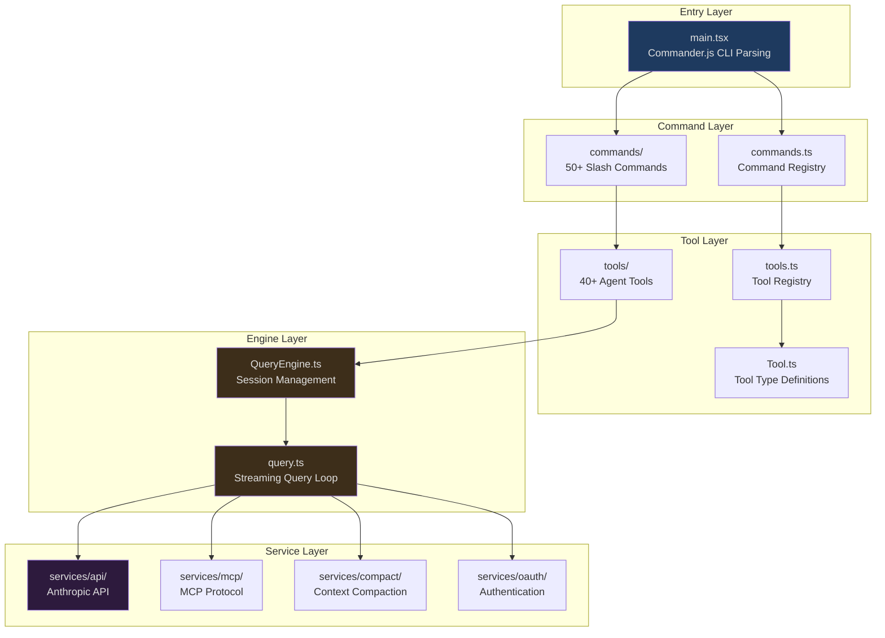
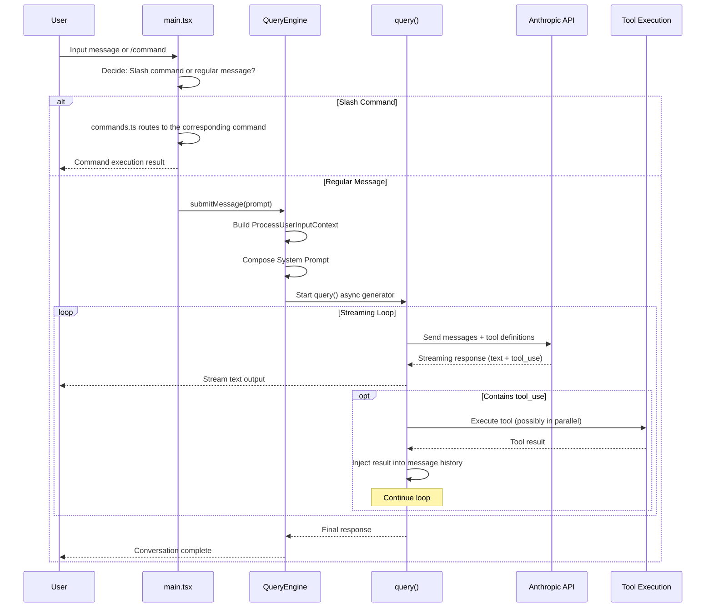
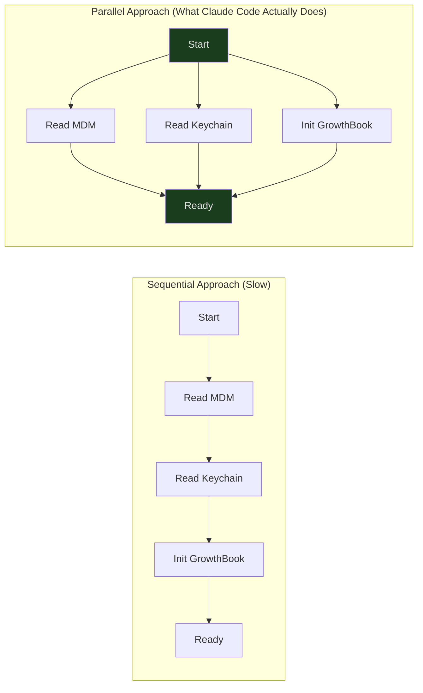

## Overview

On March 31, 2026, security researcher Chaofan Shou discovered that Anthropic's npm registry had exposed a `.map` file containing the complete, unobfuscated TypeScript source code for the Claude Code CLI. This source code comprises roughly 1,900 files and over 512,000 lines of code — this is not a simple command-line tool, but a full-fledged AI agent platform with exceptional engineering complexity.

This article is the first in the series. We won't dive into the implementation details of any single module (later articles will do that). Instead, we'll take a bird's-eye view of the entire codebase: What tech stack was chosen? Why were these choices made? How is the code organized? What layers does a user interaction pass through from input to output? Understanding these big-picture questions is a prerequisite for diving into any subsystem.

If you're a developer building AI tools, this article will help you understand the architectural blueprint of a production-grade AI CLI. If you're simply curious about how Claude Code works internally, this article will give you a clear overview of the whole system.

---

## Technology Choices: Why This Combination?

Opening up Claude Code's source code, the first surprising discovery is its tech stack:

| Category | Technology |
|----------|-----------|
| Runtime | Bun |
| Language | TypeScript (strict mode) |
| Terminal UI | React + Ink |
| CLI Parsing | Commander.js (extra-typings) |
| Schema Validation | Zod v4 |
| Code Search | ripgrep |
| Protocols | MCP SDK, LSP |
| API | Anthropic SDK |
| Telemetry | OpenTelemetry + gRPC |
| Authentication | OAuth 2.0, JWT, macOS Keychain |

### Why Bun Instead of Node.js?

Bun was chosen here not only for its startup speed (critical for CLI tools), but also for a key feature: **compile-time Feature Flags**.

```typescript
// src/main.tsx
import { feature } from 'bun:bundle'

const coordinatorModeModule = feature('COORDINATOR_MODE')
  ? require('./coordinator/coordinatorMode.js')
  : null

const assistantModule = feature('KAIROS')
  ? require('./assistant/index.js')
  : null
```

When `feature('COORDINATOR_MODE')` resolves to `false` at build time, Bun's bundler completely removes the entire `require()` branch — along with all its transitive dependencies — from the final output. This is not a runtime `if` check, but compile-time Dead Code Elimination. For a tool that needs to support multiple configurations simultaneously — standalone CLI mode, IDE integration mode (BRIDGE_MODE), voice mode (VOICE_MODE), background daemon mode (DAEMON), and more — this means each build artifact contains only the code it actually needs.

### Why Build a Command-Line Interface with React?

This may be the most counterintuitive choice. React was designed for the browser — but Claude Code's terminal interface is far more complex than a typical CLI: it needs to render streaming AI responses in real time, display tool execution progress bars, present file diffs, and show interactive permission approval dialogs. These interaction patterns are more similar to a web application than a traditional command line.

Ink swaps React's render target from the browser DOM to terminal characters. This means Claude Code can use React's component model, Hook system, and state management to build its UI, while outputting to the terminal. The `src/components/` directory contains over **140 React components**, from message rendering to permission dialogs, from file diff displays to progress indicators.

---

## Directory Structure and Layered Architecture

Claude Code's `src/` directory contains 33 top-level subdirectories. At first glance this looks daunting, but they map cleanly to a 5-layer architecture model:



Let's walk through each layer:

### Entry Layer: `main.tsx`

Everything starts with `main.tsx`. This file does three key things:

1. **Parses CLI arguments** — uses Commander.js to handle commands like `claude --model sonnet "fix the bug"`
2. **Initializes the runtime** — loads configuration, establishes API connections, sets up telemetry
3. **Starts the Ink render loop** — mounts the React component tree to the terminal

But the most interesting part is not what it does, but **how** it does it — the startup sequence is carefully optimized for parallel execution:

```typescript
// src/main.tsx:12-20
// These calls execute before any heavy imports
profileCheckpoint('main_tsx_entry')
startMdmRawRead()      // Read MDM config in parallel
startKeychainPrefetch() // Prefetch Keychain credentials in parallel
```

Before loading the rest of the modules, `main.tsx` has already kicked off MDM (Mobile Device Management) configuration reading and macOS Keychain credential prefetching. These two I/O operations run in parallel, rather than being called serially when needed. For a CLI tool that needs to start up quickly, this "start early, consume later" pattern is a critical performance optimization.

### Command Layer: `commands.ts` + `commands/`

When a user types slash commands like `/commit`, `/review`, or `/compact`, `commands.ts` routes them to the corresponding implementation. The command registry uses the same Feature Flag pattern as the tool system:

```typescript
// src/commands.ts:62-122
// Conditional imports: disabled commands are eliminated at build time
import { feature } from 'bun:bundle'

// When VOICE_MODE is off, the entire voice command code is absent from the final build
// When BRIDGE_MODE is off, IDE integration commands are removed
```

Note an interesting lazy loading pattern — for particularly heavy commands (like `insights`, a single 113KB file), Claude Code uses runtime dynamic imports to avoid loading them at startup:

```typescript
// src/commands.ts:190-200
const usageReport: Command = {
  type: 'prompt',
  name: 'insights',
  async getPromptForCommand(args, context) {
    // The 113KB module is only loaded when the user actually runs /insights
    const real = (await import('./commands/insights.js')).default
    return real.getPromptForCommand(args, context)
  }
}
```

This is a combination of compile-time elimination and runtime lazy loading: unneeded features are removed at compile time, while features that are needed but infrequently used are loaded lazily at runtime.

### Tool Layer: `Tool.ts` + `tools.ts` + `tools/`

Tools are one of Claude Code's most central concepts. Each tool represents an operation the AI can perform — reading files, writing files, executing shell commands, searching code, visiting web pages, and more. The tool system will be analyzed in depth in Article 03; here you only need to understand its place and responsibilities:

- **`Tool.ts` (792 lines)** — defines the tool type system and permission model
- **`tools.ts`** — the tool registry, the single source of truth for all available tools
- **`tools/`** — 45 subdirectories, each containing a complete tool implementation

```typescript
// src/tools.ts — Tool Registry
// getAllBaseTools() is the system's complete tool manifest
// It uses conditional imports and lazy requires to manage dependencies

// Feature-gated tool example:
const cronTools = feature('AGENT_TRIGGERS')
  ? [
      require('./tools/ScheduleCronTool/CronCreateTool.js').CronCreateTool,
      require('./tools/ScheduleCronTool/CronDeleteTool.js').CronDeleteTool,
      require('./tools/ScheduleCronTool/CronListTool.js').CronListTool,
    ]
  : []

// Lazy require to break circular dependencies:
const getTeamCreateTool = () =>
  require('./tools/TeamCreateTool/TeamCreateTool.js').TeamCreateTool
```

### Engine Layer: `QueryEngine.ts` + `query.ts`

This is the heart of Claude Code. `QueryEngine.ts` (1,295 lines) manages the state of the entire conversation session — message history, file cache, token counts, and permission records. `query.ts` (1,729 lines) implements the streaming query loop — an async-generator-driven state machine responsible for calling the API, handling tool calls, and executing recovery strategies.

The engine layer will be fully analyzed in Article 02. For now, just know this:

```
User message → QueryEngine.submitMessage()
             → query() async generator
             → API streaming call
             → tool_use detection → tool execution → result injection → continue generation
             → Final response
```

### Service Layer: `services/`

The service layer provides the infrastructure capabilities that the engine and tools need:

| Service | Path | Responsibility |
|---------|------|---------------|
| API Client | `services/api/` | Anthropic API calls, streaming responses, retries |
| MCP Protocol | `services/mcp/` | Model Context Protocol server connection management |
| Context Compaction | `services/compact/` | Conversation history compaction to prevent exceeding context windows |
| Authentication | `services/oauth/` | OAuth 2.0 flow, token refresh |
| Telemetry | `services/analytics/` | GrowthBook Feature Flags, user segmentation |
| LSP | `services/lsp/` | Language Server Protocol integration |
| Plugins | `services/plugins/` | Plugin loading and management |

---

## Core Data Flow: The Journey of a Single Interaction

Now that we understand the layered architecture, let's trace a complete user interaction — from input to output — and see how data flows through each layer:



There are several key design decisions in this flow:

1. **Streaming output**: The AI's text response is streamed to the terminal as it is generated — the user doesn't have to wait for the complete response
2. **Tool call loop**: The LLM can invoke multiple tools in a single response; tool results are injected back into the message history, and the LLM continues generating based on the new information
3. **Parallel tool execution**: Multiple non-conflicting tools can be executed in parallel (managed by `StreamingToolExecutor`)

---

## Key Design Philosophies

Throughout the codebase, several design patterns appear repeatedly. Understanding them will help you grasp the design intent of each subsystem more quickly in subsequent articles:

### 1. Parallel Prefetch

Don't wait at startup — kick off I/O as early as possible:



### 2. Lazy Loading

Heavy modules are deferred until first use:

- OpenTelemetry (~400KB) — loaded on the first telemetry event
- gRPC (~700KB) — loaded when gRPC transport is first needed
- Large command modules — loaded only when the user actually executes the command

### 3. Compile-Time Dead Code Elimination

Code paths that aren't needed are completely removed at compile time via `feature()` flags. Known flags include:

| Flag | Feature It Controls |
|------|-----------|
| `COORDINATOR_MODE` | Multi-agent coordinator |
| `KAIROS` | Advanced agent capabilities |
| `BRIDGE_MODE` | IDE integration |
| `VOICE_MODE` | Voice input |
| `DAEMON` | Background daemon mode |
| `PROACTIVE` | Proactive mode (SleepTool) |
| `AGENT_TRIGGERS` | Remote triggers and scheduled tasks |
| `BUDDY` | Companion easter egg |

### 4. Minimalist State Management

No Redux, no MobX, no Zustand. Claude Code's global state management is built on a custom Store implementation in under 35 lines:

```typescript
// src/state/store.ts (complete implementation)
export function createStore<T>(
  initialState: T,
  onChange?: OnChange<T>,
): Store<T> {
  let state = initialState
  const listeners = new Set<Listener>()

  return {
    getState: () => state,
    setState: (updater: (prev: T) => T) => {
      const prev = state
      const next = updater(prev)
      if (Object.is(next, prev)) return
      state = next
      onChange?.({ newState: next, oldState: prev })
      for (const listener of listeners) listener()
    },
    subscribe: (listener: Listener) => {
      listeners.add(listener)
      return () => listeners.delete(listener)
    },
  }
}
```

Three methods — `getState`, `setState`, `subscribe` — plus an `Object.is()` referential equality check. That's all it takes.

---

## What Else Is There?

Beyond this overview, Claude Code's codebase contains many more fascinating subsystems, each of which will be analyzed in detail in subsequent articles:

| Subsystem | Path | Summary |
|-----------|------|---------|
| Bridge | `src/bridge/` | 34 files, 1MB+ of code implementing bidirectional communication between CLI and IDE |
| Coordinator | `src/coordinator/` | Multi-agent orchestration — dispatcher/worker pattern |
| Memory | `src/memdir/` | File-system-based persistent memory — four types, automatic extraction |
| Skills | `src/skills/` | Extensible skill system using Markdown frontmatter as configuration |
| Plugins | `src/plugins/` | Two-tier registered plugin architecture |
| Ink | `src/ink/` | Terminal UI rendering engine spanning 50 files |
| Vim | `src/vim/` | Vim modal editing implemented as an exhaustive-type state machine |
| Buddy | `src/buddy/` | Virtual companion easter egg driven by deterministic random numbers |

---

## Next Up

Now that we've established a big-picture architectural understanding, [Article 02: The Query Engine](/articles/02-query-engine) will dive deep into Claude Code's most critical engine layer — `QueryEngine.ts` and `query.ts` — tracing the complete lifecycle of a conversation from user input to final response. We'll see how async generators drive the streaming query loop, and how the engine gracefully recovers when things go wrong (context overflow, API timeouts, model refusals).
