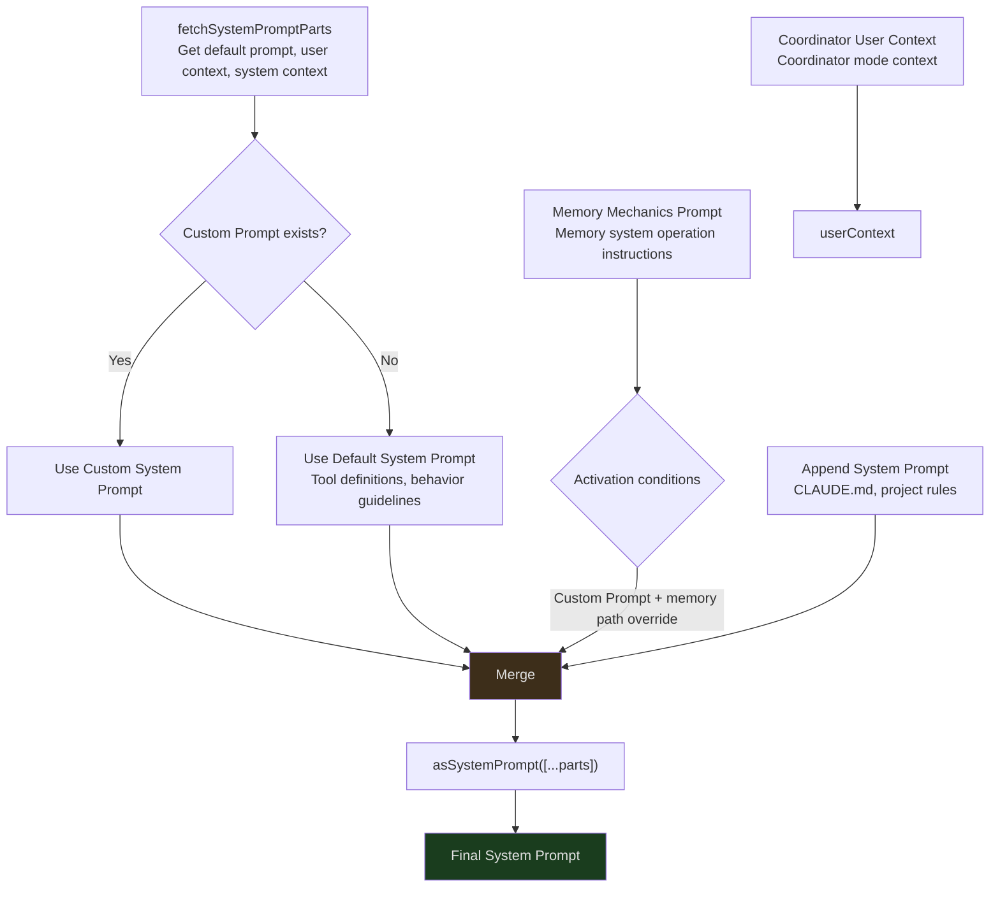
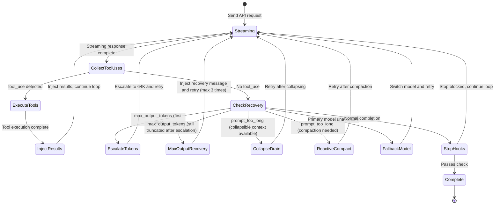
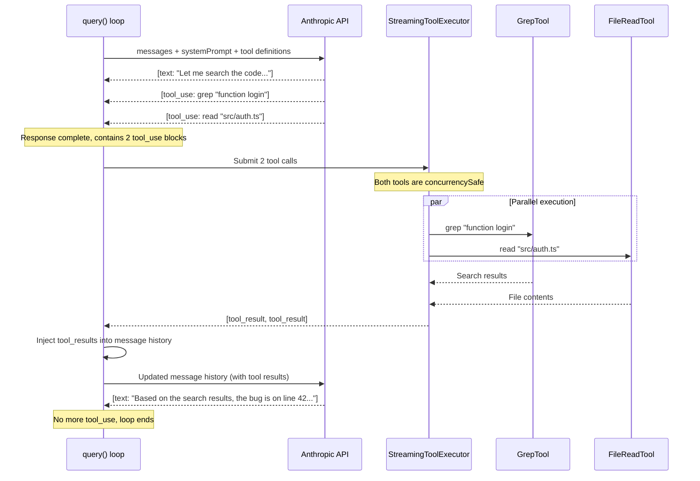
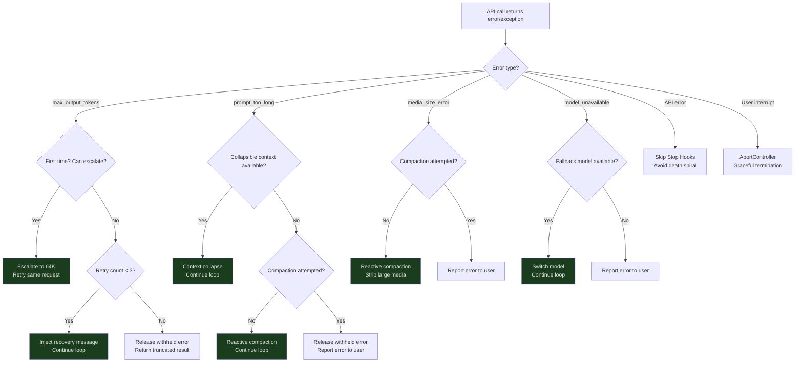
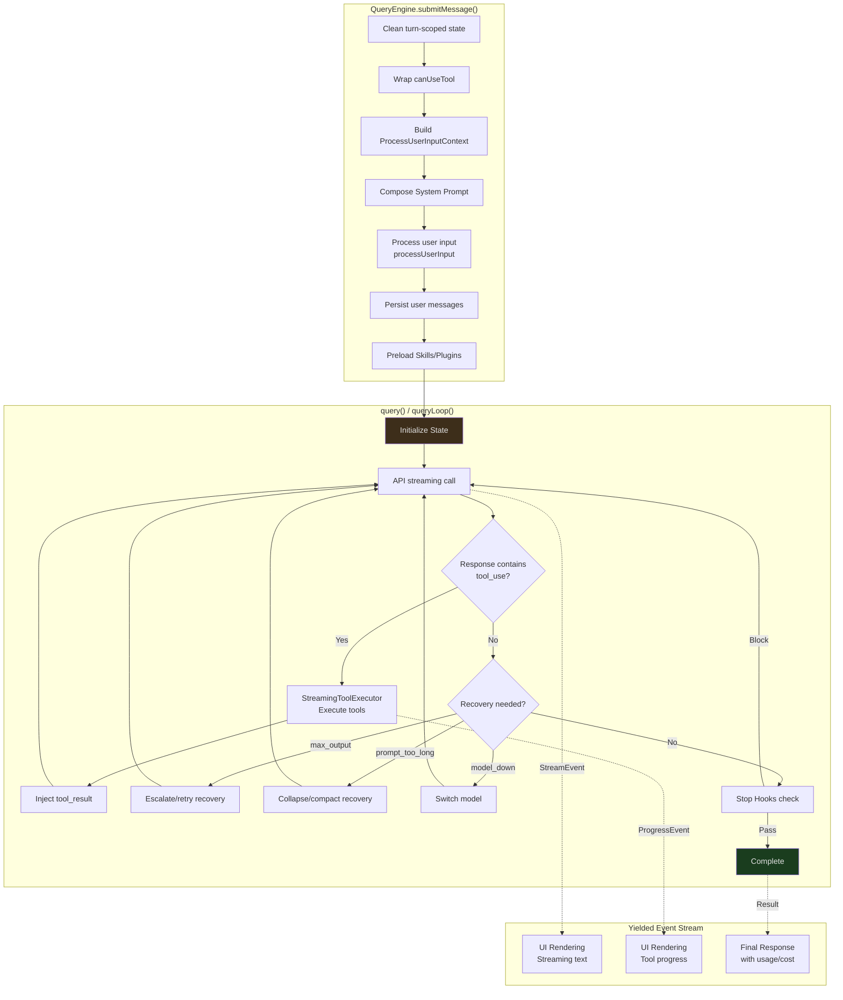

## Overview

In the previous big-picture article, we saw that Claude Code's architecture can be divided into 5 layers, with the query engine sitting at the very core. Now, we're going to dive into that layer.

When you type something into the terminal — "help me fix this bug" — what actually happens between that moment and when Claude starts streaming its response, executing tools, and delivering the final result? The answer lies in two files:

- **`QueryEngine.ts` (~1,295 lines)** — the session manager, maintaining state across turns
- **`query.ts` (~1,729 lines)** — the streaming query loop, an async-generator-driven state machine

This article will trace the complete lifecycle of a conversation, from the entry point at `submitMessage()`, through the `query()` generator's loop execution, to the triggering of recovery strategies. This is the key to understanding how Claude Code interacts with the LLM.

---

## QueryEngine: The Session's State Container

`QueryEngine` is not created on every call — it is a long-lived object that persists throughout the entire conversation session. Its responsibility is managing state across turns:

```typescript
// src/QueryEngine.ts:184-207
export class QueryEngine {
  private config: QueryEngineConfig
  private mutableMessages: Message[]      // Complete message history across turns
  private abortController: AbortController // User interrupt signal
  private permissionDenials: SDKPermissionDenial[] // Permission denial records
  private totalUsage: NonNullableUsage     // Cumulative token usage
  private hasHandledOrphanedPermission = false
  private readFileState: FileStateCache    // Read file cache (avoids redundant reads)
  private discoveredSkillNames = new Set<string>()
  private loadedNestedMemoryPaths = new Set<string>()

  constructor(config: QueryEngineConfig) {
    this.config = config
    this.mutableMessages = config.initialMessages ?? []
    this.abortController = config.abortController ?? createAbortController()
    this.permissionDenials = []
    this.readFileState = config.readFileCache
    this.totalUsage = EMPTY_USAGE
  }
}
```

A few key fields are worth noting:

- **`mutableMessages`** — This is the message history for the entire conversation. New messages from each turn are appended here, and tool execution results are also injected here. This array is "mutable" — in Claude Code's overall design that favors immutable data, this is a deliberate exception, since message history requires frequent updates and append operations don't cause concurrency issues.
- **`readFileState`** — A file read cache. When the AI reads a file via `FileReadTool`, its contents are cached here. If the AI references the file again later, the engine can avoid re-sending the full contents to the API, saving tokens.
- **`permissionDenials`** — When a user denies execution permission for a tool, the denial is recorded here for subsequent SDK reporting.
- **`discoveredSkillNames`** — Tracks skill names discovered during the current turn. Cleared at the start of each turn to prevent unbounded growth in long sessions.
- **`loadedNestedMemoryPaths`** — Records already-loaded nested memory paths to avoid duplicate loading.

### QueryEngineConfig: The Engine's Configuration Contract

Before diving into `submitMessage()`, we need to understand `QueryEngineConfig` — it defines everything required when creating a `QueryEngine`:

```typescript
// src/QueryEngine.ts:130-173 (key fields)
export type QueryEngineConfig = {
  cwd: string                    // Working directory
  tools: Tools                   // Available tool list
  commands: Command[]            // Slash command list
  mcpClients: MCPServerConnection[] // MCP client connections
  agents: AgentDefinition[]      // Agent definitions
  canUseTool: CanUseToolFn       // Tool permission check function
  getAppState: () => AppState    // Get application state
  setAppState: (f: (prev: AppState) => AppState) => void
  initialMessages?: Message[]    // Initial message history (used when resuming sessions)
  readFileCache: FileStateCache  // File state cache
  customSystemPrompt?: string    // Custom system prompt
  appendSystemPrompt?: string    // Appended system prompt
  userSpecifiedModel?: string    // User-specified model
  fallbackModel?: string         // Fallback model
  thinkingConfig?: ThinkingConfig // Thinking mode configuration
  maxTurns?: number              // Maximum turn limit
  maxBudgetUsd?: number          // Budget limit (USD)
  taskBudget?: { total: number } // Task budget
  jsonSchema?: Record<string, unknown> // Structured output schema
  verbose?: boolean
  replayUserMessages?: boolean
  handleElicitation?: ToolUseContext['handleElicitation']
  snipReplay?: (            // Snip boundary handler
    yieldedSystemMsg: Message,
    store: Message[],
  ) => { messages: Message[]; executed: boolean } | undefined
}
```

This configuration object reflects an important design decision: **inject all external dependencies at creation time**. `QueryEngine` doesn't fetch the tool list or MCP clients on its own — everything is provided by the caller. This makes the engine flexibly configurable across different usage scenarios (SDK mode, REPL mode, test mode).

---

### submitMessage(): The Entry Point for Each Turn

Whenever the user enters a new message, `submitMessage()` is called. It is an **async generator** (`async *`), meaning it doesn't return a single result but instead progressively yields streaming events:

```typescript
// src/QueryEngine.ts:209-212
async *submitMessage(
  prompt: string | ContentBlockParam[],
  options?: { uuid?: string; isMeta?: boolean }
): AsyncGenerator<SDKMessage, void, unknown>
```

The execution of `submitMessage()` is divided into several clear phases. Let's trace through them one by one.

#### Phase 1: Turn-Level Initialization

```typescript
// src/QueryEngine.ts:238-241
this.discoveredSkillNames.clear()  // Clear skills discovered in the previous turn
setCwd(cwd)                        // Set the working directory
const persistSession = !isSessionPersistenceDisabled()
const startTime = Date.now()
```

At the start of each turn, the engine performs some cleanup. `discoveredSkillNames.clear()` ensures skill discovery is turn-scoped — long-running sessions won't waste memory due to unbounded growth of the skill name set.

#### Phase 2: Permission Tracking Wrapper

```typescript
// src/QueryEngine.ts:244-271 (simplified)
const wrappedCanUseTool: CanUseToolFn = async (tool, input, ...) => {
  const result = await canUseTool(tool, input, ...)

  // Track denials for SDK reporting
  if (result.behavior !== 'allow') {
    this.permissionDenials.push({
      tool_name: sdkCompatToolName(tool.name),
      tool_use_id: toolUseID,
      tool_input: input,
    })
  }

  return result
}
```

The engine doesn't use the `canUseTool` function from the config directly — it wraps it with an additional layer. This wrapper records all denied tool calls without changing the permission logic itself. These records ultimately appear in the SDK's returned `result` message, letting the caller know which operations were denied by the user.

#### Phase 3: Building the ProcessUserInputContext

This is the biggest step in `submitMessage()` — constructing a large configuration object containing everything needed for the current turn:

```typescript
// src/QueryEngine.ts:335-395 (key fields)
let processUserInputContext: ProcessUserInputContext = {
  messages: this.mutableMessages,
  setMessages: fn => {
    this.mutableMessages = fn(this.mutableMessages)
  },
  onChangeAPIKey: () => {},
  handleElicitation: this.config.handleElicitation,
  options: {
    commands,
    tools,
    verbose,
    mainLoopModel: initialMainLoopModel,
    thinkingConfig: initialThinkingConfig,
    mcpClients,
    isNonInteractiveSession: true,
    customSystemPrompt,
    appendSystemPrompt,
    agentDefinitions: { activeAgents: agents, allAgents: [] },
    maxBudgetUsd,
  },
  getAppState,
  setAppState,
  abortController: this.abortController,
  readFileState: this.readFileState,
  nestedMemoryAttachmentTriggers: new Set<string>(),
  loadedNestedMemoryPaths: this.loadedNestedMemoryPaths,
  dynamicSkillDirTriggers: new Set<string>(),
  discoveredSkillNames: this.discoveredSkillNames,
  // ...more fields
}
```

`ProcessUserInputContext` is the "contract" between the query engine and the `query()` generator — it defines all the capabilities and state that `query()` can use. Note the implementation of `setMessages`: it captures a reference to `this.mutableMessages` through a closure, allowing slash commands (like `/force-snip`) to directly modify the message array.

It's worth noting that `processUserInputContext` is created **twice** within `submitMessage()`. The first time is for processing user input (slash commands, attachments, etc.), and the second time is after slash command processing completes, using the updated messages and model. This ensures that state modifications made by slash commands are visible to subsequent `query()` calls.

---

## Multi-Layer System Prompt Composition

Before calling the API, the engine needs to assemble the System Prompt. This isn't just a simple string — it's a composition of multiple layers of content:



Let's see how the code actually implements this composition:

```typescript
// src/QueryEngine.ts:289-325 (simplified)
const {
  defaultSystemPrompt,
  userContext: baseUserContext,
  systemContext,
} = await fetchSystemPromptParts({
  tools,
  mainLoopModel: initialMainLoopModel,
  mcpClients,
  customSystemPrompt: customPrompt,
})

// Merge coordinator mode user context
const userContext = {
  ...baseUserContext,
  ...getCoordinatorUserContext(mcpClients, scratchpadDir),
}

// Conditionally load memory mechanics prompt
const memoryMechanicsPrompt =
  customPrompt !== undefined && hasAutoMemPathOverride()
    ? await loadMemoryPrompt()
    : null

// Final composition
const systemPrompt = asSystemPrompt([
  ...(customPrompt !== undefined ? [customPrompt] : defaultSystemPrompt),
  ...(memoryMechanicsPrompt ? [memoryMechanicsPrompt] : []),
  ...(appendSystemPrompt ? [appendSystemPrompt] : []),
])
```

The role of each layer:

1. **Default System Prompt** — Baseline behavior guidelines, including available tool definitions, safety instructions, and output format requirements. Generated by `fetchSystemPromptParts()`, with user context and system context collection logic located in `src/context.ts` and `src/utils/queryContext.ts`.
2. **Custom System Prompt** — User-provided custom instructions via configuration. When present, it **replaces** the default prompt (rather than appending to it).
3. **Memory Mechanics** — Operational instructions for the memory system (how to read/write MEMORY.md). Only enabled when two conditions are met simultaneously: a custom prompt exists AND the memory path override environment variable is set.
4. **Append System Prompt** — Project-level rules from CLAUDE.md files. These are **always appended** at the end, regardless of whether a custom prompt exists.

Each layer can contain thousands of tokens. When the System Prompt itself consumes a large portion of the context window, less space remains for the actual conversation — which is why context management is so important.

### User Context and System Context

In addition to the System Prompt itself, `fetchSystemPromptParts()` also returns two context objects:

- **`userContext`** — Injected in `[key: value]` format before the user message in each API request. Contains dynamic context such as working directory, platform information, and time.
- **`systemContext`** — Injected in a similar format at the end of the system message. Contains relatively static context such as the list of installed MCP servers.

This separation is intentional: `userContext` may change with each request (e.g., the current working directory), while `systemContext` remains relatively stable throughout the session.

---

## query(): An Async-Generator-Driven Streaming State Machine

The `query()` function is the core loop of the entire query engine. Its signature reveals its nature — an async generator:

```typescript
// src/query.ts:219-228
export async function* query(params: QueryParams): AsyncGenerator<
  | StreamEvent
  | RequestStartEvent
  | Message
  | TombstoneMessage
  | ToolUseSummaryMessage,
  Terminal
>
```

Why an async generator? Because streaming AI conversations are inherently a **multi-phase, interruptible, stateful process**:

1. Send a request to the API
2. Receive the streaming response (token by token)
3. Detect a tool call -> pause streaming output -> execute tool -> inject result -> continue request
4. Detect a need for recovery -> execute recovery strategy -> retry
5. Final completion

The generator pattern lets the caller (UI layer) consume these events incrementally, rendering the latest state at each `yield` point, without waiting for the entire process to complete.

### query()'s Two-Layer Structure

`query()` itself is just a thin wrapper. It delegates the actual work to `queryLoop()`, then notifies command lifecycles upon normal completion:

```typescript
// src/query.ts:219-239
export async function* query(params: QueryParams): AsyncGenerator<...> {
  const consumedCommandUuids: string[] = []
  const terminal = yield* queryLoop(params, consumedCommandUuids)
  // Only reaches here on normal completion
  // On throw, the error propagates through yield*
  // On .return(), both generators are closed
  for (const uuid of consumedCommandUuids) {
    notifyCommandLifecycle(uuid, 'completed')
  }
  return terminal
}
```

`yield*` is the key — it "passes through" all of `queryLoop()`'s yielded values directly to `query()`'s caller, while also propagating errors and cancellation signals. This pattern makes error handling and resource cleanup natural: if `queryLoop()` throws an exception, it bubbles directly to the caller; if the caller calls `.return()`, both generators are properly closed.

### State: The Query Loop's Internal State

```typescript
// src/query.ts:204-217
type State = {
  messages: Message[]
  toolUseContext: ToolUseContext
  autoCompactTracking: AutoCompactTrackingState | undefined
  maxOutputTokensRecoveryCount: number   // Retry count (max 3)
  hasAttemptedReactiveCompact: boolean   // Whether reactive compaction has been attempted
  maxOutputTokensOverride: number | undefined
  pendingToolUseSummary: Promise<ToolUseSummaryMessage | null> | undefined
  stopHookActive: boolean | undefined
  turnCount: number                     // Current turn count
  transition: Continue | undefined       // Why the previous iteration continued
}
```

This `State` type is key to understanding the query loop's behavior. A few important fields:

- **`maxOutputTokensRecoveryCount`** — When the API returns a `max_output_tokens` error (the AI's output was truncated), the engine automatically retries. This counter tracks the number of retries, with an upper limit defined by `MAX_OUTPUT_TOKENS_RECOVERY_LIMIT = 3`.
- **`hasAttemptedReactiveCompact`** — When context is approaching its limit, the engine attempts "reactive compaction" — automatically compressing historical messages to free up space. This flag ensures compaction is only attempted once, preventing infinite loops.
- **`transition`** — Records why the previous iteration continued. Its value is a `Continue` type (e.g., `{ reason: 'max_output_tokens_recovery', attempt: 2 }`), letting tests assert whether a recovery path was triggered without needing to inspect message contents.
- **`maxOutputTokensOverride`** — When output truncation is first encountered, the engine first tries to escalate the output token limit from the default 8K to 64K (`ESCALATED_MAX_TOKENS`), before considering multi-turn recovery.
- **`autoCompactTracking`** — Tracks auto-compaction state, including warning threshold calculations for token usage.

### Main Loop Structure



The core of the query loop is conceptually a `while(true)` structure, where each iteration:

1. **Stream** — Send the current message history to the API and receive a streaming response
2. **Collect** — Gather text content and `tool_use` calls from the response
3. **Execute** — If there are `tool_use` calls, execute tools via `StreamingToolExecutor`
4. **Inject** — Inject tool execution results as `tool_result` messages into the history
5. **Decide** — Determine whether to continue the loop (new tool results or recovery needed) or end (no further actions)

---

## QueryParams: The Input Contract for query()

Before entering the tool call loop, let's look at the parameters `query()` receives:

```typescript
// src/query.ts:181-199
export type QueryParams = {
  messages: Message[]
  systemPrompt: SystemPrompt
  userContext: { [k: string]: string }
  systemContext: { [k: string]: string }
  canUseTool: CanUseToolFn
  toolUseContext: ToolUseContext
  fallbackModel?: string
  querySource: QuerySource
  maxOutputTokensOverride?: number
  maxTurns?: number
  skipCacheWrite?: boolean
  taskBudget?: { total: number }
  deps?: QueryDeps
}
```

Note the `deps?: QueryDeps` parameter. This is a **dependency injection point** — in production it uses `productionDeps`, and in tests it can be replaced with mock implementations. `QueryDeps` contains the concrete implementations of core capabilities like API calls and tool execution, making `query()` itself testable without depending on any external modules.

```typescript
// src/query/deps.ts
export type QueryDeps = {
  // Core dependencies: API calls, tool execution, etc.
}
export const productionDeps: QueryDeps = { ... }
```

---

## The Tool Call Loop: How the AI Uses Tools

When the API response contains a `tool_use` content block, the query loop enters the tool execution phase. This is the core capability of Claude Code as an AI agent — the AI doesn't just generate text; it can execute actions.

A typical tool call loop:



Note the key details:

- **Parallel execution**: Both `GrepTool` and `FileReadTool` declare `isConcurrencySafe() = true` (they are read-only operations), so `StreamingToolExecutor` executes them in parallel
- **Result injection**: Tool results are appended to the message history as `tool_result` messages, then the entire history is re-sent to the API
- **Loop continuation**: The API generates a new response based on the tool results; if the new response contains more `tool_use` blocks, the loop continues
- **Permission checks**: Before tool execution, `wrappedCanUseTool` checks whether the user has authorized the operation. Denied operations return an error message to the AI and are recorded in `permissionDenials`

### Tool Result Storage Optimization

Each tool's execution result can be large (e.g., the entire contents of a large file). Storing them directly in the message history would quickly consume the context window. Claude Code uses `applyToolResultBudget` (from `src/utils/toolResultStorage.ts`) to apply budget controls to tool results — results exceeding the budget are truncated or summarized, ensuring the message history doesn't explode from a single tool call.

### Handling Missing Tool Results

When the API response contains `tool_use` but execution is interrupted (e.g., the user presses Ctrl+C), an error-type `tool_result` must be generated for each incomplete tool call. This is required by the Anthropic API — every `tool_use` must have a corresponding `tool_result`:

```typescript
// src/query.ts:123-149
function* yieldMissingToolResultBlocks(
  assistantMessages: AssistantMessage[],
  errorMessage: string,
) {
  for (const assistantMessage of assistantMessages) {
    const toolUseBlocks = assistantMessage.message.content.filter(
      content => content.type === 'tool_use',
    ) as ToolUseBlock[]

    for (const toolUse of toolUseBlocks) {
      yield createUserMessage({
        content: [{
          type: 'tool_result',
          content: errorMessage,
          is_error: true,
          tool_use_id: toolUse.id,
        }],
        toolUseResult: errorMessage,
        sourceToolAssistantUUID: assistantMessage.uuid,
      })
    }
  }
}
```

This function iterates through all `tool_use` blocks in assistant messages and generates a `tool_result` user message containing the error information for each one.

---

## Recovery Strategies: When Things Go Wrong

In the real world, API calls don't always succeed. The network might drop, the context might overflow, or the model might be unable to complete its output. `query.ts` implements automatic recovery strategies for multiple error types.

### The Error "Withholding" Mechanism

Before diving into specific strategies, there's a key design to understand: **error message withholding**.

When the streaming loop detects a `max_output_tokens` or `prompt_too_long` error, it **does not immediately yield this error message to the caller**. Why? Because SDK callers (such as Claude Desktop) might terminate the session immediately upon receiving an `error`-type message. If the engine yields an error and then successfully recovers through a recovery strategy, the caller has already stopped listening — the recovery is pointless.

So the engine "withholds" the error message and attempts recovery. The error message is only yielded after recovery fails.

```typescript
// src/query.ts:175-179
// isWithheldMaxOutputTokens checks if a message is a withheld max_output_tokens error
function isWithheldMaxOutputTokens(
  msg: Message | StreamEvent | undefined,
): msg is AssistantMessage {
  return msg?.type === 'assistant' && msg.apiError === 'max_output_tokens'
}
```

### Strategy 1: Output Token Escalation (First max_output_tokens Recovery)

When the AI's output is truncated, the engine first tries a "zero-cost" recovery — escalating the output token limit:

```typescript
// src/query.ts:1188-1221 (simplified)
if (isWithheldMaxOutputTokens(lastMessage)) {
  // Step 1: Escalate to 64K
  if (capEnabled && maxOutputTokensOverride === undefined) {
    logEvent('tengu_max_tokens_escalate', {
      escalatedTo: ESCALATED_MAX_TOKENS,
    })
    const next: State = {
      ...state,
      maxOutputTokensOverride: ESCALATED_MAX_TOKENS,
      transition: { reason: 'max_output_tokens_escalate' },
    }
    state = next
    continue  // Retry the same request with a higher output limit
  }
```

The cleverness of this strategy is that it **retries the same request** with only the output token limit raised. No recovery message needs to be injected, and the message history length doesn't increase. If 8K wasn't enough but 64K is, the problem is resolved silently.

### Strategy 2: Multi-Turn Recovery (Subsequent max_output_tokens Recovery)

If the output is still truncated after escalating to 64K, the engine enters multi-turn recovery mode — injecting a recovery message to let the AI continue from where it left off:

```typescript
// src/query.ts:1223-1252
if (maxOutputTokensRecoveryCount < MAX_OUTPUT_TOKENS_RECOVERY_LIMIT) {
  const recoveryMessage = createUserMessage({
    content:
      `Output token limit hit. Resume directly — no apology, ` +
      `no recap of what you were doing. Pick up mid-thought ` +
      `if that is where the cut happened. Break remaining ` +
      `work into smaller pieces.`,
    isMeta: true,
  })

  const next: State = {
    messages: [
      ...messagesForQuery,
      ...assistantMessages,
      recoveryMessage,
    ],
    maxOutputTokensRecoveryCount: maxOutputTokensRecoveryCount + 1,
    transition: {
      reason: 'max_output_tokens_recovery',
      attempt: maxOutputTokensRecoveryCount + 1,
    },
    // ...other fields
  }
  state = next
  continue
}
```

Notice the wording of the recovery message: **"Resume directly - no apology, no recap"**. This is a carefully crafted prompt that tells the AI not to waste tokens apologizing or restating context, but to continue directly from where it was cut off. This maximizes the utilization of the limited output tokens.

`MAX_OUTPUT_TOKENS_RECOVERY_LIMIT = 3`, meaning a maximum of 3 retries. If the output is still truncated after 3 attempts, the error message is yielded to the caller.

### Strategy 3: Context Collapse and Reactive Compaction (prompt_too_long)

When the message history is too long and the API returns a `prompt_too_long` error, the engine has two levels of recovery.

**Level 1: Context Collapse**

```typescript
// src/query.ts:1089-1117
if (
  feature('CONTEXT_COLLAPSE') &&
  contextCollapse &&
  state.transition?.reason !== 'collapse_drain_retry'
) {
  const drained = contextCollapse.recoverFromOverflow(
    messagesForQuery, querySource,
  )
  if (drained.committed > 0) {
    const next: State = {
      messages: drained.messages,
      transition: { reason: 'collapse_drain_retry', committed: drained.committed },
      // ...
    }
    state = next
    continue
  }
}
```

Context collapse is a lightweight form of compression — it collapses "staged" context blocks while preserving fine-grained information. Note the condition `state.transition?.reason !== 'collapse_drain_retry'` — if the previous iteration already attempted collapse but still overflowed, it won't try again, instead falling through to reactive compaction.

**Level 2: Reactive Compaction**

```typescript
// src/query.ts:1119-1166
if ((isWithheld413 || isWithheldMedia) && reactiveCompact) {
  const compacted = await reactiveCompact.tryReactiveCompact({
    hasAttempted: hasAttemptedReactiveCompact,
    querySource,
    aborted: toolUseContext.abortController.signal.aborted,
    messages: messagesForQuery,
    cacheSafeParams: {
      systemPrompt,
      userContext,
      systemContext,
      toolUseContext,
      forkContextMessages: messagesForQuery,
    },
  })

  if (compacted) {
    const postCompactMessages = buildPostCompactMessages(compacted)
    for (const msg of postCompactMessages) {
      yield msg
    }
    const next: State = {
      messages: postCompactMessages,
      hasAttemptedReactiveCompact: true,
      transition: { reason: 'reactive_compact_retry' },
      // ...
    }
    state = next
    continue
  }

  // Compaction failed — release the withheld error message and exit
  yield lastMessage
  return { reason: isWithheldMedia ? 'image_error' : 'prompt_too_long' }
}
```

Reactive compaction calls the compaction logic in `services/compact/` to summarize historical messages and free up context space. The `hasAttemptedReactiveCompact` flag ensures this operation only executes once — if compaction still results in overflow, there's a more fundamental problem.

Note that this also handles **media size errors** (images/PDFs that are too large) — reactive compaction can recover by stripping large media content.

### Strategy 4: Model Downgrade (Fallback Model)

When the primary model (e.g., Opus) is temporarily unavailable or encounters a specific error, the engine can switch to a fallback model (e.g., Sonnet) to continue working. This is triggered via `FallbackTriggeredError` (from `src/services/api/withRetry.ts`).

### Recovery Strategy Decision Tree



### Avoiding Death Spirals

There's a recurring design concern throughout the code: **avoiding death spirals**. When an API error occurs, if the engine runs Stop Hooks (used to validate the quality of AI output), the hooks might inject more tokens, causing the context to overflow further, triggering more errors, and forming an infinite loop.

```typescript
// src/query.ts:1258-1264
// Skip stop hooks when the last message is an API error
// The model never produced a valid response — evaluating it with hooks
// would create a death spiral: error -> hook blocking -> retry -> error -> ...
if (lastMessage?.isApiErrorMessage) {
  void executeStopFailureHooks(lastMessage, toolUseContext)
  return { reason: 'completed' }
}
```

---

## Turn Management: Skill Discovery and Cleanup

Each conversation turn involves more than just sending and receiving messages. At the start of each turn, the engine also performs some housekeeping:

```typescript
// src/QueryEngine.ts:238
// Clear discoveredSkillNames at the start of each turn
// Prevents unbounded growth of the skill name set in long sessions
this.discoveredSkillNames.clear()
```

`discoveredSkillNames` tracks skill names discovered during the current turn (used for the `was_discovered` field in `tengu_skill_tool_invocation` analytics events). Why clear it each turn? Because in long-running sessions (which can last hours in SDK mode), this set would grow continuously without clearing. The source code comment explicitly states this design intent:

> Must persist across the two processUserInputContext rebuilds inside submitMessage, but is cleared at the start of each submitMessage to avoid unbounded growth across many turns in SDK mode.

This is a small but important design decision — **turn-scoped cleanup**.

### Skill and Plugin Preloading

Before calling `query()`, `submitMessage()` also preloads skills and plugins in parallel:

```typescript
// src/QueryEngine.ts:534-538
const [skills, { enabled: enabledPlugins }] = await Promise.all([
  getSlashCommandToolSkills(getCwd()),
  loadAllPluginsCacheOnly(),
])
```

Note the use of `loadAllPluginsCacheOnly()` — in headless/SDK mode, it doesn't block waiting for network requests to fetch plugins. It only uses plugin data already in the cache. If the latest data is needed, the caller can manually refresh via the `/reload-plugins` command.

---

## Session Persistence and Recovery

`submitMessage()` carefully manages session persistence throughout its execution. This makes the `--resume` feature possible — even if the process is killed midway, the next startup can resume from the interruption point.

### Early Persistence of User Messages

```typescript
// src/QueryEngine.ts:450-463 (key logic)
if (persistSession && messagesFromUserInput.length > 0) {
  const transcriptPromise = recordTranscript(messages)
  if (isBareMode()) {
    void transcriptPromise  // Don't await in --bare mode
  } else {
    await transcriptPromise
  }
}
```

User messages are persisted **before** entering the `query()` loop. The source code comment explains why:

> If the process is killed before [the API responds], the transcript is left with only queue-operation entries; getLastSessionLog filters those out, returns null, and --resume fails with "No conversation found".

### Async Persistence of Assistant Messages

In contrast, assistant message persistence is fire-and-forget:

```typescript
// src/QueryEngine.ts:727-729
if (message.type === 'assistant') {
  void recordTranscript(messages)  // Don't await
}
```

Why? Because the streaming handler in `claude.ts` frequently yields assistant messages (one per content block), then modifies the last message's `usage` and `stop_reason` in `message_delta` events. Waiting for persistence to complete each time would block the streaming pipeline. Since `enqueueWrite` is order-preserving, fire-and-forget is safe here.

---

## Complete Data Flow Recap

Let's summarize the full collaboration between `QueryEngine` and `query()` in a single diagram:



---

## Transferable Engineering Patterns

From Claude Code's query engine design, we can extract several general-purpose engineering patterns:

### 1. Async Generators as a Streaming Abstraction

When your system needs to process streaming data (such as SSE event streams or WebSocket messages), `async function*` is a powerful abstraction. It lets producers `yield` events at their own pace, while consumers can consume them at their own pace using `for await...of`.

Claude Code takes this further by using `yield*` to compose multiple generators — `query()` delegates to `queryLoop()`, and `submitMessage()` consumes `query()`'s output while adding extra logic. This pattern keeps complex streaming pipelines well-modularized.

### 2. State Machine + Recovery Counter Pattern

For long-running tasks that need automatic recovery, maintaining recovery counters (`maxOutputTokensRecoveryCount`) and attempt flags (`hasAttemptedReactiveCompact`) in the state is a clean and effective pattern. It prevents infinite retries while allowing multiple orderly recoveries.

The design of the `transition` field is particularly elegant — it not only controls flow but also provides observability for debugging and testing. Tests can assert `transition.reason === 'max_output_tokens_recovery'` without needing to deeply inspect message contents.

### 3. Context Objects as Inter-Layer Contracts

The `ProcessUserInputContext` pattern — packaging all dependencies needed for the current turn into a context object — is a lightweight form of dependency injection. It allows the `query()` function to operate without directly depending on `QueryEngine`'s internal state, facilitating testing and reuse.

### 4. Error Withholding and Graduated Recovery

Withholding error messages first, attempting recovery, then releasing them on failure — this pattern is applicable to any streaming system that needs graceful degradation. It prevents callers from prematurely terminating due to transient errors.

### 5. Choosing Persistence Timing

User messages are persisted synchronously (ensuring recoverability), while assistant messages are persisted asynchronously (ensuring the streaming pipeline isn't blocked). Different types of data use different persistence strategies. This is a careful trade-off between reliability and performance.

---

## Next Up

The query engine drives the entire conversation loop, but its capabilities are limited by the available tools. [Article 03: The Tool System](/articles/03-tool-system) will dive into Claude Code's 40+ tools — how are they defined? How are they discovered and executed? Most critically: when the AI performs actions, how does the permission system ensure safety?
