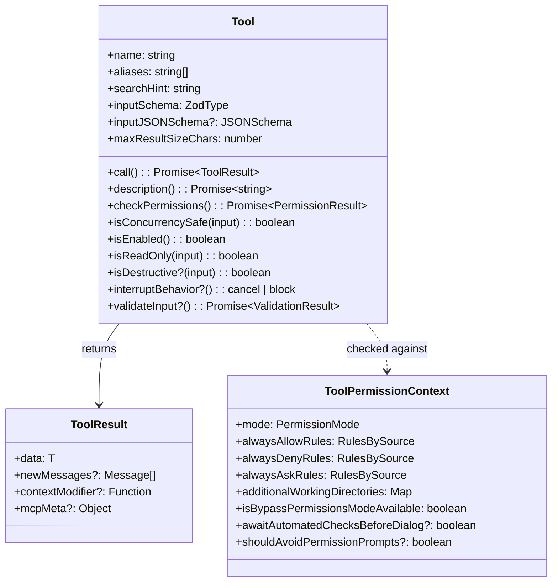
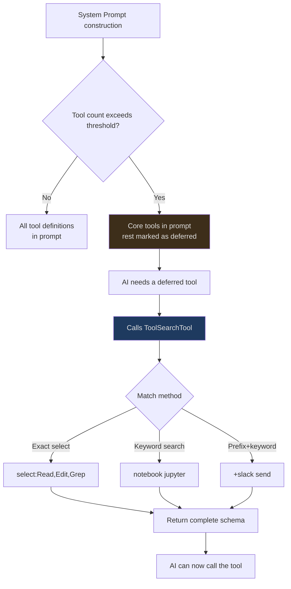
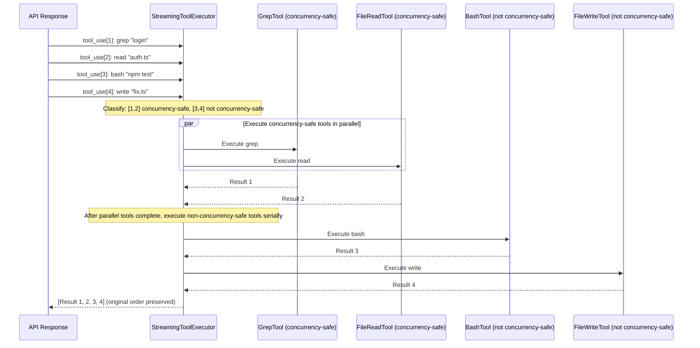
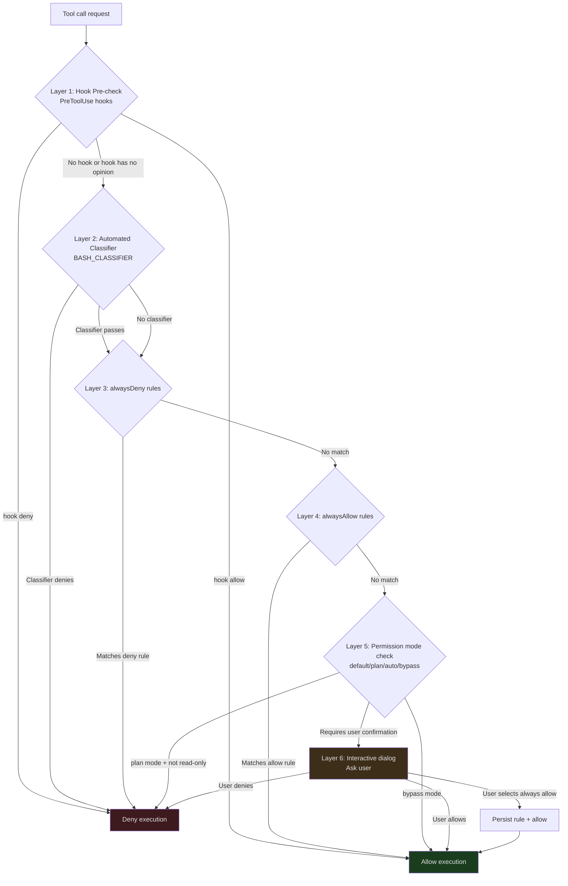
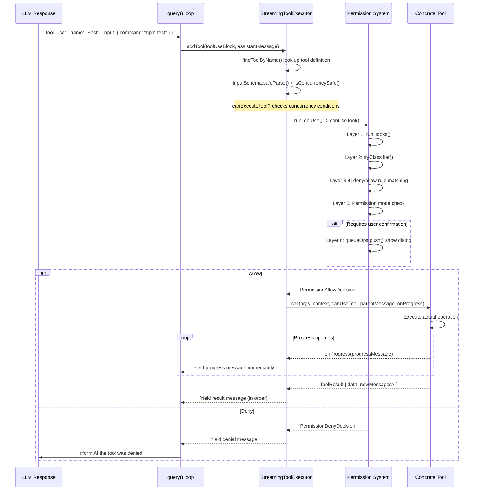
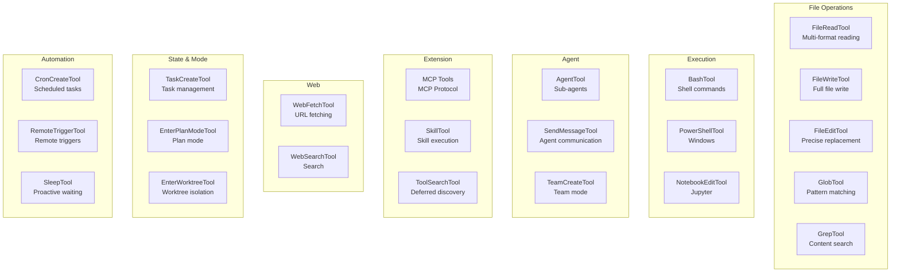

## Overview

In the first two articles, we established a big-picture understanding of Claude Code's architecture and dove deep into the query engine's streaming loop. Now we arrive at the third critical layer of the architecture — the tool system.

If the query engine is Claude Code's "brain," then tools are its "hands and feet." Without tools, the AI can only generate text. With tools, the AI can read and write files, execute shell commands, search code, visit web pages, and even spawn sub-agents.

But this power comes with enormous risk. An AI that can execute `rm -rf /` without proper permission controls is a ticking time bomb. Claude Code's tool system must not only provide powerful capabilities, but also ensure safety before every execution.

This article will analyze the tool system from three dimensions:

1. **Definition** — What are tools, and how are they declared?
2. **Execution** — How are multiple tools executed concurrently and safely?
3. **Permissions** — Who decides whether a tool is allowed to execute?

---

## Tool Type Definition

Every tool is an object conforming to the `Tool` type. Let's understand this type field by field:

```typescript
// src/Tool.ts:362-599
export type Tool<
  Input extends AnyObject = AnyObject,
  Output = unknown,
  P extends ToolProgressData = ToolProgressData,
> = {
  // Identity
  aliases?: string[]       // Backward-compatible aliases
  searchHint?: string      // Keyword matching for deferred discovery

  // Core methods
  call(args, context, canUseTool, parentMessage, onProgress?)
    : Promise<ToolResult<Output>>
  description(input, options): Promise<string>

  // Schema
  readonly inputSchema: Input           // Zod schema
  readonly inputJSONSchema?: ToolInputJSONSchema  // JSON Schema (for MCP tools)

  // Behavior declarations
  isConcurrencySafe(input): boolean     // Can it run in parallel with other tools?
  isEnabled(): boolean                  // Is it available in the current environment?
  isReadOnly(input): boolean            // Is it a read-only operation?
  isDestructive?(input): boolean        // Does it perform irreversible operations?
  interruptBehavior?(): 'cancel' | 'block'  // Behavior when user interrupts

  // Permissions
  checkPermissions(input, context): Promise<PermissionResult>
  validateInput?(input, context): Promise<ValidationResult>
  preparePermissionMatcher?(input): Promise<(pattern: string) => boolean>

  // Output control
  maxResultSizeChars: number            // Maximum result character count
  readonly name: string
}
```

This type definition spans nearly 240 lines of `src/Tool.ts` (362-599), containing roughly 30 fields and methods. The code above is a simplified version showing the core parts — the complete type also includes UI rendering methods (`renderToolResultMessage`, `userFacingName`), analytics methods (`toAutoClassifierInput`), and more.



Let's focus on a few designs that are particularly worth understanding.

### Two Schema Formats: Zod vs JSON Schema

Notice the coexistence of `inputSchema` and `inputJSONSchema`. This isn't redundant design — tools from two different sources need different schema formats:

- **Built-in tools** (BashTool, FileReadTool, etc.) use **Zod schema** — TypeScript-native, providing compile-time type checking and runtime validation
- **MCP tools** (from external MCP servers) use **JSON Schema** — because the MCP protocol defines tool interfaces using JSON Schema

```typescript
// Zod schema example for built-in tools
const inputSchema = z.object({
  command: z.string().describe("The shell command to execute"),
  timeout: z.number().optional().describe("Timeout in milliseconds"),
  run_in_background: z.boolean().optional(),
})

// JSON Schema for MCP tools (dynamically fetched from MCP server)
const inputJSONSchema: ToolInputJSONSchema = {
  type: "object",
  properties: {
    query: { type: "string", description: "SQL query" }
  },
  required: ["query"]
}
```

The `ToolInputJSONSchema` type is defined in `src/Tool.ts:15-21`, requiring the root type to be `object`:

```typescript
export type ToolInputJSONSchema = {
  [x: string]: unknown
  type: 'object'
  properties?: {
    [x: string]: unknown
  }
}
```

Zod schemas are automatically converted to JSON Schema format before Anthropic API calls — this conversion is transparent to tool developers. The dual-track approach lets built-in tools benefit from TypeScript's type system while allowing external MCP tools to work without introducing a Zod dependency.

### Behavior Declarations: Tools Tell the System About Themselves

Claude Code's tool system adopts a "declarative" design — tools don't passively wait for the scheduler to query their properties, but proactively declare their behavioral characteristics. This lets the scheduler make correct scheduling decisions without understanding the tool's specific implementation.

**`isConcurrencySafe(input)`** — Can this tool be executed in parallel with others?

```typescript
// GrepTool is read-only, safe to run in parallel
isConcurrencySafe() { return true }

// FileWriteTool modifies the file system, cannot run in parallel
isConcurrencySafe() { return false }

// Note: the method receives an input parameter, allowing decisions based on specific input
// Some tools may return different concurrency safety based on different inputs
```

**`interruptBehavior()`** — When a user submits a new message during tool execution, should this tool be immediately cancelled or allowed to complete?

- `'cancel'` — Abort immediately (default behavior for most tools)
- `'block'` — Continue running, new message waits (e.g., BashTool executing a git commit)

Note that this method doesn't take an `input` parameter — interrupt behavior is tool-level, not dependent on specific input.

**`isReadOnly(input)`** — Is this a read-only operation? Read-only tools typically receive more lenient treatment during permission evaluation.

**`isDestructive?(input)`** — Does it perform irreversible operations (delete, overwrite, send)? This method is optional, defaulting to `false`. It provides an additional risk signal to the permission system.

**`isEnabled()`** — Is the tool available in the current environment? The `getToolsForDefaultPreset()` function in `src/tools.ts` filters out tools where `isEnabled()` returns `false`.

### ToolResult: The Tool's Return Type

What a tool returns after execution is not raw data, but a structured `ToolResult<T>`:

```typescript
// src/Tool.ts:321-336
export type ToolResult<T> = {
  data: T                          // The tool's actual output
  newMessages?: (                  // Messages to inject into conversation history
    | UserMessage
    | AssistantMessage
    | AttachmentMessage
    | SystemMessage
  )[]
  contextModifier?: (context: ToolUseContext) => ToolUseContext  // Modify subsequent context
  mcpMeta?: {                      // MCP protocol metadata passthrough
    _meta?: Record<string, unknown>
    structuredContent?: Record<string, unknown>
  }
}
```

The `contextModifier` field is particularly interesting — it allows a tool to modify the execution context for subsequent tools. But there's an important restriction: **only non-concurrency-safe tools have their context modifiers applied**. This is because the execution order of concurrent tools is non-deterministic; if they all tried to modify the context, the results would be unpredictable.

---

## Tool Registration and Discovery

### Static Registration

All built-in tools are registered in `src/tools.ts`. The `getAllBaseTools()` function (line 193) is the source of truth for tools:

```typescript
// src/tools.ts:193-251 (simplified)
export function getAllBaseTools(): Tools {
  return [
    AgentTool,
    TaskOutputTool,
    BashTool,
    // Skip Glob/Grep when embedded search tools are available
    ...(hasEmbeddedSearchTools() ? [] : [GlobTool, GrepTool]),
    ExitPlanModeV2Tool,
    FileReadTool,
    FileEditTool,
    FileWriteTool,
    NotebookEditTool,
    WebFetchTool,
    TodoWriteTool,
    WebSearchTool,
    // ... more tools
    ...(isToolSearchEnabledOptimistic() ? [ToolSearchTool] : []),
  ]
}
```

This function demonstrates several tool registration patterns:

**1. Compile-Time Feature Flags**

```typescript
// src/tools.ts:29-35
const cronTools = feature('AGENT_TRIGGERS')
  ? [
      require('./tools/ScheduleCronTool/CronCreateTool.js').CronCreateTool,
      require('./tools/ScheduleCronTool/CronDeleteTool.js').CronDeleteTool,
      require('./tools/ScheduleCronTool/CronListTool.js').CronListTool,
    ]
  : []
```

`feature()` is a Bun compile-time macro — when `AGENT_TRIGGERS` is `false` at build time, the entire `require()` branch and its transitive dependencies are removed from the final output.

**2. Lazy require to Break Circular Dependencies**

```typescript
// src/tools.ts:63-72
const getTeamCreateTool = () =>
  require('./tools/TeamCreateTool/TeamCreateTool.js')
    .TeamCreateTool as typeof import('./tools/TeamCreateTool/TeamCreateTool.js').TeamCreateTool
const getTeamDeleteTool = () =>
  require('./tools/TeamDeleteTool/TeamDeleteTool.js')
    .TeamDeleteTool
```

Note that `getTeamCreateTool()` uses a lazy `require()` instead of a top-level `import`. This is to break circular dependencies — `TeamCreateTool`'s implementation may depend on types or constants exported by `tools.ts`.

**3. Environment Variable Conditional Registration**

```typescript
// src/tools.ts:16-19
const REPLTool =
  process.env.USER_TYPE === 'ant'
    ? require('./tools/REPLTool/REPLTool.js').REPLTool
    : null
```

Some tools are only available to specific user types (e.g., Anthropic internal users).

### Tool Pool Assembly: assembleToolPool

`getAllBaseTools()` is just the first step. The actual tool list exposed to the AI still needs to go through filtering and merging. `assembleToolPool()` (line 345) is the unified entry point for assembling the final tool pool:

```typescript
// src/tools.ts:345-367
export function assembleToolPool(
  permissionContext: ToolPermissionContext,
  mcpTools: Tools,
): Tools {
  const builtInTools = getTools(permissionContext)
  const allowedMcpTools = filterToolsByDenyRules(mcpTools, permissionContext)
  // Sort to ensure prompt cache stability
  const byName = (a: Tool, b: Tool) => a.name.localeCompare(b.name)
  return uniqBy(
    [...builtInTools].sort(byName).concat(allowedMcpTools.sort(byName)),
    'name',
  )
}
```

This function does three things:

1. **Gets built-in tools** — filters out disabled tools and those blocked by deny rules via `getTools()`
2. **Filters MCP tools** — applies the same deny rules
3. **Deduplicates and merges** — built-in tools take priority, sorted by name for prompt cache stability

The purpose of sorting isn't just tidiness — the comments explain that the Anthropic API server places a cache breakpoint at the last position of built-in tools. If MCP tools are sorted into the middle of built-in tools, all downstream cache keys are invalidated.

### Deferred Discovery: ToolSearchTool

When there are too many tools (40+), putting all tool definitions into the System Prompt consumes a lot of tokens. Claude Code's solution is **deferred loading**:



Each tool can control its deferred loading behavior via two fields:

- **`shouldDefer`** — Tools set to `true` are deferred when the tool count exceeds the threshold
- **`alwaysLoad`** — Tools set to `true` are never deferred and always appear in the initial prompt

`ToolSearchTool` supports three query modes:

1. **Exact select**: `"select:Read,Edit,Grep"` — fetch specific tools by name
2. **Keyword search**: `"notebook jupyter"` — fuzzy matching, assisted by the `searchHint` field
3. **Prefix+keyword**: `"+slack send"` — require name to contain "slack", then rank by remaining terms

Each tool's `searchHint` field provides keyword matching support:

```typescript
// Tool searchHint examples
// AgentTool
searchHint: "subagent parallel background isolation worktree"

// NotebookEditTool
searchHint: "jupyter ipynb cell"

// When the AI searches for "parallel", AgentTool will be matched
// searchHint description says: "3-10 words, no trailing period.
//   Prefer terms not already in the tool name"
```

### MCP Dynamic Tools

Beyond built-in tools and deferred discovery, tools can also come from external MCP (Model Context Protocol) servers. When an MCP server connects, all tools it exposes are dynamically registered to the tool pool. MCP tools have a special `mcpInfo` field:

```typescript
// src/Tool.ts:451-455
mcpInfo?: { serverName: string; toolName: string }
```

MCP tool names are typically prefixed as `mcp__serverName__toolName`, while `mcpInfo` preserves the original, unprefixed server name and tool name. This lets the permission system configure rules at the MCP server level (e.g., `mcp__database` matches all tools from that server).

MCP tools can also mark themselves as `alwaysLoad` via `_meta['anthropic/alwaysLoad']`, ensuring they remain always visible even in deferred loading mode.

---

## StreamingToolExecutor: Concurrency-Safe Tool Orchestration

When the API response contains multiple `tool_use` calls, `StreamingToolExecutor` (`src/services/tools/StreamingToolExecutor.ts`) is responsible for deciding how to execute them — in parallel or serially.

### TrackedTool: A Tool's Runtime State

```typescript
// src/services/tools/StreamingToolExecutor.ts:19-33
type ToolStatus = 'queued' | 'executing' | 'completed' | 'yielded'

type TrackedTool = {
  id: string
  block: ToolUseBlock
  assistantMessage: AssistantMessage
  status: ToolStatus
  isConcurrencySafe: boolean
  promise?: Promise<void>
  results?: Message[]
  pendingProgress: Message[]  // Progress message buffer
  contextModifiers?: Array<(context: ToolUseContext) => ToolUseContext>
}
```

Each tool in the executor goes through four states: `queued` (waiting in queue) -> `executing` (running) -> `completed` (finished, results collected) -> `yielded` (results emitted upstream).

### Concurrency Scheduling Model



The scheduling logic is implemented in the `canExecuteTool()` method (line 129):

```typescript
// src/services/tools/StreamingToolExecutor.ts:129-135
private canExecuteTool(isConcurrencySafe: boolean): boolean {
  const executingTools = this.tools.filter(t => t.status === 'executing')
  return (
    executingTools.length === 0 ||
    (isConcurrencySafe && executingTools.every(t => t.isConcurrencySafe))
  )
}
```

The rule is remarkably concise:

- If no tools are executing -> any tool can execute
- If tools are executing, and both the current tool and all executing tools are concurrency-safe -> can execute
- Otherwise -> queue and wait

The `processQueue()` method (line 140) is called when a tool is enqueued or a tool completes. It traverses the queue and starts all tools that can be executed. For non-concurrency-safe tools, it stops traversal as soon as it encounters one that can't execute — guaranteeing ordering.

### Tool Enqueuing: addTool

When a `tool_use` block appears in the streaming API response, the `addTool()` method (line 76) is called:

```typescript
// src/services/tools/StreamingToolExecutor.ts:76-124 (simplified)
addTool(block: ToolUseBlock, assistantMessage: AssistantMessage): void {
  const toolDefinition = findToolByName(this.toolDefinitions, block.name)
  if (!toolDefinition) {
    // Unknown tool: immediately mark as completed with an error result
    this.tools.push({
      id: block.id, block, assistantMessage,
      status: 'completed',
      isConcurrencySafe: true,
      pendingProgress: [],
      results: [/* error: "No such tool available" */],
    })
    return
  }

  // Parse input and determine concurrency safety
  const parsedInput = toolDefinition.inputSchema.safeParse(block.input)
  const isConcurrencySafe = parsedInput?.success
    ? (() => {
        try { return Boolean(toolDefinition.isConcurrencySafe(parsedInput.data)) }
        catch { return false }
      })()
    : false

  this.tools.push({
    id: block.id, block, assistantMessage,
    status: 'queued', isConcurrencySafe,
    pendingProgress: [],
  })

  void this.processQueue()
}
```

Note the concurrency safety determination: if input parsing fails (`safeParse` returns `success: false`), the tool is treated as non-concurrency-safe. This is a safe default — if the input can't even be parsed, serial execution is safer.

### Sibling Abort: Cascading Cancellation

When a Bash tool execution fails, other tools running in parallel are cancelled. But there's an important detail here — **only BashTool errors trigger cascading cancellation**:

```typescript
// src/services/tools/StreamingToolExecutor.ts:354-363
if (isErrorResult) {
  thisToolErrored = true
  // Only Bash errors cancel siblings. Bash commands often have implicit
  // dependency chains (e.g. mkdir fails -> subsequent commands pointless).
  // Read/WebFetch/etc are independent — one failure shouldn't nuke the rest.
  if (tool.block.name === BASH_TOOL_NAME) {
    this.hasErrored = true
    this.erroredToolDescription = this.getToolDescription(tool)
    this.siblingAbortController.abort('sibling_error')
  }
}
```

Why only Bash? Because Bash commands often have implicit dependency chains — if `mkdir` fails, a subsequent `cd && make` is pointless. But FileReadTool or WebFetchTool failures are typically independent — one file read failure shouldn't cancel other file reads.

`siblingAbortController` is a **child controller** of `toolUseContext.abortController` (line 59):

```typescript
// src/services/tools/StreamingToolExecutor.ts:53-61
constructor(
  private readonly toolDefinitions: Tools,
  private readonly canUseTool: CanUseToolFn,
  toolUseContext: ToolUseContext,
) {
  this.toolUseContext = toolUseContext
  this.siblingAbortController = createChildAbortController(
    toolUseContext.abortController,
  )
}
```

Aborting `siblingAbortController` does not abort the parent `toolUseContext.abortController` — the query loop doesn't end the entire turn because of a single Bash error. Cancelled sibling tools receive a synthetic error message:

```typescript
// src/services/tools/StreamingToolExecutor.ts:153-205
private createSyntheticErrorMessage(
  toolUseId: string,
  reason: 'sibling_error' | 'user_interrupted' | 'streaming_fallback',
  assistantMessage: AssistantMessage,
): Message {
  if (reason === 'user_interrupted') {
    // User interrupt: return REJECT_MESSAGE
  }
  if (reason === 'streaming_fallback') {
    // Streaming fallback: return fallback error
  }
  // sibling_error: return "Cancelled: parallel tool call X errored"
  const desc = this.erroredToolDescription
  const msg = desc
    ? `Cancelled: parallel tool call ${desc} errored`
    : 'Cancelled: parallel tool call errored'
  // ...
}
```

### Progress Buffering and Ordered Emission

During tool execution, progress messages are emitted (e.g., search progress, file read progress, subprocess output). The handling strategy for these messages is:

- **Progress messages** -> yield immediately, displayed to the user in real time
- **Result messages** -> yield in original tool_use order, ensuring conversation history consistency

This separation is implemented in the `getCompletedResults()` method (line 412):

```typescript
// src/services/tools/StreamingToolExecutor.ts:412-440
*getCompletedResults(): Generator<MessageUpdate, void> {
  for (const tool of this.tools) {
    // Always yield progress messages immediately, regardless of tool status
    while (tool.pendingProgress.length > 0) {
      const progressMessage = tool.pendingProgress.shift()!
      yield { message: progressMessage, newContext: this.toolUseContext }
    }

    if (tool.status === 'yielded') continue

    if (tool.status === 'completed' && tool.results) {
      tool.status = 'yielded'
      for (const message of tool.results) {
        yield { message, newContext: this.toolUseContext }
      }
    } else if (tool.status === 'executing' && !tool.isConcurrencySafe) {
      break  // Non-concurrent tools must maintain order
    }
  }
}
```

Note the `break` at the end — when encountering a non-concurrency-safe tool that is still executing, it stops emitting results from subsequent tools. This guarantees that non-concurrent tool results appear in strict order in the conversation history.

In `getRemainingResults()` (line 453), the executor uses `Promise.race` to simultaneously wait for tool completion and progress messages:

```typescript
// src/services/tools/StreamingToolExecutor.ts:466-484
// Wait for any tool to complete or progress messages to become available
const progressPromise = new Promise<void>(resolve => {
  this.progressAvailableResolve = resolve
})
await Promise.race([...executingPromises, progressPromise])
```

When a tool's `executeTool()` method receives a progress message, it pushes the message into the `pendingProgress` array and triggers `progressAvailableResolve`, waking up the waiting `getRemainingResults()`.

### Discard: Cleanup During Streaming Fallback

`StreamingToolExecutor` also has a `discard()` method (line 69) for streaming fallback scenarios:

```typescript
discard(): void {
  this.discarded = true
}
```

When API streaming fails and needs to fall back to non-streaming mode, the results from tools that already started executing need to be discarded. After setting `discarded = true`, `getCompletedResults()` and `getRemainingResults()` return immediately without emitting any results. Queued tools also won't start.

---

## Permission System: Six Layers of Security

The most critical design of the tool system is not capability, but constraint. Claude Code implements a **six-layer permission evaluation pipeline** that every tool call must pass through before execution.

### ToolPermissionContext: The Immutable Permission Context

```typescript
// src/Tool.ts:123-138
export type ToolPermissionContext = DeepImmutable<{
  mode: PermissionMode  // 'default' | 'plan' | 'auto' | 'bypassPermissions'

  // Three rule sets, each grouped by source
  alwaysAllowRules: ToolPermissionRulesBySource  // Auto-allow
  alwaysDenyRules: ToolPermissionRulesBySource   // Auto-deny
  alwaysAskRules: ToolPermissionRulesBySource    // Always ask the user

  // File system scope
  additionalWorkingDirectories: Map<string, AdditionalWorkingDirectory>

  // Advanced options
  isBypassPermissionsModeAvailable: boolean
  isAutoModeAvailable?: boolean
  shouldAvoidPermissionPrompts?: boolean          // Background agents don't show dialogs
  awaitAutomatedChecksBeforeDialog?: boolean      // Coordinator worker
  prePlanMode?: PermissionMode                    // Restore after exiting plan mode
}>
```

The **`DeepImmutable<>`** wrapper is the heart of this design. The `DeepImmutable` type (from `src/types/utils.ts`) recursively marks all properties as `readonly`, including nested objects and Maps. This means the permission context cannot be modified once created.

Why is immutability so important? Because permission decisions must be based on consistent state. Consider a race condition:

1. Thread A reads `alwaysDenyRules`, finds no match
2. Thread B adds a new deny rule
3. Thread A continues executing, allowing an operation that should have been denied based on stale rules

`DeepImmutable` prevents step 2 from happening at compile time — any code attempting to modify the permission context will produce a TypeScript compilation error. When permissions need to be updated, an entirely new `ToolPermissionContext` object must be created.

`getEmptyToolPermissionContext()` (line 140) provides a default empty permission context:

```typescript
// src/Tool.ts:140-148
export const getEmptyToolPermissionContext: () => ToolPermissionContext =
  () => ({
    mode: 'default',
    additionalWorkingDirectories: new Map(),
    alwaysAllowRules: {},
    alwaysDenyRules: {},
    alwaysAskRules: {},
    isBypassPermissionsModeAvailable: false,
  })
```

### Rule Source Tracking

Rules don't just have "allow" and "deny" — they also have a **source**. `ToolPermissionRulesBySource` records where each rule comes from:

- **User rules** — Configured by the user in `~/.claude/settings.json`
- **Project rules** — In the project's `.claude/settings.json`
- **Policy rules** — Distributed by organization admins via MDM/remote configuration

The purpose of source tracking isn't just auditing — it's **priority resolution**: policy rules take precedence over project rules, which take precedence over user rules. When rules conflict, the higher-priority source "wins."

The `filterToolsByDenyRules()` function (line 262) filters out globally denied tools at the tool pool assembly stage:

```typescript
// src/tools.ts:262-269
export function filterToolsByDenyRules<
  T extends { name: string; mcpInfo?: { serverName: string; toolName: string } },
>(tools: readonly T[], permissionContext: ToolPermissionContext): T[] {
  return tools.filter(tool => !getDenyRuleForTool(permissionContext, tool))
}
```

Note the generic constraint — it supports both built-in tools (with only `name`) and MCP tools (with `mcpInfo`), allowing the same filtering logic to apply to both tool sources.

### Six-Layer Evaluation Pipeline



Each layer in detail:

**Layer 1 — Hook Pre-check:** If PreToolUse hooks are configured (shell commands defined by the user in `settings.json`), the hook is executed first. Hooks can directly allow (`behavior: 'allow'`) or deny (`behavior: 'deny'`) the tool call, and can also modify tool input via `updatedInput`. The `runHooks()` method (line 216) in `PermissionContext.ts` implements this logic.

**Layer 2 — Automated Classifier (BASH_CLASSIFIER):** Specific to BashTool, uses a classifier to automatically determine whether a command is safe. The `tryClassifier()` method (line 176) only exists when the `BASH_CLASSIFIER` feature flag is enabled. After the classifier passes, approval information is recorded for the `TRANSCRIPT_CLASSIFIER` feature.

**Layer 3 — alwaysDeny Rules:** If the tool call matches any "always deny" rule, it is denied outright. Not overridable.

**Layer 4 — alwaysAllow Rules:** If the tool call matches an "always allow" rule, it is allowed through.

**Layer 5 — Permission Mode Check:** Decides whether user confirmation is needed based on the current `PermissionMode`.

**Layer 6 — Interactive Dialog:** Displays a terminal dialog for the user to decide. The user can choose "Allow," "Deny," or "Always allow this type of operation." When "Always allow" is selected, the system persists the rule to the configuration file via the `persistPermissions()` method (line 139).

### PermissionContext: The Core of Permission Handling

The `createPermissionContext()` function (line 96) in `src/hooks/toolPermission/PermissionContext.ts` creates the core context for permission handling. It provides the following key capabilities:

```typescript
// src/hooks/toolPermission/PermissionContext.ts:96-104
function createPermissionContext(
  tool: ToolType,
  input: Record<string, unknown>,
  toolUseContext: ToolUseContext,
  assistantMessage: AssistantMessage,
  toolUseID: string,
  setToolPermissionContext: (context: ToolPermissionContext) => void,
  queueOps?: PermissionQueueOps,
)
```

This context object contains several helper methods:

- **`logDecision()`** — Records the permission decision to the analytics system
- **`logCancelled()`** — Records tool cancellation events
- **`persistPermissions()`** — Persists the user's permission choice to the configuration file
- **`resolveIfAborted()`** — Checks whether execution has been cancelled (e.g., user pressed Ctrl+C)
- **`cancelAndAbort()`** — Denies the tool and aborts execution
- **`runHooks()`** — Executes PreToolUse hooks
- **`tryClassifier()`** — Attempts the automated classifier (conditionally present)
- **`buildAllow()` / `buildDeny()`** — Constructs allow/deny decision objects
- **`handleUserAllow()`** — Handles user approval (may include permission persistence)

Note the subtle logic in the `cancelAndAbort()` method (line 154) — it chooses different rejection messages depending on whether this is a subagent:

```typescript
cancelAndAbort(feedback?, isAbort?, contentBlocks?): PermissionDecision {
  const sub = !!toolUseContext.agentId
  const baseMessage = feedback
    ? `${sub ? SUBAGENT_REJECT_MESSAGE_WITH_REASON_PREFIX : REJECT_MESSAGE_WITH_REASON_PREFIX}${feedback}`
    : sub ? SUBAGENT_REJECT_MESSAGE : REJECT_MESSAGE
  // Subagents don't abort the parent
  if (isAbort || (!feedback && !contentBlocks?.length && !sub)) {
    toolUseContext.abortController.abort()
  }
  return { behavior: 'ask', message, contentBlocks }
}
```

### Three Permission Handlers

The actual execution of permission evaluation is done by one of three handlers, depending on the current running mode:

```
src/hooks/toolPermission/handlers/
├── interactiveHandler.ts    // Interactive mode: show dialog for user to decide
├── coordinatorHandler.ts    // Coordinator mode: automated classification + optional user confirmation
└── swarmWorkerHandler.ts    // Swarm Worker mode: delegate to the dispatcher
```

- **interactiveHandler** — The most common handler. When a tool needs user approval, it renders a terminal dialog showing the tool name, parameters, risk level, and lets the user choose "Allow," "Deny," or "Always allow this type of operation."
- **coordinatorHandler** — In multi-agent mode, Worker tool calls first go through automated classification; only calls the classifier can't determine are escalated to the user. The `awaitAutomatedChecksBeforeDialog` flag controls whether to wait for classification results before showing the user dialog.
- **swarmWorkerHandler** — Workers in a Swarm delegate permission decisions to the Coordinator, making no judgment themselves.

`PermissionQueueOps` interface (lines 57-61) decouples the permission UI from permission logic:

```typescript
type PermissionQueueOps = {
  push(item: ToolUseConfirm): void
  remove(toolUseID: string): void
  update(toolUseID: string, patch: Partial<ToolUseConfirm>): void
}
```

In REPL mode, these operations are backed by React state; in SDK mode, the implementation may be entirely different.

### ResolveOnce: Race-Safe Decision Resolution

The permission system faces a classic race condition: the user presses "Allow" at the same time an abort signal arrives. If both callbacks try to resolve the same Promise, the behavior becomes unpredictable.

`createResolveOnce<T>()` (lines 75-93) provides atomic-level race protection:

```typescript
// src/hooks/toolPermission/PermissionContext.ts:75-93
function createResolveOnce<T>(resolve: (value: T) => void): ResolveOnce<T> {
  let claimed = false
  let delivered = false
  return {
    resolve(value: T) {
      if (delivered) return
      delivered = true
      claimed = true
      resolve(value)
    },
    isResolved() { return claimed },
    claim() {
      if (claimed) return false
      claimed = true
      return true
    },
  }
}
```

The `claim()` method provides a "claim first, execute later" pattern — in async callbacks, first call `claim()` to acquire exclusive rights, then perform operations that may have side effects. This closes the race window between the `isResolved()` check and the `resolve()` call.

### Permission Mode Comparison

| Mode | Behavior | Typical Scenario |
|------|----------|-----------------|
| `default` | Dangerous operations ask the user, safe operations auto-allow | Normal interactive use |
| `plan` | Only read-only operations allowed, all modifications blocked | Planning phase, no execution |
| `auto` | Most operations auto-allowed, high-risk ones still prompt | Batch automation tasks |
| `bypassPermissions` | All operations auto-allowed | Trusted automation environments |

The `prePlanMode` field records the mode before entering plan mode, so it can be restored upon exiting plan mode.

---

## Complete Tool Execution Flow

Integrating all the layers above, here is the complete flow from when a tool is called by the AI to when execution completes:



---

## Tool Output Management

A tool's output after execution is not sent directly to the AI — it goes through truncation and formatting.

### Token Budget and maxResultSizeChars

Each tool declares `maxResultSizeChars`, controlling the maximum character count of its output. This value varies by tool:

```typescript
// BashTool: maxResultSizeChars = 100_000
// GrepTool: dynamically calculated based on head_limit
// FileReadTool: maxResultSizeChars = Infinity (special case)
```

`FileReadTool` sets `maxResultSizeChars` to `Infinity` — the source code comment explains why:

> Set to Infinity for tools whose output must never be persisted (e.g. Read, where persisting creates a circular Read->file->Read loop and the tool already self-bounds via its own limits).

If Read's output were persisted to a disk file, the AI might use Read to read that file again, forming an infinite loop. Read already controls its output size through its own `offset`/`limit` parameters and doesn't need external truncation.

Output exceeding the `maxResultSizeChars` limit is saved to a temporary file, and the AI receives a preview plus a file path — not the full content. `ContentReplacementState` (`src/utils/toolResultStorage.ts`) manages this persistence process.

### Large File Reading Strategy

`FileReadTool` provides pagination parameters for large files:

- **`offset`** — Start reading from line N
- **`limit`** — Read N lines
- **`pages`** — Page range for PDF files (e.g., "1-5")

This lets the AI read specific sections of a file on demand, rather than loading the entire large file into context.

### Output Mapping: From Tool Result to API Format

Every tool must implement `mapToolResultToToolResultBlockParam()`, converting its output to the Anthropic API's `ToolResultBlockParam` format:

```typescript
mapToolResultToToolResultBlockParam(
  content: Output,
  toolUseID: string,
): ToolResultBlockParam
```

This method is responsible for serializing tool-specific data formats (such as file content, search results, command output) into text or image blocks that the API can understand.

---

## Overview of All 45 Tools by Category



The specific design of each tool will be covered in depth in dedicated articles. Article 21 will analyze the file operation trio, Article 22 will dive into BashTool, and Article 08 will explore multi-agent orchestration.

---

## ToolUseContext: The Tool's Runtime Environment

Every tool receives a `ToolUseContext` object (`src/Tool.ts:158-300`) when executed, containing all the runtime information the tool needs. This type has 40+ fields and is one of the largest context types in Claude Code.

Core fields are organized into several categories:

**Configuration and Options:**
```typescript
options: {
  commands: Command[]           // Available command list
  tools: Tools                  // Available tool list
  mainLoopModel: string         // Currently active model
  mcpClients: MCPServerConnection[]  // MCP connections
  thinkingConfig: ThinkingConfig     // Thinking mode configuration
  isNonInteractiveSession: boolean   // Whether in non-interactive mode
  maxBudgetUsd?: number              // Budget limit
  refreshTools?: () => Tools         // Dynamically refresh tool list
}
```

**State Management:**
```typescript
getAppState(): AppState              // Read global state
setAppState(f: (prev) => AppState)   // Update global state
messages: Message[]                  // Current conversation history
readFileState: FileStateCache        // File cache
```

**Abort and Control:**
```typescript
abortController: AbortController     // Abort signal
setInProgressToolUseIDs: (f) => void // Track tools in progress
setHasInterruptibleToolInProgress?: (v: boolean) => void
```

**Sub-Agent Support:**
```typescript
agentId?: AgentId        // Sub-agent identifier
agentType?: string       // Agent type name
queryTracking?: QueryChainTracking  // Query chain tracking
```

The `setAppStateForTasks` field (line 186) deserves special attention — it's an "always-effective" state updater designed specifically for background tasks. The normal `setAppState` is a no-op in async subagents (to avoid concurrent state conflicts), but infrastructure operations (like registering/cleaning up background tasks) need a channel that always reaches the root store.

---

## Transferable Engineering Patterns

### 1. Declarative Tool Behavior Design

Having tools self-declare their behavioral characteristics through methods like `isConcurrencySafe()`, `interruptBehavior()`, and `isReadOnly()`, rather than the scheduler hard-coding each tool's behavior. This lets new tools seamlessly plug into the scheduling system without modifying the scheduler code. StreamingToolExecutor's `canExecuteTool()` method is only 6 lines, yet it correctly handles any number of tool combinations — because the scheduling logic is entirely based on tools' self-declarations.

### 2. Dual-Track Schema

When a system needs to support both internal definitions and external protocols simultaneously, providing two schema formats (Zod + JSON Schema) is a pragmatic choice. The key is unifying the processing logic at runtime — `safeParse()` is used for built-in tool input validation, while MCP tools' JSON Schema is used directly during API serialization. Callers don't need to care about the schema's source format.

### 3. Layered Permissions with Source Tracking

The approach of recording rule sources (user/project/policy) in the permission system is worth emulating. It not only makes conflict resolution traceable, but also enables audit trails — administrators can see which permissions come from organizational policy and which were configured by users. `filterToolsByDenyRules()` filters out unavailable tools at the tool pool assembly stage, preventing the AI from wasting tokens trying to call a tool that will always be denied.

### 4. Immutable Permission Context

The `DeepImmutable<ToolPermissionContext>` design ensures consistency in permission evaluation. In any system requiring security-critical decisions, the immutability of the decision context is an effective defense against TOCTOU (Time-of-check to time-of-use) vulnerabilities. Creating new objects rather than modifying existing ones when updating permissions is a pattern also widely used in React's state management.

### 5. Selective Propagation of Cascading Cancellation

In `StreamingToolExecutor`, only BashTool errors trigger sibling abort, not errors from all tools. This "selective cascade" is more precise than "cancel all" or "cancel none" — it makes judgments based on domain knowledge about inter-tool dependencies. This pattern can be generalized to any scenario requiring concurrent cancellation.

### 6. Race-Safe Decision Resolution

The `ResolveOnce` `claim()` pattern provides an elegant solution for async race conditions. In permission dialogs, user actions and system cancellations can arrive simultaneously — `claim()` ensures only one callback "wins" the decision authority, avoiding duplicate resolves and unpredictable side effects.

---

## Series Recap and What's Ahead

With this, the three foundational architecture articles have fulfilled their mission:

1. **Article 01** established the big-picture view of the 5-layer architecture
2. **Article 02** dove deep into the engine layer's streaming query loop
3. **Article 03** (this one) analyzed the tool layer's definitions, execution, and permissions

Starting from the next article, we move into independent deep-dive topics. You can skip around based on interest:

- Interested in concurrent execution? --> [Article 04: The Streaming Tool Executor](/articles/04-streaming-tool-executor)
- Want to learn more about the permission system? --> [Article 05: Permission System Deep Dive](/articles/05-permission-system)
- Curious about how the AI remembers you? --> [Article 09: Persistent Memory](/articles/09-memory-system)
- Looking for easter eggs? --> [Article 26: The Buddy Pet System](/articles/26-buddy-system)
