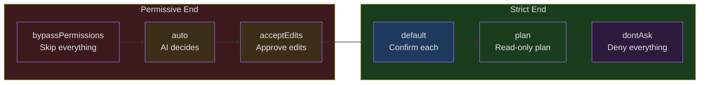
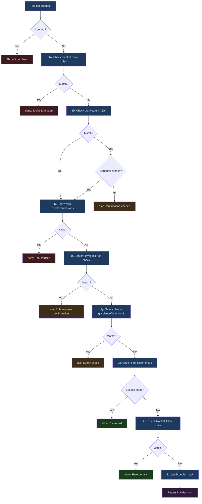
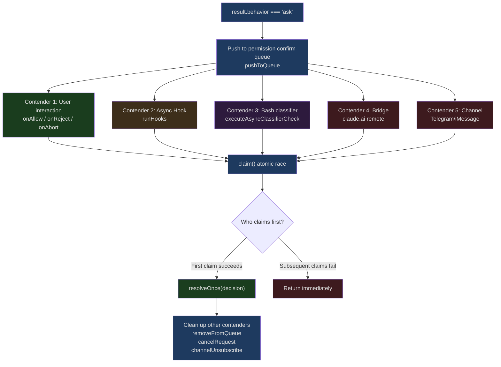

## The Problem

Would you let an AI run `rm -rf /` without asking? Probably not. What about `git push`? The answer is less clear-cut — some people are perfectly fine pushing to their own development branch, while others insist on confirmation before pushing to `main`. And what about `cat package.json`? If every file read required clicking "Allow," the user experience would be maddening.

Every operation carries different risk, so where should the permission boundary be drawn?

This isn't a new problem. Unix's rwx permission model, Android's runtime permissions, the browser's same-origin policy — every platform strikes a balance between capability and security. But AI coding tools face more complex challenges:

1. **Vast action space**: Beyond just reading and writing files, there's command execution, network requests, and calls to external services
2. **Risk assessment requires semantic understanding**: `rm -rf node_modules` and `rm -rf /` look syntactically similar, but carry wildly different levels of risk
3. **Conflicting user expectations**: Users want both "automation" and "safety," both "speed" and "ask me first"
4. **Multi-role collaboration**: The main agent, coordinator workers, and swarm workers have entirely different permission requirements

Claude Code's permission system tackles this problem with an elegantly layered evaluation pipeline. This article provides a complete analysis of its design at the source code level.

---

## Permission Modes Overview

Before diving into the evaluation pipeline, let's look at the permission modes that Claude Code defines. These modes determine the system's "default posture."

### Mode Definitions

Permission modes are defined in `src/types/permissions.ts`:

```typescript
// src/types/permissions.ts, lines 16-38
export const EXTERNAL_PERMISSION_MODES = [
  'acceptEdits',
  'bypassPermissions',
  'default',
  'dontAsk',
  'plan',
] as const

export type ExternalPermissionMode = (typeof EXTERNAL_PERMISSION_MODES)[number]

export type InternalPermissionMode = ExternalPermissionMode | 'auto' | 'bubble'
export type PermissionMode = InternalPermissionMode

export const INTERNAL_PERMISSION_MODES = [
  ...EXTERNAL_PERMISSION_MODES,
  ...(feature('TRANSCRIPT_CLASSIFIER') ? (['auto'] as const) : ([] as const)),
] as const satisfies readonly PermissionMode[]
```

Note that the `auto` mode is gated by `feature('TRANSCRIPT_CLASSIFIER')` — this is an internal-only feature flag. The `bubble` mode is entirely internal and never appears in user-configurable options.

### Mode Behavior Matrix

The specific behavior of each mode is configured in `src/utils/permissions/PermissionMode.ts`:

```typescript
// src/utils/permissions/PermissionMode.ts, lines 42-91
const PERMISSION_MODE_CONFIG: Partial<
  Record<PermissionMode, PermissionModeConfig>
> = {
  default: {
    title: 'Default',
    shortTitle: 'Default',
    symbol: '',
    color: 'text',
    external: 'default',
  },
  plan: {
    title: 'Plan Mode',
    shortTitle: 'Plan',
    symbol: PAUSE_ICON,
    color: 'planMode',
    external: 'plan',
  },
  acceptEdits: {
    title: 'Accept edits',
    shortTitle: 'Accept',
    symbol: '⏵⏵',
    color: 'autoAccept',
    external: 'acceptEdits',
  },
  bypassPermissions: {
    title: 'Bypass Permissions',
    shortTitle: 'Bypass',
    symbol: '⏵⏵',
    color: 'error',
    external: 'bypassPermissions',
  },
  // ...
}
```

Here's a summary of each mode's semantics:

| Mode | Semantics | Typical Use Case |
|------|-----------|-----------------|
| `default` | All non-read-only operations require user confirmation | Day-to-day interactive use |
| `plan` | Only generates plans, does not execute modifications | Code review, architecture discussions |
| `acceptEdits` | Automatically approves file edits, but Bash commands still require confirmation | Trusting the model's editing capabilities |
| `bypassPermissions` | Skips almost all permission checks | CI/CD environments, fully trusted scenarios |
| `dontAsk` | Converts all `ask` results to `deny` | Non-interactive environments |
| `auto` | Uses an AI classifier to automatically assess risk | Internal power users |



This spectrum design is elegant: from "full trust" to "zero trust," users can position themselves wherever suits their scenario. But modes are only the first layer — they determine the "default posture," while the actual permission decisions must pass through multiple layers of evaluation.

---

## The Multi-Layered Evaluation Pipeline

The core entry point for permission evaluation is the `hasPermissionsToUseTool` function, defined in `src/utils/permissions/permissions.ts`. The entire pipeline can be divided into two major phases: **static rule evaluation** (synchronous, fast) and **dynamic interactive evaluation** (asynchronous, potentially involving user interaction).

### Phase 1: Static Rule Evaluation (hasPermissionsToUseToolInner)

```typescript
// src/utils/permissions/permissions.ts, lines 1158-1319
async function hasPermissionsToUseToolInner(
  tool: Tool,
  input: { [key: string]: unknown },
  context: ToolUseContext,
): Promise<PermissionDecision> {
  if (context.abortController.signal.aborted) {
    throw new AbortError()
  }

  let appState = context.getAppState()

  // 1. Check if the tool is denied
  // 1a. Entire tool is denied
  const denyRule = getDenyRuleForTool(appState.toolPermissionContext, tool)
  if (denyRule) {
    return {
      behavior: 'deny',
      decisionReason: { type: 'rule', rule: denyRule },
      message: `Permission to use ${tool.name} has been denied.`,
    }
  }
  // ...
}
```

The complete static evaluation flow, ordered by priority:



The ordering of this sequence is intentional:

**Deny takes priority**: Regardless of the current mode, deny rules are always checked first. This guarantees a security baseline — even in `bypassPermissions` mode, explicit deny rules still take effect.

**Safety checks cannot be bypassed**: Steps 1f and 1g ensure that certain safety checks cannot be circumvented even in `bypassPermissions` mode. Modifications to `.git/`, `.claude/`, and shell configuration files always require confirmation. This embodies the "trust but verify" philosophy — you trust the AI's capabilities, but some operations have consequences too severe to skip.

**Mode check sits in the middle**: The bypassPermissions mode check comes after deny rules and safety checks, but before allow rules. This means bypass mode "skips normal permissions," not "skips everything."

**Passthrough as fallback**: If a tool's own `checkPermissions` returns `passthrough` (meaning "I don't have an opinion on this permission decision"), the system converts it to `ask`, ensuring no operation is silently permitted.

### Phase 2: Dynamic Interactive Evaluation (useCanUseTool and beyond)

When Phase 1 returns `ask`, control flow enters the `useCanUseTool` hook. This is where the real complexity lives:

```typescript
// src/hooks/useCanUseTool.tsx, lines 28-33
function useCanUseTool(setToolUseConfirmQueue, setToolPermissionContext) {
  // ...
  return async (tool, input, toolUseContext, assistantMessage, toolUseID) =>
    new Promise(resolve => {
      const ctx = createPermissionContext(/* ... */)
      // ...
      const result = await hasPermissionsToUseTool(tool, input, toolUseContext, ...)
      // Branch based on result.behavior
    })
}
```

When `result.behavior === 'ask'`, the system enters a multi-contender mode — five sources compete simultaneously to be the first to make a decision: Hooks, the classifier, the user, Bridge (remote via claude.ai), and Channels (Telegram, etc.). We'll explore this in detail in the following sections.

---

## Deep Dive into the Rule System

### Three Types of Rules

Permission rules come in three types, each with independent source tracking:

```typescript
// src/Tool.ts, lines 123-148
export type ToolPermissionContext = DeepImmutable<{
  mode: PermissionMode
  additionalWorkingDirectories: Map<string, AdditionalWorkingDirectory>
  alwaysAllowRules: ToolPermissionRulesBySource
  alwaysDenyRules: ToolPermissionRulesBySource
  alwaysAskRules: ToolPermissionRulesBySource
  isBypassPermissionsModeAvailable: boolean
  isAutoModeAvailable?: boolean
  strippedDangerousRules?: ToolPermissionRulesBySource
  shouldAvoidPermissionPrompts?: boolean
  awaitAutomatedChecksBeforeDialog?: boolean
  prePlanMode?: PermissionMode
}>
```

`ToolPermissionRulesBySource` is essentially `Record<PermissionRuleSource, string[]>`. Each source maps to a set of rule strings. The sources are defined in `src/utils/permissions/permissions.ts`:

```typescript
// src/utils/permissions/permissions.ts, lines 109-114
const PERMISSION_RULE_SOURCES = [
  ...SETTING_SOURCES,   // localSettings, userSettings, projectSettings, policySettings, flagSettings
  'cliArg',             // Command-line arguments
  'command',            // Command level
  'session',            // Session level
] as const satisfies readonly PermissionRuleSource[]
```

The seven sources, ordered from highest to lowest priority:

1. **policySettings**: Enterprise policies (admin-configured, cannot be overridden)
2. **flagSettings**: Feature flags
3. **projectSettings**: Project-level configuration (`.claude/settings.json`)
4. **localSettings**: Local configuration (`.claude/settings.local.json`)
5. **userSettings**: User global configuration (`~/.claude/settings.json`)
6. **cliArg**: Command-line arguments
7. **session**: Temporary choices made by the user during the current session

### Rule Matching Mechanism

The matching logic supports two levels of granularity:

```typescript
// src/utils/permissions/permissions.ts, lines 238-269
function toolMatchesRule(
  tool: Pick<Tool, 'name' | 'mcpInfo'>,
  rule: PermissionRule,
): boolean {
  // Rule must not have content to match the entire tool
  if (rule.ruleValue.ruleContent !== undefined) {
    return false
  }

  const nameForRuleMatch = getToolNameForPermissionCheck(tool)

  // Direct tool name match
  if (rule.ruleValue.toolName === nameForRuleMatch) {
    return true
  }

  // MCP server-level permission: rule "mcp__server1" matches tool "mcp__server1__tool1"
  const ruleInfo = mcpInfoFromString(rule.ruleValue.toolName)
  const toolInfo = mcpInfoFromString(nameForRuleMatch)

  return (
    ruleInfo !== null &&
    toolInfo !== null &&
    (ruleInfo.toolName === undefined || ruleInfo.toolName === '*') &&
    ruleInfo.serverName === toolInfo.serverName
  )
}
```

**Tool-level matching**: The rule `"Bash"` matches all Bash tool invocations.
**Content-level matching**: The rule `"Bash(prefix:npm install)"` only matches Bash commands that start with `npm install`.
**MCP server-level matching**: The rule `"mcp__server1"` matches all tools under that server.

Content-level matching is implemented through `getRuleByContentsForTool`:

```typescript
// src/utils/permissions/permissions.ts, lines 362-389
export function getRuleByContentsForToolName(
  context: ToolPermissionContext,
  toolName: string,
  behavior: PermissionBehavior,
): Map<string, PermissionRule> {
  const ruleByContents = new Map<string, PermissionRule>()
  let rules: PermissionRule[] = []
  switch (behavior) {
    case 'allow': rules = getAllowRules(context); break
    case 'deny':  rules = getDenyRules(context); break
    case 'ask':   rules = getAskRules(context); break
  }
  for (const rule of rules) {
    if (
      rule.ruleValue.toolName === toolName &&
      rule.ruleValue.ruleContent !== undefined &&
      rule.ruleBehavior === behavior
    ) {
      ruleByContents.set(rule.ruleValue.ruleContent, rule)
    }
  }
  return ruleByContents
}
```

The elegance of this design lies in the fact that it's not a simple "allow all / deny all" approach. Instead, it lets users set different permission levels for different operations on the same tool. You can allow `Bash(prefix:npm test)` but deny `Bash(prefix:npm publish)`, or allow `Bash(prefix:git status)` but require confirmation for `Bash(prefix:git push)`.

### Rule Source Tracking Example

At runtime, a rule's lifecycle might look like this:

```
User selects "Always allow for this project" in the interactive dialog
  → Generates PermissionUpdate: { type: 'addRules', destination: 'projectSettings', ... }
  → persistPermissionUpdates writes to .claude/settings.json
  → applyPermissionUpdates updates the in-memory ToolPermissionContext
  → On next match, the rule is found via the projectSettings source
```

---

## The DeepImmutable Design of ToolPermissionContext

Take a closer look at the type definition of `ToolPermissionContext`:

```typescript
// src/Tool.ts, line 123
export type ToolPermissionContext = DeepImmutable<{
  mode: PermissionMode
  additionalWorkingDirectories: Map<string, AdditionalWorkingDirectory>
  alwaysAllowRules: ToolPermissionRulesBySource
  alwaysDenyRules: ToolPermissionRulesBySource
  alwaysAskRules: ToolPermissionRulesBySource
  // ...
}>
```

`DeepImmutable` is a recursive type utility that marks all levels of an object as `readonly`. This is not an accidental design choice — it addresses one of the most dangerous classes of bugs in a permission system: **runtime permission state being accidentally modified**.

Imagine this scenario:

```typescript
// Dangerous mutable design (NOT used by Claude Code)
const context = getToolPermissionContext()
context.mode = 'bypassPermissions'  // Directly modified the global permission mode!
```

With `DeepImmutable`, any code attempting to modify the permission context will trigger a compile-time error. To change permission state, you must create a new object through `setToolPermissionContext` — this ensures that permission state changes are trackable and atomic.

The initialization also uses a clear empty-state factory function:

```typescript
// src/Tool.ts, lines 140-148
export const getEmptyToolPermissionContext: () => ToolPermissionContext =
  () => ({
    mode: 'default',
    additionalWorkingDirectories: new Map(),
    alwaysAllowRules: {},
    alwaysDenyRules: {},
    alwaysAskRules: {},
    isBypassPermissionsModeAvailable: false,
  })
```

The default mode is `default`, all rules are empty, and bypass is unavailable. This is a "secure by default" design — the system starts in its most restrictive state and requires explicit relaxation.

---

## Filesystem Scoping

The permission system doesn't just check "what tools you can use" — it also checks "which files you can operate on." `additionalWorkingDirectories` is a key component of this mechanism.

### Working Directory Boundaries

By default, Claude Code's file operations are restricted to the current working directory (`cwd`). But in practice, projects can span multiple directories — multiple subprojects in a monorepo, shared library directories, and so on. `additionalWorkingDirectories` allows users to extend this boundary.

### Dangerous File and Directory Protection

Even within the working directory, certain files receive additional protection:

```typescript
// src/utils/permissions/filesystem.ts, lines 57-79
export const DANGEROUS_FILES = [
  '.gitconfig',
  '.gitmodules',
  '.bashrc',
  '.bash_profile',
  '.zshrc',
  '.zprofile',
  '.profile',
  '.ripgreprc',
  '.mcp.json',
  '.claude.json',
] as const

export const DANGEROUS_DIRECTORIES = [
  '.git',
  '.vscode',
  '.idea',
  '.claude',
] as const
```

These files share a common characteristic: **modifying them can lead to code execution or data exfiltration**. A modified `.bashrc` means malicious code runs the next time a terminal is opened; a modified `.gitconfig` could lead to credential leakage; a modified `.mcp.json` could introduce a malicious MCP server.

Even in `bypassPermissions` or `auto` mode, modifications to these paths must go through user confirmation (the safety check in step 1g). This is the only non-configurable hard constraint in the entire permission system.

---

## PermissionContext and the ResolveOnce Atomicity Pattern

When permission evaluation enters the interactive phase, the system faces a classic concurrency problem: multiple asynchronous sources may simultaneously make permission decisions. `PermissionContext` and `ResolveOnce` are the core mechanisms for solving this problem.

### createPermissionContext

`createPermissionContext` is defined in `src/hooks/toolPermission/PermissionContext.ts`. It creates a context object that encapsulates all permission operations:

```typescript
// src/hooks/toolPermission/PermissionContext.ts, lines 96-347
function createPermissionContext(
  tool: ToolType,
  input: Record<string, unknown>,
  toolUseContext: ToolUseContext,
  assistantMessage: AssistantMessage,
  toolUseID: string,
  setToolPermissionContext: (context: ToolPermissionContext) => void,
  queueOps?: PermissionQueueOps,
) {
  const ctx = {
    tool,
    input,
    toolUseContext,
    assistantMessage,
    messageId: assistantMessage.message.id,
    toolUseID,
    logDecision(args, opts?) { /* ... */ },
    logCancelled() { /* ... */ },
    async persistPermissions(updates) { /* ... */ },
    resolveIfAborted(resolve) { /* ... */ },
    cancelAndAbort(feedback?, isAbort?, contentBlocks?) { /* ... */ },
    async tryClassifier(pendingClassifierCheck, updatedInput) { /* ... */ },
    async runHooks(permissionMode, suggestions, updatedInput?, startMs?) { /* ... */ },
    buildAllow(updatedInput, opts?) { /* ... */ },
    buildDeny(message, decisionReason) { /* ... */ },
    async handleUserAllow(updatedInput, permissionUpdates, ...) { /* ... */ },
    async handleHookAllow(finalInput, permissionUpdates, ...) { /* ... */ },
    pushToQueue(item) { queueOps?.push(item) },
    removeFromQueue() { queueOps?.remove(toolUseID) },
    updateQueueItem(patch) { queueOps?.update(toolUseID, patch) },
  }
  return Object.freeze(ctx)
}
```

Note the last line, `Object.freeze(ctx)` — the context object is frozen and cannot be modified. This is consistent with the `DeepImmutable` design philosophy: permission-related objects should be immutable.

### ResolveOnce: Atomic Decision Guarantee

When multiple sources compete to make a permission decision, the most dangerous scenario is a "double decision" — a Hook approves the operation while the user simultaneously clicks "Deny." If both decisions are executed, the system state becomes inconsistent.

`ResolveOnce` solves this problem with a clean atomicity pattern:

```typescript
// src/hooks/toolPermission/PermissionContext.ts, lines 63-94
type ResolveOnce<T> = {
  resolve(value: T): void
  isResolved(): boolean
  claim(): boolean
}

function createResolveOnce<T>(resolve: (value: T) => void): ResolveOnce<T> {
  let claimed = false
  let delivered = false
  return {
    resolve(value: T) {
      if (delivered) return
      delivered = true
      claimed = true
      resolve(value)
    },
    isResolved() {
      return claimed
    },
    claim() {
      if (claimed) return false
      claimed = true
      return true
    },
  }
}
```

There are two flags here, `claimed` and `delivered`, and the distinction between them matters:

- `claimed`: Indicates "someone has claimed the decision authority." Once set, subsequent `claim()` calls from other contenders return `false`.
- `delivered`: Indicates "the Promise has been resolved." Prevents `resolve` from being called multiple times.

Why two flags instead of one? Because in asynchronous callbacks, there may be `await` operations between `claim()` and `resolve()`:

```typescript
// src/hooks/toolPermission/handlers/interactiveHandler.ts, lines 159-161
async onAllow(updatedInput, permissionUpdates, feedback?, contentBlocks?) {
  if (!claim()) return // Atomic check: if another source already decided, exit immediately
  // ↑ Between here and resolveOnce below, there may be awaits
  resolveOnce(
    await ctx.handleUserAllow(updatedInput, permissionUpdates, ...)
  )
}
```

If only the `delivered` flag were used, two callbacks could both pass the `!delivered` check and then both execute `await ctx.handleUserAllow`, causing double processing. The atomic `claim()` check closes this window.

---

## Three Permission Handlers

The interactive phase of the permission system is managed by three specialized handlers, each corresponding to a different runtime scenario.

### interactiveHandler: Interactive Handling for the Main Agent

This is the most complex handler because it needs to coordinate the most competing sources. It's defined in `src/hooks/toolPermission/handlers/interactiveHandler.ts`.

```typescript
// src/hooks/toolPermission/handlers/interactiveHandler.ts, lines 57-60
function handleInteractivePermission(
  params: InteractivePermissionParams,
  resolve: (decision: PermissionDecision) => void,
): void {
```

Note the return type is `void`, not `Promise`. This function doesn't wait for a decision to complete — it sets up all callbacks and returns immediately. The decision happens asynchronously via callbacks.

The competing sources include:

1. **User interaction** (onAllow / onReject / onAbort)
2. **Async Hook execution** (runHooks)
3. **Bash classifier** (executeAsyncClassifierCheck)
4. **Bridge remote response** (approval/denial from claude.ai)
5. **Channel response** (approval/denial from Telegram/iMessage, etc.)



One noteworthy detail is the classifier's user interaction protection mechanism:

```typescript
// src/hooks/toolPermission/handlers/interactiveHandler.ts, lines 108-122
onUserInteraction() {
  // Grace period: ignore interactions in the first 200ms to prevent
  // accidental keypresses from canceling the classifier prematurely
  const GRACE_PERIOD_MS = 200
  if (Date.now() - permissionPromptStartTimeMs < GRACE_PERIOD_MS) {
    return
  }
  userInteracted = true
  clearClassifierChecking(ctx.toolUseID)
  clearClassifierIndicator()
},
```

When the user starts interacting with the permission dialog (pressing arrow keys, Tab, or typing), the classifier's auto-approval is canceled. But there's a 200ms grace period — this prevents accidental keypresses when the dialog first appears from prematurely canceling the classifier. This kind of fine-tuned UX polish reflects the engineering team's experience.

### coordinatorHandler: Serial Pre-screening for Coordinator Workers

The coordinator worker's (coordinator sub-agent) handling logic is simpler. Since it runs within the main agent's context but can't directly display UI, it first runs automated checks serially, and only falls back to an interactive dialog if none of them can make a decision:

```typescript
// src/hooks/toolPermission/handlers/coordinatorHandler.ts, lines 26-62
async function handleCoordinatorPermission(
  params: CoordinatorPermissionParams,
): Promise<PermissionDecision | null> {
  const { ctx, updatedInput, suggestions, permissionMode } = params

  try {
    // 1. Try permission hooks first (fast, local)
    const hookResult = await ctx.runHooks(
      permissionMode, suggestions, updatedInput,
    )
    if (hookResult) return hookResult

    // 2. Try classifier (slow, inference -- bash only)
    const classifierResult = feature('BASH_CLASSIFIER')
      ? await ctx.tryClassifier?.(params.pendingClassifierCheck, updatedInput)
      : null
    if (classifierResult) return classifierResult
  } catch (error) {
    if (error instanceof Error) {
      logError(error)
    } else {
      logError(new Error(`Automated permission check failed: ${String(error)}`))
    }
  }

  // 3. Neither resolved -- fall through to dialog.
  return null
}
```

The key difference: the interactive handler lets Hooks and the classifier **race in parallel** with the user; the coordinator handler runs them **serially before displaying the dialog**. This is because the coordinator worker's `awaitAutomatedChecksBeforeDialog` flag is `true` — its design philosophy is "let automated systems try to resolve it first; only bother the user if they can't."

### swarmWorkerHandler: Mailbox Forwarding for Swarm Workers

Swarm workers (cluster work nodes) are the most unique role — they can't directly interact with users or display permission dialogs. Their strategy is: try the classifier for auto-approval first, and if that fails, forward the permission request to the leader:

```typescript
// src/hooks/toolPermission/handlers/swarmWorkerHandler.ts, lines 40-156
async function handleSwarmWorkerPermission(
  params: SwarmWorkerPermissionParams,
): Promise<PermissionDecision | null> {
  if (!isAgentSwarmsEnabled() || !isSwarmWorker()) {
    return null  // Not in a swarm environment, return null to fall back to interactive handling
  }

  // Try classifier auto-approval first
  const classifierResult = feature('BASH_CLASSIFIER')
    ? await ctx.tryClassifier?.(params.pendingClassifierCheck, updatedInput)
    : null
  if (classifierResult) return classifierResult

  // Forward permission request to the leader
  const decision = await new Promise<PermissionDecision>(resolve => {
    const { resolve: resolveOnce, claim } = createResolveOnce(resolve)

    const request = createPermissionRequest({
      toolName: ctx.tool.name,
      toolUseId: ctx.toolUseID,
      input: ctx.input,
      description,
      permissionSuggestions: suggestions,
    })

    // Register callback first, then send request — avoids race conditions
    registerPermissionCallback({
      requestId: request.id,
      toolUseId: ctx.toolUseID,
      async onAllow(allowedInput, permissionUpdates, feedback?, contentBlocks?) {
        if (!claim()) return
        // ...
      },
      onReject(feedback?, contentBlocks?) {
        if (!claim()) return
        // ...
      },
    })

    // Send the request
    void sendPermissionRequestViaMailbox(request)

    // Display a waiting indicator
    ctx.toolUseContext.setAppState(prev => ({
      ...prev,
      pendingWorkerRequest: { toolName: ctx.tool.name, toolUseId: ctx.toolUseID, description },
    }))

    // Handle abort signal
    ctx.toolUseContext.abortController.signal.addEventListener('abort', () => {
      if (!claim()) return
      resolveOnce(ctx.cancelAndAbort(undefined, true))
    }, { once: true })
  })

  return decision
}
```

There's an elegant race condition guard here: **register the callback first, then send the request**. If the order were reversed, the following scenario could occur:

1. Worker sends permission request to the leader
2. Leader responds instantly
3. The response arrives before the callback is registered
4. The response is dropped

By registering first and sending second, even if the leader's response arrives before `sendPermissionRequestViaMailbox` returns, the callback is already in place to handle it.

### Handler Dispatch Logic

In `useCanUseTool.tsx`, the three handlers are dispatched in the following order:

```typescript
// src/hooks/useCanUseTool.tsx, lines 94-168
case "ask": {
  // 1. Coordinator pre-check (if awaitAutomatedChecksBeforeDialog)
  if (appState.toolPermissionContext.awaitAutomatedChecksBeforeDialog) {
    const coordinatorDecision = await handleCoordinatorPermission({...})
    if (coordinatorDecision) {
      resolve(coordinatorDecision)
      return
    }
  }

  // 2. Swarm worker handling (if in swarm environment)
  const swarmDecision = await handleSwarmWorkerPermission({...})
  if (swarmDecision) {
    resolve(swarmDecision)
    return
  }

  // 3. Interactive handling (fallback for the main agent)
  handleInteractivePermission({
    ctx, description, result,
    awaitAutomatedChecksBeforeDialog: ...,
    bridgeCallbacks: ...,
    channelCallbacks: ...,
  }, resolve)
  return
}
```

This is a classic chain of responsibility pattern: each handler either returns a decision (non-null) or returns null to pass control to the next handler. The final `handleInteractivePermission` serves as the fallback — it can always handle the request (by displaying UI).

---

## Auto Mode and the AI Classifier

`auto` mode is the most cutting-edge part of the permission system. Rather than simply allowing or denying all operations, it uses an AI classifier to assess the risk of each operation.

### Classifier Evaluation Flow

When the mode is `auto`, `hasPermissionsToUseTool` goes through a series of fast-path checks before returning `ask`:

```typescript
// src/utils/permissions/permissions.ts, lines 519-648 (simplified)
if (appState.toolPermissionContext.mode === 'auto') {
  // Fast path 1: Safety checks cannot be bypassed by the classifier
  if (result.decisionReason?.type === 'safetyCheck' && !result.decisionReason.classifierApprovable) {
    return result  // Keep as ask
  }

  // Fast path 2: Tools that require user interaction
  if (tool.requiresUserInteraction?.()) {
    return result
  }

  // Fast path 3: Operations that acceptEdits mode would allow
  const acceptEditsResult = await tool.checkPermissions(parsedInput, {
    ...context,
    getAppState: () => ({
      ...state,
      toolPermissionContext: { ...state.toolPermissionContext, mode: 'acceptEdits' },
    }),
  })
  if (acceptEditsResult.behavior === 'allow') {
    return { behavior: 'allow', ... }  // Allow directly, no classifier needed
  }

  // Fast path 4: Safe tool allowlist
  if (classifierDecisionModule.isAutoModeAllowlistedTool(tool.name)) {
    return { behavior: 'allow', ... }
  }

  // Final: Call the classifier API
  // ...
}
```

This design embodies the concept of "progressive trust":

1. Hard safety checks can never be bypassed
2. If `acceptEdits` mode considers something safe, then `auto` mode should too — avoiding unnecessary classifier API calls
3. Allowlisted tools (such as read-only tools) pass through directly
4. Only operations that genuinely require judgment are sent to the classifier

### Consecutive Denial Tracking

`auto` mode also has a consecutive denial tracking mechanism (`denialTracking`). When the classifier consecutively denies multiple operations, the system falls back to interactive prompting. This prevents an overly conservative classifier from completely stalling the workflow.

---

## Hook Pre-screening Mechanism

Permission hooks are key to Claude Code's extensibility. Users can configure custom `PermissionRequest` hooks to add additional logic beyond the standard permission checks.

### Hooks' Position in the Pipeline

The timing of hook execution depends on the runtime mode:

- **Interactive mode**: Hooks race in parallel with the user dialog (fire-and-forget async)
- **Coordinator mode**: Hooks execute serially before the dialog is displayed
- **Swarm mode**: Hooks don't participate directly (executed on the leader side)

```typescript
// src/hooks/toolPermission/PermissionContext.ts, lines 216-263
async runHooks(
  permissionMode, suggestions, updatedInput?, permissionPromptStartTimeMs?,
): Promise<PermissionDecision | null> {
  for await (const hookResult of executePermissionRequestHooks(
    tool.name, toolUseID, input, toolUseContext,
    permissionMode, suggestions, toolUseContext.abortController.signal,
  )) {
    if (hookResult.permissionRequestResult) {
      const decision = hookResult.permissionRequestResult
      if (decision.behavior === 'allow') {
        return await this.handleHookAllow(finalInput, decision.updatedPermissions ?? [], ...)
      } else if (decision.behavior === 'deny') {
        // Hooks can also set interrupt: true to abort the entire session
        if (decision.interrupt) {
          toolUseContext.abortController.abort()
        }
        return this.buildDeny(decision.message || 'Permission denied by hook', ...)
      }
    }
  }
  return null  // No hook made a decision
}
```

Hooks can do three things:

1. **Allow** (`behavior: 'allow'`): Skip user confirmation and execute directly. Can include `updatedPermissions` to persist new rules.
2. **Deny** (`behavior: 'deny'`): Block execution. Can set `interrupt: true` to abort the entire session.
3. **Make no decision** (no return or skip): Let other mechanisms continue processing.

### Hook Handling for Headless Agents

For headless agents where `shouldAvoidPermissionPrompts` is `true` (background agents running without UI), hooks are the only path to automated approval. If hooks don't make a decision, the operation is automatically denied:

```typescript
// src/utils/permissions/permissions.ts, lines 400-470
async function runPermissionRequestHooksForHeadlessAgent(
  tool, input, toolUseID, context, permissionMode, suggestions,
): Promise<PermissionDecision | null> {
  try {
    for await (const hookResult of executePermissionRequestHooks(
      tool.name, toolUseID, input, context,
      permissionMode, suggestions, context.abortController.signal,
    )) {
      if (!hookResult.permissionRequestResult) continue
      const decision = hookResult.permissionRequestResult
      if (decision.behavior === 'allow') {
        // Persist updates, return allow
        return { behavior: 'allow', updatedInput: finalInput, decisionReason: { type: 'hook', ... } }
      }
      if (decision.behavior === 'deny') {
        return { behavior: 'deny', message: ..., decisionReason: { type: 'hook', ... } }
      }
    }
  } catch (error) {
    logError(new Error('PermissionRequest hook failed for headless agent', { cause: toError(error) }))
  }
  return null  // Caller will execute auto-deny
}
```

---

## Permission Queue and React State Bridging

The permission dialog isn't a simple `window.confirm` — it's a full React component that supports editing input, selecting persistence options, providing feedback, and more. The permission system interfaces with React state through the `PermissionQueueOps` interface:

```typescript
// src/hooks/toolPermission/PermissionContext.ts, lines 357-379
function createPermissionQueueOps(
  setToolUseConfirmQueue: React.Dispatch<React.SetStateAction<ToolUseConfirm[]>>,
): PermissionQueueOps {
  return {
    push(item: ToolUseConfirm) {
      setToolUseConfirmQueue(queue => [...queue, item])
    },
    remove(toolUseID: string) {
      setToolUseConfirmQueue(queue =>
        queue.filter(item => item.toolUseID !== toolUseID),
      )
    },
    update(toolUseID: string, patch: Partial<ToolUseConfirm>) {
      setToolUseConfirmQueue(queue =>
        queue.map(item =>
          item.toolUseID === toolUseID ? { ...item, ...patch } : item,
        ),
      )
    },
  }
}
```

This is an elegant "bridging" design — the permission logic has zero dependency on React. `PermissionQueueOps` is a generic interface, and any system that can provide `push`/`remove`/`update` operations can replace the React implementation. This also means the permission system can be ported to other UI frameworks or entirely UI-less environments.

### recheckPermission: Hot-reloading Permissions

The permission dialog also has a special `recheckPermission` callback that allows permissions to be re-evaluated while the dialog is displayed:

```typescript
// src/hooks/toolPermission/handlers/interactiveHandler.ts, lines 204-231
async recheckPermission() {
  if (isResolved()) return
  const freshResult = await hasPermissionsToUseTool(
    ctx.tool, ctx.input, ctx.toolUseContext, ctx.assistantMessage, ctx.toolUseID,
  )
  if (freshResult.behavior === 'allow') {
    if (!claim()) return
    if (bridgeCallbacks && bridgeRequestId) {
      bridgeCallbacks.cancelRequest(bridgeRequestId)
    }
    channelUnsubscribe?.()
    ctx.removeFromQueue()
    ctx.logDecision({ decision: 'accept', source: 'config' })
    resolveOnce(ctx.buildAllow(freshResult.updatedInput ?? ctx.input))
  }
},
```

This solves a practical scenario: a user switches permission modes on claude.ai (Bridge) — say from `default` to `bypassPermissions` — and the permission dialog currently displayed on the CLI side should immediately disappear, with the operation continuing automatically. `recheckPermission` is called when a mode switch event fires, re-evaluates permissions, and if the new mode allows the operation, auto-approves it and dismisses the dialog.

---

## Visual Feedback for Classifier Auto-Approval

When the classifier auto-approves an operation before the user makes a decision, the interactive handler displays a brief checkmark:

```typescript
// src/hooks/toolPermission/handlers/interactiveHandler.ts, lines 469-521
onAllow: decisionReason => {
  if (!claim()) return
  // ...

  // Show auto-approval transition animation
  if (feature('TRANSCRIPT_CLASSIFIER')) {
    ctx.updateQueueItem({
      classifierCheckInProgress: false,
      classifierAutoApproved: true,
      classifierMatchedRule: matchedRule,
    })
  }

  // Keep the checkmark visible for a period, then remove the dialog
  // 3 seconds when terminal is focused, 1 second when not
  // User can press Esc to dismiss early (via onDismissCheckmark)
  const checkmarkMs = getTerminalFocused() ? 3000 : 1000
  checkmarkTransitionTimer = setTimeout(() => {
    ctx.removeFromQueue()
  }, checkmarkMs)
},
```

This design considers user perception:

- **Terminal focused**: The user is likely looking at the screen, so give them 3 seconds to notice the operation was auto-approved
- **Terminal unfocused**: The user isn't watching, so 1 second is enough
- **Manually dismissible**: Pressing Esc closes it immediately without blocking the workflow
- **Abort-safe**: If a sibling abort occurs during the checkmark display (e.g., another tool fails), the checkmark dialog is properly cleaned up

---

## Transferable Patterns: Building Layered Permission Systems for AI Applications

The permission system design in Claude Code can be distilled into a set of general-purpose architectural patterns for AI application permissions. Here are the key design principles and their corresponding implementation strategies.

### Principle 1: Layered Evaluation, Deny First

```
Deny rules → Safety checks → Mode check → Allow rules → Tool's own judgment → Default Ask
```

Each layer does one thing, and the evaluation order is fixed. Deny rules come first to ensure the security baseline cannot be bypassed. This pattern can be directly applied to any AI application requiring permission control.

### Principle 2: Immutable State + Atomic Decisions

Permission state is protected with `DeepImmutable`, and the decision process is guaranteed atomic with `ResolveOnce`. When your system has multiple asynchronous sources that might simultaneously make decisions (users, automated systems, remote approvers), the `claim()` pattern is a lightweight yet reliable solution.

### Principle 3: Secure Defaults + Explicit Relaxation

```typescript
// Default state: most restrictive
const empty = {
  mode: 'default',
  alwaysAllowRules: {},
  alwaysDenyRules: {},
  alwaysAskRules: {},
  isBypassPermissionsModeAvailable: false,
}
```

The system starts in its "safest" state. Every relaxation requires an explicit action — a user clicking "Always allow," an admin configuring a policy, or a command-line argument being passed. This ensures security is never accidentally weakened due to missing configuration.

### Principle 4: Rule Source Tracking

Every rule carries source information (which configuration file, which layer). This is used not only for priority ordering but also for auditing — when a permission issue arises, you can pinpoint exactly "where this rule came from."

```typescript
type PermissionRule = {
  source: PermissionRuleSource  // 'projectSettings' | 'userSettings' | ...
  ruleBehavior: 'allow' | 'deny' | 'ask'
  ruleValue: PermissionRuleValue  // { toolName: string, ruleContent?: string }
}
```

### Principle 5: Handler Separation

Different runtime environments have different permission requirements. Claude Code's three handler patterns — interactive (competitive), coordinator (serial pre-screening), and swarm (mailbox forwarding) — demonstrate how to adapt a single rule system to different execution environments.

The core abstraction is `PermissionContext`: it encapsulates all permission operations (logging, persistence, queue management), letting handlers focus solely on flow control. When adding a new runtime environment, you only need to implement a new handler function — no modifications to the rule evaluation logic are required.

### Principle 6: Progressive Trust

The `auto` mode classifier doesn't call AI evaluation on every operation — it first uses fast paths to filter out clearly safe and clearly dangerous operations:

```
Safety checks (non-bypassable) → acceptEdits fast path → Allowlist fast path → Classifier API
```

Each additional fast-path layer eliminates a batch of unnecessary API calls. This pattern applies to any system that uses AI for runtime decision-making.

### Practical Architecture Recommendations

If you're building a permission system for an AI application, you can start with this minimal architecture:

```typescript
// Minimal permission system skeleton
type PermissionDecision = { behavior: 'allow' | 'deny' | 'ask' }

type PermissionRule = {
  source: string
  behavior: 'allow' | 'deny' | 'ask'
  pattern: string  // Matches tool name or operation content
}

// 1. Static evaluation
function evaluateStaticRules(
  action: string,
  rules: PermissionRule[],
): PermissionDecision | null {
  // Deny first
  const denyMatch = rules.find(r => r.behavior === 'deny' && matches(action, r.pattern))
  if (denyMatch) return { behavior: 'deny' }

  // Allow match
  const allowMatch = rules.find(r => r.behavior === 'allow' && matches(action, r.pattern))
  if (allowMatch) return { behavior: 'allow' }

  return null  // No rule matched, pass to dynamic evaluation
}

// 2. Dynamic evaluation (extensible)
async function evaluateDynamic(
  action: string,
  handlers: PermissionHandler[],
): Promise<PermissionDecision> {
  for (const handler of handlers) {
    const decision = await handler.evaluate(action)
    if (decision) return decision
  }
  return { behavior: 'ask' }  // Fallback: ask the user
}
```

Then incrementally add features as needed:

- **Immutable state protection**: Prevent runtime modifications
- **Atomic racing**: When there are multiple asynchronous decision sources
- **Source tracking**: When auditing or debugging is needed
- **Classifier integration**: When the action space is too large for rules to cover
- **Handler separation**: When there are multiple runtime environments

---

## Conclusion

Claude Code's permission system is a multi-layered defense system. Its core insight is that **permissions are not a binary choice (allow/deny), but a continuous spectrum across multiple dimensions**.

- **Mode dimension**: From `bypassPermissions` to `dontAsk`, users choose their own risk tolerance
- **Rule dimension**: From blanket tool-level to content-level, supporting fine-grained permission control
- **Source dimension**: From policies to sessions, multiple configuration layers stack on top of each other
- **Role dimension**: The main agent, coordinator, and swarm workers each have distinct handling flows
- **Temporal dimension**: The classifier, Hooks, and user interaction race along the timeline, with the first to decide winning

The engineering implementation of this system contains many patterns worth learning: `DeepImmutable` protects state safety, `ResolveOnce` guarantees atomicity, handler separation ensures extensibility, and progressive fast paths reduce unnecessary computation. These patterns are not limited to permission systems — any system involving multi-source asynchronous decision-making can draw from them.

Finally, returning to the opening question: where should the permission boundary be drawn? Claude Code's answer is — **don't draw a fixed line; instead, provide a toolkit that lets each user draw their own**. This is perhaps the most pragmatic approach to AI tool safety today.
