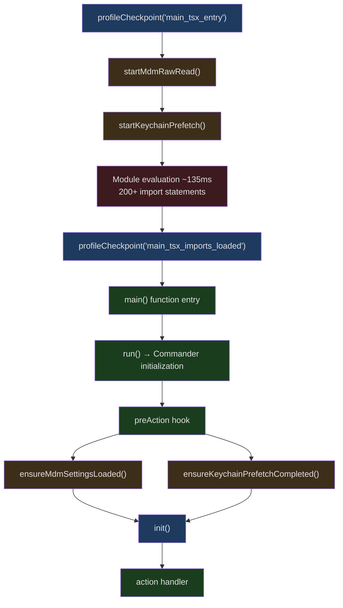
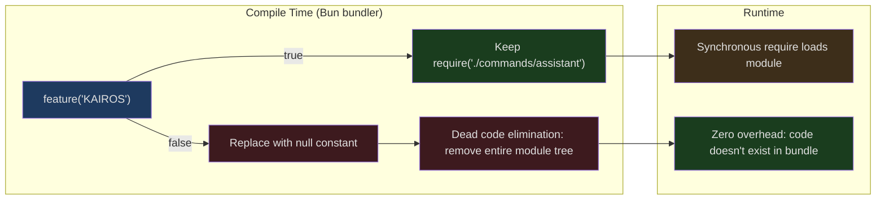

## The Problem

Claude Code is a large TypeScript CLI application. It depends on heavy modules like OpenTelemetry (~400KB) and gRPC (via `@grpc/grpc-js`, ~700KB), has over 1,900 source files, and registers 60+ slash commands and 30+ tools. When a user types `claude` in their terminal and hits Enter, the application needs to:

1. Parse and evaluate all top-level module imports
2. Read multi-layered configuration (MDM enterprise policies, macOS Keychain, user settings, project settings...)
3. Initialize telemetry, permissions, and GrowthBook feature flags
4. Connect to MCP servers, load plugins and skills
5. Restore or create a session and render the interactive TUI

If this process were executed naively in sequence, cold start would easily exceed one second. Yet in practice, `claude` responds quite quickly. How does it pull this off?

This article dives deep into Claude Code's startup path, starting from the first line of code in `main.tsx`, analyzing every optimization technique it employs layer by layer: parallel prefetching, Bun compile-time dead code elimination, dynamic lazy loading, performance profiling infrastructure, and the deferred require pattern for handling circular dependencies.

## Phased Initialization in main.tsx

Claude Code's entry file `src/main.tsx` serves as the "orchestration center" for the entire startup flow. Its design philosophy is to split startup into multiple phases, parallelize each phase as much as possible, and precisely measure the duration of each phase through `profileCheckpoint()`.

```typescript
// src/main.tsx:1-20
// These side-effects must run before all other imports:
// 1. profileCheckpoint marks entry before heavy module evaluation begins
// 2. startMdmRawRead fires MDM subprocesses (plutil/reg query) so they run in
//    parallel with the remaining ~135ms of imports below
// 3. startKeychainPrefetch fires both macOS keychain reads (OAuth + legacy API
//    key) in parallel — isRemoteManagedSettingsEligible() otherwise reads them
//    sequentially via sync spawn inside applySafeConfigEnvironmentVariables()
//    (~65ms on every macOS startup)
import { profileCheckpoint, profileReport } from './utils/startupProfiler.js';

// eslint-disable-next-line custom-rules/no-top-level-side-effects
profileCheckpoint('main_tsx_entry');
import { startMdmRawRead } from './utils/settings/mdm/rawRead.js';

// eslint-disable-next-line custom-rules/no-top-level-side-effects
startMdmRawRead();
import { ensureKeychainPrefetchCompleted, startKeychainPrefetch } from './utils/secureStorage/keychainPrefetch.js';

// eslint-disable-next-line custom-rules/no-top-level-side-effects
startKeychainPrefetch();
```

The placement of these three top-level side effects is carefully deliberate — they are positioned before all other `import` statements. In JavaScript/TypeScript, `import` statements are static and modules are synchronously evaluated at import time. `main.tsx` has close to 200 lines of `import` statements, and module evaluation takes approximately 135ms. By placing the timestamp at the very first line (`profileCheckpoint('main_tsx_entry')`) and then immediately launching two async subprocesses, those subprocesses can run in parallel with the subsequent 135ms of module evaluation.

Once all `import` statements complete, the code immediately records:

```typescript
// src/main.tsx:209
profileCheckpoint('main_tsx_imports_loaded');
```

This phased model can be summarized with the following diagram:



Note that the `main()` function itself (line 585) is not where everything happens. After setting up signal handlers and security checks, it calls `run()` (line 884), which creates a Commander instance and uses a `preAction` hook to defer initialization — `init()` only runs when actually executing a command (not when simply displaying `--help`):

```typescript
// src/main.tsx:905-917
// Use preAction hook to run initialization only when executing a command,
// not when displaying help. This avoids the need for env variable signaling.
program.hook('preAction', async thisCommand => {
    profileCheckpoint('preAction_start');
    // Await async subprocess loads started at module evaluation (lines 12-20).
    // Nearly free — subprocesses complete during the ~135ms of imports above.
    await Promise.all([ensureMdmSettingsLoaded(), ensureKeychainPrefetchCompleted()]);
    profileCheckpoint('preAction_after_mdm');
    await init();
    profileCheckpoint('preAction_after_init');
    // ...
});
```

The `preAction` hook first awaits the previously launched async subprocesses — but since they ran in parallel with the 135ms of imports, they've usually already completed by this point, making the `await` essentially zero-cost.

## Parallel Prefetching: startMdmRawRead() and startKeychainPrefetch()

These two functions are among the most elegant designs in Claude Code's startup optimization. Their core idea is: **launch async subprocesses to perform time-consuming I/O operations during the synchronous blocking period of module evaluation**.

### MDM Raw Read

`startMdmRawRead()` is responsible for reading enterprise MDM (Mobile Device Management) configuration. On macOS, this means reading plist files via the `plutil` subprocess; on Windows, it reads the registry via `reg query`.

```typescript
// src/utils/settings/mdm/rawRead.ts:55-60
export function fireRawRead(): Promise<RawReadResult> {
  return (async (): Promise<RawReadResult> => {
    if (process.platform === 'darwin') {
      const plistPaths = getMacOSPlistPaths()
      const allResults = await Promise.all(
        // ... execute plutil in parallel for each plist path
```

The key point is that `fireRawRead()` returns a `Promise` that is called immediately during module evaluation, with the subprocess running in the background. The result is cached via a module-level variable `rawReadPromise`:

```typescript
// src/utils/settings/mdm/rawRead.ts:30
let rawReadPromise: Promise<RawReadResult> | null = null
```

### Keychain Prefetch

`startKeychainPrefetch()` is even more refined. Reading the Keychain on macOS requires calling the system's `security` command-line tool, with each call taking approximately 32-33ms. Claude Code needs to read two entries:

1. **OAuth credentials** (`"Claude Code-credentials"`) — ~32ms
2. **Legacy API key** (`"Claude Code"`) — ~33ms

If executed sequentially, this wastes approximately 65ms on every macOS startup. Prefetching parallelizes these two reads:

```typescript
// src/utils/secureStorage/keychainPrefetch.ts:45-60
function spawnSecurity(serviceName: string): Promise<SpawnResult> {
  return new Promise(resolve => {
    execFile(
      'security',
      ['find-generic-password', '-a', getUsername(), '-w', '-s', serviceName],
      { encoding: 'utf-8', timeout: KEYCHAIN_PREFETCH_TIMEOUT_MS },
      (err, stdout) => {
        resolve({
          stdout: err ? null : stdout?.trim() || null,
          timedOut: Boolean(err && 'killed' in err && err.killed),
        })
      },
    )
  })
}
```

Note that this module's import chain is intentionally minimal — it directly imports `child_process` and a lightweight `macOsKeychainHelpers.ts`, rather than the full `macOsKeychainStorage.ts`. The source code comments explicitly explain why:

```
// Imports stay minimal: child_process + macOsKeychainHelpers.ts (NOT
// macOsKeychainStorage.ts — that pulls in execa → human-signals →
// cross-spawn, ~58ms of synchronous module init).
```

Importing the full keychain storage module would bring in `execa`, `human-signals`, `cross-spawn`, and other dependencies — synchronous module initialization alone would take ~58ms, which completely defeats the purpose of prefetching.

### Parallel Timing Diagram

The following timing diagram illustrates the "execute async I/O during synchronous blocking" pattern:

```mermaid
gantt
    title Startup Phase Parallel Timing
    dateFormat X
    axisFormat %L ms

    section Main Thread (Synchronous)
    profileCheckpoint entry     :a1, 0, 1
    startMdmRawRead()           :a2, 1, 2
    startKeychainPrefetch()     :a3, 2, 3
    Module evaluation 200+ imports :a4, 3, 138

    section MDM Subprocess (Async)
    plutil/reg query            :b1, 2, 50

    section Keychain Subprocess (Async)
    security OAuth              :c1, 3, 35
    security API key            :c2, 3, 36

    section preAction
    ensureMdmSettingsLoaded     :d1, 138, 140
    ensureKeychainPrefetchCompleted :d2, 138, 140
    init()                      :d3, 140, 180
```



By the time the `preAction` phase awaits these Promises, the subprocesses have long since completed. The `await` simply retrieves results from cache with virtually zero overhead. This is the essence of the "fire-and-forget + late-collect" pattern.

### Special Handling for --bare Mode

It's worth noting that `startKeychainPrefetch()` is skipped in `--bare` mode:

```typescript
// src/utils/secureStorage/keychainPrefetch.ts (concept)
if (isBareMode()) return  // --bare mode doesn't read keychain
```

`--bare` is a minimal mode that skips hooks, LSP, plugin sync, auto-memory, background prefetching, Keychain reads, and CLAUDE.md auto-discovery. Authentication is strictly limited to `ANTHROPIC_API_KEY` or `apiKeyHelper` configured via `--settings`. This is designed for scripting and CI/CD scenarios, optimizing for the fastest possible startup.

## feature() and Bun Compile-Time Dead Code Elimination

Claude Code uses Bun for building and bundling. Bun provides a special module `bun:bundle` whose `feature()` function implements compile-time conditional compilation — this is not a runtime feature flag but a decision made at build time about whether code is included in the final output.

```typescript
// src/commands.ts:59
import { feature } from 'bun:bundle';
```

### How It Works

`feature()` is evaluated at compile time to a `true` or `false` constant. Bun's bundler (or the JavaScript engine's dead code elimination) then removes branches that will never execute. This means disabled features don't just avoid execution — their **entire module trees** are never loaded.

In `src/commands.ts`, this pattern is used extensively:

```typescript
// src/commands.ts:62-122
const proactive =
  feature('PROACTIVE') || feature('KAIROS')
    ? require('./commands/proactive.js').default
    : null
const briefCommand =
  feature('KAIROS') || feature('KAIROS_BRIEF')
    ? require('./commands/brief.js').default
    : null
const assistantCommand = feature('KAIROS')
  ? require('./commands/assistant/index.js').default
  : null
const bridge = feature('BRIDGE_MODE')
  ? require('./commands/bridge/index.js').default
  : null
const remoteControlServerCommand =
  feature('DAEMON') && feature('BRIDGE_MODE')
    ? require('./commands/remoteControlServer/index.js').default
    : null
const voiceCommand = feature('VOICE_MODE')
  ? require('./commands/voice/index.js').default
  : null
const forceSnip = feature('HISTORY_SNIP')
  ? require('./commands/force-snip.js').default
  : null
const workflowsCmd = feature('WORKFLOW_SCRIPTS')
  ? (require('./commands/workflows/index.js') as typeof import('./commands/workflows/index.js')).default
  : null
const webCmd = feature('CCR_REMOTE_SETUP')
  ? (require('./commands/remote-setup/index.js') as typeof import('./commands/remote-setup/index.js')).default
  : null
```

Note the use of `require()` rather than `import` — this is intentional. `import` is static and will be executed during module evaluation regardless of any surrounding conditions. `require()` is dynamic and only executes when `feature()` returns `true`. When `feature()` evaluates to `false` at compile time, the entire `require()` call (and its dependency tree) is eliminated.

### Application in the Tool System

The same pattern is used extensively in `src/tools.ts` to control tool loading:

```typescript
// src/tools.ts:26-53
const SleepTool =
  feature('PROACTIVE') || feature('KAIROS')
    ? require('./tools/SleepTool/SleepTool.js').SleepTool
    : null
const cronTools = feature('AGENT_TRIGGERS')
  ? [
      require('./tools/ScheduleCronTool/CronCreateTool.js').CronCreateTool,
      require('./tools/ScheduleCronTool/CronDeleteTool.js').CronDeleteTool,
      require('./tools/ScheduleCronTool/CronListTool.js').CronListTool,
    ]
  : []
const MonitorTool = feature('MONITOR_TOOL')
  ? require('./tools/MonitorTool/MonitorTool.js').MonitorTool
  : null
const WebBrowserTool = feature('WEB_BROWSER_TOOL')
  ? require('./tools/WebBrowserTool/WebBrowserTool.js').WebBrowserTool
  : null
const SnipTool = feature('HISTORY_SNIP')
  ? require('./tools/SnipTool/SnipTool.js').SnipTool
  : null
```

### Performance Impact Analysis

Suppose an external release build has `PROACTIVE`, `KAIROS`, `BRIDGE_MODE`, `VOICE_MODE`, `WORKFLOW_SCRIPTS`, and other feature flags disabled. In `commands.ts` alone, there are **16** conditional loading points. If each module and its dependency tree averages 50KB, this means the external build saves approximately 800KB of module loading through compile-time elimination — saving not just disk space and memory, but more importantly, module evaluation time.

This reflects an important architectural decision: **feature flags shouldn't just make runtime decisions — they should exclude unnecessary code at compile time**.



### process.env Conditions vs. feature() Conditions

Claude Code also has another type of conditional loading that uses `process.env` instead of `feature()`:

```typescript
// src/tools.ts:16-24
const REPLTool =
  process.env.USER_TYPE === 'ant'
    ? require('./tools/REPLTool/REPLTool.js').REPLTool
    : null
const SuggestBackgroundPRTool =
  process.env.USER_TYPE === 'ant'
    ? require('./tools/SuggestBackgroundPRTool/SuggestBackgroundPRTool.js')
        .SuggestBackgroundPRTool
    : null
```

`process.env.USER_TYPE` values can also be inlined by Bun at compile time (if specified in the build configuration via `define`), achieving the same dead code elimination effect. In external release builds, `USER_TYPE` is set to `"external"`, so all `=== 'ant'` branches are eliminated, and internal-only tools (REPLTool, SuggestBackgroundPRTool, etc.) don't appear in the external build artifact.

## Dynamic import() for Lazy Loading Heavy Modules

Even after eliminating unused feature modules via `feature()`, some large modules are required but not needed at startup. For these, Claude Code uses dynamic `import()` to defer loading.

### Lazy Loading OpenTelemetry

The comment in `init.ts` is very direct:

```typescript
// src/entrypoints/init.ts:44-46
// initializeTelemetry is loaded lazily via import() in setMeterState() to defer
// ~400KB of OpenTelemetry + protobuf modules until telemetry is actually initialized.
// gRPC exporters (~700KB via @grpc/grpc-js) are further lazy-loaded within instrumentation.ts.
```

The OpenTelemetry SDK is ~400KB and gRPC is ~700KB — loading over 1MB of modules synchronously at startup would significantly slow down the cold start. Through dynamic `import()`, these modules are only loaded when telemetry is actually initialized, and this happens asynchronously inside the `init()` function without blocking the main startup path.

Similarly, first-party event logging is initialized asynchronously:

```typescript
// src/entrypoints/init.ts:94-99
void Promise.all([
  import('../services/analytics/firstPartyEventLogger.js'),
  import('../services/analytics/growthbook.js'),
]).then(([fp, gb]) => {
  fp.initialize1PEventLogging()
  // ...
```

Note the `void` prefix — this indicates the Promise is "fire-and-forget" and won't block `init()`'s return.

### The Lazy Shim for the Insights Command

`src/commands.ts` contains a particularly elegant lazy loading case — the `/insights` command. `insights.ts` is a 113KB, 3,200-line file containing diff rendering and HTML generation:

```typescript
// src/commands.ts:188-202
// insights.ts is 113KB (3200 lines, includes diffLines/html rendering). Lazy
// shim defers the heavy module until /insights is actually invoked.
const usageReport: Command = {
  type: 'prompt',
  name: 'insights',
  description: 'Generate a report analyzing your Claude Code sessions',
  contentLength: 0,
  progressMessage: 'analyzing your sessions',
  source: 'builtin',
  async getPromptForCommand(args, context) {
    const real = (await import('./commands/insights.js')).default
    if (real.type !== 'prompt') throw new Error('unreachable')
    return real.getPromptForCommand(args, context)
  },
}
```

This shim object has the same interface as the real command (type, name, description, etc.), but its `getPromptForCommand` method internally loads the real module via dynamic `import()`. Only when the user actually types `/insights` does the 113KB of code get loaded. This pattern generalizes to any "lightweight at registration, load on invocation" scenario.

### Dynamic Loading of setup.js

Even `setup.js` is dynamically loaded:

```typescript
// src/main.tsx:1908-1909
const { setup } = await import('./setup.js');
```

This ensures the setup module is only loaded when actually needed for setting up the working directory and permissions.

### Subcommand Skipping in Print Mode

For `-p/--print` mode (non-interactive), Claude Code skips registration of all 52 subcommands:

```typescript
// src/main.tsx:3875-3889
// -p/--print mode: skip subcommand registration. The 52 subcommands
// (mcp, auth, plugin, skill, task, config, doctor, update, etc.) are
// never dispatched in print mode — commander routes the prompt to the
// default action. The subcommand registration path was measured at ~65ms
// on baseline — mostly the isBridgeEnabled() call (25ms settings Zod parse
// + 40ms sync keychain subprocess)...
const isPrintMode = process.argv.includes('-p') || process.argv.includes('--print');
const isCcUrl = process.argv.some(a => a.startsWith('cc://') || a.startsWith('cc+unix://'));
if (isPrintMode && !isCcUrl) {
    profileCheckpoint('run_before_parse');
    await program.parseAsync(process.argv);
    profileCheckpoint('run_after_parse');
    return program;
```

With a simple `process.argv.includes('-p')` check, approximately 65ms of subcommand registration overhead is saved. This is significant for script mode, which is frequently called in pipelines (e.g., `echo "fix bug" | claude -p`).

## The profileCheckpoint() Performance Profiling System

Claude Code has a built-in, comprehensive startup performance profiling system defined in `src/utils/startupProfiler.ts`. This system has two modes:

1. **Sampled logging mode**: 100% of internal users + 0.5% of external users, reporting phase durations to Statsig
2. **Detailed profiling mode**: Enabled via the `CLAUDE_CODE_PROFILE_STARTUP=1` environment variable, outputting a complete report with memory snapshots

```typescript
// src/utils/startupProfiler.ts:26-36
const DETAILED_PROFILING = isEnvTruthy(process.env.CLAUDE_CODE_PROFILE_STARTUP)
const STATSIG_SAMPLE_RATE = 0.005
const STATSIG_LOGGING_SAMPLED =
  process.env.USER_TYPE === 'ant' || Math.random() < STATSIG_SAMPLE_RATE
const SHOULD_PROFILE = DETAILED_PROFILING || STATSIG_LOGGING_SAMPLED
```

### Zero-Overhead Design

When `SHOULD_PROFILE` is `false` (~99.5% of external users), `profileCheckpoint()` is a no-op — completely zero overhead:

```typescript
// src/utils/startupProfiler.ts:65-75
export function profileCheckpoint(name: string): void {
  if (!SHOULD_PROFILE) return

  const perf = getPerformance()
  perf.mark(name)

  // Only capture memory when detailed profiling enabled (env var)
  if (DETAILED_PROFILING) {
    memorySnapshots.push(process.memoryUsage())
  }
}
```

It uses Node.js's built-in `performance.mark()` API for time markers and only collects `process.memoryUsage()` snapshots in detailed mode (since gathering memory usage information has its own overhead).

### Predefined Phases

The system predefines several key phases for Statsig reporting:

```typescript
// src/utils/startupProfiler.ts:48-54
const PHASE_DEFINITIONS = {
  import_time: ['cli_entry', 'main_tsx_imports_loaded'],
  init_time: ['init_function_start', 'init_function_end'],
  settings_time: ['eagerLoadSettings_start', 'eagerLoadSettings_end'],
  total_time: ['cli_entry', 'main_after_run'],
} as const
```

This allows the team to monitor startup performance trends on the Statsig dashboard and promptly detect regressions.

### Checkpoint Distribution

By searching for all `profileCheckpoint()` calls in `main.tsx`, we can see that checkpoints cover every critical node in the startup process:

| Checkpoint | Location (Line) | Meaning |
|-----------|-----------------|---------|
| `main_tsx_entry` | 12 | Entry point, before module evaluation |
| `main_tsx_imports_loaded` | 209 | All imports completed |
| `main_function_start` | 586 | main() entry |
| `main_warning_handler_initialized` | 607 | Warning handler ready |
| `run_function_start` | 885 | run() entry |
| `run_commander_initialized` | 903 | Commander instance created |
| `preAction_start` | 908 | preAction hook begins |
| `preAction_after_mdm` | 915 | MDM/Keychain awaits completed |
| `preAction_after_init` | 917 | init() completed |
| `preAction_after_sinks` | 935 | Log sinks attached |
| `preAction_after_migrations` | 951 | Data migrations completed |
| `preAction_after_remote_settings` | 959 | Remote settings loading launched |
| `action_handler_start` | 1007 | Action handler begins |
| `action_after_input_prompt` | 1862 | Input prompt processing completed |
| `action_tools_loaded` | 1878 | Tools loading completed |
| `action_before_setup` | 1904 | Before setup() |
| `action_after_setup` | 1936 | After setup() |
| `action_commands_loaded` | 2031 | Commands loading completed |
| `action_mcp_configs_loaded` | 2402 | MCP config loading completed |
| `before_connectMcp` / `after_connectMcp` | 2728/2730 | MCP connection duration |
| `action_after_hooks` | 3766 | SessionStart hooks completed |
| `run_main_options_built` | 3873 | Commander options definition completed |

This dense checkpoint network lets the team precisely pinpoint the source of any performance regression.

## Deferred Require Pattern for Circular Dependencies

In a large project with 1,900+ files, circular dependencies are nearly unavoidable. Claude Code uses deferred `require()` functions to break cycles:

```typescript
// src/tools.ts:61-72
// Lazy require to break circular dependency: tools.ts -> TeamCreateTool/TeamDeleteTool -> ... -> tools.ts
const getTeamCreateTool = () =>
  require('./tools/TeamCreateTool/TeamCreateTool.js')
    .TeamCreateTool as typeof import('./tools/TeamCreateTool/TeamCreateTool.js').TeamCreateTool
const getTeamDeleteTool = () =>
  require('./tools/TeamDeleteTool/TeamDeleteTool.js')
    .TeamDeleteTool as typeof import('./tools/TeamDeleteTool/TeamDeleteTool.js').TeamDeleteTool
const getSendMessageTool = () =>
  require('./tools/SendMessageTool/SendMessageTool.js')
    .SendMessageTool as typeof import('./tools/SendMessageTool/SendMessageTool.js').SendMessageTool
```

The same pattern appears in `main.tsx`:

```typescript
// src/main.tsx:69-73
// Lazy require to avoid circular dependency: teammate.ts -> AppState.tsx -> ... -> main.tsx
const getTeammateUtils = () => require('./utils/teammate.js') as typeof import('./utils/teammate.js');
const getTeammatePromptAddendum = () => require('./utils/swarm/teammatePromptAddendum.js') as typeof import('./utils/swarm/teammatePromptAddendum.js');
const getTeammateModeSnapshot = () => require('./utils/swarm/backends/teammateModeSnapshot.js') as typeof import('./utils/swarm/backends/teammateModeSnapshot.js');
```

This pattern has several clever aspects:

1. **Function wrapping**: `const getX = () => require('...')` ensures `require()` is only executed when the function is called, not during module evaluation
2. **Type safety**: `as typeof import('...')` preserves full TypeScript type inference
3. **Caching**: Node.js/Bun's `require()` has built-in module caching, so calling `getTeamCreateTool()` multiple times only loads the module once

The difference from the `feature()` pattern is: `feature()` is a compile-time decision — code either exists or doesn't; deferred `require()` is a runtime strategy — code always exists in the bundle but loading is postponed until first use.

## Multi-Source Configuration Loading Priority

Claude Code's configuration system supports five sources, ordered from lowest to highest priority:

```typescript
// src/utils/settings/constants.ts:7-22
export const SETTING_SOURCES = [
  // User settings (global)
  'userSettings',

  // Project settings (shared per-directory)
  'projectSettings',

  // Local settings (gitignored)
  'localSettings',

  // Flag settings (from --settings flag)
  'flagSettings',

  // Policy settings (managed-settings.json or remote settings from API)
  'policySettings',
] as const
```

This priority chain means enterprise policies (`policySettings`) can override all other settings, while command-line flags (`flagSettings`) can override project and user settings.

### Configuration Loading Timing

Configuration loading itself follows the "start early, collect late" pattern:

```typescript
// src/main.tsx:502-515
function eagerLoadSettings(): void {
  profileCheckpoint('eagerLoadSettings_start');
  // Parse --settings flag early to ensure settings are loaded before init()
  const settingsFile = eagerParseCliFlag('--settings');
  if (settingsFile) {
    loadSettingsFromFlag(settingsFile);
  }

  const settingSourcesArg = eagerParseCliFlag('--setting-sources');
  if (settingSourcesArg !== undefined) {
    loadSettingSourcesFromFlag(settingSourcesArg);
  }
  profileCheckpoint('eagerLoadSettings_end');
}
```

`eagerParseCliFlag()` is a minimal argv parser — it doesn't use Commander's full parsing but directly scans `process.argv` to find the `--settings` flag value. This ensures settings are available before `init()`.

Remote managed settings and policy limits are loaded asynchronously:

```typescript
// src/main.tsx:953-958
// Load remote managed settings for enterprise customers (non-blocking)
void loadRemoteManagedSettings();
void loadPolicyLimits();
profileCheckpoint('preAction_after_remote_settings');
```

The `void` prefix once again indicates these are non-blocking. Remote settings take effect automatically upon arrival via a hot-reload mechanism.

### Deferred Evaluation and Memoization of Command Lists

Command list construction embodies the same philosophy — declared as a function to defer evaluation until first invocation:

```typescript
// src/commands.ts:257-258
// Declared as a function so that we don't run this until getCommands is called,
// since underlying functions read from config, which can't be read at module initialization time
const COMMANDS = memoize((): Command[] => [
  addDir,
  advisor,
  agents,
  // ... 60+ commands
])
```

`memoize()` ensures the command list is built only once. This matters because some commands (like `login()`) need to read configuration during initialization — if the list were built during module evaluation, the configuration system wouldn't be ready yet.

## Session Restoration Paths: teleport, remote, resume

Claude Code has three session restoration modes, each with different startup paths and performance characteristics.

### --continue / --resume: Local Restoration

The simplest mode. `--continue` resumes the most recent conversation in the current directory, while `--resume` restores a specific conversation via session ID or interactive selector:

```typescript
// src/main.tsx:3355-3363
} else if (options.resume || options.fromPr || teleport || remote !== null) {
  // Clear stale caches before resuming to ensure fresh file/skill discovery
  const { clearSessionCaches } = await import('./commands/clear/caches.js');
  clearSessionCaches();
  let messages: MessageType[] | null = null;
  let processedResume: ProcessedResume | undefined = undefined;
  let maybeSessionId = validateUuid(options.resume);
```

Note that caches are cleared before restoration — this ensures the restored session sees the latest file and skill changes.

### --remote: Remote Sessions

`--remote` creates a Claude Code Web (CCR) remote session:

```typescript
// src/main.tsx:3401-3440
// --remote and --teleport both create/resume Claude Code Web (CCR) sessions.
if (remote !== null || teleport) {
    await waitForPolicyLimitsToLoad();
    if (!isPolicyAllowed('allow_remote_sessions')) {
      return await exitWithError(root, "Error: Remote sessions are disabled by your organization's policy.", () => gracefulShutdown(1));
    }
}
```

Remote mode requires an additional blocking wait for policy limits to load (`waitForPolicyLimitsToLoad()`), since enterprises may prohibit remote sessions. This is one of the few places that requires a blocking wait.

### --teleport: Cross-Device Restoration

Teleport is the most complex restoration path, supporting cross-device session restoration. It requires:

1. Fetching session data from the API
2. Verifying Git repository match
3. Switching to the correct branch
4. Processing message history

```typescript
// src/main.tsx:3504-3519
} else if (teleport) {
    if (teleport === true || teleport === '') {
      // Interactive selection
      logEvent('tengu_teleport_interactive_mode', {});
      const teleportResult = await launchTeleportResumeWrapper(root);
      if (!teleportResult) {
        // User cancelled
      }
      } = await checkOutTeleportedSessionBranch(teleportResult.branch);
      messages = processMessagesForTeleportResume(teleportResult.log, branchError);
    } else if (typeof teleport === 'string') {
      // Resume directly via session ID
      const sessionData = await fetchSession(teleport);
```

Teleport's progress UI is dynamically imported (`teleportWithProgress dynamically imported at call site`, comment at line 187), avoiding loading teleport-related modules when teleport isn't being used.

### Interaction Between Restoration Paths and Startup Hooks

A subtle but important detail: restoration paths skip startup hooks:

```typescript
// src/main.tsx:2602-2607
// continue/resume/teleport paths don't fire startup hooks (or fire them
// with a different trigger)
const sessionStartHooksPromise = options.continue || options.resume || teleport || setupTrigger
  ? undefined
  : processSessionStartHooks('startup');
```

This is because when restoring a session, `conversationRecovery.ts` triggers a `'resume'` type hook, avoiding duplicate execution with the startup hook.

## Parallelizing setup() and Command Loading

In the action handler, `setup()` and command/agent loading are parallelized:

```typescript
// src/main.tsx:1913-1934
// Parallelize setup() with commands+agents loading. setup()'s ~28ms is
// mostly startUdsMessaging (socket bind, ~20ms) — not disk-bound, so it
// doesn't contend with getCommands' file reads.
const preSetupCwd = getCwd();
// Register bundled skills/plugins before kicking getCommands()
if (process.env.CLAUDE_CODE_ENTRYPOINT !== 'local-agent') {
  initBuiltinPlugins();
  initBundledSkills();
}
const setupPromise = setup(preSetupCwd, permissionMode, ...);
const commandsPromise = worktreeEnabled ? null : getCommands(preSetupCwd);
const agentDefsPromise = worktreeEnabled ? null : getAgentDefinitionsWithOverrides(preSetupCwd);
// Suppress transient unhandledRejection if these reject during the
// ~28ms setupPromise await before Promise.all joins them below.
commandsPromise?.catch(() => {});
agentDefsPromise?.catch(() => {});
await setupPromise;
```

Several design decisions are worth noting:

1. `initBuiltinPlugins()` and `initBundledSkills()` execute synchronously before parallel launches — they are pure in-memory operations (<1ms, zero I/O), but `getCommands()` internally calls `getBundledSkills()` which synchronously reads their results. If placed inside `setup()` (the previous approach), the parallel `getCommands()` would memoize an empty list.

2. `commandsPromise?.catch(() => {})` suppresses transient `unhandledRejection` — during the 28ms wait for `setupPromise`, if `commandsPromise` throws an exception before being `await`ed, Node.js would report an unhandled rejection. The empty `catch` solves this.

3. In worktree mode (`worktreeEnabled`), parallelization isn't possible — because `setup()` calls `process.chdir()`, and commands and agents need the post-chdir working directory.

## Transferable Patterns: Cold Start Optimization Checklist for Large CLIs

From Claude Code's startup optimization, we can distill a general-purpose cold start optimization checklist for large CLIs:

### 1. Phased Initialization + Checkpoint Marking

Split the startup process into distinct phases, mark each with checkpoints, and establish a quantifiable performance baseline:

```
cli_entry → imports_loaded → init_start → init_end → action_start → setup → ready
```

Don't guess where it's slow — use data. Claude Code's `profileCheckpoint()` system has zero overhead for 99.5% of cases, collecting data only from sampled users.

### 2. "Fire Early, Collect Late" Parallel I/O

Identify I/O operations in the startup path (file reads, subprocess calls, network requests), launch them at the earliest possible moment, and collect results at the latest moment they're needed:

```
| Operation | Launch Time | Collection Time | Parallel Window |
|-----------|-------------|-----------------|-----------------|
| MDM read | Before module evaluation | preAction | ~135ms |
| Keychain read | Before module evaluation | preAction | ~135ms |
| Remote settings | After init() | Hot-reload | Unlimited |
| MCP connection | action handler | After REPL render | ~500ms |
```

### 3. Compile-Time Elimination > Runtime Checks

If you know a feature won't be used in a particular build configuration, eliminate it at compile time rather than skipping it at runtime. Bun's `feature()` is one implementation; Webpack's `DefinePlugin` + `NormalModuleReplacementPlugin` is another. The key is enabling the bundler's tree-shaking to remove entire unused module trees.

### 4. Lazy Shim Pattern

For components that need metadata at registration time but full code only at execution time (commands, routes, plugins), create lightweight shim objects:

```typescript
const heavyCommand: Command = {
  name: 'heavy',
  description: 'Does heavy work',
  async execute() {
    const real = (await import('./heavy-impl.js')).default;
    return real.execute();
  }
}
```

### 5. Deferred Require to Break Circular Dependencies

In large codebases, fully resolving circular dependencies through refactoring is often prohibitively expensive. Function-wrapped `require()` breaks cycles with minimal invasiveness while maintaining type safety:

```typescript
const getHeavyDep = () =>
  require('./heavy-dep.js') as typeof import('./heavy-dep.js');
```

### 6. Mode-Aware Fast Paths

Skip unnecessary initialization based on the running mode. Claude Code skips registration of 52 subcommands in `-p/--print` mode (saving 65ms) and skips hooks, LSP, plugins, and all non-essential components in `--bare` mode:

```typescript
if (isPrintMode && !isCcUrl) {
  // Skip all subcommand registration
  await program.parseAsync(process.argv);
  return program;
}
```

### 7. Memoize Expensive Computations

Once command lists, tool lists, and skill lists are computed, cache results via `lodash/memoize`:

```typescript
const loadAllCommands = memoize(async (cwd: string): Promise<Command[]> => {
  // ... expensive loading logic
});
```

When caches need invalidation (e.g., a new skill was dynamically added), provide an explicit `clearCache()` method:

```typescript
export function clearCommandMemoizationCaches(): void {
  loadAllCommands.cache?.clear?.()
  getSkillToolCommands.cache?.clear?.()
  getSlashCommandToolSkills.cache?.clear?.()
  clearSkillIndexCache?.()
}
```

### 8. Minimize Import Chains

Prefetch modules (like `keychainPrefetch.ts`) must maintain minimal import chains. If the prefetch module itself pulls in heavy dependencies, the parallel advantage of prefetching is negated by the synchronous module evaluation overhead. Clearly comment why you chose `child_process` over `execa`, and why you import `helpers` rather than `storage`.

### 9. Non-Blocking Background Tasks

Place cleanup, syncing, prefetching, and other non-critical tasks in the background:

```typescript
// Non-blocking
void loadRemoteManagedSettings();
void loadPolicyLimits();

// Background tasks launched later
if (!isBareMode()) {
  startDeferredPrefetches();
  void import('./utils/backgroundHousekeeping.js')
    .then(m => m.startBackgroundHousekeeping());
}
```

### 10. Observability First

Before optimizing, establish observability. Claude Code's approach:

- Sampled reporting to Statsig (production monitoring)
- `CLAUDE_CODE_PROFILE_STARTUP=1` detailed reports (local debugging)
- Duration and memory usage for each phase
- Automatic detection and reporting of performance regressions

Without measurement, there is no optimization. Without continuous monitoring, optimizations degrade as new features are added.

## Conclusion

Claude Code's cold start optimization isn't a single silver bullet but a combination of carefully designed techniques:

- **Parallel prefetching** hides async I/O behind synchronous module evaluation
- **Compile-time dead code elimination** removes unused feature module trees at build time
- **Dynamic import() lazy loading** defers the cost of heavy modules until first use
- **The profileCheckpoint() profiling system** provides zero-overhead performance observability
- **The deferred require pattern** solves circular dependencies with minimal invasiveness
- **Mode-aware fast paths** skip unnecessary initialization based on the usage scenario

Each technique is well-known in isolation, but their combination — together with the overarching principle of "measure first, optimize second, monitor continuously" — enables a CLI application with 1,900 source files and heavy dependencies like OpenTelemetry and gRPC to deliver a fast cold start experience.

For developers building their own large CLIs or desktop applications, these patterns are highly transferable. The core idea is simple: **treat every millisecond on the startup path as a scarce resource, and win them back through parallelization, deferral, and elimination**.
