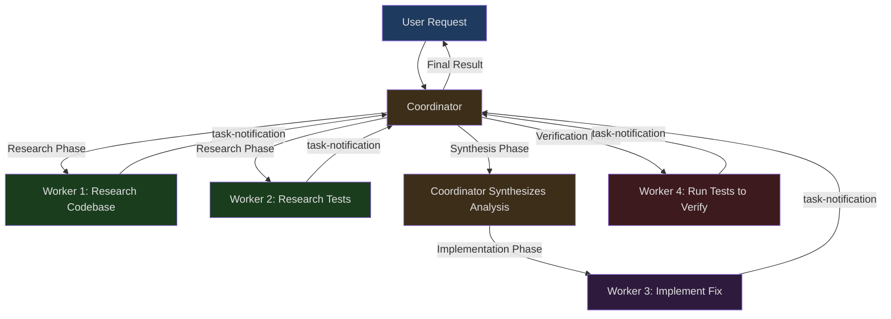
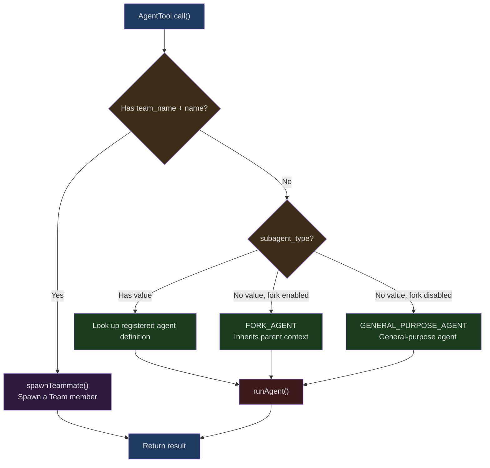
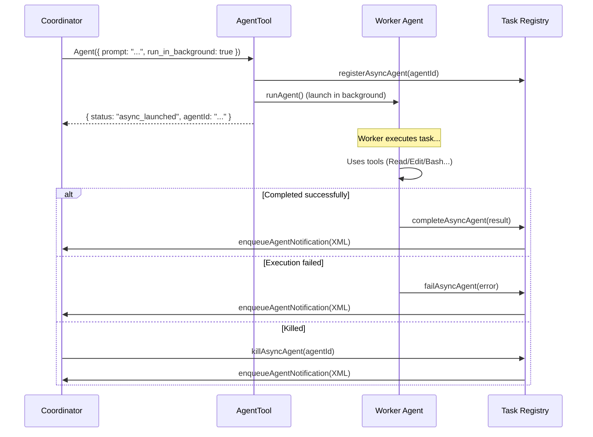
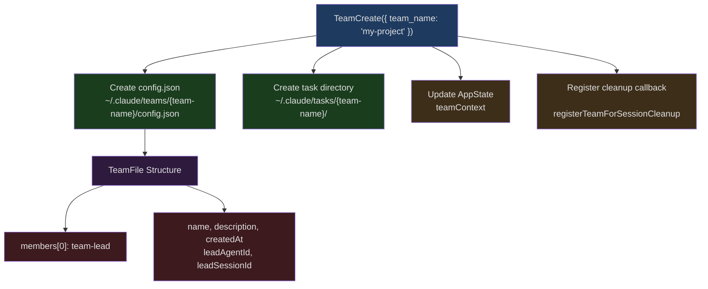
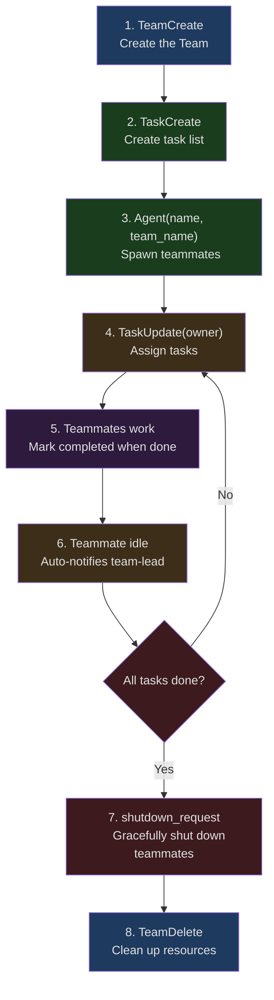

## The Problem

What do you do when a single AI agent isn't enough? The intuitive answer is: spawn more agents. But the problem is far from that simple. How do multiple agents divide work? How do they communicate? How do they share context without conflicts? When a worker finishes a task, how does it report results to the coordinator? If a worker heads in the wrong direction, how do you terminate it promptly?

At the heart of these questions lies a classic distributed systems design challenge — except here the "nodes" aren't servers but LLM instances. Claude Code answers these questions with an elegant multi-agent architecture whose core pattern is called **Coordinator/Worker**.

This article dives deep into Claude Code's multi-agent system, starting from the overall architecture of the Coordinator pattern and analyzing layer by layer: `AgentTool`'s agent spawning mechanism, the Worker's restricted tool set, the XML protocol for task notifications, `SendMessageTool`'s cross-agent communication, Scratchpad directory persistent state sharing, background execution and progress tracking, Team swarm mode, and MCP Server inheritance and isolation across agents.

## Overall Architecture of the Coordinator Pattern

Claude Code's multi-agent system is built on a clear role separation model: the **Coordinator** is responsible for understanding user intent, decomposing tasks, and synthesizing results; **Workers** are responsible for executing concrete work (research, implementation, verification). The Coordinator doesn't directly operate on files or run commands — it only has a minimal set of "management tools."

### The Design Philosophy of Role Separation

The philosophy behind this design is simple: let the Coordinator focus on "thinking" and Workers focus on "doing." The Coordinator's tool set is strictly limited to four:

```typescript
// src/constants/tools.ts:107-112
export const COORDINATOR_MODE_ALLOWED_TOOLS = new Set([
  AGENT_TOOL_NAME,        // 'Agent' — spawn new workers
  TASK_STOP_TOOL_NAME,    // 'TaskStop' — stop running workers
  SEND_MESSAGE_TOOL_NAME, // 'SendMessage' — send messages to existing workers
  SYNTHETIC_OUTPUT_TOOL_NAME, // 'SyntheticOutput' — internal output tool
])
```

The Coordinator cannot read or write files, execute shell commands, or search code. It can only do three things: spawn workers, stop workers, and send messages to workers. This extreme constraint forces the Coordinator to be a pure "commander."

### Enabling and Detecting Coordinator Mode

Coordinator mode is controlled via the `CLAUDE_CODE_COORDINATOR_MODE` environment variable:

```typescript
// src/coordinator/coordinatorMode.ts:36-41
export function isCoordinatorMode(): boolean {
  if (feature('COORDINATOR_MODE')) {
    return isEnvTruthy(process.env.CLAUDE_CODE_COORDINATOR_MODE)
  }
  return false
}
```

There's a double gate here: first, the `COORDINATOR_MODE` compile-time feature flag must be enabled (using Bun's `feature()` macro for dead code elimination), then the environment variable must be truthy. This ensures that in builds that don't support Coordinator mode, all related code is completely stripped out.

When resuming a session that was previously run in Coordinator mode, the system automatically matches the mode:

```typescript
// src/coordinator/coordinatorMode.ts:49-78
export function matchSessionMode(
  sessionMode: 'coordinator' | 'normal' | undefined,
): string | undefined {
  if (!sessionMode) {
    return undefined
  }
  const currentIsCoordinator = isCoordinatorMode()
  const sessionIsCoordinator = sessionMode === 'coordinator'

  if (currentIsCoordinator === sessionIsCoordinator) {
    return undefined
  }

  // Flip the env var — isCoordinatorMode() reads it live, no caching
  if (sessionIsCoordinator) {
    process.env.CLAUDE_CODE_COORDINATOR_MODE = '1'
  } else {
    delete process.env.CLAUDE_CODE_COORDINATOR_MODE
  }

  return sessionIsCoordinator
    ? 'Entered coordinator mode to match resumed session.'
    : 'Exited coordinator mode to match resumed session.'
}
```

This code demonstrates an interesting design choice: mode state is stored in `process.env` rather than in a state object, because `isCoordinatorMode()` is called extensively, and reading the environment variable directly avoids introducing any additional state management layer.

### Coordinator's System Prompt and Task Workflow

The Coordinator's system prompt defines a complete task workflow with four phases:



The concurrency rules defined in the system prompt are highly pragmatic:

```typescript
// src/coordinator/coordinatorMode.ts:213-219 (system prompt excerpt)
// Manage concurrency:
// - **Read-only tasks** (research) — run in parallel freely
// - **Write-heavy tasks** (implementation) — one at a time per set of files
// - **Verification** can sometimes run alongside implementation on different file areas
```

This isn't enforced through code — it relies on the LLM itself understanding and following these rules. This is a notable architectural decision: between "hardcoded concurrency control" and "trusting the LLM's judgment," Claude Code chose the latter, because file conflict scenarios are too varied and complex for hardcoded rules to cover all cases.

## AgentTool's Agent Spawning Mechanism

`AgentTool` is the entry point for the entire multi-agent system — all worker creation goes through it. Its implementation is in `src/tools/AgentTool/AgentTool.tsx` and is one of the most complex tools in the entire codebase (over 4,000 lines).

### Input Schema and Mode Routing

AgentTool's input schema is dynamically composed based on compile-time feature flags:

```typescript
// src/tools/AgentTool/AgentTool.tsx:82-101
const baseInputSchema = lazySchema(() => z.object({
  description: z.string().describe('A short (3-5 word) description of the task'),
  prompt: z.string().describe('The task for the agent to perform'),
  subagent_type: z.string().optional()
    .describe('The type of specialized agent to use for this task'),
  model: z.enum(['sonnet', 'opus', 'haiku']).optional()
    .describe("Optional model override for this agent."),
  run_in_background: z.boolean().optional()
    .describe('Set to true to run this agent in the background.')
}));

const fullInputSchema = lazySchema(() => {
  const multiAgentInputSchema = z.object({
    name: z.string().optional()
      .describe('Name for the spawned agent.'),
    team_name: z.string().optional()
      .describe('Team name for spawning.'),
    mode: permissionModeSchema().optional()
      .describe('Permission mode for spawned teammate.'),
  });
  return baseInputSchema().merge(multiAgentInputSchema).extend({
    isolation: z.enum(['worktree']).optional()
      .describe('Isolation mode. "worktree" creates a temporary git worktree.'),
    cwd: z.string().optional()
      .describe('Absolute path to run the agent in.')
  });
});
```

`lazySchema()` wrapping is used here to ensure Zod schemas are only instantiated on first use. Note that the `isolation` field's enum values differ based on build type — internal builds support `'worktree' | 'remote'`, while external builds only support `'worktree'`.

### Agent Type Resolution and Routing

When `AgentTool.call()` is invoked, it first needs to resolve the target agent's type. There are three paths:



The key routing logic is as follows:

```typescript
// src/tools/AgentTool/AgentTool.tsx:322-356
const effectiveType = subagent_type
  ?? (isForkSubagentEnabled() ? undefined : GENERAL_PURPOSE_AGENT.agentType);
const isForkPath = effectiveType === undefined;

let selectedAgent: AgentDefinition;
if (isForkPath) {
  // Recursive fork guard: fork children cannot fork again
  if (toolUseContext.options.querySource ===
      `agent:builtin:${FORK_AGENT.agentType}`
      || isInForkChild(toolUseContext.messages)) {
    throw new Error(
      'Fork is not available inside a forked worker.'
    );
  }
  selectedAgent = FORK_AGENT;
} else {
  const allAgents = toolUseContext.options.agentDefinitions.activeAgents;
  const agents = filterDeniedAgents(allAgents,
    appState.toolPermissionContext, AGENT_TOOL_NAME);
  const found = agents.find(agent => agent.agentType === effectiveType);
  if (!found) {
    // Distinguish between "doesn't exist" and "denied by permission rule"
    const agentExistsButDenied = allAgents.find(
      agent => agent.agentType === effectiveType
    );
    if (agentExistsButDenied) {
      const denyRule = getDenyRuleForAgent(
        appState.toolPermissionContext, AGENT_TOOL_NAME, effectiveType
      );
      throw new Error(
        `Agent type '${effectiveType}' has been denied by permission rule.`
      );
    }
    throw new Error(`Agent type '${effectiveType}' not found.`);
  }
  selectedAgent = found;
}
```

Several important design details here:

1. **Recursive fork guard**: Uses dual detection — `querySource` (compression-resistant since it's set at spawn time) and message scanning (fallback path), ensuring fork children don't recurse infinitely.

2. **Permission filtering**: Agent types can be denied by permission rules (configured via `Agent(AgentName)` syntax in settings), and error messages distinguish between "doesn't exist" and "denied."

3. **Model override**: In Coordinator mode, the `model` parameter is forcibly ignored (set to `undefined`), because workers need the default high-capability model to complete substantive tasks.

### Worker Tool Set Assembly

The Worker's tool set isn't simply inherited from the Coordinator — it's assembled independently:

```typescript
// src/tools/AgentTool/AgentTool.tsx:573-577
const workerPermissionContext = {
  ...appState.toolPermissionContext,
  mode: selectedAgent.permissionMode ?? 'acceptEdits'
};
const workerTools = assembleToolPool(
  workerPermissionContext, appState.mcp.tools
);
```

Workers get their own permission mode (defaulting to `'acceptEdits'`), then independently assemble available tools from the global tool pool. This means the Worker's tool set is completely independent of the Coordinator's restrictions — even though the Coordinator only has 4 management tools, Workers can still use the full range of file operations, code search, and other tools.

### Worktree Isolation

When `isolation: 'worktree'` is specified, AgentTool creates a temporary git worktree, letting the Worker operate on an isolated copy of the codebase:

```typescript
// src/tools/AgentTool/AgentTool.tsx:590-593
if (effectiveIsolation === 'worktree') {
  const slug = `agent-${earlyAgentId.slice(0, 8)}`;
  worktreeInfo = await createAgentWorktree(slug);
}
```

Worktree isolation provides two important benefits: Workers can freely modify code without affecting the main workspace; and multiple Workers can modify code in parallel across different worktrees. When a Worker finishes, if no changes were made in the worktree, it's automatically cleaned up; if changes exist, the worktree path and branch name are returned to the Coordinator.

## The Worker's Restricted Tool Set

As asynchronously running sub-agents, Workers have a carefully designed restricted tool set. These restrictions are defined in the `ASYNC_AGENT_ALLOWED_TOOLS` set:

```typescript
// src/constants/tools.ts:55-71
export const ASYNC_AGENT_ALLOWED_TOOLS = new Set([
  FILE_READ_TOOL_NAME,      // Read files
  WEB_SEARCH_TOOL_NAME,     // Web search
  TODO_WRITE_TOOL_NAME,     // Write todos
  GREP_TOOL_NAME,           // Content search
  WEB_FETCH_TOOL_NAME,      // Fetch web pages
  GLOB_TOOL_NAME,           // File pattern matching
  ...SHELL_TOOL_NAMES,      // Bash / PowerShell
  FILE_EDIT_TOOL_NAME,      // Edit files
  FILE_WRITE_TOOL_NAME,     // Write files
  NOTEBOOK_EDIT_TOOL_NAME,  // Edit notebooks
  SKILL_TOOL_NAME,          // Skill invocation
  SYNTHETIC_OUTPUT_TOOL_NAME,
  TOOL_SEARCH_TOOL_NAME,    // Tool search
  ENTER_WORKTREE_TOOL_NAME, // Enter worktree
  EXIT_WORKTREE_TOOL_NAME,  // Exit worktree
])
```

Explicitly excluded tools include:

```typescript
// src/constants/tools.ts:36-46
export const ALL_AGENT_DISALLOWED_TOOLS = new Set([
  TASK_OUTPUT_TOOL_NAME,      // Prevent recursion
  EXIT_PLAN_MODE_V2_TOOL_NAME, // Plan mode is a main thread abstraction
  ENTER_PLAN_MODE_TOOL_NAME,
  AGENT_TOOL_NAME,            // Prevent agent recursive spawning (except ant users)
  ASK_USER_QUESTION_TOOL_NAME, // Async workers cannot ask users questions
  TASK_STOP_TOOL_NAME,        // Requires main thread task state
  WORKFLOW_TOOL_NAME,         // Prevent workflow recursion
])
```

The actual tool filtering logic is implemented in `filterToolsForAgent`:

```typescript
// src/tools/AgentTool/agentToolUtils.ts:70-116
export function filterToolsForAgent({
  tools, isBuiltIn, isAsync = false, permissionMode,
}: { tools: Tools; isBuiltIn: boolean; isAsync?: boolean;
     permissionMode?: PermissionMode }): Tools {
  return tools.filter(tool => {
    // MCP tools are always allowed
    if (tool.name.startsWith('mcp__')) {
      return true
    }
    // Allow ExitPlanMode in plan mode
    if (toolMatchesName(tool, EXIT_PLAN_MODE_V2_TOOL_NAME)
        && permissionMode === 'plan') {
      return true
    }
    // Global disallow list
    if (ALL_AGENT_DISALLOWED_TOOLS.has(tool.name)) {
      return false
    }
    // Additional disallow list for custom agents
    if (!isBuiltIn && CUSTOM_AGENT_DISALLOWED_TOOLS.has(tool.name)) {
      return false
    }
    // Async agent allowlist filtering
    if (isAsync && !ASYNC_AGENT_ALLOWED_TOOLS.has(tool.name)) {
      // Special case: in-process teammates can use AgentTool and task tools
      if (isAgentSwarmsEnabled() && isInProcessTeammate()) {
        if (toolMatchesName(tool, AGENT_TOOL_NAME)) {
          return true
        }
        if (IN_PROCESS_TEAMMATE_ALLOWED_TOOLS.has(tool.name)) {
          return true
        }
      }
      return false
    }
    return true
  })
}
```

There's a particularly interesting layered design here. For in-process teammates (members in Team mode), an additional set of task management tools is allowed:

```typescript
// src/constants/tools.ts:77-88
export const IN_PROCESS_TEAMMATE_ALLOWED_TOOLS = new Set([
  TASK_CREATE_TOOL_NAME,
  TASK_GET_TOOL_NAME,
  TASK_LIST_TOOL_NAME,
  TASK_UPDATE_TOOL_NAME,
  SEND_MESSAGE_TOOL_NAME,
])
```

This enables teammates within a Team to create tasks, update task status, and send messages to other teammates — all capabilities essential for swarm collaboration.

## Task Notification Mechanism

When a Worker completes a task, it doesn't return results via a function call. Instead, it sends results to the Coordinator through a carefully designed **XML-format notification** injected as a `user-role message` into the Coordinator's conversation.

### Notification Format

```xml
<task-notification>
  <task-id>{agentId}</task-id>
  <status>completed|failed|killed</status>
  <summary>{human-readable status summary}</summary>
  <result>{agent's final text response}</result>
  <usage>
    <total_tokens>N</total_tokens>
    <tool_uses>N</tool_uses>
    <duration_ms>N</duration_ms>
  </usage>
</task-notification>
```

Why XML instead of JSON? Because the `<task-notification>` opening tag provides a clear, easily recognizable signal for the LLM — the Coordinator's system prompt explicitly states "distinguish notifications from user messages by the `<task-notification>` opening tag." XML's tag structure is easier for LLMs to recognize and parse during streaming generation than JSON's curly braces.

### Notification Injection Path

Notifications are injected into the Coordinator's message stream via `enqueueAgentNotification`. The entire async agent lifecycle management is in the `runAsyncAgentLifecycle` function:



While Workers run in the background, the Coordinator can continue interacting with the user or launch more Workers. Notifications arrive as user-role messages, and the Coordinator processes them at the start of its next turn.

### One-Shot Optimization

For certain built-in agents (like `Explore` and `Plan`) that only run once and won't be continued by the Coordinator via `SendMessage`, the notification omits the `agentId` and `SendMessage` usage instructions to save tokens:

```typescript
// src/tools/AgentTool/constants.ts:9-12
export const ONE_SHOT_BUILTIN_AGENT_TYPES: ReadonlySet<string> = new Set([
  'Explore',
  'Plan',
])
```

Comments note that this optimization "saves ~135 chars x 34M Explore runs/week" — at scale, every token matters.

## SendMessageTool: Cross-Agent Communication

`SendMessageTool` is the core tool for inter-agent communication. It's used not only for the Coordinator to send follow-up instructions to Workers but also for direct communication between teammates in Team mode.

### Message Routing Logic

SendMessageTool's message routing is highly refined, handling multiple target types:

```typescript
// src/tools/SendMessageTool/SendMessageTool.ts:67-87
const inputSchema = lazySchema(() =>
  z.object({
    to: z.string().describe(
      'Recipient: teammate name, or "*" for broadcast to all teammates'
    ),
    summary: z.string().optional().describe(
      'A 5-10 word summary shown as a preview in the UI'
    ),
    message: z.union([
      z.string().describe('Plain text message content'),
      StructuredMessage(),
    ]),
  }),
)
```

The `to` field can be:
- A teammate name (e.g., `"researcher"`) — sends to a specific teammate
- `"*"` — broadcasts to all teammates
- `"uds:/path/to.sock"` — cross-process communication (via Unix Domain Socket)
- `"bridge:session_..."` — cross-machine communication (via Remote Control)

### Sending Messages to Existing Workers

When the Coordinator uses `SendMessage` to send a message to a completed or running Worker, the handling logic has three branches:

```typescript
// src/tools/SendMessageTool/SendMessageTool.ts:802-873
if (typeof input.message === 'string' && input.to !== '*') {
  const appState = context.getAppState()
  const registered = appState.agentNameRegistry.get(input.to)
  const agentId = registered ?? toAgentId(input.to)

  if (agentId) {
    const task = appState.tasks[agentId]
    if (isLocalAgentTask(task) && !isMainSessionTask(task)) {
      if (task.status === 'running') {
        // Worker still running: queue message for delivery on next tool turn
        queuePendingMessage(agentId, input.message, ...)
        return { data: {
          success: true,
          message: `Message queued for delivery to ${input.to}.`
        }}
      }
      // Worker has stopped: auto-resume
      const result = await resumeAgentBackground({
        agentId, prompt: input.message, ...
      })
      return { data: {
        success: true,
        message: `Agent "${input.to}" was stopped; resumed it in background.`
      }}
    }
  }
}
```

Two important behaviors here:

1. **Running Worker**: The message is queued (`queuePendingMessage`) and delivered during the Worker's next tool call turn. This avoids interrupting the Worker's current work.

2. **Stopped Worker**: The Worker is automatically resumed (`resumeAgentBackground`), loading its previous conversation context from the on-disk transcript, then continuing execution with the new message as a continuation prompt. This allows the Coordinator to repeatedly leverage an existing Worker's accumulated context.

### Structured Message Protocol

Beyond plain text messages, SendMessageTool also supports structured messages for coordination operations in Team mode:

```typescript
// src/tools/SendMessageTool/SendMessageTool.ts:46-65
const StructuredMessage = lazySchema(() =>
  z.discriminatedUnion('type', [
    z.object({
      type: z.literal('shutdown_request'),
      reason: z.string().optional(),
    }),
    z.object({
      type: z.literal('shutdown_response'),
      request_id: z.string(),
      approve: semanticBoolean(),
      reason: z.string().optional(),
    }),
    z.object({
      type: z.literal('plan_approval_response'),
      request_id: z.string(),
      approve: semanticBoolean(),
      feedback: z.string().optional(),
    }),
  ]),
)
```

These structured messages implement three coordination protocols:

- **Shutdown protocol**: The Team lead sends a `shutdown_request` to a teammate, who replies with a `shutdown_response` (approve or deny). An approved shutdown triggers the teammate process's `gracefulShutdown`.
- **Plan approval protocol**: In plan permission mode, teammates need the Team lead's approval before executing implementation.
- **Broadcast**: `to: "*"` broadcasts the message to all teammates, iterating through all members in the team file (excluding the sender).

### Mailbox Communication Model

Message passing in Team mode is based on a **mailbox model** — messages are written to the recipient's mailbox file rather than pushed directly:

```typescript
// src/tools/SendMessageTool/SendMessageTool.ts:161-170
await writeToMailbox(
  recipientName,
  {
    from: senderName,
    text: content,
    summary,
    timestamp: new Date().toISOString(),
    color: senderColor,
  },
  teamName,
)
```

The benefit of this design is complete decoupling of sender and receiver — the sender doesn't need to wait for the receiver to be online; messages are delivered the next time the receiver polls its mailbox.

## Scratchpad Directory: Persistent State Sharing Across Workers

How do multiple Workers share information? Claude Code provides a mechanism called the **Scratchpad** — a session-level temporary directory that all Workers can freely read from and write to without permission prompts.

### Scratchpad Location and Permissions

```typescript
// src/utils/permissions/filesystem.ts:384-386
export function getScratchpadDir(): string {
  return join(getProjectTempDir(), getSessionId(), 'scratchpad')
}
```

The path format is `/tmp/claude-{uid}/{sanitized-cwd}/{sessionId}/scratchpad/`. The directory is created with `0o700` permissions (owner-only access) to ensure security.

### How the Coordinator Informs Workers About the Scratchpad

Scratchpad directory information is injected into the Coordinator's context via user context:

```typescript
// src/coordinator/coordinatorMode.ts:80-108
export function getCoordinatorUserContext(
  mcpClients: ReadonlyArray<{ name: string }>,
  scratchpadDir?: string,
): { [k: string]: string } {
  if (!isCoordinatorMode()) {
    return {}
  }

  let content = `Workers spawned via the ${AGENT_TOOL_NAME} tool have ` +
    `access to these tools: ${workerTools}`

  if (mcpClients.length > 0) {
    const serverNames = mcpClients.map(c => c.name).join(', ')
    content += `\n\nWorkers also have access to MCP tools from ` +
      `connected MCP servers: ${serverNames}`
  }

  if (scratchpadDir && isScratchpadGateEnabled()) {
    content += `\n\nScratchpad directory: ${scratchpadDir}\n` +
      `Workers can read and write here without permission prompts. ` +
      `Use this for durable cross-worker knowledge — ` +
      `structure files however fits the work.`
  }

  return { workerToolsContext: content }
}
```

Note the key phrase in the prompt: "structure files however fits the work" — the system doesn't prescribe file structure within the Scratchpad, letting the Coordinator and Workers organize it as the task demands. This flexibility is intentional.

### Security: Path Traversal Protection

Scratchpad path detection includes path traversal protection:

```typescript
// src/utils/permissions/filesystem.ts:410-423
function isScratchpadPath(absolutePath: string): boolean {
  if (!isScratchpadEnabled()) {
    return false
  }
  const scratchpadDir = getScratchpadDir()
  // SECURITY: Normalize the path to resolve .. segments before checking
  const normalizedPath = normalize(absolutePath)
  return (
    normalizedPath === scratchpadDir ||
    normalizedPath.startsWith(scratchpadDir + sep)
  )
}
```

The comment explicitly warns about the attack vector: without normalization, a path like `/tmp/claude-0/proj/session/scratchpad/../../../etc/passwd` would pass the `startsWith` check but actually write to `/etc/passwd`. The `normalize()` call resolves `..` segments, closing this vulnerability.

## Background Execution and Progress Tracking

### Synchronous vs. Asynchronous Execution

AgentTool supports two execution modes: synchronous (foreground) and asynchronous (background). The logic for determining which mode to use combines multiple signals:

```typescript
// src/tools/AgentTool/AgentTool.tsx:557-567
const shouldRunAsync = (
  run_in_background === true ||        // Explicitly requested background
  selectedAgent.background === true ||   // Agent definition requires background
  isCoordinator ||                       // All async in Coordinator mode
  forceAsync ||                          // All async in Fork experiment mode
  assistantForceAsync ||                 // Force async in Assistant mode
  (proactiveModule?.isProactiveActive() ?? false)  // Proactive mode
) && !isBackgroundTasksDisabled;         // Global disable switch
```

In Coordinator mode, **all** agents run asynchronously. This is because the Coordinator's core value lies in parallel orchestration — if Workers ran synchronously, the Coordinator couldn't launch multiple Workers simultaneously.

### Auto-Backgrounding

There's also an auto-backgrounding mechanism — when a Worker runs for more than a certain time (120 seconds), it's automatically moved to the background:

```typescript
// src/tools/AgentTool/AgentTool.tsx:72-77
function getAutoBackgroundMs(): number {
  if (isEnvTruthy(process.env.CLAUDE_AUTO_BACKGROUND_TASKS)
      || getFeatureValue_CACHED_MAY_BE_STALE(
           'tengu_auto_background_agents', false)) {
    return 120_000;
  }
  return 0;
}
```

### Agent Resume Mechanism

When a stopped agent needs to be resumed, the `resumeAgentBackground` function is responsible for rebuilding conversation context from the on-disk transcript:

```typescript
// src/tools/AgentTool/resumeAgent.ts:42-60
export async function resumeAgentBackground({
  agentId,
  prompt,
  toolUseContext,
  canUseTool,
  invokingRequestId,
}: {
  agentId: string
  prompt: string
  toolUseContext: ToolUseContext
  canUseTool: CanUseToolFn
  invokingRequestId?: string
}): Promise<ResumeAgentResult> {
  const startTime = Date.now()
  const appState = toolUseContext.getAppState()
  const rootSetAppState =
    toolUseContext.setAppStateForTasks ?? toolUseContext.setAppState
  // ...
}
```

The resume process reads the agent's previous transcript (including all tool calls and results), rebuilds the message history, then adds the new prompt as a user message at the end. This gives the resumed agent complete context from its previous execution.

## runAgent: The Worker's Execution Engine

`runAgent` is the Worker's core execution function. It's an async generator responsible for initializing MCP servers, building context, and running the query loop.

### MCP Server Inheritance and Isolation

Agent definitions can declare their own MCP servers, which are **incremental extensions** of the parent context's MCP clients:

```typescript
// src/tools/AgentTool/runAgent.ts:95-110
async function initializeAgentMcpServers(
  agentDefinition: AgentDefinition,
  parentClients: MCPServerConnection[],
): Promise<{
  clients: MCPServerConnection[]
  tools: Tools
  cleanup: () => Promise<void>
}> {
  if (!agentDefinition.mcpServers?.length) {
    return {
      clients: parentClients,  // No custom MCP: directly inherit parent clients
      tools: [],
      cleanup: async () => {},
    }
  }
  // ...
}
```

MCP servers can be referenced in two ways:

1. **String reference**: References a configured MCP server by name, using the memoized `connectToServer` to share the connection.
2. **Inline definition**: A `{ [name]: config }` format for a brand new MCP server configuration, requiring cleanup when the agent finishes.

```typescript
// src/tools/AgentTool/runAgent.ts:135-175
for (const spec of agentDefinition.mcpServers) {
  if (typeof spec === 'string') {
    // Reference by name — use memoized connectToServer to share connection
    name = spec
    config = getMcpConfigByName(spec)
  } else {
    // Inline definition — agent-exclusive, needs cleanup on exit
    const [serverName, serverConfig] = Object.entries(spec)[0]!
    name = serverName
    config = { ...serverConfig, scope: 'dynamic' }
    isNewlyCreated = true
  }

  const client = await connectToServer(name, config)
  agentClients.push(client)
  if (isNewlyCreated) {
    newlyCreatedClients.push(client)
  }
}
```

A key security constraint: when MCP is locked to plugin-only mode, **user-controlled agents'** frontmatter MCP servers are skipped, but plugin, built-in, and policySettings agents' MCP are unaffected since they come from admin-trusted sources:

```typescript
// src/tools/AgentTool/runAgent.ts:117-127
const agentIsAdminTrusted = isSourceAdminTrusted(agentDefinition.source)
if (isRestrictedToPluginOnly('mcp') && !agentIsAdminTrusted) {
  logForDebugging(
    `[Agent: ${agentDefinition.agentType}] Skipping MCP servers: ` +
    `strictPluginOnlyCustomization locks MCP to plugin-only`
  )
  return { clients: parentClients, tools: [], cleanup: async () => {} }
}
```

The cleanup function only cleans up newly created clients; shared clients are managed by the parent context:

```typescript
// src/tools/AgentTool/runAgent.ts:197-210
const cleanup = async () => {
  for (const client of newlyCreatedClients) {
    if (client.type === 'connected') {
      try {
        await client.cleanup()
      } catch (error) {
        logForDebugging(
          `Error cleaning up MCP server '${client.name}': ${error}`
        )
      }
    }
  }
}

return {
  clients: [...parentClients, ...agentClients],  // Merge parent + agent-specific
  tools: agentTools,
  cleanup,
}
```

### Agent Definitions and Tool Control

Each agent's capabilities are controlled by its `AgentDefinition`. Taking the built-in general-purpose agent as an example:

```typescript
// src/tools/AgentTool/built-in/generalPurposeAgent.ts:25-34
export const GENERAL_PURPOSE_AGENT: BuiltInAgentDefinition = {
  agentType: 'general-purpose',
  whenToUse: 'General-purpose agent for researching complex questions...',
  tools: ['*'],          // Use all available tools
  source: 'built-in',
  baseDir: 'built-in',
  // model intentionally omitted — uses getDefaultSubagentModel()
  getSystemPrompt: getGeneralPurposeSystemPrompt,
}
```

`tools: ['*']` means using all available tools (after filtering). Custom agents can specify explicit tool lists or disallowed lists. The `resolveAgentTools` function handles this complex tool resolution logic:

```typescript
// src/tools/AgentTool/agentToolUtils.ts:122-173
export function resolveAgentTools(
  agentDefinition, availableTools, isAsync = false, isMainThread = false,
): ResolvedAgentTools {
  const filteredAvailableTools = isMainThread
    ? availableTools
    : filterToolsForAgent({
        tools: availableTools,
        isBuiltIn: source === 'built-in',
        isAsync,
        permissionMode,
      })

  // Create disallowed tool set
  const disallowedToolSet = new Set(
    disallowedTools?.map(toolSpec => {
      const { toolName } = permissionRuleValueFromString(toolSpec)
      return toolName
    }) ?? [],
  )

  // Filter
  const allowedAvailableTools = filteredAvailableTools.filter(
    tool => !disallowedToolSet.has(tool.name),
  )

  // Wildcard handling
  const hasWildcard = agentTools === undefined
    || (agentTools.length === 1 && agentTools[0] === '*')
  if (hasWildcard) {
    return {
      hasWildcard: true,
      validTools: [],
      invalidTools: [],
      resolvedTools: allowedAvailableTools,
    }
  }
  // ...
}
```

## Team System: Swarm Mode

Beyond the Coordinator/Worker pattern, Claude Code also supports a looser form of multi-agent collaboration — **Team (Swarm) mode**. In this mode, multiple agents work as "teammates" in parallel, collaborating through a shared task list and messaging system.

### TeamCreateTool: Creating a Team

```typescript
// src/tools/TeamCreateTool/TeamCreateTool.ts:37-49
const inputSchema = lazySchema(() =>
  z.strictObject({
    team_name: z.string()
      .describe('Name for the new team to create.'),
    description: z.string().optional()
      .describe('Team description/purpose.'),
    agent_type: z.string().optional()
      .describe('Type/role of the team lead.'),
  }),
)
```

Creating a Team does the following:



Teams and Task Lists have a 1:1 correspondence — each Team has its own task list directory, with task numbers starting from 1:

```typescript
// src/tools/TeamCreateTool/TeamCreateTool.ts:182-191
const taskListId = sanitizeName(finalTeamName)
await resetTaskList(taskListId)
await ensureTasksDir(taskListId)

// Register team name so getTaskListId() returns it
setLeaderTeamName(sanitizeName(finalTeamName))
```

### TeamFile Structure

```typescript
// src/tools/TeamCreateTool/TeamCreateTool.ts:157-175
const teamFile: TeamFile = {
  name: finalTeamName,
  description: _description,
  createdAt: Date.now(),
  leadAgentId,
  leadSessionId: getSessionId(),
  members: [
    {
      agentId: leadAgentId,
      name: TEAM_LEAD_NAME,  // 'team-lead'
      agentType: leadAgentType,
      model: leadModel,
      joinedAt: Date.now(),
      tmuxPaneId: '',
      cwd: getCwd(),
      subscriptions: [],
    },
  ],
}
```

The Team lead's ID is deterministic — generated by `formatAgentId(TEAM_LEAD_NAME, finalTeamName)` rather than a random UUID. This allows other teammates to derive the Team lead's ID without querying any registry.

### Spawning Teammates

In Team mode, teammates are spawned by passing `team_name` and `name` parameters through `AgentTool`. This triggers the `spawnTeammate()` path:

```typescript
// src/tools/AgentTool/AgentTool.tsx:284-316
if (teamName && name) {
  const result = await spawnTeammate({
    name,
    prompt,
    description,
    team_name: teamName,
    use_splitpane: true,
    plan_mode_required: spawnMode === 'plan',
    model: model ?? agentDef?.model,
    agent_type: subagent_type,
    invokingRequestId: assistantMessage?.requestId
  }, toolUseContext);

  const spawnResult: TeammateSpawnedOutput = {
    status: 'teammate_spawned' as const,
    prompt,
    ...result.data
  };
  // ...
}
```

Note an important constraint — **teammates cannot spawn teammates**:

```typescript
// src/tools/AgentTool/AgentTool.tsx:272-274
if (isTeammate() && teamName && name) {
  throw new Error(
    'Teammates cannot spawn other teammates — the team roster is flat.'
  );
}
```

The Team's member list is **flat** — only the Team lead can add members. This prevents unbounded nesting of teammate relationships, simplifying communication and lifecycle management.

### TeamDeleteTool: Cleaning Up a Team

When a Team is finished, `TeamDeleteTool` handles cleaning up all resources:

```typescript
// src/tools/TeamDeleteTool/TeamDeleteTool.ts:71-135
async call(_input, context) {
  const appState = getAppState()
  const teamName = appState.teamContext?.teamName

  if (teamName) {
    const teamFile = readTeamFile(teamName)
    if (teamFile) {
      // Only check truly active members (filter out idle/dead)
      const nonLeadMembers = teamFile.members.filter(
        m => m.name !== TEAM_LEAD_NAME
      )
      const activeMembers = nonLeadMembers.filter(
        m => m.isActive !== false
      )
      if (activeMembers.length > 0) {
        throw new Error(
          `Cannot cleanup team with ${activeMembers.length} active member(s).`
        )
      }
    }
    await cleanupTeamDirectories(teamName)
    unregisterTeamForSessionCleanup(teamName)
    clearTeammateColors()
    clearLeaderTeamName()
  }

  // Clear team context and inbox from AppState
  setAppState(prev => ({
    ...prev,
    teamContext: undefined,
    inbox: { messages: [] },
  }))
}
```

An important safety check: you can't delete a Team while it still has active members. All teammates must first be gracefully terminated via the `SendMessage` `shutdown_request` protocol.

### Team Workflow

The complete Team workflow as described in the system prompt:



## Fork Sub-Agent: Context Inheritance

Beyond Coordinator/Worker and Team swarm, there's a third multi-agent pattern — **Fork**. A Fork sub-agent inherits the parent agent's complete conversation context (including the system prompt and all history messages), making it suitable for tasks that don't need intermediate tool outputs retained in the parent context.

```typescript
// src/tools/AgentTool/forkSubagent.ts:32-39
export function isForkSubagentEnabled(): boolean {
  if (feature('FORK_SUBAGENT')) {
    if (isCoordinatorMode()) return false     // Mutually exclusive with Coordinator mode
    if (getIsNonInteractiveSession()) return false  // Not supported in non-interactive sessions
    return true
  }
  return false
}
```

Fork and Coordinator mode are **mutually exclusive** — because the Coordinator already has its own orchestration model. Fork's advantages include:

1. **Cache-friendly**: Fork sub-agents use the parent agent's exact system prompt and tool set (`useExactTools: true`), so the API request prefix is identical to the parent's, enabling prompt cache reuse.
2. **Context inheritance**: No need to re-explain background in the prompt — the sub-agent already "knows" everything.
3. **Imperative prompts**: Since context is inherited, the prompt only needs to be a "what to do" instruction, not a complete "here's the situation + what to do" description.

## Agent Persistent Memory

Worker agents can have persistent memory that saves learned knowledge across sessions. The memory system supports three scopes:

```typescript
// src/tools/AgentTool/agentMemory.ts:13
export type AgentMemoryScope = 'user' | 'project' | 'local'
```

Each scope has a different storage location:

```typescript
// src/tools/AgentTool/agentMemory.ts:52-65
export function getAgentMemoryDir(
  agentType: string, scope: AgentMemoryScope,
): string {
  const dirName = sanitizeAgentTypeForPath(agentType)
  switch (scope) {
    case 'project':
      return join(getCwd(), '.claude', 'agent-memory', dirName) + sep
    case 'local':
      return getLocalAgentMemoryDir(dirName)
    case 'user':
      return join(getMemoryBaseDir(), 'agent-memory', dirName) + sep
  }
}
```

- **user**: `~/.claude/agent-memory/{agentType}/` — cross-project general knowledge
- **project**: `.claude/agent-memory/{agentType}/` — project-specific knowledge (shareable via version control)
- **local**: `.claude/agent-memory-local/{agentType}/` — machine-specific knowledge (not version-controlled)

The memory entry file is always `MEMORY.md`:

```typescript
// src/tools/AgentTool/agentMemory.ts:109-114
export function getAgentMemoryEntrypoint(
  agentType: string, scope: AgentMemoryScope,
): string {
  return join(getAgentMemoryDir(agentType, scope), 'MEMORY.md')
}
```

## Transferable Patterns: Architecture Essentials for Building Multi-Agent Systems

From Claude Code's multi-agent implementation, we can distill several general-purpose architectural patterns applicable to building any multi-agent system.

### Pattern 1: Role Separation and Tool Constraints

The Coordinator has only management tools; Workers have only execution tools. This hard separation prevents role confusion — the Coordinator won't be "tempted" to modify files directly, and Workers won't try to orchestrate other Workers.

The key to implementing this separation is **tool set filtering**: determine which tools an agent can use at spawn time, rather than relying on instructions in the system prompt. An LLM might not follow a "don't use tool X" instruction, but if the tool simply isn't in the available list, it physically cannot use it.

### Pattern 2: Async Notifications Rather Than Synchronous Waiting

Worker results are returned via async notifications (`<task-notification>`) rather than blocking the Coordinator to wait. This allows the Coordinator to orchestrate multiple Workers simultaneously.

The notification format uses XML instead of JSON because XML tags are easier for LLMs to recognize during streaming processing. The `<task-notification>` opening tag provides a deterministic signal, preventing the LLM from confusing Worker results with user messages.

### Pattern 3: Shared Lock-Free State

The Scratchpad directory provides cross-Worker state sharing without any locking mechanism. This works well in practice because the Coordinator typically ensures that Workers reading and writing to the same area don't run simultaneously.

This design is far simpler and less error-prone than introducing file locks — deadlocks are especially dangerous in multi-agent systems because LLMs don't have the ability to "detect and recover from deadlocks."

### Pattern 4: Mailbox Communication Model

The mailbox communication model in Team mode — where the sender writes to the recipient's mailbox file — is a classic asynchronous messaging pattern. It completely decouples the execution timing of sender and receiver, naturally supporting offline messaging.

### Pattern 5: Flat Membership Structure

The Team's member list is flat — only the lead can add members; teammates cannot spawn teammates. This prevents uncontrolled growth of organizational structure, simplifies the communication topology (degenerating from an arbitrary graph to a star), and reduces system complexity.

## Conclusion

Claude Code's multi-agent system demonstrates a pragmatic approach to distributed AI system design. It doesn't pursue theoretical perfection — no distributed transactions, no consensus algorithms, no formal verification — but instead solves real problems with simple mechanisms:

- **Role separation** is enforced through tool set filtering, not just prompt instructions
- **Task notifications** use XML format injected as user-role messages, letting the LLM process them naturally
- **State sharing** works through a Scratchpad directory in the filesystem — no locks, no protocols
- **Lifecycle management** uses structured message protocols (shutdown_request/response) for graceful shutdown
- **MCP inheritance** uses a merge-plus-independent-cleanup approach, letting child agents incrementally extend parent agent capabilities

The common thread across these design choices is that they all find the balance between "good enough" and "over-engineering." In the rapidly evolving field of AI agent systems, this pragmatic engineering philosophy may be more valuable than pursuing perfect architecture.
