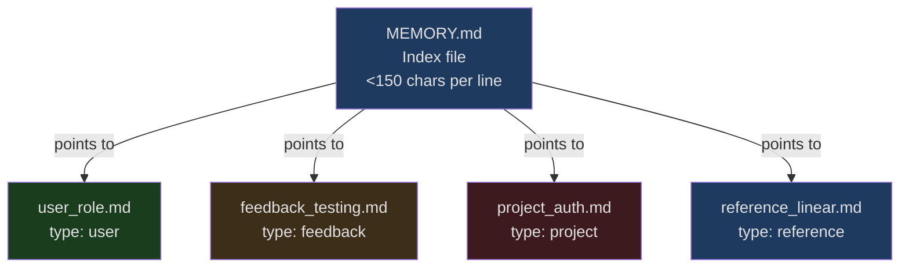
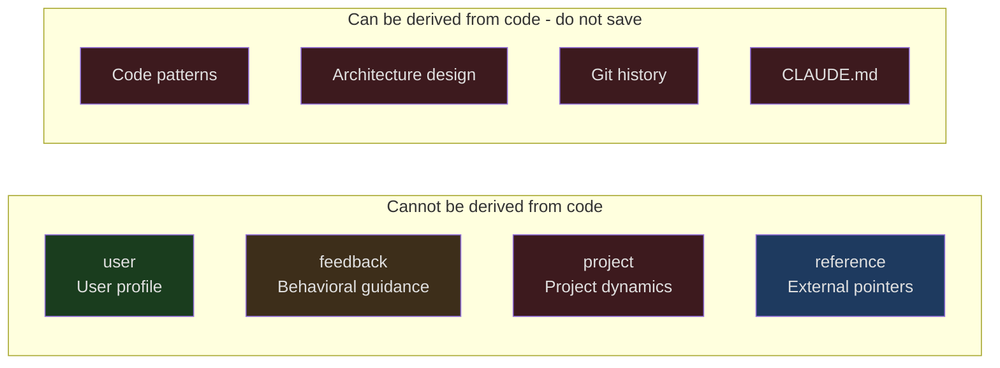
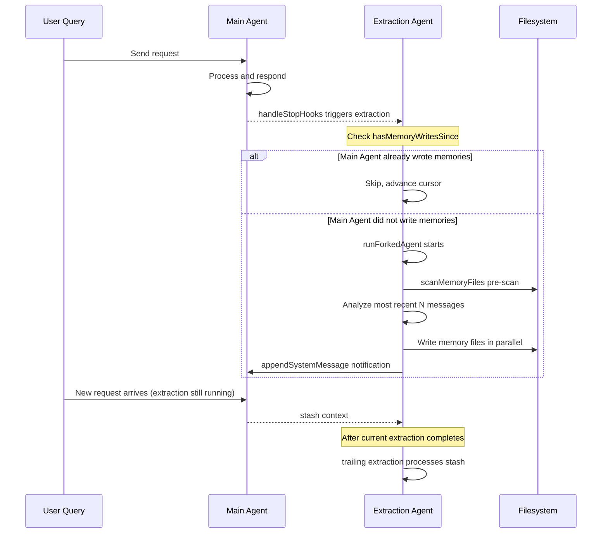
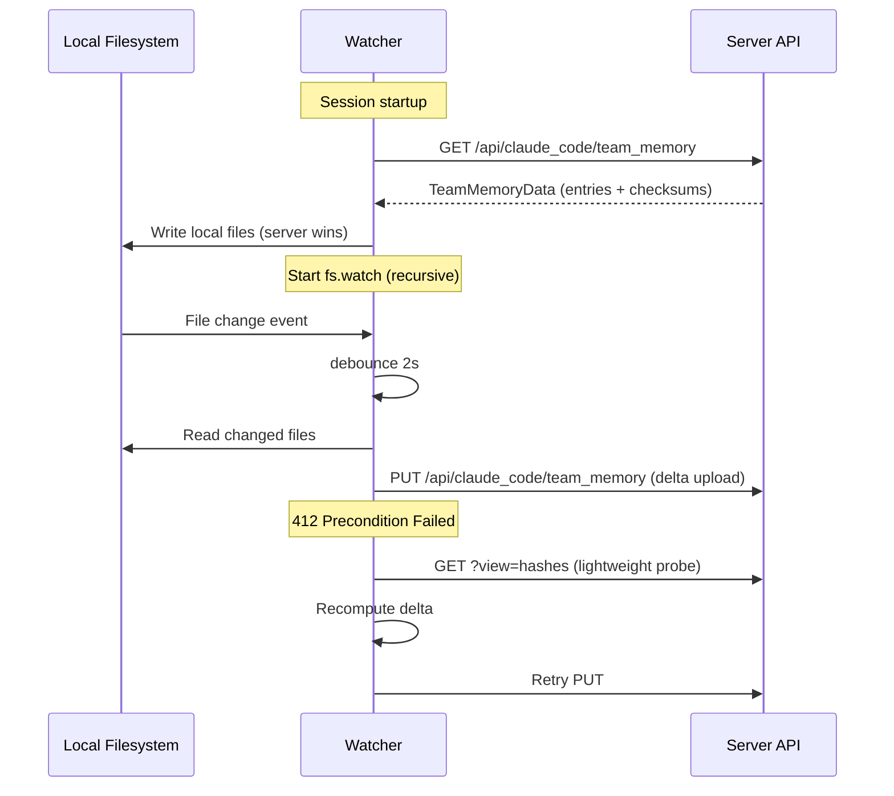
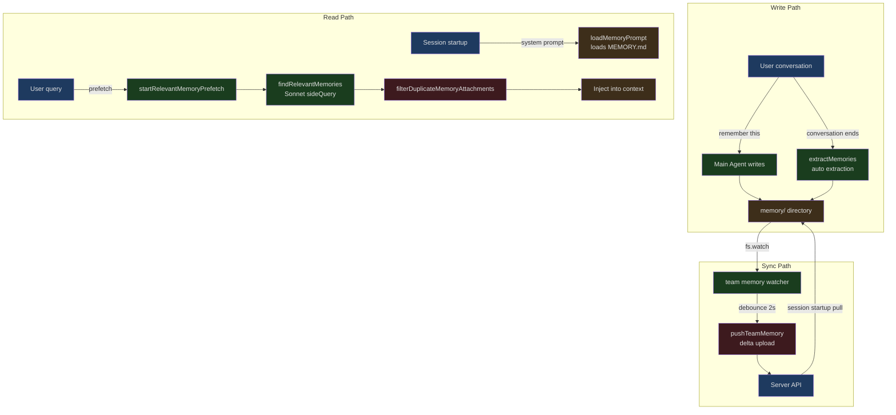

## The Problem

Every time you start a new conversation, the AI starts from scratch. It doesn't know who you are, what tech stack your project uses, or what behaviors you corrected last time. You have to repeatedly tell it "don't use mocks in tests," "I'm a backend engineer, don't give me CSS 101," "please submit PRs to the develop branch." This isn't a conversation — it's retraining an amnesiac assistant from scratch every time.

Claude Code's memory system (internally codenamed `memdir`, short for memory directory) solves this problem at its root. It maintains a structured set of persistent memories on the filesystem, allowing the AI to load your preferences, project context, and historical feedback at the start of every new session. Going further, it can **automatically extract** content worth remembering during conversations, without you having to manually say "please remember this."

This article takes a deep dive into the source code of `src/memdir/` and `src/services/extractMemories/`, dissecting the design and implementation of this system layer by layer.

## memdir Filesystem Design: A Two-Level Structure

Claude Code's memories aren't stored in a database or serialized into some JSON blob. It uses a **filesystem-as-database** design — each memory is an independent Markdown file, linked together by an index file called `MEMORY.md`.

### Directory Layout

```
~/.claude/projects/<sanitized-project-root>/memory/
  MEMORY.md                    # Index file, one pointer per line
  user_role.md                 # Individual memory file
  feedback_testing.md           # Individual memory file
  project_auth_rewrite.md      # Individual memory file
  reference_linear_project.md  # Individual memory file
  team/                        # Team shared memories (feature flag controlled)
    MEMORY.md
    feedback_no_mocks.md
    project_merge_freeze.md
```

This path is computed by `getAutoMemPath()` in `src/memdir/paths.ts`:

```typescript
// src/memdir/paths.ts, lines 223-235
export const getAutoMemPath = memoize(
  (): string => {
    const override = getAutoMemPathOverride() ?? getAutoMemPathSetting()
    if (override) {
      return override
    }
    const projectsDir = join(getMemoryBaseDir(), 'projects')
    return (
      join(projectsDir, sanitizePath(getAutoMemBase()), AUTO_MEM_DIRNAME) + sep
    ).normalize('NFC')
  },
  () => getProjectRoot(),
)
```

The path resolution priority chain is clear:

1. `CLAUDE_COWORK_MEMORY_PATH_OVERRIDE` environment variable — full path override for Cowork scenarios
2. `autoMemoryDirectory` in `settings.json` — user-level configuration (supports `~/` expansion)
3. Default path `~/.claude/projects/<sanitized-git-root>/memory/`

Note that `findCanonicalGitRoot` is used here to ensure all worktrees of the same repository share a single memory directory — a subtle but important design decision.

### MEMORY.md: An Index, Not Content

`MEMORY.md` is a plain text index file where each line is a link pointing to a specific memory file. The format requirements are strict:

```markdown
- [User Role](user_role.md) — Backend engineer, proficient in Go, React beginner
- [Testing Strategy Feedback](feedback_testing.md) — Don't use mocks in integration tests
- [Auth Rewrite Project](project_auth_rewrite.md) — Compliance-driven, not tech debt
- [Linear Project Tracking](reference_linear_project.md) — Pipeline bugs in INGEST project
```

Each line is no more than ~150 characters, containing only a title and a one-line hook description. **Never write memory content directly in `MEMORY.md`** — content goes in individual files.

The motivation behind this two-level structure is practical: `MEMORY.md` is **loaded entirely into the context** at the start of every session, so it must stay lean. If all memory content were crammed in here, the context window would be exhausted quickly.



### MEMORY.md Constraints: 200 Lines / 25KB

The index file cannot grow indefinitely. Two hard constraints are defined in `src/memdir/memdir.ts`:

```typescript
// src/memdir/memdir.ts, lines 34-38
export const ENTRYPOINT_NAME = 'MEMORY.md'
export const MAX_ENTRYPOINT_LINES = 200
// ~125 chars/line at 200 lines. At p97 today; catches long-line indexes that
// slip past the line cap (p100 observed: 197KB under 200 lines).
export const MAX_ENTRYPOINT_BYTES = 25_000
```

200 lines is the line count limit, and 25KB is the byte limit. These are independent constraints — even if the line count is under 200, if some lines are exceptionally long causing the total bytes to exceed 25KB, truncation is triggered. The comment on the byte limit specifically explains why: someone wrote an index file under 200 lines that totaled 197KB because each line was extremely long.

The truncation logic is implemented by `truncateEntrypointContent()`:

```typescript
// src/memdir/memdir.ts, lines 57-103
export function truncateEntrypointContent(raw: string): EntrypointTruncation {
  const trimmed = raw.trim()
  const contentLines = trimmed.split('\n')
  const lineCount = contentLines.length
  const byteCount = trimmed.length

  const wasLineTruncated = lineCount > MAX_ENTRYPOINT_LINES
  const wasByteTruncated = byteCount > MAX_ENTRYPOINT_BYTES

  if (!wasLineTruncated && !wasByteTruncated) {
    return {
      content: trimmed,
      lineCount,
      byteCount,
      wasLineTruncated,
      wasByteTruncated,
    }
  }

  let truncated = wasLineTruncated
    ? contentLines.slice(0, MAX_ENTRYPOINT_LINES).join('\n')
    : trimmed

  if (truncated.length > MAX_ENTRYPOINT_BYTES) {
    const cutAt = truncated.lastIndexOf('\n', MAX_ENTRYPOINT_BYTES)
    truncated = truncated.slice(0, cutAt > 0 ? cutAt : MAX_ENTRYPOINT_BYTES)
  }

  // ...construct WARNING message
  return {
    content:
      truncated +
      `\n\n> WARNING: ${ENTRYPOINT_NAME} is ${reason}. Only part of it was loaded...`,
    // ...
  }
}
```

The truncation strategy is deliberate: first truncate by lines (natural boundaries), then if bytes still exceed the limit, find the last newline before the limit and cut there, **avoiding splitting a line in the middle**. After truncation, a WARNING is appended at the end, telling the model the index was truncated and should be kept concise.

## Four Memory Types

Memories aren't an undifferentiated pile of text. Claude Code defines a closed four-type taxonomy, where each type has clear guidelines for when to save, how to use, and what content structure to follow:

```typescript
// src/memdir/memoryTypes.ts, lines 14-19
export const MEMORY_TYPES = [
  'user',
  'feedback',
  'project',
  'reference',
] as const

export type MemoryType = (typeof MEMORY_TYPES)[number]
```

### user: Understanding the User

Records the user's role, goals, responsibilities, and knowledge background. The core purpose is to let the AI adjust its behavior based on a user profile — the collaboration style for a senior backend engineer and a programming beginner should be fundamentally different.

**When to save**: When you learn about the user's role, preferences, responsibilities, or knowledge domain.

**Use case**: When work needs to be adapted based on the user's profile. For example, if a user asks you to explain a piece of code, you should choose the depth and angle of explanation based on their background.

**Example**:
```
User: I've written Go for ten years, but this is my first time touching React code in this repo
AI: [Save user memory: Deep Go experience, React beginner — use backend analogies to explain frontend concepts]
```

### feedback: Behavioral Guidance

Records user feedback on the AI's working methods — **including both corrections and affirmations**. This is particularly important: if only corrections are recorded, the AI becomes increasingly conservative, afraid to repeat approaches the user has actually approved.

**When to save**: When the user corrects your approach ("don't do that") or confirms a non-obvious approach works ("exactly, keep going").

**Content structure**: Write the rule itself first, then a **Why:** line (the reason the user gave), followed by a **How to apply:** line (in what scenarios this rule applies). Knowing "why" enables correct judgment in edge cases.

**Example**:
```
User: Don't mock the database in these tests — last quarter the mock tests all passed but the production migration broke
AI: [Save feedback memory: Integration tests must use real databases. Why: Mock/prod divergence caused migration failure. How to apply: All test files involving databases]
```

### project: Project Dynamics

Records information about ongoing work, goals, bugs, and incidents — things that **cannot be derived from code or git history**.

**When to save**: When you learn who is doing what, why, and what the deadline is. Note that relative dates should be converted to absolute dates ("next Thursday" -> "2026-04-02") so the memory remains understandable as time passes.

**Example**:
```
User: After Thursday, freeze all non-critical merges — the mobile team needs to cut a release branch
AI: [Save project memory: Merge freeze starting 2026-04-02. Why: Mobile release branch cut]
```

### reference: External Resource Pointers

Stores pointers to information locations in external systems — letting the AI know where to find the latest information.

**Example**:
```
User: Pipeline bugs are all tracked in the "INGEST" project on Linear
AI: [Save reference memory: Pipeline bugs in Linear project "INGEST"]
```

### Type Parsing

Type information is validated through a parser function that gracefully handles legacy files and unknown types:

```typescript
// src/memdir/memoryTypes.ts, lines 28-31
export function parseMemoryType(raw: unknown): MemoryType | undefined {
  if (typeof raw !== 'string') return undefined
  return MEMORY_TYPES.find(t => t === raw)
}
```

Invalid or missing types return `undefined` — old files won't crash, and new files with incorrect types simply degrade gracefully.



### What Not to Save

Code patterns, project structure, architecture design, git history, debugging solutions, content already in CLAUDE.md, and temporary task state — all of these are "derivable from the current project state" and should not be stored as memories. Even if a user explicitly asks to save a PR list or activity summary, you should follow up with "what here is **surprising** or **non-obvious**?" — only that part is worth saving.

## Frontmatter Metadata Format

Each individual memory file uses standard YAML frontmatter:

```markdown
---
name: {{memory name}}
description: {{one-line description — used to determine relevance in future conversations, so be specific}}
type: {{user, feedback, project, reference}}
---

{{memory content — for feedback/project types, recommend structuring as: rule/fact + **Why:** + **How to apply:**}}
```

The `description` field is particularly critical — it's not just a human-readable note, but the core basis used by the memory retrieval system (`findRelevantMemories`) to determine whether a memory is relevant to the current query. A good description should be specific enough to distinguish context, such as "Don't use database mocks in tests — lesson from compliance migration failure" rather than "testing-related feedback."

The frontmatter format example is defined in `memoryTypes.ts`:

```typescript
// src/memdir/memoryTypes.ts, lines 261-271
export const MEMORY_FRONTMATTER_EXAMPLE: readonly string[] = [
  '```markdown',
  '---',
  'name: {{memory name}}',
  'description: {{one-line description — used to decide relevance...}}',
  `type: {{${MEMORY_TYPES.join(', ')}}}`,
  '---',
  '',
  '{{memory content — for feedback/project types, structure as: ...}}',
  '```',
]
```

## Memory Scanning and Directory Management

### memoryScan: Scanning Memory Files

`src/memdir/memoryScan.ts` provides directory scanning primitives shared by both the retrieval and extraction paths:

```typescript
// src/memdir/memoryScan.ts, lines 13-19
export type MemoryHeader = {
  filename: string
  filePath: string
  mtimeMs: number
  description: string | null
  type: MemoryType | undefined
}
```

`scanMemoryFiles()` recursively scans all `.md` files in the directory (excluding `MEMORY.md`), reads the first 30 lines of frontmatter from each file, then sorts by modification time in descending order, returning at most 200 entries:

```typescript
// src/memdir/memoryScan.ts, lines 35-77
export async function scanMemoryFiles(
  memoryDir: string,
  signal: AbortSignal,
): Promise<MemoryHeader[]> {
  try {
    const entries = await readdir(memoryDir, { recursive: true })
    const mdFiles = entries.filter(
      f => f.endsWith('.md') && basename(f) !== 'MEMORY.md',
    )

    const headerResults = await Promise.allSettled(
      mdFiles.map(async (relativePath): Promise<MemoryHeader> => {
        const filePath = join(memoryDir, relativePath)
        const { content, mtimeMs } = await readFileInRange(
          filePath, 0, FRONTMATTER_MAX_LINES, undefined, signal,
        )
        const { frontmatter } = parseFrontmatter(content, filePath)
        return {
          filename: relativePath,
          filePath,
          mtimeMs,
          description: frontmatter.description || null,
          type: parseMemoryType(frontmatter.type),
        }
      }),
    )

    return headerResults
      .filter((r): r is PromiseFulfilledResult<MemoryHeader> =>
        r.status === 'fulfilled')
      .map(r => r.value)
      .sort((a, b) => b.mtimeMs - a.mtimeMs)
      .slice(0, MAX_MEMORY_FILES)
  } catch {
    return []
  }
}
```

A design highlight: `readFileInRange` reads only the first 30 lines of each file rather than the entire thing, and `readFileInRange` internally returns `mtimeMs`, eliminating the need for a separate `stat` call — in the common case (N <= 200), this cuts the number of system calls in half.

Scan results can also be formatted as a text manifest for use in retrieval and extraction prompts:

```typescript
// src/memdir/memoryScan.ts, lines 84-94
export function formatMemoryManifest(memories: MemoryHeader[]): string {
  return memories
    .map(m => {
      const tag = m.type ? `[${m.type}] ` : ''
      const ts = new Date(m.mtimeMs).toISOString()
      return m.description
        ? `- ${tag}${m.filename} (${ts}): ${m.description}`
        : `- ${tag}${m.filename} (${ts})`
    })
    .join('\n')
}
```

### ensureMemoryDirExists: Directory Guarantee

Called only once per session (cached via `systemPromptSection`), this ensures the memory directory exists so the model doesn't need to run `mkdir` or check for directory existence when writing files:

```typescript
// src/memdir/memdir.ts, lines 129-147
export async function ensureMemoryDirExists(memoryDir: string): Promise<void> {
  const fs = getFsImplementation()
  try {
    await fs.mkdir(memoryDir)
  } catch (e) {
    const code =
      e instanceof Error && 'code' in e && typeof e.code === 'string'
        ? e.code
        : undefined
    logForDebugging(
      `ensureMemoryDirExists failed for ${memoryDir}: ${code ?? String(e)}`,
      { level: 'debug' },
    )
  }
}
```

The prompt even explicitly tells the model "the directory already exists — write to it directly with the Write tool, don't run mkdir or check for existence":

```typescript
// src/memdir/memdir.ts, lines 116-119
export const DIR_EXISTS_GUIDANCE =
  'This directory already exists — write to it directly with the Write tool ' +
  '(do not run mkdir or check for its existence).'
```

A comment explains why this is necessary: "Claude used to spend several turns running `ls` and `mkdir -p` before writing files."

## Automatic Memory Extraction: extractMemories

This is the most sophisticated part of the memory system. Claude Code doesn't require you to manually say "remember this" — it has a background agent that automatically analyzes conversation content at the end of each exchange, extracting memories worth persisting.

### Trigger Timing

The extraction agent runs at the end of each complete query cycle (when the model produces a final response with no more tool calls), triggered via `handleStopHooks`:

```typescript
// src/services/extractMemories/extractMemories.ts, lines 598-603
export async function executeExtractMemories(
  context: REPLHookContext,
  appendSystemMessage?: AppendSystemMessageFn,
): Promise<void> {
  await extractor?.(context, appendSystemMessage)
}
```

### Mutual Exclusion with the Main Agent

A key design is the **mutual exclusion** between the extraction agent and the main agent: if the main agent has already written memory files during the conversation, the extraction agent skips that range and only advances the cursor:

```typescript
// src/services/extractMemories/extractMemories.ts, lines 121-148
function hasMemoryWritesSince(
  messages: Message[],
  sinceUuid: string | undefined,
): boolean {
  let foundStart = sinceUuid === undefined
  for (const message of messages) {
    if (!foundStart) {
      if (message.uuid === sinceUuid) {
        foundStart = true
      }
      continue
    }
    if (message.type !== 'assistant') {
      continue
    }
    const content = (message as AssistantMessage).message.content
    if (!Array.isArray(content)) {
      continue
    }
    for (const block of content) {
      const filePath = getWrittenFilePath(block)
      if (filePath !== undefined && isAutoMemPath(filePath)) {
        return true
      }
    }
  }
  return false
}
```

This mutual exclusion prevents duplicate writes — memories written by the main agent won't be written again by the background agent.

### Forked Agent Mode

The extraction agent runs using `runForkedAgent` — a "perfect fork" of the main conversation that shares the parent's prompt cache. This means the extraction agent doesn't need to resend the entire conversation history, dramatically reducing token costs:

```typescript
// src/services/extractMemories/extractMemories.ts, lines 415-427
const result = await runForkedAgent({
  promptMessages: [createUserMessage({ content: userPrompt })],
  cacheSafeParams,
  canUseTool,
  querySource: 'extract_memories',
  forkLabel: 'extract_memories',
  skipTranscript: true,
  maxTurns: 5,
})
```

Note the hard limit of `maxTurns: 5` — this prevents the extraction agent from falling into a "verification rabbit hole" (e.g., reading source code to confirm whether a certain pattern actually exists).

### Tool Permission Sandbox

The extraction agent has strict tool permission restrictions, defined by `createAutoMemCanUseTool`:

- **Allowed**: `FileRead`, `Grep`, `Glob` (read-only)
- **Allowed**: Read-only `Bash` commands (ls, find, cat, stat, etc.)
- **Allowed**: `FileEdit`, `FileWrite` — but only for paths within the memory directory
- **Denied**: All other tools (MCP, Agent, write-capable Bash, etc.)

```typescript
// src/services/extractMemories/extractMemories.ts, lines 171-222
export function createAutoMemCanUseTool(memoryDir: string): CanUseToolFn {
  return async (tool: Tool, input: Record<string, unknown>) => {
    // Allow Read/Grep/Glob
    if (tool.name === FILE_READ_TOOL_NAME ||
        tool.name === GREP_TOOL_NAME ||
        tool.name === GLOB_TOOL_NAME) {
      return { behavior: 'allow' as const, updatedInput: input }
    }

    // Bash only allows read-only commands
    if (tool.name === BASH_TOOL_NAME) {
      const parsed = tool.inputSchema.safeParse(input)
      if (parsed.success && tool.isReadOnly(parsed.data)) {
        return { behavior: 'allow' as const, updatedInput: input }
      }
      return denyAutoMemTool(tool, 'Only read-only shell commands...')
    }

    // Write/Edit only allowed for paths inside the memory directory
    if ((tool.name === FILE_EDIT_TOOL_NAME ||
         tool.name === FILE_WRITE_TOOL_NAME) &&
        'file_path' in input) {
      const filePath = input.file_path
      if (typeof filePath === 'string' && isAutoMemPath(filePath)) {
        return { behavior: 'allow' as const, updatedInput: input }
      }
    }

    return denyAutoMemTool(tool, `only ... are allowed`)
  }
}
```

### Extraction Prompt Design

The prompt received by the extraction agent is built by `src/services/extractMemories/prompts.ts`. It includes the complete type taxonomy, saving rules, and a key optimization — **pre-injecting the existing memory manifest**:

```typescript
// src/services/extractMemories/prompts.ts, lines 29-44
function opener(newMessageCount: number, existingMemories: string): string {
  const manifest =
    existingMemories.length > 0
      ? `\n\n## Existing memory files\n\n${existingMemories}\n\n` +
        `Check this list before writing — update an existing file ` +
        `rather than creating a duplicate.`
      : ''
  return [
    `You are now acting as the memory extraction subagent. ` +
    `Analyze the most recent ~${newMessageCount} messages above...`,
    '',
    `Available tools: FileRead, Grep, Glob, read-only Bash, ` +
    `and FileEdit/FileWrite for paths inside the memory directory only.`,
    '',
    `You have a limited turn budget. FileEdit requires a prior FileRead, ` +
    `so the efficient strategy is: turn 1 — issue all FileRead calls in ` +
    `parallel; turn 2 — issue all FileWrite/FileEdit calls in parallel.`,
    // ...
  ].join('\n')
}
```

The extraction prompt also includes a strict constraint: "You **may only** use content from the most recent ~N messages to update memories. Do not spend turns investigating or verifying this content — don't grep source code, don't read code to confirm patterns, don't run git commands."

### Concurrency Control and Message Coalescing

The extraction system has sophisticated concurrency control. When an extraction is already in progress, incoming requests are stashed and a "trailing extraction" runs after the current one completes:



### Extraction Frequency Throttling

Extraction doesn't run on every turn — the interval is controlled via the feature flag `tengu_bramble_lintel` (default: every 1 eligible turn):

```typescript
// src/services/extractMemories/extractMemories.ts, lines 377-385
if (!isTrailingRun) {
  turnsSinceLastExtraction++
  if (
    turnsSinceLastExtraction <
    (getFeatureValue_CACHED_MAY_BE_STALE('tengu_bramble_lintel', null) ?? 1)
  ) {
    return
  }
}
turnsSinceLastExtraction = 0
```

## Memory Injection Timing

Memories are loaded into the conversation context through two paths:

### Path One: System Prompt Injection (MEMORY.md Index)

`loadMemoryPrompt()` is called during system prompt construction, injecting the content of `MEMORY.md` (after truncation processing) into the system prompt. This is the first layer of memory loading at session startup:

```typescript
// src/memdir/memdir.ts, lines 419-507
export async function loadMemoryPrompt(): Promise<string | null> {
  const autoEnabled = isAutoMemoryEnabled()

  // KAIROS log mode takes priority
  if (feature('KAIROS') && autoEnabled && getKairosActive()) {
    return buildAssistantDailyLogPrompt(skipIndex)
  }

  // TEAMMEM mode: load both private and team memories
  if (feature('TEAMMEM')) {
    if (teamMemPaths!.isTeamMemoryEnabled()) {
      const autoDir = getAutoMemPath()
      const teamDir = teamMemPaths!.getTeamMemPath()
      await ensureMemoryDirExists(teamDir)
      return teamMemPrompts!.buildCombinedMemoryPrompt(extraGuidelines, skipIndex)
    }
  }

  // Standard mode: load personal memories only
  if (autoEnabled) {
    const autoDir = getAutoMemPath()
    await ensureMemoryDirExists(autoDir)
    return buildMemoryLines('auto memory', autoDir, extraGuidelines, skipIndex)
      .join('\n')
  }

  return null
}
```

### Path Two: Relevant Memory Prefetch (Individual Memory Files)

The `MEMORY.md` index is always loaded, but individual memory file contents are not all loaded — that would waste context. Instead, the system **selectively prefetches** the most relevant memories based on the user's current query.

This process is driven by `startRelevantMemoryPrefetch()`:

```typescript
// src/utils/attachments.ts, lines 2361-2424
export function startRelevantMemoryPrefetch(
  messages: ReadonlyArray<Message>,
  toolUseContext: ToolUseContext,
): MemoryPrefetch | undefined {
  if (!isAutoMemoryEnabled() || !getFeatureValue_CACHED_MAY_BE_STALE(...)) {
    return undefined
  }

  const lastUserMessage = messages.findLast(m => m.type === 'user' && !m.isMeta)
  if (!lastUserMessage) {
    return undefined
  }

  const input = getUserMessageText(lastUserMessage)
  // Single-word queries lack sufficient context
  if (!input || !/\s/.test(input.trim())) {
    return undefined
  }

  const surfaced = collectSurfacedMemories(messages)
  if (surfaced.totalBytes >= RELEVANT_MEMORIES_CONFIG.MAX_SESSION_BYTES) {
    return undefined
  }

  // Async prefetch, non-blocking to the main query
  const promise = getRelevantMemoryAttachments(
    input,
    toolUseContext.options.agentDefinitions.activeAgents,
    toolUseContext.readFileState,
    collectRecentSuccessfulTools(messages, lastUserMessage),
    controller.signal,
    surfaced.paths,
  )
  // ...
}
```

Key design decisions in the prefetch:

1. **Non-blocking**: The prefetch is asynchronous, never blocking the main query loop
2. **Cancellable**: Linked to a turn-level AbortController, so the user can cancel immediately by pressing Escape
3. **Disposable pattern**: Uses the `using` keyword binding, automatically cleaning up on all exit paths of the query loop (return, throw, .return())
4. **Session-level byte cap**: Prevents unlimited memory injection in long sessions

### findRelevantMemories: AI-Driven Memory Retrieval

Memory file selection doesn't rely on keyword matching — it uses a Sonnet model via sideQuery to determine which memories are most relevant to the current query:

```typescript
// src/memdir/findRelevantMemories.ts, lines 39-75
export async function findRelevantMemories(
  query: string,
  memoryDir: string,
  signal: AbortSignal,
  recentTools: readonly string[] = [],
  alreadySurfaced: ReadonlySet<string> = new Set(),
): Promise<RelevantMemory[]> {
  const memories = (await scanMemoryFiles(memoryDir, signal)).filter(
    m => !alreadySurfaced.has(m.filePath),
  )
  if (memories.length === 0) {
    return []
  }

  const selectedFilenames = await selectRelevantMemories(
    query, memories, signal, recentTools,
  )
  // ...
  return selected.map(m => ({ path: m.filePath, mtimeMs: m.mtimeMs }))
}
```

The selector's system prompt is precise:

```typescript
// src/memdir/findRelevantMemories.ts, lines 18-24
const SELECT_MEMORIES_SYSTEM_PROMPT = `You are selecting memories that will be
useful to Claude Code as it processes a user's query. You will be given the
user's query and a list of available memory files with their filenames and
descriptions.

Return a list of filenames for the memories that will clearly be useful
(up to 5). Only include memories that you are certain will be helpful...`
```

The selector also receives a "recently successfully used tools" list, **excluding reference docs for tools already in use** (since that's noise), but keeping warnings and known issues about those tools (since those are exactly what's needed during use).

## Memory Deduplication

There is a deduplication step during memory injection — preventing memories the model has already read from being injected again. This is implemented by `filterDuplicateMemoryAttachments()`:

```typescript
// src/utils/attachments.ts, lines 2520-2541
export function filterDuplicateMemoryAttachments(
  attachments: Attachment[],
  readFileState: FileStateCache,
): Attachment[] {
  return attachments
    .map(attachment => {
      if (attachment.type !== 'relevant_memories') return attachment
      const filtered = attachment.memories.filter(
        m => !readFileState.has(m.path),
      )
      for (const m of filtered) {
        readFileState.set(m.path, {
          content: m.content,
          timestamp: m.mtimeMs,
          offset: undefined,
          limit: m.limit,
        })
      }
      return filtered.length > 0 ? { ...attachment, memories: filtered } : null
    })
    .filter((a): a is Attachment => a !== null)
}
```

A source code comment specifically mentions a subtle bug fix here:

> The mark-after-filter ordering is load-bearing: readMemoriesForSurfacing used to write to readFileState during the prefetch, which meant the filter saw every prefetch-selected path as "already in context" and dropped them all (self-referential filter).

The previous implementation wrote to `readFileState` during the prefetch phase, so when the filter checked, it found all prefetched memories were "already in context" — it filtered out itself. The fix was to defer the write until after filtering.

## Memory Expiration and Update Strategy

### Time Awareness

`src/memdir/memoryAge.ts` provides human-readable time annotations:

```typescript
// src/memdir/memoryAge.ts, lines 6-19
export function memoryAgeDays(mtimeMs: number): number {
  return Math.max(0, Math.floor((Date.now() - mtimeMs) / 86_400_000))
}

export function memoryAge(mtimeMs: number): string {
  const d = memoryAgeDays(mtimeMs)
  if (d === 0) return 'today'
  if (d === 1) return 'yesterday'
  return `${d} days ago`
}
```

Why convert timestamps to "47 days ago" instead of ISO format? Because models perform poorly at date arithmetic — seeing `2026-02-12T08:33:00Z` doesn't automatically trigger the realization "this is from a long time ago," but seeing "47 days ago" immediately triggers staleness reasoning.

### Staleness Warning Injection

Memories older than 1 day are annotated with a staleness warning:

```typescript
// src/memdir/memoryAge.ts, lines 33-42
export function memoryFreshnessText(mtimeMs: number): string {
  const d = memoryAgeDays(mtimeMs)
  if (d <= 1) return ''
  return (
    `This memory is ${d} days old. ` +
    `Memories are point-in-time observations, not live state — ` +
    `claims about code behavior or file:line citations may be outdated. ` +
    `Verify against current code before asserting as fact.`
  )
}
```

The motivation for this warning came from user reports: stale code state memories (containing file:line references) were being asserted as facts, and the references made stale claims appear more authoritative rather than less reliable.

### Verify Before Asserting

The `TRUSTING_RECALL_SECTION` in the system prompt requires the model to verify before recommending based on memories:

```typescript
// src/memdir/memoryTypes.ts, lines 240-256
export const TRUSTING_RECALL_SECTION: readonly string[] = [
  '## Before recommending from memory',
  '',
  'A memory that names a specific function, file, or flag is a claim that ' +
  'it existed *when the memory was written*. It may have been renamed, ' +
  'removed, or never merged. Before recommending it:',
  '',
  '- If the memory names a file path: check the file exists.',
  '- If the memory names a function or flag: grep for it.',
  '- If the user is about to act on your recommendation: verify first.',
  '',
  '"The memory says X exists" is not the same as "X exists now."',
]
```

A comment documents the eval validation results: when this text was renamed from "Trusting what you recall" to "Before recommending from memory," the eval went from 0/3 to 3/3 — **title wording affected the model's behavioral triggers**.

## Team Memory Sync

When the `TEAMMEM` feature flag is enabled, the memory system expands to a dual-directory structure:

```
~/.claude/projects/<project>/memory/
  MEMORY.md              # Private index
  user_role.md           # Private memory
  feedback_terse.md      # Private memory
  team/                  # Team shared
    MEMORY.md            # Team index
    feedback_no_mocks.md # Team memory
    project_freeze.md    # Team memory
```

### Team Path

The team memory directory is a subdirectory of the personal memory directory:

```typescript
// src/memdir/teamMemPaths.ts, lines 84-86
export function getTeamMemPath(): string {
  return (join(getAutoMemPath(), 'team') + sep).normalize('NFC')
}
```

### Dual-Directory Prompt

When team memory is enabled, the prompt includes instructions for both directories, with each memory type annotated with a `<scope>` tag to guide placement:

- `user` type: **Always private** (your personal profile shouldn't be shared)
- `feedback` type: **Private by default**, unless it's clearly a project-level convention (e.g., testing strategy)
- `project` type: **Leans toward team**
- `reference` type: **Usually team**

### Sync Mechanism

`src/services/teamMemorySync/` implements the full sync mechanism:



Sync semantics:

- **Pull**: Server content overwrites local files by key (server wins)
- **Push**: Only uploads keys whose content hashes differ from the server (delta upload). The server uses upsert semantics — keys not present in the PUT are preserved
- **Deletes don't propagate**: Deleting a file locally won't delete it from the server; it will be restored on the next pull

### File Monitoring

The watcher uses `fs.watch({ recursive: true })`:

```typescript
// src/services/teamMemorySync/watcher.ts, lines 167-228
async function startFileWatcher(teamDir: string): Promise<void> {
  // ...
  watcher = watch(
    teamDir,
    { persistent: true, recursive: true },
    (_eventType, filename) => {
      if (pushSuppressedReason !== null) {
        // Only unlink can clear suppression
        void stat(join(teamDir, filename)).catch((err) => {
          if (err.code !== 'ENOENT') return
          pushSuppressedReason = null
          schedulePush()
        })
        return
      }
      schedulePush()
    },
  )
}
```

Why not use chokidar? A comment explains: chokidar 4+ removed fsevents support, and Bun's `fs.watch` fallback uses kqueue — each monitored file requires a file descriptor. With 500+ team memory files, that's 500+ permanently held file descriptors. `recursive: true` uses FSEvents on macOS (O(1) fd) and inotify on Linux (O(number of subdirectories)).

### Security Safeguards

Team memory involves cross-user sharing, so security is critical. `teamMemPaths.ts` implements multiple layers of path safety checks:

1. **Path injection protection**: `sanitizePathKey()` checks for null bytes, URL-encoded traversal (`%2e%2e%2f`), Unicode normalization attacks, backslashes, and absolute paths
2. **Symlink protection**: `realpathDeepestExisting()` resolves symlinks to real paths, preventing escape out of the team directory via symlinks
3. **Dangling symlink detection**: Uses `lstat` to distinguish "truly doesn't exist" from "symlink target doesn't exist"
4. **Secret scanning**: `scanForSecrets()` uses gitleaks rules to detect API keys, credentials, and other sensitive data, blocking pushes

### Permanent Failure Suppression

When a push fails for an unrecoverable reason (no OAuth, 404, 413, etc.), the watcher suppresses subsequent retries, avoiding infinite retry loops. There was a case where a device without OAuth generated 167,000 push events over 2.5 days.

```typescript
// src/services/teamMemorySync/watcher.ts, lines 61-73
export function isPermanentFailure(r: TeamMemorySyncPushResult): boolean {
  if (r.errorType === 'no_oauth' || r.errorType === 'no_repo') return true
  if (
    r.httpStatus !== undefined &&
    r.httpStatus >= 400 &&
    r.httpStatus < 500 &&
    r.httpStatus !== 409 &&  // 409 is a transient conflict
    r.httpStatus !== 429     // 429 is rate limiting
  ) {
    return true
  }
  return false
}
```

## Complete Memory System Lifecycle



## Portable Patterns

The memory system's design has an implicit but important property: **portability**.

Because all memories are standard Markdown files, stored at deterministic paths on the filesystem, with a uniform frontmatter format:

1. **Cross-device migration**: Copy the `~/.claude/projects/` directory to migrate all memories
2. **Version control**: The memory directory can be put under git management (though this isn't done by default)
3. **Backup and restore**: Standard filesystem backup tools work out of the box
4. **Bulk editing**: Any text editor can directly modify memories
5. **Programmatic operations**: Scripts can directly read and write files in the frontmatter format
6. **Cross-tool compatibility**: Other tools can read and understand this format

No proprietary database format, no encrypted blobs, no storage that requires a specific API to access. This is a deliberate design choice — it trades some query efficiency (compared to SQLite) for transparency and operability.

### Path Safety and Configurability

The configurability of the path system is also worth noting. `validateMemoryPath()` in `paths.ts` performs strict security validation on paths:

```typescript
// src/memdir/paths.ts, lines 109-150
function validateMemoryPath(
  raw: string | undefined,
  expandTilde: boolean,
): string | undefined {
  if (!raw) return undefined
  let candidate = raw
  if (expandTilde && (candidate.startsWith('~/') || candidate.startsWith('~\\'))) {
    const rest = candidate.slice(2)
    const restNorm = normalize(rest || '.')
    if (restNorm === '.' || restNorm === '..') {
      return undefined  // Reject expansion to $HOME or its parent
    }
    candidate = join(homedir(), rest)
  }
  const normalized = normalize(candidate).replace(/[/\\]+$/, '')
  if (
    !isAbsolute(normalized) ||
    normalized.length < 3 ||
    /^[A-Za-z]:$/.test(normalized) ||     // Windows root drive
    normalized.startsWith('\\\\') ||       // UNC paths
    normalized.startsWith('//') ||
    normalized.includes('\0')              // null bytes
  ) {
    return undefined
  }
  return (normalized + sep).normalize('NFC')
}
```

A security comment specifically notes: `projectSettings` (committed to the repo in `.claude/settings.json`) is **deliberately excluded** — a malicious repository could set `autoMemoryDirectory: "~/.ssh"` to gain write access to a sensitive directory. Only `policySettings`, `localSettings`, and `userSettings` from trusted sources are accepted.

## Special Mode: KAIROS Assistant Logs

When `feature('KAIROS')` is enabled and running in assistant mode, the memory system switches to a log mode. Assistant sessions are effectively long-running, so instead of maintaining a `MEMORY.md` index, the agent writes to date-named log files in append mode:

```
~/.claude/projects/<project>/memory/logs/2026/03/2026-03-31.md
```

Each log entry is a brief timestamped bullet point. The `MEMORY.md` index is generated by a separate `/dream` skill that distills from the logs overnight.

The design motivation for this mode is: in long-running sessions, the cost of maintaining an index in real time is too high, and logs are naturally ordered by time, so they don't need an index for organization. The distillation process can run during low-load periods, performing deeper organization.

## Disabling Memory

The memory system can be disabled at multiple levels:

```typescript
// src/memdir/paths.ts, lines 30-55
export function isAutoMemoryEnabled(): boolean {
  const envVal = process.env.CLAUDE_CODE_DISABLE_AUTO_MEMORY
  if (isEnvTruthy(envVal)) return false         // Environment variable disables
  if (isEnvDefinedFalsy(envVal)) return true     // Environment variable explicitly enables
  if (isEnvTruthy(process.env.CLAUDE_CODE_SIMPLE)) return false  // --bare mode
  if (isEnvTruthy(process.env.CLAUDE_CODE_REMOTE) &&
      !process.env.CLAUDE_CODE_REMOTE_MEMORY_DIR) return false   // Remote without storage
  const settings = getInitialSettings()
  if (settings.autoMemoryEnabled !== undefined) {
    return settings.autoMemoryEnabled
  }
  return true  // Enabled by default
}
```

Priority chain: Environment variable > `--bare` mode > Remote mode detection > settings.json > Enabled by default.

## Design Insights

Claude Code's memory system has several design decisions worth reflecting on:

**Filesystem as database.** No SQLite, LevelDB, or any embedded database — just the filesystem directly. This may seem "primitive," but it delivers debuggability (just `cat` to inspect), portability (just copy the directory), and operability (any editor can modify it). For a system where memory entries typically don't exceed 200 and each file is no more than a few KB, filesystem performance is more than sufficient.

**Closed type taxonomy.** Only four types, each with clear guidance on "what to save and what not to save." This prevents the model's tendency to save everything as a memory — particularly the rule "content derivable from code should not be saved as memory" effectively prevents memory bloat.

**AI-driven retrieval.** Memory retrieval doesn't rely on keyword matching or vector search, but instead directly lets another AI (Sonnet) look at frontmatter descriptions to judge relevance. This is very effective when the memory count is small (< 200) — each memory's description is semantically rich natural language, and the AI can make more accurate judgments than keyword matching.

**Eval-driven prompt iteration.** Code comments repeatedly reference eval results to explain specific wording choices — for example, changing a section title from "Trusting what you recall" to "Before recommending from memory" improved the eval from 0/3 to 3/3. This demonstrates that the memory system's behavior is largely determined by prompt engineering, and prompt wording choices require quantitative validation.

**Mutually exclusive write paths.** The mutual exclusion design between the main agent and extraction agent avoids duplicate memories, but also means that if the main agent writes one memory during a conversation, even if it missed other memorable content in the same conversation, the extraction agent won't fill in the gaps — it considers the entire range as already processed. This is an intentional trade-off: between redundancy and omission, it chose omission.

How does this system perform in practice? Judging from the telemetry events and eval references scattered throughout the source code, it has gone through extensive experimentation and iteration. Memory is not just an engineering problem but a product design problem — what to remember, what not to remember, when to surface, and when to stay silent. These decisions directly impact user experience. Claude Code's memory system provides a battle-tested answer.
