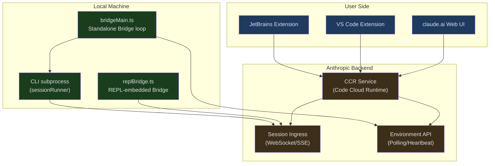
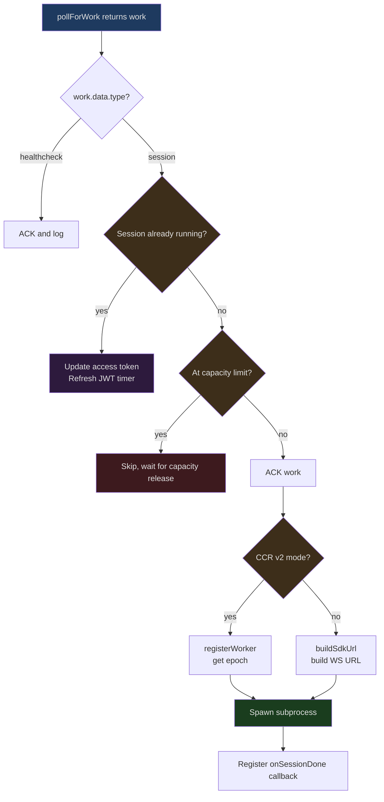
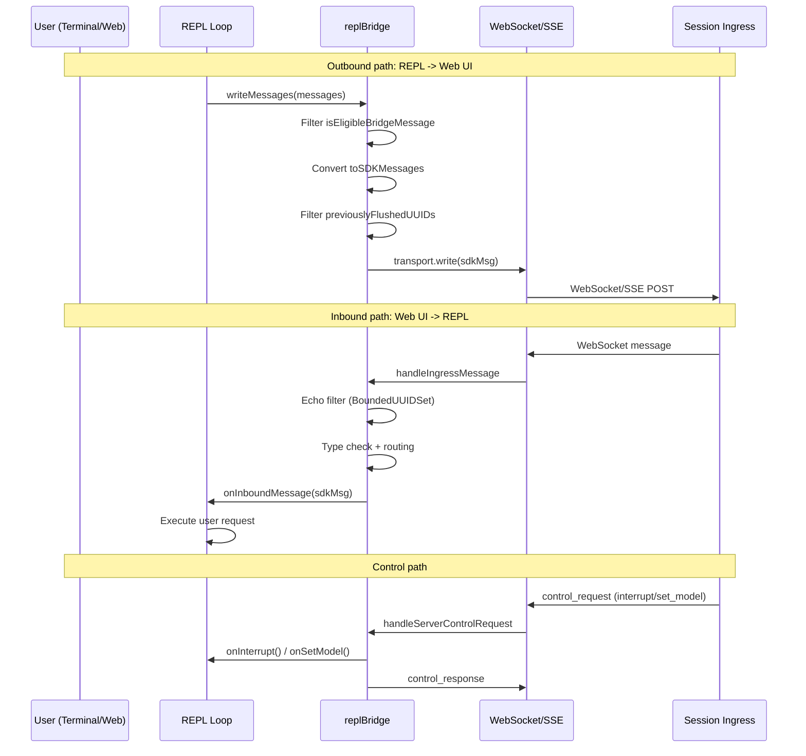

## The Problem

Claude Code is both a standalone terminal tool and embeddable in VS Code and JetBrains. How does a single process serve two completely different interaction surfaces?

When you type the `claude` command in your terminal, a Node.js process starts, loads the REPL loop, and interacts with you via stdin/stdout. But when you click the Claude icon in VS Code's sidebar, or open a Remote Control session on claude.ai, the same CLI process is responding behind the scenes. This means:

- A Claude Code instance running in the terminal needs to synchronize messages in real time with a remote Web UI
- User actions on the Web UI (sending prompts, interrupting, switching models) need to be relayed to the local CLI process
- Permission requests need to traverse processes and networks, then wait for a response
- Session JWT tokens need automatic refresh to prevent long-running tasks from being interrupted by auth expiration
- File attachments need to be downloaded from the web to the local machine for the CLI process's tools to use

At the heart of all this is the **Bridge system** — a complete bidirectional communication architecture that treats the CLI process as the "backend" and the IDE extension or Web UI as the "frontend," enabling real-time interaction through polling, WebSocket, and SSE.

## Architecture Overview

The Bridge system's architecture can be summarized in one sentence: **the CLI process registers as an Environment, polls for Work Items, and communicates bidirectionally with Session Ingress via WebSocket/SSE**.



The system has two operating modes:

1. **Standalone Bridge mode** (`bridgeMain.ts`): Launched by the `claude remote-control` command, it runs as a long-lived process that polls the server and forks a subprocess for each session. Supports concurrent multi-session and worktree isolation.
2. **REPL-embedded Bridge mode** (`replBridge.ts`): Automatically connects during interactive REPL execution, exposing the current session to the Web UI, enabling scenarios like "coding in the terminal while monitoring on your phone."

## bridgeMain.ts: The Standalone Bridge Main Loop

`bridgeMain.ts` is the core of standalone Bridge mode. The `runBridgeLoop` function implements a complete poll-dispatch-manage loop responsible for: environment registration, work polling, session spawning, heartbeat maintenance, and error recovery.

### BackoffConfig and Backoff Strategy

In networked environments, transient failures are the norm. The Bridge system defines fine-grained backoff configuration:

```typescript
// src/bridge/bridgeMain.ts, lines 59-79
export type BackoffConfig = {
  connInitialMs: number
  connCapMs: number
  connGiveUpMs: number
  generalInitialMs: number
  generalCapMs: number
  generalGiveUpMs: number
  shutdownGraceMs?: number
  stopWorkBaseDelayMs?: number
}

const DEFAULT_BACKOFF: BackoffConfig = {
  connInitialMs: 2_000,
  connCapMs: 120_000,      // 2 minutes
  connGiveUpMs: 600_000,   // 10 minutes
  generalInitialMs: 500,
  generalCapMs: 30_000,
  generalGiveUpMs: 600_000, // 10 minutes
}
```

Backoff configuration is split into two categories: **connection errors** (`conn*`) and **general errors** (`general*`). Connection errors start at 2 seconds with a 2-minute cap and give up after 10 minutes; general errors start faster (500ms) with a 30-second cap. `shutdownGraceMs` controls the grace period from SIGTERM to SIGKILL (default 30 seconds), ensuring subprocesses have time to clean up.

### Core Structure of the Main Loop

The `runBridgeLoop` function signature itself reveals the system's dependency injection design:

```typescript
// src/bridge/bridgeMain.ts, lines 141-152
export async function runBridgeLoop(
  config: BridgeConfig,
  environmentId: string,
  environmentSecret: string,
  api: BridgeApiClient,
  spawner: SessionSpawner,
  logger: BridgeLogger,
  signal: AbortSignal,
  backoffConfig: BackoffConfig = DEFAULT_BACKOFF,
  initialSessionId?: string,
  getAccessToken?: () => string | undefined | Promise<string | undefined>,
): Promise<void> {
```

The function maintains numerous state Maps internally, and these data structures together form the core of session management:

```typescript
// src/bridge/bridgeMain.ts, lines 163-194
const activeSessions = new Map<string, SessionHandle>()
const sessionStartTimes = new Map<string, number>()
const sessionWorkIds = new Map<string, string>()
const sessionCompatIds = new Map<string, string>()
const sessionIngressTokens = new Map<string, string>()
const sessionTimers = new Map<string, ReturnType<typeof setTimeout>>()
const completedWorkIds = new Set<string>()
const sessionWorktrees = new Map<string, {
  worktreePath: string
  worktreeBranch?: string
  gitRoot?: string
  hookBased?: boolean
}>()
const timedOutSessions = new Set<string>()
const titledSessions = new Set<string>()
```

Worth noting here is the existence of `sessionCompatIds`. CCR v2's infrastructure layer uses `cse_*`-prefixed IDs, while the claude.ai frontend and compatibility API use `session_*`-prefixed IDs. Both map to the same underlying UUID but require different formats at different API endpoints. `sessionCompatIds` is computed once at spawn time and cached, ensuring cleanup and state updates always use a consistent key.

### Work Polling and Dispatch

The core of the main loop is a `while (!loopSignal.aborted)` loop, where each iteration queries for new work items via `pollForWork`:

```typescript
// src/bridge/bridgeMain.ts, lines 600-612
while (!loopSignal.aborted) {
  const pollConfig = getPollIntervalConfig()

  try {
    const work = await api.pollForWork(
      environmentId,
      environmentSecret,
      loopSignal,
      pollConfig.reclaim_older_than_ms,
    )
    // ... process work result
```

When a session-type work item is received, the system needs to make a series of decisions:



For sessions that are already running, the system doesn't spawn a duplicate process. Instead, it passes the new access token to the existing subprocess — this is the critical path for JWT refresh. The server re-dispatches the work item before the JWT expires, carrying a new `session_ingress_token`, and Bridge injects the new token into the subprocess via `existingHandle.updateAccessToken()`.

### Heartbeat Mechanism

Heartbeats are critical for maintaining work leases. The `heartbeatActiveWorkItems` function iterates over all active sessions and sends heartbeats to the server:

```typescript
// src/bridge/bridgeMain.ts, lines 202-270
async function heartbeatActiveWorkItems(): Promise<
  'ok' | 'auth_failed' | 'fatal' | 'failed'
> {
  let anySuccess = false
  let anyFatal = false
  const authFailedSessions: string[] = []
  for (const [sessionId] of activeSessions) {
    const workId = sessionWorkIds.get(sessionId)
    const ingressToken = sessionIngressTokens.get(sessionId)
    if (!workId || !ingressToken) continue
    try {
      await api.heartbeatWork(environmentId, workId, ingressToken)
      anySuccess = true
    } catch (err) {
      // ... error classification handling
      if (err.status === 401 || err.status === 403) {
        authFailedSessions.push(sessionId)
      } else {
        anyFatal = true  // 404/410 = environment expired
      }
    }
  }
  // JWT expired -> trigger server re-dispatch
  for (const sessionId of authFailedSessions) {
    await api.reconnectSession(environmentId, sessionId)
  }
  // ...
}
```

Heartbeats return four states: `ok` (at least one success), `auth_failed` (JWT expired, reconnection triggered), `fatal` (environment doesn't exist), `failed` (all failed). The main loop decides the next step based on the heartbeat result: `auth_failed` triggers re-polling to obtain a new token, `fatal` may lead to environment reconstruction.

### Capacity Management and Poll Cadence

The Bridge's polling frequency isn't fixed — it dynamically adjusts based on current state. `PollIntervalConfig` defines intervals across multiple dimensions:

```typescript
// src/bridge/pollConfigDefaults.ts, lines 55-82
export const DEFAULT_POLL_CONFIG: PollIntervalConfig = {
  poll_interval_ms_not_at_capacity: 2000,       // When idle: 2 seconds
  poll_interval_ms_at_capacity: 600_000,         // When full: 10 minutes
  non_exclusive_heartbeat_interval_ms: 0,        // Independent heartbeat interval (disabled by default)
  multisession_poll_interval_ms_not_at_capacity: 2000,
  multisession_poll_interval_ms_partial_capacity: 2000,
  multisession_poll_interval_ms_at_capacity: 600_000,
  reclaim_older_than_ms: 5000,                   // Reclaim unacknowledged work after timeout
  session_keepalive_interval_v2_ms: 120_000,     // SSE keep-alive
}
```

These configurations are delivered in real time via GrowthBook, allowing the operations team to adjust global polling rates without releasing a new version. The `pollConfig.ts` code uses Zod schemas for strict configuration validation:

```typescript
// src/bridge/pollConfig.ts, lines 102-110
export function getPollIntervalConfig(): PollIntervalConfig {
  const raw = getFeatureValue_CACHED_WITH_REFRESH<unknown>(
    'tengu_bridge_poll_interval_config',
    DEFAULT_POLL_CONFIG,
    5 * 60 * 1000,  // 5-minute cache refresh
  )
  const parsed = pollIntervalConfigSchema().safeParse(raw)
  return parsed.success ? parsed.data : DEFAULT_POLL_CONFIG
}
```

When all session slots are occupied, Bridge enters "full-capacity heartbeat mode": it stops polling for new work and only sends heartbeats to maintain leases. Once a session ends and frees a slot, the capacity wake mechanism immediately interrupts the sleep, letting Bridge resume polling:

```typescript
// src/bridge/bridgeMain.ts, lines 650-687
while (
  !loopSignal.aborted &&
  activeSessions.size >= config.maxSessions &&
  (pollDeadline === null || Date.now() < pollDeadline)
) {
  const hbConfig = getPollIntervalConfig()
  if (hbConfig.non_exclusive_heartbeat_interval_ms <= 0) break

  const cap = capacityWake.signal()
  hbResult = await heartbeatActiveWorkItems()
  if (hbResult === 'auth_failed' || hbResult === 'fatal') {
    cap.cleanup()
    break
  }
  hbCycles++
  await sleep(hbConfig.non_exclusive_heartbeat_interval_ms, cap.signal)
  cap.cleanup()
}
```

## Capacity Wake Mechanism

Capacity wake (`capacityWake`) is an elegant signal-merging primitive defined in `capacityWake.ts`:

```typescript
// src/bridge/capacityWake.ts, lines 28-56
export function createCapacityWake(outerSignal: AbortSignal): CapacityWake {
  let wakeController = new AbortController()

  function wake(): void {
    wakeController.abort()
    wakeController = new AbortController()
  }

  function signal(): CapacitySignal {
    const merged = new AbortController()
    const abort = (): void => merged.abort()
    if (outerSignal.aborted || wakeController.signal.aborted) {
      merged.abort()
      return { signal: merged.signal, cleanup: () => {} }
    }
    outerSignal.addEventListener('abort', abort, { once: true })
    const capSig = wakeController.signal
    capSig.addEventListener('abort', abort, { once: true })
    return {
      signal: merged.signal,
      cleanup: () => {
        outerSignal.removeEventListener('abort', abort)
        capSig.removeEventListener('abort', abort)
      },
    }
  }

  return { signal, wake }
}
```

The design concept: before entering "full-capacity sleep," call `signal()` to get a merged signal. This signal fires in three scenarios:

1. The outer loop is aborted (process shutdown)
2. The capacity controller is aborted (`wake()` is called)
3. The sleep timeout expires naturally

When a session ends, the `onSessionDone` callback calls `capacityWake.wake()`, immediately waking the main loop waiting in `sleep(interval, cap.signal)`. `wake()` not only aborts the current controller but also creates a new one — ensuring the next loop iteration can sleep again. The `cleanup()` function removes event listeners, preventing listener accumulation on `AbortSignal` objects.

`replBridge.ts` and `bridgeMain.ts` use the exact same `createCapacityWake` primitive, eliminating the maintenance burden of two previously duplicated codebases.

## bridgeMessaging.ts: The Message Protocol Layer

The message protocol layer is the Bridge system's "translator," responsible for: type determination, inbound routing, echo cancellation, and control request handling.

### Type Guards and Message Filtering

The system defines strict type guards to distinguish different message types:

```typescript
// src/bridge/bridgeMessaging.ts, lines 36-70
export function isSDKMessage(value: unknown): value is SDKMessage {
  return (
    value !== null &&
    typeof value === 'object' &&
    'type' in value &&
    typeof value.type === 'string'
  )
}

export function isSDKControlResponse(
  value: unknown,
): value is SDKControlResponse {
  return (
    value !== null &&
    typeof value === 'object' &&
    'type' in value &&
    value.type === 'control_response' &&
    'response' in value
  )
}

export function isSDKControlRequest(
  value: unknown,
): value is SDKControlRequest {
  return (
    value !== null &&
    typeof value === 'object' &&
    'type' in value &&
    value.type === 'control_request' &&
    'request_id' in value &&
    'request' in value
  )
}
```

Not all REPL internal messages should be sent to Bridge. `isEligibleBridgeMessage` performs precise filtering:

```typescript
// src/bridge/bridgeMessaging.ts, lines 77-88
export function isEligibleBridgeMessage(m: Message): boolean {
  if ((m.type === 'user' || m.type === 'assistant') && m.isVirtual) {
    return false
  }
  return (
    m.type === 'user' ||
    m.type === 'assistant' ||
    (m.type === 'system' && m.subtype === 'local_command')
  )
}
```

Virtual messages (generated by internal REPL calls) are not sent — Bridge/SDK consumers see the summarized `tool_use/result`, not the intermediate process.

### Inbound Message Routing and Echo Cancellation

`handleIngressMessage` is the single entry point for inbound messages, implementing a critical echo cancellation mechanism:

```typescript
// src/bridge/bridgeMessaging.ts, lines 132-208
export function handleIngressMessage(
  data: string,
  recentPostedUUIDs: BoundedUUIDSet,
  recentInboundUUIDs: BoundedUUIDSet,
  onInboundMessage: ((msg: SDKMessage) => void | Promise<void>) | undefined,
  onPermissionResponse?: ((response: SDKControlResponse) => void) | undefined,
  onControlRequest?: ((request: SDKControlRequest) => void) | undefined,
): void {
  try {
    const parsed: unknown = normalizeControlMessageKeys(jsonParse(data))

    // control_response is not an SDKMessage, needs to be checked first
    if (isSDKControlResponse(parsed)) {
      onPermissionResponse?.(parsed)
      return
    }

    if (isSDKControlRequest(parsed)) {
      onControlRequest?.(parsed)
      return
    }

    if (!isSDKMessage(parsed)) return

    const uuid = 'uuid' in parsed && typeof parsed.uuid === 'string'
      ? parsed.uuid : undefined

    // Echo filtering: ignore messages we sent that bounced back
    if (uuid && recentPostedUUIDs.has(uuid)) return

    // Duplicate delivery filtering: ignore already-processed inbound messages
    if (uuid && recentInboundUUIDs.has(uuid)) return

    if (parsed.type === 'user') {
      if (uuid) recentInboundUUIDs.add(uuid)
      void onInboundMessage?.(parsed)
    }
  } catch (err) {
    // Parse failures are silently ignored
  }
}
```

**Why is echo cancellation needed?** Because WebSocket is bidirectional — messages sent by the CLI may be broadcast back by the server. Without echo cancellation, a user message could be executed twice by the CLI. The system uses two independent `BoundedUUIDSet` instances: `recentPostedUUIDs` filters out self-sent messages, and `recentInboundUUIDs` filters duplicate inbound deliveries.

### BoundedUUIDSet: Ring Buffer

The echo cancellation data structure isn't a simple `Set<string>` — it's a capacity-limited ring buffer:

```typescript
// src/bridge/bridgeMessaging.ts, lines 429-461
export class BoundedUUIDSet {
  private readonly capacity: number
  private readonly ring: (string | undefined)[]
  private readonly set = new Set<string>()
  private writeIdx = 0

  constructor(capacity: number) {
    this.capacity = capacity
    this.ring = new Array<string | undefined>(capacity)
  }

  add(uuid: string): void {
    if (this.set.has(uuid)) return
    const evicted = this.ring[this.writeIdx]
    if (evicted !== undefined) {
      this.set.delete(evicted)
    }
    this.ring[this.writeIdx] = uuid
    this.set.add(uuid)
    this.writeIdx = (this.writeIdx + 1) % this.capacity
  }

  has(uuid: string): boolean {
    return this.set.has(uuid)
  }
}
```

This design guarantees constant memory usage at O(capacity). Messages are added in chronological order, and the oldest entries are always the ones evicted. The default capacity of 2000 far exceeds the actual echo window (echoes typically arrive within milliseconds).

### Server Control Request Handling

The server can send control requests to the CLI (initialize, switch model, interrupt, set permission mode), and the CLI must respond within 10-14 seconds, or the server will disconnect the WebSocket:

```typescript
// src/bridge/bridgeMessaging.ts, lines 243-391
export function handleServerControlRequest(
  request: SDKControlRequest,
  handlers: ServerControlRequestHandlers,
): void {
  const { transport, sessionId, outboundOnly } = handlers
  if (!transport) return

  // Outbound-only mode: reject all mutable requests (but initialize must succeed)
  if (outboundOnly && request.request.subtype !== 'initialize') {
    // Return error response rather than a fake success
    response = { type: 'control_response', response: {
      subtype: 'error', request_id: request.request_id,
      error: 'This session is outbound-only...'
    }}
    void transport.write(event)
    return
  }

  switch (request.request.subtype) {
    case 'initialize':
      // Return minimal capability set — the REPL handles commands, models, and account info itself
      response = { type: 'control_response', response: {
        subtype: 'success', request_id: request.request_id,
        response: { commands: [], models: [], account: {}, pid: process.pid }
      }}
      break
    case 'set_model':
      onSetModel?.(request.request.model)
      // ... return success
      break
    case 'interrupt':
      onInterrupt?.()
      // ... return success
      break
    case 'set_permission_mode':
      // Permission mode switching requires policy checks
      const verdict = onSetPermissionMode?.(request.request.mode)
      // Return success or error based on verdict
      break
    default:
      // Unknown types must also be responded to, otherwise the server hangs
      response = { type: 'control_response', response: {
        subtype: 'error', request_id: request.request_id,
        error: `REPL bridge does not handle: ${request.request.subtype}`
      }}
  }

  void transport.write(event)
}
```

Several notable design aspects in this code:

1. **Outbound-only mode**: When Bridge is only mirroring output (not accepting remote control), all mutable requests return errors — but `initialize` still returns success, because the server disconnects immediately when initialize fails.
2. **Permission mode security boundary**: `set_permission_mode` doesn't directly call `transitionPermissionMode`. Instead, it delegates the decision to the caller via a callback. This is because `auto` mode and `bypassPermissions` mode require additional security checks, and these checks' dependencies cannot be imported into the Bridge module (startup isolation constraint).

## JWT Authentication System

Bridge authentication is based on short-lived JWTs (JSON Web Tokens). Each session's `session_ingress_token` has an expiration time, and the system needs to proactively refresh before expiration.

### Token Decoding

`jwtUtils.ts` provides JWT decoding without signature verification — Bridge only needs to read the `exp` field to schedule refreshes; signature verification is done server-side:

```typescript
// src/bridge/jwtUtils.ts, lines 21-49
export function decodeJwtPayload(token: string): unknown | null {
  // Strip sk-ant-si- prefix (unique to Session Ingress tokens)
  const jwt = token.startsWith('sk-ant-si-')
    ? token.slice('sk-ant-si-'.length)
    : token
  const parts = jwt.split('.')
  if (parts.length !== 3 || !parts[1]) return null
  try {
    return jsonParse(Buffer.from(parts[1], 'base64url').toString('utf8'))
  } catch {
    return null
  }
}

export function decodeJwtExpiry(token: string): number | null {
  const payload = decodeJwtPayload(token)
  if (payload !== null && typeof payload === 'object'
    && 'exp' in payload && typeof payload.exp === 'number') {
    return payload.exp
  }
  return null
}
```

### createTokenRefreshScheduler: The Refresh Scheduler

The refresh scheduler is the core of the entire authentication system. It's a factory function that returns four methods: `schedule`, `scheduleFromExpiresIn`, `cancel`, and `cancelAll`:

```typescript
// src/bridge/jwtUtils.ts, lines 72-256
export function createTokenRefreshScheduler({
  getAccessToken,
  onRefresh,
  label,
  refreshBufferMs = TOKEN_REFRESH_BUFFER_MS,  // Default 5 minutes
}: {
  getAccessToken: () => string | undefined | Promise<string | undefined>
  onRefresh: (sessionId: string, oauthToken: string) => void
  label: string
  refreshBufferMs?: number
}) {
  const timers = new Map<string, ReturnType<typeof setTimeout>>()
  const failureCounts = new Map<string, number>()
  const generations = new Map<string, number>()
```

The **generation counter** is an elegant concurrency control mechanism. Each call to `schedule()` or `cancel()` increments the generation number. The async `doRefresh()` checks whether the generation number has changed after `await getAccessToken()` returns:

```typescript
// src/bridge/jwtUtils.ts, lines 165-230
async function doRefresh(sessionId: string, gen: number): Promise<void> {
  let oauthToken: string | undefined
  try {
    oauthToken = await getAccessToken()
  } catch (err) { /* ... */ }

  // If the session was cancelled or rescheduled during the await, the generation changes
  if (generations.get(sessionId) !== gen) {
    logForDebugging(`... stale (gen ${gen} vs ${generations.get(sessionId)})`)
    return  // Abandon to avoid orphaned timers
  }

  if (!oauthToken) {
    const failures = (failureCounts.get(sessionId) ?? 0) + 1
    failureCounts.set(sessionId, failures)
    // Retry up to 3 times, 60 seconds apart
    if (failures < MAX_REFRESH_FAILURES) {
      const retryTimer = setTimeout(doRefresh, REFRESH_RETRY_DELAY_MS,
        sessionId, gen)
      timers.set(sessionId, retryTimer)
    }
    return
  }

  failureCounts.delete(sessionId)
  onRefresh(sessionId, oauthToken)

  // Schedule the next refresh, ensuring long-lived sessions maintain authentication
  const timer = setTimeout(doRefresh, FALLBACK_REFRESH_INTERVAL_MS,  // 30 minutes
    sessionId, gen)
  timers.set(sessionId, timer)
}
```

Core parameters of the refresh strategy:

| Constant | Value | Purpose |
|----------|-------|---------|
| `TOKEN_REFRESH_BUFFER_MS` | 5 minutes | How long before JWT expiry to trigger a refresh |
| `FALLBACK_REFRESH_INTERVAL_MS` | 30 minutes | Follow-up refresh interval after a successful refresh |
| `MAX_REFRESH_FAILURES` | 3 | Maximum consecutive failure count |
| `REFRESH_RETRY_DELAY_MS` | 60 seconds | Retry interval after failure |

In `bridgeMain.ts`, the refresh scheduler selects different strategies based on session type:

```typescript
// src/bridge/bridgeMain.ts, lines 284-313
const tokenRefresh = getAccessToken
  ? createTokenRefreshScheduler({
      getAccessToken,
      onRefresh: (sessionId, oauthToken) => {
        const handle = activeSessions.get(sessionId)
        if (!handle) return
        if (v2Sessions.has(sessionId)) {
          // v2 sessions: can't pass OAuth token directly, trigger re-dispatch via reconnectSession
          void api.reconnectSession(environmentId, sessionId)
            .catch(/* ... */)
        } else {
          // v1 sessions: pass OAuth token directly
          handle.updateAccessToken(oauthToken)
        }
      },
      label: 'bridge',
    })
  : null
```

The difference between v1 and v2 sessions is critical: v2 uses CCR's worker endpoints, which validate the `session_id` claim in the JWT — a generic OAuth token doesn't contain this claim, so v2 sessions need to go through `reconnectSession` to have the server re-dispatch with a new JWT.

## bridgePermissionCallbacks.ts: Cross-Process Permission Callback Relay

In Bridge mode, permission decisions may happen remotely (the user clicks "Allow" or "Deny" in the claude.ai Web UI). The permission callback system defines the cross-process relay interface:

```typescript
// src/bridge/bridgePermissionCallbacks.ts, lines 1-43
type BridgePermissionResponse = {
  behavior: 'allow' | 'deny'
  updatedInput?: Record<string, unknown>
  updatedPermissions?: PermissionUpdate[]
  message?: string
}

type BridgePermissionCallbacks = {
  sendRequest(
    requestId: string,
    toolName: string,
    input: Record<string, unknown>,
    toolUseId: string,
    description: string,
    permissionSuggestions?: PermissionUpdate[],
    blockedPath?: string,
  ): void
  sendResponse(requestId: string, response: BridgePermissionResponse): void
  cancelRequest(requestId: string): void
  onResponse(
    requestId: string,
    handler: (response: BridgePermissionResponse) => void,
  ): () => void  // Returns an unsubscribe function
}
```

The design of this interface reflects several important considerations:

1. **Request-response pattern**: Each permission request has a unique `requestId`, sent via `sendRequest` and subscribed via `onResponse`. `cancelRequest` notifies the Web UI to withdraw the prompt when the CLI side cancels.

2. **Modifiable input**: `updatedInput` allows users to modify tool parameters during authorization (e.g., changing a file path), and `updatedPermissions` allows users to add persistent rules while authorizing ("always allow reading this directory").

3. **Type-safe validation**: The `isBridgePermissionResponse` type guard avoids the risks of `as` type assertions:

```typescript
// src/bridge/bridgePermissionCallbacks.ts, lines 32-41
function isBridgePermissionResponse(
  value: unknown,
): value is BridgePermissionResponse {
  if (!value || typeof value !== 'object') return false
  return (
    'behavior' in value &&
    (value.behavior === 'allow' || value.behavior === 'deny')
  )
}
```

In standalone Bridge mode, `sessionRunner.ts` captures `control_request` (`subtype: 'can_use_tool'`) from the subprocess's stdout, forwards it to the server, waits for the user's decision on the Web UI, then relays the response back through the subprocess's stdin.

## sessionRunner.ts: Session Lifecycle

`sessionRunner.ts` handles the complete subprocess lifecycle: spawn, monitor, communicate, and clean up.

### Subprocess Spawning

```typescript
// src/bridge/sessionRunner.ts, lines 248-340
export function createSessionSpawner(deps: SessionSpawnerDeps): SessionSpawner {
  return {
    spawn(opts: SessionSpawnOpts, dir: string): SessionHandle {
      const args = [
        ...deps.scriptArgs,
        '--print',
        '--sdk-url', opts.sdkUrl,
        '--session-id', opts.sessionId,
        '--input-format', 'stream-json',
        '--output-format', 'stream-json',
        '--replay-user-messages',
        ...(deps.verbose ? ['--verbose'] : []),
        ...(debugFile ? ['--debug-file', debugFile] : []),
        ...(deps.permissionMode
          ? ['--permission-mode', deps.permissionMode] : []),
      ]

      const env: NodeJS.ProcessEnv = {
        ...deps.env,
        CLAUDE_CODE_OAUTH_TOKEN: undefined,  // Subprocess uses session token
        CLAUDE_CODE_ENVIRONMENT_KIND: 'bridge',
        ...(deps.sandbox && { CLAUDE_CODE_FORCE_SANDBOX: '1' }),
        CLAUDE_CODE_SESSION_ACCESS_TOKEN: opts.accessToken,
        ...(opts.useCcrV2 && {
          CLAUDE_CODE_USE_CCR_V2: '1',
          CLAUDE_CODE_WORKER_EPOCH: String(opts.workerEpoch),
        }),
      }

      const child: ChildProcess = spawn(deps.execPath, args, {
        cwd: dir,
        stdio: ['pipe', 'pipe', 'pipe'],
        env,
        windowsHide: true,
      })
```

Several key decisions:

- `CLAUDE_CODE_OAUTH_TOKEN: undefined` explicitly clears the parent process's OAuth token, ensuring the subprocess uses `CLAUDE_CODE_SESSION_ACCESS_TOKEN`.
- `--input-format stream-json` and `--output-format stream-json` make the subprocess communicate in NDJSON format, one JSON object per line.
- `--replay-user-messages` has the subprocess replay user messages, used for extracting the first message text (for title derivation).
- All three stdio channels use `'pipe'` mode: stdin for control instructions (token refresh, permission responses), stdout for NDJSON parsing, stderr for error diagnostics.

### Activity Tracking

Every line of subprocess stdout output is parsed as an activity event:

```typescript
// src/bridge/sessionRunner.ts, lines 107-200
function extractActivities(
  line: string, sessionId: string, onDebug: (msg: string) => void,
): SessionActivity[] {
  let parsed: unknown
  try { parsed = jsonParse(line) } catch { return [] }

  const msg = parsed as Record<string, unknown>
  const activities: SessionActivity[] = []

  switch (msg.type) {
    case 'assistant': {
      const content = (msg.message as any)?.content
      if (!Array.isArray(content)) break
      for (const block of content) {
        if (block.type === 'tool_use') {
          const summary = toolSummary(block.name, block.input ?? {})
          activities.push({ type: 'tool_start', summary, timestamp: Date.now() })
        } else if (block.type === 'text' && block.text?.length > 0) {
          activities.push({ type: 'text', summary: block.text.slice(0, 80),
            timestamp: Date.now() })
        }
      }
      break
    }
    case 'result':
      // Record completion or error
      break
  }
  return activities
}
```

A tool name-to-verb mapping table makes status displays more user-friendly:

```typescript
// src/bridge/sessionRunner.ts, lines 70-89
const TOOL_VERBS: Record<string, string> = {
  Read: 'Reading',
  Write: 'Writing',
  Edit: 'Editing',
  Bash: 'Running',
  Glob: 'Searching',
  Grep: 'Searching',
  WebFetch: 'Fetching',
  // ...
}
```

### Hot Token Update

The subprocess's `updateAccessToken` method injects a new token via stdin without restarting the subprocess:

```typescript
// src/bridge/sessionRunner.ts, lines 527-543
updateAccessToken(token: string): void {
  handle.accessToken = token
  handle.writeStdin(
    jsonStringify({
      type: 'update_environment_variables',
      variables: { CLAUDE_CODE_SESSION_ACCESS_TOKEN: token },
    }) + '\n',
  )
}
```

When the subprocess's `StructuredIO` handler receives an `update_environment_variables` message, it directly modifies `process.env`, so the next call to `getSessionIngressAuthToken()` automatically picks up the new token.

## replBridge.ts: Exposing REPL Sessions via Bridge

Unlike the standalone Bridge, the REPL-embedded Bridge doesn't spawn subprocesses — it connects directly to Session Ingress, bidirectionally syncing the current REPL's message stream to the Web UI.

### initBridgeCore: The Startup Flow

`initBridgeCore` is the core initialization function for the REPL Bridge. It receives all external dependencies via dependency injection:

```typescript
// src/bridge/replBridge.ts, lines 260-296
export async function initBridgeCore(
  params: BridgeCoreParams,
): Promise<BridgeCoreHandle | null> {
  const {
    dir, machineName, branch, gitRepoUrl, title,
    baseUrl, sessionIngressUrl, workerType,
    getAccessToken, createSession, archiveSession,
    toSDKMessages, onAuth401,
    getPollIntervalConfig, initialHistoryCap,
    initialMessages, previouslyFlushedUUIDs,
    onInboundMessage, onPermissionResponse,
    onInterrupt, onSetModel, onSetPermissionMode,
    onStateChange, onUserMessage,
    perpetual, initialSSESequenceNum,
  } = params
```

The initialization flow involves multiple steps:

1. **Check crash recovery pointer**: Read the `bridgePointer` file; if a prior session state exists and we're in perpetual mode, attempt recovery.
2. **Register environment**: Call `registerBridgeEnvironment` to register on the server.
3. **Create or recover session**: Perpetual mode attempts `reconnectSession`; otherwise creates a new session.
4. **Write crash recovery pointer**: Save current state for recovery after kill -9.
5. **Start poll loop**: Wait for the server to dispatch work items (user sends a message in the Web UI).

### Environment Reconstruction Strategy

When polling returns 404 (environment reclaimed by the server), the system initiates an environment reconstruction flow, attempting two strategies:

```typescript
// src/bridge/replBridge.ts, lines 605-800
async function doReconnect(): Promise<boolean> {
  environmentRecreations++
  v2Generation++  // Invalidate any in-flight v2 handshakes

  // Strategy 1: In-place reconnection
  // Re-register with the original environmentId; if the server returns the same ID,
  // reconnectSession re-queues the existing session
  bridgeConfig.reuseEnvironmentId = requestedEnvId
  const reg = await api.registerBridgeEnvironment(bridgeConfig)
  environmentId = reg.environment_id

  if (await tryReconnectInPlace(requestedEnvId, currentSessionId)) {
    return true  // Session URL unchanged, seamless for the user
  }

  // Strategy 2: Brand new session
  // Archive the old session, create a new one on the newly registered environment
  await archiveSession(currentSessionId)
  const newSessionId = await createSession({ environmentId, ... })
  currentSessionId = newSessionId
  // Reset SSE sequence number — new session's event stream starts at 1
  lastTransportSequenceNum = 0
  return true
}
```

Strategy 1 is "seamless recovery" — the URL the user sees on their phone doesn't change, session state (including `previouslyFlushedUUIDs`) is preserved, and history messages won't be resent. Strategy 2 is "degraded recovery" — the old session is archived, a new one is created, but context may be lost.

Concurrent reconstruction is guarded by a promise:

```typescript
// src/bridge/replBridge.ts, lines 605-615
async function reconnectEnvironmentWithSession(): Promise<boolean> {
  if (reconnectPromise) {
    return reconnectPromise  // Share the same reconnection attempt
  }
  reconnectPromise = doReconnect()
  try {
    return await reconnectPromise
  } finally {
    reconnectPromise = null
  }
}
```

### Bidirectional Message Sync

The REPL Bridge message flow is illustrated below:



## Inbound Attachments: Files Flowing from Web to CLI

When a user uploads files or images on claude.ai, those attachments need to be delivered to the local CLI process. `inboundAttachments.ts` implements this flow:

```typescript
// src/bridge/inboundAttachments.ts, lines 68-117
async function resolveOne(att: InboundAttachment): Promise<string | undefined> {
  const token = getBridgeAccessToken()
  if (!token) return undefined

  let data: Buffer
  try {
    const url = `${getBridgeBaseUrl()}/api/oauth/files/` +
      `${encodeURIComponent(att.file_uuid)}/content`
    const response = await axios.get(url, {
      headers: { Authorization: `Bearer ${token}` },
      responseType: 'arraybuffer',
      timeout: DOWNLOAD_TIMEOUT_MS,  // 30 seconds
      validateStatus: () => true,
    })
    if (response.status !== 200) return undefined
    data = Buffer.from(response.data)
  } catch (e) {
    return undefined
  }

  // UUID prefix ensures no filename collisions
  const safeName = sanitizeFileName(att.file_name)
  const prefix = (att.file_uuid.slice(0, 8) || randomUUID().slice(0, 8))
    .replace(/[^a-zA-Z0-9_-]/g, '_')
  const dir = uploadsDir()  // ~/.claude/uploads/{sessionId}/
  const outPath = join(dir, `${prefix}-${safeName}`)

  await mkdir(dir, { recursive: true })
  await writeFile(outPath, data)
  return outPath
}
```

The flow is:
1. The Web composer uploads the file to the Anthropic server, obtaining a `file_uuid`
2. The user message carries a `file_attachments` array
3. The CLI receives the inbound message and downloads the file from `/api/oauth/files/{uuid}/content` using the OAuth token
4. The file is written to the `~/.claude/uploads/{sessionId}/` directory
5. An `@"filepath"` reference prefix is added to the message text

`prependPathRefs` specifically handles multi-block content — references are added to the **last** text block, because `processUserInputBase` reads `inputString` from the end of `processedBlocks`:

```typescript
// src/bridge/inboundAttachments.ts, lines 142-161
export function prependPathRefs(
  content: string | Array<ContentBlockParam>,
  prefix: string,
): string | Array<ContentBlockParam> {
  if (!prefix) return content
  if (typeof content === 'string') return prefix + content
  // Find the last text block
  const i = content.findLastIndex(b => b.type === 'text')
  if (i !== -1) {
    const b = content[i]!
    if (b.type === 'text') {
      return [
        ...content.slice(0, i),
        { ...b, text: prefix + b.text },
        ...content.slice(i + 1),
      ]
    }
  }
  return [...content, { type: 'text', text: prefix.trimEnd() }]
}
```

This is an elegant fault-tolerant design — filenames use `sanitizeFileName` to prevent path traversal attacks, paths are wrapped in quotes to prevent parsing errors from spaces (`@"path"` rather than `@path`), and all network and IO operations are best-effort, with failures only skipping the attachment rather than interrupting message processing.

## BRIDGE_MODE Feature Flag

The Bridge system's entry point is controlled by a compile-time feature flag. `bridgeEnabled.ts` defines multi-layered gating:

```typescript
// src/bridge/bridgeEnabled.ts, lines 28-36
export function isBridgeEnabled(): boolean {
  return feature('BRIDGE_MODE')
    ? isClaudeAISubscriber() &&
        getFeatureValue_CACHED_MAY_BE_STALE('tengu_ccr_bridge', false)
    : false
}
```

Here `feature('BRIDGE_MODE')` is a compile-time constant — in external builds, the true branch of the entire ternary expression is removed by dead-code elimination, including the GrowthBook string literals. This ensures:

- **External builds**: Bridge code is completely absent
- **Internal builds**: Two runtime conditions must be met
  - `isClaudeAISubscriber()` — excludes Bedrock/Vertex/Foundry and API key users
  - GrowthBook `tengu_ccr_bridge` gate — gradual rollout

The blocking version `isBridgeEnabledBlocking` is used for entry-point gating (the `claude remote-control` command), while the non-blocking version is used for UI rendering (whether the sidebar shows the Remote Control button).

More advanced gating also includes version checks:

```typescript
// src/bridge/bridgeEnabled.ts, lines 160-173
export function checkBridgeMinVersion(): string | null {
  if (feature('BRIDGE_MODE')) {
    const config = getDynamicConfig_CACHED_MAY_BE_STALE<{
      minVersion: string
    }>('tengu_bridge_min_version', { minVersion: '0.0.0' })
    if (config.minVersion && lt(MACRO.VERSION, config.minVersion)) {
      return `Your version of Claude Code (${MACRO.VERSION}) is too old...`
    }
  }
  return null
}
```

This allows the operations team to force users to update without releasing a new version — simply raise `tengu_bridge_min_version` in GrowthBook.

## Perpetual Mode

In normal mode, Bridge sessions end when the process exits. Perpetual mode allows sessions to survive across processes — after the CLI exits and restarts, it can resume the same Web session.

The implementation relies on the `bridgePointer` — a state pointer written to disk:

```typescript
// src/bridge/replBridge.ts, lines 302-312
// Perpetual mode: read crash recovery pointer
const rawPrior = perpetual ? await readBridgePointer(dir) : null
const prior = rawPrior?.source === 'repl' ? rawPrior : null
```

The pointer contains `sessionId`, `environmentId`, and `source` (distinguishing between REPL and standalone). When the CLI restarts:

1. Read the pointer file
2. Register the environment with `reuseEnvironmentId` (idempotent operation)
3. If registration returns the same `environmentId`, call `reconnectSession` to re-queue
4. If the environment has expired (returns a different ID), degrade to new session creation

A critical detail: when recovering sessions in perpetual mode, `initialMessages` are marked as already sent (added to `previouslyFlushedUUIDs`) to prevent duplicate messages from causing the server to disconnect the WebSocket. At the same time, `lastTransportSequenceNum` is restored from the previously saved value, letting the SSE connection resume from the breakpoint rather than replaying the full history.

## SpawnMode: Multi-Session Management Strategy

The standalone Bridge supports three spawn modes, controlled by `BridgeConfig.spawnMode`:

```typescript
// src/bridge/types.ts, lines 64-69
export type SpawnMode = 'single-session' | 'worktree' | 'same-dir'
```

| Mode | Behavior | Use Case |
|------|----------|----------|
| `single-session` | Bridge exits after the session ends | Default behavior, `claude remote-control` |
| `worktree` | Creates an independent git worktree for each session | Concurrent multi-session with isolation |
| `same-dir` | All sessions share the working directory | Multi-session without file isolation needed |

`worktree` mode calls `createAgentWorktree` at spawn time:

```typescript
// src/bridge/bridgeMain.ts, lines 977-993
if (spawnModeAtDecision === 'worktree' &&
  (initialSessionId === undefined ||
   !sameSessionId(sessionId, initialSessionId))) {
  const wt = await createAgentWorktree(
    `bridge-${safeFilenameId(sessionId)}`)
  sessionWorktrees.set(sessionId, {
    worktreePath: wt.worktreePath,
    worktreeBranch: wt.worktreeBranch,
    gitRoot: wt.gitRoot,
    hookBased: wt.hookBased,
  })
  sessionDir = wt.worktreePath
}
```

After a session ends, `onSessionDone` automatically cleans up the worktree:

```typescript
// src/bridge/bridgeMain.ts, lines 537-551
const wt = sessionWorktrees.get(sessionId)
if (wt) {
  sessionWorktrees.delete(sessionId)
  trackCleanup(
    removeAgentWorktree(
      wt.worktreePath, wt.worktreeBranch, wt.gitRoot, wt.hookBased
    ).catch((err) =>
      logger.logVerbose(`Failed to remove worktree: ${errorMessage(err)}`)
    ),
  )
}
```

Note the use of `trackCleanup` — all cleanup operation Promises are tracked, and the shutdown sequence `await`s their completion before calling `process.exit()`, preventing orphaned worktrees from being left behind.

## System Sleep Detection

Long-running Bridge instances need to handle system sleep/wake events. When a laptop lid is closed, `setTimeout` and `setInterval` timers pause, and waking up may trigger a flood of backlogged callbacks. Bridge uses a simple yet effective detection method:

```typescript
// src/bridge/bridgeMain.ts, lines 107-109
function pollSleepDetectionThresholdMs(backoff: BackoffConfig): number {
  return backoff.connCapMs * 2  // 2x connection backoff cap
}
```

If the actual interval between two polls exceeds `connCapMs * 2` (default 4 minutes), the system determines that a sleep occurred. At that point, error counters are reset — because the preceding timeouts weren't real network errors but artifacts of the system sleeping.

## Design Summary

The Bridge system's architecture embodies several core design principles:

**1. Dependency injection and startup isolation.** `initBridgeCore` doesn't import `commands.ts`, `config.ts`, or any React components. All these dependencies are passed in as parameters. This allows the Agent SDK and Daemon to reuse the core logic without pulling in the REPL's full dependency tree (~1300 modules).

**2. Best-effort degradation.** Attachment download failures don't block message processing. Environment reconstruction failures don't crash the process. Token refresh failures have bounded retries. Every operation has a clear degradation path.

**3. Idempotency and deduplication.** Environment registration is idempotent (`reuseEnvironmentId`). Message sending is deduplicated via `BoundedUUIDSet`. Work acknowledgment (ack) failures don't lose work — the server will redeliver. `completedWorkIds` prevents already-completed work from being reprocessed.

**4. Compile-time elimination.** The ternary expression pattern with `feature('BRIDGE_MODE')` ensures external builds contain no Bridge code — not even the string literals of GrowthBook flags.
