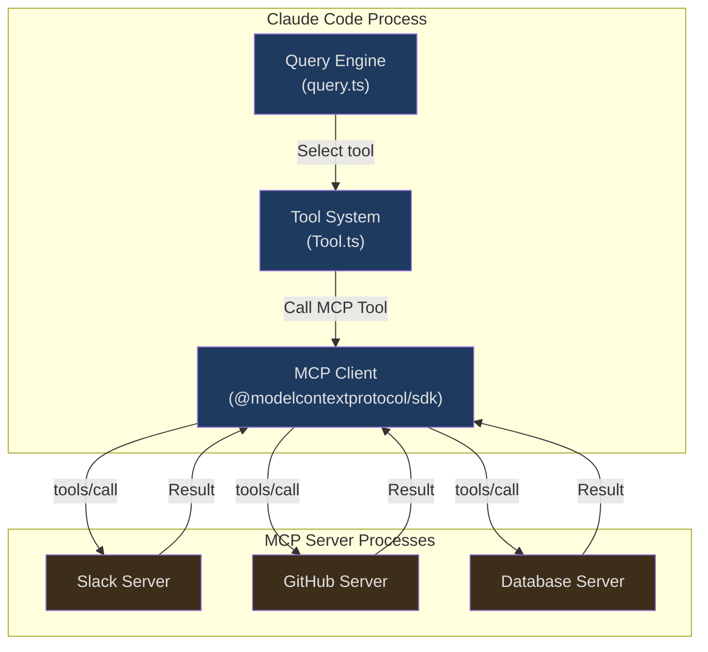
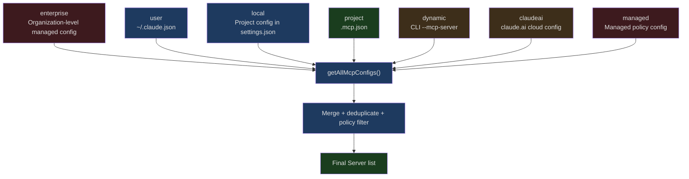
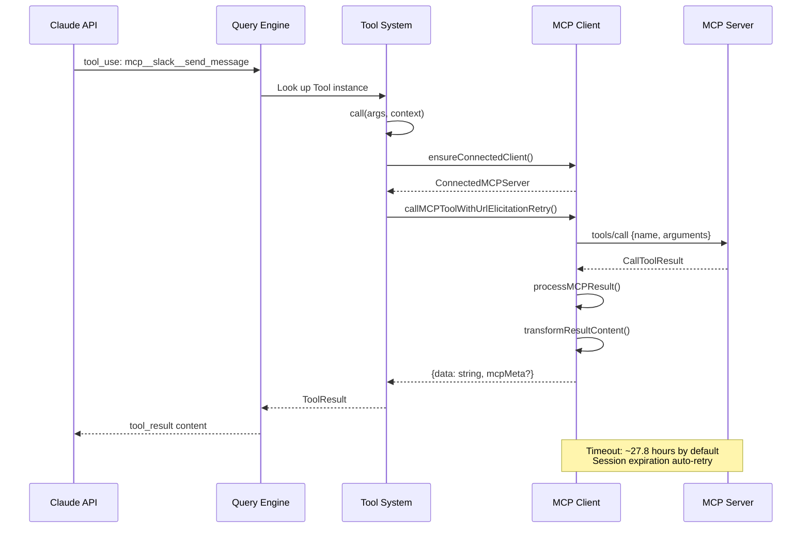

## The Problem

Claude Code can query databases, access APIs, and manipulate Figma — these capabilities aren't hardcoded but dynamically loaded through MCP.

When you configure a Slack Server in `.mcp.json`, Claude Code automatically connects to it, discovers all the tools it provides (search messages, send messages, list channels), then registers those tools as callable Tools for Claude, as if they were built-in. When you say "send a message in the #general channel," Claude chooses to call `mcp__slack__send_message`, serializes the arguments as JSON, sends them through a stdio pipe to the Slack Server process, waits for the response, and presents the result to you.

This mechanism is far more than simple RPC calls. It involves:

- A unified abstraction over multiple transport protocols (stdio, SSE, HTTP Streamable, WebSocket, SDK in-process)
- Connection pooling with memoize caching to avoid redundant handshakes
- Dynamic tool discovery: after a Server declares its capabilities, Claude Code automatically converts MCP Tools to the internal `Tool` interface
- JSON Schema pass-through: MCP tools bypass Zod parsing, passing `inputSchema` directly to the API as JSON Schema
- Integration of two auxiliary primitives: Resources and Prompts
- Handling of edge cases like OAuth authentication, URL Elicitation, and Session expiration reconnection
- MCP Server sharing and isolation between Agent subprocesses

This article starts with a protocol overview and progressively dives into Claude Code's MCP integration implementation.

## MCP Protocol Overview

The Model Context Protocol (MCP) is an open protocol proposed by Anthropic to standardize how AI models interact with external tools and data sources. Its core design philosophy is: **the model doesn't need to know implementation details of tools — it only needs the tool's name, description, and input Schema**.



MCP defines five core concepts:

| Concept | Role | Description |
|---------|------|-------------|
| **Client** | Consumer | The MCP client within the Claude Code process, responsible for connecting to Servers, discovering tools, and initiating calls |
| **Server** | Provider | An independent process or remote service that exposes tools/resources/prompts |
| **Tool** | Executable action | A function provided by a Server, with a name, description, and JSON Schema-defined input parameters |
| **Resource** | Context data | Read-only data provided by a Server (file contents, API responses, etc.) that can be injected into conversation context |
| **Prompt** | Preset template | A prompt template provided by a Server that users can invoke as a slash command |

### Transport Layer Diversity

The transport types supported by Claude Code go well beyond the basic specification. The full type list can be seen from the Schema definition in `types.ts`:

```typescript
// src/services/mcp/types.ts (line 23-26)
export const TransportSchema = lazySchema(() =>
  z.enum(['stdio', 'sse', 'sse-ide', 'http', 'ws', 'sdk']),
)
```

Each transport type corresponds to a different use case:

| Transport | Scenario | Characteristics |
|-----------|----------|-----------------|
| `stdio` | Local CLI tools | Spawns a subprocess, communicates via stdin/stdout |
| `sse` | Remote HTTP services | Server-Sent Events, supports OAuth |
| `http` | Streamable HTTP | New transport from MCP 2025-03-26 spec |
| `ws` | WebSocket | Bidirectional real-time communication |
| `sse-ide` | IDE extensions | Used internally by VS Code/JetBrains |
| `sdk` | In-process Server | Agent SDK scenarios, no subprocess needed |

The `sdk` type uses an elegant `InProcessTransport`:

```typescript
// src/services/mcp/InProcessTransport.ts (lines 11-49)
class InProcessTransport implements Transport {
  private peer: InProcessTransport | undefined
  private closed = false

  onclose?: () => void
  onerror?: (error: Error) => void
  onmessage?: (message: JSONRPCMessage) => void

  /** @internal */
  _setPeer(peer: InProcessTransport): void {
    this.peer = peer
  }

  async start(): Promise<void> {}

  async send(message: JSONRPCMessage): Promise<void> {
    if (this.closed) {
      throw new Error('Transport is closed')
    }
    // Async delivery to avoid stack depth issues from synchronous request/response
    queueMicrotask(() => {
      this.peer?.onmessage?.(message)
    })
  }

  async close(): Promise<void> {
    if (this.closed) {
      return
    }
    this.closed = true
    this.onclose?.()
    if (this.peer && !this.peer.closed) {
      this.peer.closed = true
      this.peer.onclose?.()
    }
  }
}
```

`createLinkedTransportPair()` creates a pair of interconnected Transports — one for the Client and one for the Server. `send()` uses `queueMicrotask` internally to deliver messages asynchronously, avoiding stack overflow from synchronous RPC calls — this is critical in high-frequency tool call scenarios.

## Server Configuration and Discovery

### Configuration Hierarchy

MCP Server configuration comes from multiple layers, each with a different scope:



The `ConfigScope` type for each configuration source is defined as:

```typescript
// src/services/mcp/types.ts (lines 10-20)
export const ConfigScopeSchema = lazySchema(() =>
  z.enum([
    'local',
    'user',
    'project',
    'dynamic',
    'enterprise',
    'claudeai',
    'managed',
  ]),
)
```

The `project` scope comes from the `.mcp.json` file at the project root — this is the most common configuration method. Since project configurations may contain malicious Servers, Claude Code introduces an approval mechanism:

```typescript
// src/services/mcp/utils.ts (lines 351-406)
export function getProjectMcpServerStatus(
  serverName: string,
): 'approved' | 'rejected' | 'pending' {
  const settings = getSettings_DEPRECATED()
  const normalizedName = normalizeNameForMCP(serverName)

  if (
    settings?.disabledMcpjsonServers?.some(
      name => normalizeNameForMCP(name) === normalizedName,
    )
  ) {
    return 'rejected'
  }

  if (
    settings?.enabledMcpjsonServers?.some(
      name => normalizeNameForMCP(name) === normalizedName,
    ) ||
    settings?.enableAllProjectMcpServers
  ) {
    return 'approved'
  }

  // Auto-approve in non-interactive mode when projectSettings are enabled
  if (
    getIsNonInteractiveSession() &&
    isSettingSourceEnabled('projectSettings')
  ) {
    return 'approved'
  }

  return 'pending'
}
```

Note the security boundary: auto-approval in `--dangerously-skip-permissions` mode only checks `hasSkipDangerousModePermissionPrompt()` — this function deliberately excludes projectSettings, preventing malicious repositories from self-approving bypass mode through project configuration.

### Name Normalization

The MCP protocol requires tool names to match `^[a-zA-Z0-9_-]{1,64}$`. Since Server names may contain spaces, dots, and other special characters (especially claude.ai Servers), normalization is needed:

```typescript
// src/services/mcp/normalization.ts (lines 17-23)
export function normalizeNameForMCP(name: string): string {
  let normalized = name.replace(/[^a-zA-Z0-9_-]/g, '_')
  if (name.startsWith(CLAUDEAI_SERVER_PREFIX)) {
    // claude.ai Servers additionally compress consecutive underscores to avoid conflict with the __ separator
    normalized = normalized.replace(/_+/g, '_').replace(/^_|_$/g, '')
  }
  return normalized
}
```

The fully qualified tool name format is `mcp__<serverName>__<toolName>`:

```typescript
// src/services/mcp/mcpStringUtils.ts (lines 50-52)
export function buildMcpToolName(serverName: string, toolName: string): string {
  return `${getMcpPrefix(serverName)}${normalizeNameForMCP(toolName)}`
}
```

This naming convention has a known limitation: if a Server name itself contains `__`, parsing will break. The code comments explicitly document this — in practice, this scenario is extremely rare.

## Server Lifecycle Management

### Connection Flow

`connectToServer` is the entry function for the entire MCP integration. It's wrapped with `memoize`, using `name + JSON(config)` as the cache key to ensure Servers with identical configurations aren't connected redundantly:

```typescript
// src/services/mcp/client.ts (lines 595-607)
export const connectToServer = memoize(
  async (
    name: string,
    serverRef: ScopedMcpServerConfig,
    serverStats?: {
      totalServers: number
      stdioCount: number
      sseCount: number
      httpCount: number
      sseIdeCount: number
      wsIdeCount: number
    },
  ): Promise<MCPServerConnection> => {
    // ...connection logic
  },
  getServerCacheKey,
)
```

The connection result is a union type that precisely expresses five possible states:

```typescript
// src/services/mcp/types.ts (lines 221-227)
export type MCPServerConnection =
  | ConnectedMCPServer    // Connected successfully, holds Client instance
  | FailedMCPServer       // Connection failed, retains error information
  | NeedsAuthMCPServer    // Needs OAuth authentication
  | PendingMCPServer      // Awaiting connection (with reconnection attempt count)
  | DisabledMCPServer     // Disabled by user/policy
```

`ConnectedMCPServer` holds the core state of a connection:

```typescript
// src/services/mcp/types.ts (lines 180-193)
export type ConnectedMCPServer = {
  client: Client                    // MCP SDK Client instance
  name: string
  type: 'connected'
  capabilities: ServerCapabilities  // Capabilities declared by the Server
  serverInfo?: {
    name: string
    version: string
  }
  instructions?: string            // Instructions from the Server (injected into system prompt)
  config: ScopedMcpServerConfig
  cleanup: () => Promise<void>      // Cleanup function
}
```

### Batch Connection Strategy

Claude Code doesn't connect to all Servers at once. It distinguishes between local Servers (stdio/sdk) and remote Servers, using different concurrency limits for each:

```typescript
// src/services/mcp/client.ts (lines 552-561)
export function getMcpServerConnectionBatchSize(): number {
  return parseInt(process.env.MCP_SERVER_CONNECTION_BATCH_SIZE || '', 10) || 3
}

function getRemoteMcpServerConnectionBatchSize(): number {
  return (
    parseInt(process.env.MCP_REMOTE_SERVER_CONNECTION_BATCH_SIZE || '', 10) ||
    20
  )
}
```

Local Servers default to concurrency of 3 (high process startup overhead), while remote Servers default to 20 (network connections only). In `getMcpToolsCommandsAndResources`, both groups are processed in parallel:

```typescript
// src/services/mcp/client.ts (lines 2391-2402)
await Promise.all([
  processBatched(
    localServers,
    getMcpServerConnectionBatchSize(),
    processServer,
  ),
  processBatched(
    remoteServers,
    getRemoteMcpServerConnectionBatchSize(),
    processServer,
  ),
])
```

### Cleanup and Reconnection

Each stdio Server connection registers a cleanup function to the global cleanup registry, ensuring all subprocesses are properly terminated when the process exits:

```typescript
// src/services/mcp/client.ts (lines 1572-1578)
// All transport types register cleanup — even network transports may need it
const cleanupUnregister = registerCleanup(cleanup)

// Create a wrapped cleanup function that includes deregistration
const wrappedCleanup = async () => {
  cleanupUnregister?.()
  await cleanup()
}
```

Cleanup is especially important for stdio Servers — it first sends SIGTERM, waits for the process to exit, and escalates to SIGKILL if it times out:

```typescript
// src/services/mcp/client.ts (lines 1520-1531)
logMCPDebug(
  name,
  'SIGTERM failed, sending SIGKILL to MCP server process',
)
try {
  process.kill(childPid, 'SIGKILL')
} catch (killError) {
  logMCPDebug(
    name,
    `Error sending SIGKILL: ${killError}`,
  )
}
```

When the cache is invalidated, `clearServerCache` clears all associated caches:

```typescript
// src/services/mcp/client.ts (lines 1648-1673)
export async function clearServerCache(
  name: string,
  serverRef: ScopedMcpServerConfig,
): Promise<void> {
  const key = getServerCacheKey(name, serverRef)

  try {
    const wrappedClient = await connectToServer(name, serverRef)
    if (wrappedClient.type === 'connected') {
      await wrappedClient.cleanup()
    }
  } catch {
    // Ignore — Server may have failed to connect
  }

  // Clear connection cache and all fetch caches to ensure reconnection gets fresh data
  connectToServer.cache.delete(key)
  fetchToolsForClient.cache.delete(name)
  fetchResourcesForClient.cache.delete(name)
  fetchCommandsForClient.cache.delete(name)
}
```

Note that four independent caches are cleared here — the connection cache and three data fetch caches. If only the connection cache were cleared while retaining the fetch caches, a reconnection would use stale tool lists.

### Session Expiration Reconnection

For HTTP Streamable transport, the MCP spec defines a Session expiration mechanism (HTTP 404 + JSON-RPC error code -32001). Claude Code has dedicated detection logic:

```typescript
// src/services/mcp/client.ts (lines 193-206)
export function isMcpSessionExpiredError(error: Error): boolean {
  const httpStatus =
    'code' in error ? (error as Error & { code?: number }).code : undefined
  if (httpStatus !== 404) {
    return false
  }
  // Check JSON-RPC error code to distinguish from generic 404
  return (
    error.message.includes('"code":-32001') ||
    error.message.includes('"code": -32001')
  )
}
```

When a Session expiration is encountered during a tool call, it automatically retries once:

```typescript
// src/services/mcp/client.ts (lines 1859-1922)
const MAX_SESSION_RETRIES = 1
for (let attempt = 0; ; attempt++) {
  try {
    const connectedClient = await ensureConnectedClient(client)
    const mcpResult = await callMCPToolWithUrlElicitationRetry({
      client: connectedClient,
      // ...
    })
    return { data: mcpResult.content, /* ... */ }
  } catch (error) {
    if (
      error instanceof McpSessionExpiredError &&
      attempt < MAX_SESSION_RETRIES
    ) {
      logMCPDebug(
        client.name,
        `Retrying tool '${tool.name}' after session recovery`,
      )
      continue
    }
    // ...error handling
  }
}
```

## Dynamic Tool Generation

This is the most critical part of the MCP integration: how MCP Server-declared tools are converted into Claude Code's internal `Tool` interface.

### The MCPTool Template

`MCPTool.ts` defines a "template" object containing the base behavior shared by all MCP tools:

```typescript
// src/tools/MCPTool/MCPTool.ts (lines 27-77)
export const MCPTool = buildTool({
  isMcp: true,
  // Overridden with real MCP tool name + params in mcpClient.ts
  isOpenWorld() {
    return false
  },
  name: 'mcp',                      // Overridden
  maxResultSizeChars: 100_000,
  async description() {
    return DESCRIPTION                // Overridden
  },
  async prompt() {
    return PROMPT                     // Overridden
  },
  get inputSchema(): InputSchema {
    return inputSchema()              // Generic z.object({}).passthrough()
  },
  async call() {
    return { data: '' }               // Overridden
  },
  async checkPermissions(): Promise<PermissionResult> {
    return {
      behavior: 'passthrough',
      message: 'MCPTool requires permission.',
    }
  },
  userFacingName: () => 'mcp',       // Overridden
  // ...render functions
} satisfies ToolDef<InputSchema, Output>)
```

Note the design pattern here: MCPTool uses `z.object({}).passthrough()` as its inputSchema — this is a Zod Schema that "accepts any object," because the actual Schema for MCP tools is passed through via `inputJSONSchema`.

### fetchToolsForClient: From Server to Tool

`fetchToolsForClient` is the core function for tool discovery. It calls the MCP protocol's `tools/list` method, then maps each MCP Tool to an internal `Tool` object:

```typescript
// src/services/mcp/client.ts (lines 1743-1813)
export const fetchToolsForClient = memoizeWithLRU(
  async (client: MCPServerConnection): Promise<Tool[]> => {
    if (client.type !== 'connected') return []

    const result = (await client.client.request(
      { method: 'tools/list' },
      ListToolsResultSchema,
    )) as ListToolsResult

    // Clean up Unicode control characters
    const toolsToProcess = recursivelySanitizeUnicode(result.tools)

    // Skip mcp__ prefix in SDK mode if configured
    const skipPrefix =
      client.config.type === 'sdk' &&
      isEnvTruthy(process.env.CLAUDE_AGENT_SDK_MCP_NO_PREFIX)

    return toolsToProcess.map((tool): Tool => {
      const fullyQualifiedName = buildMcpToolName(client.name, tool.name)
      return {
        ...MCPTool,                         // Spread the template
        name: skipPrefix ? tool.name : fullyQualifiedName,
        mcpInfo: { serverName: client.name, toolName: tool.name },
        isMcp: true,
        // Read search hints from _meta
        searchHint:
          typeof tool._meta?.['anthropic/searchHint'] === 'string'
            ? tool._meta['anthropic/searchHint']
                .replace(/\s+/g, ' ').trim() || undefined
            : undefined,
        alwaysLoad: tool._meta?.['anthropic/alwaysLoad'] === true,
        // Use the MCP tool's original description
        async description() {
          return tool.description ?? ''
        },
        // Truncate overly long descriptions (2048 character limit)
        async prompt() {
          const desc = tool.description ?? ''
          return desc.length > MAX_MCP_DESCRIPTION_LENGTH
            ? desc.slice(0, MAX_MCP_DESCRIPTION_LENGTH) + '... [truncated]'
            : desc
        },
        // Derive behavioral characteristics from annotations
        isConcurrencySafe() {
          return tool.annotations?.readOnlyHint ?? false
        },
        isReadOnly() {
          return tool.annotations?.readOnlyHint ?? false
        },
        isDestructive() {
          return tool.annotations?.destructiveHint ?? false
        },
        isOpenWorld() {
          return tool.annotations?.openWorldHint ?? false
        },
        // Pass JSON Schema directly, no Zod conversion
        inputJSONSchema: tool.inputSchema as Tool['inputJSONSchema'],
        // ...call implementation, checkPermissions, etc.
      }
    }).filter(isIncludedMcpTool)
  },
  { maxSize: MCP_FETCH_CACHE_SIZE, getCacheKey: client => client.name },
)
```

This code reveals several key design decisions:

**1. Object spread override pattern**: `{ ...MCPTool, ...overrides }` uses the template object as a base, overriding field by field. This is more flexible than inheritance and better aligned with TypeScript's structural type system.

**2. MCP Annotations mapping**: The MCP 2025-03-26 spec introduced Tool Annotations (`readOnlyHint`, `destructiveHint`, `openWorldHint`), which Claude Code directly maps to corresponding methods on the internal Tool interface.

**3. Description length limit**: `MAX_MCP_DESCRIPTION_LENGTH = 2048`. Some OpenAPI auto-generated MCP Servers produce tool descriptions of 15-60KB; without limits, this would waste enormous amounts of tokens.

**4. IDE tool filtering**: The `isIncludedMcpTool` function filters out non-whitelisted IDE tools, only allowing `executeCode` and `getDiagnostics`.

### Tool Call Chain

When the model decides to call an MCP tool, the call chain proceeds as follows:



The retry logic within the `call` method operates at two levels:

1. **Session expiration retry**: Up to 1 attempt, clears the connection cache and re-obtains the Client
2. **URL Elicitation retry**: Up to 3 attempts, handles MCP -32042 error code (Server requests user to open a URL for authorization)

## JSON Schema vs Zod: Dual-Track Parameter Validation

This is an interesting design divergence in Claude Code's tool system. Built-in tools use Zod Schema, while MCP tools use JSON Schema — two systems running in parallel.

### The Zod Path for Built-in Tools

Built-in tools (like Read, Write, Bash) define `inputSchema` as a Zod Schema:

```typescript
// Typical built-in tool inputSchema
const inputSchema = z.object({
  file_path: z.string().describe('Absolute path to the file'),
  offset: z.number().optional().describe('Line offset'),
  limit: z.number().optional().describe('Number of lines'),
})
```

Zod Schemas are automatically converted to JSON Schema before being sent to the API.

### JSON Schema Pass-Through for MCP Tools

MCP tools bypass the Zod layer entirely. The `Tool` interface specifically defines an `inputJSONSchema` field:

```typescript
// src/Tool.ts (lines 15-21)
export type ToolInputJSONSchema = {
  [x: string]: unknown
  type: 'object'
  properties?: {
    [x: string]: unknown
  }
}
```

```typescript
// src/Tool.ts (lines 396-397)
// MCP tools can specify their input Schema directly in JSON Schema format,
// rather than converting from a Zod Schema
readonly inputJSONSchema?: ToolInputJSONSchema
```

In `fetchToolsForClient`, the MCP tool's `inputSchema` (JSON Schema from the Server) is directly assigned to `inputJSONSchema`:

```typescript
// src/services/mcp/client.ts (line 1813)
inputJSONSchema: tool.inputSchema as Tool['inputJSONSchema'],
```

Why not convert JSON Schema to Zod? Three reasons:

1. **Performance**: Runtime conversion from JSON Schema to Zod has overhead, and MCP Servers may provide complex nested Schemas
2. **Fidelity**: Certain JSON Schema features (`patternProperties`, `additionalProperties`, `oneOf` combinations) have no direct Zod equivalents
3. **Unnecessary**: The Claude API itself accepts JSON Schema, so no intermediate conversion is needed

This is why MCPTool's `inputSchema` is a permissive `z.object({}).passthrough()` — it performs no actual validation at runtime, and the real Schema is passed through to the API via `inputJSONSchema`.

## Resource and Prompt Integration

### Resource: Context Data Injection

MCP Resources allow Servers to expose read-only data. Claude Code provides two built-in tools for this:

- `ListMcpResourcesTool`: Lists all Resources provided by MCP Servers
- `ReadMcpResourceTool`: Reads the content of a specific Resource

The Resource type definition extends the MCP SDK type with Server attribution:

```typescript
// src/services/mcp/types.ts (line 229)
export type ServerResource = Resource & { server: string }
```

In `getMcpToolsCommandsAndResources`, Resource tools are only added when a Server has declared the `resources` capability, and they're added only once globally:

```typescript
// src/services/mcp/client.ts (lines 2360-2364)
const resourceTools: Tool[] = []
if (supportsResources && !resourceToolsAdded) {
  resourceToolsAdded = true
  resourceTools.push(ListMcpResourcesTool, ReadMcpResourceTool)
}
```

The `resourceToolsAdded` flag ensures that even if 10 Servers all declare the Resource capability, the List and Read tools are only registered once — they can access Resources from all Servers.

Resource fetching also uses LRU caching and concurrent processing. `prefetchAllMcpResources` prefetches tools, commands, and Resources from all Servers at startup, avoiding delays during the first conversation.

### Prompt: Preset Command Templates

MCP Prompts are converted to Claude Code `Commands` (slash commands). When a Server declares the `prompts` capability, `fetchCommandsForClient` calls `prompts/list` to get the list:

```typescript
// Prompt command naming follows the mcp__<server>__<prompt> format
// Consistent with Tool naming, using double underscore separation
```

The distinction between Prompts and Skills is subtle: MCP Prompts set `isMcp: true`, while MCP Skills (discovered from `skill://` Resources) set `loadedFrom: 'mcp'`. This distinction affects capability display in the `/mcp` menu:

```typescript
// src/services/mcp/utils.ts (lines 85-94)
export function filterMcpPromptsByServer(
  commands: Command[],
  serverName: string,
): Command[] {
  return commands.filter(
    c =>
      commandBelongsToServer(c, serverName) &&
      !(c.type === 'prompt' && c.loadedFrom === 'mcp'),
  )
}
```

## Inter-Agent MCP Server Sharing and Isolation

Claude Code's multi-Agent architecture (main thread + sub-Agents) introduces the question of MCP Server sharing.

### Sharing Mechanism

After the main thread connects to MCP Servers, sub-Agents inherit the parent process's connections through `ToolUseContext.options.mcpClients`:

```typescript
// src/Tool.ts (line 167)
mcpClients: MCPServerConnection[]
```

Sub-Agents don't need to reconnect to MCP Servers — they share the connections already established by the parent process. This is because `connectToServer`'s memoize cache is shared globally within the process.

### Isolation Mechanism

However, Server configuration changes don't automatically propagate. `excludeStalePluginClients` is responsible for detecting stale connections:

```typescript
// src/services/mcp/utils.ts (lines 185-224)
export function excludeStalePluginClients(
  mcp: {
    clients: MCPServerConnection[]
    tools: Tool[]
    commands: Command[]
    resources: Record<string, ServerResource[]>
  },
  configs: Record<string, ScopedMcpServerConfig>,
): {
  clients: MCPServerConnection[]
  tools: Tool[]
  commands: Command[]
  resources: Record<string, ServerResource[]>
  stale: MCPServerConnection[]
} {
  const stale = mcp.clients.filter(c => {
    const fresh = configs[c.name]
    if (!fresh) return c.config.scope === 'dynamic'
    return hashMcpConfig(c.config) !== hashMcpConfig(fresh)
  })
  // ...remove stale tools/commands/resources
}
```

Staleness detection uses SHA-256 hash comparison of configurations, excluding the `scope` field (since scope is metadata that doesn't affect connection parameters).

### Change Notifications

The MCP protocol supports Server-side push change notifications. `useManageMCPConnections` listens for three notification types:

```typescript
// Notification subscriptions from useManageMCPConnections.ts
ToolListChangedNotificationSchema    // Tool list changed
ResourceListChangedNotificationSchema // Resource list changed
PromptListChangedNotificationSchema   // Prompt list changed
```

Upon receiving a notification, Claude Code clears the corresponding fetch cache and re-fetches data. This allows Servers to dynamically add/remove tools at runtime — for example, a database Server might update available query tools after the user switches database connections.

### Reconnection with Exponential Backoff

Disconnection reconnection uses an exponential backoff strategy:

```typescript
// src/services/mcp/useManageMCPConnections.ts (lines 87-89)
const MAX_RECONNECT_ATTEMPTS = 5
const INITIAL_BACKOFF_MS = 1000
const MAX_BACKOFF_MS = 30000
```

The interval between each reconnection attempt doubles, up to a 30-second cap, with a maximum of 5 attempts.

## OAuth and Elicitation

### Authentication Cache

For remote Servers requiring OAuth (SSE, HTTP), Claude Code maintains an authentication cache to avoid repeated probing:

```typescript
// src/services/mcp/client.ts (lines 257-278)
const MCP_AUTH_CACHE_TTL_MS = 15 * 60 * 1000 // 15 minutes

type McpAuthCacheData = Record<string, { timestamp: number }>

// Use memoize to ensure concurrent isMcpAuthCached() calls share the same file read
let authCachePromise: Promise<McpAuthCacheData> | null = null

function getMcpAuthCache(): Promise<McpAuthCacheData> {
  if (!authCachePromise) {
    authCachePromise = readFile(getMcpAuthCachePath(), 'utf-8')
      .then(data => jsonParse(data) as McpAuthCacheData)
      .catch(() => ({}))
  }
  return authCachePromise
}
```

Cache writes are serialized through a promise chain, preventing concurrent read-modify-write race conditions:

```typescript
// src/services/mcp/client.ts (lines 291-309)
let writeChain = Promise.resolve()

function setMcpAuthCacheEntry(serverId: string): void {
  writeChain = writeChain
    .then(async () => {
      const cache = await getMcpAuthCache()
      cache[serverId] = { timestamp: Date.now() }
      // ...write to file
      // Invalidate read cache after write
      authCachePromise = null
    })
    .catch(() => {
      // Best effort
    })
}
```

### URL Elicitation

The MCP spec's `-32042` error code indicates the Server needs the user to open a URL to complete authorization. Claude Code has a complete handling flow for this:

```typescript
// src/services/mcp/client.ts (lines 2850-2860)
const MAX_URL_ELICITATION_RETRIES = 3
for (let attempt = 0; ; attempt++) {
  try {
    return await callToolFn({
      client: connectedClient,
      tool, args, meta, signal, onProgress,
    })
  } catch (error) {
    if (
      !(error instanceof McpError) ||
      error.code !== ErrorCode.UrlElicitationRequired
    ) {
      throw error
    }
    // ...handle Elicitation
  }
}
```

Elicitation handling operates at three layers:
1. **Hooks first**: `runElicitationHooks` allows custom logic to handle it automatically
2. **SDK/Print mode**: Delegates to structured IO via the `handleElicitation` callback
3. **REPL mode**: Displays a UI dialog through the AppState queue

## Large Result Handling

MCP tools may return large amounts of data. `processMCPResult` implements a tiered handling strategy:

```typescript
// src/services/mcp/client.ts (lines 2720-2799)
export async function processMCPResult(
  result: unknown,
  tool: string,
  name: string,
): Promise<MCPToolResult> {
  const { content, type, schema } = await transformMCPResult(result, tool, name)

  // IDE tools aren't sent to the model, skip size checks
  if (name === 'ide') {
    return content
  }

  // Check if truncation is needed
  if (!(await mcpContentNeedsTruncation(content))) {
    return content
  }

  // When images are present, fall back to truncation (maintain image compression and viewability)
  if (contentContainsImages(content)) {
    return await truncateMcpContentIfNeeded(content)
  }

  // Large text results: persist to file, return path and read instructions
  const persistId = `mcp-${normalizeNameForMCP(name)}-${normalizeNameForMCP(tool)}-${timestamp}`
  const persistResult = await persistToolResult(contentStr, persistId)
  // ...return read instructions
}
```

Handling strategy priority:
1. Small results: Return directly
2. Large image results: Truncate (maintain viewability)
3. Large text results: Persist to file, return Read instructions for the model to fetch on demand
4. Persistence failure: Fall back to truncation

The `inferCompactSchema` function generates a compact Schema description for structured content, helping the model understand the output format:

```typescript
// src/services/mcp/client.ts (lines 2644-2659)
export function inferCompactSchema(value: unknown, depth = 2): string {
  // Infer a brief structural description of the value
  // e.g.: {name: string, items: [{id: number, ...}]}
}
```

## Claude.ai Proxy Connections

Claude Code can access MCP Servers configured on claude.ai, using a special `claudeai-proxy` transport type. Proxy connections need to handle OAuth token refresh:

```typescript
// src/services/mcp/client.ts (lines 372-422)
export function createClaudeAiProxyFetch(innerFetch: FetchLike): FetchLike {
  return async (url, init) => {
    const doRequest = async () => {
      await checkAndRefreshOAuthTokenIfNeeded()
      const currentTokens = getClaudeAIOAuthTokens()
      if (!currentTokens) {
        throw new Error('No claude.ai OAuth token available')
      }
      const headers = new Headers(init?.headers)
      headers.set('Authorization', `Bearer ${currentTokens.accessToken}`)
      const response = await innerFetch(url, { ...init, headers })
      // Return the token used when sending, not the current token
      return { response, sentToken: currentTokens.accessToken }
    }

    const { response, sentToken } = await doRequest()
    if (response.status !== 401) {
      return response
    }
    // On 401, try refreshing the token and retry once
    const tokenChanged = await handleOAuth401Error(sentToken).catch(() => false)
    if (!tokenChanged) {
      return response
    }
    try {
      return (await doRequest()).response
    } catch {
      return response
    }
  }
}
```

Note the use of `sentToken` — the code deliberately records the token used when sending the request, rather than re-reading the current token after the 401 response. This is because a concurrent connector may have already refreshed the token via `handleOAuth401Error` in the meantime; re-reading would get the new token, which when passed to `handleOAuth401Error` would be judged as "token unchanged" and skip the refresh.

## Timeouts and Request Wrapping

### Tool Call Timeout

The default timeout for MCP tool calls is approximately 27.8 hours (effectively "infinite"):

```typescript
// src/services/mcp/client.ts (line 211)
const DEFAULT_MCP_TOOL_TIMEOUT_MS = 100_000_000
```

This seemingly outrageous value is intentional — some MCP tools (like database migrations, large-scale analyses) genuinely need long execution times. Users can customize this via the `MCP_TOOL_TIMEOUT` environment variable.

### Per-Request Timeout Wrapping

Unlike the tool timeout, each HTTP request has a 60-second timeout. `wrapFetchWithTimeout` creates an independent AbortController for each request:

```typescript
// src/services/mcp/client.ts (lines 492-549)
export function wrapFetchWithTimeout(baseFetch: FetchLike): FetchLike {
  return async (url: string | URL, init?: RequestInit) => {
    const method = (init?.method ?? 'GET').toUpperCase()

    // GET requests skip timeout — MCP GETs are long-lived SSE streams
    if (method === 'GET') {
      return baseFetch(url, init)
    }

    // Use setTimeout instead of AbortSignal.timeout()
    // because in Bun, AbortSignal.timeout's internal timer
    // isn't released until GC, leaking ~2.4KB of native memory per request
    const controller = new AbortController()
    const timer = setTimeout(
      c => c.abort(new DOMException('The operation timed out.', 'TimeoutError')),
      MCP_REQUEST_TIMEOUT_MS,
      controller,
    )
    timer.unref?.()

    // Link parent signal
    const parentSignal = init?.signal
    const abort = () => controller.abort(parentSignal?.reason)
    parentSignal?.addEventListener('abort', abort)
    // ...
  }
}
```

A code comment reveals an interesting Bun runtime detail: internal timers created by `AbortSignal.timeout()` are only released during GC, causing each request to leak approximately 2.4KB of native memory. Hence the switch to manually managing lifecycle with `setTimeout` + `clearTimeout`.

## Serialized State and CLI Integration

MCP state can be serialized to JSON for the `/mcp` command and CLI state exports:

```typescript
// src/services/mcp/types.ts (lines 232-258)
export interface SerializedTool {
  name: string
  description: string
  inputJSONSchema?: {
    [x: string]: unknown
    type: 'object'
    properties?: { [x: string]: unknown }
  }
  isMcp?: boolean
  originalToolName?: string  // Original unnormalized tool name
}

export interface MCPCliState {
  clients: SerializedClient[]
  configs: Record<string, ScopedMcpServerConfig>
  tools: SerializedTool[]
  resources: Record<string, ServerResource[]>
  normalizedNames?: Record<string, string>  // Mapping from normalized names to original names
}
```

The `normalizedNames` mapping solves a practical problem: users reference original names in permission rules, but the system internally uses normalized names. This mapping ensures permission checks can correctly associate the two.

## Portable Patterns and Best Practices

### Configuration Organization Recommendations

Based on Claude Code's configuration hierarchy design, the following organization is recommended:

| Scenario | Recommended Config Location | Reason |
|----------|---------------------------|--------|
| Team-shared project tools | `.mcp.json` (project scope) | Version-controlled with code, new members get it automatically |
| Personal preference tools | `~/.claude.json` (user scope) | Available across projects |
| CI/CD environments | `--mcp-server` argument (dynamic scope) | Temporary injection without modifying config files |
| Enterprise compliance tools | managed config (enterprise scope) | Organization-wide management, users cannot modify |

### Tool Design Principles

From Claude Code's MCP integration code, several MCP Server tool design principles can be distilled:

1. **Use annotations**: Declare `readOnlyHint` to enable concurrent tool execution; declare `destructiveHint` to trigger additional confirmation
2. **Control description length**: Descriptions over 2048 characters will be truncated — put core usage information first
3. **Support pagination**: Large results will be truncated or persisted to files — provide pagination parameters so the model can fetch on demand
4. **Use searchHint**: Help ToolSearch find lazily-loaded tools via `_meta['anthropic/searchHint']`
5. **Use alwaysLoad**: For critical tools the model must see in the first turn, set `_meta['anthropic/alwaysLoad']` to skip ToolSearch

### Security Boundaries

The MCP integration's security model deserves special attention:

- **Project Server approval**: Servers in `.mcp.json` require explicit user approval (unless in non-interactive mode with projectSettings enabled)
- **Permission isolation**: MCP tools use `passthrough` permission mode, meaning each call is checked against global permission rules
- **Namespace isolation**: The `mcp__` prefix ensures MCP tools don't conflict with built-in tools (can be optionally disabled in SDK mode)
- **Description truncation**: Prevents malicious Servers from injecting prompts via overly long descriptions
- **Unicode sanitization**: `recursivelySanitizeUnicode` removes control characters that could interfere with model behavior

## Architecture Summary

Claude Code's MCP integration is a carefully designed extensible architecture. It cleanly separates "connection management" from "tool adaptation": `client.ts` handles establishing and maintaining connections to MCP Servers, `MCPTool.ts` provides the tool template, and `fetchToolsForClient` bridges the two — from a Server's raw capability declarations to Tool objects callable by Claude, passing through name normalization, description truncation, Schema pass-through, permission configuration, and a series of other transformations.

Core principles of the overall design:

1. **Lazy discovery**: Only connect to Servers and fetch tool lists when needed, using memoize caching to avoid redundant operations
2. **Graceful degradation**: Connection failures don't block the entire system — only that Server's tools become unavailable; Servers requiring authentication register an `McpAuthTool` to guide users through authentication
3. **Dual-track Schema**: Built-in tools use Zod for type safety and validation, while MCP tools use JSON Schema pass-through for flexibility and efficiency
4. **Defensive design**: From Unicode sanitization to description truncation, from configuration hash comparison to authentication cache serialization, edge case considerations are evident throughout

For projects looking to build similar extension systems, the MCP integration provides a referenceable pattern: use template objects + object spread for dynamic tool registration, memoize caching for connection lifecycle management, union types for precise connection state expression, and configuration hierarchies for flexible scope management.
