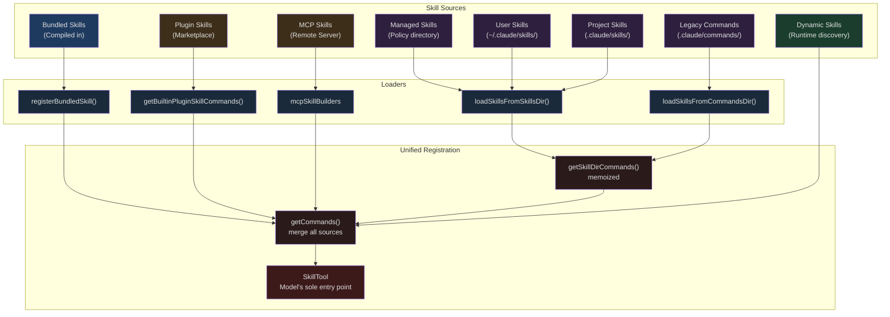
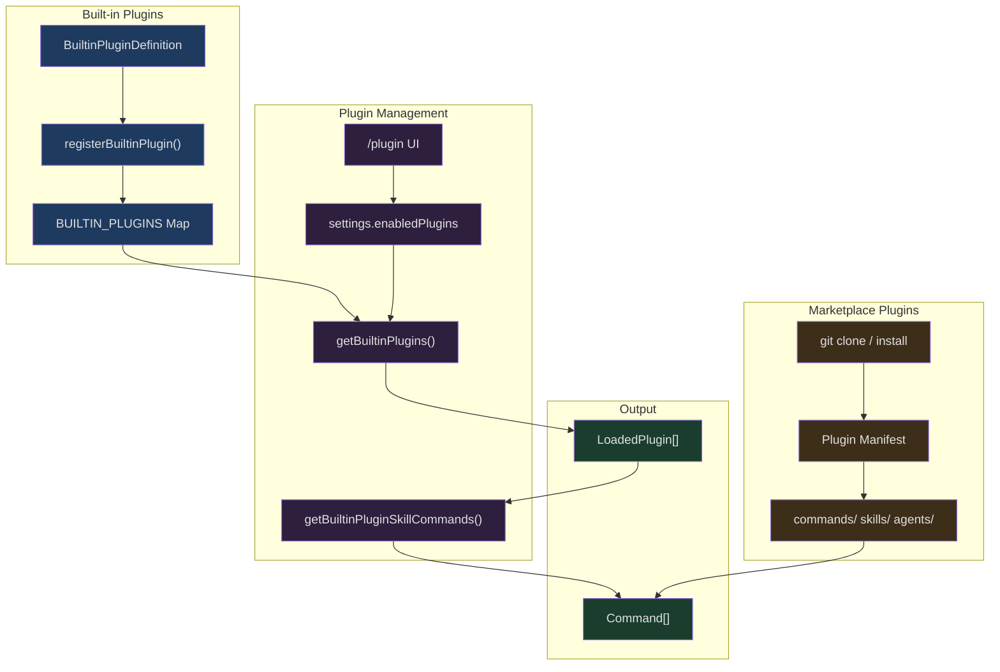

## The Problem

When you type `/simplify` in Claude Code, it automatically performs a three-dimensional review of your recently modified code — code reuse, quality, and efficiency. When you install a Plugin, its Skills automatically appear in the available list. When an MCP Server exposes Prompts with specific frontmatter markers, those Prompts are also transformed into Skills for the model to invoke.

Behind all this is a three-layer extensibility architecture:

- **Skill layer**: Skill definitions carried in Markdown files, with metadata declared via frontmatter, supporting multi-source loading, argument substitution, and conditional activation
- **Plugin layer**: Bundles multiple Skills, Hooks, and MCP Servers into installable extension units, split into Built-in and Marketplace tiers
- **MCP layer**: Dynamically discovers and loads Skills from remote Servers via the MCP protocol

Each layer has its own independent registration mechanism, but they all ultimately converge into a single `Command[]` array, with `SkillTool` serving as the sole entry point to expose them to the model. This article starts from Skill system file loading and progressively dives into the design and implementation of this extensibility architecture.

## Skill System Overview

### Core Data Structure: Command

All Skills are ultimately represented as the `Command` type. Understanding this type is foundational to understanding the entire system:

```typescript
// src/types/command.ts (L25-55)
export type PromptCommand = {
  type: 'prompt'
  progressMessage: string
  contentLength: number
  argNames?: string[]
  allowedTools?: string[]
  model?: string
  source: SettingSource | 'builtin' | 'mcp' | 'plugin' | 'bundled'
  pluginInfo?: {
    pluginManifest: PluginManifest
    repository: string
  }
  hooks?: HooksSettings
  skillRoot?: string
  context?: 'inline' | 'fork'
  agent?: string
  effort?: EffortValue
  paths?: string[]
  getPromptForCommand(
    args: string,
    context: ToolUseContext,
  ): Promise<ContentBlockParam[]>
}

export type Command = CommandBase &
  (PromptCommand | LocalCommand | LocalJSXCommand)
```

The `source` field marks where the Skill comes from — `'bundled'` indicates a skill compiled into the CLI binary, `'plugin'` comes from a Plugin, `'mcp'` from an MCP Server, and `SettingSource` values (`'userSettings'`, `'projectSettings'`, `'policySettings'`) correspond to file Skills loaded from different directories.

`getPromptForCommand` is the core method: it accepts user arguments and tool context, returning prompt content to inject into the conversation. Skills from different sources implement their own argument substitution, shell command execution, and security policies within this method.

### Multi-Source Loading Architecture



Loading priority follows this order, with the first-loaded Skill winning when names collide.

### File Skill Loading: loadSkillsDir.ts

The core loading logic for file Skills lives in `loadSkillsDir.ts`. This file exceeds 1000 lines and is the most complex module in the entire Skill system.

#### Directory Structure Convention

The Skills directory only supports the **directory format**: each Skill is a directory containing a `SKILL.md` file.

```
.claude/skills/
├── review-code/
│   └── SKILL.md          # Skill definition
├── deploy/
│   ├── SKILL.md          # Skill definition
│   └── scripts/
│       └── deploy.sh     # Supporting files
└── frontend:lint/        # Namespace -> "frontend:lint"
    └── SKILL.md
```

The loading function `loadSkillsFromSkillsDir` traverses the directory, reading each `SKILL.md`:

```typescript
// src/skills/loadSkillsDir.ts (L407-480)
async function loadSkillsFromSkillsDir(
  basePath: string,
  source: SettingSource,
): Promise<SkillWithPath[]> {
  const fs = getFsImplementation()

  let entries
  try {
    entries = await fs.readdir(basePath)
  } catch (e: unknown) {
    if (!isFsInaccessible(e)) logError(e)
    return []
  }

  const results = await Promise.all(
    entries.map(async (entry): Promise<SkillWithPath | null> => {
      try {
        // Only directory format supported: skill-name/SKILL.md
        if (!entry.isDirectory() && !entry.isSymbolicLink()) {
          return null
        }

        const skillDirPath = join(basePath, entry.name)
        const skillFilePath = join(skillDirPath, 'SKILL.md')

        let content: string
        try {
          content = await fs.readFile(skillFilePath, { encoding: 'utf-8' })
        } catch (e: unknown) {
          if (!isENOENT(e)) {
            logForDebugging(
              `[skills] failed to read ${skillFilePath}: ${e}`,
              { level: 'warn' },
            )
          }
          return null
        }

        const { frontmatter, content: markdownContent } = parseFrontmatter(
          content, skillFilePath,
        )

        const skillName = entry.name
        const parsed = parseSkillFrontmatterFields(
          frontmatter, markdownContent, skillName,
        )
        const paths = parseSkillPaths(frontmatter)

        return {
          skill: createSkillCommand({
            ...parsed,
            skillName,
            markdownContent,
            source,
            baseDir: skillDirPath,
            loadedFrom: 'skills',
            paths,
          }),
          filePath: skillFilePath,
        }
      } catch (error) {
        logError(error)
        return null
      }
    }),
  )

  return results.filter((r): r is SkillWithPath => r !== null)
}
```

Note several design points:

1. **Directory format only**. Single `.md` files in the `/skills/` directory are ignored, ensuring each Skill can carry supporting files (scripts, templates, etc.).
2. **Symbolic link support**. The `isSymbolicLink()` check enables Skills to be shared via symlinks.
3. **Parallel loading**. `Promise.all` reads all Skill files concurrently.
4. **Graceful degradation**. A loading failure for one Skill doesn't affect the others.

#### Frontmatter Metadata Parsing

The SKILL.md file's frontmatter is the complete declaration of a Skill's behavior. The `parseSkillFrontmatterFields` function handles all possible fields:

```typescript
// src/skills/loadSkillsDir.ts (L185-265)
export function parseSkillFrontmatterFields(
  frontmatter: FrontmatterData,
  markdownContent: string,
  resolvedName: string,
  descriptionFallbackLabel: 'Skill' | 'Custom command' = 'Skill',
): {
  displayName: string | undefined
  description: string
  hasUserSpecifiedDescription: boolean
  allowedTools: string[]
  argumentHint: string | undefined
  argumentNames: string[]
  whenToUse: string | undefined
  version: string | undefined
  model: ReturnType<typeof parseUserSpecifiedModel> | undefined
  disableModelInvocation: boolean
  userInvocable: boolean
  hooks: HooksSettings | undefined
  executionContext: 'fork' | undefined
  agent: string | undefined
  effort: EffortValue | undefined
  shell: FrontmatterShell | undefined
} {
  // ...parsing logic
}
```

A complete SKILL.md frontmatter example:

```markdown
---
name: "Code Review Assistant"
description: "Perform multi-dimensional code review on Git changes"
when_to_use: "Trigger when user asks to review code or submit a PR"
allowed-tools:
  - Bash(git:*)
  - Read
  - Grep
arguments:
  - branch
  - focus_area
argument-hint: "<branch> [focus_area]"
model: sonnet
effort: high
context: fork
agent: general-purpose
user-invocable: true
disable-model-invocation: false
paths:
  - "src/**"
  - "lib/**"
hooks:
  PreToolUse:
    - matcher: Bash
      hooks:
        - type: command
          command: echo "Reviewing..."
shell:
  type: bash
  command: /bin/bash
---

## Review Process

Review the changes on the $ARGUMENTS branch across the following dimensions...

Current Session ID: ${CLAUDE_SESSION_ID}
Skill directory: ${CLAUDE_SKILL_DIR}
```

The semantics of these frontmatter fields are worth explaining one by one:

| Field | Type | Purpose |
|-------|------|---------|
| `name` | string | Display name (doesn't affect command name) |
| `description` | string | Brief description, used in Skill listings |
| `when_to_use` | string | Tells the model when it should invoke this Skill |
| `allowed-tools` | string[] | Additional tools allowed during Skill execution |
| `arguments` | string/string[] | Named argument list |
| `model` | string | Model override (e.g., `sonnet`, `opus`, `inherit`) |
| `effort` | EffortValue | Reasoning effort level |
| `context` | 'fork' | Whether to execute in a sub-Agent |
| `paths` | string[] | File path patterns for conditional activation |
| `hooks` | HooksSettings | Skill-level Hook configuration |
| `user-invocable` | boolean | Whether users can invoke via `/name` |
| `disable-model-invocation` | boolean | Prevent model from proactively invoking |

### Argument Substitution Mechanism

Skill prompt content supports multiple argument substitution patterns:

```typescript
// src/skills/loadSkillsDir.ts (L344-369)
async getPromptForCommand(args, toolUseContext) {
  let finalContent = baseDir
    ? `Base directory for this skill: ${baseDir}\n\n${markdownContent}`
    : markdownContent

  // 1. User argument substitution: $ARGUMENTS, $1, $2, or named arguments
  finalContent = substituteArguments(
    finalContent, args, true, argumentNames,
  )

  // 2. Built-in variable substitution
  if (baseDir) {
    const skillDir =
      process.platform === 'win32' ? baseDir.replace(/\\/g, '/') : baseDir
    finalContent = finalContent.replace(/\$\{CLAUDE_SKILL_DIR\}/g, skillDir)
  }

  finalContent = finalContent.replace(
    /\$\{CLAUDE_SESSION_ID\}/g,
    getSessionId(),
  )

  // 3. Shell command execution (non-MCP Skills only)
  if (loadedFrom !== 'mcp') {
    finalContent = await executeShellCommandsInPrompt(
      finalContent, toolUseContext, `/${skillName}`, shell,
    )
  }

  return [{ type: 'text', text: finalContent }]
}
```

There are three layers of substitution:

1. **User arguments**: `$ARGUMENTS` is replaced with the full argument string, `$1`/`$2` with positional arguments, and named arguments like `${branch}` with their corresponding values.
2. **Built-in variables**: `${CLAUDE_SKILL_DIR}` points to the Skill's directory, and `${CLAUDE_SESSION_ID}` is the current session ID.
3. **Shell commands**: The `` !`command` `` and ` ```! command ``` ` syntax within Skill content is actually executed, with output substituted into the prompt. This is a key capability for Skills to interact with the environment — but for security reasons, MCP-sourced Skills are prohibited from executing shell commands.

### Multi-Level Source Aggregation and Deduplication

`getSkillDirCommands` is the aggregation entry point for file Skills. It uses `memoize` to cache results and loads Skills from five sources in parallel:

```typescript
// src/skills/loadSkillsDir.ts (L638-714)
export const getSkillDirCommands = memoize(
  async (cwd: string): Promise<Command[]> => {
    const userSkillsDir = join(getClaudeConfigHomeDir(), 'skills')
    const managedSkillsDir = join(getManagedFilePath(), '.claude', 'skills')
    const projectSkillsDirs = getProjectDirsUpToHome('skills', cwd)

    const [
      managedSkills,
      userSkills,
      projectSkillsNested,
      additionalSkillsNested,
      legacyCommands,
    ] = await Promise.all([
      loadSkillsFromSkillsDir(managedSkillsDir, 'policySettings'),
      loadSkillsFromSkillsDir(userSkillsDir, 'userSettings'),
      Promise.all(
        projectSkillsDirs.map(dir =>
          loadSkillsFromSkillsDir(dir, 'projectSettings'),
        ),
      ),
      Promise.all(
        additionalDirs.map(dir =>
          loadSkillsFromSkillsDir(
            join(dir, '.claude', 'skills'), 'projectSettings',
          ),
        ),
      ),
      loadSkillsFromCommandsDir(cwd),
    ])

    // Merge all sources
    const allSkillsWithPaths = [
      ...managedSkills,
      ...userSkills,
      ...projectSkillsNested.flat(),
      ...additionalSkillsNested.flat(),
      ...legacyCommands,
    ]

    // ... deduplication and conditional Skill separation
  },
)
```

Note the source priority order: Managed (enterprise policy) > User (user global) > Project (project-level) > Additional (`--add-dir`) > Legacy (old `/commands/`).

#### Realpath-Based Deduplication

Multiple sources may point to the same file through different paths (e.g., via symlink). The system uses `realpath` to resolve to canonical paths for deduplication:

```typescript
// src/skills/loadSkillsDir.ts (L118-124)
async function getFileIdentity(filePath: string): Promise<string | null> {
  try {
    return await realpath(filePath)
  } catch {
    return null
  }
}
```

The deduplication process first computes identities for all files in parallel, then synchronously scans to remove duplicates:

```typescript
// src/skills/loadSkillsDir.ts (L728-763)
const fileIds = await Promise.all(
  allSkillsWithPaths.map(({ skill, filePath }) =>
    skill.type === 'prompt'
      ? getFileIdentity(filePath)
      : Promise.resolve(null),
  ),
)

const seenFileIds = new Map<string, SettingSource | ...>()
const deduplicatedSkills: Command[] = []

for (let i = 0; i < allSkillsWithPaths.length; i++) {
  const entry = allSkillsWithPaths[i]
  if (entry === undefined || entry.skill.type !== 'prompt') continue
  const { skill } = entry

  const fileId = fileIds[i]
  if (fileId === null || fileId === undefined) {
    deduplicatedSkills.push(skill)
    continue
  }

  const existingSource = seenFileIds.get(fileId)
  if (existingSource !== undefined) {
    logForDebugging(
      `Skipping duplicate skill '${skill.name}' from ${skill.source}`,
    )
    continue
  }

  seenFileIds.set(fileId, skill.source)
  deduplicatedSkills.push(skill)
}
```

This design chose `realpath` over inode comparison because some filesystems (NFS, ExFAT, container virtual FS) report unreliable inode values. The pattern of doing IO in parallel first (`Promise.all` for identities), then synchronous logic (iterative deduplication), is a typical approach that balances performance and correctness.

### Paths Conditional Activation

Skills can declare via `paths` frontmatter that they should only be active under specific file paths:

```yaml
---
paths:
  - "src/components/**"
  - "src/styles/**"
---
```

When a Skill has a `paths` field, it's not immediately loaded into the available list but stored in a `conditionalSkills` Map. Only when the model operates on files matching the paths is the Skill activated:

```typescript
// src/skills/loadSkillsDir.ts (L997-1058)
export function activateConditionalSkillsForPaths(
  filePaths: string[],
  cwd: string,
): string[] {
  if (conditionalSkills.size === 0) {
    return []
  }

  const activated: string[] = []

  for (const [name, skill] of conditionalSkills) {
    if (skill.type !== 'prompt' || !skill.paths || skill.paths.length === 0) {
      continue
    }

    const skillIgnore = ignore().add(skill.paths)
    for (const filePath of filePaths) {
      const relativePath = isAbsolute(filePath)
        ? relative(cwd, filePath)
        : filePath

      if (
        !relativePath ||
        relativePath.startsWith('..') ||
        isAbsolute(relativePath)
      ) {
        continue
      }

      if (skillIgnore.ignores(relativePath)) {
        dynamicSkills.set(name, skill)
        conditionalSkills.delete(name)
        activatedConditionalSkillNames.add(name)
        activated.push(name)
        break
      }
    }
  }

  if (activated.length > 0) {
    skillsLoaded.emit()
  }

  return activated
}
```

This uses the `ignore` library (the same glob matching rules as `.gitignore`). After matching, the Skill is moved from `conditionalSkills` to `dynamicSkills`, and other modules are notified via a signal to clear caches. The `activatedConditionalSkillNames` Set ensures that when Skills are reloaded (after cache clearing), already-activated Skills won't be demoted back to conditional.

This "lazy activation" design has a clear performance purpose: a project may have many Skills, but not all are relevant to the current work. Through path filtering, the Skill list stays lean, reducing token consumption in the system prompt.

### Dynamic Skill Discovery

Beyond conditional activation, the system also supports dynamically discovering new Skill directories from file operations:

```typescript
// src/skills/loadSkillsDir.ts (L861-915)
export async function discoverSkillDirsForPaths(
  filePaths: string[],
  cwd: string,
): Promise<string[]> {
  const fs = getFsImplementation()
  const resolvedCwd = cwd.endsWith(pathSep) ? cwd.slice(0, -1) : cwd
  const newDirs: string[] = []

  for (const filePath of filePaths) {
    let currentDir = dirname(filePath)

    // Walk up from file location to cwd, checking each level for .claude/skills/
    while (currentDir.startsWith(resolvedCwd + pathSep)) {
      const skillDir = join(currentDir, '.claude', 'skills')

      if (!dynamicSkillDirs.has(skillDir)) {
        dynamicSkillDirs.add(skillDir)
        try {
          await fs.stat(skillDir)
          // Check if gitignored
          if (await isPathGitignored(currentDir, resolvedCwd)) {
            continue
          }
          newDirs.push(skillDir)
        } catch {
          // Directory doesn't exist, continue
        }
      }

      const parent = dirname(currentDir)
      if (parent === currentDir) break
      currentDir = parent
    }
  }

  // Sort by depth, deeper directories have higher priority
  return newDirs.sort(
    (a, b) => b.split(pathSep).length - a.split(pathSep).length,
  )
}
```

When the model Reads or Edits a file like `src/modules/payments/handler.ts`, the system checks upward for `src/modules/payments/.claude/skills/`, `src/modules/.claude/skills/`, and so on. If new Skill directories are found, they're loaded and merged into the available Skills.

Worth noting is that the `dynamicSkillDirs` Set also records directories that have been checked (whether successfully or not), avoiding duplicate `stat` calls to the same directory. Additionally, Skill directories under `.gitignore` paths are skipped, preventing malicious Skills in `node_modules` from being loaded.

### Effort Level

Skills can control the model's reasoning effort level via the `effort` frontmatter:

```typescript
// src/skills/loadSkillsDir.ts (L228-235)
const effortRaw = frontmatter['effort']
const effort =
  effortRaw !== undefined ? parseEffortValue(effortRaw) : undefined
if (effortRaw !== undefined && effort === undefined) {
  logForDebugging(
    `Skill ${resolvedName} has invalid effort '${effortRaw}'.` +
    ` Valid options: ${EFFORT_LEVELS.join(', ')} or an integer`,
  )
}
```

When a Skill runs with `context: fork`, `effort` is injected into the sub-Agent's definition:

```typescript
// src/tools/SkillTool/SkillTool.ts (L209-212)
const agentDefinition =
  command.effort !== undefined
    ? { ...baseAgent, effort: command.effort }
    : baseAgent
```

This allows specific Skills to demand higher or lower reasoning intensity — for example, a code review Skill might set `effort: high`, while a simple formatting Skill sets `effort: low` for faster execution.

## Bundled Skill System

### The registerBundledSkill Registration Pattern

Bundled Skills are compiled into the CLI binary and don't depend on the filesystem. They're registered at startup via the `registerBundledSkill` function:

```typescript
// src/skills/bundledSkills.ts (L53-100)
export function registerBundledSkill(definition: BundledSkillDefinition): void {
  const { files } = definition

  let skillRoot: string | undefined
  let getPromptForCommand = definition.getPromptForCommand

  if (files && Object.keys(files).length > 0) {
    skillRoot = getBundledSkillExtractDir(definition.name)
    let extractionPromise: Promise<string | null> | undefined
    const inner = definition.getPromptForCommand
    getPromptForCommand = async (args, ctx) => {
      extractionPromise ??= extractBundledSkillFiles(definition.name, files)
      const extractedDir = await extractionPromise
      const blocks = await inner(args, ctx)
      if (extractedDir === null) return blocks
      return prependBaseDir(blocks, extractedDir)
    }
  }

  const command: Command = {
    type: 'prompt',
    name: definition.name,
    description: definition.description,
    aliases: definition.aliases,
    hasUserSpecifiedDescription: true,
    allowedTools: definition.allowedTools ?? [],
    // ...other fields
    source: 'bundled',
    loadedFrom: 'bundled',
    getPromptForCommand,
  }
  bundledSkills.push(command)
}
```

There's an elegant **lazy file extraction** mechanism here: when a Bundled Skill declares `files` (reference files), these files aren't written to disk at registration time but extracted on first invocation. `extractionPromise ??= ...` uses the nullish assignment operator for memoization — multiple concurrent invocations share the same Promise without duplicate extraction.

### Secure File Writing

When extracting files to disk, the system employs multiple layers of security measures:

```typescript
// src/skills/bundledSkills.ts (L176-193)
const O_NOFOLLOW = fsConstants.O_NOFOLLOW ?? 0
const SAFE_WRITE_FLAGS =
  process.platform === 'win32'
    ? 'wx'
    : fsConstants.O_WRONLY |
      fsConstants.O_CREAT |
      fsConstants.O_EXCL |
      O_NOFOLLOW

async function safeWriteFile(p: string, content: string): Promise<void> {
  const fh = await open(p, SAFE_WRITE_FLAGS, 0o600)
  try {
    await fh.writeFile(content, 'utf8')
  } finally {
    await fh.close()
  }
}
```

- `O_EXCL`: Fails if the file already exists, preventing overwrite of pre-created malicious files
- `O_NOFOLLOW`: Doesn't follow symbolic links, preventing symlink attacks
- `0o600`: File permissions restricted to owner read/write
- `0o700`: Directory permissions restricted to owner only

Path validation is equally strict:

```typescript
// src/skills/bundledSkills.ts (L196-206)
function resolveSkillFilePath(baseDir: string, relPath: string): string {
  const normalized = normalize(relPath)
  if (
    isAbsolute(normalized) ||
    normalized.split(pathSep).includes('..') ||
    normalized.split('/').includes('..')
  ) {
    throw new Error(`bundled skill file path escapes skill dir: ${relPath}`)
  }
  return join(baseDir, normalized)
}
```

### Bundled Skill Registration Flow

All Bundled Skills are registered in `initBundledSkills`:

```typescript
// src/skills/bundled/index.ts (L24-79)
export function initBundledSkills(): void {
  registerUpdateConfigSkill()
  registerKeybindingsSkill()
  registerVerifySkill()
  registerDebugSkill()
  registerLoremIpsumSkill()
  registerSkillifySkill()
  registerRememberSkill()
  registerSimplifySkill()
  registerBatchSkill()
  registerStuckSkill()

  // Feature-gated skills
  if (feature('KAIROS') || feature('KAIROS_DREAM')) {
    const { registerDreamSkill } = require('./dream.js')
    registerDreamSkill()
  }
  if (feature('AGENT_TRIGGERS')) {
    const { registerLoopSkill } = require('./loop.js')
    registerLoopSkill()
  }
  // ...more feature-gated skills
}
```

There are two registration patterns:

1. **Unconditional registration**: Always-available Skills like `registerSimplifySkill()` are imported at the module top level
2. **Feature-gated registration**: Uses `feature()` to check feature flags, with `require()` for lazy loading

`require()` is used instead of `import()` because after Bun bundling, dynamic `import()` path resolution points to `/$bunfs/root/...`, while `require()` works correctly.

### Practical Example: The simplify Skill

Let's see how an actual Bundled Skill works:

```typescript
// src/skills/bundled/simplify.ts (L55-69)
export function registerSimplifySkill(): void {
  registerBundledSkill({
    name: 'simplify',
    description:
      'Review changed code for reuse, quality, and efficiency, ' +
      'then fix any issues found.',
    userInvocable: true,
    async getPromptForCommand(args) {
      let prompt = SIMPLIFY_PROMPT
      if (args) {
        prompt += `\n\n## Additional Focus\n\n${args}`
      }
      return [{ type: 'text', text: prompt }]
    },
  })
}
```

`SIMPLIFY_PROMPT` is a carefully designed multi-stage prompt that instructs the model to:
1. Run `git diff` to identify changes
2. Launch three parallel Agents to review code reuse, code quality, and efficiency respectively
3. Summarize findings and directly fix issues

This demonstrates the core value of Bundled Skills: encapsulating expert-level multi-step workflows into a single command.

## Plugin System

### Two-Tier Plugin Architecture



### Built-in Plugin

The key difference between Built-in Plugins and Bundled Skills is: **users can enable/disable Built-in Plugins**.

```typescript
// src/types/plugin.ts (L18-35)
export type BuiltinPluginDefinition = {
  name: string
  description: string
  version?: string
  skills?: BundledSkillDefinition[]
  hooks?: HooksSettings
  mcpServers?: Record<string, McpServerConfig>
  isAvailable?: () => boolean
  defaultEnabled?: boolean
}
```

A Built-in Plugin can contain multiple components:
- **skills**: A list of skills defined via `BundledSkillDefinition`
- **hooks**: Lifecycle hook configuration
- **mcpServers**: MCP Server configuration

Plugin IDs use the `{name}@builtin` format, distinguishing them from Marketplace Plugins' `{name}@{marketplace}`.

### Enable/Disable State Management

```typescript
// src/plugins/builtinPlugins.ts (L57-101)
export function getBuiltinPlugins(): {
  enabled: LoadedPlugin[]
  disabled: LoadedPlugin[]
} {
  const settings = getSettings_DEPRECATED()
  const enabled: LoadedPlugin[] = []
  const disabled: LoadedPlugin[] = []

  for (const [name, definition] of BUILTIN_PLUGINS) {
    // Availability check (e.g., platform restrictions)
    if (definition.isAvailable && !definition.isAvailable()) {
      continue
    }

    const pluginId = `${name}@${BUILTIN_MARKETPLACE_NAME}`
    const userSetting = settings?.enabledPlugins?.[pluginId]
    // Priority: user setting > Plugin default > true
    const isEnabled =
      userSetting !== undefined
        ? userSetting === true
        : (definition.defaultEnabled ?? true)

    const plugin: LoadedPlugin = {
      name,
      manifest: {
        name,
        description: definition.description,
        version: definition.version,
      },
      path: BUILTIN_MARKETPLACE_NAME,
      source: pluginId,
      repository: pluginId,
      enabled: isEnabled,
      isBuiltin: true,
      hooksConfig: definition.hooks,
      mcpServers: definition.mcpServers,
    }

    if (isEnabled) {
      enabled.push(plugin)
    } else {
      disabled.push(plugin)
    }
  }

  return { enabled, disabled }
}
```

The state determination chain: `isAvailable()` -> `userSetting` -> `defaultEnabled` -> `true`. If `isAvailable()` returns false, the Plugin is completely invisible; otherwise the user's setting in the `/plugin` UI takes priority, falling back to the Plugin's default value, with a final fallback to enabled.

### Skill Conversion from Plugin to Command

Plugin Skills are converted to standard `Command` objects via `skillDefinitionToCommand`:

```typescript
// src/plugins/builtinPlugins.ts (L132-159)
function skillDefinitionToCommand(definition: BundledSkillDefinition): Command {
  return {
    type: 'prompt',
    name: definition.name,
    description: definition.description,
    hasUserSpecifiedDescription: true,
    allowedTools: definition.allowedTools ?? [],
    // Key point: source is set to 'bundled' not 'builtin'
    // 'builtin' in Command.source represents hardcoded /help, /clear, etc.
    // Using 'bundled' ensures Plugin Skills appear in the SkillTool list
    source: 'bundled',
    loadedFrom: 'bundled',
    hooks: definition.hooks,
    context: definition.context,
    agent: definition.agent,
    isEnabled: definition.isEnabled ?? (() => true),
    isHidden: !(definition.userInvocable ?? true),
    progressMessage: 'running',
    getPromptForCommand: definition.getPromptForCommand,
  }
}
```

The choice of `source: 'bundled'` here is deliberate — a code comment explains why: `'builtin'` in `Command.source` semantics means hardcoded CLI commands (`/help`, `/clear`); if Plugin Skills used `'builtin'`, they would disappear from the SkillTool list.

### Marketplace Plugin

Marketplace Plugins are represented by the `LoadedPlugin` type, with a richer structure:

```typescript
// src/types/plugin.ts (L48-70)
export type LoadedPlugin = {
  name: string
  manifest: PluginManifest
  path: string
  source: string
  repository: string
  enabled?: boolean
  isBuiltin?: boolean
  sha?: string               // Git commit SHA version lock
  commandsPath?: string
  commandsPaths?: string[]    // Additional command paths from manifest
  agentsPath?: string
  agentsPaths?: string[]
  skillsPath?: string
  skillsPaths?: string[]
  outputStylesPath?: string
  outputStylesPaths?: string[]
  hooksConfig?: HooksSettings
  mcpServers?: Record<string, McpServerConfig>
  lspServers?: Record<string, LspServerConfig>
  settings?: Record<string, unknown>
}
```

Marketplace Plugins are distributed via Git repositories. The installation process clones the repository locally, reads the manifest file, then loads various components based on paths declared in the manifest. Skill files use the same directory format as project-level Skills (`skill-name/SKILL.md`), handled by the same `loadSkillsFromSkillsDir` loader.

Plugin namespacing uses colon separation: if a Plugin named `ralph-loop` provides `help` and `cancel-ralph` Skills, their full names are `ralph-loop:help` and `ralph-loop:cancel-ralph`.

## MCP Skill Bridging

### mcpSkillBuilders Registration

MCP Servers can expose Skills through the Prompt primitive. When an MCP Prompt's frontmatter contains specific fields, it gets transformed into a Skill rather than a regular Prompt:

```typescript
// src/skills/mcpSkillBuilders.ts (L26-44)
export type MCPSkillBuilders = {
  createSkillCommand: typeof createSkillCommand
  parseSkillFrontmatterFields: typeof parseSkillFrontmatterFields
}

let builders: MCPSkillBuilders | null = null

export function registerMCPSkillBuilders(b: MCPSkillBuilders): void {
  builders = b
}

export function getMCPSkillBuilders(): MCPSkillBuilders {
  if (!builders) {
    throw new Error(
      'MCP skill builders not registered — ' +
      'loadSkillsDir.ts has not been evaluated yet',
    )
  }
  return builders
}
```

This module solves a subtle circular dependency problem. The MCP code needs to call `createSkillCommand` and `parseSkillFrontmatterFields`, but directly importing `loadSkillsDir.ts` would bring in a massive transitive dependency tree, producing numerous circular warnings in dependency-cruiser checks.

The solution is **runtime registration**: `mcpSkillBuilders.ts` only imports types (`typeof`), creating no runtime dependency. `loadSkillsDir.ts` registers the actual functions during module initialization, which happens before any MCP Server connects.

### Differences Between MCP Skills and File Skills

MCP-sourced Skills have two important restrictions:

1. **Shell command execution is prohibited**:

```typescript
// src/skills/loadSkillsDir.ts (L372-396)
// Security: MCP skills are remote and untrusted — never execute inline
// shell commands (!`…` / ```! … ```) from their markdown body.
if (loadedFrom !== 'mcp') {
  finalContent = await executeShellCommandsInPrompt(
    finalContent, toolUseContext, `/${skillName}`, shell,
  )
}
```

2. **`${CLAUDE_SKILL_DIR}` is meaningless**: MCP Skills have no local directory, so the Skill directory variable is not substituted.

MCP Skills are retrieved in `SkillTool.call()` via `getAllCommands`, which filters `loadedFrom === 'mcp'` commands from `AppState.mcp.commands`:

```typescript
// src/tools/SkillTool/SkillTool.ts (L81-94)
async function getAllCommands(context: ToolUseContext): Promise<Command[]> {
  const mcpSkills = context
    .getAppState()
    .mcp.commands.filter(
      cmd => cmd.type === 'prompt' && cmd.loadedFrom === 'mcp',
    )
  if (mcpSkills.length === 0) return getCommands(getProjectRoot())
  const localCommands = await getCommands(getProjectRoot())
  return uniqBy([...localCommands, ...mcpSkills], 'name')
}
```

`uniqBy` deduplicates by name, with local commands taking priority (appearing first in the array).

## SkillTool Execution Flow

### Execution Modes

SkillTool is the sole tool interface through which the model invokes Skills. It supports two execution modes:

```mermaid
sequenceDiagram
    participant M as Model
    participant ST as SkillTool
    participant V as validateInput
    participant P as checkPermissions
    participant C as call()

    M->>ST: { skill: "simplify", args: "" }
    ST->>V: Verify Skill exists
    V-->>ST: result: true

    ST->>P: Permission check
    alt Safe-attribute Skill
        P-->>ST: allow (auto)
    else Has allow rule
        P-->>ST: allow (rule)
    else Needs user confirmation
        P-->>ST: ask
    end

    ST->>C: Execute Skill

    alt context: 'fork'
        C->>C: executeForkedSkill()
        Note over C: Runs in sub-Agent<br/>Independent token budget
        C-->>ST: { status: 'forked', result: "..." }
    else context: 'inline' (default)
        C->>C: processPromptSlashCommand()
        Note over C: Expands prompt into<br/>current conversation context
        C-->>ST: { status: 'inline', newMessages: [...] }
    end

    ST-->>M: ToolResult

    style M fill:#1e3a5f,color:#e0e0e0
    style ST fill:#2d1f3d,color:#e0e0e0
    style V fill:#1a3d2e,color:#e0e0e0
    style P fill:#3d2e1a,color:#e0e0e0
    style C fill:#3d1a1a,color:#e0e0e0
```

#### Inline Mode (Default)

Inline mode expands the Skill's prompt content into the current conversation context:

```typescript
// src/tools/SkillTool/SkillTool.ts (L635-643)
const processedCommand = await processPromptSlashCommand(
  commandName,
  args || '',
  commands,
  context,
)

if (!processedCommand.shouldQuery) {
  throw new Error('Command processing failed')
}
```

Results are returned as `newMessages`, which are inserted into the current conversation flow. The context is simultaneously modified via `contextModifier` — adding `allowedTools` and passing through the `effort` level.

#### Fork Mode

When a Skill declares `context: 'fork'`, it executes in an independent sub-Agent:

```typescript
// src/tools/SkillTool/SkillTool.ts (L122-289)
async function executeForkedSkill(
  command: Command & { type: 'prompt' },
  commandName: string,
  args: string | undefined,
  context: ToolUseContext,
  canUseTool: CanUseToolFn,
  parentMessage: AssistantMessage,
  onProgress?: ToolCallProgress<Progress>,
): Promise<ToolResult<Output>> {
  const agentId = createAgentId()

  const { modifiedGetAppState, baseAgent, promptMessages, skillContent } =
    await prepareForkedCommandContext(command, args || '', context)

  const agentDefinition =
    command.effort !== undefined
      ? { ...baseAgent, effort: command.effort }
      : baseAgent

  const agentMessages: Message[] = []

  for await (const message of runAgent({
    agentDefinition,
    promptMessages,
    toolUseContext: {
      ...context,
      getAppState: modifiedGetAppState,
    },
    canUseTool,
    isAsync: false,
    querySource: 'agent:custom',
    model: command.model as ModelAlias | undefined,
    availableTools: context.options.tools,
    override: { agentId },
  })) {
    agentMessages.push(message)
    // Report tool call progress to parent
  }

  const resultText = extractResultText(
    agentMessages,
    'Skill execution completed',
  )
  agentMessages.length = 0  // Release message memory

  return {
    data: {
      success: true,
      commandName,
      status: 'forked',
      agentId,
      result: resultText,
    },
  }
}
```

Advantages of Fork mode:
- **Independent token budget**: The sub-Agent has its own context window, not consuming the main conversation's tokens
- **Isolation**: Tool calls and intermediate results during Skill execution don't pollute the main conversation
- **Memory management**: After completion, `agentMessages.length = 0` proactively releases message memory, and `clearInvokedSkillsForAgent(agentId)` cleans up Skill state

### Permission Checking

SkillTool's permission checking distinguishes several scenarios:

1. **Deny rules checked first**: If the user or policy has configured a deny rule (e.g., `Skill(deploy)`), reject immediately
2. **Safe attributes auto-allow**: If the Skill has only safe attributes (no `allowedTools`, no `hooks`, no `context: fork`), allow automatically
3. **Allow rule matching**: Match user-configured allow rules, supporting prefix wildcards (`review:*` matches all Skills starting with `review:`)
4. **Ask as fallback**: Default to asking the user, providing both "allow this Skill" and "allow this prefix" as shortcut suggestions

```typescript
// src/tools/SkillTool/SkillTool.ts (L542-567)
const suggestions = [
  {
    type: 'addRules' as const,
    rules: [{ toolName: SKILL_TOOL_NAME, ruleContent: commandName }],
    behavior: 'allow' as const,
    destination: 'localSettings' as const,
  },
  {
    type: 'addRules' as const,
    rules: [{ toolName: SKILL_TOOL_NAME, ruleContent: `${commandName}:*` }],
    behavior: 'allow' as const,
    destination: 'localSettings' as const,
  },
]
```

### Skill Listing and Token Budget Management

Skill discovery information is exposed to the model through system-reminder messages. However, there may be many Skills, and listing full descriptions for all of them would waste precious context window tokens. `prompt.ts` implements a budget management mechanism:

```typescript
// src/tools/SkillTool/prompt.ts (L21-23)
export const SKILL_BUDGET_CONTEXT_PERCENT = 0.01  // 1% of context window
export const CHARS_PER_TOKEN = 4
export const DEFAULT_CHAR_BUDGET = 8_000  // Fallback: 200K x 4 x 1%
```

When total Skill descriptions exceed the budget, the system employs a tiered truncation strategy:

```typescript
// src/tools/SkillTool/prompt.ts (L70-171)
export function formatCommandsWithinBudget(
  commands: Command[],
  contextWindowTokens?: number,
): string {
  if (commands.length === 0) return ''

  const budget = getCharBudget(contextWindowTokens)

  // Try full descriptions
  const fullTotal = fullEntries.reduce(
    (sum, e) => sum + stringWidth(e.full), 0,
  )
  if (fullTotal <= budget) {
    return fullEntries.map(e => e.full).join('\n')
  }

  // Partition: bundled (never truncated) vs others
  // Bundled Skills always keep full descriptions
  // Other Skills have descriptions truncated proportionally

  if (maxDescLen < MIN_DESC_LENGTH) {
    // Extreme case: other Skills show name only
    return commands.map((cmd, i) =>
      bundledIndices.has(i) ? fullEntries[i]!.full : `- ${cmd.name}`,
    ).join('\n')
  }

  // Normal truncation: non-bundled descriptions truncated to maxDescLen
  return commands.map((cmd, i) => {
    if (bundledIndices.has(i)) return fullEntries[i]!.full
    const description = getCommandDescription(cmd)
    return `- ${cmd.name}: ${truncate(description, maxDescLen)}`
  }).join('\n')
}
```

Design principles:
- **Bundled Skills are never truncated**: They are core capabilities, and description quality directly affects the model's invocation decisions
- **Progressive degradation**: First truncate description length, in extreme cases keep only names
- **Per-description limit of 250 characters**: `MAX_LISTING_DESC_CHARS` hard limit, no waste even when budget is ample

## Unification and Interaction of the Three Layers

### Unified Command Registration

The three layers ultimately unify through the `getCommands()` function:

```typescript
// Pseudocode showing the merge logic
async function getCommands(cwd: string): Promise<Command[]> {
  const fileSkills = await getSkillDirCommands(cwd)
  const bundledSkills = getBundledSkills()
  const pluginSkills = getBuiltinPluginSkillCommands()
  const dynamicSkills = getDynamicSkills()

  return [...fileSkills, ...bundledSkills, ...pluginSkills, ...dynamicSkills]
}
```

`SkillTool.getAllCommands()` further adds MCP Skills:

```typescript
const localCommands = await getCommands(getProjectRoot())
return uniqBy([...localCommands, ...mcpSkills], 'name')
```

### Name Collision Resolution

Same-named Skills may appear across layers. The resolution strategy is: **first registered wins**.

- Within file Skills: Managed > User > Project (determined by flatten order in `getSkillDirCommands`)
- File vs Bundled: File Skills come first in `getCommands`
- Local vs MCP: `uniqBy([...localCommands, ...mcpSkills], 'name')` gives local priority

Plugin Skills avoid conflicts with other sources through namespacing (`plugin-name:skill-name`).

### Hooks Unification

Both Skills and Plugins can declare Hooks. Skill Hooks are registered when invoked, while Plugin Hooks take effect as soon as they're loaded:

```typescript
// Skill hooks - only active when the Skill is invoked
command.hooks = parseHooksFromFrontmatter(frontmatter, skillName)

// Plugin hooks - always active once the Plugin is enabled
plugin.hooksConfig = definition.hooks
```

Both use the same `HooksSettings` Schema and can configure `PreToolUse`, `PostToolUse`, `PreCompact`, and other lifecycle hooks.

### Caching and Invalidation

File Skill loading results are cached via `memoize`, but dynamic Skill discovery and conditional Skill activation need to trigger cache invalidation:

```typescript
// src/skills/loadSkillsDir.ts (L806-811)
export function clearSkillCaches() {
  getSkillDirCommands.cache?.clear?.()
  loadMarkdownFilesForSubdir.cache?.clear?.()
  conditionalSkills.clear()
  activatedConditionalSkillNames.clear()
}
```

After dynamic Skill loading completes, subscribers are notified via a signal:

```typescript
// src/skills/loadSkillsDir.ts (L839-851)
export function onDynamicSkillsLoaded(callback: () => void): () => void {
  return skillsLoaded.subscribe(() => {
    try {
      callback()
    } catch (error) {
      logError(error)
    }
  })
}
```

This signal mechanism uses the same `createSignal` utility as GrowthBook feature flags — a lightweight observer pattern implementation. Subscriber errors are caught and logged without interrupting signal propagation.

## Bare Mode and Policy Lockdown

### Bare Mode

`--bare` mode skips all auto-discovery logic, only loading Skills explicitly specified via `--add-dir`:

```typescript
// src/skills/loadSkillsDir.ts (L654-675)
if (isBareMode()) {
  if (additionalDirs.length === 0 || !projectSettingsEnabled) {
    return []
  }
  const additionalSkillsNested = await Promise.all(
    additionalDirs.map(dir =>
      loadSkillsFromSkillsDir(
        join(dir, '.claude', 'skills'), 'projectSettings',
      ),
    ),
  )
  return additionalSkillsNested.flat().map(s => s.skill)
}
```

This is useful for CI/CD environments: ensuring only predefined Skills run, unaffected by project directory structure.

### Plugin-Only Policy

Enterprises can lock Skill sources to Plugin-only via `isRestrictedToPluginOnly('skills')`:

```typescript
// src/skills/loadSkillsDir.ts (L650-651)
const skillsLocked = isRestrictedToPluginOnly('skills')
const projectSettingsEnabled =
  isSettingSourceEnabled('projectSettings') && !skillsLocked
```

When `skillsLocked` is true:
- Project-level Skills (`.claude/skills/`) are not loaded
- User-level Skills (`~/.claude/skills/`) are not loaded
- Legacy commands directories are not loaded
- Only Managed (policy) level Skills and Bundled/Plugin Skills are available

## Portable Patterns

Claude Code's three-layer extensibility architecture contains several reusable design patterns:

### 1. Markdown-as-Config Pattern

Using Markdown files (with YAML frontmatter) as a configuration carrier:

```markdown
---
description: "..."
allowed-tools: [...]
paths: ["src/**"]
---

Actual prompt content...
```

Advantages of this pattern:
- **Human-readable**: Non-developers can write and maintain Skills
- **Version control friendly**: Markdown diffs are clear and intuitive
- **Self-documenting**: Frontmatter is configuration, body is documentation
- **IDE support**: Standard Markdown format with rich editor support

### 2. Multi-Level Directory Merge Pattern

Loading configuration from multiple directory levels, merging with priority-based deduplication:

```
Managed (Policy) > User (Global) > Project (Project) > Dynamic (Runtime)
```

This pattern is applicable to any system needing "global defaults + project overrides" semantics. Deduplication uses `realpath` rather than path string comparison, correctly handling symlink scenarios.

### 3. Conditional Activation Pattern

Resources (Skills, rules, etc.) aren't loaded immediately but declare activation conditions that only take effect when matched at runtime:

```
Declare -> store in conditionalMap -> runtime trigger -> move to activeMap -> notify subscribers
```

This pattern is particularly valuable in large projects. It compresses the Skill list from O(N) to O(active) level while maintaining the ability for on-demand discovery.

### 4. Register-Rather-Than-Import Pattern

Both Bundled Skills and MCP Skill Builders use the pattern of "registering to a global Map during module initialization rather than importing directly":

```typescript
// Register
export function registerBundledSkill(def: BundledSkillDefinition): void {
  bundledSkills.push(skillDefToCommand(def))
}

// Retrieve
export function getBundledSkills(): Command[] {
  return [...bundledSkills]
}
```

Benefits of this pattern:
- **Breaks circular dependencies**: The registration module only imports types, not implementations
- **Supports lazy loading**: Feature-gated Skills use `require()` for on-demand loading
- **Test-friendly**: `clearBundledSkills()` can reset state

### 5. Secure Write Pattern

Bundled Skill file extraction demonstrates secure writing best practices:

```
Per-process nonce dir -> O_EXCL | O_NOFOLLOW -> 0o600 permissions -> path traversal checks
```

Four layers of defense:
1. Random directory names prevent pre-creation attacks
2. `O_EXCL` prevents overwriting existing files
3. `O_NOFOLLOW` prevents symbolic link attacks
4. Path normalization + `..` checking prevents directory traversal

## Summary

Claude Code's three-layer extensibility architecture — Skills, Plugins, MCP — may seem complex, but the underlying logic is clear:

1. **Unified representation**: All extensible capabilities ultimately become the `Command` type
2. **Unified entry point**: `SkillTool` is the sole interface through which the model invokes Skills
3. **Unified dispatch**: Regardless of source, Skill execution goes through the same validation, permission checking, and inline/fork decisions
4. **Differentiated security**: Different sources have different trust levels (MCP prohibits shell commands, Plugins require permission confirmation, Bundled auto-allow)

The design philosophy of this architecture is: **let users define new capabilities through Markdown files, let third parties extend the ecosystem through Plugins and MCP, while maintaining clear security boundaries at every layer**. File Skill path conditional activation and dynamic discovery ensure performance in large projects, Bundled Skill lazy extraction and secure writing ensure reliability for binary distribution, and the Plugin two-tier architecture (Built-in + Marketplace) balances out-of-the-box experience with extensibility freedom.

The next article will dive into the OAuth and authentication system, exploring how Claude Code securely manages API keys, OAuth tokens, and session credentials.
