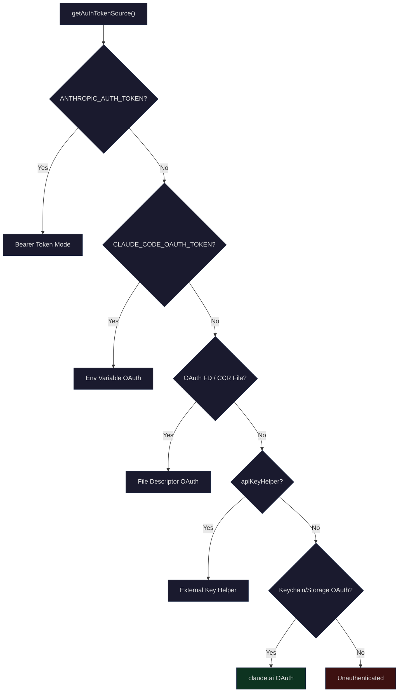
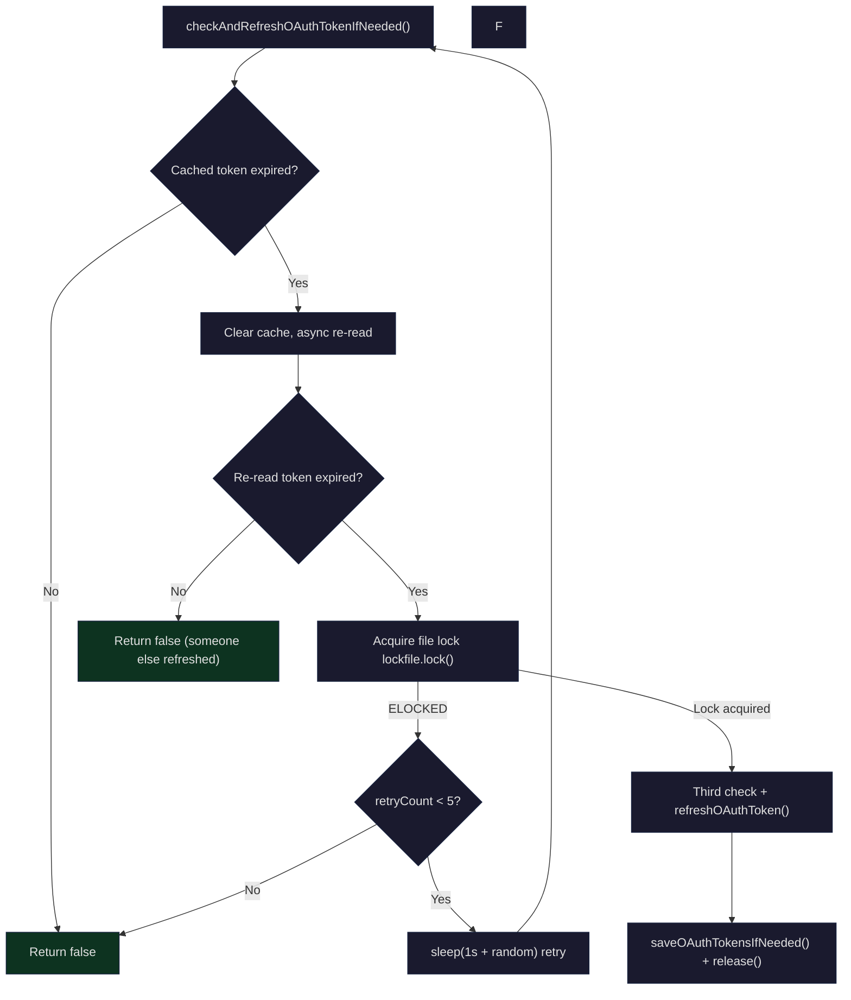

## Setting the Stage

When you first run the `claude` command, the system opens a browser to guide you through OAuth login. A few seconds later the terminal displays "Login successful" and you start coding. Hours later, the token expires — but you don't notice a thing, because the system silently refreshes it in the background. When you switch to remote Bridge mode, the JWT is automatically decoded, scheduled, and refreshed 5 minutes before expiration. Behind all of this is a full-pipeline architecture covering three authentication methods: API Key, OAuth 2.0, and JWT.

The core questions this architecture must answer are:

1. **Diverse credential sources**: How do you unify handling of environment variable API Keys, OAuth Tokens, tokens passed via file descriptors, and JWTs in Bridge mode?
2. **Secure storage**: Where are tokens stored? macOS uses Keychain, Linux uses plaintext files — how do you abstract away this difference?
3. **Lifecycle management**: What happens when a token expires? How do you avoid race conditions when multiple processes try to refresh simultaneously?
4. **Cold start optimization**: macOS Keychain reads take ~32ms each, and two sequential reads cost ~65ms — how do you optimize this?

This article starts with a panoramic view of authentication methods, then progressively dives into Keychain integration, the OAuth flow, token refresh scheduling, JWT management in Bridge mode, and finally paints the complete picture of Claude Code's authentication system.

## Authentication Methods Overview

Claude Code supports multiple authentication methods, with the following priority from highest to lowest:



The authentication source determination logic lives in the `getAuthTokenSource()` function in `src/utils/auth.ts`:

```typescript
// src/utils/auth.ts (L153-206)
export function getAuthTokenSource() {
  // --bare: API-key-only. apiKeyHelper is the only allowed bearer-token source
  if (isBareMode()) {
    if (getConfiguredApiKeyHelper()) {
      return { source: 'apiKeyHelper' as const, hasToken: true }
    }
    return { source: 'none' as const, hasToken: false }
  }

  if (process.env.ANTHROPIC_AUTH_TOKEN && !isManagedOAuthContext()) {
    return { source: 'ANTHROPIC_AUTH_TOKEN' as const, hasToken: true }
  }

  if (process.env.CLAUDE_CODE_OAUTH_TOKEN) {
    return { source: 'CLAUDE_CODE_OAUTH_TOKEN' as const, hasToken: true }
  }

  // Check for OAuth Token passed via file descriptor (or CCR disk fallback)
  const oauthTokenFromFd = getOAuthTokenFromFileDescriptor()
  if (oauthTokenFromFd) {
    if (process.env.CLAUDE_CODE_OAUTH_TOKEN_FILE_DESCRIPTOR) {
      return { source: 'CLAUDE_CODE_OAUTH_TOKEN_FILE_DESCRIPTOR', hasToken: true }
    }
    return { source: 'CCR_OAUTH_TOKEN_FILE', hasToken: true }
  }

  const oauthTokens = getClaudeAIOAuthTokens()
  if (shouldUseClaudeAIAuth(oauthTokens?.scopes) && oauthTokens?.accessToken) {
    return { source: 'claude.ai' as const, hasToken: true }
  }

  return { source: 'none' as const, hasToken: false }
}
```

This function has a key constraint: **managed context isolation**. When Claude Desktop or CCR (Claude Code Remote) launches the CLI via OAuth, the system checks `isManagedOAuthContext()` to prevent falling back to the user's local `apiKeyHelper` or environment variable API Key, preventing cross-context credential leakage.

### Three Core Authentication Modes

| Mode | Source | Refreshable | Use Case |
|------|--------|-------------|----------|
| **API Key** | `ANTHROPIC_API_KEY` env variable or `apiKeyHelper` | No | CI/CD, third-party integrations, `--bare` mode |
| **OAuth 2.0** | Browser authorization flow + Keychain storage | Yes | Interactive terminal, Claude.ai subscribers |
| **JWT** | Issued by Bridge `/bridge` endpoint | Yes (scheduled refresh) | Remote Bridge mode, Claude Desktop |

OAuth 2.0 is the most central authentication method and the focus of this article. Anthropic's OAuth implementation follows the RFC 7636 (PKCE) extension and supports both automatic (browser callback) and manual (paste code) authorization code acquisition methods.

## macOS Keychain Integration

### Storage Architecture

Token storage abstracts away platform differences through the `SecureStorage` interface:

```typescript
// src/utils/secureStorage/index.ts (L9-17)
export function getSecureStorage(): SecureStorage {
  if (process.platform === 'darwin') {
    return createFallbackStorage(macOsKeychainStorage, plainTextStorage)
  }
  // TODO: add libsecret support for Linux
  return plainTextStorage
}
```

On macOS, a "Keychain first, plaintext file fallback" `FallbackStorage` strategy is used. This isn't a simple "if A fails try B" — `createFallbackStorage` also handles data migration across storage backends:

```typescript
// src/utils/secureStorage/fallbackStorage.ts (L27-60)
update(data: SecureStorageData): { success: boolean; warning?: string } {
  const primaryDataBefore = primary.read()
  const result = primary.update(data)

  if (result.success) {
    // Delete secondary on first successful migration to primary
    // This preserves credentials when host and container share .claude
    if (primaryDataBefore === null) {
      secondary.delete()
    }
    return result
  }

  const fallbackResult = secondary.update(data)
  if (fallbackResult.success) {
    // Primary write failed but primary may still hold stale entries
    // read() prefers primary, so stale entries shadow the freshly-written secondary data
    // This causes use of an old refresh token already rotated by the server -> /login loop
    if (primaryDataBefore !== null) {
      primary.delete()
    }
    return { success: true, warning: fallbackResult.warning }
  }

  return { success: false }
}
```

There's an elegant bug fix (#30337) in this code: when Keychain write fails and falls back to file storage, if the stale Keychain entry isn't deleted, `read()` would preferentially return the expired refresh token from Keychain, trapping the user in a `/login` loop.

### Keychain Read/Write Implementation

macOS Keychain reads and writes are performed through the `security` CLI tool. Writes face a 4096-byte stdin buffer limit:

```typescript
// src/utils/secureStorage/macOsKeychainStorage.ts (L23-24)
const SECURITY_STDIN_LINE_LIMIT = 4096 - 64

// L97-146 update method
update(data: SecureStorageData): { success: boolean; warning?: string } {
  clearKeychainCache()
  const jsonString = jsonStringify(data)
  const hexValue = Buffer.from(jsonString, 'utf-8').toString('hex')

  const command = `add-generic-password -U -a "${username}" -s "${storageServiceName}" -X "${hexValue}"\n`

  if (command.length <= SECURITY_STDIN_LINE_LIMIT) {
    // Prefer stdin to prevent process monitoring tools (e.g., CrowdStrike) from seeing credentials
    result = execaSync('security', ['-i'], { input: command, ... })
  } else {
    // Fall back to argv when exceeding stdin limit
    result = execaSync('security', ['add-generic-password', '-U', '-a', ...], ...)
  }
}
```

Note that credentials are hex-encoded before being passed in — this isn't encryption, but rather to avoid special characters in JSON causing shell-level parsing issues. Using `security -i` (stdin mode) is a security consideration: endpoint security software like CrowdStrike monitors process command-line arguments, and stdin passing means they only see `security -i` rather than the actual credentials.

### Caching and Stale-While-Error

The synchronous path for Keychain reads takes about ~500ms each (`security` CLI spawn). When many MCP connectors authenticate simultaneously, the lack of caching would block the event loop for several seconds. The system therefore implements TTL-based caching with a stale-while-error strategy:

```typescript
// src/utils/secureStorage/macOsKeychainHelpers.ts (L69)
export const KEYCHAIN_CACHE_TTL_MS = 30_000

// src/utils/secureStorage/macOsKeychainStorage.ts (L28-66)
read(): SecureStorageData | null {
  const prev = keychainCacheState.cache
  if (Date.now() - prev.cachedAt < KEYCHAIN_CACHE_TTL_MS) {
    return prev.data  // Return cached value within 30s
  }

  try {
    // ...execute security find-generic-password...
  } catch (_e) {
    // Stale-while-error: if stale data exists and refresh fails, keep using stale data
    // Prevents a single security spawn failure from causing an "unauthenticated" state
    if (prev.data !== null) {
      keychainCacheState.cache = { data: prev.data, cachedAt: Date.now() }
      return prev.data
    }
    keychainCacheState.cache = { data: null, cachedAt: Date.now() }
    return null
  }
}
```

The 30-second TTL is a deliberate trade-off: OAuth tokens typically expire on the order of hours, and the only cross-process writer is another Claude Code instance's `/login` or token refresh. 30 seconds of staleness is perfectly acceptable in this scenario.

### startKeychainPrefetch: Cold Start Optimization

On macOS, each startup requires reading two Keychain entries: OAuth Token (~32ms) and Legacy API Key (~33ms). Sequential reads mean ~65ms of blocking. `startKeychainPrefetch()` parallelizes these two reads and runs them concurrently with `main.tsx`'s module loading:

```typescript
// src/utils/secureStorage/keychainPrefetch.ts (L69-89)
export function startKeychainPrefetch(): void {
  if (process.platform !== 'darwin' || prefetchPromise || isBareMode()) return

  // Two child processes start immediately in parallel, running concurrently with main.tsx imports
  const oauthSpawn = spawnSecurity(
    getMacOsKeychainStorageServiceName(CREDENTIALS_SERVICE_SUFFIX),
  )
  const legacySpawn = spawnSecurity(getMacOsKeychainStorageServiceName())

  prefetchPromise = Promise.all([oauthSpawn, legacySpawn]).then(
    ([oauth, legacy]) => {
      if (!oauth.timedOut) primeKeychainCacheFromPrefetch(oauth.stdout)
      if (!legacy.timedOut) legacyApiKeyPrefetch = { stdout: legacy.stdout }
    },
  )
}
```

This code is called at the top of `main.tsx` — even before most imports:

```typescript
// src/main.tsx (L5-20)
// These side effects must run before all other imports:
// 1. profileCheckpoint marks entry time
// 2. startMdmRawRead starts the MDM subprocess
// 3. startKeychainPrefetch starts two macOS Keychain reads
import { profileCheckpoint } from './utils/startupProfiler.js';
profileCheckpoint('main_tsx_entry');
import { startMdmRawRead } from './utils/settings/mdm/rawRead.js';
startMdmRawRead();
import { ensureKeychainPrefetchCompleted, startKeychainPrefetch }
  from './utils/secureStorage/keychainPrefetch.js';
startKeychainPrefetch();
```

There's a subtle module design constraint here: `keychainPrefetch.ts` **cannot** import `execa`. Because Bun's ESM wrapper executes the entire module initialization chain when any symbol is accessed — the `execa -> human-signals -> cross-spawn` chain takes ~58ms of synchronous initialization, which would completely negate the prefetch benefits. So the prefetch module uses native `child_process.execFile` instead.

```mermaid
sequenceDiagram
  participant M as main.tsx
  participant P as keychainPrefetch
  participant K1 as security CLI (OAuth)
  participant K2 as security CLI (Legacy)
  participant I as Module Imports (~65ms)

  M->>P: startKeychainPrefetch()
  P->>K1: execFile('security', [...]) non-blocking
  P->>K2: execFile('security', [...]) non-blocking

  rect rgb(30, 30, 50)
    Note over M,I: Parallel execution
    M->>I: import module chain (~65ms)
    K1-->>P: OAuth Token (~32ms)
    K2-->>P: Legacy API Key (~33ms)
  end

  P->>P: primeKeychainCacheFromPrefetch()
  M->>P: ensureKeychainPrefetchCompleted() (near-zero cost)
```



`primeKeychainCacheFromPrefetch` only writes to the cache if it hasn't been touched — if a sync `read()` or `update()` has already executed, the prefetch result is discarded to preserve authoritativeness:

```typescript
// src/utils/secureStorage/macOsKeychainHelpers.ts (L98-111)
export function primeKeychainCacheFromPrefetch(stdout: string | null): void {
  if (keychainCacheState.cache.cachedAt !== 0) return  // Cache already touched
  let data: SecureStorageData | null = null
  if (stdout) {
    try {
      data = JSON.parse(stdout)  // Note: intentionally not using jsonParse() here
    } catch {
      return  // Malformed prefetch result — let sync read() re-fetch
    }
  }
  keychainCacheState.cache = { data, cachedAt: Date.now() }
}
```

## OAuth 2.0 Flow

### PKCE Authorization Code Flow

Claude Code implements the full OAuth 2.0 Authorization Code Flow with PKCE (RFC 7636). The core implementation lives in the `src/services/oauth/` directory, consisting of four files:

- `crypto.ts` — PKCE cryptographic primitives (code_verifier, code_challenge, state)
- `client.ts` — OAuth client (URL building, token exchange, refresh, profile fetching)
- `auth-code-listener.ts` — Local HTTP server that captures the authorization code callback
- `index.ts` — `OAuthService` class orchestrating the entire flow

The PKCE cryptography is quite concise:

```typescript
// src/services/oauth/crypto.ts (L1-23)
import { createHash, randomBytes } from 'crypto'

function base64URLEncode(buffer: Buffer): string {
  return buffer
    .toString('base64')
    .replace(/\+/g, '-')
    .replace(/\//g, '_')
    .replace(/=/g, '')
}

export function generateCodeVerifier(): string {
  return base64URLEncode(randomBytes(32))
}

export function generateCodeChallenge(verifier: string): string {
  const hash = createHash('sha256')
  hash.update(verifier)
  return base64URLEncode(hash.digest())
}

export function generateState(): string {
  return base64URLEncode(randomBytes(32))
}
```

The `code_verifier` is 32 bytes of random data, and the `code_challenge` is its SHA-256 hash. This ensures that even if the authorization code is intercepted, an attacker cannot complete the token exchange — because they don't have the original `code_verifier`.

### Dual-Path Authorization: Automatic vs Manual

`OAuthService.startOAuthFlow()` supports two authorization code acquisition methods simultaneously:

```typescript
// src/services/oauth/index.ts (L32-131)
async startOAuthFlow(
  authURLHandler: (url: string, automaticUrl?: string) => Promise<void>,
  options?: { loginWithClaudeAi?: boolean; skipBrowserOpen?: boolean; ... },
): Promise<OAuthTokens> {
  // 1. Start local HTTP server
  this.authCodeListener = new AuthCodeListener()
  this.port = await this.authCodeListener.start()

  // 2. Generate PKCE values and state
  const codeChallenge = crypto.generateCodeChallenge(this.codeVerifier)
  const state = crypto.generateState()

  // 3. Build two URLs: manual and automatic
  const manualFlowUrl = client.buildAuthUrl({ ...opts, isManual: true })
  const automaticFlowUrl = client.buildAuthUrl({ ...opts, isManual: false })

  // 4. Wait for authorization code (whichever path completes first)
  const authorizationCode = await this.waitForAuthorizationCode(
    state,
    async () => {
      if (options?.skipBrowserOpen) {
        await authURLHandler(manualFlowUrl, automaticFlowUrl)
      } else {
        await authURLHandler(manualFlowUrl)  // Show manual option to user
        await openBrowser(automaticFlowUrl)  // Try automatic flow
      }
    },
  )

  // 5. Exchange authorization code for tokens
  const tokenResponse = await client.exchangeCodeForTokens(
    authorizationCode, state, this.codeVerifier, this.port!,
    !isAutomaticFlow, options?.expiresIn,
  )

  // 6. Fetch user profile (subscription type, rate limit tier)
  const profileInfo = await client.fetchProfileInfo(tokenResponse.access_token)

  return this.formatTokens(tokenResponse, profileInfo.subscriptionType, ...)
}
```

The key difference between automatic and manual flows lies in the `redirect_uri`:

```typescript
// src/services/oauth/client.ts (L76-79)
authUrl.searchParams.append(
  'redirect_uri',
  isManual
    ? getOauthConfig().MANUAL_REDIRECT_URL    // Displays the auth code for the user to copy
    : `http://localhost:${port}/callback`,     // Local server captures automatically
)
```

In the automatic flow, the OAuth provider redirects the user to `http://localhost:{port}/callback?code=AUTH_CODE&state=STATE`, and the local `AuthCodeListener` captures this request.

### AuthCodeListener: Local Callback Server

`AuthCodeListener` is a temporary HTTP server whose lifecycle covers exactly one authorization flow:

```typescript
// src/services/oauth/auth-code-listener.ts (L18-53)
export class AuthCodeListener {
  private localServer: Server
  private pendingResponse: ServerResponse | null = null  // Deferred response for redirect

  async start(port?: number): Promise<number> {
    return new Promise((resolve, reject) => {
      // Listen on an OS-assigned port to avoid port conflicts
      this.localServer.listen(port ?? 0, 'localhost', () => {
        const address = this.localServer.address() as AddressInfo
        this.port = address.port
        resolve(this.port)
      })
    })
  }
}
```

An important design detail: the server does not immediately respond to the `/callback` request. It extracts the authorization code first, then stores the `ServerResponse` in `pendingResponse`. This allows the outer `OAuthService` to decide whether to redirect to a success or error page after completing the token exchange:

```typescript
// src/services/oauth/auth-code-listener.ts (L80-105)
handleSuccessRedirect(scopes: string[]): void {
  if (!this.pendingResponse) return
  const successUrl = shouldUseClaudeAIAuth(scopes)
    ? getOauthConfig().CLAUDEAI_SUCCESS_URL
    : getOauthConfig().CONSOLE_SUCCESS_URL
  this.pendingResponse.writeHead(302, { Location: successUrl })
  this.pendingResponse.end()
  this.pendingResponse = null
}
```

### OAuth Scope System

Claude Code's OAuth scopes define a layered permission model:

```typescript
// src/constants/oauth.ts (L33-58)
export const CLAUDE_AI_INFERENCE_SCOPE = 'user:inference' as const
export const CLAUDE_AI_PROFILE_SCOPE = 'user:profile' as const
const CONSOLE_SCOPE = 'org:create_api_key' as const

// Console OAuth scopes - API Key creation
export const CONSOLE_OAUTH_SCOPES = [
  CONSOLE_SCOPE,
  CLAUDE_AI_PROFILE_SCOPE,
] as const

// Claude.ai OAuth scopes - subscription users
export const CLAUDE_AI_OAUTH_SCOPES = [
  CLAUDE_AI_PROFILE_SCOPE,
  CLAUDE_AI_INFERENCE_SCOPE,
  'user:sessions:claude_code',
  'user:mcp_servers',
  'user:file_upload',
] as const

// Request the union of all scopes during login
export const ALL_OAUTH_SCOPES = Array.from(
  new Set([...CONSOLE_OAUTH_SCOPES, ...CLAUDE_AI_OAUTH_SCOPES]),
)
```

The `user:inference` scope is the key indicator of whether a user is a Claude.ai subscriber (Pro/Max/Team/Enterprise). The `shouldUseClaudeAIAuth()` function checks this scope to determine the authentication path:

```typescript
// src/services/oauth/client.ts (L38-40)
export function shouldUseClaudeAIAuth(scopes: string[] | undefined): boolean {
  return Boolean(scopes?.includes(CLAUDE_AI_INFERENCE_SCOPE))
}
```

## Token Storage and Refresh

### Token Read Path

`getClaudeAIOAuthTokens()` is the single entry point for reading OAuth tokens in the system, wrapped with `memoize` to avoid redundant Keychain reads:

```typescript
// src/utils/auth.ts (L1255-1300)
export const getClaudeAIOAuthTokens = memoize((): OAuthTokens | null => {
  if (isBareMode()) return null

  // Priority 1: Environment variable (inference-only token, no refresh capability)
  if (process.env.CLAUDE_CODE_OAUTH_TOKEN) {
    return {
      accessToken: process.env.CLAUDE_CODE_OAUTH_TOKEN,
      refreshToken: null,
      expiresAt: null,
      scopes: ['user:inference'],
      subscriptionType: null,
      rateLimitTier: null,
    }
  }

  // Priority 2: File descriptor (CCR / Claude Desktop)
  const oauthTokenFromFd = getOAuthTokenFromFileDescriptor()
  if (oauthTokenFromFd) {
    return { accessToken: oauthTokenFromFd, refreshToken: null, ... }
  }

  // Priority 3: Secure storage (Keychain / file)
  try {
    const secureStorage = getSecureStorage()
    const storageData = secureStorage.read()
    const oauthData = storageData?.claudeAiOauth
    if (!oauthData?.accessToken) return null
    return oauthData
  } catch (error) {
    logError(error)
    return null
  }
})
```

Note that tokens from environment variables and file descriptors have no `refreshToken` or `expiresAt` — they are "inference-only" short-lived tokens whose lifecycle is managed by an external system.

### Token Expiration Detection

Expiration detection uses a 5-minute buffer to ensure refresh is triggered before the token actually expires:

```typescript
// src/services/oauth/client.ts (L344-353)
export function isOAuthTokenExpired(expiresAt: number | null): boolean {
  if (expiresAt === null) return false
  const bufferTime = 5 * 60 * 1000  // 5 minutes
  const now = Date.now()
  return (now + bufferTime) >= expiresAt
}
```

### Multi-Process Safe Token Refresh

Token refresh is the most complex part of the entire authentication system. Consider this scenario: a user is running 3 `claude` processes simultaneously, and their tokens all expire at the same time. If all three try to refresh, only one refresh token is valid (the server rotates them), and the other two will fail.

The solution is file locking + double-checking:

```typescript
// src/utils/auth.ts (L1447-1559)
async function checkAndRefreshOAuthTokenIfNeededImpl(
  retryCount: number,
  force: boolean,
): Promise<boolean> {
  const MAX_RETRIES = 5

  // First check: is the cached token expired?
  const tokens = getClaudeAIOAuthTokens()
  if (!force && (!tokens?.refreshToken || !isOAuthTokenExpired(tokens.expiresAt))) {
    return false
  }

  // Second check: async re-read (another process may have already refreshed)
  getClaudeAIOAuthTokens.cache?.clear?.()
  clearKeychainCache()
  const freshTokens = await getClaudeAIOAuthTokensAsync()
  if (!freshTokens?.refreshToken || !isOAuthTokenExpired(freshTokens.expiresAt)) {
    return false  // Another process already completed the refresh
  }

  // Acquire file lock
  const claudeDir = getClaudeConfigHomeDir()
  let release
  try {
    release = await lockfile.lock(claudeDir)
  } catch (err) {
    if ((err as { code?: string }).code === 'ELOCKED') {
      if (retryCount < MAX_RETRIES) {
        await sleep(1000 + Math.random() * 1000)  // Random backoff
        return checkAndRefreshOAuthTokenIfNeededImpl(retryCount + 1, force)
      }
      return false
    }
  }

  try {
    // Third check: verify again after acquiring the lock
    const lockedTokens = await getClaudeAIOAuthTokensAsync()
    if (!lockedTokens?.refreshToken || !isOAuthTokenExpired(lockedTokens.expiresAt)) {
      return false  // Another process completed refresh while we were acquiring the lock
    }

    // Actual refresh
    const refreshedTokens = await refreshOAuthToken(lockedTokens.refreshToken, {
      scopes: shouldUseClaudeAIAuth(lockedTokens.scopes) ? undefined : lockedTokens.scopes,
    })
    saveOAuthTokensIfNeeded(refreshedTokens)
    return true
  } finally {
    await release()
  }
}
```



The essence of the triple-check pattern: the first check is the fast path (in-memory cache), the second check avoids unnecessary lock contention (async Keychain read), and the third check is the final confirmation after acquiring the lock. Random backoff (`1000 + Math.random() * 1000`) ensures multiple processes don't retry at the exact same moment.

### Scope Expansion During Token Refresh

The scope handling during refresh has a noteworthy design:

```typescript
// src/services/oauth/client.ts (L155-163)
const requestBody = {
  grant_type: 'refresh_token',
  refresh_token: refreshToken,
  client_id: getOauthConfig().CLIENT_ID,
  // The backend's refresh-token grant allows scope expansion
  // so it's safe even if the token was issued before new scopes were added
  scope: (requestedScopes?.length ? requestedScopes : CLAUDE_AI_OAUTH_SCOPES).join(' '),
}
```

For Claude.ai subscription users, the current scopes are not passed during refresh — instead the default `CLAUDE_AI_OAUTH_SCOPES` are used. This allows expanding scopes (e.g., adding `user:file_upload`) without requiring the user to re-login. The backend controls which scopes can be acquired via refresh through an `ALLOWED_SCOPE_EXPANSIONS` allowlist.

### Optimized Profile Information Fetching

Every token refresh could potentially be accompanied by a `/api/oauth/profile` call to fetch subscription type and rate limits. But at full deployment this call runs roughly 7M times per day. To address this, skip logic was introduced:

```typescript
// src/services/oauth/client.ts (L189-211)
const haveProfileAlready =
  config.oauthAccount?.billingType !== undefined &&
  config.oauthAccount?.accountCreatedAt !== undefined &&
  config.oauthAccount?.subscriptionCreatedAt !== undefined &&
  existing?.subscriptionType != null &&
  existing?.rateLimitTier != null

const profileInfo = haveProfileAlready
  ? null  // Skip ~7M req/day
  : await fetchProfileInfo(accessToken)
```

The comments in this code document a subtle race condition: in the `CLAUDE_CODE_OAUTH_REFRESH_TOKEN` re-login path, `installOAuthTokens` executes `performLogout()` after returning, which clears secure storage. If `null` is returned as `subscriptionType` at this point, `saveOAuthTokensIfNeeded` would permanently lose the paying user's subscription type. This is avoided by passing through the existing value (`existing?.subscriptionType`).

## JWT in Bridge Mode

### JWT Decoding

In Bridge mode, the server-issued worker JWT is used for session authentication. `jwtUtils.ts` provides JWT decoding without signature verification — because verification is the server's responsibility, and the client only needs to read the `exp` claim to schedule refreshes:

```typescript
// src/bridge/jwtUtils.ts (L21-32)
export function decodeJwtPayload(token: string): unknown | null {
  // Strip sk-ant-si- prefix (session-ingress token)
  const jwt = token.startsWith('sk-ant-si-')
    ? token.slice('sk-ant-si-'.length)
    : token
  const parts = jwt.split('.')
  if (parts.length !== 3 || !parts[1]) return null
  try {
    return jsonParse(Buffer.from(parts[1], 'base64url').toString('utf8'))
  } catch {
    return null
  }
}
```

### createTokenRefreshScheduler

This is the core component in Bridge mode — a generic token refresh scheduler used by both the standalone bridge and the REPL bridge:

```typescript
// src/bridge/jwtUtils.ts (L72-88)
export function createTokenRefreshScheduler({
  getAccessToken,
  onRefresh,
  label,
  refreshBufferMs = TOKEN_REFRESH_BUFFER_MS,  // Default 5 minutes
}: {
  getAccessToken: () => string | undefined | Promise<string | undefined>
  onRefresh: (sessionId: string, oauthToken: string) => void
  label: string
  refreshBufferMs?: number
}): {
  schedule: (sessionId: string, token: string) => void
  scheduleFromExpiresIn: (sessionId: string, expiresInSeconds: number) => void
  cancel: (sessionId: string) => void
  cancelAll: () => void
}
```

The scheduler's core is the "generation counter" pattern, used to solve races between async refreshes and rescheduling:

```typescript
// src/bridge/jwtUtils.ts (L89-100)
const timers = new Map<string, ReturnType<typeof setTimeout>>()
const failureCounts = new Map<string, number>()
const generations = new Map<string, number>()

function nextGeneration(sessionId: string): number {
  const gen = (generations.get(sessionId) ?? 0) + 1
  generations.set(sessionId, gen)
  return gen
}
```

Every time `schedule()` or `cancel()` is called, the generation for the corresponding session is incremented. The async `doRefresh()` checks whether the generation still matches after completing — if it doesn't, the schedule has been superseded and the current refresh should be abandoned:

```typescript
// src/bridge/jwtUtils.ts (L165-181)
async function doRefresh(sessionId: string, gen: number): Promise<void> {
  let oauthToken: string | undefined
  try {
    oauthToken = await getAccessToken()
  } catch (err) { ... }

  // If the session was cancelled or rescheduled during the await, generation will have changed
  if (generations.get(sessionId) !== gen) {
    logForDebugging(`... stale (gen ${gen} vs ${generations.get(sessionId)}), skipping`)
    return  // Avoid orphaned timers
  }

  onRefresh(sessionId, oauthToken)

  // Schedule subsequent refresh to maintain auth for long-lived sessions
  const timer = setTimeout(doRefresh, FALLBACK_REFRESH_INTERVAL_MS, sessionId, gen)
  timers.set(sessionId, timer)
}
```

Usage in the REPL bridge:

```typescript
// src/bridge/remoteBridgeCore.ts (L317-320)
const refresh = createTokenRefreshScheduler({
  refreshBufferMs: cfg.token_refresh_buffer_ms,
  getAccessToken: async () => {
    // Unconditionally refresh OAuth then call /bridge
    await checkAndRefreshOAuthTokenIfNeeded()
    return getClaudeAIOAuthTokens()?.accessToken
  },
  onRefresh: async (sessionId, oauthToken) => {
    // Each /bridge call bumps the epoch
    // JWT-only exchange leaves the old epoch's heartbeat -> 409 within 20s
    const bridge = await callBridgeEndpoint(sessionId, oauthToken)
    // Rebuild transport with new JWT + new epoch
    await rebuildTransport(bridge)
  },
  label: 'repl-v2',
})
```

### Failure Retry and Bailout

The scheduler implements a capped retry mechanism, with a maximum of 3 consecutive failures:

```typescript
// src/bridge/jwtUtils.ts (L57-60)
const MAX_REFRESH_FAILURES = 3
const REFRESH_RETRY_DELAY_MS = 60_000  // Retry after 1 minute

// L185-205
if (!oauthToken) {
  const failures = (failureCounts.get(sessionId) ?? 0) + 1
  failureCounts.set(sessionId, failures)
  if (failures < MAX_REFRESH_FAILURES) {
    const retryTimer = setTimeout(doRefresh, REFRESH_RETRY_DELAY_MS, sessionId, gen)
    timers.set(sessionId, retryTimer)
  }
  return  // After 3 failures, abandon the refresh chain
}

// Reset failure counter on success
failureCounts.delete(sessionId)
```

## /login and /logout Commands

### /login Flow

The `/login` command renders a `ConsoleOAuthFlow` component that guides the user through OAuth authorization. After successful login, a series of reset and refresh operations are triggered:

```typescript
// src/commands/login/login.tsx (L19-58)
export async function call(onDone, context): Promise<React.ReactNode> {
  return <Login onDone={async success => {
    context.onChangeAPIKey()
    // Signature blocks are bound to the API Key — must be cleared after switching
    context.setMessages(stripSignatureBlocks)

    if (success) {
      resetCostState()                         // Reset cost tracking
      void refreshRemoteManagedSettings()      // Refresh remote managed settings
      void refreshPolicyLimits()               // Refresh policy limits
      resetUserCache()                         // Clear user cache
      refreshGrowthBookAfterAuthChange()       // Refresh feature flags
      clearTrustedDeviceToken()                // Clear old device token
      void enrollTrustedDevice()               // Enroll new device
      resetBypassPermissionsCheck()            // Reset permission checks
      // Increment authVersion to trigger hooks that depend on auth to re-fetch data
      context.setAppState(prev => ({
        ...prev,
        authVersion: prev.authVersion + 1,
      }))
    }
    onDone(success ? 'Login successful' : 'Login interrupted')
  }} />
}
```

The `authVersion` increment is a clever React pattern — changing a number triggers all hooks that listen for auth changes (such as MCP server lists) to re-execute.

### /logout Flow

Logout must execute cleanup operations in a specific order:

```typescript
// src/commands/logout/logout.tsx (L17-48)
export async function performLogout({ clearOnboarding = false }): Promise<void> {
  // 1. Flush telemetry data first (before clearing credentials, to prevent org data leakage)
  const { flushTelemetry } = await import('../../utils/telemetry/instrumentation.js')
  await flushTelemetry()

  // 2. Remove API Key
  await removeApiKey()

  // 3. Clear all secure storage data
  const secureStorage = getSecureStorage()
  secureStorage.delete()

  // 4. Clear authentication-related caches
  await clearAuthRelatedCaches()

  // 5. Clear OAuth account info from config
  saveGlobalConfig(current => {
    const updated = { ...current }
    if (clearOnboarding) {
      updated.hasCompletedOnboarding = false
      updated.subscriptionNoticeCount = 0
      updated.hasAvailableSubscription = false
    }
    updated.oauthAccount = undefined
    return updated
  })
}
```

The critical ordering: telemetry must be flushed before credentials are cleared, otherwise subsequent telemetry events would lose org context. The lazy import for `flushTelemetry` is another performance optimization — the OpenTelemetry package is about 1.1MB and isn't loaded at startup.

`clearAuthRelatedCaches` clears all authentication-related in-memory caches:

```typescript
// src/commands/logout/logout.tsx (L51-71)
export async function clearAuthRelatedCaches(): Promise<void> {
  getClaudeAIOAuthTokens.cache?.clear?.()     // OAuth token cache
  clearTrustedDeviceTokenCache()               // Trusted device token
  clearBetasCaches()                           // Beta feature flags
  clearToolSchemaCache()                       // Tool schema cache
  resetUserCache()                             // User data cache
  refreshGrowthBookAfterAuthChange()           // GrowthBook refresh
  getGroveNoticeConfig.cache?.clear?.()        // Grove config
  getGroveSettings.cache?.clear?.()
  await clearRemoteManagedSettingsCache()      // Remote managed settings
  await clearPolicyLimitsCache()               // Policy limits
}
```

## Security Considerations

### Credential Passing Security

On macOS, credentials are passed via `security -i` (stdin) rather than command-line arguments, preventing endpoint detection and response (EDR) software from logging credentials. Fallback to argv only occurs when the payload exceeds the stdin buffer limit.

### CSRF Protection

The `state` parameter in the OAuth flow is used not only for standard CSRF protection but also to correlate automatic and manual flows:

```typescript
// src/services/oauth/auth-code-listener.ts (L152-169)
private validateAndRespond(authCode, state, res): void {
  if (!authCode) {
    res.writeHead(400)
    this.reject(new Error('No authorization code received'))
    return
  }
  if (state !== this.expectedState) {
    res.writeHead(400)
    res.end('Invalid state parameter')
    this.reject(new Error('Invalid state parameter'))
    return
  }
  this.pendingResponse = res
  this.resolve(authCode)
}
```

### Keychain Lock Detection

In SSH sessions, the macOS Keychain may be in a locked state. The system detects this condition and displays a prompt to the user in the UI:

```typescript
// src/utils/secureStorage/macOsKeychainStorage.ts (L211-231)
export function isMacOsKeychainLocked(): boolean {
  if (keychainLockedCache !== undefined) return keychainLockedCache
  if (process.platform !== 'darwin') return false

  try {
    const result = execaSync('security', ['show-keychain-info'], { reject: false })
    keychainLockedCache = result.exitCode === 36  // exit code 36 = keychain locked
  } catch {
    keychainLockedCache = false
  }
  return keychainLockedCache
}
```

The result is cached because the Keychain lock state doesn't change during a CLI session, and `execaSync` takes about 27ms each time — in virtual scroll message remount scenarios, every message would re-trigger the detection.

### Multi-Layer Token Storage Protection

Token storage forms a security gradient:

1. **macOS Keychain** (highest security): OS-level encrypted storage requiring user password to unlock
2. **Plaintext file fallback** (Linux/Keychain unavailable): Stored in `~/.claude/` directory, protected by file permissions
3. **Environment variable tokens** (externally managed): Not stored; the caller is responsible for security

## Portable Patterns

Claude Code's authentication system supports several "portable" scenarios:

### Host-Container Sharing

When the `.claude` directory is shared between host and container, the container typically cannot access the macOS Keychain. `createFallbackStorage` handles this migration — deleting the file storage copy on first successful Keychain write, and vice versa:

```typescript
// src/utils/secureStorage/fallbackStorage.ts (L28-39)
if (result.success) {
  // Delete secondary on first migration to primary
  // Preserves credentials when host and container share .claude
  if (primaryDataBefore === null) {
    secondary.delete()
  }
  return result
}
```

### Environment Isolation

Different `CLAUDE_CONFIG_DIR` values map to different Keychain service names:

```typescript
// src/utils/secureStorage/macOsKeychainHelpers.ts (L29-41)
export function getMacOsKeychainStorageServiceName(serviceSuffix = ''): string {
  const configDir = getClaudeConfigHomeDir()
  const isDefaultDir = !process.env.CLAUDE_CONFIG_DIR
  const dirHash = isDefaultDir
    ? ''
    : `-${createHash('sha256').update(configDir).digest('hex').substring(0, 8)}`
  return `Claude Code${getOauthConfig().OAUTH_FILE_SUFFIX}${serviceSuffix}${dirHash}`
}
```

This ensures that credentials from different config directories (such as staging, local, custom OAuth URL) don't interfere with each other. `OAUTH_FILE_SUFFIX` is empty in production, `-staging-oauth` for staging, and `-local-oauth` for local.

### SSH Remote Authentication

When `claude ssh` starts a remote session, API calls are proxied through a Unix Socket tunnel. The remote end doesn't directly hold credentials — instead, it points to a local auth-injecting proxy via the `ANTHROPIC_UNIX_SOCKET` environment variable. In this scenario, `CLAUDE_CODE_OAUTH_TOKEN` serves as a placeholder, only to inform the remote end that the current user is an OAuth subscriber so the correct beta header is sent.

```typescript
// src/utils/auth.ts (L106-113)
if (process.env.ANTHROPIC_UNIX_SOCKET) {
  return !!process.env.CLAUDE_CODE_OAUTH_TOKEN
}
```

## Summary

Claude Code's authentication architecture demonstrates the balance a production-grade system strikes between security, performance, and usability:

- **Unified multi-source handling**: `getAuthTokenSource()` and `getClaudeAIOAuthTokens()` abstract 6+ credential sources into a unified token interface
- **Platform-adaptive storage**: The `SecureStorage` interface + `FallbackStorage` pattern implements a "Keychain first, file fallback" progressive enhancement
- **Cold start optimization**: `startKeychainPrefetch()` parallelizes ~65ms of sequential Keychain reads into the module loading phase, achieving near-zero cost
- **Multi-process safety**: Triple-check + file lock + random backoff ensures multiple Claude Code instances don't race to refresh the same token
- **Bridge JWT scheduling**: The generation counter pattern elegantly solves race conditions in async refresh
- **Defense in depth**: stdin credential passing, PKCE authorization code protection, Keychain lock detection, flushing telemetry before clearing credentials during logout

Every layer has carefully designed fallback and error recovery strategies. In particular, `stale-while-error` (continuing to use old data when Keychain reads fail) and `scope expansion on refresh` (automatically acquiring new scopes during refresh) reflect a mature system's thorough consideration of edge cases.
