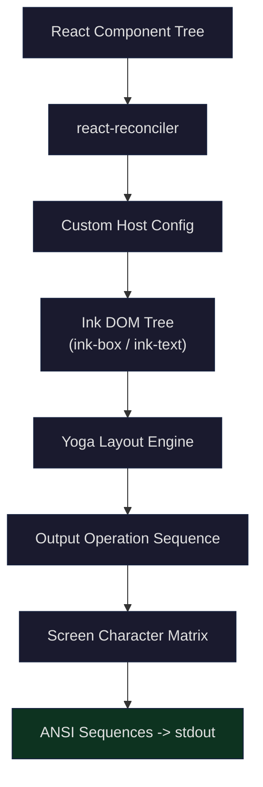
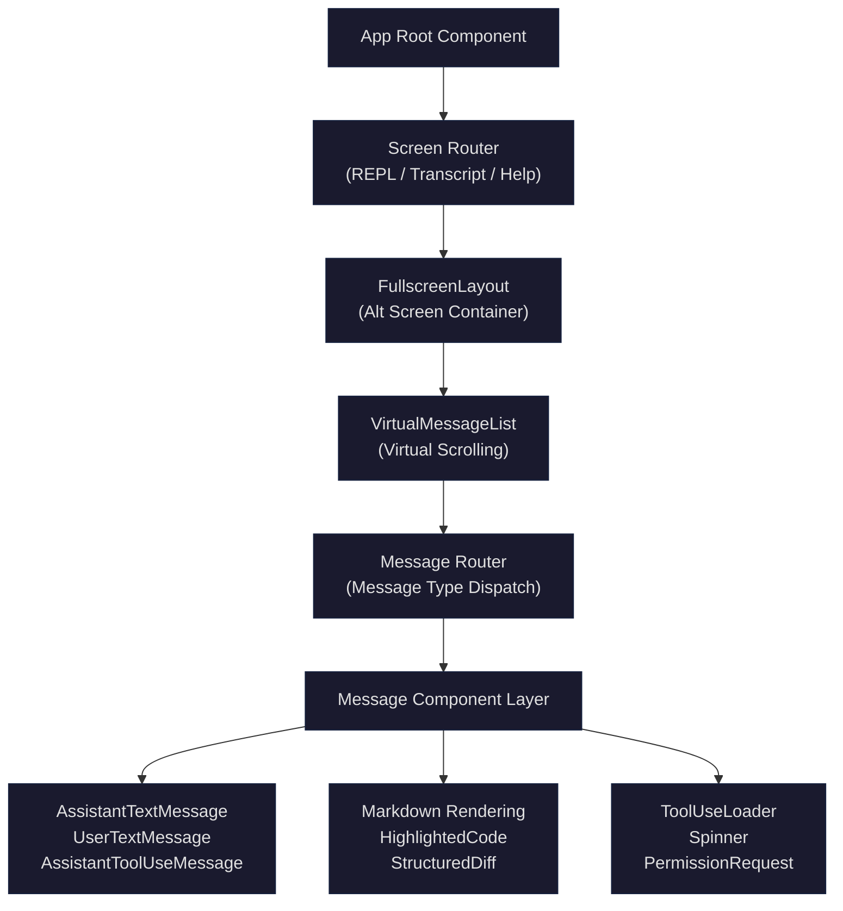

## Setting the Stage

When you run the `claude` command in your terminal, what you see is not bare plaintext output — it's syntax-highlighted code blocks, live bouncing loading animations, structured diff views, interactive permission dialogs, and smooth virtual scrolling. All of this runs in an environment with no browser, no DOM, and no CSS: your terminal.

Behind this terminal UI is a complete React application. Claude Code switches React's render target from the browser DOM to a terminal character matrix. Through a custom reconciler, components like `<Box>` and `<Text>` are transformed into terminal ANSI sequences, forming a UI system of 140+ components. The core questions it must answer are:

1. **Render target switching**: How does the React reconciler map a component tree to terminal pixels (character cells)? What replaces CSS as the layout engine?
2. **Component architecture**: How are 140+ components organized? How are complex UIs like message rendering, tool progress, diff views, and permission dialogs implemented in a terminal?
3. **Performance constraints**: Terminal rendering frame rates are far lower than the browser's 60fps. How do you complete layout calculation, diff detection, and terminal writes within a 16ms frame budget?
4. **Interaction model**: Without mouse clicks (in most cases) or focus switching, how do React Hooks adapt to a keyboard-first interaction paradigm?

This article begins with the Ink framework's rendering pipeline, then progressively dives into component architecture, core UI deep dives, Hooks usage, and finally discusses the limitations and portable patterns of this architecture.

## Ink Framework Overview: React's Render Target Becomes the Terminal

### What is Ink

Ink is a framework that replaces React's render target from the browser DOM to the terminal. In the browser, React uses `react-dom` to render `<div>` and `<span>` as DOM nodes; in Ink, React uses a custom reconciler to render `<Box>` and `<Text>` as terminal characters. Claude Code has done extensive deep customization on top of Ink — the `src/ink/` directory contains the complete rendering engine, not a simple reference to an npm package.

The core idea can be summed up in one sentence: **React provides the declarative UI programming model, Ink provides the terminal rendering backend**.



### Rendering Pipeline: From JSX to Terminal Pixels

The entire rendering pipeline consists of six stages:

**Stage 1: React Reconciliation**

React's reconciler diffs the JSX component tree against the previous frame's Fiber tree, producing a series of DOM operations (create, update, delete nodes). Claude Code uses the `react-reconciler` library to create a custom reconciler:

```typescript
// src/ink/reconciler.ts (L224-239)
const reconciler = createReconciler<
  ElementNames,
  Props,
  DOMElement,
  DOMElement,
  TextNode,
  DOMElement,
  unknown,
  unknown,
  DOMElement,
  HostContext,
  null, // UpdatePayload - not used in React 19
  NodeJS.Timeout,
  -1,
  null
>({
  getRootHostContext: () => ({ isInsideText: false }),
  // ...
})
```

This reconciler implements methods like `createInstance`, `commitUpdate`, and `removeChild`, translating React operations into operations on the Ink DOM tree. Each JSX element type corresponds to an Ink node type:

```typescript
// src/ink/dom.ts (L19-27)
export type ElementNames =
  | 'ink-root'
  | 'ink-box'
  | 'ink-text'
  | 'ink-virtual-text'
  | 'ink-link'
  | 'ink-progress'
  | 'ink-raw-ansi'
```

Note the `HostContext`'s `isInsideText` field — it prevents nesting `<Box>` inside `<Text>`, which is a fundamental constraint of terminal rendering (text nodes cannot contain block-level layout):

```typescript
// src/ink/reconciler.ts (L331-340)
createInstance(
  originalType: ElementNames,
  newProps: Props,
  _root: DOMElement,
  hostContext: HostContext,
): DOMElement {
  if (hostContext.isInsideText && originalType === 'ink-box') {
    throw new Error(`<Box> can't be nested inside <Text> component`)
  }
  // ...
}
```

**Stage 2: Yoga Layout Calculation**

Each node in the Ink DOM tree is associated with a Yoga layout node. Yoga is a cross-platform Flexbox layout engine developed by Facebook (originally designed for React Native). Layout calculation is triggered in the reconciler's `resetAfterCommit`:

```typescript
// src/ink/reconciler.ts (L247-279)
resetAfterCommit(rootNode) {
  // ...
  if (typeof rootNode.onComputeLayout === 'function') {
    rootNode.onComputeLayout()
  }
  // ...
  rootNode.onRender?.()
}
```

`onComputeLayout` calls Yoga's `calculateLayout()` method, computing precise `x, y, width, height` for each node — similar to browser CSS Flexbox layout, but with output units in terminal character cells rather than pixels.

**Stage 3: Rendering to Output Operations**

After layout is complete, `renderNodeToOutput` traverses the Ink DOM tree, transforming each visible node into `Output` operations (write, clip, blit, clear, etc.). This stage also handles terminal-specific logic like scrolling, border drawing, and text wrapping:

```typescript
// src/ink/render-node-to-output.ts (L1-18)
import indentString from 'indent-string'
import { applyTextStyles } from './colorize.js'
import type { DOMElement } from './dom.js'
import getMaxWidth from './get-max-width.js'
import type { Rectangle } from './layout/geometry.js'
import { LayoutDisplay, LayoutEdge, type LayoutNode } from './layout/node.js'
import { nodeCache, pendingClears } from './node-cache.js'
import type Output from './output.js'
import renderBorder from './render-border.js'
import type { Screen } from './screen.js'
import {
  type StyledSegment,
  squashTextNodesToSegments,
} from './squash-text-nodes.js'
import type { Color } from './styles.js'
import { isXtermJs } from './terminal.js'
import { widestLine } from './widest-line.js'
import wrapText from './wrap-text.js'
```

A key optimization: **blit (block transfer)**. If a node's position and content haven't changed, the character data for that region is copied directly from the previous frame's Screen buffer, skipping the entire subtree's rendering. This makes steady-state frames (where only a spinner is animating) approach O(changed cells) cost rather than O(total cells).

**Stage 4: Screen Buffer Generation**

`Output` operations are applied to a `Screen` object — a two-dimensional character matrix. Screen uses pooling and interning mechanisms to optimize memory:

```typescript
// src/ink/screen.ts (L21-53)
export class CharPool {
  private strings: string[] = [' ', ''] // Index 0 = space, 1 = empty
  private stringMap = new Map<string, number>([
    [' ', 0],
    ['', 1],
  ])
  private ascii: Int32Array = initCharAscii()

  intern(char: string): number {
    // ASCII fast-path: direct array lookup instead of Map.get
    if (char.length === 1) {
      const code = char.charCodeAt(0)
      if (code < 128) {
        const cached = this.ascii[code]!
        if (cached !== -1) return cached
        const index = this.strings.length
        this.strings.push(char)
        this.ascii[code] = index
        return index
      }
    }
    // ...
  }
}
```

Each character position stores not the string itself but an integer index into the `CharPool`. This turns inter-frame diff comparisons into integer comparisons rather than string comparisons — a critical performance optimization.

**Stage 5: Double-Buffered Frame Diffing**

`createRenderer` maintains Screen buffers for the current and previous frames, implementing double buffering:

```typescript
// src/ink/renderer.ts (L31-38)
export default function createRenderer(
  node: DOMElement,
  stylePool: StylePool,
): Renderer {
  let output: Output | undefined
  return options => {
    const { frontFrame, backFrame, isTTY, terminalWidth, terminalRows } =
      options
    // ...
  }
}
```

The `LogUpdate` class converts differences between two frames into minimal terminal write operations — only updating character cells that actually changed, rather than redrawing the entire screen.

**Stage 6: Terminal Write**

The final ANSI sequences are sent to the terminal via `stdout.write()`. The rendering frame rate is controlled by `throttle`, with the default interval defined in `FRAME_INTERVAL_MS`.

### Complete Rendering Pipeline Flow


## The `ink/` Directory's Renderer Encapsulation

The `src/ink/` directory contains 40+ files forming a complete terminal rendering engine. This is not a simple reference to the npm `ink` package — the Claude Code team forked and deeply customized the entire rendering layer. Here is the responsibility breakdown of the core modules:

| Module | File | Responsibility |
|--------|------|----------------|
| DOM Abstraction | `dom.ts` | Defines Ink node types, attribute setting, child node operations, dirty marking |
| Reconciler | `reconciler.ts` | React 19 reconciler host config, bridging React Fiber to Ink DOM |
| Layout Engine | `layout/` | TypeScript wrapper around Yoga Flexbox engine |
| Style System | `styles.ts` | Mapping Flexbox properties (flex, margin, padding, border) to Yoga nodes |
| Renderer | `renderer.ts` | Generating Screen buffers from Ink DOM tree |
| Output Pipeline | `output.ts` | Collecting write/blit/clip operations and applying to Screen |
| Screen | `screen.ts` | 2D character matrix, CharPool/StylePool/HyperlinkPool pooling |
| Frame Diffing | `log-update.ts` | Front/back frame Screen diff -> minimal ANSI sequences |
| Node Rendering | `render-node-to-output.ts` | Ink DOM tree traversal, handling blit, scroll, border |
| Text Processing | `squash-text-nodes.ts`, `wrap-text.ts`, `measure-text.ts` | Text node merging, wrapping, measurement |
| Character Width | `stringWidth.ts`, `widest-line.ts` | Unicode full-width/half-width, emoji width calculation |
| Terminal Abstraction | `terminal.ts`, `termio/` | ANSI CSI/DEC/OSC sequence generation, terminal capability detection |
| Event System | `events/` | Keyboard event dispatch, event bubbling/capturing |
| Focus Management | `focus.ts` | Tab focus chain, autoFocus |
| Selection/Search | `selection.ts`, `searchHighlight.ts` | Text selection (mouse drag), search highlighting |
| Component Library | `components/` | Box, Text, ScrollBox, Link, and other base components |

### Ink Instance Lifecycle

`ink.tsx` is the rendering engine's core class (1722 lines), managing the entire Ink instance lifecycle:

```typescript
// src/ink/root.ts (L76-96)
export const renderSync = (
  node: ReactNode,
  options?: NodeJS.WriteStream | RenderOptions,
): Instance => {
  const opts = getOptions(options)
  const inkOptions: InkOptions = {
    stdout: process.stdout,
    stdin: process.stdin,
    stderr: process.stderr,
    exitOnCtrlC: true,
    patchConsole: true,
    ...opts,
  }

  const instance: Ink = getInstance(
    inkOptions.stdout,
    () => new Ink(inkOptions),
  )

  instance.render(node)
  // ...
}
```

The `Ink` class in `ink.tsx` implements the following key responsibilities:

1. **Creating the React container**: Creating a ConcurrentRoot via the reconciler (React 19 concurrent mode)
2. **Frame scheduling**: Throttling render frames to a fixed interval to avoid over-rendering
3. **Double-buffer management**: Alternating between frontFrame / backFrame Screen buffers
4. **Input handling**: Reading raw keystrokes from stdin, parsing them into KeyboardEvents, and dispatching via Dispatcher
5. **Mouse/selection**: Supporting terminal mouse events, implementing text selection and dragging
6. **Terminal modes**: Alt Screen support, Kitty keyboard protocol, modifier key protocol
7. **Debug tools**: Commit logging, Yoga counters, redraw debugging

### Style System

Ink's style system is a subset of CSS Flexbox. `styles.ts` defines available style properties and maps them to Yoga layout nodes:

```typescript
// src/ink/styles.ts (L55-61)
export type Styles = {
  readonly textWrap?:
    | 'wrap'
    | 'wrap-trim'
    | 'end'
    | 'middle'
  // ...flexDirection, alignItems, justifyContent, width, height,
  // minWidth, minHeight, padding*, margin*, border*, position, overflow...
}
```

The color system supports multiple formats:

```typescript
// src/ink/styles.ts (L15-37)
export type RGBColor = `rgb(${number},${number},${number})`
export type HexColor = `#${string}`
export type Ansi256Color = `ansi256(${number})`
export type AnsiColor =
  | 'ansi:black'
  | 'ansi:red'
  | 'ansi:green'
  // ...16 ANSI colors
```

Text styles are defined through the `TextStyles` type, supporting bold, dim, italic, underline, strikethrough, and inverse — these map directly to ANSI SGR escape sequences.

## Organizing 140+ Components

Claude Code's `src/components/` directory contains 144 files/directories, forming a clearly layered component system.

### Component Layer Architecture



### Foundation Layer: Ink Native Components

Located in `src/ink/components/`, 18 files total:

- **`Box.tsx`**: Equivalent to HTML's `<div>`, supports Flexbox layout
- **`Text.tsx`**: Equivalent to HTML's `<span>`, supports color, bold, italic, and other text styles
- **`ScrollBox.tsx`**: Box with scroll support, implementing `overflow: scroll` semantics
- **`Link.tsx`**: Terminal hyperlinks (OSC 8 protocol)
- **`RawAnsi.tsx`**: Direct output of raw ANSI sequences (bypassing Ink's text processing)
- **`AlternateScreen.tsx`**: Switches to the terminal Alt Screen (fullscreen mode)
- **`Spacer.tsx`**: Flexbox spacer, shorthand for `flex: 1`

These foundation components establish the layout primitives for terminal UI. The subset of properties supported by `Box` covers nearly the full capability of Flexbox:

```tsx
<Box
  flexDirection="column"
  padding={1}
  borderStyle="round"
  borderColor="cyan"
  width="100%"
>
  <Text bold color="green">Title</Text>
  <Text dimColor>Description text</Text>
</Box>
```

### Application Layer: Business Components

The 140+ files in `src/components/` are organized by functional domain into multiple subdirectories and standalone files:

| Domain | Components/Directory | Count | Responsibility |
|--------|---------------------|-------|----------------|
| Message Rendering | `messages/`, `Message.tsx`, `Messages.tsx` | ~15 | Rendering various message types (user, assistant, system, tool result) |
| Permission System | `permissions/` | ~30 | Tool execution permission dialogs (Bash, FileEdit, WebFetch, etc.) |
| Diff Views | `StructuredDiff/`, `diff/`, `FileEditToolDiff.tsx` | ~5 | File edit difference display |
| Spinner/Progress | `Spinner/`, `ToolUseLoader.tsx`, `AgentProgressLine.tsx` | ~12 | Loading animations, tool execution progress |
| Input | `PromptInput/`, `TextInput.tsx`, `VimTextInput.tsx` | ~5 | User input box (with Vim mode support) |
| Dialogs | `*Dialog.tsx` | ~15 | Various modal dialogs (model picker, settings, export, etc.) |
| Navigation | `FullscreenLayout.tsx`, `VirtualMessageList.tsx` | ~3 | Fullscreen layout, virtual scrolling, screen management |
| Design System | `design-system/` | ~5 | Theme colors, typography components, common UI patterns |
| Markdown | `Markdown.tsx`, `MarkdownTable.tsx` | 2 | Markdown terminal rendering |
| Code Highlighting | `HighlightedCode/` | ~2 | Syntax-highlighted code blocks |
| Task Management | `tasks/`, `TaskListV2.tsx` | ~5 | Background task list, agent status |
| Shell | `shell/` | ~3 | Shell command output rendering |

### Message Type Routing

`Message.tsx` is the core routing component for message rendering. It dispatches to different sub-components based on message type and content block type:

```typescript
// src/components/Message.tsx (L58-80)
function MessageImpl(t0) {
  const {
    message,
    lookups,
    containerWidth,
    addMargin,
    tools,
    commands,
    verbose,
    inProgressToolUseIDs,
    progressMessagesForMessage,
    shouldAnimate,
    shouldShowDot,
    style,
    width,
    isTranscriptMode,
    // ...
  } = t0;
```

The message dispatch logic handles the following types:

- **User text message** -> `UserTextMessage`
- **User image message** -> `UserImageMessage`
- **Assistant text output** -> `AssistantTextMessage` -> `Markdown`
- **Assistant tool call** -> `AssistantToolUseMessage` -> Tool-specific rendering components
- **Tool execution result** -> `UserToolResultMessage`
- **Assistant thinking process** -> `AssistantThinkingMessage`
- **System message** -> `SystemTextMessage`
- **Attachment message** -> `AttachmentMessage`
- **Collapsed read/search group** -> `CollapsedReadSearchContent`
- **Grouped tool calls** -> `GroupedToolUseContent`

## Core UI Component Deep Dives

### Markdown Terminal Rendering

`Markdown.tsx` renders Markdown text as terminal-formatted output. It uses the `marked` library for lexical analysis, then converts tokens into ANSI-formatted strings:

```typescript
// src/components/Markdown.tsx (L17-71)
// Module-level token cache — marked.lexer is the hot cost on virtual-scroll
// remounts (~3ms per message). useMemo doesn't survive unmount→remount
const TOKEN_CACHE_MAX = 500;
const tokenCache = new Map<string, Token[]>();

// Characters that indicate markdown syntax. If none are present, skip the
// ~3ms marked.lexer call entirely — render as a single paragraph.
const MD_SYNTAX_RE = /[#*`|[>\-_~]|\n\n|^\d+\. |\n\d+\. /;

function hasMarkdownSyntax(s: string): boolean {
  return MD_SYNTAX_RE.test(s.length > 500 ? s.slice(0, 500) : s);
}

function cachedLexer(content: string): Token[] {
  // Fast path: plain text with no markdown syntax → single paragraph token.
  if (!hasMarkdownSyntax(content)) {
    return [{
      type: 'paragraph',
      raw: content,
      text: content,
      tokens: [{ type: 'text', raw: content, text: content }]
    } as Token];
  }
  // LRU cache with hash key...
}
```

Three key performance optimizations are worth noting:

1. **Fast path detection**: A regex first checks the first 500 characters for Markdown syntax markers. Most short messages are plain text and can completely skip the 3ms `marked.lexer` parsing overhead.

2. **LRU token cache**: Message content is immutable, so Markdown tokens for the same message can be reused across frames. Content hashes are used as keys (avoiding memory bloat from retaining full strings), with a maximum cache of 500 entries.

3. **Hybrid rendering**: Tables use the React component `<MarkdownTable>` for rendering (requiring Flexbox for column alignment), while other content uses ANSI strings for direct output (via the `<Ansi>` component to bypass Ink's text processing).

Markdown rendering also integrates `cli-highlight` for code block syntax highlighting — content within code fences (` ``` `) is syntax-colored by language, with the highlighter loaded asynchronously via `Suspense` to avoid blocking the initial render.

### Tool Execution Progress: Spinner and ToolUseLoader

Real-time feedback during tool execution is accomplished by two components working together:

**`ToolUseLoader`** is a minimalist status indicator — a blinking black circle:

```typescript
// src/components/ToolUseLoader.tsx (source)
export function ToolUseLoader({ isError, isUnresolved, shouldAnimate }) {
  const [ref, isBlinking] = useBlink(shouldAnimate)
  const color = isUnresolved ? undefined : isError ? "error" : "success"

  return (
    <Box ref={ref} minWidth={2}>
      <Text color={color} dimColor={isUnresolved}>
        {!shouldAnimate || isBlinking || isError || !isUnresolved
          ? BLACK_CIRCLE
          : ' '}
      </Text>
    </Box>
  )
}
```

Note the ANSI style conflict issue mentioned in code comments: `</dim>` and `</bold>` share the same reset code `\x1b[22m` in ANSI, and chalk cannot distinguish between them. This causes bold text to become dim when bold follows dim. The solution is to wrap with a `<Box>` using `minWidth={2}`, inserting whitespace isolation between dim and bold.

**`Spinner`** is a much more complex component (200+ lines), displaying:
- Animation frames (characters bouncing back and forth)
- Current operation description ("Reading file...", "Running command...")
- Elapsed time
- Token usage
- Shimmer effect (during streaming responses)
- Background agent tree status

Spinner uses the `useAnimationFrame` Hook to update animation frames at fixed intervals, rather than relying on `setInterval` — this coordinates with Ink's frame scheduling system to avoid unnecessary reconciliation.

### File Diff Views

`FileEditToolDiff.tsx` displays file edit difference views. It uses the `Suspense` + `use()` pattern for asynchronous diff data loading:

```typescript
// src/components/FileEditToolDiff.tsx (L23-52)
export function FileEditToolDiff(props) {
  const [dataPromise] = useState(() => loadDiffData(props.file_path, props.edits));

  return (
    <Suspense fallback={<DiffFrame placeholder={true} />}>
      <DiffBody promise={dataPromise} file_path={props.file_path} />
    </Suspense>
  )
}

function DiffBody({ promise, file_path }) {
  const { patch, firstLine, fileContent } = use(promise);
  const { columns } = useTerminalSize();

  return (
    <DiffFrame>
      <StructuredDiffList
        hunks={patch}
        dim={false}
        width={columns}
        filePath={file_path}
        firstLine={firstLine}
        fileContent={fileContent}
      />
    </DiffFrame>
  )
}
```

The `StructuredDiffList` component renders diff hunks as terminal-formatted addition/deletion line views, supporting:
- Line number display
- Color coding for additions (green `+`) / deletions (red `-`)
- Gray display of context lines
- Automatic truncation of long lines based on terminal width

### Permission Dialogs

The permission system is one of the most complex interaction patterns in Claude Code's UI. `PermissionRequest.tsx` serves as a router, dispatching to tool-specific permission request components:

```typescript
// src/components/permissions/PermissionRequest.tsx (L47-62)
function permissionComponentForTool(tool: Tool): ComponentType<PermissionRequestProps> {
  switch (tool) {
    case FileEditTool:
      return FileEditPermissionRequest;
    case FileWriteTool:
      return FileWritePermissionRequest;
    case BashTool:
      return BashPermissionRequest;
    case PowerShellTool:
      return PowerShellPermissionRequest;
    case WebFetchTool:
      return WebFetchPermissionRequest;
    // ... 12+ tool types
  }
}
```

The `permissions/` directory contains about 30 files, with a dedicated dialog component for each tool that requires permission. Taking `BashPermissionRequest` as an example, it displays:

1. The command to execute (with syntax highlighting)
2. Working directory
3. Action options: allow once / allow for session / deny
4. Optional rule explanation (why permission is needed)
5. Worker indicator (if from a background agent)

Permission dialogs use `useKeybinding` to register keyboard shortcut handlers (`y` to allow, `n` to deny, number keys to select options), rather than traditional form interactions.

### Virtual Scrolling

As conversation history grows, rendering all messages would cause serious performance issues. `VirtualMessageList` paired with the `useVirtualScroll` Hook implements virtual scrolling — only rendering messages near the viewport:

```typescript
// src/hooks/useVirtualScroll.ts (L18-57)
const DEFAULT_ESTIMATE = 3       // Estimated height for unmeasured items (in lines)
const OVERSCAN_ROWS = 80         // Extra lines rendered above/below viewport
const COLD_START_COUNT = 30      // Initial render count before ScrollBox has laid out
const SCROLL_QUANTUM = OVERSCAN_ROWS >> 1  // scrollTop quantization step
const PESSIMISTIC_HEIGHT = 1     // Worst-case height assumption for unmeasured items
const MAX_MOUNTED_ITEMS = 300    // Upper limit on mounted items
const SLIDE_STEP = 25            // Max new mounts per commit
```

The core virtual scrolling strategies:

1. **Height estimation**: Unmeasured items use `DEFAULT_ESTIMATE = 3` lines as an initial estimate. Intentionally biased low — overestimating causes bottom whitespace (premature mount stopping), while underestimating just means mounting a few extra items (absorbed by overscan).

2. **Overscan buffer**: 80 extra lines of content are rendered above and below the viewport. Because message heights vary wildly (a tool result could be 100+ lines), a large enough buffer is needed.

3. **Scroll quantization**: `SCROLL_QUANTUM = 40` lines. Triggering a React commit on every scroll wheel tick (3-5 pixels) is unnecessary — as long as the mount range doesn't need to change, visual scrolling is handled by ScrollBox's `forceRender` (directly reading the DOM node's scrollTop, bypassing React).

4. **Progressive mounting**: `SLIDE_STEP = 25` limits each commit to at most 25 new mounted items. This prevents synchronous blocking from mounting 200+ items at once when rapidly scrolling to a completely new area (each MessageRow render takes about 1.5ms).

5. **Render-time clamping**: `scrollClampMin/Max` constrains scrollTop to the range of mounted content during rendering. When scrollTo writes arrive before React's async re-render, the user sees the edge of mounted content rather than blank space.

## React Hooks in CLI Applications

Claude Code's `src/hooks/` directory contains 85 Hooks, covering everything from keyboard interaction and state management to IDE integration. Here are the most representative ones.

### useGlobalKeybindings: Global Shortcuts

`useGlobalKeybindings.tsx` registers application-level keyboard shortcut handlers:

```typescript
// src/hooks/useGlobalKeybindings.tsx (L36-46)
/**
 * Registers global keybinding handlers for:
 * - ctrl+t: Toggle todo list
 * - ctrl+o: Toggle transcript mode
 * - ctrl+e: Toggle showing all messages in transcript
 * - ctrl+c/escape: Exit transcript mode
 */
export function GlobalKeybindingHandlers({
  screen, setScreen,
  showAllInTranscript, setShowAllInTranscript,
  messageCount,
  onEnterTranscript, onExitTranscript,
  virtualScrollActive, searchBarOpen,
}: Props): null {
```

Note this component's return value — `null`. It is a **renderless component**: it produces no UI output, only registering side effects through the `useKeybinding` Hook. This pattern is widely used in Claude Code:

- `GlobalKeybindingHandlers` -> global shortcuts
- `CancelRequestHandler` -> request cancellation
- `ScrollKeybindingHandler` -> scroll control
- `AutoUpdater` -> auto-update checking

The advantage of this pattern is encapsulating interaction logic as composable React components, enjoying the convenience of React lifecycle and state management while avoiding the register/unregister issues of imperative event listeners.

The `ctrl+o` toggle logic demonstrates a typical state machine application within a Hook — it cycles between prompt, transcript, and brief views, handling edge cases for the feature-flag-controlled brief mode.

### useCancelRequest: Request Cancellation

`useCancelRequest.ts` is a more complex example, demonstrating how Hooks handle multi-priority keyboard events:

```typescript
// src/hooks/useCancelRequest.ts (L87-122)
const handleCancel = useCallback(() => {
  // Priority 1: If there's an active task running, cancel it first
  if (abortSignal !== undefined && !abortSignal.aborted) {
    logEvent('tengu_cancel', cancelProps)
    setToolUseConfirmQueue(() => [])
    onCancel()
    return
  }

  // Priority 2: Pop queue when Claude is idle
  if (hasCommandsInQueue()) {
    if (popCommandFromQueue) {
      popCommandFromQueue()
      return
    }
  }

  // Fallback: nothing to cancel or pop
  logEvent('tengu_cancel', cancelProps)
  setToolUseConfirmQueue(() => [])
  onCancel()
}, [abortSignal, popCommandFromQueue, setToolUseConfirmQueue, onCancel, streamMode])
```

The cancellation logic has a strict priority chain:

1. Running task -> cancel it
2. Commands pending in the queue -> pop one
3. Neither -> clear the permission queue

More complex is the distinction between Escape and Ctrl+C:

```typescript
// src/hooks/useCancelRequest.ts (L129-154)
// Escape (chat:cancel) defers to mode-exit when in special mode
const isEscapeActive =
  isContextActive &&
  (canCancelRunningTask || hasQueuedCommands) &&
  !isInSpecialModeWithEmptyInput &&
  !isViewingTeammate

// Ctrl+C (app:interrupt): must NOT claim ctrl+c when main is idle
// at the prompt — that blocks the copy-selection handler
const isCtrlCActive =
  isContextActive &&
  (canCancelRunningTask || hasQueuedCommands || isViewingTeammate)
```

Escape and Ctrl+C have different behaviors in different contexts:

- **Escape** yields to mode exit when in a special input mode (bash/background mode)
- **Ctrl+C** additionally kills agents + exits teammate view when viewing a teammate
- **Ctrl+C** is inactive when the main thread is idle — otherwise it would intercept text copy and double-press-to-exit functionality

### Background Agent Termination: Double-Press Confirmation Pattern

`useCancelRequest.ts` also implements a clever double-press confirmation pattern (`chat:killAgents`):

```typescript
// src/hooks/useCancelRequest.ts (L225-266)
const handleKillAgents = useCallback(() => {
  const tasks = store.getState().tasks
  const hasRunningAgents = Object.values(tasks).some(
    t => t.type === 'local_agent' && t.status === 'running',
  )
  if (!hasRunningAgents) {
    addNotification({
      key: 'kill-agents-none',
      text: 'No background agents running',
      priority: 'immediate',
      timeoutMs: 2000,
    })
    return
  }
  const now = Date.now()
  const elapsed = now - lastKillAgentsPressRef.current
  if (elapsed <= KILL_AGENTS_CONFIRM_WINDOW_MS) {
    // Second press within window -- kill all background agents
    lastKillAgentsPressRef.current = 0
    removeNotification('kill-agents-confirm')
    killAllAgentsAndNotify()
    return
  }
  // First press -- show confirmation hint
  lastKillAgentsPressRef.current = now
  addNotification({
    key: 'kill-agents-confirm',
    text: `Press ${shortcut} again to stop background agents`,
    priority: 'immediate',
    timeoutMs: KILL_AGENTS_CONFIRM_WINDOW_MS,
  })
}, [store, addNotification, removeNotification, killAllAgentsAndNotify])
```

The first press of `ctrl+x ctrl+k` only shows a notification prompt; pressing again within 3 seconds actually executes the action. This prevents accidental termination of all background agents. `useRef` stores the last press time — state isn't used because this value doesn't affect rendering.

### More Representative Hooks

| Hook | Responsibility | Key Technical Detail |
|------|---------------|---------------------|
| `useBlink` | Controls element blink animation | `useRef` + `requestAnimationFrame` cycle |
| `useTerminalSize` | Tracks terminal size changes | Listens to `stdout.on('resize')` |
| `useVirtualScroll` | Virtual scroll range calculation | `useSyncExternalStore` connected to ScrollBox |
| `useExitOnCtrlCD` | Double-press Ctrl+C/D to exit | Time window detection + `useRef` |
| `useVimInput` | Vim mode input | Mode state machine (NORMAL/INSERT/VISUAL) |
| `useDiffData` | Async diff data loading | `useState(async)` + `Suspense` |
| `useElapsedTime` | Elapsed time display | `useAnimationFrame`-driven updates |
| `useInputBuffer` | Input buffering and debouncing | Batch-merging rapid input |
| `usePasteHandler` | Paste detection and handling | Distinguishing typing from pasting (time threshold) |
| `useIDEIntegration` | IDE connection state | WebSocket event bridging to React state |

## Ink's Limitations and Workarounds

### Limitation 1: No Full CSS Capabilities

Terminal Flexbox is only a subset of CSS Flexbox. Unsupported features:

- **Grid layout**: Only Flexbox, no CSS Grid
- **Float/absolute positioning**: Yoga's `position: absolute` support is limited, and "absolute positioning" in the terminal means character-level overwriting
- **Percentage heights**: Computing percentage heights in scrollable containers would cause layout cycles
- **Animation**: No CSS transition/animation; all animations are JS-driven (setInterval / requestAnimationFrame)

**Workarounds**:
- Use `flexDirection` + `alignItems` + `justifyContent` combinations to simulate most layout needs
- Control animations manually through Hooks like `useBlink` and `useAnimationFrame`
- Implement complex layouts (like multi-column options in permission dialogs) with nested Box components

### Limitation 2: Terminal Rendering is Global

In a browser, each DOM element renders independently, but a terminal is a global character matrix. This means:

- **Redraw scope**: Any node change can potentially trigger recalculation of the entire Screen
- **z-index simulation**: `position: absolute` nodes implement "stacking" by overwriting characters, but removing them requires marking the entire frame as "contaminated", forcing a full redraw

```typescript
// src/ink/render-node-to-output.ts (L129-135)
// Removing an absolute-positioned node poisons prevScreen: it may
// have painted over non-siblings (e.g. an overlay over a ScrollBox
// earlier in tree order), so their blits would restore the removed
// node's pixels.
const absoluteRemoved = consumeAbsoluteRemovedFlag()
renderNodeToOutput(node, output, {
  prevScreen: absoluteRemoved || options.prevFrameContaminated
    ? undefined
    : prevScreen,
})
```

**Workarounds**: The `blit` optimization directly copies previous frame data when nodes haven't changed. Layout shift detection tracks node position changes, triggering full redraws only when necessary.

### Limitation 3: Inconsistent Character Widths

Unicode characters may have different widths in different terminals. CJK characters (Chinese, Japanese, Korean) occupy 2 character widths, emoji may occupy 1 or 2 widths, and some special characters (zero-width joiners, etc.) occupy 0 width.

```typescript
// src/ink/output.ts (L38-43)
type ClusteredChar = {
  value: string
  width: number    // Pre-computed terminal width
  styleId: number
  hyperlink: string | undefined
}
```

**Workarounds**: `stringWidth.ts` provides precise Unicode width calculation, and `ClusteredChar` pre-computes and caches the width of each grapheme cluster, avoiding repeated calculation in the rendering hot path.

### Limitation 4: ANSI Style Code Conflicts

The shared bold/dim reset code issue mentioned earlier (`\x1b[22m`) is a historical defect in the ANSI standard. The chalk library cannot distinguish between `</bold>` and `</dim>` — closing one closes both simultaneously.

**Workarounds**: Avoid mixing bold and dim between adjacent inline elements. When mixing is necessary, separate them with `<Box>` (block-level elements reset ANSI state). The `minWidth={2}` in `ToolUseLoader` is an instance of this strategy.

### Limitation 5: Alt Screen Height Constraint

In Alt Screen mode, content height must exactly equal the terminal row count. If Yoga's calculated height exceeds the terminal rows, cursor positioning becomes corrupted:

```typescript
// src/ink/renderer.ts (L97-104)
const height = options.altScreen ? terminalRows : yogaHeight
if (options.altScreen && yogaHeight > terminalRows) {
  logForDebugging(
    `alt-screen: yoga height ${yogaHeight} > terminalRows ${terminalRows} — ` +
    `something is rendering outside <AlternateScreen>. Overflow clipped.`,
    { level: 'warn' },
  )
}
```

**Workarounds**: The `<AlternateScreen>` component wraps children in `<Box height={rows} flexShrink={0}>`, forcing height to equal the terminal row count. Overflowing content is silently clipped, and a warning log is emitted.

## Portable Patterns

Claude Code's terminal UI architecture contains several patterns worth adopting in other CLI projects:

### Pattern 1: Renderless Components

Encapsulate interaction logic as React components that return `null`:

```tsx
function MyKeybindingHandler({ onAction }): null {
  useKeybinding('action:trigger', onAction, {
    context: 'Global',
    isActive: true,
  })
  return null
}
```

Advantages:
- Enjoy React's lifecycle management (automatic event listener cleanup)
- Composable (render in parallel with other components)
- Conditionally renderable (via `isActive` or `{condition && <Handler />}`)

### Pattern 2: Double Buffering + Frame Diffing

Maintain two Screen buffers, writing only changed cells to the terminal each frame:

```
Frame N:   [H][e][l][l][o][ ][ ]
Frame N+1: [H][e][l][l][o][!][ ]
Diff:                      [!]    -> write only 1 character
```

This makes steady-state rendering (where only a spinner is changing) approach O(1) cost, rather than O(rows * cols).

### Pattern 3: Virtual Scrolling + Progressive Mounting

For long conversations that may contain hundreds of messages:

1. Only mount messages near the viewport (`useVirtualScroll`)
2. Fill unmounted areas with spacers
3. Progressively mount during rapid scrolling (max 25 items per frame)
4. Render-time clamping to prevent blank flashes

### Pattern 4: Suspense Async Data Loading

Use `useState(() => promise)` + `use(promise)` + `<Suspense>` for async data:

```tsx
function DiffView({ file, edits }) {
  const [dataPromise] = useState(() => loadDiffData(file, edits));
  return (
    <Suspense fallback={<Placeholder />}>
      <DiffBody promise={dataPromise} />
    </Suspense>
  )
}
```

This shows a placeholder while data loads, then automatically replaces it when complete — identical to Suspense usage in the browser.

### Pattern 5: Double-Press Confirmation for Destructive Actions

For irreversible actions (like terminating all background agents), use time-windowed double confirmation:

```tsx
const CONFIRM_WINDOW_MS = 3000
const lastPressRef = useRef<number>(0)

const handleDangerousAction = useCallback(() => {
  const elapsed = Date.now() - lastPressRef.current
  if (elapsed <= CONFIRM_WINDOW_MS) {
    // Execute
    performAction()
    lastPressRef.current = 0
  } else {
    // Show hint
    lastPressRef.current = Date.now()
    showNotification("Press again to confirm")
  }
}, [])
```

### Pattern 6: Pooled String Interning

For strings that need frequent comparison (characters, styles, hyperlinks), use an intern pool to map strings to integer IDs:

```typescript
class CharPool {
  private strings: string[] = [' ', '']
  private stringMap = new Map<string, number>()
  private ascii: Int32Array // ASCII fast path

  intern(char: string): number {
    if (char.length === 1) {
      const code = char.charCodeAt(0)
      if (code < 128) {
        const cached = this.ascii[code]!
        if (cached !== -1) return cached
        // ...
      }
    }
    // ...
  }
}
```

Inter-frame diff comparison becomes integer comparison (`===`) rather than string comparison, yielding significant performance gains at the millions-of-operations scale.

## Summary

Claude Code's terminal UI architecture showcases a deeply customized React terminal rendering solution. From the custom `react-reconciler` host config, to the Yoga layout engine, double-buffered Screen diffing, virtual scrolling, and through to 140+ business components and 85 Hooks — it is one of the most complex terminal React applications known.

Key takeaways:

1. **Rendering pipeline**: JSX -> React Reconcile -> Ink DOM -> Yoga Layout -> Screen Buffer -> ANSI diff -> stdout. A six-stage pipeline where blit optimization makes steady-state frames approach zero cost
2. **Component architecture**: Foundation layer (Box/Text/ScrollBox) + Application layer (Message/Permission/Diff/Spinner), with message routing dispatching by type to dedicated rendering components
3. **Performance strategies**: Markdown token LRU cache, virtual scroll progressive mounting, string pool interning, scroll quantization to reduce React commits
4. **Interaction patterns**: Renderless components for shortcut logic, multi-priority cancellation chain, time-window double confirmation
5. **Limitation mitigation**: bold/dim ANSI code conflict isolation with Box, Alt Screen height forced clamping, absolute node removal marking full-frame contamination

This architecture proves an important point: **React's value lies not just in DOM rendering, but in its declarative programming model and component-based architecture**. After switching the render target to a terminal character matrix, React's state management, lifecycle, Hooks, Suspense and other core capabilities remain perfectly applicable — and these are precisely the capabilities needed to build complex interactive CLI applications.
