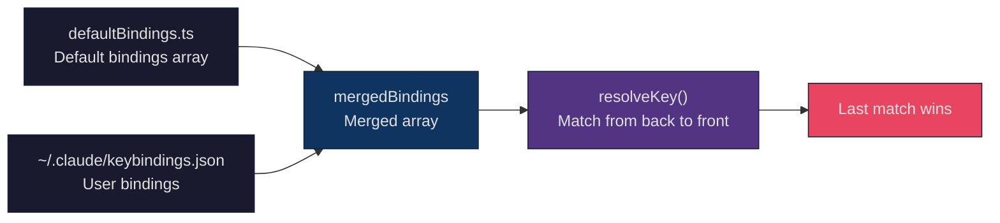
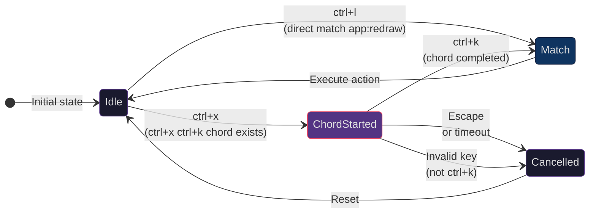
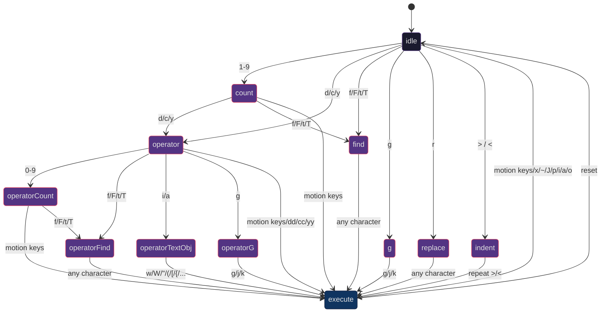
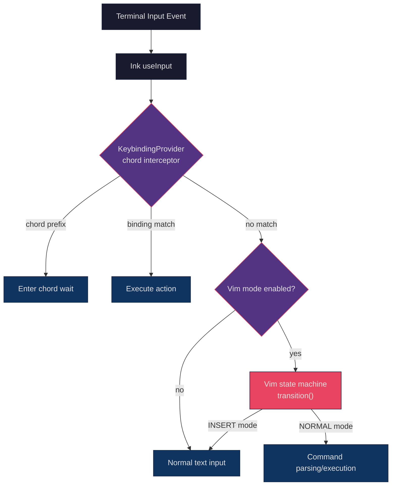

## Setting the Stage

In terminal applications, the keyboard is the only input device. Unlike browser applications that can rely on mouse clicks, focus switching, and menu systems, every interaction in a CLI tool must map to a keyboard operation. When a CLI application's functionality grows complex enough to encompass 17 context scenarios, 70+ bindable actions, multi-key combination sequences (chords), and full Vim modal editing, the keybinding system is no longer as simple as "listen for keypress, execute action."

The core challenges facing Claude Code's keybinding system include:

1. **Layered overrides**: Default bindings must work out of the box, but users should be able to override any binding via `~/.claude/keybindings.json` — including unbinding (setting to `null`). How does this "default + user override" layered model resolve efficiently at runtime?
2. **Context isolation**: The same key (e.g., `enter`) should trigger completely different actions in the chat input, confirmation dialog, and autocomplete menu. How do 17 contexts stay independent?
3. **Multi-key combinations (chords)**: Two-step sequences like VS Code's `Ctrl+K Ctrl+S` — how are they implemented in a terminal? After the user presses the first key, the system needs to "wait" for the second key without accidentally triggering the first key's single-key binding.
4. **Vim mode state machine**: Switching between INSERT and NORMAL modes, where NORMAL mode needs to parse compound commands like `d2w` (delete two words) or `ciw` (change inner word). How does a character sequence drive state machine transitions?
5. **Type safety**: How does TypeScript's type system ensure every state transition is exhaustively handled, with no branches missed?

This article starts from the keybinding system's configuration layer, progressively dives into the resolution engine, chord state machine, and Vim mode's state machine implementation, and finally discusses the portability of these patterns.

## Keybinding Configuration System: ~/.claude/keybindings.json

### Configuration Structure

Claude Code's keybinding configuration uses a JSON file format, stored at `~/.claude/keybindings.json`. The file structure is defined using a Zod schema and validated at runtime:

```typescript
// src/keybindings/schema.ts (L177-208)
export const KeybindingBlockSchema = lazySchema(() =>
  z.object({
    context: z.enum(KEYBINDING_CONTEXTS)
      .describe('UI context where these bindings apply'),
    bindings: z.record(
      z.string().describe('Keystroke pattern (e.g., "ctrl+k", "shift+tab")'),
      z.union([
        z.enum(KEYBINDING_ACTIONS),
        z.string().regex(/^command:[a-zA-Z0-9:\-_]+$/)
          .describe('Command binding (e.g., "command:help")'),
        z.null().describe('Set to null to unbind a default shortcut'),
      ])
    ),
  })
)
```

A complete configuration file example:

```json
{
  "$schema": "https://www.schemastore.org/claude-code-keybindings.json",
  "$docs": "https://code.claude.com/docs/en/keybindings",
  "bindings": [
    {
      "context": "Chat",
      "bindings": {
        "ctrl+s": "chat:stash",
        "ctrl+x ctrl+e": "chat:externalEditor",
        "meta+p": null
      }
    },
    {
      "context": "Global",
      "bindings": {
        "ctrl+shift+f": "command:compact"
      }
    }
  ]
}
```

Key design points:

- **`null` unbinding**: Setting a key binding to `null` explicitly unbinds that default shortcut; pressing it will be swallowed (not passed to other handlers)
- **`command:` prefix**: Allows binding keys to slash commands, equivalent to typing `/compact` in chat
- **`$schema` metadata**: Supports JSON Schema validation and autocompletion in editors

### 17 Contexts

The keybinding system defines 17 contexts, each corresponding to a UI state:

```typescript
// src/keybindings/schema.ts (L12-32)
export const KEYBINDING_CONTEXTS = [
  'Global',          // Always active
  'Chat',            // Chat input box
  'Autocomplete',    // Autocomplete menu
  'Confirmation',    // Confirmation/permission dialog
  'Help',            // Help overlay
  'Transcript',      // Conversation transcript viewer
  'HistorySearch',   // History search (ctrl+r)
  'Task',            // Task/agent running
  'ThemePicker',     // Theme picker
  'Settings',        // Settings menu
  'Tabs',            // Tab navigation
  'Attachments',     // Image attachment navigation
  'Footer',          // Footer indicator
  'MessageSelector', // Message selector (rollback dialog)
  'DiffDialog',      // Diff dialog
  'ModelPicker',     // Model picker
  'Select',          // Generic list selection component
  'Plugin',          // Plugin dialog
] as const
```

Each context has its own independent binding map. When multiple contexts are active simultaneously (e.g., `Chat` + `Global`), the resolver matches by context priority — more specific contexts take precedence over `Global`.

### Default Bindings: Code as Configuration

Default bindings are defined in `src/keybindings/defaultBindings.ts`, with the same structure as user configuration. This file serves as the keybinding "factory defaults":

```typescript
// src/keybindings/defaultBindings.ts (L32-62)
export const DEFAULT_BINDINGS: KeybindingBlock[] = [
  {
    context: 'Global',
    bindings: {
      'ctrl+c': 'app:interrupt',
      'ctrl+d': 'app:exit',
      'ctrl+l': 'app:redraw',
      'ctrl+t': 'app:toggleTodos',
      'ctrl+o': 'app:toggleTranscript',
      'ctrl+r': 'history:search',
    },
  },
  {
    context: 'Chat',
    bindings: {
      escape: 'chat:cancel',
      'ctrl+x ctrl+k': 'chat:killAgents', // Chord binding!
      [MODE_CYCLE_KEY]: 'chat:cycleMode',
      enter: 'chat:submit',
      up: 'history:previous',
      'ctrl+s': 'chat:stash',
      [IMAGE_PASTE_KEY]: 'chat:imagePaste',
    },
  },
  // ... 15 more context blocks
]
```

Note the line `'ctrl+x ctrl+k': 'chat:killAgents'` — this is a chord binding, requiring the user to first press `Ctrl+X`, then `Ctrl+K` to trigger. Choosing `ctrl+x` as the chord prefix is deliberate: it avoids conflicts with readline editing keys (`ctrl+a/b/e/f`, etc.).

Platform adaptation is also embedded in the default bindings:

```typescript
// src/keybindings/defaultBindings.ts (L15-30)
const IMAGE_PASTE_KEY = getPlatform() === 'windows' ? 'alt+v' : 'ctrl+v'

const MODE_CYCLE_KEY = SUPPORTS_TERMINAL_VT_MODE ? 'shift+tab' : 'meta+m'
```

On Windows, `Ctrl+V` is claimed by the system paste function, so image paste uses `Alt+V` instead; on Windows Terminal without VT mode support, `Shift+Tab` is unreliable and falls back to `Meta+M`.

## Layered Override: Default + User Binding Merge Strategy

### "Last One Wins" Principle

Keybinding merging uses a simple but effective strategy — appending user bindings after the default bindings array:

```typescript
// src/keybindings/loadUserBindings.ts (L197)
const mergedBindings = [...defaultBindings, ...userParsed]
```

During resolution, the array is traversed front to back, and **the last matching binding wins**. This means user configuration automatically overrides defaults without complex merge logic.



### Resolution Engine

The resolution engine's core is the `resolveKey` function, which takes Ink's input event and the current list of active contexts, returning a match result:

```typescript
// src/keybindings/resolver.ts (L10-20)
export type ResolveResult =
  | { type: 'match'; action: string }
  | { type: 'none' }
  | { type: 'unbound' }

export type ChordResolveResult =
  | { type: 'match'; action: string }
  | { type: 'none' }
  | { type: 'unbound' }
  | { type: 'chord_started'; pending: ParsedKeystroke[] }
  | { type: 'chord_cancelled' }
```

Five result types cover all possible outcomes:

- `match`: Binding found, return the action name
- `none`: No match, let other handlers try
- `unbound`: Explicitly unbound (user set to `null`), swallow the event
- `chord_started`: Current key may be a chord prefix, enter wait state
- `chord_cancelled`: Chord cancelled (invalid second key pressed, or Escape)

### Key Parser

Key strings (e.g., `"ctrl+shift+k"`) are parsed into structured `ParsedKeystroke` objects:

```typescript
// src/keybindings/parser.ts (L13-75)
export function parseKeystroke(input: string): ParsedKeystroke {
  const parts = input.split('+')
  const keystroke: ParsedKeystroke = {
    key: '', ctrl: false, alt: false,
    shift: false, meta: false, super: false,
  }
  for (const part of parts) {
    const lower = part.toLowerCase()
    switch (lower) {
      case 'ctrl': case 'control':
        keystroke.ctrl = true; break
      case 'alt': case 'opt': case 'option':
        keystroke.alt = true; break
      case 'cmd': case 'command': case 'super': case 'win':
        keystroke.super = true; break
      case 'esc': keystroke.key = 'escape'; break
      case 'return': keystroke.key = 'enter'; break
      // ...
    }
  }
  return keystroke
}
```

The parser supports numerous aliases: `ctrl`/`control`, `alt`/`opt`/`option`, `cmd`/`command`/`super`/`win`. This lets users write configuration files with their preferred naming conventions without needing to check the docs for "is it `alt` or `option`?"

### Terminal-Specific Modifier Key Matching

Modifier key matching in terminal environments has many pitfalls. The matching logic in `match.ts` handles two key terminal quirks:

```typescript
// src/keybindings/match.ts (L60-79)
function modifiersMatch(inkMods: InkModifiers, target: ParsedKeystroke): boolean {
  if (inkMods.ctrl !== target.ctrl) return false
  if (inkMods.shift !== target.shift) return false

  // Alt and Meta are the same thing in terminals (key.meta = true)
  // so "alt+k" and "meta+k" match the same input
  const targetNeedsMeta = target.alt || target.meta
  if (inkMods.meta !== targetNeedsMeta) return false

  // Super (Cmd/Win) is an independent modifier
  // Only terminals supporting Kitty keyboard protocol can send it
  if (inkMods.super !== target.super) return false

  return true
}
```

**Alt/Meta merge**: Traditional terminals cannot distinguish between Alt and Meta keys — both send ESC prefix sequences. So in configuration, `alt+k` and `meta+k` are treated as equivalent.

**Escape key special handling**: Ink sets `key.meta = true` when it receives Escape (because ESC sequences are the underlying representation of the Alt key). Without special handling, a bare `escape` binding would never match:

```typescript
// src/keybindings/match.ts (L96-105)
export function matchesKeystroke(input: string, key: Key,
    target: ParsedKeystroke): boolean {
  const keyName = getKeyName(input, key)
  if (keyName !== target.key) return false
  const inkMods = getInkModifiers(key)
  // Ignore meta modifier when Escape key is pressed
  if (key.escape) {
    return modifiersMatch({ ...inkMods, meta: false }, target)
  }
  return modifiersMatch(inkMods, target)
}
```

### Reserved Shortcut Validation

Certain shortcuts cannot be rebound by users. `reservedShortcuts.ts` defines three categories of reserved keys:

```typescript
// src/keybindings/reservedShortcuts.ts (L16-54)
// Non-rebindable — hardcoded in Claude Code
export const NON_REBINDABLE: ReservedShortcut[] = [
  { key: 'ctrl+c', reason: 'Interrupt/exit (hardcoded)', severity: 'error' },
  { key: 'ctrl+d', reason: 'Exit (hardcoded)', severity: 'error' },
  { key: 'ctrl+m', reason: 'Same as Enter in terminals (both send CR)', severity: 'error' },
]

// Terminal/OS intercepted — never reaches the application
export const TERMINAL_RESERVED: ReservedShortcut[] = [
  { key: 'ctrl+z', reason: 'Unix SIGTSTP', severity: 'warning' },
  { key: 'ctrl+\\', reason: 'SIGQUIT', severity: 'error' },
]

// macOS specific
export const MACOS_RESERVED: ReservedShortcut[] = [
  { key: 'cmd+c', reason: 'macOS system copy', severity: 'error' },
  { key: 'cmd+v', reason: 'macOS system paste', severity: 'error' },
  // ...
]
```

The `ctrl+m` reservation is particularly noteworthy — in terminals, `Ctrl+M` sends the exact same byte code (CR, 0x0D) as the Enter key. If users were allowed to bind `ctrl+m` to another action, the Enter key would be hijacked too.

### Hot Reload and File Watching

Users don't need to restart Claude Code after modifying `keybindings.json` — a file watcher automatically reloads:

```typescript
// src/keybindings/loadUserBindings.ts (L386-396)
watcher = chokidar.watch(userPath, {
  persistent: true,
  ignoreInitial: true,
  awaitWriteFinish: {
    stabilityThreshold: FILE_STABILITY_THRESHOLD_MS, // 500ms
    pollInterval: FILE_STABILITY_POLL_INTERVAL_MS,     // 200ms
  },
})
watcher.on('add', handleChange)
watcher.on('change', handleChange)
watcher.on('unlink', handleDelete) // File deleted -> fall back to defaults
```

The `awaitWriteFinish` parameter is critical — editors may first truncate and then write a file during save. If reload is triggered between truncation and writing, it would read an empty file. The 500ms stability threshold ensures the file write is complete before loading.

## Chord Bindings: Multi-Key Combination State Machine

### Problem: Prefix Conflict

Consider the following binding configuration:

- `ctrl+x`: some single-key action
- `ctrl+x ctrl+k`: chord binding

When the user presses `ctrl+x`, the system faces ambiguity: is this the single-key binding's trigger, or the first step of a chord? The answer is **chord takes priority** — as long as there exists a longer chord with the current keystroke as its prefix, the system enters a wait state.



### Chord Resolution Algorithm

The `resolveKeyWithChordState` function implements the complete chord resolution logic:

```typescript
// src/keybindings/resolver.ts (L166-244)
export function resolveKeyWithChordState(
  input: string, key: Key,
  activeContexts: KeybindingContextName[],
  bindings: ParsedBinding[],
  pending: ParsedKeystroke[] | null,  // Current chord state
): ChordResolveResult {
  // 1. Escape cancels chord
  if (key.escape && pending !== null) {
    return { type: 'chord_cancelled' }
  }

  // 2. Build current test sequence
  const currentKeystroke = buildKeystroke(input, key)
  const testChord = pending
    ? [...pending, currentKeystroke]
    : [currentKeystroke]

  // 3. Check if this could be a prefix of a longer chord
  // Key: null overrides also participate in this calculation
  const chordWinners = new Map<string, string | null>()
  for (const binding of contextBindings) {
    if (binding.chord.length > testChord.length &&
        chordPrefixMatches(testChord, binding)) {
      chordWinners.set(chordToString(binding.chord), binding.action)
    }
  }
  // Only wait if there are non-null longer chords
  let hasLongerChords = false
  for (const action of chordWinners.values()) {
    if (action !== null) { hasLongerChords = true; break }
  }

  // 4. Prioritize entering chord wait
  if (hasLongerChords) {
    return { type: 'chord_started', pending: testChord }
  }

  // 5. Check for exact match
  let exactMatch: ParsedBinding | undefined
  for (const binding of contextBindings) {
    if (chordExactlyMatches(testChord, binding)) {
      exactMatch = binding  // Last one wins
    }
  }

  if (exactMatch) {
    return exactMatch.action === null
      ? { type: 'unbound' }
      : { type: 'match', action: exactMatch.action }
  }

  // 6. No match -> cancel if pending
  return pending !== null
    ? { type: 'chord_cancelled' }
    : { type: 'none' }
}
```

The `null` override handling in step 3 deserves attention. Suppose the default bindings have `ctrl+x ctrl+k` -> `chat:killAgents`, and the user sets it to `null` in their config. Without checking for `null`, pressing `ctrl+x` would still enter chord wait — but the second step `ctrl+k` would match an action of `null` (unbound), and the user could never use `ctrl+x`'s single-key binding. By filtering out chords where all actions are `null`, the system correctly skips the wait.

### Chord Timeout

In `KeybindingProviderSetup.tsx`, chords have a 1-second timeout:

```typescript
// src/keybindings/KeybindingProviderSetup.tsx (L30)
const CHORD_TIMEOUT_MS = 1000
```

If the user doesn't press the second key within 1 second after pressing the chord prefix, the chord is automatically cancelled and keypress handling resumes normally.

### useKeybinding Hook: Consuming Bindings in React

Components register keybinding handlers through the `useKeybinding` hook:

```typescript
// src/keybindings/useKeybinding.ts (L33-97)
export function useKeybinding(
  action: string,
  handler: () => void | false | Promise<void>,
  options: Options = {},
): void {
  const { context = 'Global', isActive = true } = options
  const keybindingContext = useOptionalKeybindingContext()

  // 1. Register handler to context (used by ChordInterceptor)
  useEffect(() => {
    if (!keybindingContext || !isActive) return
    return keybindingContext.registerHandler({ action, context, handler })
  }, [action, context, handler, keybindingContext, isActive])

  // 2. Intercept keys via useInput
  const handleInput = useCallback((input, key, event) => {
    const result = keybindingContext.resolve(input, key, uniqueContexts)

    switch (result.type) {
      case 'match':
        keybindingContext.setPendingChord(null)
        if (result.action === action) {
          if (handler() !== false) {
            event.stopImmediatePropagation()
          }
        }
        break
      case 'chord_started':
        keybindingContext.setPendingChord(result.pending)
        event.stopImmediatePropagation()
        break
      case 'unbound':
        keybindingContext.setPendingChord(null)
        event.stopImmediatePropagation() // Swallow the event
        break
    }
  }, [action, context, handler, keybindingContext])

  useInput(handleInput, { isActive })
}
```

Design points:

- **`stopImmediatePropagation()`**: Prevents other `useInput` handlers from receiving the event after a binding is matched
- **`handler() !== false`**: A handler returning `false` means "not consumed", allowing the event to continue propagating. This is used in scenarios like: a scroll component passing through events when content doesn't need scrolling
- **Batch registration**: `useKeybindings` (plural form) allows a single hook call to register multiple bindings, reducing `useInput` instance count

## Vim Mode: A Type-Driven State Machine

### /vim Command Toggle

Vim mode is toggled on/off via the `/vim` slash command:

```typescript
// src/commands/vim/vim.ts (L8-38)
export const call: LocalCommandCall = async () => {
  const config = getGlobalConfig()
  let currentMode = config.editorMode || 'normal'

  // Backward compatibility: 'emacs' is treated as 'normal'
  if (currentMode === 'emacs') {
    currentMode = 'normal'
  }

  const newMode = currentMode === 'normal' ? 'vim' : 'normal'
  saveGlobalConfig(current => ({
    ...current,
    editorMode: newMode,
  }))

  return {
    type: 'text',
    value: `Editor mode set to ${newMode}. ${
      newMode === 'vim'
        ? 'Use Escape key to toggle between INSERT and NORMAL modes.'
        : 'Using standard (readline) keyboard bindings.'
    }`,
  }
}
```

The mode setting persists to global config, remaining in effect after restart. The previously existing `emacs` mode has been deprecated and automatically downgrades to `normal`.

### VimState: Top-Level State Type

Vim's state model has two layers — the top-level `VimState` distinguishes INSERT/NORMAL modes, with NORMAL mode containing a `CommandState` state machine internally:

```typescript
// src/vim/types.ts (L49-52)
export type VimState =
  | { mode: 'INSERT'; insertedText: string }
  | { mode: 'NORMAL'; command: CommandState }
```

`INSERT` mode tracks `insertedText` — text the user typed in insert mode, used for dot-repeat (`.` command to repeat the last edit). `NORMAL` mode contains a `CommandState`, which is the compound command parsing state machine.

### CommandState: An Exhaustive Union of 11 States

`CommandState` is the core of Vim mode. It uses TypeScript's discriminated union to define 11 states, each precisely recording "what input the system is waiting for":

```typescript
// src/vim/types.ts (L59-76)
export type CommandState =
  | { type: 'idle' }
  | { type: 'count'; digits: string }
  | { type: 'operator'; op: Operator; count: number }
  | { type: 'operatorCount'; op: Operator; count: number; digits: string }
  | { type: 'operatorFind'; op: Operator; count: number; find: FindType }
  | { type: 'operatorTextObj'; op: Operator; count: number; scope: TextObjScope }
  | { type: 'find'; find: FindType; count: number }
  | { type: 'g'; count: number }
  | { type: 'operatorG'; op: Operator; count: number }
  | { type: 'replace'; count: number }
  | { type: 'indent'; dir: '>' | '<'; count: number }
```

Each state's fields represent the "input collected so far." Taking the compound command `d2w` as an example:

1. **idle**: Initial state
2. Press `d` -> **operator** `{ type: 'operator', op: 'delete', count: 1 }`
3. Press `2` -> **operatorCount** `{ type: 'operatorCount', op: 'delete', count: 1, digits: '2' }`
4. Press `w` -> **execute**: delete 2 words (count = 1 * 2 = 2)

And for `3ciw`:

1. **idle**: Initial
2. Press `3` -> **count** `{ type: 'count', digits: '3' }`
3. Press `c` -> **operator** `{ type: 'operator', op: 'change', count: 3 }`
4. Press `i` -> **operatorTextObj** `{ type: 'operatorTextObj', op: 'change', count: 3, scope: 'inner' }`
5. Press `w` -> **execute**: change 3 inner words



### TypeScript Compile-Time Exhaustive Matching

The state machine's transition function uses TypeScript's `switch` for exhaustive matching. If a new state type is added but not handled, the compiler will report an error:

```typescript
// src/vim/transitions.ts (L59-88)
export function transition(
  state: CommandState,
  input: string,
  ctx: TransitionContext,
): TransitionResult {
  switch (state.type) {
    case 'idle':          return fromIdle(input, ctx)
    case 'count':         return fromCount(state, input, ctx)
    case 'operator':      return fromOperator(state, input, ctx)
    case 'operatorCount': return fromOperatorCount(state, input, ctx)
    case 'operatorFind':  return fromOperatorFind(state, input, ctx)
    case 'operatorTextObj': return fromOperatorTextObj(state, input, ctx)
    case 'find':          return fromFind(state, input, ctx)
    case 'g':             return fromG(state, input, ctx)
    case 'operatorG':     return fromOperatorG(state, input, ctx)
    case 'replace':       return fromReplace(state, input, ctx)
    case 'indent':        return fromIndent(state, input, ctx)
    // No default needed — TypeScript checks exhaustiveness here
    // If CommandState gets a new type, this will produce a compile error
  }
}
```

Each `from*` function returns a `TransitionResult`, which has only two fields:

```typescript
// src/vim/transitions.ts (L51-54)
export type TransitionResult = {
  next?: CommandState    // Transition to new state
  execute?: () => void   // Execute action
}
```

If `next` exists, switch to the new state; if `execute` exists, execute the action then reset to `idle`. Both can exist simultaneously, but in practice each transition sets only one.

### Type-Safe Key Grouping

Vim's key grouping uses the `as const satisfies` pattern, letting TypeScript both infer literal types and validate value types:

```typescript
// src/vim/types.ts (L125-133)
export const OPERATORS = {
  d: 'delete',
  c: 'change',
  y: 'yank',
} as const satisfies Record<string, Operator>

export function isOperatorKey(key: string): key is keyof typeof OPERATORS {
  return key in OPERATORS
}
```

`as const satisfies Record<string, Operator>` does two things:
1. `as const`: Preserves literal types — `OPERATORS.d`'s type is `'delete'` not `string`
2. `satisfies Record<string, Operator>`: Validates all values are valid `Operator` types

`isOperatorKey` is a type guard. At the call site, once it passes the guard check, TypeScript narrows `key`'s type from `string` to `'d' | 'c' | 'y'`, making `OPERATORS[key]` safe to index.

### Compound Command Walkthrough: d2w End-to-End

Let's trace `d2w` from keypress to execution:

**Step 1: Press `d`**

Enters `fromIdle`, where `isOperatorKey('d')` returns `true`:

```typescript
// src/vim/transitions.ts (L103-105)
if (isOperatorKey(input)) {
  return { next: { type: 'operator', op: OPERATORS[input], count } }
}
```

State becomes `{ type: 'operator', op: 'delete', count: 1 }`.

**Step 2: Press `2`**

Enters `fromOperator`, digit match:

```typescript
// src/vim/transitions.ts (L295-302)
if (/[0-9]/.test(input)) {
  return {
    next: {
      type: 'operatorCount',
      op: state.op, count: state.count, digits: input,
    },
  }
}
```

State becomes `{ type: 'operatorCount', op: 'delete', count: 1, digits: '2' }`.

**Step 3: Press `w`**

Enters `fromOperatorCount`, non-digit input triggers execution:

```typescript
// src/vim/transitions.ts (L325-330)
const motionCount = parseInt(state.digits, 10)  // 2
const effectiveCount = state.count * motionCount  // 1 * 2 = 2
const result = handleOperatorInput(state.op, effectiveCount, input, ctx)
```

`handleOperatorInput` detects that `w` is a simple motion:

```typescript
// src/vim/transitions.ts (L229-230)
if (SIMPLE_MOTIONS.has(input)) {
  return { execute: () => executeOperatorMotion(op, input, count, ctx) }
}
```

`executeOperatorMotion('delete', 'w', 2, ctx)` is called — resolving the motion target, computing the operation range, and deleting two words.

### Motion Functions: Pure Computation

Motion resolution is a pure function — it modifies no state, only returning the target cursor position:

```typescript
// src/vim/motions.ts (L13-25)
export function resolveMotion(key: string, cursor: Cursor, count: number): Cursor {
  let result = cursor
  for (let i = 0; i < count; i++) {
    const next = applySingleMotion(key, result)
    if (next.equals(result)) break  // Reached boundary, stop
    result = next
  }
  return result
}
```

The `break` condition is important — if the motion has already reached the text boundary (e.g., `$` at end of line), repeated execution won't go past it. The `Cursor` object itself is immutable, returning a new Cursor instance with each motion.

Motion functions cover the most common Vim motions:

```typescript
// src/vim/motions.ts (L30-67)
function applySingleMotion(key: string, cursor: Cursor): Cursor {
  switch (key) {
    case 'h': return cursor.left()
    case 'l': return cursor.right()
    case 'j': return cursor.downLogicalLine()
    case 'k': return cursor.upLogicalLine()
    case 'gj': return cursor.down()         // Visual line (next line after wrap)
    case 'gk': return cursor.up()           // Visual line
    case 'w': return cursor.nextVimWord()
    case 'b': return cursor.prevVimWord()
    case 'e': return cursor.endOfVimWord()
    case 'W': return cursor.nextWORD()      // WORD (whitespace-delimited)
    case 'B': return cursor.prevWORD()
    case 'E': return cursor.endOfWORD()
    case '0': return cursor.startOfLogicalLine()
    case '^': return cursor.firstNonBlankInLogicalLine()
    case '$': return cursor.endOfLogicalLine()
    default:  return cursor
  }
}
```

Note that `j`/`k` use `downLogicalLine`/`upLogicalLine` (move by logical line), while `gj`/`gk` use `down`/`up` (move by visual line). This is standard Vim behavior in terminals — when a line of text wraps, `j` jumps to the next logical line while `gj` jumps to the next visual line after the wrap.

### Text Objects: iw, aw, i", a(

Text objects are the second class of targets for Vim operators. `ciw` means change inner word (change the word at the cursor), `da"` means delete around " (delete including the quotes):

```typescript
// src/vim/textObjects.ts (L38-58)
export function findTextObject(
  text: string, offset: number,
  objectType: string, isInner: boolean,
): TextObjectRange {
  if (objectType === 'w')
    return findWordObject(text, offset, isInner, isVimWordChar)
  if (objectType === 'W')
    return findWordObject(text, offset, isInner, ch => !isVimWhitespace(ch))

  const pair = PAIRS[objectType]
  if (pair) {
    const [open, close] = pair
    return open === close
      ? findQuoteObject(text, offset, open, isInner)      // Quote-type
      : findBracketObject(text, offset, open, close, isInner) // Bracket-type
  }
  return null
}
```

Supported text object types:

```typescript
// src/vim/types.ts (L164-180)
export const TEXT_OBJ_TYPES = new Set([
  'w', 'W',           // word / WORD
  '"', "'", '`',       // Quotes
  '(', ')', 'b',       // Parentheses (b is an alias)
  '[', ']',            // Square brackets
  '{', '}', 'B',       // Curly braces (B is an alias)
  '<', '>',            // Angle brackets
])
```

Bracket matching uses the classic depth-counting algorithm — searching backward for the `depth === 0` opening bracket, and forward for the `depth === 0` closing bracket:

```typescript
// src/vim/textObjects.ts (L149-186)
function findBracketObject(text, offset, open, close, isInner) {
  let depth = 0, start = -1
  // Search backward for opening bracket
  for (let i = offset; i >= 0; i--) {
    if (text[i] === close && i !== offset) depth++
    else if (text[i] === open) {
      if (depth === 0) { start = i; break }
      depth--
    }
  }
  if (start === -1) return null

  // Search forward for closing bracket
  depth = 0; let end = -1
  for (let i = start + 1; i < text.length; i++) {
    if (text[i] === open) depth++
    else if (text[i] === close) {
      if (depth === 0) { end = i; break }
      depth--
    }
  }
  if (end === -1) return null

  return isInner
    ? { start: start + 1, end }     // inner: excludes brackets
    : { start, end: end + 1 }       // around: includes brackets
}
```

### Operator Execution: OperatorContext

Operator execution communicates with the editor through the `OperatorContext` interface:

```typescript
// src/vim/operators.ts (L26-37)
export type OperatorContext = {
  cursor: Cursor              // Current cursor
  text: string                // Current text
  setText: (text: string) => void  // Set new text
  setOffset: (offset: number) => void  // Move cursor
  enterInsert: (offset: number) => void  // Enter INSERT mode
  getRegister: () => string    // Get register content
  setRegister: (content: string, linewise: boolean) => void
  getLastFind: () => { type: FindType; char: string } | null
  setLastFind: (type: FindType, char: string) => void
  recordChange: (change: RecordedChange) => void  // Dot-repeat recording
}
```

This interface is the contract between the Vim engine and UI components. The Vim state machine itself doesn't know where text is stored or how the cursor is rendered — it only operates through this interface. This makes the Vim engine independently testable without depending on React components.

### RecordedChange: Dot-Repeat Memory

Every editing operation is recorded as a `RecordedChange`, available for the `.` command (dot-repeat) to replay:

```typescript
// src/vim/types.ts (L92-119)
export type RecordedChange =
  | { type: 'insert'; text: string }
  | { type: 'operator'; op: Operator; motion: string; count: number }
  | { type: 'operatorTextObj'; op: Operator; objType: string;
      scope: TextObjScope; count: number }
  | { type: 'operatorFind'; op: Operator; find: FindType;
      char: string; count: number }
  | { type: 'replace'; char: string; count: number }
  | { type: 'x'; count: number }
  | { type: 'toggleCase'; count: number }
  | { type: 'indent'; dir: '>' | '<'; count: number }
  | { type: 'openLine'; direction: 'above' | 'below' }
  | { type: 'join'; count: number }
```

10 variants cover all repeatable edit types. When the user presses `.`, the system reads `lastChange` and replays the corresponding operation. Note the `insert` variant — when the user returns from INSERT mode to NORMAL mode, the entire insert session's text is recorded as a single `RecordedChange`, and `.` will re-insert the same text.

### PersistentState: Cross-Command Memory

Certain state needs to persist between commands — registers (clipboard), last find, last edit:

```typescript
// src/vim/types.ts (L81-86)
export type PersistentState = {
  lastChange: RecordedChange | null   // dot-repeat
  lastFind: { type: FindType; char: string } | null  // ;/, repeat find
  register: string                     // Default register
  registerIsLinewise: boolean          // Whether register content is linewise
}
```

`registerIsLinewise` affects paste behavior — linewise content is pasted on a new line, while non-linewise content is pasted inline after the cursor.

### Count Upper Limit: MAX_VIM_COUNT

To prevent malicious input (e.g., `99999999dw` causing prolonged computation), numeric counts have an upper limit:

```typescript
// src/vim/types.ts (L182)
export const MAX_VIM_COUNT = 10000
```

```typescript
// src/vim/transitions.ts (L271-273)
const newDigits = state.digits + input
const count = Math.min(parseInt(newDigits, 10), MAX_VIM_COUNT)
return { next: { type: 'count', digits: String(count) } }
```

## Keybinding and Vim Mode Collaboration

### Layered Input Processing

The keybinding system and Vim mode have a clear layered relationship in input processing:



Key rules:
1. **Keybindings take priority over Vim**: System shortcuts like `ctrl+c`, `ctrl+d` are always handled by the keybinding system and never enter the Vim state machine
2. **Vim INSERT mode = normal input**: In INSERT mode, keypresses are processed as text input
3. **Vim NORMAL mode = command parsing**: In NORMAL mode, each keypress drives the CommandState state machine

### Context Registration Mechanism

Components register and unregister active contexts through `KeybindingContext`:

```typescript
// src/keybindings/KeybindingContext.tsx
type KeybindingContextValue = {
  registerActiveContext: (context: KeybindingContextName) => void
  unregisterActiveContext: (context: KeybindingContextName) => void
  activeContexts: Set<KeybindingContextName>
  // ...
}
```

When the Autocomplete menu appears, it registers the `'Autocomplete'` context; when the menu disappears, it unregisters. This ensures the `tab` key executes `autocomplete:accept` when autocomplete is visible, rather than another action.

## Validation and Diagnostics

### Multi-Layer Validation

User configuration files go through four layers of validation:

1. **Structural validation**: JSON parsing + `isKeybindingBlock` type guard
2. **Context validation**: Checking that context names are valid
3. **Duplicate detection**: Scanning raw JSON strings to detect duplicate key names within the same context (`JSON.parse` silently uses the last value)
4. **Reserved key checking**: Warning or blocking binding to system-reserved shortcuts

```typescript
// src/keybindings/validate.ts (L425-451)
export function validateBindings(
  userBlocks: unknown,
  _parsedBindings: ParsedBinding[],
): KeybindingWarning[] {
  const warnings: KeybindingWarning[] = []
  warnings.push(...validateUserConfig(userBlocks))
  if (isKeybindingBlockArray(userBlocks)) {
    warnings.push(...checkDuplicates(userBlocks))
    const userBindings = getUserBindingsForValidation(userBlocks)
    warnings.push(...checkReservedShortcuts(userBindings))
  }
  // Deduplicate: report each key+context+type only once
  const seen = new Set<string>()
  return warnings.filter(w => {
    const key = `${w.type}:${w.key}:${w.context}`
    if (seen.has(key)) return false
    seen.add(key)
    return true
  })
}
```

### JSON Duplicate Key Detection

This is an easily overlooked pitfall. The JSON specification allows duplicate keys in objects, and `JSON.parse` silently uses the last value. Users may not realize that parts of their configuration are being ignored:

```typescript
// src/keybindings/validate.ts (L258-307)
export function checkDuplicateKeysInJson(jsonString: string): KeybindingWarning[] {
  const bindingsBlockPattern =
    /"bindings"\s*:\s*\{([^{}]*(?:\{[^{}]*\}[^{}]*)*)\}/g

  // For each bindings block, extract all key names with regex, detect duplicates
  let blockMatch
  while ((blockMatch = bindingsBlockPattern.exec(jsonString)) !== null) {
    const keyPattern = /"([^"]+)"\s*:/g
    const keysByName = new Map<string, number>()
    // ...
    if (count === 2) {
      warnings.push({
        type: 'duplicate',
        severity: 'warning',
        message: `Duplicate key "${key}" in ${context} bindings`,
        suggestion: `JSON uses the last value, earlier values are ignored.`,
      })
    }
  }
}
```

Note that this detection is performed on the raw JSON string — it must be done before `JSON.parse`, because duplicate keys are lost after parsing.

## Portable Patterns

Several general-purpose patterns from Claude Code's keybinding and Vim mode implementation are worth porting to other projects.

### Pattern 1: Layered Configuration Override

The "default + user override" pattern works for any configuration system requiring user customization:

```
mergedConfig = [...defaults, ...userOverrides]
resolve(key) -> find first match from back to front
```

Advantages are simple implementation (array concatenation), clear semantics (last one wins), and support for `null` unbinding. This pattern can be directly used for VS Code extensions, Electron apps, or even web application shortcut systems.

### Pattern 2: Discriminated Union State Machine

TypeScript's union types are naturally suited for state machine modeling:

```typescript
type State =
  | { type: 'idle' }
  | { type: 'loading'; url: string }
  | { type: 'success'; data: T }
  | { type: 'error'; message: string }

function transition(state: State, event: Event): State {
  switch (state.type) {
    case 'idle': // TypeScript knows state only has the type field
    case 'loading': // TypeScript knows state has a url field
    // Missing any case -> compile error
  }
}
```

Claude Code's Vim implementation proves this pattern can scale to a complex state machine with 11 states and 50+ transitions while maintaining type safety.

### Pattern 3: Context + Hook Event Dispatch

The event dispatch pattern in React — registering handlers via Context, dispatching events through useInput hooks — can be used for any scenario requiring "multiple components listening to the same event source." Key design points:

- Use `stopImmediatePropagation()` for priority
- Handler returning `false` means "not consumed," allowing the event to continue propagating
- Context manages the active context set, achieving context isolation

### Pattern 4: OperatorContext Abstraction

Vim's `OperatorContext` interface decouples "logic" (state machine, command parsing) from "rendering" (text storage, cursor display). The same pattern applies to any scenario requiring the same logic to run in different host environments — for example, running the same editing engine in both browser and Node.js.

### Pattern 5: Compile-Time Key Grouping

`as const satisfies Record<string, T>` is a general-purpose TypeScript pattern — both preserving literal types for type inference and validating value correctness:

```typescript
const SHORTCUTS = {
  save: 'ctrl+s',
  quit: 'ctrl+q',
} as const satisfies Record<string, string>

// SHORTCUTS.save has type 'ctrl+s', not string
// If a value isn't a string, compile error
```

## Summary

Claude Code's keybinding system and Vim mode together solve the problem of "implementing editor-level interaction in a terminal." The keybinding system provides the infrastructure for layered configuration, context isolation, and chord combinations, handling various terminal environment quirks (Alt/Meta merging, Escape's meta quirk, `Ctrl+M` = Enter, etc.). Vim mode builds on this foundation with an 11-state command parsing state machine, using TypeScript's union types and exhaustive matching to ensure every state transition is correctly handled.

From an engineering perspective, the most valuable lesson from this system is the "types as documentation" philosophy — `CommandState`'s 11 variants serve as the complete specification for Vim command parsing, and `ChordResolveResult`'s 5 result types are all possible outputs of chord resolution. Reading type definitions is more reliable than reading comments, because type definitions are enforced by the compiler.
