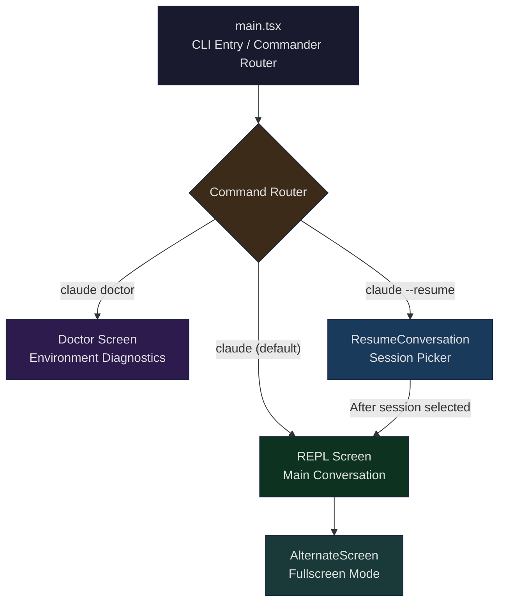
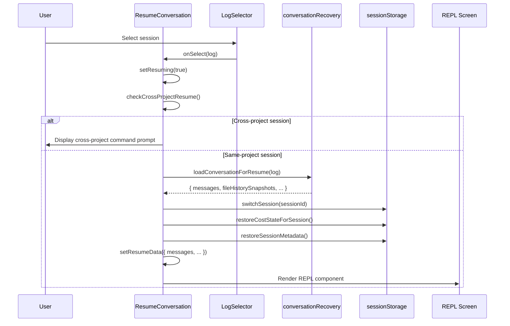
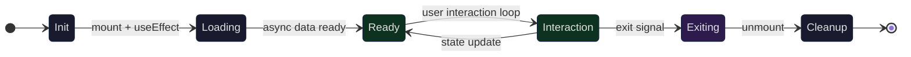

## Setting the Stage

When you type `claude` to start a new session, the terminal is taken over by a fullscreen interactive interface — messages scroll in the upper area, the input box is fixed at the bottom, and the mouse wheel lets you browse history. When you type `/doctor`, the entire interface is replaced by a diagnostic panel. When you run `claude --resume`, a session picker appears, letting you browse and restore past conversations. Three completely different interaction modes, all running in the same terminal window.

How are these different "screens" organized? How do they switch between each other? What fundamentally distinguishes fullscreen mode from normal terminal output? How is the terminal's alternate screen buffer utilized? This article dives into Claude Code's `src/screens/` directory to analyze the architecture of this screen system.

Core questions include:

1. **Screen directory architecture**: How do the three screen files (REPL, Doctor, ResumeConversation) divide responsibilities? What patterns do they share?
2. **Fullscreen mechanism**: How does the `AlternateScreen` component use the terminal's DEC Private Mode 1049 to implement screen switching?
3. **Lifecycle management**: How is screen entry, rendering, interaction, exit, and state restoration orchestrated?
4. **Cross-screen switching**: How does Doctor return to the REPL after diagnostics complete? How does Resume seamlessly transition to the REPL after a session is selected?

## screens/ Directory Architecture

### Three Core Screen Files

Claude Code's screen system lives in the `src/screens/` directory, containing three core files:

```
src/screens/
├── REPL.tsx              # Main interaction screen (~5000 lines)
├── Doctor.tsx            # Diagnostic screen (~500 lines)
└── ResumeConversation.tsx # Session recovery screen (~400 lines)
```

The size difference between these three files reflects their scope of responsibility. REPL is the application's main battleground — message flow, tool execution, permission requests, scroll management, and shortcut handling all live here. Doctor is a one-shot diagnostic panel. ResumeConversation is a transitional screen that hands control to the REPL after selection is complete.



### Shared Patterns Across Screens

Despite the vast difference in complexity between the three screens, they share several key architectural patterns:

**Props-driven lifecycle callbacks.** Each screen receives a callback function to signal "done":

```typescript
// Doctor.tsx (L32-36)
type Props = {
  onDone: (result?: string, options?: {
    display?: CommandResultDisplay;
  }) => void;
};
```

The Doctor screen calls `onDone` when the user presses Enter; ResumeConversation renders an embedded REPL component after loading completes. This pattern makes screen composition declarative — the parent doesn't need to know about the screen's internal state machine.

**React state management + async initialization.** Each screen initiates async operations on mount (Doctor fetches diagnostic info, Resume loads history logs), driving state transitions from loading to ready via `useState` + `useEffect`.

**KeybindingSetup wrapping.** All screens run within a `KeybindingSetup` context, ensuring the shortcut system (Ctrl+C to exit, Enter to confirm, etc.) is available in every screen.

## REPL Screen: The Core Interaction Hub

### Component Scale and Responsibilities

REPL is Claude Code's most central screen and the largest single component file. Its import list spans over 280 lines, covering message management, tool execution, permission control, MCP connections, keybindings, scroll management, voice integration, and nearly every other subsystem.

```typescript
// REPL.tsx (L572-598)
export function REPL({
  commands: initialCommands,
  debug,
  initialTools,
  initialMessages,
  pendingHookMessages,
  initialFileHistorySnapshots,
  initialContentReplacements,
  initialAgentName,
  initialAgentColor,
  mcpClients: initialMcpClients,
  dynamicMcpConfig: initialDynamicMcpConfig,
  autoConnectIdeFlag,
  strictMcpConfig = false,
  systemPrompt: customSystemPrompt,
  appendSystemPrompt,
  onBeforeQuery,
  onTurnComplete,
  disabled = false,
  mainThreadAgentDefinition: initialMainThreadAgentDefinition,
  disableSlashCommands = false,
  taskListId,
  remoteSessionConfig,
  directConnectConfig,
  sshSession,
  thinkingConfig
}: Props): React.ReactNode {
```

The props REPL receives define the entire session's initial state — initial messages (for resume), tool list, MCP clients, system prompt, etc. These props are injected by `main.tsx` at the routing layer.

### Fullscreen Layout: FullscreenLayout

REPL's core layout is managed by the `FullscreenLayout` component. This component divides the terminal viewport into two areas: a scrollable message area and an input area fixed at the bottom.

```typescript
// FullscreenLayout.tsx (L258-266 comment)
/**
 * Layout wrapper for the REPL. In fullscreen mode, puts scrollable
 * content in a sticky-scroll box and pins bottom content via flexbox.
 * Outside fullscreen mode, renders content sequentially so the existing
 * main-screen scrollback rendering works unchanged.
 *
 * Fullscreen mode defaults on for ants (CLAUDE_CODE_NO_FLICKER=0 to opt out)
 * and off for external users (CLAUDE_CODE_NO_FLICKER=1 to opt in).
 */
```

`FullscreenLayout` has two rendering paths. In fullscreen mode, it uses `ScrollBox` (with `stickyScroll`) as the message container, with the bottom area fixed via flexbox `flexShrink={0}`:

```typescript
// FullscreenLayout.tsx (L338-446 simplified)
if (isFullscreenEnvEnabled()) {
  return (
    <PromptOverlayProvider>
      {/* Scrollable message area */}
      <Box flexGrow={1} flexDirection="column" overflow="hidden">
        <StickyPromptHeader />
        <ScrollBox ref={scrollRef} flexGrow={1} stickyScroll={true}>
          <ScrollChromeContext value={chromeCtx}>
            {scrollable}
          </ScrollChromeContext>
          {overlay}
        </ScrollBox>
        <NewMessagesPill count={newMessageCount} onClick={onPillClick} />
        {bottomFloat}
      </Box>
      {/* Fixed bottom area (input box, spinner, permission requests) */}
      <Box flexDirection="column" flexShrink={0} maxHeight="50%">
        <SuggestionsOverlay />
        <DialogOverlay />
        <Box flexDirection="column" overflowY="hidden">
          {bottom}
        </Box>
      </Box>
      {/* Modal layer (slash command dialogs) */}
      {modal && <ModalContext ...> ... </ModalContext>}
    </PromptOverlayProvider>
  );
}
// Non-fullscreen mode: simple sequential rendering
return <>{scrollable}{bottom}{overlay}{modal}</>;
```

In non-fullscreen mode, all content renders sequentially, relying on the terminal's native scroll buffer. This is an important degradation path — used in tmux `-CC` mode or when the user explicitly disables fullscreen.

### AlternateScreen: Terminal Double Buffering

The underlying foundation of fullscreen mode is the terminal's alternate screen buffer (DEC Private Mode 1049). The `AlternateScreen` component encapsulates this mechanism:

```typescript
// AlternateScreen.tsx (L33-56 original TypeScript)
export function AlternateScreen({
  children,
  mouseTracking = true,
}: Props): React.ReactNode {
  const size = useContext(TerminalSizeContext)
  const writeRaw = useContext(TerminalWriteContext)

  useInsertionEffect(() => {
    const ink = instances.get(process.stdout)
    if (!writeRaw) return

    writeRaw(
      ENTER_ALT_SCREEN +        // ESC[?1049h
        '\x1b[2J\x1b[H' +       // Clear screen + cursor home
        (mouseTracking ? ENABLE_MOUSE_TRACKING : ''),
    )
    ink?.setAltScreenActive(true, mouseTracking)

    return () => {
      ink?.setAltScreenActive(false)
      ink?.clearTextSelection()
      writeRaw(
        (mouseTracking ? DISABLE_MOUSE_TRACKING : '') +
        EXIT_ALT_SCREEN          // ESC[?1049l
      )
    }
  }, [writeRaw, mouseTracking])

  return (
    <Box flexDirection="column"
         height={size?.rows ?? 24}
         width="100%" flexShrink={0}>
      {children}
    </Box>
  )
}
```

This code is worth analyzing line by line:

1. **`useInsertionEffect` rather than `useLayoutEffect`**: This is a critical detail. The React reconciler calls `resetAfterCommit` between mutation and layout commit, and Ink's `resetAfterCommit` triggers `onRender`. If `useLayoutEffect` were used, the first `onRender` would fire before the effect — writing a full frame to the main screen. Insertion effects execute during the mutation phase, ensuring the `ENTER_ALT_SCREEN` sequence reaches the terminal before the first frame.

2. **`height={size?.rows ?? 24}`**: Fixes the component height to the terminal row count. This is the core constraint for fullscreen mode — without this limit, `ScrollBox`'s `flexGrow` has no upper bound, the viewport equals content height, and `scrollTop` is always 0.

3. **Cleanup function ordering**: First `setAltScreenActive(false)` notifies the Ink renderer, then `clearTextSelection` clears text selection state, and finally writes `EXIT_ALT_SCREEN` to restore the main screen.

REPL wraps `AlternateScreen` at the root level:

```typescript
// REPL.tsx (L4999-5003)
if (isFullscreenEnvEnabled()) {
  return <AlternateScreen mouseTracking={isMouseTrackingEnabled()}>
      {mainReturn}
    </AlternateScreen>;
}
return mainReturn;
```

## Doctor Screen: /doctor Environment Diagnostics

### Launch Path

The Doctor screen has two entry points:

1. **CLI subcommand**: `claude doctor` launches directly, routed to `doctorHandler` through `main.tsx`'s Commander routing
2. **REPL slash command**: Typing `/doctor` in conversation, where REPL renders the Doctor component in the current context

The CLI entry point's startup code demonstrates the standalone screen launch pattern:

```typescript
// cli/handlers/util.tsx (L72-87)
export async function doctorHandler(root: Root): Promise<void> {
  logEvent('tengu_doctor_command', {});
  await new Promise<void>(resolve => {
    root.render(
      <AppStateProvider>
        <KeybindingSetup>
          <MCPConnectionManager
            dynamicMcpConfig={undefined}
            isStrictMcpConfig={false}
          >
            <DoctorWithPlugins onDone={() => {
              void resolve();
            }} />
          </MCPConnectionManager>
        </KeybindingSetup>
      </AppStateProvider>
    );
  });
  root.unmount();
  process.exit(0);
}
```

Note the pattern here: create a `Promise`, pass `resolve` to the component's `onDone` callback. When the user presses Enter to close the diagnostic panel, the Promise resolves, then the component is unmounted and the process exits. Doctor as a CLI subcommand doesn't need `AlternateScreen` — it's a simple information display panel that relies on the terminal's native scrolling.

### Diagnostic Data Collection

The Doctor component collects multi-dimensional diagnostic data in parallel on mount:

```typescript
// Doctor.tsx (L119-221 simplified)
const [diagnostic, setDiagnostic] = useState(null);
const [agentInfo, setAgentInfo] = useState(null);
const [contextWarnings, setContextWarnings] = useState(null);
const [versionLockInfo, setVersionLockInfo] = useState(null);
const validationErrors = useSettingsErrors();

useEffect(() => {
  // 1. Basic diagnostics: version, install path, package manager, ripgrep status
  getDoctorDiagnostic().then(setDiagnostic);

  (async () => {
    // 2. Agent info: loaded agents, failed parse files
    const userAgentsDir = join(getClaudeConfigHomeDir(), "agents");
    const projectAgentsDir = join(getOriginalCwd(), ".claude", "agents");
    const { activeAgents, allAgents, failedFiles } = agentDefinitions;
    // ...

    // 3. Context warnings: CLAUDE.md size, MCP tool count
    const warnings = await checkContextWarnings(tools, ...);
    setContextWarnings(warnings);

    // 4. Version lock info: PID lock file cleanup
    if (isPidBasedLockingEnabled()) {
      const staleLocksCleaned = cleanupStaleLocks(locksDir);
      const locks = getAllLockInfo(locksDir);
      setVersionLockInfo({ enabled: true, locks, locksDir, staleLocksCleaned });
    }
  })();
}, [toolPermissionContext, tools, agentDefinitions]);
```

The collected diagnostic information is rendered across multiple panels:

| Panel | Content |
|-------|---------|
| Diagnostics | Version number, installation type, path, package manager, ripgrep status |
| Updates | Auto-update status, update permissions, stable/latest version numbers |
| Sandbox | Sandbox isolation status |
| MCP | MCP server configuration parse warnings |
| Keybindings | Keybinding configuration warnings |
| Environment Variables | Environment variable validation errors |
| Version Locks | PID lock file status, stale lock cleanup |
| Agent Parse Errors | Agent definition file parse failures |
| Plugin Errors | Plugin errors |
| Context Usage Warnings | CLAUDE.md size, agent context consumption |

All panels are wrapped with a `Pane` component, displaying `Checking installation status...` placeholder text before diagnostic data has loaded.

### Exit Mechanism

Doctor uses the simplest exit pattern — a `PressEnterToContinue` component with keybinding listeners:

```typescript
// Doctor.tsx (L234-255)
const handleDismiss = () => {
  onDone("Claude Code diagnostics dismissed", { display: "system" });
};

useKeybindings({
  "confirm:yes": handleDismiss,
  "confirm:no": handleDismiss
}, { context: "Confirmation" });

// Render bottom
<Box><PressEnterToContinue /></Box>
```

Both `confirm:yes` and `confirm:no` map to dismiss — whether the user presses Enter or Escape, the panel closes. In CLI mode this triggers `process.exit(0)`; in REPL's `/doctor` mode this returns control to the conversation flow.

## Resume Screen: Session Recovery UI

### Progressive Log Loading

ResumeConversation is a transitional screen — its sole purpose is to let the user select a past session, then hand control to the REPL. But the seemingly simple feature of "selecting a past session" involves an elegant progressive loading design.

```typescript
// ResumeConversation.tsx (L126-136)
React.useEffect(() => {
  loadSameRepoMessageLogsProgressive(worktreePaths).then(result => {
    sessionLogResultRef.current = result;
    logCountRef.current = result.logs.length;
    setLogs(result.logs);
    setLoading(false);
  }).catch(error => {
    logError(error);
    setLoading(false);
  });
}, [worktreePaths]);
```

`loadSameRepoMessageLogsProgressive` only loads session logs from the same repository (including worktrees). Users can switch to "all projects" mode to load cross-repository logs:

```typescript
// ResumeConversation.tsx (L156-168)
const loadLogs = React.useCallback((allProjects: boolean) => {
  setLoading(true);
  const promise = allProjects
    ? loadAllProjectsMessageLogsProgressive()
    : loadSameRepoMessageLogsProgressive(worktreePaths);
  promise.then(result => {
    sessionLogResultRef.current = result;
    logCountRef.current = result.logs.length;
    setLogs(result.logs);
  }).finally(() => setLoading(false));
}, [worktreePaths]);
```

Furthermore, when the user scrolls to the bottom of the list, `loadMoreLogs` loads additional history on demand:

```typescript
// ResumeConversation.tsx (L137-155)
const loadMoreLogs = React.useCallback((count: number) => {
  const ref = sessionLogResultRef.current;
  if (!ref || ref.nextIndex >= ref.allStatLogs.length) return;
  void enrichLogs(ref.allStatLogs, ref.nextIndex, count).then(result => {
    ref.nextIndex = result.nextIndex;
    if (result.logs.length > 0) {
      const offset = logCountRef.current;
      result.logs.forEach((log, i) => { log.value = offset + i; });
      setLogs(prev => prev.concat(result.logs));
      logCountRef.current += result.logs.length;
    } else if (ref.nextIndex < ref.allStatLogs.length) {
      loadMoreLogs(count); // Recursively load until valid logs are found
    }
  });
}, []);
```

### Session Selection and Recovery Flow

When the user selects a session from `LogSelector`, it triggers the `onSelect` callback — the most complex part of the entire recovery flow:



Key steps in the recovery flow (L178-292):

1. **Cross-project detection**: `checkCrossProjectResume` checks whether the selected session originates from a different directory. For cross-project sessions, it displays a prompt command (already copied to clipboard) for the user to resume in the correct directory.

2. **Message loading**: `loadConversationForResume` deserializes message history from JSONL files.

3. **Session switching**: `switchSession` updates the global session ID; `restoreCostStateForSession` restores the API call cost statistics for that session.

4. **Agent restoration**: `restoreAgentFromSession` restores agent definitions and color schemes based on session metadata.

5. **State transition**: `setResumeData` triggers a React re-render, and the conditional branch switches from `LogSelector` to the REPL component.

The conditional rendering logic for state transitions:

```typescript
// ResumeConversation.tsx (L293-314)
if (crossProjectCommand) {
  return <CrossProjectMessage command={crossProjectCommand} />;
}
if (resumeData) {
  return <REPL
    debug={debug}
    commands={commands}
    initialMessages={resumeData.messages}
    initialFileHistorySnapshots={resumeData.fileHistorySnapshots}
    // ... all recovery data injected via props to REPL
  />;
}
if (loading) {
  return <Box><Spinner /><Text> Loading conversations...</Text></Box>;
}
if (resuming) {
  return <Box><Spinner /><Text> Resuming conversation...</Text></Box>;
}
return <LogSelector logs={filteredLogs} ... />;
```

This is a state-machine-driven rendering pattern: `loading` -> `LogSelector` -> `resuming` -> `REPL` (or `CrossProjectMessage`). Each state corresponds to a completely different UI.

## Screen Lifecycle: Entry / Render / Interact / Exit / State Restore

### Lifecycle Model

The three screens each have different lifecycle models, but they can be abstracted into unified phases:



**Doctor has the simplest lifecycle**:

| Phase | Behavior |
|-------|----------|
| Init | mount, register keybindings |
| Loading | `getDoctorDiagnostic()` + parallel data fetching |
| Ready | Render diagnostic panel |
| Interaction | Only listens for Enter/Escape |
| Exiting | Calls `onDone`, triggers unmount |

**ResumeConversation has a transitional lifecycle**:

| Phase | Behavior |
|-------|----------|
| Init | mount |
| Loading | `loadSameRepoMessageLogsProgressive()` |
| Ready | Render LogSelector |
| Interaction | List navigation, search, cross-project switching |
| Exiting | Not a true exit — switches to rendering REPL |

**REPL has a long-lived lifecycle**:

| Phase | Behavior |
|-------|----------|
| Init | mount, enter alt screen, initialize 200+ state variables |
| Loading | Parallel loading of hooks, MCP connections, tool pool |
| Ready | FullscreenLayout rendering |
| Interaction | Infinite loop: user input -> API query -> tool execution -> message rendering |
| Exiting | Execute session end hooks -> exit alt screen -> unmount |

### AlternateScreen Entry and Exit

Fullscreen mode entry and exit are accomplished through terminal escape sequences. On entry:

```
ESC[?1049h    -> Save main screen cursor position, switch to alternate screen buffer
ESC[2J        -> Clear alternate screen
ESC[H         -> Move cursor to (0,0)
ESC[?1000h    -> Enable mouse click tracking
ESC[?1002h    -> Enable mouse button event tracking
ESC[?1006h    -> Enable SGR extended mouse protocol
```

On exit:

```
ESC[?1006l    -> Disable SGR mouse
ESC[?1002l    -> Disable button event tracking
ESC[?1000l    -> Disable mouse tracking
ESC[?1049l    -> Switch back to main screen buffer, restore cursor position
```

The terminal maintains two independent screen buffers. The main screen's content is saved when entering the alt screen and automatically restored when exiting. This means that after Claude Code exits, the previous terminal content (command history, other programs' output) remains intact.

## Switching Mechanism with the Main Conversation Flow

### main.tsx Routing Layer

Screen switching occurs at two levels: routing at startup and mode switching at runtime.

Startup routing is controlled by `main.tsx`. It uses Commander.js to parse command-line arguments and determines which screen to render based on subcommands and flags:

```typescript
// main.tsx routing logic (simplified)

// claude doctor -> standalone diagnostic screen
program.command('doctor').action(async () => {
  const root = await createRoot(getBaseRenderOptions(false));
  await doctorHandler(root);  // render Doctor -> onDone -> unmount -> exit
});

// claude --resume -> session recovery screen or direct REPL entry
if (hasResumeFlag) {
  if (specificSessionId) {
    // Directly resume specified session -> launchRepl
    await launchRepl(root, appProps, {
      initialMessages: resumedMessages,
      // ...
    }, renderAndRun);
  } else {
    // Show picker -> launchResumeChooser
    await launchResumeChooser(root, appProps, worktreePaths, {
      initialSearchQuery: searchTerm,
      forkSession: options.forkSession,
      // ...
    });
  }
} else {
  // Default path -> launchRepl (new session)
  await launchRepl(root, appProps, sessionConfig, renderAndRun);
}
```

`launchRepl` and `launchResumeChooser` encapsulate React tree construction and rendering:

```typescript
// replLauncher.tsx (L12-22)
export async function launchRepl(
  root: Root,
  appProps: AppWrapperProps,
  replProps: REPLProps,
  renderAndRun: (root: Root, element: React.ReactNode) => Promise<void>,
): Promise<void> {
  const { App } = await import('./components/App.js');
  const { REPL } = await import('./screens/REPL.js');
  await renderAndRun(root, <App {...appProps}><REPL {...replProps} /></App>);
}
```

Note the use of `import()` — both REPL and App are dynamically imported. This allows the Doctor subcommand to run without loading the REPL code, saving startup time.

### Runtime Screen Switching

During REPL execution, the `/doctor` slash command doesn't replace the entire React tree — it renders the Doctor component within the REPL's existing context. Doctor's `onDone` callback injects the result as a system message into the conversation flow:

```typescript
// Doctor within REPL's onDone
onDone: (result?: string, options?) => {
  onDone("Claude Code diagnostics dismissed", { display: "system" });
}
```

In this pattern, Doctor doesn't need its own `AppStateProvider` or `KeybindingSetup` — it reuses the REPL's existing context. This is also why Doctor's CLI entry point needs to manually wrap these Providers, while REPL's built-in `/doctor` does not.

Transcript mode (Ctrl+O) is another form of runtime switching. REPL switches rendered content within the same `AlternateScreen`:

```typescript
// REPL.tsx (L4484-4489)
if (transcriptScrollRef) {
  return <AlternateScreen mouseTracking={isMouseTrackingEnabled()}>
      {transcriptReturn}
    </AlternateScreen>;
}
return transcriptReturn;
```

This ensures the alt buffer remains unchanged during mode switching — the React reconciler sees the same type of `AlternateScreen` component and only updates the children.

## Fullscreen Mode Environment Compatibility

### tmux -CC Detection

Fullscreen mode is not available in all terminal environments. The trickiest compatibility issue comes from tmux's `-CC` mode (iTerm2 integration mode). In this mode, tmux's alt screen + mouse tracking can corrupt terminal state.

`src/utils/fullscreen.ts` implements multi-layer detection:

```typescript
// fullscreen.ts (L29-86)
function isTmuxControlModeEnvHeuristic(): boolean {
  if (!process.env.TMUX) return false;
  if (process.env.TERM_PROGRAM !== 'iTerm.app') return false;
  const term = process.env.TERM ?? '';
  return !term.startsWith('screen') && !term.startsWith('tmux');
}

function probeTmuxControlModeSync(): void {
  tmuxControlModeProbed = isTmuxControlModeEnvHeuristic();
  if (tmuxControlModeProbed) return;
  if (!process.env.TMUX) return;
  if (process.env.TERM_PROGRAM) return; // Non-iTerm -> no probe needed
  // SSH scenario: TERM_PROGRAM doesn't propagate, need to query tmux directly
  let result;
  try {
    result = spawnSync('tmux',
      ['display-message', '-p', '#{client_control_mode}'],
      { encoding: 'utf8', timeout: 2000 });
  } catch { return; }
  if (result.status !== 0) return;
  tmuxControlModeProbed = result.stdout.trim() === '1';
}
```

Detection has two layers:

1. **Environment variable heuristic** (zero process overhead): If `TMUX` is set and `TERM_PROGRAM` is `iTerm.app`, and `TERM` doesn't start with `screen`/`tmux`, then it's identified as `-CC` mode.
2. **Synchronous tmux probe** (~5ms): Only triggered in SSH scenarios (where `TERM_PROGRAM` doesn't propagate), querying tmux's `client_control_mode` variable via `spawnSync`.

Using `spawnSync` (synchronous) rather than the async version is deliberate — this result determines whether to enter fullscreen. Async probing once caused a race condition: React had already rendered the alt screen before the probe completed, killing the user's mouse wheel.

### Environment Variable Control

Fullscreen mode is controlled via the `CLAUDE_CODE_NO_FLICKER` environment variable:

```typescript
// fullscreen.ts (L112-129)
export function isFullscreenEnvEnabled(): boolean {
  if (isEnvDefinedFalsy(process.env.CLAUDE_CODE_NO_FLICKER)) return false;
  if (isEnvTruthy(process.env.CLAUDE_CODE_NO_FLICKER)) return true;
  if (isTmuxControlMode()) {
    // Auto-disable, log the reason
    return false;
  }
  return process.env.USER_TYPE === 'ant'; // Enabled by default for internal users
}
```

Additional fine-grained controls include:

- `CLAUDE_CODE_DISABLE_MOUSE`: Keeps alt screen but disables mouse tracking (solves copy conflicts in tmux)
- `CLAUDE_CODE_DISABLE_MOUSE_CLICKS`: Disables mouse clicks but keeps scroll wheel (prevents accidental clicks)

## Portable Patterns

Claude Code's screen system provides several reusable design patterns for terminal applications:

### Pattern 1: Props Callback-Driven Screen Lifecycle

Each screen receives an `onDone` callback, and the parent waits for completion via `Promise`. This pattern makes screens reusable in different contexts (standalone CLI command, REPL embedded, test environment).

```typescript
// General pattern
await new Promise<void>(resolve => {
  root.render(
    <Providers>
      <ScreenComponent onDone={() => resolve()} />
    </Providers>
  );
});
root.unmount();
```

### Pattern 2: AlternateScreen Double Buffering

Leveraging the terminal alt screen buffer for fullscreen applications, with automatic content restoration on exit. The key is using `useInsertionEffect` to ensure escape sequences reach the terminal before the first frame renders.

### Pattern 3: Progressive State Machine Rendering

ResumeConversation's `loading -> selector -> resuming -> REPL` state machine demonstrates how to implement multi-phase UI transitions within a single component, with each phase rendering a completely different component tree.

### Pattern 4: Environment Compatibility Degradation

Fullscreen mode's multi-layer detection (environment variable heuristic -> synchronous process probe -> environment variable override) is a reusable terminal capability detection strategy. In environments that can't use fullscreen, the system degrades to sequential rendering mode with no loss of functionality.

### Pattern 5: Screen Reuse and Context Inheritance

Doctor reuses REPL's Provider context (AppState, KeybindingSetup, MCPConnectionManager) when running inside the REPL, but brings its own Providers in CLI mode. This design allows the same component to work in both scenarios without modifying the component itself.

## Summary

Claude Code's screen system is a carefully designed multi-layer architecture:

- **Bottom layer**: The `AlternateScreen` component uses terminal DEC 1049 private mode for double buffering, with `useInsertionEffect` guaranteeing correct timing
- **Layout layer**: `FullscreenLayout` divides the terminal viewport into a scrollable area and a fixed bottom area, using flexbox for adaptive layout
- **Screen layer**: Three screen files each serve their purpose — REPL handles the main interaction loop, Doctor provides diagnostic information, and ResumeConversation manages session recovery transitions
- **Routing layer**: `main.tsx` uses Commander routing to determine which screen to launch, with `replLauncher.tsx` and `dialogLaunchers.tsx` encapsulating React tree construction
- **Compatibility layer**: tmux `-CC` detection, environment variable control, and non-fullscreen degradation ensure the system works across various terminal environments

The biggest design insight of this system is: **the terminal's alternate screen buffer is equivalent to a browser's "page navigation"**. Entering alt screen is like opening a new page (the old page is saved), and exiting is like pressing the back button (the old page is restored). Claude Code builds a React-driven screen management system on this foundation, giving terminal applications a multi-view experience similar to SPAs.
