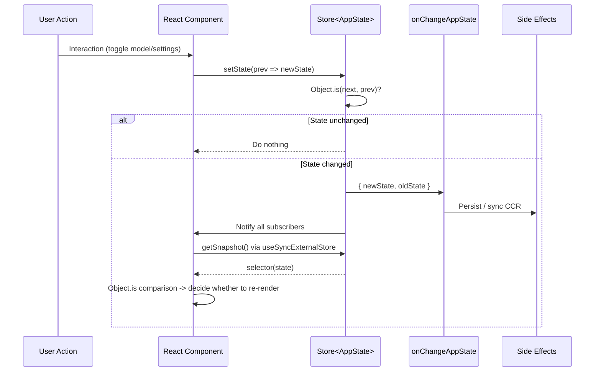
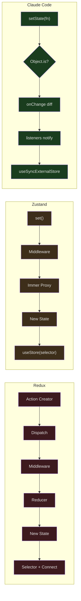

## The Problem

React state management is a perennial topic in frontend engineering. From Redux to MobX, from Zustand to Jotai, state management libraries keep multiplying. Yet Claude Code chose a surprising path -- implementing a complete state management system in under 35 lines of code, without introducing any third-party library.

This is not toy code. Claude Code's `AppState` contains over 80 fields, spanning settings, MCP connections, plugins, permissions, bridge state, team collaboration, and more. How can a 35-line Store support such a massive state tree? Why did it choose not to use Redux? What tradeoffs lie behind this decision?

## The Complete Store Implementation

Let's start with the code. Here is the entire contents of `src/state/store.ts`:

```typescript
// src/state/store.ts
// Lines 1-34
type Listener = () => void
type OnChange<T> = (args: { newState: T; oldState: T }) => void

export type Store<T> = {
  getState: () => T
  setState: (updater: (prev: T) => T) => void
  subscribe: (listener: Listener) => () => void
}

export function createStore<T>(
  initialState: T,
  onChange?: OnChange<T>,
): Store<T> {
  let state = initialState
  const listeners = new Set<Listener>()

  return {
    getState: () => state,

    setState: (updater: (prev: T) => T) => {
      const prev = state
      const next = updater(prev)
      if (Object.is(next, prev)) return
      state = next
      onChange?.({ newState: next, oldState: prev })
      for (const listener of listeners) listener()
    },

    subscribe: (listener: Listener) => {
      listeners.add(listener)
      return () => listeners.delete(listener)
    },
  }
}
```

34 lines. No middleware, no devtools, no immer. Let's break down layer by layer why this is already enough.

## Architecture Overview

```mermaid
graph TD
  A["createStore(initialState, onChange)"] --> B["Store&lt;AppState&gt;"]
  B --> C["getState()"]
  B --> D["setState(updater)"]
  B --> E["subscribe(listener)"]

  D --> F{"Object.is(next, prev)?"}
  F -- "Same" --> G["Skip, no notification"]
  F -- "Different" --> H["Update state"]
  H --> I["onChange({ newState, oldState })"]
  I --> J["Notify all listeners"]

  E --> K["listeners.add()"]
  K --> L["Return unsubscribe()"]

  style A fill:#1e3a5f,color:#e0e0e0
  style B fill:#1e3a5f,color:#e0e0e0
  style F fill:#3d2e1a,color:#e0e0e0
  style G fill:#3d1a1e,color:#e0e0e0
  style H fill:#1a3d1e,color:#e0e0e0
  style I fill:#1a3d1e,color:#e0e0e0
  style J fill:#1a3d1e,color:#e0e0e0
```



### Three Core APIs

1. **`getState()`** -- Synchronously retrieves the current state snapshot with zero overhead.
2. **`setState(updater)`** -- Accepts a pure function `(prev) => next`. If `Object.is(next, prev)` is true, nothing happens.
3. **`subscribe(listener)`** -- Registers a parameterless callback and returns an unsubscribe function.

This perfectly matches the contract of `useSyncExternalStore` -- the Hook that React 18 specifically designed for this kind of external Store.

## Object.is Change Detection: The Depth Behind One Line

```typescript
// src/state/store.ts Line 23
if (Object.is(next, prev)) return
```

This line looks simple but carries profound implications.

`Object.is` performs a reference equality comparison -- if the `updater` returns the same object reference, the state is considered unchanged. This means:

1. **Immutable updates are enforced**. If you want to change state, you must return a new object: `prev => ({ ...prev, verbose: true })`.
2. **Zero cost when nothing changes**. If the updater determines no update is needed, it can simply `return prev`, and the Store won't trigger any notifications.
3. **No deep comparison overhead**. Redux's `shallowEqual`, Zustand's `Object.is` selector comparison -- Claude Code places this check at the topmost level.

Here's a real-world optimization example from `enterTeammateView` in `src/state/teammateViewHelpers.ts`:

```typescript
// src/state/teammateViewHelpers.ts Lines 51-80
export function enterTeammateView(
  taskId: string,
  setAppState: (updater: (prev: AppState) => AppState) => void,
): void {
  logEvent('tengu_transcript_view_enter', {})
  setAppState(prev => {
    const task = prev.tasks[taskId]
    const prevId = prev.viewingAgentTaskId
    const prevTask = prevId !== undefined ? prev.tasks[prevId] : undefined
    const switching =
      prevId !== undefined &&
      prevId !== taskId &&
      isLocalAgent(prevTask) &&
      prevTask.retain
    const needsRetain =
      isLocalAgent(task) && (!task.retain || task.evictAfter !== undefined)
    const needsView =
      prev.viewingAgentTaskId !== taskId ||
      prev.viewSelectionMode !== 'viewing-agent'
    // Key: if nothing needs to change, return prev directly
    if (!needsRetain && !needsView && !switching) return prev
    // ...construct new state
  })
}
```

The `if (!needsRetain && !needsView && !switching) return prev` on line 66 is a common pattern -- performing conditional checks inside the updater to avoid unnecessary state updates. Thanks to the `Object.is` check, returning `prev` means zero side effects.

## React Context and useSyncExternalStore

The consumer side of the Store is implemented in `src/state/AppState.tsx`.

### The Provider Layer

```typescript
// src/state/AppState.tsx Lines 27-28, 37-110
export const AppStoreContext = React.createContext<AppStateStore | null>(null)

export function AppStateProvider({ children, initialState, onChangeAppState }) {
  // Prevent nesting
  const hasAppStateContext = useContext(HasAppStateContext)
  if (hasAppStateContext) {
    throw new Error("AppStateProvider can not be nested within another AppStateProvider")
  }

  const [store] = useState(
    () => createStore(initialState ?? getDefaultAppState(), onChangeAppState)
  )

  // Check bypass permissions state on initial mount
  useEffect(() => {
    const { toolPermissionContext } = store.getState()
    if (toolPermissionContext.isBypassPermissionsModeAvailable &&
        isBypassPermissionsModeDisabled()) {
      store.setState(prev => ({
        ...prev,
        toolPermissionContext: createDisabledBypassPermissionsContext(
          prev.toolPermissionContext
        )
      }))
    }
  }, [])

  // Watch for settings file changes
  const onSettingsChange = useEffectEvent(
    source => applySettingsChange(source, store.setState)
  )
  useSettingsChange(onSettingsChange)

  return (
    <HasAppStateContext.Provider value={true}>
      <AppStoreContext.Provider value={store}>
        <MailboxProvider>
          <VoiceProvider>{children}</VoiceProvider>
        </MailboxProvider>
      </AppStoreContext.Provider>
    </HasAppStateContext.Provider>
  )
}
```

Key design decisions:

1. **The Store is created inside `useState` with lazy initialization**, ensuring only one Store instance exists throughout the application lifecycle.
2. **Nesting detection** -- `HasAppStateContext` prevents accidentally creating multiple Providers.
3. **`onChangeAppState` callback** -- Injected at creation time to handle side effects of state changes.
4. **`useSettingsChange`** -- Watches for external changes to configuration files (filesystem, environment variables) and injects them into the Store.

### The useAppState Hook

```typescript
// src/state/AppState.tsx Lines 117-160
function useAppStore(): AppStateStore {
  const store = useContext(AppStoreContext)
  if (!store) {
    throw new ReferenceError(
      'useAppState/useSetAppState cannot be called outside of an <AppStateProvider />'
    )
  }
  return store
}

/**
 * Subscribe to a slice of AppState. Only re-renders when
 * the selected value changes (via Object.is comparison).
 */
export function useAppState(selector) {
  const store = useAppStore()
  const getSnapshot = () => {
    const state = store.getState()
    const selected = selector(state)
    return selected
  }
  return useSyncExternalStore(store.subscribe, getSnapshot, getSnapshot)
}
```

This is the core consumer API for the entire state management system. `useSyncExternalStore` is a low-level Hook introduced in React 18 that accepts three parameters:

1. `subscribe` -- Register for change notifications
2. `getSnapshot` -- Get the current value
3. `getServerSnapshot` -- SSR snapshot (reuses getSnapshot here)

When the Store emits a notification, React calls `getSnapshot` to get the new value and compares it with the previous one via `Object.is`. If the values are the same, rendering is skipped; if different, a component re-render is triggered.

This enables fine-grained update capabilities:

```typescript
// Only re-renders when verbose changes
const verbose = useAppState(s => s.verbose)

// Only re-renders when the model changes
const model = useAppState(s => s.mainLoopModel)

// Reference-stable sub-object -- only re-renders when the promptSuggestion reference changes
const { text, promptId } = useAppState(s => s.promptSuggestion)
```

## Complete Data Flow Path



## onChangeAppState: The Side Effect Layer for State Changes

`src/state/onChangeAppState.ts` is the implementation of the Store's `onChange` callback. This is the only centralized location in the entire system where state change side effects are handled.

```typescript
// src/state/onChangeAppState.ts Lines 43-171
export function onChangeAppState({
  newState,
  oldState,
}: {
  newState: AppState
  oldState: AppState
}) {
  // Sync permission mode to CCR and SDK
  const prevMode = oldState.toolPermissionContext.mode
  const newMode = newState.toolPermissionContext.mode
  if (prevMode !== newMode) {
    const prevExternal = toExternalPermissionMode(prevMode)
    const newExternal = toExternalPermissionMode(newMode)
    if (prevExternal !== newExternal) {
      notifySessionMetadataChanged({
        permission_mode: newExternal,
        is_ultraplan_mode: isUltraplan,
      })
    }
    notifyPermissionModeChanged(newMode)
  }

  // Persist model changes to settings
  if (newState.mainLoopModel !== oldState.mainLoopModel) {
    if (newState.mainLoopModel === null) {
      updateSettingsForSource('userSettings', { model: undefined })
      setMainLoopModelOverride(null)
    } else {
      updateSettingsForSource('userSettings', { model: newState.mainLoopModel })
      setMainLoopModelOverride(newState.mainLoopModel)
    }
  }

  // Persist expandedView
  if (newState.expandedView !== oldState.expandedView) {
    saveGlobalConfig(current => ({
      ...current,
      showExpandedTodos: newState.expandedView === 'tasks',
      showSpinnerTree: newState.expandedView === 'teammates',
    }))
  }

  // Persist verbose
  if (newState.verbose !== oldState.verbose) {
    saveGlobalConfig(current => ({ ...current, verbose: newState.verbose }))
  }

  // Clear auth caches when settings change
  if (newState.settings !== oldState.settings) {
    clearApiKeyHelperCache()
    clearAwsCredentialsCache()
    clearGcpCredentialsCache()
    if (newState.settings.env !== oldState.settings.env) {
      applyConfigEnvironmentVariables()
    }
  }
}
```

The elegance of this pattern lies in its **separation of concerns**:

1. The Store itself knows nothing about side effect logic.
2. `onChangeAppState` acts as a pure diff-handler, executing only when state actually changes.
3. Each side effect block is independent -- permission mode sync, model persistence, config cache clearing -- they don't interfere with each other.

Compared to Redux's middleware pattern, there are no action type strings, no dispatch chains, no sagas/thunks. Simply comparing `oldState.x !== newState.x` is clear and unambiguous.

## AppState Structure Design

Let's look at the `AppState` type defined in `src/state/AppStateStore.ts`. It's a massive type definition spanning roughly 450 lines:

```typescript
// src/state/AppStateStore.ts Lines 89-158 (excerpt)
export type AppState = DeepImmutable<{
  settings: SettingsJson
  verbose: boolean
  mainLoopModel: ModelSetting
  statusLineText: string | undefined
  expandedView: 'none' | 'tasks' | 'teammates'
  kairosEnabled: boolean
  toolPermissionContext: ToolPermissionContext
  replBridgeEnabled: boolean
  replBridgeConnected: boolean
  replBridgeSessionActive: boolean
  // ... more bridge state fields
}> & {
  // Fields excluded from DeepImmutable (contain function types)
  tasks: { [taskId: string]: TaskState }
  agentNameRegistry: Map<string, AgentId>
  mcp: {
    clients: MCPServerConnection[]
    tools: Tool[]
    commands: Command[]
    resources: Record<string, ServerResource[]>
    pluginReconnectKey: number
  }
  plugins: {
    enabled: LoadedPlugin[]
    disabled: LoadedPlugin[]
    commands: Command[]
    errors: PluginError[]
    installationStatus: { ... }
    needsRefresh: boolean
  }
  // ... more fields
}
```

Note the `DeepImmutable<...> & { ... }` structure:

- **DeepImmutable portion** -- Simple value type fields where the TypeScript compiler guarantees immutability.
- **Non-DeepImmutable portion** -- Fields containing function types (like `AbortController`) or special collections (like `Map`, `Set`), where immutability is managed manually.

### Default State Factory

```typescript
// src/state/AppStateStore.ts Lines 456-569
export function getDefaultAppState(): AppState {
  const initialMode: PermissionMode =
    teammateUtils.isTeammate() && teammateUtils.isPlanModeRequired()
      ? 'plan'
      : 'default'

  return {
    settings: getInitialSettings(),
    tasks: {},
    agentNameRegistry: new Map(),
    verbose: false,
    mainLoopModel: null,
    toolPermissionContext: {
      ...getEmptyToolPermissionContext(),
      mode: initialMode,
    },
    mcp: {
      clients: [],
      tools: [],
      commands: [],
      resources: {},
      pluginReconnectKey: 0,
    },
    plugins: {
      enabled: [],
      disabled: [],
      commands: [],
      errors: [],
      installationStatus: { marketplaces: [], plugins: [] },
      needsRefresh: false,
    },
    thinkingEnabled: shouldEnableThinkingByDefault(),
    promptSuggestionEnabled: shouldEnablePromptSuggestion(),
    // ... 30+ more default values
  }
}
```

Note that the default values are not hardcoded constants -- `getInitialSettings()` reads merged settings from the configuration system, and `shouldEnableThinkingByDefault()` determines whether to enable thinking mode based on the environment. This means the Store's initial state itself is dynamically computed.

## The Selectors Pattern

`src/state/selectors.ts` demonstrates how to derive computed values from AppState:

```typescript
// src/state/selectors.ts Lines 18-40
export function getViewedTeammateTask(
  appState: Pick<AppState, 'viewingAgentTaskId' | 'tasks'>,
): InProcessTeammateTaskState | undefined {
  const { viewingAgentTaskId, tasks } = appState

  if (!viewingAgentTaskId) return undefined
  const task = tasks[viewingAgentTaskId]
  if (!task) return undefined
  if (!isInProcessTeammateTask(task)) return undefined

  return task
}

// src/state/selectors.ts Lines 59-76
export function getActiveAgentForInput(appState: AppState): ActiveAgentForInput {
  const viewedTask = getViewedTeammateTask(appState)
  if (viewedTask) {
    return { type: 'viewed', task: viewedTask }
  }

  const { viewingAgentTaskId, tasks } = appState
  if (viewingAgentTaskId) {
    const task = tasks[viewingAgentTaskId]
    if (task?.type === 'local_agent') {
      return { type: 'named_agent', task }
    }
  }

  return { type: 'leader' }
}
```

Selectors use `Pick<AppState, ...>` to explicitly declare their dependencies -- this serves not only as type safety but also as documentation. You can see at a glance that `getViewedTeammateTask` depends on only two fields.

## Comparison with Redux/Zustand



| Feature | Redux | Zustand | Claude Code |
|---------|-------|---------|-------------|
| Code size | ~2000 lines core | ~400 lines core | 34 lines |
| Action types | String constants | Not needed | Not needed |
| Middleware | Chained | Chained | onChange callback |
| Immutability | Manual / Immer | Optional Immer | Manual + TypeScript |
| DevTools | Built-in | Built-in | None (not needed) |
| Change detection | shallowEqual | Object.is | Object.is |
| React integration | connect/useSelector | useStore | useSyncExternalStore |
| Side effects | saga/thunk | middleware | onChangeAppState |
| Dependencies | react-redux | zustand | Zero dependencies |

### Why Not Redux?

1. **CLI applications don't need undo/redo** -- Redux's action log provides no practical value in a CLI.
2. **No multi-store interactions** -- Claude Code has only one global Store.
3. **No complex async flows** -- No need for saga generators or thunk's nested dispatches.
4. **Startup performance** -- A 35-line Store doesn't need to load any external dependencies.

### Why Not Zustand?

Zustand is actually very close to Claude Code's design. But a careful comparison reveals:

1. **Zustand's `set` accepts partial state** -- Claude Code enforces `prev => next` functional updates to prevent accidental overwrites.
2. **Zustand's `subscribe` supports selectors** -- Claude Code places selectors at the `useSyncExternalStore` layer, closer to React's native model.
3. **Zero dependencies** -- Claude Code's Store doesn't import any packages. For CLI application startup speed, every dependency saved is one less module to load.

## Hot Reloading of Settings Changes

The `useSettingsChange` in `AppStateProvider` watches for configuration file changes:

```typescript
// src/state/AppState.tsx Lines 83-91
const onSettingsChange = useEffectEvent(
  source => applySettingsChange(source, store.setState)
)
useSettingsChange(onSettingsChange)
```

When a user edits `~/.claude/settings.json` in another terminal, or an enterprise admin pushes a remote configuration:

1. The filesystem watcher detects the change
2. `useSettingsChange` triggers the callback
3. `applySettingsChange` constructs a new settings object
4. `store.setState` updates the state
5. `onChangeAppState` detects that `newState.settings !== oldState.settings`
6. Auth caches are cleared and environment variables are reapplied

The entire chain requires no manual event dispatching -- from file change to UI update, everything happens automatically.

## DCE and Conditional Providers

AppState.tsx includes a feature flag-controlled conditional load:

```typescript
// src/state/AppState.tsx Lines 14-19
const VoiceProvider: (props: {
  children: React.ReactNode;
}) => React.ReactNode = feature('VOICE_MODE')
  ? require('../context/voice.js').VoiceProvider
  : ({ children }) => children;
```

When the `VOICE_MODE` feature flag is disabled, `VoiceProvider` is replaced with a passthrough component. Bun's compiler replaces `feature('VOICE_MODE')` with `false` at build time, and then through dead code elimination, the entire `require('../context/voice.js')` never appears in the final bundle.

This means the Provider wrapper layer in `AppStateProvider` is variable -- depending on the build configuration, it may include or exclude Voice, Mailbox, and other contexts.

## Performance Characteristics

### Batch Updates

React 18 enables automatic batching by default. Multiple `setState` calls within the same event loop tick trigger only a single re-render. Claude Code's Store is naturally compatible with this mechanism -- after `subscribe`'s listener fires, React's scheduler merges the renders.

### Selective Subscriptions

```typescript
// Good: only re-renders when verbose changes
const verbose = useAppState(s => s.verbose)

// Bad: re-renders on every state change
// const state = useAppState(s => s) // not allowed
```

The JSDoc for `useAppState` explicitly warns against returning the entire state object. The source code even includes a runtime check (enabled in development mode):

```typescript
// src/state/AppState.tsx Lines 150-152
if (false && state === selected) {
  throw new Error(
    `Your selector returned the original state, which is not allowed.`
  )
}
```

`if (false && ...)` means this check is completely eliminated in production builds, but can be enabled during development by modifying the condition.

### The No-New-Object Rule

The `useAppState` documentation emphasizes:

> Do NOT return new objects from the selector -- Object.is will always see them as changed.

```typescript
// Good: select an existing sub-object reference
const { text, promptId } = useAppState(s => s.promptSuggestion)

// Bad: creates a new object every time
// const data = useAppState(s => ({ text: s.promptSuggestion.text }))
```

This constraint stems from how `useSyncExternalStore` works -- every time the Store emits a notification, React calls `getSnapshot` and compares it with the previous return value via `Object.is`. If the selector returns a new object, `Object.is` will always be false, leading to infinite re-renders.

## In Practice: The Complete State Update Path

Let's trace the complete path using toggling verbose mode as an example:

1. **User action**: Toggle verbose in settings

2. **setState call**:
```typescript
store.setState(prev => ({ ...prev, verbose: !prev.verbose }))
```

3. **Inside the Store**:
   - `Object.is(next, prev)` -> false (new object)
   - Update the internal `state` reference
   - Call `onChange({ newState: next, oldState: prev })`
   - Iterate through `listeners` to notify

4. **onChangeAppState**:
```typescript
if (newState.verbose !== oldState.verbose) {
  saveGlobalConfig(current => ({ ...current, verbose: newState.verbose }))
}
```

5. **React update**:
   - `useSyncExternalStore` receives notification
   - Calls `selector(store.getState())` to get the new `verbose` value
   - `Object.is(true, false)` -> false -> triggers re-render

6. **UI update**: Component renders with the new verbose value

The entire process involves no action type strings, no reducer switch-cases, no middleware pipelines. A single setState call does all the work.

## Summary

Claude Code's state management is a triumph of minimalism:

- **34 lines of core code** -- `createStore` provides complete subscription/update/detection functionality
- **Zero external dependencies** -- No Redux, Zustand, or MobX imported
- **`Object.is` short-circuit** -- Intercepts invalid updates at the earliest opportunity
- **`useSyncExternalStore` integration** -- Leverages React 18's native API for fine-grained subscriptions
- **`onChangeAppState` centralized side effects** -- Replaces middleware by handling all state synchronization in a single function

Not every project needs Redux. When your application has a single Store, doesn't need time-travel debugging, and doesn't need complex async flows, 34 lines of code is the best state management library.
