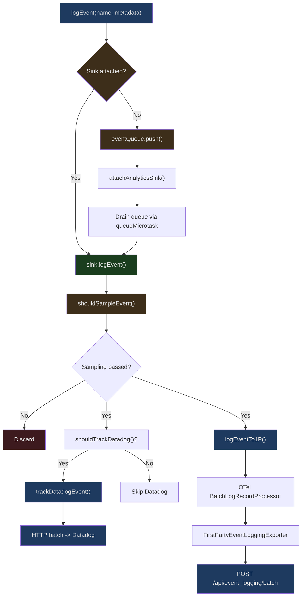
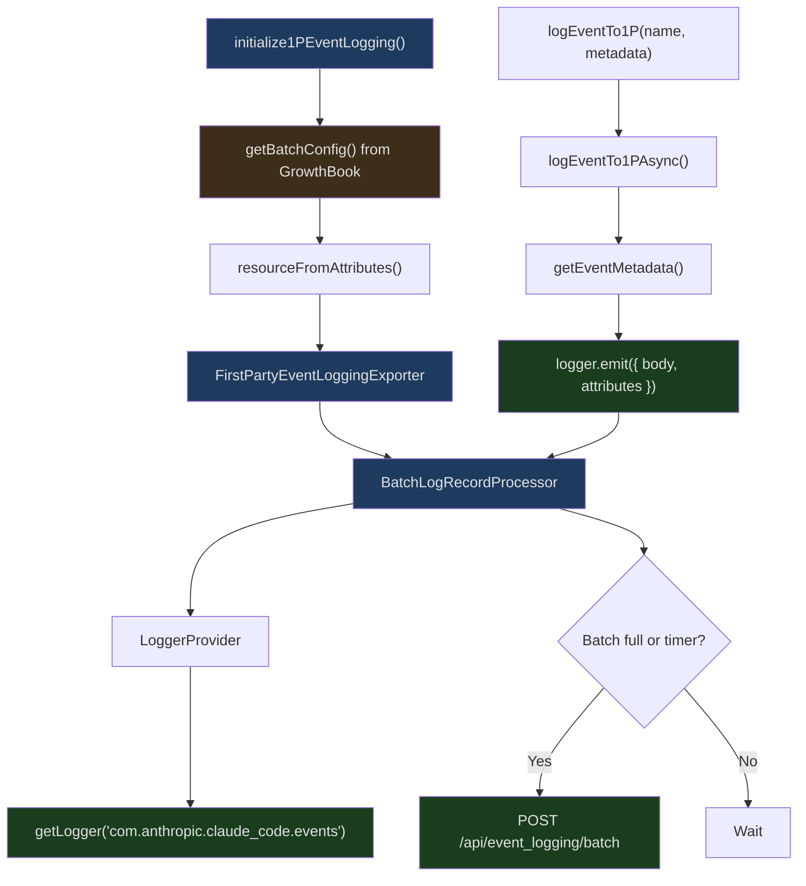
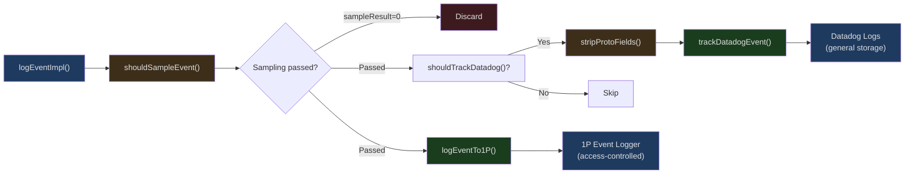

## The Problem

Does a CLI tool need telemetry? The answer is yes -- but the approach is fundamentally different from a web application. Web apps can initialize GA4 asynchronously after page load, and users won't notice a few hundred milliseconds of delay. CLI tools, however, measure startup time in milliseconds -- if `claude --help` takes an extra 200ms because of loading the OpenTelemetry SDK, users will notice immediately.

Claude Code's telemetry system faces a three-fold challenge:
1. **Zero startup cost** -- Telemetry must not slow down CLI startup
2. **Privacy first** -- No recording of code, file paths, or any sensitive information
3. **Reliable delivery** -- Events must not be lost during network outages

This article examines how it solves these problems through event queues, lazy loading, multi-layer sinks, and compile-time dead code elimination.

## Telemetry Architecture Overview



## Zero-Dependency Event Entry Point

`src/services/analytics/index.ts` is the entry point for the entire telemetry system. Its design principle is stated at the top of the file:

```typescript
// src/services/analytics/index.ts Lines 1-9
/**
 * Analytics service - public API for event logging
 *
 * DESIGN: This module has NO dependencies to avoid import cycles.
 * Events are queued until attachAnalyticsSink() is called during app initialization.
 * The sink handles routing to Datadog and 1P event logging.
 */
```

**Zero dependencies**. This module imports nothing from any other project module -- no config, no auth, no model. Why? Because almost every module needs `logEvent`, and if analytics depended on them in return, it would create circular imports.

### The Event Queue Mechanism

```typescript
// src/services/analytics/index.ts Lines 81-84, 95-123
const eventQueue: QueuedEvent[] = []
let sink: AnalyticsSink | null = null

export function attachAnalyticsSink(newSink: AnalyticsSink): void {
  if (sink !== null) return  // Idempotent
  sink = newSink

  if (eventQueue.length > 0) {
    const queuedEvents = [...eventQueue]
    eventQueue.length = 0

    // Drain asynchronously to avoid blocking the startup path
    queueMicrotask(() => {
      for (const event of queuedEvents) {
        if (event.async) {
          void sink!.logEventAsync(event.eventName, event.metadata)
        } else {
          sink!.logEvent(event.eventName, event.metadata)
        }
      }
    })
  }
}
```

This is a classic "queue first, consume later" pattern:

1. During CLI startup, various modules call `logEvent` to record events during initialization
2. At this point the sink hasn't been initialized yet, so events are pushed into `eventQueue`
3. Once the application completes core initialization, `attachAnalyticsSink` injects the actual sink
4. The queue is drained asynchronously via `queueMicrotask` -- without blocking the current startup path

The key detail is `queueMicrotask` rather than `setTimeout`. Microtasks execute at the end of the current event loop, faster than `setTimeout(fn, 0)`, but without blocking synchronous code.

### Type-Safe Privacy Guards

```typescript
// src/services/analytics/index.ts Lines 19-33
export type AnalyticsMetadata_I_VERIFIED_THIS_IS_NOT_CODE_OR_FILEPATHS = never

export type AnalyticsMetadata_I_VERIFIED_THIS_IS_PII_TAGGED = never
```

The length of these type names is remarkable. They are aliases for the `never` type -- any `string` value that needs to be passed as event metadata must be explicitly asserted:

```typescript
myString as AnalyticsMetadata_I_VERIFIED_THIS_IS_NOT_CODE_OR_FILEPATHS
```

The metadata signature for `logEvent` is even more aggressive:

```typescript
// src/services/analytics/index.ts Line 61
type LogEventMetadata = { [key: string]: boolean | number | undefined }
```

**No string type**. Metadata values can only be `boolean`, `number`, or `undefined`. This eliminates the possibility of accidentally logging code snippets or file paths at the type system level.

### _PROTO_ Key PII Isolation

```typescript
// src/services/analytics/index.ts Lines 45-58
export function stripProtoFields<V>(
  metadata: Record<string, V>,
): Record<string, V> {
  let result: Record<string, V> | undefined
  for (const key in metadata) {
    if (key.startsWith('_PROTO_')) {
      if (result === undefined) {
        result = { ...metadata }
      }
      delete result[key]
    }
  }
  return result ?? metadata
}
```

Keys prefixed with `_PROTO_` contain PII (Personally Identifiable Information) and are only routed to the access-controlled 1P proto column. `stripProtoFields` strips these fields before sending to Datadog. Note the optimization -- if there are no `_PROTO_` keys, the original reference is returned directly without any copying.

## Datadog Event Tracking

`src/services/analytics/datadog.ts` implements batch sending to the Datadog Logs API.

```typescript
// src/services/analytics/datadog.ts Lines 12-18
const DATADOG_LOGS_ENDPOINT =
  'https://http-intake.logs.us5.datadoghq.com/api/v2/logs'
const DATADOG_CLIENT_TOKEN = 'pubbbf48e6d78dae54bceaa4acf463299bf'
const DEFAULT_FLUSH_INTERVAL_MS = 15000
const MAX_BATCH_SIZE = 100
const NETWORK_TIMEOUT_MS = 5000
```

### Event Allowlist

```typescript
// src/services/analytics/datadog.ts Lines 19-64
const DATADOG_ALLOWED_EVENTS = new Set([
  'tengu_api_error',
  'tengu_api_success',
  'tengu_cancel',
  'tengu_exit',
  'tengu_init',
  'tengu_started',
  'tengu_tool_use_error',
  'tengu_tool_use_success',
  // ... approximately 40 event names total
])
```

Not all events are sent to Datadog -- only those explicitly included in the allowlist. This provides double safety: even if someone accidentally passes sensitive data in `logEvent`, if the event name isn't in the allowlist, Datadog never receives it.

### Batch Sending and Timed Flushing

```typescript
// src/services/analytics/datadog.ts Lines 98-128
let logBatch: DatadogLog[] = []
let flushTimer: NodeJS.Timeout | null = null

async function flushLogs(): Promise<void> {
  if (logBatch.length === 0) return
  const logsToSend = logBatch
  logBatch = []

  try {
    await axios.post(DATADOG_LOGS_ENDPOINT, logsToSend, {
      headers: {
        'Content-Type': 'application/json',
        'DD-API-KEY': DATADOG_CLIENT_TOKEN,
      },
      timeout: NETWORK_TIMEOUT_MS,
    })
  } catch (error) {
    logError(error)
  }
}

function scheduleFlush(): void {
  if (flushTimer) return
  flushTimer = setTimeout(() => {
    flushTimer = null
    void flushLogs()
  }, getFlushIntervalMs()).unref()
}
```

`.unref()` is critical -- it allows the Node.js process to exit when there are no other active handlers, rather than hanging due to the flush timer. This is essential for CLI tools: after the user presses Ctrl+C, the process should exit immediately instead of waiting 15 seconds for a flush.

### User Bucketing

```typescript
// src/services/analytics/datadog.ts Lines 281-299
const NUM_USER_BUCKETS = 30

const getUserBucket = memoize((): number => {
  const userId = getOrCreateUserID()
  const hash = createHash('sha256').update(userId).digest('hex')
  return parseInt(hash.slice(0, 8), 16) % NUM_USER_BUCKETS
})
```

This design is used for alerting. When issues arise, we want to know "how many users are affected" rather than "how many events occurred." Hashing user IDs into 30 buckets and counting affected unique buckets estimates the user count -- preserving privacy while reducing cardinality.

## OpenTelemetry 1P Event Logging

`src/services/analytics/firstPartyEventLogger.ts` implements first-party event logging using the OpenTelemetry SDK.



### Initialization

```typescript
// src/services/analytics/firstPartyEventLogger.ts Lines 312-389
export function initialize1PEventLogging(): void {
  profileCheckpoint('1p_event_logging_start')
  const enabled = is1PEventLoggingEnabled()
  if (!enabled) return

  const batchConfig = getBatchConfig()
  lastBatchConfig = batchConfig
  profileCheckpoint('1p_event_after_growthbook_config')

  const scheduledDelayMillis =
    batchConfig.scheduledDelayMillis || DEFAULT_LOGS_EXPORT_INTERVAL_MS

  const resource = resourceFromAttributes({
    [ATTR_SERVICE_NAME]: 'claude-code',
    [ATTR_SERVICE_VERSION]: MACRO.VERSION,
  })

  const eventLoggingExporter = new FirstPartyEventLoggingExporter({
    maxBatchSize: maxExportBatchSize,
    skipAuth: batchConfig.skipAuth,
    maxAttempts: batchConfig.maxAttempts,
    path: batchConfig.path,
    baseUrl: batchConfig.baseUrl,
    isKilled: () => isSinkKilled('firstParty'),
  })

  firstPartyEventLoggerProvider = new LoggerProvider({
    resource,
    processors: [
      new BatchLogRecordProcessor(eventLoggingExporter, {
        scheduledDelayMillis,
        maxExportBatchSize,
        maxQueueSize,
      }),
    ],
  })

  // Get logger from local provider, not the global API
  firstPartyEventLogger = firstPartyEventLoggerProvider.getLogger(
    'com.anthropic.claude_code.events',
    MACRO.VERSION,
  )
}
```

Key design decisions:

1. **Dedicated LoggerProvider** -- Instead of using the OpenTelemetry global API (`logs.getLogger()`), a private provider is created. This ensures internal events don't leak to customer-configured OTLP endpoints.
2. **`profileCheckpoint`** -- Marks key points during initialization to track the telemetry system's own startup time.
3. **`MACRO.VERSION`** -- A version constant replaced at compile time.
4. **GrowthBook batch configuration** -- Batch parameters (interval, size, queue) are dynamically fetched from GrowthBook, allowing remote adjustment.

### Runtime Configuration Hot Reload

```typescript
// src/services/analytics/firstPartyEventLogger.ts Lines 407-449
export async function reinitialize1PEventLoggingIfConfigChanged(): Promise<void> {
  if (!is1PEventLoggingEnabled() || !firstPartyEventLoggerProvider) return

  const newConfig = getBatchConfig()
  if (isEqual(newConfig, lastBatchConfig)) return

  // 1. Nullify the logger first to prevent concurrent writes
  const oldProvider = firstPartyEventLoggerProvider
  const oldLogger = firstPartyEventLogger
  firstPartyEventLogger = null

  // 2. Drain the old provider's buffer
  try {
    await oldProvider.forceFlush()
  } catch { /* Export failures are persisted to disk */ }

  // 3. Rebuild with new configuration
  firstPartyEventLoggerProvider = null
  try {
    initialize1PEventLogging()
  } catch (e) {
    // Restore old provider to maintain availability
    firstPartyEventLoggerProvider = oldProvider
    firstPartyEventLogger = oldLogger
    logError(e)
    return
  }

  // 4. Shut down old provider in the background
  void oldProvider.shutdown().catch(() => {})
}
```

This is a carefully designed hot-swap process:

1. **Disconnect before reconnecting** -- Nullifying the logger causes concurrent `logEventTo1P` calls to skip (rather than write to a provider that's about to be shut down)
2. **Drain before closing** -- `forceFlush()` ensures events in the old buffer aren't lost
3. **Rollback on failure** -- If the new provider fails to create, the old one is restored to maintain availability
4. **Export failures persisted to disk** -- The comment indicates that failed export events are written to a disk file, and the new exporter will retry them on startup

## Event Sampling

```typescript
// src/services/analytics/firstPartyEventLogger.ts Lines 43-85
export function getEventSamplingConfig(): EventSamplingConfig {
  return getDynamicConfig_CACHED_MAY_BE_STALE<EventSamplingConfig>(
    EVENT_SAMPLING_CONFIG_NAME,
    {},
  )
}

export function shouldSampleEvent(eventName: string): number | null {
  const config = getEventSamplingConfig()
  const eventConfig = config[eventName]

  // No config = 100% recording
  if (!eventConfig) return null

  const sampleRate = eventConfig.sample_rate
  if (typeof sampleRate !== 'number' || sampleRate < 0 || sampleRate > 1) {
    return null
  }

  if (sampleRate >= 1) return null  // 100%
  if (sampleRate <= 0) return 0     // Discard

  // Random sampling
  return Math.random() < sampleRate ? sampleRate : 0
}
```

The sampling configuration is fetched dynamically from GrowthBook's `tengu_event_sampling_config`. The return value semantics:

- `null` -- 100% recording, no need to mark sample rate in metadata
- `0` -- Discard this event
- `0.05` -- This event was sampled and recorded, with `sample_rate: 0.05` marked in metadata for downstream analysis to reconstruct true volumes

## The GrowthBook Feature Flag System

`src/services/analytics/growthbook.ts` manages the GrowthBook SDK client.

### The CACHED_MAY_BE_STALE Pattern

Claude Code's GrowthBook call function names all include the `_CACHED_MAY_BE_STALE` suffix:

```typescript
// Used in sink.ts
checkStatsigFeatureGate_CACHED_MAY_BE_STALE(DATADOG_GATE_NAME)

// Used in firstPartyEventLogger.ts
getDynamicConfig_CACHED_MAY_BE_STALE<EventSamplingConfig>(
  EVENT_SAMPLING_CONFIG_NAME, {}
)

// Used in sinkKillswitch.ts
getDynamicConfig_CACHED_MAY_BE_STALE<Partial<Record<SinkName, boolean>>>(
  SINK_KILLSWITCH_CONFIG_NAME, {}
)
```

This naming convention is a deliberate design -- it reminds developers at every call site that:

1. The returned value may be a stale cached value from a previous session
2. Don't make security-critical decisions based on this value
3. New values will be loaded asynchronously in the background

### Sink Kill Switch

```typescript
// src/services/analytics/sinkKillswitch.ts Lines 1-25
import { getDynamicConfig_CACHED_MAY_BE_STALE } from './growthbook.js'

// Obfuscated name: per-sink analytics killswitch
const SINK_KILLSWITCH_CONFIG_NAME = 'tengu_frond_boric'

export type SinkName = 'datadog' | 'firstParty'

export function isSinkKilled(sink: SinkName): boolean {
  const config = getDynamicConfig_CACHED_MAY_BE_STALE<
    Partial<Record<SinkName, boolean>>
  >(SINK_KILLSWITCH_CONFIG_NAME, {})
  return config?.[sink] === true
}
```

Note that `tengu_frond_boric` is an obfuscated config name. If the 1P logging pipeline has issues, operations can set `{ "firstParty": true }` via GrowthBook to immediately stop sending, without needing to push a client update.

## The Sink Routing Layer

`src/services/analytics/sink.ts` is the routing hub for events:

```typescript
// src/services/analytics/sink.ts Lines 48-72
function logEventImpl(eventName: string, metadata: LogEventMetadata): void {
  // Sampling check
  const sampleResult = shouldSampleEvent(eventName)
  if (sampleResult === 0) return

  const metadataWithSampleRate =
    sampleResult !== null
      ? { ...metadata, sample_rate: sampleResult }
      : metadata

  if (shouldTrackDatadog()) {
    // Datadog is a general-purpose backend -- strip _PROTO_* keys
    void trackDatadogEvent(
      eventName,
      stripProtoFields(metadataWithSampleRate)
    )
  }

  // 1P receives the full payload (including _PROTO_*)
  logEventTo1P(eventName, metadataWithSampleRate)
}
```



The routing logic has a layered structure:

1. **Sampling** -- Global sampling comes first; discarded events never enter any sink
2. **Datadog** -- Dual filtering via GrowthBook gate + event allowlist, plus PII stripping
3. **1P** -- Receives complete data (including PII-tagged fields), stored under access-controlled storage

### Datadog Gate Fallback Strategy

```typescript
// src/services/analytics/sink.ts Lines 29-43
let isDatadogGateEnabled: boolean | undefined = undefined

function shouldTrackDatadog(): boolean {
  if (isSinkKilled('datadog')) return false

  if (isDatadogGateEnabled !== undefined) {
    return isDatadogGateEnabled
  }

  // Fall back to cached value from previous session
  try {
    return checkStatsigFeatureGate_CACHED_MAY_BE_STALE(DATADOG_GATE_NAME)
  } catch {
    return false
  }
}
```

Three-tier fallback:
1. If the kill switch is activated -> disable immediately
2. If the current session has initialized -> use current value
3. If not yet initialized -> use previous cached value (may be stale but avoids data loss)

## Startup Performance Profiling

`src/utils/startupProfiler.ts` tracks every phase of CLI startup:

```typescript
// src/utils/startupProfiler.ts Lines 26-36
const DETAILED_PROFILING = isEnvTruthy(process.env.CLAUDE_CODE_PROFILE_STARTUP)

const STATSIG_SAMPLE_RATE = 0.005
const STATSIG_LOGGING_SAMPLED =
  process.env.USER_TYPE === 'ant' || Math.random() < STATSIG_SAMPLE_RATE

const SHOULD_PROFILE = DETAILED_PROFILING || STATSIG_LOGGING_SAMPLED
```

Two modes run in parallel:
- **Detailed profiling** -- `CLAUDE_CODE_PROFILE_STARTUP=1`, manually enabled by any user, writes a complete report to disk
- **Sampled reporting** -- 100% of internal users and 0.5% of external users automatically report key phase timings

### profileCheckpoint Usage

`main.tsx` is densely populated with checkpoint calls:

```typescript
// profileCheckpoint calls in src/main.tsx (partial)
profileCheckpoint('main_tsx_entry')              // Line 12
profileCheckpoint('main_tsx_imports_loaded')      // Line 209
profileCheckpoint('main_function_start')          // Line 586
profileCheckpoint('main_warning_handler_initialized') // Line 607
profileCheckpoint('main_client_type_determined')  // Line 849
profileCheckpoint('main_before_run')              // Line 853
profileCheckpoint('run_function_start')           // Line 885
profileCheckpoint('preAction_start')              // Line 908
profileCheckpoint('preAction_after_mdm')          // Line 915
profileCheckpoint('preAction_after_init')         // Line 917
profileCheckpoint('preAction_after_sinks')        // Line 935
profileCheckpoint('preAction_after_migrations')   // Line 951
profileCheckpoint('preAction_after_remote_settings') // Line 959
profileCheckpoint('action_handler_start')         // Line 1007
profileCheckpoint('action_tools_loaded')          // Line 1878
profileCheckpoint('action_before_setup')          // Line 1904
profileCheckpoint('action_after_setup')           // Line 1936
profileCheckpoint('action_commands_loaded')       // Line 2031
profileCheckpoint('action_mcp_configs_loaded')    // Line 2402
```

### Phase Aggregation

```typescript
// src/utils/startupProfiler.ts Lines 49-54
const PHASE_DEFINITIONS = {
  import_time: ['cli_entry', 'main_tsx_imports_loaded'],
  init_time: ['init_function_start', 'init_function_end'],
  settings_time: ['eagerLoadSettings_start', 'eagerLoadSettings_end'],
  total_time: ['cli_entry', 'main_after_run'],
} as const
```

Fine-grained checkpoints are aggregated into meaningful phases -- `import_time` is module loading time, `settings_time` is configuration reading time. This data allows the team to precisely identify startup bottlenecks.

### Profiling Reports

Setting `CLAUDE_CODE_PROFILE_STARTUP=1` generates a complete report with memory snapshots at startup:

```typescript
// src/utils/startupProfiler.ts Lines 65-75
export function profileCheckpoint(name: string): void {
  if (!SHOULD_PROFILE) return

  const perf = getPerformance()
  perf.mark(name)

  // Only capture memory in detailed mode
  if (DETAILED_PROFILING) {
    memorySnapshots.push(process.memoryUsage())
  }
}
```

Note the `if (!SHOULD_PROFILE) return` short-circuit -- for users who aren't sampled, executing `profileCheckpoint` costs one function call and one boolean check, virtually zero.

## Privacy and Analytics Disabling

`src/services/analytics/config.ts` defines the conditions for disabling analytics:

```typescript
// src/services/analytics/config.ts Lines 19-27
export function isAnalyticsDisabled(): boolean {
  return (
    process.env.NODE_ENV === 'test' ||
    isEnvTruthy(process.env.CLAUDE_CODE_USE_BEDROCK) ||
    isEnvTruthy(process.env.CLAUDE_CODE_USE_VERTEX) ||
    isEnvTruthy(process.env.CLAUDE_CODE_USE_FOUNDRY) ||
    isTelemetryDisabled()
  )
}
```

Analytics are completely disabled in the following cases:

1. **Test environment** -- `NODE_ENV=test`
2. **Third-party cloud providers** -- Data from Bedrock, Vertex, and Foundry users should not flow to Anthropic
3. **Privacy level** -- User sets `no-telemetry` or `essential-traffic`

There's also a more fine-grained control:

```typescript
// src/services/analytics/config.ts Lines 36-38
export function isFeedbackSurveyDisabled(): boolean {
  return process.env.NODE_ENV === 'test' || isTelemetryDisabled()
}
```

Feedback surveys are not restricted by third-party providers -- because surveys are local UI interactions that don't transmit transcript data. Enterprise customers capture responses via OTEL.

## Datadog Data Security

The Datadog module has multiple layers of data protection:

```typescript
// src/services/analytics/datadog.ts Lines 164-168
export async function trackDatadogEvent(
  eventName: string,
  properties: { [key: string]: boolean | number | undefined },
): Promise<void> {
  if (process.env.NODE_ENV !== 'production') return

  // Don't send for 3P providers
  if (getAPIProvider() !== 'firstParty') return
```

```typescript
// src/services/analytics/datadog.ts Lines 196-217
    // Normalize MCP tool names to reduce cardinality
    if (typeof allData.toolName === 'string' &&
        allData.toolName.startsWith('mcp__')) {
      allData.toolName = 'mcp'
    }

    // Normalize model names (external users only)
    if (process.env.USER_TYPE !== 'ant' && typeof allData.model === 'string') {
      const shortName = getCanonicalName(allData.model.replace(/\[1m]$/i, ''))
      allData.model = shortName in MODEL_COSTS ? shortName : 'other'
    }

    // Truncate dev version numbers
    if (typeof allData.version === 'string') {
      allData.version = allData.version.replace(
        /^(\d+\.\d+\.\d+-dev\.\d{8})\.t\d+\.sha[a-f0-9]+$/,
        '$1',
      )
    }
```

All three normalization operations serve **cardinality control**:

1. **MCP tool names** -- High-cardinality names like `mcp__filesystem__read` are normalized to `mcp`
2. **Model names** -- Non-standard model names from external users are normalized to `other`
3. **Version numbers** -- Dev versions have their timestamp and SHA stripped, reducing the number of distinct version tags

## GrowthBook Experiment Events

```typescript
// src/services/analytics/firstPartyEventLogger.ts Lines 255-298
export function logGrowthBookExperimentTo1P(
  data: GrowthBookExperimentData,
): void {
  if (!is1PEventLoggingEnabled()) return
  if (!firstPartyEventLogger || isSinkKilled('firstParty')) return

  const userId = getOrCreateUserID()
  const { accountUuid, organizationUuid } = getCoreUserData(true)

  const attributes = {
    event_type: 'GrowthbookExperimentEvent',
    event_id: randomUUID(),
    experiment_id: data.experimentId,
    variation_id: data.variationId,
    ...(userId && { device_id: userId }),
    ...(accountUuid && { account_uuid: accountUuid }),
    ...(organizationUuid && { organization_uuid: organizationUuid }),
    environment: getEnvironmentForGrowthBook(),
  }

  firstPartyEventLogger.emit({
    body: 'growthbook_experiment',
    attributes,
  })
}
```

GrowthBook A/B experiment assignment events are recorded through the same 1P pipeline. This means experiment analysis and event analysis share the same data infrastructure -- no additional experimentation platform is needed.

## Graceful Shutdown

```typescript
// src/services/analytics/datadog.ts Lines 151-157
export async function shutdownDatadog(): Promise<void> {
  if (flushTimer) {
    clearTimeout(flushTimer)
    flushTimer = null
  }
  await flushLogs()
}

// src/services/analytics/firstPartyEventLogger.ts Lines 116-128
export async function shutdown1PEventLogging(): Promise<void> {
  if (!firstPartyEventLoggerProvider) return
  try {
    await firstPartyEventLoggerProvider.shutdown()
  } catch {
    // Ignore shutdown errors
  }
}
```

Before the process exits, `gracefulShutdown()` calls both functions to ensure buffered events are flushed. Datadog manually flushes its batch; 1P drains the `BatchLogRecordProcessor`'s internal queue through the OpenTelemetry SDK's `shutdown()` method.

## Summary

Claude Code's telemetry system demonstrates best practices for CLI tool observability:

- **Event queue + lazy sink** -- Zero-cost event recording during startup, asynchronous draining after initialization completes
- **Type system privacy guards** -- `LogEventMetadata` only allows `boolean | number | undefined`, preventing code/path leaks at the type level
- **Dual sink architecture** -- Datadog (general storage + allowlist filtering + PII stripping) and 1P (access-controlled + complete data)
- **GrowthBook dynamic configuration** -- Sample rates, batch parameters, and sink switches can all be adjusted remotely without pushing client updates
- **CACHED_MAY_BE_STALE naming** -- Reminds developers at every call site about the staleness of cached data
- **profileCheckpoint** -- Zero-cost startup performance tracking with 0.5% sampling and automatic reporting
- **Multiple disable mechanisms** -- Environment variables, privacy levels, third-party providers, and GrowthBook kill switches provide layered protection
