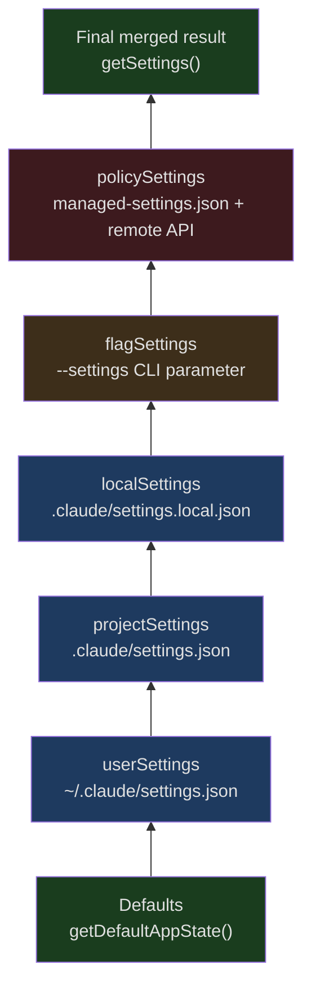
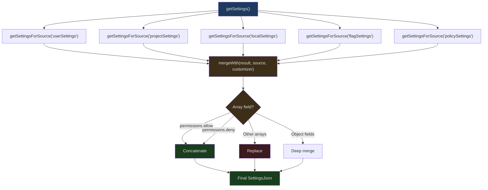
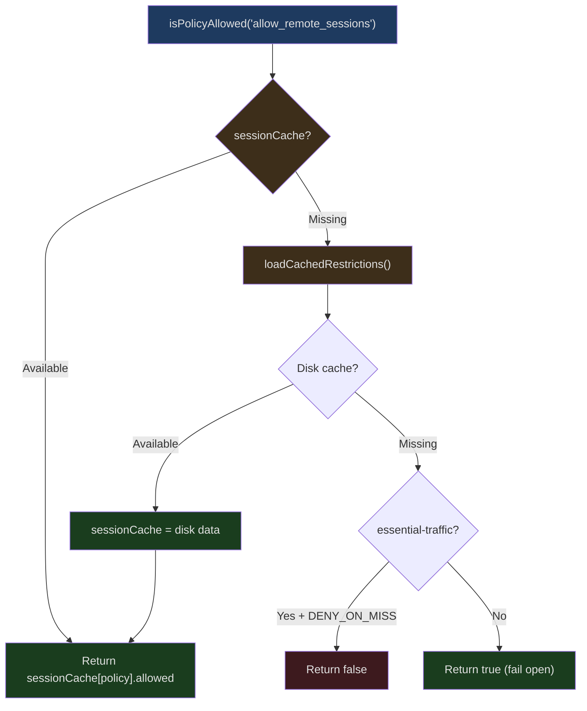

## The Problem

Configuration management sounds simple -- just read a JSON file, right? But when you need to support all of the following scenarios, complexity grows exponentially:

- User global settings (`~/.claude/settings.json`)
- Project shared settings (`.claude/settings.json`, committed to git)
- Project local settings (`.claude/settings.local.json`, gitignored)
- CLI flag overrides (`--settings` parameter)
- Enterprise managed policies (MDM push or remote API)
- Remote managed settings (organization-level config fetched from API)
- Real-time hot reloading on config changes
- Priority-based merging across multiple sources
- Automatic migration from old formats to new ones

Claude Code's configuration system validates every layer with Zod schemas, merges 5 sources using deterministic priority rules, and handles historical compatibility through 11 migration functions. This article dives into the implementation of each layer.

## Configuration Sources and Priority



`src/utils/settings/constants.ts` defines the source priorities:

```typescript
// src/utils/settings/constants.ts Lines 7-22
export const SETTING_SOURCES = [
  'userSettings',      // User global settings
  'projectSettings',   // Project shared settings
  'localSettings',     // Project local settings (gitignored)
  'flagSettings',      // CLI --settings flag
  'policySettings',    // Enterprise managed policies
] as const
```

The order determines priority -- later sources override earlier ones. This means:

1. **User settings** form the base layer
2. **Project settings** override user preferences (team conventions)
3. **Local settings** override project settings (personal overrides)
4. **CLI flags** override all file-based config (temporary overrides)
5. **Policy settings** have the highest priority (enterprise enforcement)

### Source Types

```typescript
// src/utils/settings/constants.ts Lines 24, 182-185
export type SettingSource = (typeof SETTING_SOURCES)[number]

export type EditableSettingSource = Exclude<
  SettingSource,
  'policySettings' | 'flagSettings'
>
```

`EditableSettingSource` excludes policy and flag sources -- users cannot edit managed policies or config generated from CLI flags. Only `userSettings`, `projectSettings`, and `localSettings` can be modified through the `/config` command or by directly editing files.

### Source Enable Control

```typescript
// src/utils/settings/constants.ts Lines 159-167
export function getEnabledSettingSources(): SettingSource[] {
  const allowed = getAllowedSettingSources()
  // Policy and flag sources are always enabled
  const result = new Set<SettingSource>(allowed)
  result.add('policySettings')
  result.add('flagSettings')
  return Array.from(result)
}
```

Even when sources are restricted via `--setting-sources`, policy and flag settings always remain active. This ensures enterprise managed policies cannot be bypassed.

## Zod Schema Validation

`src/utils/settings/types.ts` defines the complete configuration schema.

### Permissions Schema

```typescript
// src/utils/settings/types.ts Lines 42-85
export const PermissionsSchema = lazySchema(() =>
  z.object({
    allow: z.array(PermissionRuleSchema()).optional()
      .describe('List of permission rules for allowed operations'),
    deny: z.array(PermissionRuleSchema()).optional()
      .describe('List of permission rules for denied operations'),
    ask: z.array(PermissionRuleSchema()).optional()
      .describe('List of permission rules that should always prompt'),
    defaultMode: z.enum(
      feature('TRANSCRIPT_CLASSIFIER')
        ? PERMISSION_MODES
        : EXTERNAL_PERMISSION_MODES,
    ).optional(),
    disableBypassPermissionsMode: z.enum(['disable']).optional(),
    ...(feature('TRANSCRIPT_CLASSIFIER')
      ? { disableAutoMode: z.enum(['disable']).optional() }
      : {}),
    additionalDirectories: z.array(z.string()).optional(),
  }).passthrough(),
)
```

Note two key design decisions:

1. **`feature()` compile-time conditionals** -- The `TRANSCRIPT_CLASSIFIER` flag controls whether the auto mode schema is included. In external builds, the `disableAutoMode` field doesn't exist in the schema at all.
2. **`.passthrough()`** -- Allows unknown fields to pass validation, ensuring forward compatibility. Adding new fields in future versions won't cause errors in older versions.

### Hook Schema

```typescript
// src/schemas/hooks.ts Lines 32-171 (core section)
function buildHookSchemas() {
  const BashCommandHookSchema = z.object({
    type: z.literal('command'),
    command: z.string(),
    if: IfConditionSchema(),
    shell: z.enum(SHELL_TYPES).optional(),
    timeout: z.number().positive().optional(),
    statusMessage: z.string().optional(),
    once: z.boolean().optional(),
    async: z.boolean().optional(),
    asyncRewake: z.boolean().optional(),
  })

  const PromptHookSchema = z.object({
    type: z.literal('prompt'),
    prompt: z.string(),
    if: IfConditionSchema(),
    timeout: z.number().positive().optional(),
    model: z.string().optional(),
    statusMessage: z.string().optional(),
    once: z.boolean().optional(),
  })

  const HttpHookSchema = z.object({
    type: z.literal('http'),
    url: z.string().url(),
    if: IfConditionSchema(),
    timeout: z.number().positive().optional(),
    headers: z.record(z.string(), z.string()).optional(),
    allowedEnvVars: z.array(z.string()).optional(),
    statusMessage: z.string().optional(),
    once: z.boolean().optional(),
  })

  const AgentHookSchema = z.object({
    type: z.literal('agent'),
    prompt: z.string(),
    if: IfConditionSchema(),
    timeout: z.number().positive().optional(),
    model: z.string().optional(),
    statusMessage: z.string().optional(),
    once: z.boolean().optional(),
  })

  return { BashCommandHookSchema, PromptHookSchema, HttpHookSchema, AgentHookSchema }
}
```

Hooks use Zod's `discriminatedUnion`, differentiating four types by the `type` field:

```typescript
// src/schemas/hooks.ts Lines 176-189
export const HookCommandSchema = lazySchema(() => {
  const { BashCommandHookSchema, PromptHookSchema, AgentHookSchema, HttpHookSchema }
    = buildHookSchemas()
  return z.discriminatedUnion('type', [
    BashCommandHookSchema,
    PromptHookSchema,
    AgentHookSchema,
    HttpHookSchema,
  ])
})
```

### The lazySchema Pattern

Notice that all schemas are wrapped with `lazySchema`. This is a lazy evaluation wrapper -- schemas are only constructed on first invocation, avoiding expensive Zod type building during module loading. For CLI startup speed, this is an important optimization.

### Environment Variables Schema

```typescript
// src/utils/settings/types.ts Lines 35-37
export const EnvironmentVariablesSchema = lazySchema(() =>
  z.record(z.string(), z.coerce.string()),
)
```

`z.coerce.string()` means that even if values are numbers or booleans, they'll be coerced to strings. This aligns with environment variable semantics -- all environment variables are fundamentally strings.

## Configuration File Loading and Merging

`src/utils/settings/settings.ts` implements configuration reading and merging.

### File Managed Settings

```typescript
// src/utils/settings/settings.ts Lines 74-100 (loadManagedFileSettings)
export function loadManagedFileSettings(): {
  settings: SettingsJson | null
  errors: ValidationError[]
} {
  const errors: ValidationError[] = []
  let merged: SettingsJson = {}
  let found = false

  // 1. Load base file
  const { settings, errors: baseErrors } = parseSettingsFile(
    getManagedSettingsFilePath()
  )
  errors.push(...baseErrors)
  if (settings && Object.keys(settings).length > 0) {
    merged = mergeWith(merged, settings, settingsMergeCustomizer)
    found = true
  }

  // 2. Load drop-in directory
  const dropInDir = getManagedSettingsDropInDir()
  try {
    const entries = getFsImplementation()
      .readdirSync(dropInDir)
      .filter(d =>
        (d.isFile() || d.isSymbolicLink()) &&
        d.name.endsWith('.json') &&
        !d.name.startsWith('.')
      )
    // Sorted alphabetically -- later files have higher priority
    // ...
  }
}
```

Managed settings support two forms:

1. **Single file** -- `managed-settings.json`, serving as the base
2. **Drop-in directory** -- `managed-settings.d/*.json`, merged in alphabetical order

This design borrows from systemd's drop-in convention: different teams can independently deploy policy fragments (e.g., `10-otel.json`, `20-security.json`) without coordinating edits to the same file.

### MDM (Mobile Device Management) Integration

```typescript
// From settings.ts Lines 36-37, MDM imports
import { getHkcuSettings, getMdmSettings } from './mdm/settings.js'
```

Claude Code also supports OS-level MDM configuration distribution:
- **macOS** -- Distributed via MDM profiles to `/Library/Managed Preferences/`
- **Windows** -- Via HKCU registry keys

These all fall under the `policySettings` source and are merged with file managed settings.

### Multi-Source Merging

Configuration merging uses lodash's `mergeWith` with a custom merge strategy:



The key distinction in the merge strategy:

- **Permission rule arrays** (`allow`, `deny`, `ask`) -- **Concatenated**. A project's `allow` rules are appended after the user's `allow` rules, not replaced.
- **Other arrays** -- **Replaced**. For example, `additionalDirectories` from a later source completely overrides the earlier one.
- **Objects** -- **Deep merged**. Nested fields are overridden individually.

### Settings Cache

```typescript
// From settings.ts Lines 40-46, cache imports
import {
  getCachedParsedFile,
  getCachedSettingsForSource,
  getSessionSettingsCache,
  resetSettingsCache,
  setCachedParsedFile,
  setCachedSettingsForSource,
  setSessionSettingsCache,
} from './settingsCache.js'
```

Configuration reading uses multi-level caching:

1. **File parse cache** -- Each file path is parsed only once
2. **Source cache** -- Settings for each source are computed only once
3. **Session cache** -- The final merged result is computed only once

When any source file changes, the cache is selectively invalidated and rebuilt.

### Settings Change Detection

From `settings.ts` line 27, the import:

```typescript
import { settingsChangeDetector } from '../../utils/settings/changeDetector.js'
```

`changeDetector` uses filesystem watchers (e.g., `fs.watch`) to detect settings file changes. When a change is detected:

1. The modified file is re-parsed
2. Affected cache layers are invalidated
3. The `useSettingsChange` callback is triggered
4. AppState is updated via `store.setState`
5. `onChangeAppState` handles side effects (such as clearing auth caches)

## Versioned Migrations

The `src/migrations/` directory contains 11 migration functions that handle the historical evolution of configuration formats.

### Migration List

```
migrateAutoUpdatesToSettings.ts       -- Auto-update preference migration to settings.json
migrateBypassPermissionsAcceptedToSettings.ts -- Permission bypass setting migration
migrateEnableAllProjectMcpServersToSettings.ts -- MCP server enable setting migration
migrateFennecToOpus.ts                -- Fennec model alias migration to Opus
migrateLegacyOpusToCurrent.ts         -- Legacy Opus name migration
migrateOpusToOpus1m.ts                -- Opus -> Opus[1m] migration
migrateReplBridgeEnabledToRemoteControlAtStartup.ts -- Bridge setting migration
migrateSonnet1mToSonnet45.ts          -- Sonnet 1m -> Sonnet 4.5 migration
migrateSonnet45ToSonnet46.ts          -- Sonnet 4.5 -> Sonnet 4.6 migration
resetAutoModeOptInForDefaultOffer.ts  -- Auto mode opt-in reset
resetProToOpusDefault.ts              -- Pro user default model reset
```

### Migration Example: Auto Updates

```typescript
// src/migrations/migrateAutoUpdatesToSettings.ts Lines 13-61
export function migrateAutoUpdatesToSettings(): void {
  const globalConfig = getGlobalConfig()

  // Only migrate when the user explicitly disabled auto-updates
  if (
    globalConfig.autoUpdates !== false ||
    globalConfig.autoUpdatesProtectedForNative === true
  ) {
    return
  }

  try {
    const userSettings = getSettingsForSource('userSettings') || {}

    // Migrate to env variable
    updateSettingsForSource('userSettings', {
      ...userSettings,
      env: {
        ...userSettings.env,
        DISABLE_AUTOUPDATER: '1',
      },
    })

    logEvent('tengu_migrate_autoupdates_to_settings', {
      was_user_preference: true,
      already_had_env_var: !!userSettings.env?.DISABLE_AUTOUPDATER,
    })

    // Take effect immediately
    process.env.DISABLE_AUTOUPDATER = '1'

    // Remove from old config
    saveGlobalConfig(current => {
      const { autoUpdates: _, autoUpdatesProtectedForNative: __, ...rest } = current
      return rest
    })
  } catch (error) {
    logError(new Error(`Failed to migrate auto-updates: ${error}`))
  }
}
```

Key characteristics of migrations:

1. **Idempotent** -- Running multiple times produces no side effects
2. **Conditional execution** -- Only triggered when the old format is detected
3. **Atomic** -- Writes the new config first, then deletes the old one
4. **Observable** -- Migration events are recorded via `logEvent`

### Migration Example: Model Aliases

```typescript
// src/migrations/migrateFennecToOpus.ts Lines 18-45
export function migrateFennecToOpus(): void {
  // Internal users only
  if (process.env.USER_TYPE !== 'ant') return

  const settings = getSettingsForSource('userSettings')
  const model = settings?.model

  if (typeof model === 'string') {
    if (model.startsWith('fennec-latest[1m]')) {
      updateSettingsForSource('userSettings', { model: 'opus[1m]' })
    } else if (model.startsWith('fennec-latest')) {
      updateSettingsForSource('userSettings', { model: 'opus' })
    } else if (
      model.startsWith('fennec-fast-latest') ||
      model.startsWith('opus-4-5-fast')
    ) {
      updateSettingsForSource('userSettings', {
        model: 'opus[1m]',
        fastMode: true,
      })
    }
  }
}
```

This migration demonstrates two important decisions:

1. **Only migrate userSettings** -- Never touches project/local/policy settings. A source code comment explains why: "Reading merged settings would cause infinite re-runs + silent global promotion."
2. **Model remapping** -- `fennec-fast-latest` maps to `opus[1m]` + `fastMode: true`, preserving the user's performance preference.

### Migration Execution Timing

Migrations execute during the `preAction` phase in `main.tsx`:

```typescript
// profileCheckpoint calls in main.tsx showing order
profileCheckpoint('preAction_after_mdm')           // Line 915
profileCheckpoint('preAction_after_init')           // Line 917
profileCheckpoint('preAction_after_sinks')          // Line 935
profileCheckpoint('preAction_after_migrations')     // Line 951  <- Migrations complete here
profileCheckpoint('preAction_after_remote_settings') // Line 959
```

Migrations execute after sink initialization but before remote settings are loaded -- this means migrations can use telemetry (to record migration events) but don't depend on remote settings.

## Remote Managed Settings

`src/services/remoteManagedSettings/index.ts` implements fetching enterprise-level managed settings from an API.

```typescript
// src/services/remoteManagedSettings/index.ts Lines 1-13
/**
 * Remote Managed Settings Service
 *
 * Manages fetching, caching, and validation of remote-managed settings
 * for enterprise customers. Uses checksum-based validation to minimize
 * network traffic and provides graceful degradation on failures.
 *
 * Eligibility:
 * - Console users (API key): All eligible
 * - OAuth users (Claude.ai): Only Enterprise/C4E and Team subscribers
 * - API fails open (non-blocking)
 * - API returns empty settings for users without managed settings
 */
```

### Checksum Caching

Remote configuration uses a checksum mechanism to reduce network traffic. Similar to HTTP ETags, but based on SHA256 content hashing:

1. First fetch -> store config + compute checksum
2. Subsequent fetches -> include checksum, server compares
3. If unchanged -> 304 Not Modified, use cache
4. If changed -> 200 + new config

### Security Checks

```typescript
// src/services/remoteManagedSettings/index.ts Lines 38-39
import {
  checkManagedSettingsSecurity,
  handleSecurityCheckResult,
} from './securityCheck.jsx'
```

Remote configuration must pass security checks before being applied. `securityCheck.tsx` ensures remote config cannot introduce dangerous operations -- for example, remote config should not be able to set arbitrary `env` variables or modify permission `deny` rules.

### Background Polling

```typescript
// src/services/remoteManagedSettings/index.ts Lines 54-55
const POLLING_INTERVAL_MS = 60 * 60 * 1000 // 1 hour
```

Remote config is polled once per hour. The loading process is non-blocking -- if the API is unreachable, it continues running with the cache or without remote config.

## Policy Limits

`src/services/policyLimits/index.ts` is another enterprise configuration layer -- organization-level feature restrictions.

```typescript
// src/services/policyLimits/index.ts Lines 510-526
export function isPolicyAllowed(policy: string): boolean {
  const restrictions = getRestrictionsFromCache()
  if (!restrictions) {
    // Safe degradation in HIPAA mode
    if (isEssentialTrafficOnly() && ESSENTIAL_TRAFFIC_DENY_ON_MISS.has(policy)) {
      return false
    }
    return true // fail open
  }
  const restriction = restrictions[policy]
  if (!restriction) return true // Unknown policy = allow
  return restriction.allowed
}
```

Design principles for policy limits:

1. **Fail open** -- Allow by default. Network failures should not prevent users from using the CLI.
2. **HIPAA exception** -- For `essential-traffic-only` mode, specific policies (like `allow_product_feedback`) default to deny when the cache is unavailable.

```typescript
// src/services/policyLimits/index.ts Line 502
const ESSENTIAL_TRAFFIC_DENY_ON_MISS = new Set(['allow_product_feedback'])
```

### Cache Architecture



Three-level cache:

1. **Session cache** -- In-memory `sessionCache`, fastest
2. **Disk cache** -- `~/.claude/policy-limits.json`, survives process restarts
3. **Network fetch** -- API request with retry and exponential backoff

### ETag Caching

```typescript
// src/services/policyLimits/index.ts Lines 132-159
function computeChecksum(
  restrictions: PolicyLimitsResponse['restrictions'],
): string {
  const sorted = sortKeysDeep(restrictions)
  const normalized = jsonStringify(sorted)
  const hash = createHash('sha256').update(normalized).digest('hex')
  return `sha256:${hash}`
}
```

The checksum is computed from normalized JSON -- all keys are recursively sorted first, then serialized, then hashed. This ensures that even if the server returns fields in a different order, the checksum will be identical as long as the content is the same.

### Authentication Support

```typescript
// src/services/policyLimits/index.ts Lines 227-262
function getAuthHeaders(): { headers: Record<string, string>; error?: string } {
  // Try API key first (Console users)
  try {
    const { key: apiKey } = getAnthropicApiKeyWithSource({
      skipRetrievingKeyFromApiKeyHelper: true,
    })
    if (apiKey) {
      return { headers: { 'x-api-key': apiKey } }
    }
  } catch { /* Fall through to OAuth */ }

  // Fall back to OAuth tokens (Claude.ai users)
  const oauthTokens = getClaudeAIOAuthTokens()
  if (oauthTokens?.accessToken) {
    return {
      headers: {
        Authorization: `Bearer ${oauthTokens.accessToken}`,
        'anthropic-beta': OAUTH_BETA_HEADER,
      },
    }
  }

  return { headers: {}, error: 'No authentication available' }
}
```

The policy limits API supports two authentication methods:

1. **API key** -- Console users use the `x-api-key` header directly
2. **OAuth** -- Claude.ai users use Bearer tokens

`skipRetrievingKeyFromApiKeyHelper: true` avoids triggering the API key helper's execution -- on high-frequency paths like policy limit checks, launching an external process to retrieve a key is undesirable.

## Initialization Loading Promise

```typescript
// src/services/policyLimits/index.ts Lines 94-114
export function initializePolicyLimitsLoadingPromise(): void {
  if (loadingCompletePromise) return

  if (isPolicyLimitsEligible()) {
    loadingCompletePromise = new Promise(resolve => {
      loadingCompleteResolve = resolve

      // Deadlock prevention timeout
      setTimeout(() => {
        if (loadingCompleteResolve) {
          loadingCompleteResolve()
          loadingCompleteResolve = null
        }
      }, LOADING_PROMISE_TIMEOUT_MS) // 30 seconds
    })
  }
}
```

Both remote managed settings and policy limits use the same Promise pattern:

1. Create the Promise early during initialization
2. Other systems can `await waitForPolicyLimitsToLoad()` to wait for loading to complete
3. A 30-second timeout prevents deadlocks -- if `loadPolicyLimits()` is never called (e.g., in Agent SDK tests), the Promise resolves automatically

## Configuration Validation and Error Handling

Configuration file parsing is not a simple `JSON.parse`. Every file undergoes full Zod schema validation:

1. **JSON parsing** -- The file may contain invalid JSON
2. **Schema validation** -- Field type, format, and range checks
3. **Permission rule filtering** -- Invalid permission rules are filtered out rather than rejecting the entire file
4. **Error collection** -- All validation errors are collected without interrupting loading

The core principle of this design is **resilience** -- a malformed configuration file should not prevent the CLI from starting. Invalid rules are skipped while valid rules continue to take effect.

## Source Display Names

```typescript
// src/utils/settings/constants.ts Lines 26-93
export function getSettingSourceName(source: SettingSource): string {
  switch (source) {
    case 'userSettings':    return 'user'
    case 'projectSettings': return 'project'
    case 'localSettings':   return 'project, gitignored'
    case 'flagSettings':    return 'cli flag'
    case 'policySettings':  return 'managed'
  }
}

export function getSourceDisplayName(
  source: SettingSource | 'plugin' | 'built-in',
): string {
  switch (source) {
    case 'userSettings':    return 'User'
    case 'projectSettings': return 'Project'
    case 'localSettings':   return 'Local'
    case 'flagSettings':    return 'Flag'
    case 'policySettings':  return 'Managed'
    case 'plugin':          return 'Plugin'
    case 'built-in':        return 'Built-in'
  }
}
```

Multiple display name formats are provided -- short names (for UI labels), descriptive names (for inline text), and capitalized names (for context/skill UI). This ensures configuration sources can be clearly identified across different UI scenarios.

## Summary

Claude Code's configuration system is an engineering masterpiece:

- **5-source priority merging** -- user < project < local < flag < policy, with policies that cannot be bypassed
- **Zod schema validation** -- Compile-time feature flags control schema shape, `lazySchema` for lazy construction
- **Drop-in directories** -- Borrowing from the systemd convention, allowing multiple teams to independently deploy policy fragments
- **11 versioned migrations** -- Idempotent, conditionally executed, atomically updated, and observable
- **Remote managed settings** -- Checksum caching, ETag optimization, fail-open strategy
- **Policy limits** -- Three-level cache, HIPAA safe degradation, dual authentication support
- **Configuration hot reload** -- File watch -> cache invalidation -> Store update -> side effect execution
