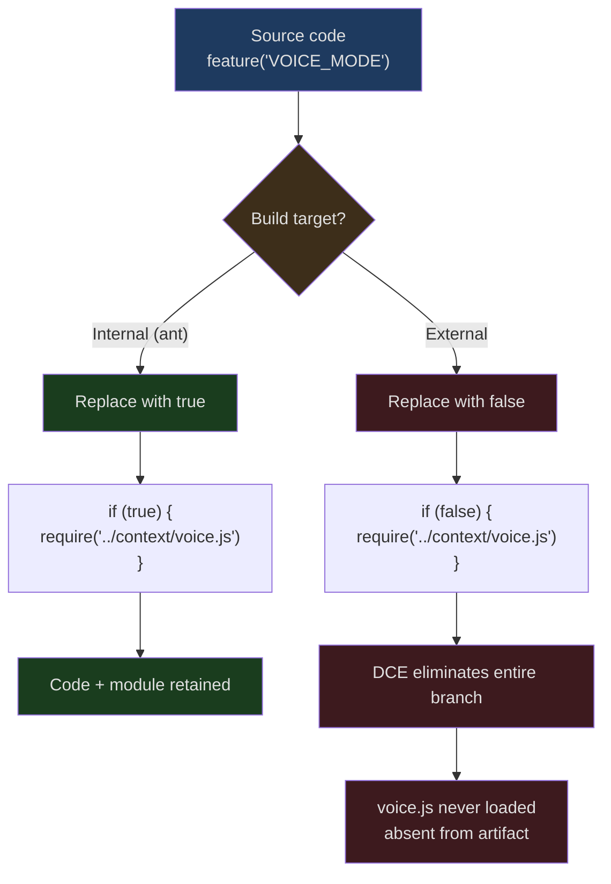
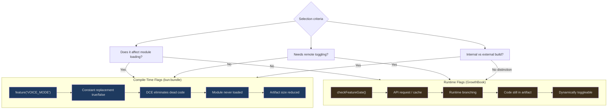

## The Problem

Feature flags in web development are typically a runtime concept -- platforms like LaunchDarkly and Unleash dynamically determine feature switches at request time. But Claude Code faces entirely different constraints:

1. **It's a CLI distributed to external users** -- Not all features should appear in public releases
2. **Startup speed is extremely sensitive** -- Loading modules for unused features is wasteful
3. **Internal and external versions differ significantly** -- Voice mode, Buddy pet, coordinator mode only exist in internal builds

Runtime flags can't solve these problems. Even if code inside `if (false) { ... }` never executes, its modules are still loaded and parsed. What Claude Code needs is **compile-time** code elimination -- making unwanted features completely disappear from the final artifact.

This is where `bun:bundle`'s `feature()` API comes in.

## How the feature() API Works

```typescript
import { feature } from 'bun:bundle'

// Compile-time constant -- replaced with true or false at build time
if (feature('VOICE_MODE')) {
  // This entire branch is eliminated in external builds
  const VoiceProvider = require('../context/voice.js').VoiceProvider
}
```

`feature()` is not a function call -- it's a **compiler directive**. Bun's bundler at build time:

1. Reads feature flag definitions from the build configuration
2. Replaces `feature('FLAG_NAME')` with the corresponding boolean literal `true` or `false`
3. The JavaScript engine's constant folding optimization recognizes `if (false) { ... }` as dead code
4. Tree-shaking removes all unreachable code paths and their associated `require()` calls

### Internal vs External Builds



## Complete Flag Inventory

The Claude Code codebase uses over 85 distinct feature flags. Here they are grouped by functional domain:

### Core Product Features

| Flag | Purpose |
|------|---------|
| `KAIROS` | Assistant mode (Claude Assistant) |
| `KAIROS_BRIEF` | Assistant brief mode |
| `KAIROS_CHANNELS` | Assistant channels (Telegram/iMessage) |
| `KAIROS_DREAM` | Assistant autonomous execution |
| `KAIROS_GITHUB_WEBHOOKS` | GitHub PR subscriptions |
| `KAIROS_PUSH_NOTIFICATION` | Push notifications |
| `PROACTIVE` | Proactive execution mode |
| `BRIDGE_MODE` | Remote control bridge |
| `DAEMON` | Background daemon process |
| `VOICE_MODE` | Voice input/output |
| `BUDDY` | Companion pet (easter egg) |

### Context and Models

| Flag | Purpose |
|------|---------|
| `CONTEXT_COLLAPSE` | Context collapse compression |
| `REACTIVE_COMPACT` | Reactive compaction |
| `CACHED_MICROCOMPACT` | Cached micro-compaction |
| `HISTORY_SNIP` | History trimming |
| `TOKEN_BUDGET` | Token budget tracking |
| `ULTRATHINK` | Ultra-deep thinking mode |
| `COMPACTION_REMINDERS` | Compaction reminders |
| `BREAK_CACHE_COMMAND` | Cache break command |
| `PROMPT_CACHE_BREAK_DETECTION` | Prompt cache break detection |

### Tools and Capabilities

| Flag | Purpose |
|------|---------|
| `AGENT_TRIGGERS` | Scheduled triggers (cron) |
| `AGENT_TRIGGERS_REMOTE` | Remote triggers |
| `MONITOR_TOOL` | Monitor tool |
| `TERMINAL_PANEL` | Terminal panel (tmux) |
| `WEB_BROWSER_TOOL` | Browser tool |
| `CHICAGO_MCP` | Computer Use (macOS) |
| `MCP_SKILLS` | MCP skill discovery |
| `MCP_RICH_OUTPUT` | MCP rich text output |
| `WORKFLOW_SCRIPTS` | Workflow scripts |
| `TORCH` | Experimental search |

### Teams and Collaboration

| Flag | Purpose |
|------|---------|
| `COORDINATOR_MODE` | Coordinator mode |
| `UDS_INBOX` | Unix Domain Socket message inbox |
| `FORK_SUBAGENT` | Sub-agent forking |
| `TEAMMEM` | Team memory sync |
| `BG_SESSIONS` | Background sessions |
| `ULTRAPLAN` | Remote ultra planning |

### Connectivity and Deployment

| Flag | Purpose |
|------|---------|
| `DIRECT_CONNECT` | Direct connect mode |
| `SSH_REMOTE` | SSH remote execution |
| `CCR_AUTO_CONNECT` | CCR auto-connect |
| `CCR_MIRROR` | CCR mirror sync |
| `CCR_REMOTE_SETUP` | CCR remote setup |
| `SELF_HOSTED_RUNNER` | Self-hosted runner |
| `BYOC_ENVIRONMENT_RUNNER` | BYOC environment runner |

### Telemetry and Diagnostics

| Flag | Purpose |
|------|---------|
| `ENHANCED_TELEMETRY_BETA` | Enhanced telemetry |
| `COWORKER_TYPE_TELEMETRY` | Coworker type telemetry |
| `MEMORY_SHAPE_TELEMETRY` | Memory shape telemetry |
| `PERFETTO_TRACING` | Perfetto tracing |
| `SLOW_OPERATION_LOGGING` | Slow operation logging |
| `SHOT_STATS` | Output statistics |
| `DUMP_SYSTEM_PROMPT` | System prompt dump |

### Permissions and Security

| Flag | Purpose |
|------|---------|
| `TRANSCRIPT_CLASSIFIER` | Transcript classifier (auto mode) |
| `BASH_CLASSIFIER` | Bash command classification |
| `VERIFICATION_AGENT` | Verification agent |
| `NATIVE_CLIENT_ATTESTATION` | Native client attestation |
| `ANTI_DISTILLATION_CC` | Anti-distillation protection |

## Conditional Import Patterns

The combination of `feature()` and `require()` in Claude Code follows a set of fixed patterns.

### Pattern 1: Module-Level Conditional Loading

```typescript
// src/tools.ts Lines 26-42
const cronTools = feature('AGENT_TRIGGERS')
  ? require('./tools/CronTool/index.js') as typeof import('./tools/CronTool/index.js')
  : null

const RemoteTriggerTool = feature('AGENT_TRIGGERS_REMOTE')
  ? require('./tools/RemoteTriggerTool/index.js').RemoteTriggerTool
  : null

const MonitorTool = feature('MONITOR_TOOL')
  ? require('./tools/MonitorTool/index.js').MonitorTool
  : null

const SendUserFileTool = feature('KAIROS')
  ? require('./tools/SendUserFileTool/index.js').SendUserFileTool
  : null
```

This is the most common pattern. `feature()` serves as the ternary condition, and `require()` only appears when the flag is true. When the flag is false, the entire `require()` expression and the corresponding module are eliminated by DCE.

Note the `as typeof import(...)` type assertion -- it ensures that when the flag is true, the `require` return value has the correct TypeScript type.

### Pattern 2: Component-Level Conditional Rendering

```typescript
// src/state/AppState.tsx Lines 14-19
const VoiceProvider: (props: {
  children: React.ReactNode;
}) => React.ReactNode = feature('VOICE_MODE')
  ? require('../context/voice.js').VoiceProvider
  : ({ children }) => children;
```

When `VOICE_MODE` is off, `VoiceProvider` is replaced with a passthrough component `({ children }) => children`. Upstream code doesn't need to know whether Voice is enabled -- it always wraps children with `<VoiceProvider>`.

### Pattern 3: In-Function Conditional Branches

```typescript
// src/main.tsx Lines 76-81
const coordinatorModeModule = feature('COORDINATOR_MODE')
  ? require('./coordinator/coordinatorMode.js') as typeof import('./coordinator/coordinatorMode.js')
  : null

const assistantModule = feature('KAIROS')
  ? require('./assistant/index.js') as typeof import('./assistant/index.js')
  : null

const kairosGate = feature('KAIROS')
  ? require('./assistant/gate.js') as typeof import('./assistant/gate.js')
  : null
```

In `main.tsx`, numerous modules are conditionally loaded using this pattern. Subsequent usage is paired with null checks:

```typescript
// src/main.tsx Line 685
if (feature('KAIROS') && _pendingAssistantChat) {
  // ... only executes when KAIROS is enabled
}
```

A double guard: `feature('KAIROS')` ensures compile-time elimination, while `_pendingAssistantChat` is a runtime null check.

### Pattern 4: Schema Conditional Fields

```typescript
// src/utils/settings/types.ts Lines 61-78
defaultMode: z.enum(
  feature('TRANSCRIPT_CLASSIFIER')
    ? PERMISSION_MODES        // Includes 'auto' and other internal modes
    : EXTERNAL_PERMISSION_MODES  // Public modes only
).optional(),
...(feature('TRANSCRIPT_CLASSIFIER')
  ? { disableAutoMode: z.enum(['disable']).optional() }
  : {}),
```

The schema shape itself is conditional. The external build's schema simply doesn't have the `disableAutoMode` field -- not just hidden, but nonexistent in the type system.

### Pattern 5: Command Registration

```typescript
// src/commands.ts Lines 63-118
feature('PROACTIVE') || feature('KAIROS')
  ? require('./commands/proactive.js').default : null

const bridge = feature('BRIDGE_MODE')
  ? require('./commands/bridge/index.js').default : null

feature('DAEMON') && feature('BRIDGE_MODE')
  ? require('./commands/daemon.js').default : null

const voiceCommand = feature('VOICE_MODE')
  ? require('./commands/voice/voice.js').default : null

const ultraplan = feature('ULTRAPLAN')
  ? require('./commands/ultraplan.js').default : null

const buddy = feature('BUDDY')
  ? require('./commands/buddy.js').default : null
```

Each slash command's registration is controlled by feature flags. External version users never see `/voice`, `/buddy`, `/ultraplan`, or similar commands -- their code simply doesn't exist in the artifact.

## Compile-Time vs Runtime Flags



Claude Code uses both flag systems simultaneously:

### Compile-Time Feature Flags (`bun:bundle`)

- **Decision point**: Build/bundling time
- **Granularity**: Whether entire modules/features exist
- **Typical use**: Internal-only features (Voice, Buddy, Coordinator)
- **Advantages**: Zero runtime overhead, reduced artifact size, impossible to accidentally enable in production
- **Disadvantages**: Changes require a new release

### Runtime Feature Flags (GrowthBook)

- **Decision point**: Runtime, possibly using cache
- **Granularity**: Behavioral parameters (sample rates, batch sizes)
- **Typical use**: Telemetry configuration, A/B experiments, kill switches
- **Advantages**: Remotely toggleable, no release needed
- **Disadvantages**: Code remains in artifact, requires network requests

### Selection Criteria

| Question | Compile-time | Runtime |
|----------|-------------|---------|
| Does the feature only exist in specific builds? | Yes | -- |
| Does the feature require loading additional modules? | Yes | -- |
| Does the feature need A/B testing? | -- | Yes |
| Does the feature need emergency remote shutdown? | -- | Yes |
| Toggle frequency? | Low (per release) | High (anytime) |

## Compound Flag Patterns

Some features use combinations of multiple flags:

```typescript
// src/commands.ts Line 77
feature('DAEMON') && feature('BRIDGE_MODE')
  ? require('./commands/daemon.js').default : null
```

The daemon command only exists when both `DAEMON` and `BRIDGE_MODE` are enabled. If either flag is false, `&&`'s short-circuit evaluation immediately produces false, and the entire expression is eliminated at compile time.

```typescript
// src/tools.ts Line 26
feature('PROACTIVE') || feature('KAIROS')
```

SendMessageTool is available when either `PROACTIVE` or `KAIROS` is enabled -- meaning two independent feature domains share a single tool.

## DCE Boundaries and Caveats

### require() Must Be Inside a feature() Branch

```typescript
// Correct -- require is inside a feature() guard
const module = feature('X') ? require('./x.js') : null

// Wrong -- import is at module top level, DCE cannot eliminate it
import { x } from './x.js'
if (feature('X')) { x() }
```

ES module `import` statements are static declarations; the bundler includes the module when analyzing the dependency graph. Only `require()` (CommonJS dynamic import) inside conditional branches can be eliminated by DCE.

### TypeScript Types Remain Available

```typescript
const assistantModule = feature('KAIROS')
  ? require('./assistant/index.js') as typeof import('./assistant/index.js')
  : null
```

`typeof import(...)` is a pure type operation -- it produces no runtime code. Even when `KAIROS` is false, TypeScript still knows the type shape of `assistantModule` when it's non-null. This allows subsequent code to perform type-safe null checks:

```typescript
if (feature('KAIROS') && assistantModule) {
  // TypeScript knows the type of assistantModule here
  assistantModule.isAssistantMode()
}
```

### Conditional Fields in AppState

```typescript
// src/state/AppStateStore.ts Lines 97-98
// Optional - only present when ENABLE_AGENT_SWARMS is true
showTeammateMessagePreview?: boolean
```

AppState uses `?:` optional fields to mark state affected by feature flags. Source code comments explicitly document this coupling, helping developers understand which fields are meaningful in which builds.

## REPL.tsx: The File with the Highest Flag Density

`src/screens/REPL.tsx` is the file with the highest density of `feature()` calls in the entire codebase, containing 70+ invocations. This is because the REPL is the convergence point for all features:

```typescript
// src/screens/REPL.tsx Line 3
import { feature } from 'bun:bundle';

// Conditional module loading
const useVoiceIntegration = feature('VOICE_MODE')
  ? require('../hooks/useVoiceIntegration.js').useVoiceIntegration
  : () => ({ /* noop */ })

const VoiceKeybindingHandler = feature('VOICE_MODE')
  ? require('../hooks/useVoiceIntegration.js').VoiceKeybindingHandler
  : () => null

const proactiveModule = feature('PROACTIVE') || feature('KAIROS')
  ? require('../proactive/index.js') : null

const useScheduledTasks = feature('AGENT_TRIGGERS')
  ? require('../hooks/useScheduledTasks.js').useScheduledTasks : null

const WebBrowserPanelModule = feature('WEB_BROWSER_TOOL')
  ? require('../tools/WebBrowserTool/WebBrowserPanel.js') : null
```

In JSX rendering:

```typescript
{feature('VOICE_MODE')
  ? <VoiceKeybindingHandler ... /> : null}

{feature('WEB_BROWSER_TOOL')
  ? WebBrowserPanelModule && <WebBrowserPanelModule.WebBrowserPanel />
  : null}

{feature('BUDDY') && companionVisible
  ? <CompanionSprite /> : null}

{feature('ULTRAPLAN')
  ? focusedInputDialog === 'ultraplan-choice' && <UltraplanChoiceDialog ... />
  : null}
```

In external builds, all these JSX expressions are replaced with `null`, and the corresponding component code is completely absent.

## Quantified Impact

85+ feature flags means external builds may exclude dozens of complete modules. Assuming each excluded feature module averages 50KB (code + dependencies), DCE could save several megabytes of artifact size. More importantly:

- **Startup time** -- Modules that don't need loading don't need parsing, directly shortening cold start
- **Memory footprint** -- Nonexistent code doesn't occupy V8's code space
- **Attack surface** -- External users cannot reach internal features, even if they discover the corresponding code paths

## Comparison with Traditional Approaches

| Approach | Runtime overhead | Artifact size | Type safety | Remote control |
|----------|-----------------|---------------|-------------|----------------|
| Environment variables `if (process.env.X)` | Low | Unchanged | Weak | Requires restart |
| LaunchDarkly/Unleash | Network request | Unchanged | None | Real-time |
| GrowthBook (runtime) | Cache read | Unchanged | Weak | Near real-time |
| `bun:bundle` feature() | **Zero** | **Reduced** | **Strong** | **Not possible** |

The unique advantage of `feature()` is the three-in-one combination of **compile-time type safety + zero runtime overhead + reduced artifact size**. The tradeoff is no remote toggling -- but for decisions like "does this feature exist in this version," remote toggling was never the right answer anyway.

## Summary

Claude Code's feature flag system is a masterful use of compiler capabilities:

- **85+ `feature()` flags** -- Covering product features, tools, connectivity, telemetry, security, and every other dimension
- **`bun:bundle` compile-time replacement** -- `feature('X')` -> `true`/`false` -> constant folding -> DCE
- **Conditional `require()` pattern** -- Ensures excluded features' modules are never loaded and never appear in the artifact
- **Schema conditional fields** -- The configuration validation shape itself varies with flags
- **Complementary with runtime GrowthBook** -- Compile-time decides "what exists," runtime decides "how it's used"
- **TypeScript type safety** -- `typeof import(...)` assertions maintain correctness at both compile-time and runtime

Not all feature flags need to be runtime. When the question is "should this feature exist in this binary," compile-time flags are the only correct answer.
