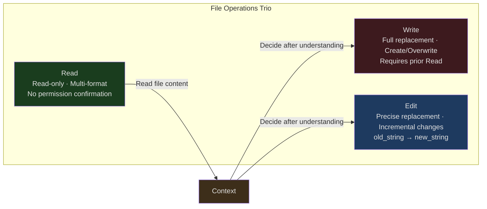
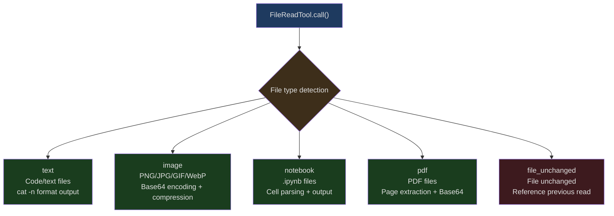
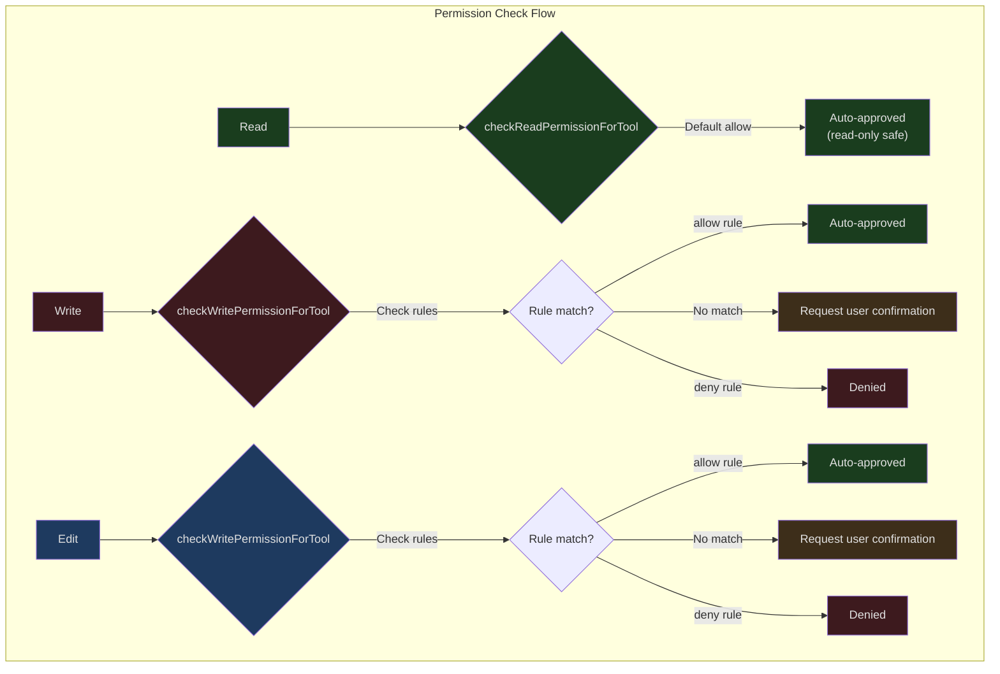
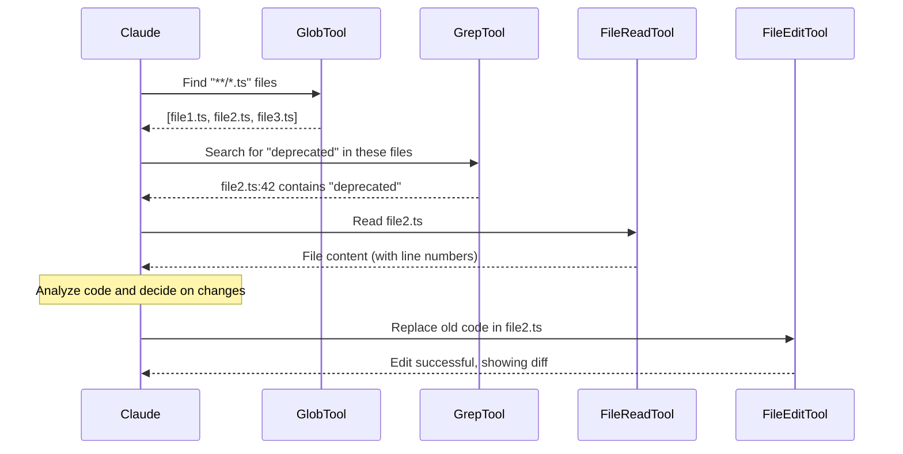

## Introduction

What is the most fundamental capability of an AI coding assistant? Understanding code logic? Generating high-quality code? Neither. If the AI cannot **read** existing code, **modify** it, or **create** new files, all its understanding and generation capabilities are meaningless.

Claude Code's file operation system faces a unique set of constraints:

1. **Token economics** — A 50KB file loaded entirely into context consumes roughly 12,500 tokens. Given the limited context window, the system must balance information density against token consumption
2. **Security constraints** — The AI should not overwrite user files without review, nor should it read sensitive directories
3. **Concurrency safety** — When multiple tools run simultaneously, file state may change between reads and writes
4. **Format diversity** — Code files, images, PDFs, Jupyter Notebooks — each format requires a different processing path

To address these challenges, Claude Code did not design a unified file API like traditional editors. Instead, it split file operations into three independent tools: **Read**, **Write**, and **Edit**. This three-tool separation is not arbitrary — it reflects a set of carefully considered design decisions.

---

## The Design Decision Behind Three-Tool Separation



Why not use a single `FileOperation` tool that supports read/write/edit? Three reasons:

### Different Permission Granularity

Read is a read-only operation, automatically approved in the default permission mode. Write and Edit modify the filesystem and require user confirmation or rule matching. If combined into one tool, the permission system would need to parse the `operation` parameter on every call to determine behavior — adding complexity and security risk.

### Different Token Economics

Read results can be very large (entire file contents), while Edit only needs to send the changed portions. Write needs to send the complete new content. Separating them allows the API's token calculation and limiting strategies to be independently tuned for each tool.

### Different Concurrency Safety Semantics

Read can safely run in parallel with any other operation (`isConcurrencySafe: true`), while concurrent Write and Edit operations on the same file require additional protection. After separation, the streaming tool executor can determine concurrency strategy based on tool type.

---

## FileReadTool: Multi-Format Intelligent Reading

FileReadTool is the entry point of the entire file operation system. It is not merely a wrapper around the `cat` command — it is a multi-format, token-aware file reading engine.

### Input Schema

```typescript
// src/tools/FileReadTool/FileReadTool.ts:227-243
const inputSchema = lazySchema(() =>
  z.strictObject({
    file_path: z.string().describe('The absolute path to the file to read'),
    offset: semanticNumber(z.number().int().nonnegative().optional()).describe(
      'The line number to start reading from. Only provide if the file is too large to read at once',
    ),
    limit: semanticNumber(z.number().int().positive().optional()).describe(
      'The number of lines to read. Only provide if the file is too large to read at once.',
    ),
    pages: z
      .string()
      .optional()
      .describe(
        `Page range for PDF files (e.g., "1-5", "3", "10-20"). Only applicable to PDF files. Maximum ${PDF_MAX_PAGES_PER_READ} pages per request.`,
      ),
  }),
)
```

The design intent of the four parameters is clear:

- **file_path** — Must be an absolute path to avoid working directory ambiguity
- **offset/limit** — Paginated reading for large files, defaulting to the first 2000 lines
- **pages** — PDF-specific parameter, maximum 20 pages per read

### Multi-Format Output

FileReadTool's output is a discriminated union that returns different data structures based on file type:



### Token Budget Control

The most critical constraint for file reading is the token budget. The source code has a two-tier limiting system:

```typescript
// src/tools/FileReadTool/limits.ts:1-14
/**
 * Read tool output limits.  Two caps apply to text reads:
 *
 *   | limit         | default | checks                    | cost          | on overflow     |
 *   |---------------|---------|---------------------------|---------------|-----------------|
 *   | maxSizeBytes  | 256 KB  | TOTAL FILE SIZE (not out) | 1 stat        | throws pre-read |
 *   | maxTokens     | 25000   | actual output tokens      | API roundtrip | throws post-read|
 *
 * Known mismatch: maxSizeBytes gates on total file size, not the slice.
 * Tested truncating instead of throwing for explicit-limit reads that
 * exceed the byte cap (#21841, Mar 2026).  Reverted: tool error rate
 * dropped but mean tokens rose — the throw path yields a ~100-byte error
 * tool-result while truncation yields ~25K tokens of content at the cap.
 */
```

This comment reveals an important engineering trade-off: the team once tried truncating content instead of throwing an error when files were too large. The result was that while error rates dropped, average token consumption increased — because truncation still returned a large volume of content (~25K tokens), whereas an error message is only about 100 bytes. **Having the AI fail fast and retry with pagination is more token-efficient than silently truncating.**

The token limit priority chain:

```typescript
// src/tools/FileReadTool/limits.ts:53-92
export const getDefaultFileReadingLimits = memoize((): FileReadingLimits => {
  const override =
    getFeatureValue_CACHED_MAY_BE_STALE<Partial<FileReadingLimits> | null>(
      'tengu_amber_wren',
      {},
    )

  const envMaxTokens = getEnvMaxTokens()
  const maxTokens =
    envMaxTokens ??
    (typeof override?.maxTokens === 'number' &&
    Number.isFinite(override.maxTokens) &&
    override.maxTokens > 0
      ? override.maxTokens
      : DEFAULT_MAX_OUTPUT_TOKENS)

  // ...
})
```

Priority: Environment variable (`CLAUDE_CODE_FILE_READ_MAX_OUTPUT_TOKENS`) > GrowthBook Feature Flag (`tengu_amber_wren`) > hardcoded default (25000). The use of `memoize` ensures the GrowthBook value is fixed at first call, preventing limits from changing mid-session.

### Image Processing

When the file is an image, FileReadTool uses the Sharp library for processing:

```typescript
// src/tools/FileReadTool/imageProcessor.ts:37-67
export async function getImageProcessor(): Promise<SharpFunction> {
  if (imageProcessorModule) {
    return imageProcessorModule.default
  }

  if (isInBundledMode()) {
    // Try to load the native image processor first
    try {
      const imageProcessor = await import('image-processor-napi')
      const sharp = imageProcessor.sharp || imageProcessor.default
      imageProcessorModule = { default: sharp }
      return sharp
    } catch {
      // Fall back to sharp if native module is not available
      console.warn(
        'Native image processor not available, falling back to sharp',
      )
    }
  }

  // Use sharp for non-bundled builds or as fallback.
  const imported = (await import('sharp')) as unknown as MaybeDefault<SharpFunction>
  const sharp = unwrapDefault(imported)
  imageProcessorModule = { default: sharp }
  return sharp
}
```

Note the two-tier fallback strategy: in bundled mode, `image-processor-napi` (a native NAPI module, faster) is preferred; if that fails, it falls back to `sharp`. This is because the NAPI module may not be available on certain platforms.

After compression and constraining to the token budget, images are embedded as Base64 in multimodal messages, allowing Claude to "see" the image content.

### File Unchanged Optimization

An elegant optimization — when a file has not changed since the last read, FileReadTool returns a lightweight stub:

```typescript
// src/tools/FileReadTool/prompt.ts:7-8
export const FILE_UNCHANGED_STUB =
  'File unchanged since last read. The content from the earlier Read tool_result in this conversation is still current — refer to that instead of re-reading.'
```

This stub is only about 30 tokens, compared to re-sending the entire file content (potentially thousands of tokens) — a huge saving. The detection mechanism is based on the file modification timestamp (mtime) stored in `readFileState`.

### Dangerous Device Path Blocking

```typescript
// src/tools/FileReadTool/FileReadTool.ts:98-115
const BLOCKED_DEVICE_PATHS = new Set([
  // Infinite output — never reach EOF
  '/dev/zero',
  '/dev/random',
  '/dev/urandom',
  '/dev/full',
  // Blocks waiting for input
  '/dev/stdin',
  '/dev/tty',
  '/dev/console',
  // Nonsensical to read
  '/dev/stdout',
  '/dev/stderr',
  // fd aliases for stdin/stdout/stderr
  '/dev/fd/0',
  '/dev/fd/1',
  '/dev/fd/2',
])
```

If the AI attempts to read `/dev/random`, the process would hang indefinitely without reaching EOF. These paths are preemptively blocked. The same protection also covers Linux's `/proc/self/fd/0-2` aliases.

---

## FileWriteTool: The Read-Before-Write Safety Constraint

The core design principle of FileWriteTool is: **you cannot write to a file you haven't read.**

### Read-Before-Write Validation

```typescript
// src/tools/FileWriteTool/FileWriteTool.ts:196-222
async validateInput({ file_path, content }, toolUseContext: ToolUseContext) {
    const fullFilePath = expandPath(file_path)

    // ... secret check, deny rule check, UNC path check ...

    const readTimestamp = toolUseContext.readFileState.get(fullFilePath)
    if (!readTimestamp || readTimestamp.isPartialView) {
      return {
        result: false,
        message:
          'File has not been read yet. Read it first before writing to it.',
        errorCode: 2,
      }
    }

    // Reuse mtime from the stat above
    const lastWriteTime = Math.floor(fileMtimeMs)
    if (lastWriteTime > readTimestamp.timestamp) {
      return {
        result: false,
        message:
          'File has been modified since read, either by the user or by a linter. Read it again before attempting to write it.',
        errorCode: 3,
      }
    }

    return { result: true }
  },
```

Three error codes correspond to three failure scenarios:

| errorCode | Scenario | Meaning |
|-----------|----------|---------|
| 2 | Not read or only partially read | The AI doesn't know the full file content; writing may destroy existing code |
| 3 | File modified after read | The user or a linter has already modified the file; writing based on stale content would lose changes |
| 0 | Team memory file contains secrets | Security check to prevent sensitive information from being written to shared files |

### Atomic Writes

```typescript
// src/tools/FileWriteTool/FileWriteTool.ts:267-305
    // Load current state and confirm no changes since last read.
    // Please avoid async operations between here and writing to disk to preserve atomicity.
    let meta: ReturnType<typeof readFileSyncWithMetadata> | null
    try {
      meta = readFileSyncWithMetadata(fullFilePath)
    } catch (e) {
      if (isENOENT(e)) {
        meta = null
      } else {
        throw e
      }
    }

    if (meta !== null) {
      const lastWriteTime = getFileModificationTime(fullFilePath)
      const lastRead = readFileState.get(fullFilePath)
      if (!lastRead || lastWriteTime > lastRead.timestamp) {
        // Timestamp indicates modification, but on Windows timestamps can change
        // without content changes (cloud sync, antivirus, etc.). For full reads,
        // compare content as a fallback to avoid false positives.
        const isFullRead =
          lastRead &&
          lastRead.offset === undefined &&
          lastRead.limit === undefined
        if (!isFullRead || meta.content !== lastRead.content) {
          throw new Error(FILE_UNEXPECTEDLY_MODIFIED_ERROR)
        }
      }
    }

    // Write is a full content replacement — the model sent explicit line endings
    writeTextContent(fullFilePath, content, enc, 'LF')
```

Note the comment in the code: "Please avoid async operations between here and writing to disk to preserve atomicity." This code keeps the read of current content and the write of new content synchronous, avoiding race conditions from concurrent modifications.

There is a special case for Windows: a file's mtime may change due to cloud sync or antivirus software (without the content actually changing). For files that were fully read, the code additionally compares file content as a fallback.

### LSP Notification

After writing a file, FileWriteTool automatically notifies the LSP server:

```typescript
// src/tools/FileWriteTool/FileWriteTool.ts:308-326
    const lspManager = getLspServerManager()
    if (lspManager) {
      clearDeliveredDiagnosticsForFile(`file://${fullFilePath}`)
      lspManager.changeFile(fullFilePath, content).catch((err: Error) => {
        logForDebugging(
          `LSP: Failed to notify server of file change for ${fullFilePath}: ${err.message}`,
        )
      })
      lspManager.saveFile(fullFilePath).catch((err: Error) => {
        logForDebugging(
          `LSP: Failed to notify server of file save for ${fullFilePath}: ${err.message}`,
        )
      })
    }
```

This triggers two LSP lifecycle events: `didChange` (content has been modified) and `didSave` (file has been saved to disk). The latter triggers the TypeScript server to regenerate diagnostics, allowing the AI to see type errors and other issues in the next iteration.

---

## FileEditTool: The Precise Replacement Model

FileEditTool is the most elegantly designed of the three tools. It does not perform full replacement — instead, it uses a precise replacement model based on `old_string → new_string`.

### Input Schema

```typescript
// src/tools/FileEditTool/types.ts:6-19
const inputSchema = lazySchema(() =>
  z.strictObject({
    file_path: z.string().describe('The absolute path to the file to modify'),
    old_string: z.string().describe('The text to replace'),
    new_string: z
      .string()
      .describe(
        'The text to replace it with (must be different from old_string)',
      ),
    replace_all: semanticBoolean(
      z.boolean().default(false).optional(),
    ).describe('Replace all occurrences of old_string (default false)'),
  }),
)
```

The core idea of this model: **the AI only needs to specify "what changed" rather than sending the entire file.** For modifying 3 lines in a 1000-line file, Edit only needs to transmit the old and new values of those 3 lines, while Write would need to transmit all 1000 lines.

### Uniqueness Constraint

```typescript
// src/tools/FileEditTool/prompt.ts:20-27
function getDefaultEditDescription(): string {
  return `Performs exact string replacements in files.

Usage:${getPreReadInstruction()}
// ...
- The edit will FAIL if \`old_string\` is not unique in the file. Either provide a larger string with more surrounding context to make it unique or use \`replace_all\` to change every instance of \`old_string\`.
- Use \`replace_all\` for replacing and renaming strings across the file. This parameter is useful if you want to rename a variable for instance.`
}
```

If `old_string` appears multiple times in the file and `replace_all` is false, the edit will fail. This constraint forces the AI to provide enough context to uniquely identify the modification location, preventing accidental edits to the wrong code section.

### Quote Normalization

An easily overlooked but very practical feature — curly quote normalization:

```typescript
// src/tools/FileEditTool/utils.ts:21-37
export const LEFT_SINGLE_CURLY_QUOTE = '\u2018'
export const RIGHT_SINGLE_CURLY_QUOTE = '\u2019'
export const LEFT_DOUBLE_CURLY_QUOTE = '\u201C'
export const RIGHT_DOUBLE_CURLY_QUOTE = '\u201D'

export function normalizeQuotes(str: string): string {
  return str
    .replaceAll(LEFT_SINGLE_CURLY_QUOTE, "'")
    .replaceAll(RIGHT_SINGLE_CURLY_QUOTE, "'")
    .replaceAll(LEFT_DOUBLE_CURLY_QUOTE, '"')
    .replaceAll(RIGHT_DOUBLE_CURLY_QUOTE, '"')
}
```

When the AI-generated `old_string` uses straight quotes but the file uses curly quotes (or vice versa), `findActualString` attempts matching after quote normalization:

```typescript
// src/tools/FileEditTool/utils.ts:73-93
export function findActualString(
  fileContent: string,
  searchString: string,
): string | null {
  // First try exact match
  if (fileContent.includes(searchString)) {
    return searchString
  }

  // Try with normalized quotes
  const normalizedSearch = normalizeQuotes(searchString)
  const normalizedFile = normalizeQuotes(fileContent)

  const searchIndex = normalizedFile.indexOf(normalizedSearch)
  if (searchIndex !== -1) {
    return fileContent.substring(searchIndex, searchIndex + searchString.length)
  }

  return null
}
```

Even more elegant is `preserveQuoteStyle`: after a successful match via normalization, the new string is also converted to match the file's existing quote style, maintaining typographic consistency.

### Desanitization Handling

Claude's API sanitizes certain XML tags, replacing `<function_results>` with `<fnr>`, among others. When the AI edits a file containing these strings, it sees the sanitized version, but the file stores the original. `desanitizeMatchString` handles the restoration:

```typescript
// src/tools/FileEditTool/utils.ts:531-550
const DESANITIZATIONS: Record<string, string> = {
  '<fnr>': '<function_results>',
  '<n>': '<name>',
  '</n>': '</name>',
  '<o>': '<output>',
  '</o>': '</output>',
  '<e>': '<error>',
  '</e>': '</error>',
  '<s>': '<system>',
  '</s>': '</system>',
  '<r>': '<result>',
  '</r>': '</result>',
  '< META_START >': 'META_START',
  '\n\nH:': '\n\nHuman:',
  '\n\nA:': '\n\nAssistant:',
}
```

This mapping table lists all API-sanitized strings and their original forms. When `old_string` exact matching fails, the system retries with the desanitized version. The same substitution is also applied to `new_string`, ensuring consistency of the file content after editing.

### File Size Protection

```typescript
// src/tools/FileEditTool/FileEditTool.ts:84
const MAX_EDIT_FILE_SIZE = 1024 * 1024 * 1024 // 1 GiB (stat bytes)
```

V8/Bun's string length limit is approximately 2^30 characters (~1 billion). For typical ASCII/Latin-1 files where 1 byte = 1 character, 1 GiB is a safe byte-level guard that prevents OOM without being overly restrictive.

### Core Edit Application Logic

```typescript
// src/tools/FileEditTool/utils.ts:206-228
export function applyEditToFile(
  originalContent: string,
  oldString: string,
  newString: string,
  replaceAll: boolean = false,
): string {
  const f = replaceAll
    ? (content: string, search: string, replace: string) =>
        content.replaceAll(search, () => replace)
    : (content: string, search: string, replace: string) =>
        content.replace(search, () => replace)

  if (newString !== '') {
    return f(originalContent, oldString, newString)
  }

  // When deleting content, if oldString doesn't end with a newline
  // but is followed by one, delete the trailing newline as well
  const stripTrailingNewline =
    !oldString.endsWith('\n') && originalContent.includes(oldString + '\n')

  return stripTrailingNewline
    ? f(originalContent, oldString + '\n', newString)
    : f(originalContent, oldString, newString)
}
```

Note the use of `() => replace` instead of passing `replace` directly: this prevents special replacement patterns like `$1` and `$&` from being accidentally interpreted. When `newString` is empty (a delete operation), there is also a smart behavior: if the deleted text is immediately followed by a newline, the newline is also removed, avoiding leftover blank lines.

---

## Permission Differences Among the Three Tools



Read uses `checkReadPermissionForTool`, which is auto-approved in the default mode. Write and Edit share `checkWritePermissionForTool`, requiring explicit allow rules or user confirmation.

Special cases:

1. **UNC path protection** — On Windows, `\\server\share` UNC paths trigger SMB authentication, potentially leaking NTLM credentials. All three tools skip filesystem operations on UNC paths
2. **Team memory secret check** — Write and Edit check whether content contains secrets (via `checkTeamMemSecrets`), preventing sensitive information from being written to shared team memory files
3. **.claude/ directory** — The project's `.claude/` directory has a special permission mode (`CLAUDE_FOLDER_PERMISSION_PATTERN`), automatically authorized at the session level

---

## Integration with Search Tools

The file operations trio does not exist in isolation. They form a complete workflow with Glob and Grep tools:



In BashTool's prompt, the system explicitly guides the AI to prefer dedicated tools over shell commands:

```
- Read files: Use Read (NOT cat/head/tail)
- Edit files: Use Edit (NOT sed/awk)
- Write files: Use Write (NOT echo >/cat <<EOF)
```

This is not only because dedicated tools have better permission control and error handling, but also because their output formats are more AI-friendly — Read's `cat -n` format includes line numbers, and Edit's diff output lets the AI clearly see what was changed.

---

## Design Takeaways

Claude Code's file operations trio embodies several core design principles:

1. **Separation of concerns** — Read/Write/Edit each have distinct responsibilities, rather than being a single omnibus tool. This makes the permission model simpler, token budgets more precise, and concurrency semantics clearer

2. **Defensive programming** — Read-before-write validation, mtime timestamp checks, UNC path blocking, device path blocklist — each layer defends against specific failure modes

3. **Token awareness** — From maxTokens limits to the file_unchanged stub, from diff output to fast-fail errors, the entire system is deeply optimized around "conserving context space"

4. **Progressive enhancement** — Basic text read/write is always available, image/PDF/Notebook support loads on demand, and LSP integration activates automatically when a language server is present

These three tools seem simple — after all, they just read and write files. But when you layer on the constraints of token economics, concurrency safety, permission models, multi-format support, and platform differences, the engineering behind them far exceeds what appears on the surface.
