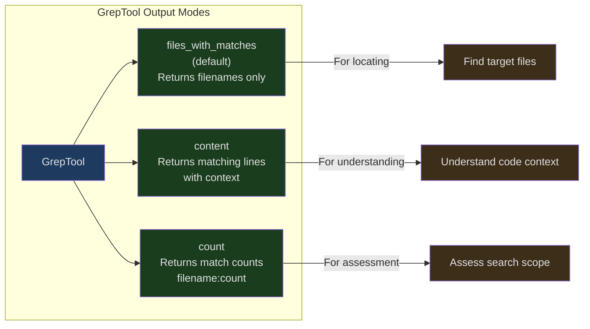
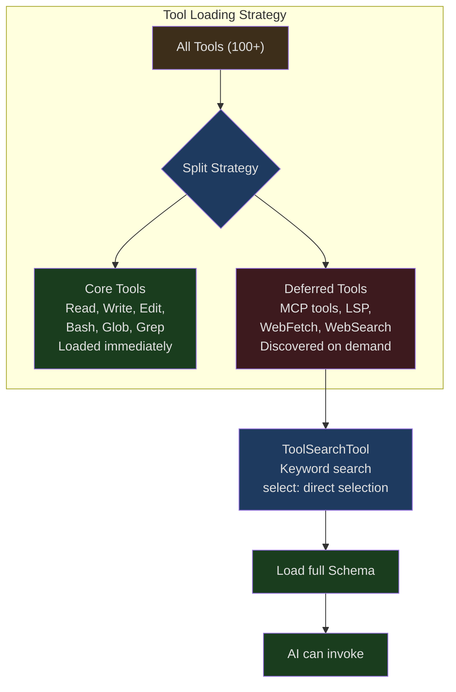
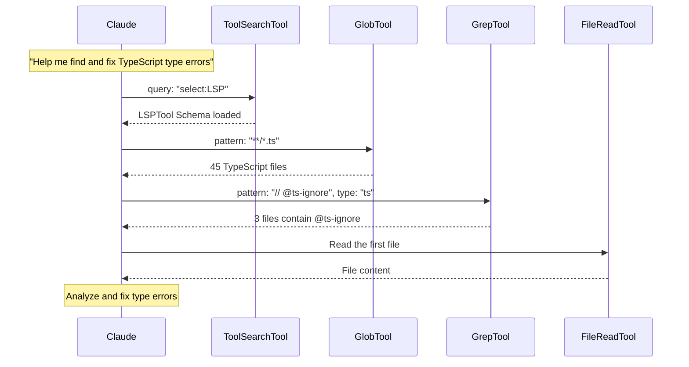

## Introduction

When AI faces an unfamiliar codebase, its first question is not "how do I modify the code" but "where is the code." In a project containing tens of thousands of files, finding the right files and code locations is a prerequisite for everything else.

The traditional approach is to use `find` and `grep` commands. But these commands have several problems:

1. **Uncontrolled permissions** — Shell commands bypass Claude Code's permission system
2. **Uncontrolled output** — `grep -r pattern .` might return several MB of results, consuming a massive number of tokens
3. **Unfriendly format** — Shell command output is not always optimal for AI consumption

Claude Code's solution is three dedicated search tools: **GlobTool** (find files by name pattern), **GrepTool** (search by content), and **ToolSearchTool** (deferred tool discovery). Each solves a different layer of the search problem, and when used together they form a powerful search system.

---

## GlobTool: File Pattern Matching

GlobTool is the simplest search tool — given a glob pattern (like `**/*.ts`), it returns all matching file paths.

### Input and Output

```typescript
// src/tools/GlobTool/GlobTool.ts:26-53
const inputSchema = lazySchema(() =>
  z.strictObject({
    pattern: z.string().describe('The glob pattern to match files against'),
    path: z
      .string()
      .optional()
      .describe(
        'The directory to search in. If not specified, the current working directory will be used...',
      ),
  }),
)

const outputSchema = lazySchema(() =>
  z.object({
    durationMs: z.number().describe('Time taken to execute the search'),
    numFiles: z.number().describe('Total number of files found'),
    filenames: z.array(z.string()).describe('Array of file paths'),
    truncated: z.boolean().describe('Whether results were truncated (limited to 100 files)'),
  }),
)
```

Only two input parameters: `pattern` and an optional `path`. The output contains four fields, where the `truncated` flag tells the AI whether results were cut off.

### 100-File Truncation

```typescript
// src/tools/GlobTool/GlobTool.ts:154-176
  async call(input, { abortController, getAppState, globLimits }) {
    const start = Date.now()
    const appState = getAppState()
    const limit = globLimits?.maxResults ?? 100
    const { files, truncated } = await glob(
      input.pattern,
      GlobTool.getPath(input),
      { limit, offset: 0 },
      abortController.signal,
      appState.toolPermissionContext,
    )
    // Relativize paths under cwd to save tokens
    const filenames = files.map(toRelativePath)
    const output: Output = {
      filenames,
      durationMs: Date.now() - start,
      numFiles: filenames.length,
      truncated,
    }
    return { data: output }
  },
```

The default limit is 100 files. When results are truncated, a message prompts the AI to use a more specific path or pattern.

The truncation message:

```typescript
// src/tools/GlobTool/GlobTool.ts:186-196
  mapToolResultToToolResultBlockParam(output, toolUseID) {
    if (output.filenames.length === 0) {
      return { tool_use_id: toolUseID, type: 'tool_result', content: 'No files found' }
    }
    return {
      tool_use_id: toolUseID,
      type: 'tool_result',
      content: [
        ...output.filenames,
        ...(output.truncated
          ? ['(Results are truncated. Consider using a more specific path or pattern.)']
          : []),
      ].join('\n'),
    }
  },
```

### Path Relativization

```typescript
// Relativize paths under cwd to save tokens (same as GrepTool)
const filenames = files.map(toRelativePath)
```

All returned paths are relativized — `/Users/noah/project/src/index.ts` becomes `src/index.ts`. This is a token optimization: the project root path prefix in absolute paths repeats for every file, and relativizing saves a significant number of tokens.

### Concurrency Safety

```typescript
// src/tools/GlobTool/GlobTool.ts:76-81
  isConcurrencySafe() {
    return true
  },
  isReadOnly() {
    return true
  },
```

GlobTool is a completely concurrency-safe, read-only operation. Multiple GlobTool calls can execute in parallel without interfering with each other. This means the AI can simultaneously search `**/*.ts` and `**/*.tsx` without serialization.

---

## GrepTool: Content Search Based on ripgrep

GrepTool is the core of the search system, built on ripgrep (`rg`), providing capabilities far beyond native `grep`.

### Rich Input Schema

```typescript
// src/tools/GrepTool/GrepTool.ts:33-89
const inputSchema = lazySchema(() =>
  z.strictObject({
    pattern: z.string().describe('The regular expression pattern to search for'),
    path: z.string().optional().describe('File or directory to search in'),
    glob: z.string().optional().describe('Glob pattern to filter files'),
    output_mode: z.enum(['content', 'files_with_matches', 'count']).optional(),
    '-B': semanticNumber(z.number().optional()).describe('Lines before match'),
    '-A': semanticNumber(z.number().optional()).describe('Lines after match'),
    '-C': semanticNumber(z.number().optional()).describe('Alias for context'),
    context: semanticNumber(z.number().optional()).describe('Lines before and after'),
    '-n': semanticBoolean(z.boolean().optional()).describe('Show line numbers'),
    '-i': semanticBoolean(z.boolean().optional()).describe('Case insensitive'),
    type: z.string().optional().describe('File type (js, py, rust, etc.)'),
    head_limit: semanticNumber(z.number().optional()).describe('Limit output'),
    offset: semanticNumber(z.number().optional()).describe('Skip first N entries'),
    multiline: semanticBoolean(z.boolean().optional()).describe('Multiline mode'),
  }),
)
```

13 parameters! This is the tool with the most parameters in Claude Code. The design philosophy is: expose ripgrep's core capabilities directly to the AI, rather than over-abstracting.

### Three Output Modes



- **files_with_matches** — Default mode. Returns only the paths of matching files, sorted by modification time. Ideal for locating before detailed reading
- **content** — Returns matching lines with their context. Supports `-A`/`-B`/`-C` for controlling context lines
- **count** — Returns the match count per file. Useful for quickly assessing search scope

### Pagination System

```typescript
// src/tools/GrepTool/GrepTool.ts:106-128
const DEFAULT_HEAD_LIMIT = 250

function applyHeadLimit<T>(
  items: T[],
  limit: number | undefined,
  offset: number = 0,
): { items: T[]; appliedLimit: number | undefined } {
  // Explicit 0 = unlimited escape hatch
  if (limit === 0) {
    return { items: items.slice(offset), appliedLimit: undefined }
  }
  const effectiveLimit = limit ?? DEFAULT_HEAD_LIMIT
  const sliced = items.slice(offset, offset + effectiveLimit)
  // Only report appliedLimit when truncation actually occurred
  const wasTruncated = items.length - offset > effectiveLimit
  return {
    items: sliced,
    appliedLimit: wasTruncated ? effectiveLimit : undefined,
  }
}
```

The default limit is 250 results. Design highlights:

1. `limit: 0` is the "unlimited" escape hatch
2. `appliedLimit` is only set when truncation actually occurs, telling the AI it can use `offset` to page through more results
3. The `offset` parameter achieves the effect of `tail -n +N | head -N`

### Excluded Directories

```typescript
// src/tools/GrepTool/GrepTool.ts:94-102
const VCS_DIRECTORIES_TO_EXCLUDE = [
  '.git', '.svn', '.hg', '.bzr', '.jj', '.sl',
] as const
```

Version control directories are automatically excluded, since searching inside `.git` is almost never useful and produces a lot of noise. Six version control systems are supported (Git, SVN, Mercurial, Bazaar, Jujutsu, Sapling).

### ripgrep Argument Construction

```typescript
// src/tools/GrepTool/GrepTool.ts:329-441
  async call({ pattern, path, glob, type, output_mode = 'files_with_matches',
    '-B': context_before, '-A': context_after, '-C': context_c, context,
    '-n': show_line_numbers = true, '-i': case_insensitive = false,
    head_limit, offset = 0, multiline = false,
  }, { abortController, getAppState }) {
    const absolutePath = path ? expandPath(path) : getCwd()
    const args = ['--hidden']

    for (const dir of VCS_DIRECTORIES_TO_EXCLUDE) {
      args.push('--glob', `!${dir}`)
    }

    args.push('--max-columns', '500')  // Limit line length

    if (multiline) {
      args.push('-U', '--multiline-dotall')
    }
    // ... build more args
  }
```

Note `--max-columns 500`: this limits line width to 500 characters, preventing base64-encoded or compressed content (typically thousands of characters per line) from flooding search results.

### files_with_matches Mode Sorting

```typescript
// src/tools/GrepTool/GrepTool.ts:529-553
    const stats = await Promise.allSettled(
      results.map(_ => getFsImplementation().stat(_)),
    )
    const sortedMatches = results
      .map((_, i) => {
        const r = stats[i]!
        return [
          _,
          r.status === 'fulfilled' ? (r.value.mtimeMs ?? 0) : 0,
        ] as const
      })
      .sort((a, b) => {
        if (process.env.NODE_ENV === 'test') {
          return a[0].localeCompare(b[0])  // Sort by filename in tests for determinism
        }
        const timeComparison = b[1] - a[1]
        if (timeComparison === 0) {
          return a[0].localeCompare(b[0])  // Filename as tiebreaker
        }
        return timeComparison
      })
```

Results are sorted by **modification time in descending order** by default — the most recently modified files appear first. The design assumption is: users most likely care about the most recently active files. In test environments, sorting is switched to filename-based for determinism.

`Promise.allSettled` is used instead of `Promise.all`: if a file is deleted between the ripgrep scan and the stat call, it will not cause the entire batch to fail. Failed stats are treated as mtime 0.

### Ignore Pattern Integration

```typescript
// src/tools/GrepTool/GrepTool.ts:412-427
    const ignorePatterns = normalizePatternsToPath(
      getFileReadIgnorePatterns(appState.toolPermissionContext),
      getCwd(),
    )
    for (const ignorePattern of ignorePatterns) {
      const rgIgnorePattern = ignorePattern.startsWith('/')
        ? `!${ignorePattern}`
        : `!**/${ignorePattern}`
      args.push('--glob', rgIgnorePattern)
    }
```

Deny rules configured in the permission system are converted to ripgrep glob exclusion patterns. Non-absolute paths require a `**/` prefix because ripgrep only applies gitignore patterns relative to the working directory.

---

## ToolSearchTool: Deferred Tool Discovery

ToolSearchTool addresses a completely different search problem: when Claude Code has 100+ tools, how does the AI efficiently find the ones it needs?

### Motivation for Deferred Loading



If the full schemas of all tools were included in the initial prompt, it would consume a massive number of tokens. ToolSearchTool implements a kind of "tool directory": deferred tools only have their names listed in the system-reminder, and the AI retrieves full definitions through ToolSearchTool when needed.

### Deferred Tool Determination

```typescript
// src/tools/ToolSearchTool/prompt.ts:62-108
export function isDeferredTool(tool: Tool): boolean {
  // Explicit opt-out via _meta['anthropic/alwaysLoad']
  if (tool.alwaysLoad === true) return false

  // MCP tools are always deferred (workflow-specific)
  if (tool.isMcp === true) return true

  // Never defer ToolSearch itself
  if (tool.name === TOOL_SEARCH_TOOL_NAME) return false

  // Agent tool must be available turn 1 in fork-first mode
  if (feature('FORK_SUBAGENT') && tool.name === AGENT_TOOL_NAME) {
    if (m.isForkSubagentEnabled()) return false
  }

  return tool.shouldDefer === true
}
```

The priority of determination rules:

1. `alwaysLoad: true` — Never deferred (MCP tools can set this via `_meta`)
2. MCP tools — Deferred by default (workflow-specific)
3. ToolSearchTool itself — Never deferred (the tool used to load other tools cannot be deferred)
4. Special tools (Agent, Brief) — Conditionally not deferred
5. `shouldDefer: true` — Deferred

### Two Query Modes

```typescript
// src/tools/ToolSearchTool/ToolSearchTool.ts:21-33
export const inputSchema = lazySchema(() =>
  z.object({
    query: z
      .string()
      .describe(
        'Query to find deferred tools. Use "select:<tool_name>" for direct selection, or keywords to search.',
      ),
    max_results: z
      .number()
      .optional()
      .default(5)
      .describe('Maximum number of results to return (default: 5)'),
  }),
)
```

**select: mode** — Exact selection: `select:Read,Edit,Grep` fetches tools directly by name. Supports comma-separated multi-selection.

**Keyword search** — Fuzzy search: `notebook jupyter` searches tool names and descriptions, returning the most relevant results.

### Keyword Scoring Algorithm

```typescript
// src/tools/ToolSearchTool/ToolSearchTool.ts:259-301
async function searchToolsWithKeywords(query, deferredTools, tools, maxResults) {
  // ...
  const scored = await Promise.all(
    candidateTools.map(async tool => {
      const parsed = parseToolName(tool.name)
      const description = await getToolDescriptionMemoized(tool.name, tools)
      const hintNormalized = tool.searchHint?.toLowerCase() ?? ''

      let score = 0
      for (const term of allScoringTerms) {
        const pattern = termPatterns.get(term)!

        // Exact part match (high weight for MCP server names)
        if (parsed.parts.includes(term)) {
          score += parsed.isMcp ? 12 : 10
        } else if (parsed.parts.some(part => part.includes(term))) {
          score += parsed.isMcp ? 6 : 5
        }

        // searchHint match — curated phrase, higher signal than prompt
        if (hintNormalized && pattern.test(hintNormalized)) {
          score += 4
        }

        // Description match - word boundary to avoid false positives
        if (pattern.test(descNormalized)) {
          score += 2
        }
      }

      return { name: tool.name, score }
    }),
  )
}
```

Scoring tiers:
| Match Type | Score (Regular) | Score (MCP) |
|------------|----------------|-------------|
| Exact tool name part match | 10 | 12 |
| Tool name contains match | 5 | 6 |
| searchHint match | 4 | 4 |
| Full name fallback match | 3 | 3 |
| Description word boundary match | 2 | 2 |

MCP tools receive higher name-match scores because MCP tool names typically contain server names (e.g., `mcp__slack__send_message`), and searching by server name is the most common query pattern.

### `+` Prefix for Required Terms

```typescript
// src/tools/ToolSearchTool/ToolSearchTool.ts:223-232
  const requiredTerms: string[] = []
  const optionalTerms: string[] = []
  for (const term of queryTerms) {
    if (term.startsWith('+') && term.length > 1) {
      requiredTerms.push(term.slice(1))
    } else {
      optionalTerms.push(term)
    }
  }
```

`+slack send` means: the tool name or description **must** contain "slack," and then results are ranked by relevance to "send" among the qualifying tools. This makes searches more precise.

### Tool Reference Returns

```typescript
// src/tools/ToolSearchTool/ToolSearchTool.ts:444-470
  mapToolResultToToolResultBlockParam(content: Output, toolUseID: string) {
    if (content.matches.length === 0) {
      let text = 'No matching deferred tools found'
      if (content.pending_mcp_servers?.length > 0) {
        text += `. Some MCP servers are still connecting: ${content.pending_mcp_servers.join(', ')}...`
      }
      return { type: 'tool_result', tool_use_id: toolUseID, content: text }
    }
    return {
      type: 'tool_result',
      tool_use_id: toolUseID,
      content: content.matches.map(name => ({
        type: 'tool_reference' as const,
        tool_name: name,
      })),
    }
  },
```

It returns `tool_reference` type content blocks — a special Anthropic API format that tells the API to inject the matched tools' full schemas into the model's context. The AI can then use these tools on the next turn.

When some MCP servers are still connecting, the return message includes a list of pending servers, prompting the AI to retry later.

---

## Three-Tool Combined Workflow



The typical usage sequence:

1. **ToolSearchTool** — If specialized tools are needed (LSP, WebFetch, etc.), load them first via ToolSearch
2. **GlobTool** — Build a file inventory, understand project structure
3. **GrepTool** — Search for specific content in target files
4. **FileReadTool** — Read the found files in detail

This sequence progresses from coarse to fine, gradually narrowing the search scope. Each step uses path relativization to save tokens.

---

## Prompt Guidance

BashTool's prompt explicitly guides the AI to use search tools rather than shell commands:

```typescript
// src/tools/BashTool/prompt.ts:280-286
const toolPreferenceItems = [
  `File search: Use ${GLOB_TOOL_NAME} (NOT find or ls)`,
  `Content search: Use ${GREP_TOOL_NAME} (NOT grep or rg)`,
]
```

GrepTool's own prompt also emphasizes this:

```typescript
// src/tools/GrepTool/prompt.ts:7-17
`A powerful search tool built on ripgrep

  Usage:
  - ALWAYS use Grep for search tasks. NEVER invoke \`grep\` or \`rg\` as a Bash command.
    The Grep tool has been optimized for correct permissions and access.
  - Supports full regex syntax (e.g., "log.*Error", "function\\s+\\w+")
  - Filter files with glob parameter (e.g., "*.js", "**/*.tsx")
  - Output modes: "content", "files_with_matches" (default), "count"
  - Use Agent tool for open-ended searches requiring multiple rounds
  - Pattern syntax: Uses ripgrep (not grep) - literal braces need escaping`
```

Key point: explicit "ALWAYS" and "NEVER" directives are more effective at guiding AI behavior than "prefer."

---

## Design Takeaways

Claude Code's search system embodies several core design principles:

1. **Dedicated tools over generic commands** — Glob/Grep provide better permission control, token management, and formatted output than `find`/`grep`

2. **Progressive refinement** — From GlobTool's coarse-grained file discovery, to GrepTool's fine-grained content search, to FileReadTool's full read, the search workflow naturally progresses from broad to narrow

3. **Deferred loading** — ToolSearchTool lets the system support 100+ tools without consuming 100+ tools' worth of prompt tokens, loading only when needed

4. **Token-aware design** — Path relativization, result truncation, default head_limit, modification time sorting — every design decision considers token efficiency
