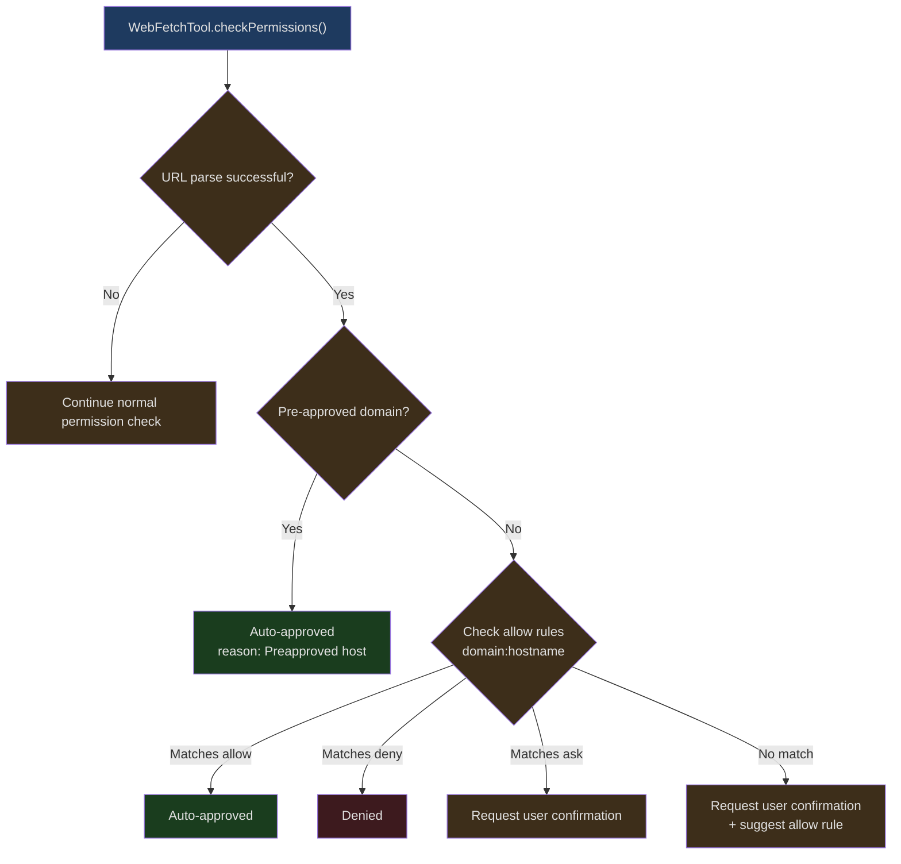
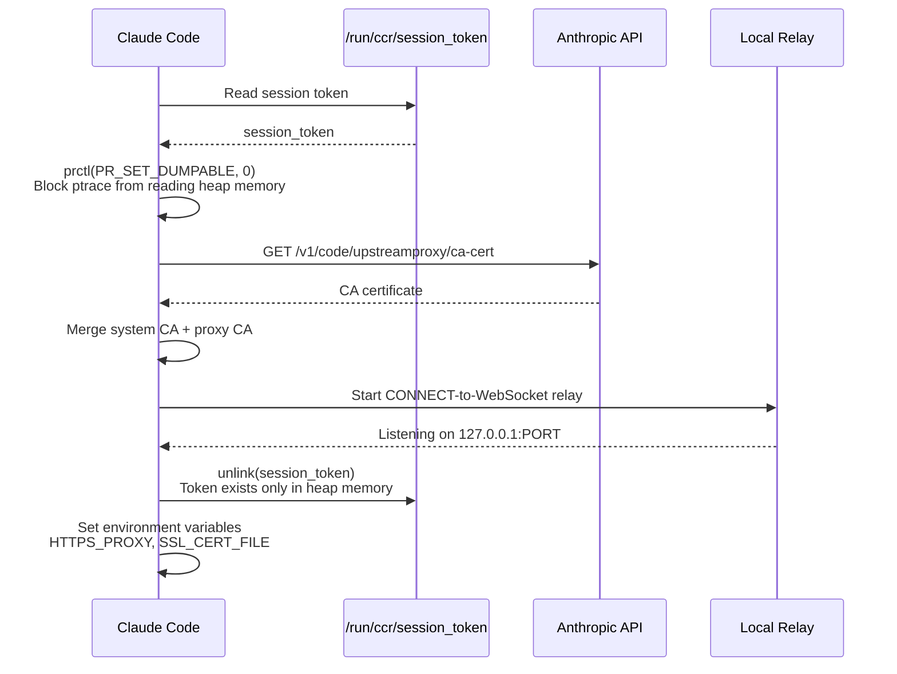
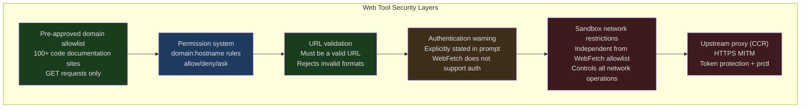

## Introduction

An AI coding assistant's knowledge has a natural cutoff date — the point in time of the model's training data. When users ask "how do I use React 19's new API" or "what breaking changes are in the latest version of this npm package," the AI can only rely on internet access to get up-to-date information.

But letting AI access the internet introduces new security challenges:

1. **SSRF (Server-Side Request Forgery)** — The AI could be injected with malicious URLs to access internal network services
2. **Data exfiltration** — Malicious web pages could instruct the AI to send user code to external destinations
3. **Token bombs** — A massive web page could consume the entire context space
4. **Credential leakage** — If the AI accesses web pages with the user's cookies or tokens, it could leak credentials

Claude Code addresses these issues through two dedicated tools: **WebFetchTool** (fetches content from a specified URL) and **WebSearchTool** (searches the internet). In CCR (Claude Code Remote) environments, an additional upstream proxy layer provides extra network control.

---

## WebFetchTool: Content Retrieval

WebFetchTool retrieves content from a specified URL and lets the AI process the fetched content using a natural language prompt.

### Input Model

```typescript
// src/tools/WebFetchTool/WebFetchTool.ts:24-30
const inputSchema = lazySchema(() =>
  z.strictObject({
    url: z.string().url().describe('The URL to fetch content from'),
    prompt: z.string().describe('The prompt to run on the fetched content'),
  }),
)
```

Two parameters: `url` and `prompt`. The `prompt` is designed so the AI does not just fetch raw content, but extracts information with a specific purpose. For example: "Extract all endpoints and their parameters from this API documentation."

The output includes the HTTP status code, processed text, fetch duration, and content size:

```typescript
// src/tools/WebFetchTool/WebFetchTool.ts:32-45
const outputSchema = lazySchema(() =>
  z.object({
    bytes: z.number().describe('Size of the fetched content in bytes'),
    code: z.number().describe('HTTP response code'),
    codeText: z.string().describe('HTTP response code text'),
    result: z.string().describe('Processed result from applying the prompt'),
    durationMs: z.number().describe('Time taken to fetch and process'),
    url: z.string().describe('The URL that was fetched'),
  }),
)
```

### Pre-Approved Domain Allowlist

One of WebFetchTool's most important security mechanisms is the pre-approved domain list:

```typescript
// src/tools/WebFetchTool/preapproved.ts:14-131
export const PREAPPROVED_HOSTS = new Set([
  // Anthropic
  'platform.claude.com',
  'code.claude.com',
  'modelcontextprotocol.io',

  // Top Programming Languages
  'docs.python.org',
  'en.cppreference.com',
  'developer.mozilla.org',
  'doc.rust-lang.org',
  'www.typescriptlang.org',

  // Web Frameworks
  'react.dev',
  'nextjs.org',
  'vuejs.org',
  'tailwindcss.com',

  // Cloud & DevOps
  'docs.aws.amazon.com',
  'cloud.google.com',
  'kubernetes.io',

  // ... 100+ domains total
])
```

These domains can be accessed **without user confirmation**. The selection criteria for the list is "code-related documentation sites" — they are read-only reference materials that do not involve authentication or user data.

Note the security warning in the source code:

```
// SECURITY WARNING: These preapproved domains are ONLY for WebFetch (GET requests only).
// The sandbox system deliberately does NOT inherit this list for network restrictions,
// as arbitrary network access (POST, uploads, etc.) to these domains could enable
// data exfiltration. Some domains like huggingface.co, kaggle.com, and nuget.org
// allow file uploads and would be dangerous for unrestricted network access.
```

This is a critical security distinction: WebFetch only makes GET requests (read-only), while the sandbox's network restrictions control arbitrary network operations (including POST). The two cannot share an allowlist.

### Path-Level Pre-Approval

```typescript
// src/tools/WebFetchTool/preapproved.ts:136-166
const { HOSTNAME_ONLY, PATH_PREFIXES } = (() => {
  const hosts = new Set<string>()
  const paths = new Map<string, string[]>()
  for (const entry of PREAPPROVED_HOSTS) {
    const slash = entry.indexOf('/')
    if (slash === -1) {
      hosts.add(entry)
    } else {
      const host = entry.slice(0, slash)
      const path = entry.slice(slash)
      const prefixes = paths.get(host)
      if (prefixes) prefixes.push(path)
      else paths.set(host, [path])
    }
  }
  return { HOSTNAME_ONLY: hosts, PATH_PREFIXES: paths }
})()

export function isPreapprovedHost(hostname: string, pathname: string): boolean {
  if (HOSTNAME_ONLY.has(hostname)) return true
  const prefixes = PATH_PREFIXES.get(hostname)
  if (prefixes) {
    for (const p of prefixes) {
      // Enforce path segment boundaries
      if (pathname === p || pathname.startsWith(p + '/')) return true
    }
  }
  return false
}
```

Some domains are only pre-approved for specific paths. For example, `github.com/anthropics` is pre-approved, but `github.com/random-user` is not. Path matching enforces segment boundaries (`/`), preventing `/anthropics-evil/malware` from being falsely matched.

The data structure is preprocessed at module load time into two lookup tables (`HOSTNAME_ONLY` Set and `PATH_PREFIXES` Map), making runtime matching O(1).

### Permission Check Flow



Permission rules are stored in `domain:hostname` format. When a user approves access to a domain, all URLs on that domain are approved.

### Authentication Warning in the Prompt

```typescript
// src/tools/WebFetchTool/WebFetchTool.ts:181-189
  async prompt(_options) {
    return `IMPORTANT: WebFetch WILL FAIL for authenticated or private URLs. Before using this tool, check if the URL points to an authenticated service (e.g. Google Docs, Confluence, Jira, GitHub). If so, look for a specialized MCP tool that provides authenticated access.
${DESCRIPTION}`
  },
```

This warning is always included in the prompt, regardless of whether ToolSearchTool is available. The source code comments explain why: if this prefix were conditionally toggled based on ToolSearch availability, it would cause the tool description to "flicker" between consecutive API calls, breaking Anthropic API's prompt caching — each flicker means two cache misses.

---

## WebSearchTool: Internet Search

WebSearchTool uses Anthropic's Web Search API to search the internet. Unlike WebFetchTool, it does not fetch a specific URL but searches the entire internet.

### Architectural Uniqueness

WebSearchTool is not simply calling a search API — it uses a **model-within-a-model** architecture:

```typescript
// src/tools/WebSearchTool/WebSearchTool.ts:254-291
  async call(input, context, _canUseTool, _parentMessage, onProgress) {
    const { query } = input
    const userMessage = createUserMessage({
      content: 'Perform a web search for the query: ' + query,
    })
    const toolSchema = makeToolSchema(input)

    const queryStream = queryModelWithStreaming({
      messages: [userMessage],
      systemPrompt: asSystemPrompt([
        'You are an assistant for performing a web search tool use',
      ]),
      tools: [],
      signal: context.abortController.signal,
      options: {
        extraToolSchemas: [toolSchema],
        querySource: 'web_search_tool',
        // ...
      },
    })
    // ...
  }
```

It creates an internal API call, passing a tool schema of type `web_search_20250305`. The API side automatically executes the search and returns results. The benefit of this architecture is: the actual search execution is handled by Anthropic's infrastructure, and the client only needs to process the streaming response.

### Search Limits

```typescript
// src/tools/WebSearchTool/WebSearchTool.ts:76-84
function makeToolSchema(input: Input): BetaWebSearchTool20250305 {
  return {
    type: 'web_search_20250305',
    name: 'web_search',
    allowed_domains: input.allowed_domains,
    blocked_domains: input.blocked_domains,
    max_uses: 8, // Hardcoded to 8 searches maximum
  }
}
```

Each call executes a maximum of 8 searches. `allowed_domains` and `blocked_domains` let the AI control the search scope — for example, searching only official documentation sites, or excluding known low-quality result sources.

### Provider Availability

```typescript
// src/tools/WebSearchTool/WebSearchTool.ts:169-193
  isEnabled() {
    const provider = getAPIProvider()
    const model = getMainLoopModel()

    if (provider === 'firstParty') return true

    if (provider === 'vertex') {
      const supportsWebSearch =
        model.includes('claude-opus-4') ||
        model.includes('claude-sonnet-4') ||
        model.includes('claude-haiku-4')
      return supportsWebSearch
    }

    if (provider === 'foundry') return true

    return false
  },
```

WebSearchTool is only available on providers that support the Web Search API: Anthropic first-party, Google Vertex (Claude 4.0+ models only), and Foundry.

### Progress Reporting

```typescript
// src/tools/WebSearchTool/WebSearchTool.ts:298-388
    for await (const event of queryStream) {
      // Track tool use ID when server_tool_use starts
      if (event.type === 'stream_event' &&
          event.event?.type === 'content_block_start') {
        const contentBlock = event.event.content_block
        if (contentBlock?.type === 'server_tool_use') {
          currentToolUseId = contentBlock.id
          currentToolUseJson = ''
        }
      }

      // Accumulate JSON for current tool use
      if (currentToolUseId &&
          event.type === 'stream_event' &&
          event.event?.type === 'content_block_delta') {
        const delta = event.event.delta
        if (delta?.type === 'input_json_delta' && delta.partial_json) {
          currentToolUseJson += delta.partial_json
          // Try to extract query from partial JSON for progress updates
          // ...
        }
      }

      // Yield progress when search results come in
      if (event.type === 'stream_event' &&
          event.event?.type === 'content_block_start') {
        const contentBlock = event.event.content_block
        if (contentBlock?.type === 'web_search_tool_result') {
          // Report progress
          if (onProgress) {
            onProgress({
              toolUseID: toolUseId,
              data: { type: 'search_results_received', resultCount, query },
            })
          }
        }
      }
    }
```

WebSearchTool reports progress during the search process via the `onProgress` callback. Since the search is streaming, it can update the UI in real-time as search results arrive, rather than waiting for all searches to complete before returning.

---

## Upstream Proxy

In CCR (Claude Code Remote) environments, all network traffic is routed through an upstream proxy, providing additional security controls.

### Initialization Flow



```typescript
// src/upstreamproxy/upstreamproxy.ts:79-153
export async function initUpstreamProxy(opts?) {
  if (!isEnvTruthy(process.env.CLAUDE_CODE_REMOTE)) return state
  if (!isEnvTruthy(process.env.CCR_UPSTREAM_PROXY_ENABLED)) return state

  const token = await readToken(tokenPath)
  if (!token) return state

  setNonDumpable()

  const caOk = await downloadCaBundle(baseUrl, systemCaPath, caBundlePath)
  if (!caOk) return state

  try {
    const relay = await startUpstreamProxyRelay({ wsUrl, sessionId, token })
    registerCleanup(async () => relay.stop())
    state = { enabled: true, port: relay.port, caBundlePath }

    // Only unlink after the listener is up
    await unlink(tokenPath).catch(() => {})
  } catch (err) {
    // Fail open — a broken proxy must never break a session
  }

  return state
}
```

Key security measures:

1. **prctl protection** — `PR_SET_DUMPABLE=0` prevents same-UID processes from reading this process's heap memory via ptrace. This blocks prompt injection attacks that attempt to steal the session token via `gdb -p $PPID`

2. **Token file deletion** — The token is deleted from disk after the relay starts successfully, remaining only in process memory. Deletion occurs only after the relay confirms availability, so the supervisor can retry with the on-disk token if startup fails

3. **Fail open** — Failure at any step simply disables the proxy without interrupting the session. The comment makes it clear: "A broken proxy setup must never break an otherwise-working session."

### NO_PROXY List

```typescript
// src/upstreamproxy/upstreamproxy.ts:37-63
const NO_PROXY_LIST = [
  'localhost', '127.0.0.1', '::1',
  '169.254.0.0/16',     // Link-local
  '10.0.0.0/8',         // RFC1918
  '172.16.0.0/12',
  '192.168.0.0/16',

  // Anthropic API — three forms because NO_PROXY parsing differs:
  'anthropic.com',       // apex domain fallback
  '.anthropic.com',      // Python urllib/httpx (suffix match)
  '*.anthropic.com',     // Bun, curl, Go (glob match)

  'github.com',
  'registry.npmjs.org',
  'pypi.org',
].join(',')
```

The same Anthropic API domain uses three different formats because different runtimes (Bun, Python, Go) parse `NO_PROXY` differently. This defensive programming ensures Anthropic API requests never go through the upstream proxy, avoiding the MITM proxy's fake CA from breaking HTTPS validation in non-Bun runtimes.

### Environment Variable Propagation

```typescript
// src/upstreamproxy/upstreamproxy.ts:160-199
export function getUpstreamProxyEnv(): Record<string, string> {
  if (!state.enabled || !state.port || !state.caBundlePath) {
    // If we inherited proxy vars from the parent, pass them through
    if (process.env.HTTPS_PROXY && process.env.SSL_CERT_FILE) {
      const inherited: Record<string, string> = {}
      for (const key of ['HTTPS_PROXY', 'https_proxy', 'NO_PROXY', 'no_proxy',
        'SSL_CERT_FILE', 'NODE_EXTRA_CA_CERTS', 'REQUESTS_CA_BUNDLE',
        'CURL_CA_BUNDLE']) {
        if (process.env[key]) inherited[key] = process.env[key]
      }
      return inherited
    }
    return {}
  }
  const proxyUrl = `http://127.0.0.1:${state.port}`
  return {
    HTTPS_PROXY: proxyUrl,
    https_proxy: proxyUrl,       // lowercase for Python
    NO_PROXY: NO_PROXY_LIST,
    no_proxy: NO_PROXY_LIST,     // lowercase for Python
    SSL_CERT_FILE: state.caBundlePath,
    NODE_EXTRA_CA_CERTS: state.caBundlePath,
    REQUESTS_CA_BUNDLE: state.caBundlePath,  // Python requests
    CURL_CA_BUNDLE: state.caBundlePath,      // curl
  }
}
```

Proxy environment variables are set in multiple formats to cover different client libraries:
- `HTTPS_PROXY` / `https_proxy` — Both cases (Node.js uses uppercase, Python uses lowercase)
- `SSL_CERT_FILE` — OpenSSL generic
- `NODE_EXTRA_CA_CERTS` — Node.js specific
- `REQUESTS_CA_BUNDLE` — Python requests library
- `CURL_CA_BUNDLE` — curl command

Subprocesses (Bash, MCP, LSP, Hooks) all inherit these variables through `subprocessEnv()`.

---

## Security Considerations Summary



Six layers of security protection, from the most permissive (pre-approved allowlist auto-approves) to the most restrictive (upstream proxy MITM interception), forming defense in depth.

The key security isolation: **WebFetch allowlist =/= sandbox network allowlist**. huggingface.co may be a safe source for reading documentation (WebFetch), but allowing it through the sandbox for arbitrary network operations could become a data exfiltration channel (it supports file uploads).

---

## Design Takeaways

Claude Code's web tool design embodies several core principles:

1. **Least privilege** — No domain access is allowed by default; only code documentation sites are pre-approved, everything else requires explicit user authorization

2. **Security isolation** — WebFetch (read-only GET) and sandbox network (arbitrary operations) have independent allowlists; WebSearch does not need an allowlist (controlled on the API side)

3. **Fail open vs. fail closed** — The upstream proxy fails open (does not break the session), but permission checks fail closed (block access). This reflects different components' risk levels

4. **Multi-runtime compatibility** — Environment variables, NO_PROXY formats, CA certificate paths — every network configuration accounts for differences across Bun/Node.js/Python/curl
