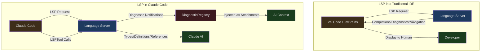
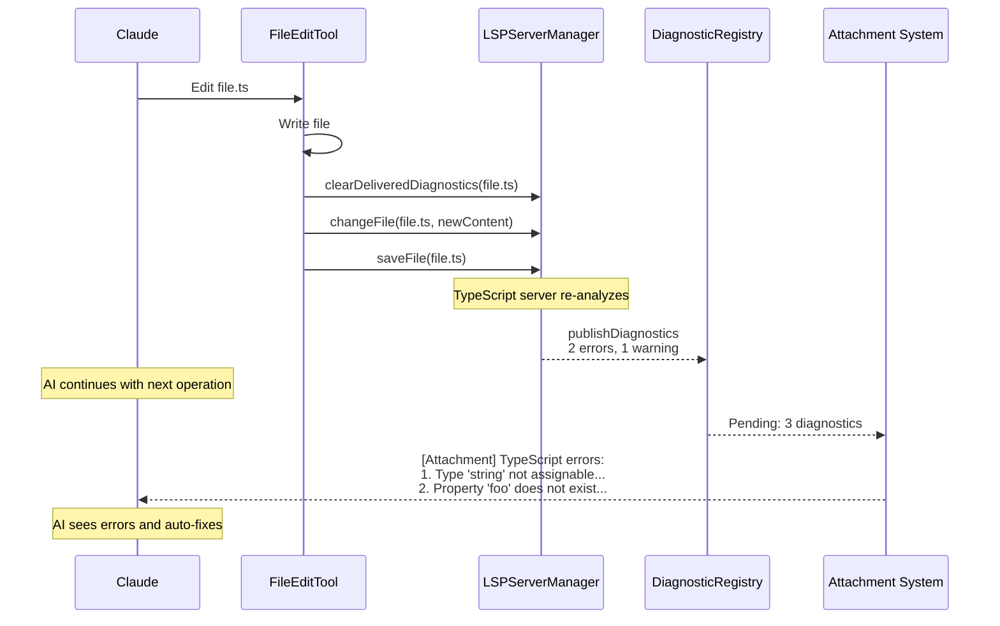

## The Problem

Language Server Protocol (LSP) is the cornerstone of modern IDEs — it provides editors with code completion, go-to-definition, find references, hover information, and more. But Claude Code is not an IDE; it's an AI coding assistant. So why does it need LSP?

Consider this scenario: the AI modifies a TypeScript file, changing a function parameter from `string` to `number`. But it doesn't check all the call sites — some callers still pass in a `string`. Without LSP, the AI has no idea it introduced type errors until the user runs the `tsc` compiler or sees red squiggly lines in their IDE.

Claude Code's LSP integration isn't about turning the terminal into an IDE. Its core purpose is to **give the AI immediate semantic feedback after editing code** — type errors, unused variables, missing references — information that helps the AI fix its own mistakes within the same interaction loop.

---

## The Role of LSP in Claude Code



Two key differences:

1. **Different consumer** — In IDEs, LSP output is for humans to see; in Claude Code, LSP output is for the AI to consume
2. **Different trigger model** — IDEs proactively request LSP during user interaction; Claude Code passively receives diagnostics after file edits, and only sends active requests when the AI explicitly invokes LSPTool

---

## LSPServerManager: Multi-Language Server Management

### Architecture Overview

```typescript
// src/services/lsp/LSPServerManager.ts:16-43
export type LSPServerManager = {
  initialize(): Promise<void>
  shutdown(): Promise<void>
  getServerForFile(filePath: string): LSPServerInstance | undefined
  ensureServerStarted(filePath: string): Promise<LSPServerInstance | undefined>
  sendRequest<T>(filePath: string, method: string, params: unknown): Promise<T | undefined>
  getAllServers(): Map<string, LSPServerInstance>
  openFile(filePath: string, content: string): Promise<void>
  changeFile(filePath: string, content: string): Promise<void>
  saveFile(filePath: string): Promise<void>
  closeFile(filePath: string): Promise<void>
  isFileOpen(filePath: string): boolean
}
```

LSPServerManager manages multiple language server instances and routes requests to the correct server based on file extension. It uses a **factory function pattern** (rather than classes), encapsulating internal state through closures:

```typescript
// src/services/lsp/LSPServerManager.ts:59-65
export function createLSPServerManager(): LSPServerManager {
  const servers: Map<string, LSPServerInstance> = new Map()
  const extensionMap: Map<string, string[]> = new Map()
  const openedFiles: Map<string, string> = new Map()
  // ... private state within the closure
}
```

### Extension-to-Server Mapping

```typescript
// src/services/lsp/LSPServerManager.ts:88-104
    for (const [serverName, config] of Object.entries(serverConfigs)) {
      if (!config.command) {
        throw new Error(`Server ${serverName} missing required 'command' field`)
      }
      if (!config.extensionToLanguage ||
          Object.keys(config.extensionToLanguage).length === 0) {
        throw new Error(`Server ${serverName} missing required 'extensionToLanguage'`)
      }

      const fileExtensions = Object.keys(config.extensionToLanguage)
      for (const ext of fileExtensions) {
        const normalized = ext.toLowerCase()
        if (!extensionMap.has(normalized)) {
          extensionMap.set(normalized, [])
        }
        extensionMap.get(normalized)!.push(serverName)
      }

      const instance = createLSPServerInstance(serverName, config)
      servers.set(serverName, instance)
    }
```

Each language server configuration declares the file extensions it supports and the corresponding language identifiers. An extension can map to multiple servers (though this is uncommon). Servers are started on first use (lazy initialization).

### workspace/configuration Handling

```typescript
// src/services/lsp/LSPServerManager.ts:124-135
      instance.onRequest(
        'workspace/configuration',
        (params: { items: Array<{ section?: string }> }) => {
          logForDebugging(
            `LSP: Received workspace/configuration request from ${serverName}`,
          )
          return params.items.map(() => null)
        },
      )
```

Some language servers (such as TypeScript) send `workspace/configuration` requests even when the client declares it doesn't support them. Claude Code returns `null` for each request item, satisfying the protocol requirement without providing actual configuration.

---

## Global Singleton and Lifecycle

```typescript
// src/services/lsp/manager.ts:14-25
type InitializationState = 'not-started' | 'pending' | 'success' | 'failed'

let lspManagerInstance: LSPServerManager | undefined
let initializationState: InitializationState = 'not-started'
let initializationError: Error | undefined
let initializationGeneration = 0
let initializationPromise: Promise<void> | undefined
```

The LSP manager is a global singleton with four states:

```mermaid
stateDiagram-v2
  [*] --> not_started
  not_started --> pending: initializeLspServerManager()
  pending --> success: Initialization complete
  pending --> failed: Initialization failed
  failed --> pending: reinitializeLspServerManager()
  success --> not_started: reinitializeLspServerManager()

  state not_started {
    description: Not started
  }
  state pending {
    description: Initializing
  }
  state success {
    description: Initialization succeeded
  }
  state failed {
    description: Initialization failed
  }
```

### Generation Counter

```typescript
// src/services/lsp/manager.ts:145-207
export function initializeLspServerManager(): void {
  if (isBareMode()) return

  if (lspManagerInstance !== undefined && initializationState !== 'failed') return

  lspManagerInstance = createLSPServerManager()
  initializationState = 'pending'

  const currentGeneration = ++initializationGeneration

  initializationPromise = lspManagerInstance
    .initialize()
    .then(() => {
      if (currentGeneration === initializationGeneration) {
        initializationState = 'success'
        if (lspManagerInstance) {
          registerLSPNotificationHandlers(lspManagerInstance)
        }
      }
    })
    .catch((error: unknown) => {
      if (currentGeneration === initializationGeneration) {
        initializationState = 'failed'
        lspManagerInstance = undefined
      }
    })
}
```

`initializationGeneration` is a generation counter that prevents stale initialization Promises from updating state. When `reinitializeLspServerManager()` is called, the generation increments, so even if an old initialization completes later, it won't affect the new state.

This solved a real bug (issue #15521): `loadAllPlugins()` was memoized and called early during startup (via `getCommands` prefetching), when the marketplace hadn't coordinated yet, resulting in an empty plugin list. Once LSP was initialized with an empty list, it never reinitialized. The fix was to call `reinitializeLspServerManager()` when plugins are refreshed.

### Health Check

```typescript
// src/services/lsp/manager.ts:100-110
export function isLspConnected(): boolean {
  if (initializationState === 'failed') return false
  const manager = getLspServerManager()
  if (!manager) return false
  const servers = manager.getAllServers()
  if (servers.size === 0) return false
  for (const server of servers.values()) {
    if (server.state !== 'error') return true
  }
  return false
}
```

`isLspConnected()` checks whether at least one server is in a non-error state. This function underpins `LSPTool.isEnabled()` — the LSPTool only appears in the tool list when LSP is available.

---

## LSP Diagnostic Registry: Passive Diagnostic Injection

The most important feature of LSP integration isn't the LSPTool (which the AI uses actively), but **passive diagnostic injection** — language servers automatically send diagnostics in the background, and the system injects them into the AI's context.

### Notification Handling Flow

```typescript
// src/services/lsp/passiveFeedback.ts:125-279
export function registerLSPNotificationHandlers(
  manager: LSPServerManager,
): HandlerRegistrationResult {
  const servers = manager.getAllServers()

  for (const [serverName, serverInstance] of servers.entries()) {
    serverInstance.onNotification(
      'textDocument/publishDiagnostics',
      (params: unknown) => {
        // Validate params structure
        if (!params || typeof params !== 'object' ||
            !('uri' in params) || !('diagnostics' in params)) {
          return
        }

        const diagnosticParams = params as PublishDiagnosticsParams

        // Convert LSP diagnostics to Claude format
        const diagnosticFiles = formatDiagnosticsForAttachment(diagnosticParams)

        // Register for async delivery
        registerPendingLSPDiagnostic({
          serverName,
          files: diagnosticFiles,
        })
      },
    )
  }
}
```

Every language server has a registered `textDocument/publishDiagnostics` notification handler. After a file is edited, the language server re-analyzes it and pushes new diagnostic information.

### Severity Mapping

```typescript
// src/services/lsp/passiveFeedback.ts:18-35
function mapLSPSeverity(
  lspSeverity: number | undefined,
): 'Error' | 'Warning' | 'Info' | 'Hint' {
  switch (lspSeverity) {
    case 1: return 'Error'
    case 2: return 'Warning'
    case 3: return 'Info'
    case 4: return 'Hint'
    default: return 'Error'
  }
}
```

The LSP protocol uses numbers for severity levels; Claude Code converts them to string labels. The default is `Error` — when severity is unknown, it's better to overestimate the danger.

### DiagnosticRegistry: Deduplication and Rate Limiting

```typescript
// src/services/lsp/LSPDiagnosticRegistry.ts:41-47
const MAX_DIAGNOSTICS_PER_FILE = 10
const MAX_TOTAL_DIAGNOSTICS = 30
const MAX_DELIVERED_FILES = 500

const pendingDiagnostics = new Map<string, PendingLSPDiagnostic>()
const deliveredDiagnostics = new LRUCache<string, Set<string>>({
  max: MAX_DELIVERED_FILES,
})
```

Three layers of limits prevent diagnostics from flooding the context:

1. **Max 10 per file** — Sorted by severity priority (Error > Warning > Info > Hint)
2. **Max 30 total** — Global limit
3. **Cross-turn deduplication** — Previously delivered diagnostics are not sent again (tracked via an LRU cache for up to 500 files)

The deduplication key is composed of the message, severity, range, source, and code:

```typescript
// src/services/lsp/LSPDiagnosticRegistry.ts:110-124
function createDiagnosticKey(diag: {
  message: string
  severity?: string
  range?: unknown
  source?: string
  code?: unknown
}): string {
  return jsonStringify({
    message: diag.message,
    severity: diag.severity,
    range: diag.range,
    source: diag.source || null,
    code: diag.code || null,
  })
}
```

### Reset on File Edit

```typescript
// src/services/lsp/LSPDiagnosticRegistry.ts:372-379
export function clearDeliveredDiagnosticsForFile(fileUri: string): void {
  if (deliveredDiagnostics.has(fileUri)) {
    logForDebugging(
      `LSP Diagnostics: Clearing delivered diagnostics for ${fileUri}`,
    )
    deliveredDiagnostics.delete(fileUri)
  }
}
```

When a file is edited (triggered by FileWriteTool or FileEditTool), the delivered diagnostics for that file are cleared. This ensures new diagnostics are re-sent even if the content is identical — because they now correspond to the modified code.

---

## LSPTool: Active AI Queries

LSPTool allows the AI to proactively request LSP capabilities, rather than just passively receiving diagnostics.

### Supported Operations

```typescript
// src/tools/LSPTool/prompt.ts:3-21
export const DESCRIPTION = `Interact with Language Server Protocol (LSP) servers...

Supported operations:
- goToDefinition: Find where a symbol is defined
- findReferences: Find all references to a symbol
- hover: Get hover information (documentation, type info)
- documentSymbol: Get all symbols in a document
- workspaceSymbol: Search for symbols across the workspace
- goToImplementation: Find implementations of an interface
- prepareCallHierarchy: Get call hierarchy item at a position
- incomingCalls: Find all callers of a function
- outgoingCalls: Find all callees of a function`
```

Nine operations cover the core needs of code navigation. Note that `incomingCalls` and `outgoingCalls` require a two-step protocol — first `prepareCallHierarchy` to get a `CallHierarchyItem`, then use it to request the actual call relationships.

### Coordinate Conversion

```typescript
// src/tools/LSPTool/LSPTool.ts:427-513
function getMethodAndParams(input: Input, absolutePath: string) {
  const uri = pathToFileURL(absolutePath).href
  // Convert from 1-based (user-friendly) to 0-based (LSP protocol)
  const position = {
    line: input.line - 1,
    character: input.character - 1,
  }
  // ...
}
```

The LSP protocol uses 0-based coordinates, but editors and FileReadTool use 1-based coordinates. LSPTool performs the conversion at the boundary, allowing the AI to directly use the line numbers it sees in Read tool output.

### Gitignore Filtering

```typescript
// src/tools/LSPTool/LSPTool.ts:556-611
async function filterGitIgnoredLocations<T extends Location>(
  locations: T[],
  cwd: string,
): Promise<T[]> {
  const uniquePaths = uniq(uriToPath.values())
  const BATCH_SIZE = 50
  for (let i = 0; i < uniquePaths.length; i += BATCH_SIZE) {
    const batch = uniquePaths.slice(i, i + BATCH_SIZE)
    const result = await execFileNoThrowWithCwd(
      'git', ['check-ignore', ...batch],
      { cwd, timeout: 5_000 }
    )
    // ... parse ignored paths
  }
  return locations.filter(loc => !ignoredPaths.has(filePath))
}
```

LSP servers may return results from `node_modules` or other gitignored directories. Claude Code uses `git check-ignore` to batch-filter these results (50 paths per batch), preventing the AI from being distracted by irrelevant references.

### File Size Limit

```typescript
// src/tools/LSPTool/LSPTool.ts:53
const MAX_LSP_FILE_SIZE_BYTES = 10_000_000
```

Files exceeding 10MB are rejected from LSP analysis. Large files are typically generated code or data files — analyzing them with LSP is both slow and unhelpful.

### Deferred Tool Setup

```typescript
// src/tools/LSPTool/LSPTool.ts:137-139
  shouldDefer: true,
  isEnabled() {
    return isLspConnected()
  },
```

LSPTool is marked as `shouldDefer: true` — it doesn't appear in the initial prompt, and the AI needs to load it through ToolSearchTool. The `isEnabled()` check ensures the tool is only available when at least one language server has connected successfully.

---

## Bridge LSP Sharing

In Bridge mode (Claude Code running as a backend for the VS Code extension), the role of LSP changes. VS Code already has its own language servers, so Claude Code doesn't need to start another set.

```typescript
// src/services/lsp/manager.ts:145-150
export function initializeLspServerManager(): void {
  // --bare / SIMPLE: no LSP
  if (isBareMode()) {
    return
  }
  // ...
}
```

In bare mode (scripted `-p` invocations), LSP is completely disabled — there's no user interaction, so diagnostic feedback isn't needed.

In Bridge mode, diagnostics may be pushed directly from VS Code's LSP client (via the MCP SDK), rather than being managed by Claude Code's own language servers. This avoids the problem of two LSP clients competing for the same language server.

---

## Integration with File Editing Tools

The most valuable aspect of LSP integration is its automatic coordination with file editing tools:



This flow is fully automated — the AI doesn't need to proactively call anything to receive diagnostic feedback. FileEditTool notifies the LSP server after writing a file, the server analyzes the changes and pushes diagnostics, and the diagnostics are injected into the AI's next query via the attachment system.

---

## Design Insights

Claude Code's LSP integration embodies several core design principles:

1. **Designed for AI, not for humans** — LSP output isn't used to draw red squiggly lines in a UI. It's converted to structured text and injected as attachments into the AI's context

2. **Passive first, active as supplement** — Diagnostic injection is automatic (passive), while LSPTool is on-demand (active). Most of the time the AI doesn't need to actively call LSP — error information is delivered automatically

3. **Volume control** — 10 per file, 30 total, LRU deduplication — these limits ensure LSP information doesn't crowd out other valuable context

4. **Lazy startup** — Language servers start on demand, LSPTool loads lazily. In scenarios that don't need LSP (plain text editing, bash operations), the system doesn't pay the LSP initialization cost

5. **Defensive error handling** — Initialization failure returns undefined instead of throwing; generation counters prevent stale callbacks; notification handlers for each server are isolated — any LSP issue won't affect Claude Code's core functionality
