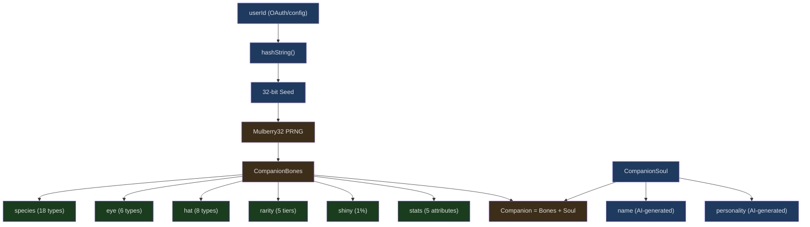
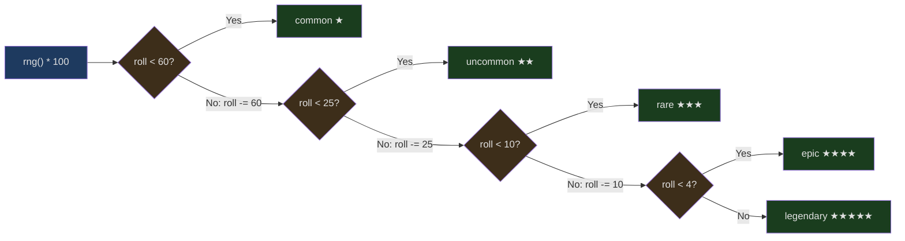
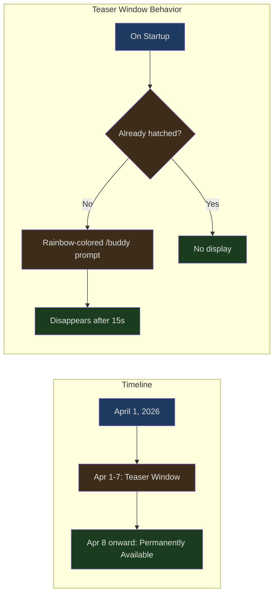

## The Problem

In a serious CLI coding tool, you type `/buddy`, and a duck wearing a crown pops up in your terminal, its eyes rendered as `✦` symbols, with `★★★★★ legendary` displayed next to it. It has a name, a personality, and five stat values. Every time you open Claude Code, the same duck appears — it's yours.

This isn't a joke. Claude Code's Buddy system is a fully-featured deterministic companion generator that uses a PRNG (Pseudo-Random Number Generator) to derive a unique virtual pet from your userId. The system touches on hash functions, weighted probability distributions, Bones/Soul persistence separation, and other serious engineering topics.

Let's look at the engineering design behind this "April Fools' easter egg."

---

## System Architecture Overview



The system splits into two entirely different data flows:

- **Bones** — Deterministically derived, never persisted. Recomputing from the userId always yields the exact same result
- **Soul** — Model-generated, stored in config after the first hatch. This is the only part that needs persistence

This separation is the most elegant architectural decision in the entire system, which we'll analyze in detail later.

---

## Mulberry32: A Deterministic Random Number Generator

At the heart of the Buddy system is a PRNG called Mulberry32. It's only 6 lines of code, but it determines what every user's companion looks like.

```typescript
// src/buddy/companion.ts:16-25
function mulberry32(seed: number): () => number {
  let a = seed >>> 0
  return function () {
    a |= 0
    a = (a + 0x6d2b79f5) | 0
    let t = Math.imul(a ^ (a >>> 15), 1 | a)
    t = (t + Math.imul(t ^ (t >>> 7), 61 | t)) ^ t
    return ((t ^ (t >>> 14)) >>> 0) / 4294967296
  }
}
```

### Why Mulberry32

In the world of PRNGs, there are many choices — xorshift128+, PCG, Mersenne Twister. Mulberry32's advantages are:

1. **Extremely compact** — State is just a single 32-bit integer, captured by a closure
2. **Good output quality** — Passes most tests in the BigCrush test suite (more than sufficient for this use case)
3. **Deterministic** — The same seed always produces the same sequence

The source code comment is refreshingly direct: `"good enough for picking ducks"`. This isn't cryptography — it's picking ducks.

### Bit Operation Breakdown

Let's break down this algorithm line by line:

```
a |= 0                                    // Force to 32-bit signed integer
a = (a + 0x6d2b79f5) | 0                  // Add a large prime as step constant
let t = Math.imul(a ^ (a >>> 15), 1 | a)  // Mix: XOR right-shift + multiply
t = (t + Math.imul(t ^ (t >>> 7), 61 | t)) ^ t  // Second round of mixing
return ((t ^ (t >>> 14)) >>> 0) / 4294967296     // Normalize to [0, 1)
```

`0x6d2b79f5` is a carefully chosen constant (decimal 1831565813) whose binary representation has a nearly uniform distribution of 0s and 1s. `>>> 0` converts the result to an unsigned 32-bit integer, and dividing by `4294967296` (i.e., 2^32) maps it to the `[0, 1)` interval — matching the range of `Math.random()`.

### From userId to Seed

```typescript
// src/buddy/companion.ts:27-37
function hashString(s: string): number {
  if (typeof Bun !== 'undefined') {
    return Number(BigInt(Bun.hash(s)) & 0xffffffffn)
  }
  let h = 2166136261
  for (let i = 0; i < s.length; i++) {
    h ^= s.charCodeAt(i)
    h = Math.imul(h, 16777619)
  }
  return h >>> 0
}
```

There are two code paths here:

- **Bun environment** — Uses Bun's built-in `Bun.hash()` (backed by wyhash), taking the lower 32 bits
- **Fallback path** — A hand-written FNV-1a hash. The initial value `2166136261` and multiplier `16777619` are standard FNV parameters

The SALT constant `'friend-2026-401'` is appended to the userId before hashing, ensuring that even if someone knows a user's userId, they can't predict the companion without knowing the salt:

```typescript
// src/buddy/companion.ts:84
const SALT = 'friend-2026-401'
```

The `401` in the name hints at April 1st — April Fools' Day.

---

## Species Encoding: A Trick to Bypass String Checks

The type definition file contains an interesting engineering decision. Look at how species are defined:

```typescript
// src/buddy/types.ts:14-26
const c = String.fromCharCode
export const duck = c(0x64,0x75,0x63,0x6b) as 'duck'
export const goose = c(0x67, 0x6f, 0x6f, 0x73, 0x65) as 'goose'
export const blob = c(0x62, 0x6c, 0x6f, 0x62) as 'blob'
export const cat = c(0x63, 0x61, 0x74) as 'cat'
export const dragon = c(0x64, 0x72, 0x61, 0x67, 0x6f, 0x6e) as 'dragon'
// ... 13 more species
```

Why not just write `export const duck = 'duck'`? The source comment explains:

> One species name collides with a model-codename canary in excluded-strings.txt. The check greps build output (not source), so runtime-constructing the value keeps the literal out of the bundle while the check stays armed for the actual codename.

Anthropic has an `excluded-strings.txt` file, and the build pipeline scans artifacts for these restricted strings (typically model codenames). One species name happens to collide with a model codename. The solution wasn't to encode just that one species, but to **uniformly encode all species names**, keeping the code style consistent and avoiding collision concerns when adding species in the future.

The full list of 18 species: duck, goose, blob, cat, dragon, octopus, owl, penguin, turtle, snail, ghost, axolotl, capybara, cactus, robot, rabbit, mushroom, chonk.

The `as 'duck'` type assertion ensures TypeScript's type system still knows the literal types of these values — type assertions exist at compile time and don't appear in build artifacts.

---

## Rarity System: Weighted Probability Distribution

```typescript
// src/buddy/types.ts:126-132
export const RARITY_WEIGHTS = {
  common: 60,
  uncommon: 25,
  rare: 10,
  epic: 4,
  legendary: 1,
} as const satisfies Record<Rarity, number>
```

The total weight is 100, so these values directly represent percentage probabilities. The `rollRarity()` function implements weighted random selection:

```typescript
// src/buddy/companion.ts:43-51
function rollRarity(rng: () => number): Rarity {
  const total = Object.values(RARITY_WEIGHTS).reduce((a, b) => a + b, 0)
  let roll = rng() * total
  for (const rarity of RARITIES) {
    roll -= RARITY_WEIGHTS[rarity]
    if (roll < 0) return rarity
  }
  return 'common'
}
```



This is the classic "roulette wheel selection" algorithm. Each rarity occupies a segment on a number line, and whichever segment the random number lands in gets selected. The final `return 'common'` is a floating-point precision safety net — under normal circumstances it will never be reached.

### How Rarity Affects the Companion

Rarity isn't just a label; it directly influences two attributes:

**Hat** — `common` rarity companions don't get a hat:

```typescript
// src/buddy/companion.ts:97
hat: rarity === 'common' ? 'none' : pick(rng, HATS),
```

**Stat floor** — Higher rarity means higher base values for all stats:

```typescript
// src/buddy/companion.ts:53-59
const RARITY_FLOOR: Record<Rarity, number> = {
  common: 5,
  uncommon: 15,
  rare: 25,
  epic: 35,
  legendary: 50,
}
```

A legendary companion's dump stat (weakest attribute) is at least `50 - 10 + rand(15)` = 40-54 points, while a common companion's peak stat (strongest attribute) is only `5 + 50 + rand(30)` = 55-84 points.

---

## Stat System: Peak/Dump Design

The five stat names are full of programmer humor:

```typescript
// src/buddy/types.ts:91-98
export const STAT_NAMES = [
  'DEBUGGING',
  'PATIENCE',
  'CHAOS',
  'WISDOM',
  'SNARK',
] as const
```

DEBUGGING, PATIENCE, CHAOS, WISDOM, SNARK — these aren't game stats, they're a programmer personality test.

Stat allocation uses the classic RPG peak/dump pattern:

```typescript
// src/buddy/companion.ts:62-82
function rollStats(
  rng: () => number,
  rarity: Rarity,
): Record<StatName, number> {
  const floor = RARITY_FLOOR[rarity]
  const peak = pick(rng, STAT_NAMES)
  let dump = pick(rng, STAT_NAMES)
  while (dump === peak) dump = pick(rng, STAT_NAMES)

  const stats = {} as Record<StatName, number>
  for (const name of STAT_NAMES) {
    if (name === peak) {
      stats[name] = Math.min(100, floor + 50 + Math.floor(rng() * 30))
    } else if (name === dump) {
      stats[name] = Math.max(1, floor - 10 + Math.floor(rng() * 15))
    } else {
      stats[name] = floor + Math.floor(rng() * 40)
    }
  }
  return stats
}
```

The design logic:

1. Randomly select a **peak stat** — it gets a value of `floor + 50 + rand(30)`
2. Randomly select a **dump stat**, which cannot be the same as the peak — it gets a value of `max(1, floor - 10 + rand(15))`
3. All remaining stats get `floor + rand(40)`

The `while (dump === peak) dump = pick(rng, STAT_NAMES)` loop guarantees the dump and peak won't be the same stat. In theory this loop could execute multiple times, but each iteration has a 4/5 chance of picking a different stat, so it averages about 1.25 iterations.

---

## Bones vs Soul: An Elegant Persistence Separation

This is the most engineering-rich design in the Buddy system. First, the type definitions:

```typescript
// src/buddy/types.ts:100-124
// Deterministic parts — derived from hash(userId)
export type CompanionBones = {
  rarity: Rarity
  species: Species
  eye: Eye
  hat: Hat
  shiny: boolean
  stats: Record<StatName, number>
}

// Model-generated soul — stored in config after first hatch
export type CompanionSoul = {
  name: string
  personality: string
}

export type Companion = CompanionBones &
  CompanionSoul & {
    hatchedAt: number
  }

// What actually persists in config. Bones are regenerated from hash(userId)
// on every read so species renames don't break stored companions and users
// can't edit their way to a legendary.
export type StoredCompanion = CompanionSoul & { hatchedAt: number }
```

The `StoredCompanion` persisted to config only contains the Soul part (`name`, `personality`, `hatchedAt`). The Bones part is never persisted — it's recomputed from the userId every time it's needed.

### This Design Solves Three Problems

**1. Anti-cheating** — Users can edit `~/.claude/config.json`, but modifying the `rarity` field is pointless because it will be overwritten by the recomputed value:

```typescript
// src/buddy/companion.ts:127-133
export function getCompanion(): Companion | undefined {
  const stored = getGlobalConfig().companion
  if (!stored) return undefined
  const { bones } = roll(companionUserId())
  // bones last so stale bones fields in old-format configs get overridden
  return { ...stored, ...bones }
}
```

In `{ ...stored, ...bones }`, `bones` comes last, so even if the config contains old bones fields, they get overwritten by the freshly computed values.

**2. Safe upgrades** — If the development team renames a species (e.g., changing `blob` to `slime`), or reorders the `SPECIES` array, no data migration is needed. The old config doesn't contain species information at all — regeneration naturally produces the new values.

**3. Format evolution** — `StoredCompanion` has only three fields and is very stable. In the future, Bones can freely add new attributes (such as new hat types) without affecting existing persisted data.

---

## Roll Cache: Hot Path Optimization

```typescript
// src/buddy/companion.ts:105-113
// Called from three hot paths (500ms sprite tick, per-keystroke PromptInput,
// per-turn observer) with the same userId → cache the deterministic result.
let rollCache: { key: string; value: Roll } | undefined
export function roll(userId: string): Roll {
  const key = userId + SALT
  if (rollCache?.key === key) return rollCache.value
  const value = rollFrom(mulberry32(hashString(key)))
  rollCache = { key, value }
  return value
}
```

The comment identifies three hot paths:

1. **500ms sprite tick** — The companion sprite's animation frame updates
2. **per-keystroke PromptInput** — Input box rendering on every keystroke
3. **per-turn observer** — The observer for each conversation turn

All three paths need the current companion's information, but the userId never changes during a session. A simple single-value cache (not a Map, not an LRU, just a single variable) is sufficient — because under normal use the key is always the same.

The elegance of this caching strategy lies in:
- Zero dependencies (no need for lodash's memoize)
- Minimal memory footprint (caches only one result)
- Natural invalidation (if the userId changes — e.g., switching accounts — it automatically recomputes)

---

## Sprite System: ASCII Art Animation

Each species has three animation frames, where each frame is a 5-row by 12-wide ASCII character matrix:

```typescript
// src/buddy/sprites.ts:27-49 (duck example)
const BODIES: Record<Species, string[][]> = {
  [duck]: [
    [
      '            ',
      '    __      ',
      '  <({E} )___  ',
      '   (  ._>   ',
      '    `--´    ',
    ],
    [
      '            ',
      '    __      ',
      '  <({E} )___  ',
      '   (  ._>   ',
      '    `--´~   ',  // Tail wagged
    ],
    [
      '            ',
      '    __      ',
      '  <({E} )___  ',
      '   (  .__>  ',  // Beak extended
      '    `--´    ',
    ],
  ],
```

`{E}` is an eye placeholder, replaced at render time with the companion's eye type (`·`, `✦`, `×`, `◉`, `@`, `°`).

The hat system renders as an overlay on row 0:

```typescript
// src/buddy/sprites.ts:443-452
const HAT_LINES: Record<Hat, string> = {
  none: '',
  crown: '   \\^^^/    ',
  tophat: '   [___]    ',
  propeller: '    -+-     ',
  halo: '   (   )    ',
  wizard: '    /^\\     ',
  beanie: '   (___)    ',
  tinyduck: '    ,>      ',
}
```

The rendering logic has a subtle detail:

```typescript
// src/buddy/sprites.ts:454-468
export function renderSprite(bones: CompanionBones, frame = 0): string[] {
  const frames = BODIES[bones.species]
  const body = frames[frame % frames.length]!.map(line =>
    line.replaceAll('{E}', bones.eye),
  )
  const lines = [...body]
  // Only replace with hat if line 0 is empty
  if (bones.hat !== 'none' && !lines[0]!.trim()) {
    lines[0] = HAT_LINES[bones.hat]
  }
  // Drop blank hat slot when no hat and frame isn't using it
  if (!lines[0]!.trim() && frames.every(f => !f[0]!.trim())) lines.shift()
  return lines
}
```

Two key checks:

1. **Only place hats on empty rows** — Some animation frames have effects on row 0 (dragon's `~` smoke, robot's `*` antenna flash); these frames must not be overwritten by hats
2. **Remove blank rows** — If there's no hat and all frames have an empty row 0, remove it to save space. But this only happens when **all frames** have an empty row; otherwise the height would jump between frames

---

## CompanionSprite: Animation in React Components

The companion sprite is rendered in the terminal as a React component (Ink). Key constants define the animation behavior:

```typescript
// src/buddy/CompanionSprite.tsx:16-23
const TICK_MS = 500;
const BUBBLE_SHOW = 20;    // ticks → ~10s at 500ms
const FADE_WINDOW = 6;     // last ~3s the bubble dims
const PET_BURST_MS = 2500; // how long hearts float after /buddy pet

const IDLE_SEQUENCE = [0, 0, 0, 0, 1, 0, 0, 0, -1, 0, 0, 2, 0, 0, 0];
```

`IDLE_SEQUENCE` is a 15-frame looping sequence:

- `0` — Rest frame (10/15 = 67% of the time, mostly resting)
- `1` — Slight movement (2/15 of the time)
- `2` — Larger movement (1/15 of the time)
- `-1` — Blink effect (1/15 of the time, overlaid on the rest frame)

Each tick is 500ms, so one full cycle takes 7.5 seconds. This pacing makes the companion feel "alive" without being too distracting.

The speech bubble has a fade-out effect: it displays for 20 ticks (10 seconds), with the last 6 ticks (3 seconds) gradually dimming. This gives the user a visual cue that the bubble is about to disappear, rather than vanishing abruptly.

---

## Prompt Integration: How the Companion Interacts with the AI

```typescript
// src/buddy/prompt.ts:7-12
export function companionIntroText(name: string, species: string): string {
  return `# Companion

A small ${species} named ${name} sits beside the user's input box and occasionally comments in a speech bubble. You're not ${name} — it's a separate watcher.

When the user addresses ${name} directly (by name), its bubble will answer. Your job in that moment is to stay out of the way: respond in ONE line or less, or just answer any part of the message meant for you. Don't explain that you're not ${name} — they know. Don't narrate what ${name} might say — the bubble handles that.`
}
```

This prompt tells Claude AI:

1. **You are not the companion** — The companion is a separate entity
2. **The user knows the difference** — No need to explain
3. **When the user talks to the companion, step aside** — Respond in no more than one line

This is a carefully designed prompt boundary that prevents the AI from trying to role-play as the companion or conflict with the companion's speech bubble.

The introduction system also includes deduplication logic:

```typescript
// src/buddy/prompt.ts:15-36
export function getCompanionIntroAttachment(
  messages: Message[] | undefined,
): Attachment[] {
  if (!feature('BUDDY')) return []
  const companion = getCompanion()
  if (!companion || getGlobalConfig().companionMuted) return []

  // Skip if already announced for this companion.
  for (const msg of messages ?? []) {
    if (msg.type !== 'attachment') continue
    if (msg.attachment.type !== 'companion_intro') continue
    if (msg.attachment.name === companion.name) return []
  }

  return [
    {
      type: 'companion_intro',
      name: companion.name,
      species: companion.species,
    },
  ]
}
```

It checks the message history for an existing intro attachment with the same companion name, avoiding redundant companion introductions in long conversations that would waste tokens.

---

## Release Timeline: Teaser Window Design

```typescript
// src/buddy/useBuddyNotification.tsx:12-21
export function isBuddyTeaserWindow(): boolean {
  if ("external" === 'ant') return true;
  const d = new Date();
  return d.getFullYear() === 2026 && d.getMonth() === 3 && d.getDate() <= 7;
}
export function isBuddyLive(): boolean {
  if ("external" === 'ant') return true;
  const d = new Date();
  return d.getFullYear() > 2026 || d.getFullYear() === 2026 && d.getMonth() >= 3;
}
```



Two time functions define the release strategy:

1. **Teaser window** (April 1-7) — If the user hasn't hatched a companion yet, a rainbow-colored `/buddy` prompt appears on startup and disappears after 15 seconds
2. **Permanently live** (April 8 onward) — The `/buddy` command is always available, but no longer proactively prompted

The source comment explains the design rationale for using local time instead of UTC:

> Local date, not UTC — 24h rolling wave across timezones. Sustained Twitter buzz instead of a single UTC-midnight spike, gentler on soul-gen load.

Using local time means users in Tokyo see the easter egg about 14 hours before users in New York, creating a "discovery wave" spanning 24 hours instead of everyone flooding in at once — which is friendlier to the backend's soul generation (which requires calling the Claude model to generate names and personalities).

`"external" === 'ant'` is a build-time constant check. In external builds this is always `false` (because the string `"external"` doesn't equal `"ant"`), but in internal builds this value may differ — allowing Anthropic employees to test early.

---

## Rarity Visual System

```typescript
// src/buddy/types.ts:134-148
export const RARITY_STARS = {
  common: '★',
  uncommon: '★★',
  rare: '★★★',
  epic: '★★★★',
  legendary: '★★★★★',
} as const satisfies Record<Rarity, string>

export const RARITY_COLORS = {
  common: 'inactive',
  uncommon: 'success',
  rare: 'permission',
  epic: 'autoAccept',
  legendary: 'warning',
} as const satisfies Record<Rarity, keyof import('../utils/theme.js').Theme>
```

The color mapping reuses Claude Code's existing theme colors:
- `common` uses `inactive` (gray) — the most frequent, no need to be eye-catching
- `legendary` uses `warning` (gold/orange) — the most prominent in any theme

The shiny flag has a 1% chance:

```typescript
// src/buddy/companion.ts:98
shiny: rng() < 0.01,
```

Combined probability makes a shiny legendary one in ten thousand: `1% * 1% = 0.01%`.

---

## A Microcosm of Engineering Culture

The Buddy system may be an easter egg, but its engineering quality is no less rigorous:

**Type safety** — All constant arrays use `as const` and `satisfies` constraints. The type of `RARITY_WEIGHTS` is `Record<Rarity, number>`, so if a new rarity tier is added but its weight is forgotten, the compiler will flag the error.

**Separation of concerns** — Bones (deterministic data), Soul (persisted data), Sprites (rendering logic), and Prompt (AI interaction) are four modules, each with clear responsibilities and no coupling between them.

**Defensive programming** — The `return 'common'` at the end of `rollRarity()` is a floating-point precision safety net; `while (dump === peak)` prevents peak and dump from overlapping; `bones last` in the object spread prevents stale data from polluting the result.

**Performance awareness** — A single-value cache optimizes three hot paths; ASCII sprite matrices use pre-defined arrays rather than runtime generation; feature flags eliminate dead code at build time.

**Release strategy** — Rather than "ship when done," the team carefully designed a teaser window, timezone-rolling discovery, internal early testing, and other mechanisms.

This system uses roughly 800 lines of code (excluding CompanionSprite's UI code) to embed a complete virtual pet easter egg into a serious development tool. No third-party dependencies, no network requests (except for initial soul generation), no additional processes — just pure deterministic math plus a bit of ASCII art.

This is Anthropic's engineering culture: even an April Fools' easter egg is built with the same rigor as a production feature.
