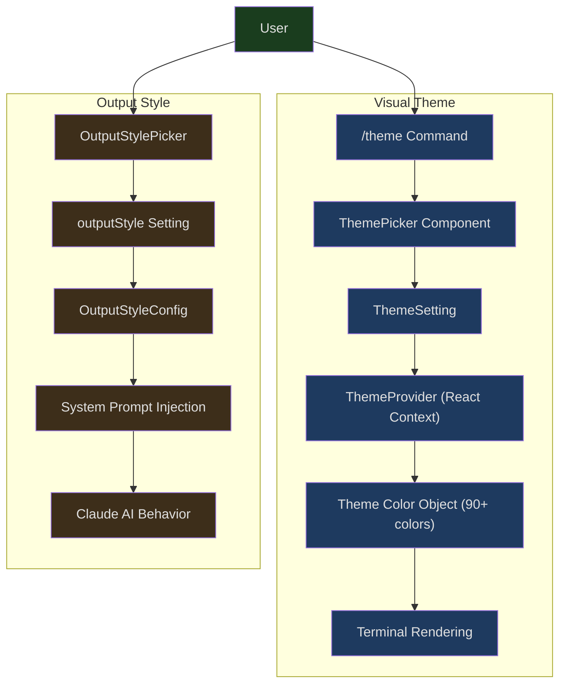
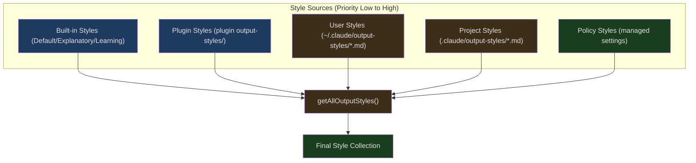
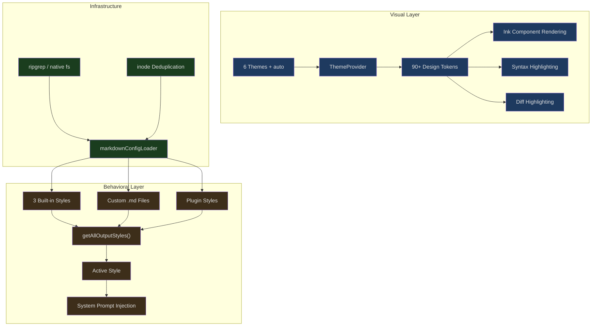

## The Problem

Open Claude Code, and you'll notice the terminal has color — not the operating system's defaults, but a carefully designed color scheme. Claude's responses have orange borders, permission requests are purple, diffs use green/red highlighting, and code blocks get syntax highlighting. Switch to `/theme light`, and all colors seamlessly adapt to a light background. Type `/output-style Learning`, and Claude's response style shifts from concise to teaching mode, explaining the reasoning behind its decisions.

Behind this are two independent but cooperating systems:

1. **Visual Theme** — Controls colors, borders, syntax highlighting, and other visual presentation, toggled via the `/theme` command
2. **Output Style** — Controls the tone and behavioral patterns of Claude AI's responses, selected via the output style picker

This article dives deep into the design and implementation of both systems.

---

## Dual-System Architecture



The key distinction: the visual theme changes **what colors you see**, while the output style changes **what the AI says**. The two are completely orthogonal — you can use a dark theme with the Learning style, or a light theme with the default style.

---

## Visual Theme System

### Theme Type: 90+ Semantic Colors

```typescript
// src/utils/theme.ts:4-89
export type Theme = {
  autoAccept: string
  bashBorder: string
  claude: string
  claudeShimmer: string
  permission: string
  permissionShimmer: string
  text: string
  inverseText: string
  inactive: string
  subtle: string
  success: string
  error: string
  warning: string
  diffAdded: string
  diffRemoved: string
  diffAddedWord: string
  diffRemovedWord: string
  // ... 70+ more color tokens
}
```

This isn't a simple "foreground/background" setup — it's a complete design token system. Each color has clear semantics:

- `claude` — Claude's brand orange, used for AI response borders
- `permission` — Purple, used for permission requests
- `bashBorder` — Pink, used for Bash tool output borders
- `success` / `error` / `warning` — Semantic status colors
- `diffAdded` / `diffRemoved` — Diff highlight colors
- `*Shimmer` — Each primary color has a corresponding "shimmer" variant for loading animations

The shimmer variants are a subtle design detail: when the AI is thinking, the border alternates between the primary color and the shimmer color. Without shimmer variants, the animation would be either too jarring (two very different colors) or invisible (the same color).

### 6 Theme Variants

```typescript
// src/utils/theme.ts:91-98
export const THEME_NAMES = [
  'dark',
  'light',
  'light-daltonized',
  'dark-daltonized',
  'light-ansi',
  'dark-ansi',
] as const
```

Each variant is optimized for a specific scenario:

- **dark / light** — Uses explicit RGB values for consistent appearance across all terminals
- **\*-daltonized** — Color vision deficiency-friendly versions that avoid relying on red/green distinctions
- **\*-ansi** — Uses ANSI color codes instead of RGB, respecting the user's custom terminal color scheme

Why does the `light` theme use RGB instead of ANSI? Because users might configure ANSI "red" as bright pink or dark maroon in their terminal — if we relied on ANSI colors, diff red and green could become indistinguishable. Using explicit RGB values ensures the colors Anthropic's designers carefully calibrated look the same on any terminal.

The ANSI variants exist because some users invest significant effort in crafting a perfect terminal color scheme and want all tools to use their palette rather than being overridden.

### ThemeSetting: The Wisdom of 'auto'

```typescript
// src/utils/theme.ts:103-109
export const THEME_SETTINGS = ['auto', ...THEME_NAMES] as const

// A theme preference as stored in user config. 'auto' follows the system
// dark/light mode and is resolved to a ThemeName at runtime.
export type ThemeSetting = (typeof THEME_SETTINGS)[number]
```

`ThemeSetting` and `ThemeName` are different types. `ThemeSetting` adds an `'auto'` option, which resolves to a concrete `ThemeName` at runtime.

```typescript
// src/components/design-system/ThemeProvider.tsx:81
const currentTheme: ThemeName = activeSetting === 'auto'
  ? systemTheme : activeSetting;
```

Auto mode queries the terminal's background color via the OSC 11 protocol to determine light or dark mode:

```typescript
// src/components/design-system/ThemeProvider.tsx:64-79
useEffect(() => {
  if (feature('AUTO_THEME')) {
    if (activeSetting !== 'auto' || !internal_querier) return;
    let cleanup: (() => void) | undefined;
    let cancelled = false;
    void import('../../utils/systemThemeWatcher.js').then(({
      watchSystemTheme
    }) => {
      if (cancelled) return;
      cleanup = watchSystemTheme(internal_querier, setSystemTheme);
    });
    return () => {
      cancelled = true;
      cleanup?.();
    };
  }
}, [activeSetting, internal_querier]);
```

A few implementation details worth noting:

1. **Feature flag guard** — The `AUTO_THEME` feature flag allows the entire `systemThemeWatcher` module to be dead-code eliminated in external builds
2. **Dynamic import** — `import('../../utils/systemThemeWatcher.js')` avoids loading unnecessary code when not in auto mode
3. **Cancellation semantics** — The `cancelled` flag prevents setting state after the component unmounts
4. **$COLORFGBG fallback** — On initialization, an approximate value is obtained from the `$COLORFGBG` environment variable, then corrected by the subsequent OSC 11 query

---

## ThemePicker: An Interactive Component with Live Preview

```typescript
// src/components/ThemePicker.tsx:19-29
export type ThemePickerProps = {
  onThemeSelect: (setting: ThemeSetting) => void;
  showIntroText?: boolean;
  helpText?: string;
  showHelpTextBelow?: boolean;
  hideEscToCancel?: boolean;
  skipExitHandling?: boolean;
  onCancel?: () => void;
};
```

ThemePicker has a "preview" mechanism — as the user navigates the list, the theme switches in real time so they can see the effect, but it only saves when the user confirms their selection:

```typescript
// src/components/design-system/ThemeProvider.tsx:82-100
const value = useMemo<ThemeContextValue>(() => ({
  themeSetting,
  setThemeSetting: (newSetting: ThemeSetting) => {
    setThemeSetting(newSetting);
    setPreviewTheme(null);
    if (newSetting === 'auto') {
      setSystemTheme(getSystemThemeName());
    }
    onThemeSave?.(newSetting);
  },
  setPreviewTheme: (newSetting: ThemeSetting) => {
    setPreviewTheme(newSetting);
    if (newSetting === 'auto') {
      setSystemTheme(getSystemThemeName());
    }
  },
  // ...
```

The three operations differ as follows:
- `setPreviewTheme(setting)` — Temporarily switches without writing to config
- `savePreview()` — Saves the current preview as the active theme
- `cancelPreview()` — Reverts to the theme prior to previewing

This lets users see the effect of each option in real time while picking a theme, and pressing Escape returns to the original state.

---

## /theme Command: The Simplest Slash Command

```typescript
// src/commands/theme/index.ts:1-10
import type { Command } from '../../commands.js'

const theme = {
  type: 'local-jsx',
  name: 'theme',
  description: 'Change the theme',
  load: () => import('./theme.js'),
} satisfies Command
```

This is a `local-jsx` type command — it returns a React component rather than plain text. `load: () => import('./theme.js')` uses dynamic import for on-demand loading.

The actual execution logic is remarkably concise:

```typescript
// src/commands/theme/theme.tsx:54-56
export const call: LocalJSXCommandCall = async (onDone, _context) => {
  return <ThemePickerCommand onDone={onDone} />;
};
```

The `ThemePickerCommand` component wraps `ThemePicker`, calling `setTheme(setting)` and onDone(Theme set to setting) when the user makes a selection:

```typescript
// src/commands/theme/theme.tsx:13-52
function ThemePickerCommand({ onDone }: Props) {
  const [, setTheme] = useTheme();
  // ... selection handling
  return (
    <Pane color="permission">
      <ThemePicker
        onThemeSelect={setting => {
          setTheme(setting);
          onDone(`Theme set to ${setting}`);
        }}
        onCancel={() => {
          onDone('Theme picker dismissed', { display: 'system' });
        }}
        skipExitHandling={true}
      />
    </Pane>
  );
}
```

Wrapping with `Pane color="permission"` gives the theme picker a purple border — maintaining visual consistency with other permission/settings interfaces.

---

## Output Style System

### Built-in Styles: Default, Explanatory, Learning

```typescript
// src/constants/outputStyles.ts:41-135
export const OUTPUT_STYLE_CONFIG: OutputStyles = {
  [DEFAULT_OUTPUT_STYLE_NAME]: null,  // null means use default behavior
  Explanatory: {
    name: 'Explanatory',
    source: 'built-in',
    description:
      'Claude explains its implementation choices and codebase patterns',
    keepCodingInstructions: true,
    prompt: `You are an interactive CLI tool that helps users with software
engineering tasks. In addition to software engineering tasks, you should
provide educational insights about the codebase along the way.
...
## Insights
In order to encourage learning, before and after writing code, always
provide brief educational explanations...`,
  },
  Learning: {
    name: 'Learning',
    source: 'built-in',
    description:
      'Claude pauses and asks you to write small pieces of code for hands-on practice',
    keepCodingInstructions: true,
    prompt: `...
## Requesting Human Contributions
In order to encourage learning, ask the human to contribute 2-10 line
code pieces when generating 20+ lines involving:
- Design decisions (error handling, data structures)
- Business logic with multiple valid approaches
- Key algorithms or interface definitions
...`,
  },
}
```

The `Default` style has a value of `null` — it doesn't inject any additional prompt, and Claude uses its own default behavior. This design avoids the overhead of "even the default mode has a prompt."

`keepCodingInstructions: true` tells the system to preserve the underlying coding instruction prompt when switching to this style, rather than replacing it entirely. This is important for the Explanatory and Learning styles — they **layer** teaching capabilities on top of the default behavior, rather than replacing coding capabilities.

### Explanatory Style's Insight Format

```typescript
// src/constants/outputStyles.ts:30-37
const EXPLANATORY_FEATURE_PROMPT = `
## Insights
In order to encourage learning, before and after writing code, always
provide brief educational explanations about implementation choices using
(with backticks):
"\`${figures.star} Insight ─────────────────────────────────────\`
[2-3 key educational points]
\`─────────────────────────────────────────────────\`"
`
```

`figures.star` comes from the `figures` library, rendering an appropriate star character across different terminals. The entire Insight block uses backticks to render as monospaced text, ensuring the separator lines align in the terminal.

### Learning Style's Interactive Mode

The most interesting part of the Learning style is that it asks the AI to **pause and let the user practice**:

```
${figures.bullet} **Learn by Doing**
**Context:** [what's built and why this decision matters]
**Your Task:** [specific function/section in file, mention file and TODO(human)]
**Guidance:** [trade-offs and constraints to consider]
```

The prompt also instructs the AI to insert `TODO(human)` markers in code — a way to create links between the codebase and the conversation. The AI should not continue operating after issuing a "Learn by Doing" request, but instead wait for the user to implement it.

---

## Custom Output Styles: Markdown File Loading



Custom styles are defined through Markdown files placed in the `.claude/output-styles/` directory. The loading logic is in `loadOutputStylesDir.ts`:

```typescript
// src/outputStyles/loadOutputStylesDir.ts:26-92
export const getOutputStyleDirStyles = memoize(
  async (cwd: string): Promise<OutputStyleConfig[]> => {
    try {
      const markdownFiles = await loadMarkdownFilesForSubdir(
        'output-styles',
        cwd,
      )

      const styles = markdownFiles
        .map(({ filePath, frontmatter, content, source }) => {
          try {
            const fileName = basename(filePath)
            const styleName = fileName.replace(/\.md$/, '')

            const name = (frontmatter['name'] || styleName) as string
            const description =
              coerceDescriptionToString(
                frontmatter['description'],
                styleName,
              ) ??
              extractDescriptionFromMarkdown(
                content,
                `Custom ${styleName} output style`,
              )

            const keepCodingInstructionsRaw =
              frontmatter['keep-coding-instructions']
            const keepCodingInstructions =
              keepCodingInstructionsRaw === true ||
              keepCodingInstructionsRaw === 'true'
                ? true
                : keepCodingInstructionsRaw === false ||
                    keepCodingInstructionsRaw === 'false'
                  ? false
                  : undefined

            return {
              name,
              description,
              prompt: content.trim(),
              source,
              keepCodingInstructions,
            }
          } catch (error) {
            logError(error)
            return null
          }
        })
        .filter(style => style !== null)

      return styles
    } catch (error) {
      logError(error)
      return []
    }
  },
)
```

### Loading Flow in Detail

1. **Call `loadMarkdownFilesForSubdir('output-styles', cwd)`** — This shared utility function simultaneously searches the user directory (`~/.claude/output-styles/`), project directory (`.claude/output-styles/`), and policy-managed directories for custom output styles

2. **Parse frontmatter** — The Markdown file's YAML header provides the name and description:
   ```markdown
   ---
   name: Concise
   description: Short and sweet responses
   keep-coding-instructions: true
   ---
   Your style prompt content here...
   ```

3. **Filename as fallback** — If the frontmatter lacks a `name` field, the filename is used (with the `.md` suffix removed)

4. **`keep-coding-instructions` handling** — Supports both boolean and string values (`true` / `'true'`), since YAML frontmatter type parsing isn't always consistent

5. **memoize caching** — Uses lodash's `memoize` to avoid redundant filesystem scans

### Style Merge Priority

```typescript
// src/constants/outputStyles.ts:137-175
export const getAllOutputStyles = memoize(async function getAllOutputStyles(
  cwd: string,
): Promise<{ [styleName: string]: OutputStyleConfig | null }> {
  const customStyles = await getOutputStyleDirStyles(cwd)
  const pluginStyles = await loadPluginOutputStyles()

  const allStyles = {
    ...OUTPUT_STYLE_CONFIG,  // Built-in styles as the base
  }

  const managedStyles = customStyles.filter(
    style => style.source === 'policySettings',
  )
  const userStyles = customStyles.filter(
    style => style.source === 'userSettings',
  )
  const projectStyles = customStyles.filter(
    style => style.source === 'projectSettings',
  )

  // Priority from low to high: built-in, plugin, user, project, managed
  const styleGroups = [pluginStyles, userStyles, projectStyles, managedStyles]

  for (const styles of styleGroups) {
    for (const style of styles) {
      allStyles[style.name] = { ... }
    }
  }

  return allStyles
})
```

The priority order is `built-in < plugin < user < project < managed`. This means:

- Projects can define styles with the same name as built-in styles to override them
- Enterprise policies (managed) have the highest priority — even if a project defines a style with the same name, the policy version wins
- Same-name replacement, not merging — later-loaded styles completely replace earlier ones

---

## Markdown Config Loader: Shared Infrastructure

The output style file loading isn't implemented independently; it reuses the shared infrastructure in `markdownConfigLoader.ts`. This loader simultaneously serves multiple subdirectories including commands, agents, output-styles, and skills:

```typescript
// src/utils/markdownConfigLoader.ts:29-36
export const CLAUDE_CONFIG_DIRECTORIES = [
  'commands',
  'agents',
  'output-styles',
  'skills',
  'workflows',
  ...(feature('TEMPLATES') ? (['templates'] as const) : []),
] as const
```

### Directory Traversal Strategy

```typescript
// src/utils/markdownConfigLoader.ts:234-289
export function getProjectDirsUpToHome(
  subdir: ClaudeConfigDirectory,
  cwd: string,
): string[] {
  const home = resolve(homedir()).normalize('NFC')
  const gitRoot = resolveStopBoundary(cwd)
  let current = resolve(cwd)
  const dirs: string[] = []

  while (true) {
    if (
      normalizePathForComparison(current) ===
      normalizePathForComparison(home)
    ) {
      break
    }

    const claudeSubdir = join(current, '.claude', subdir)
    try {
      statSync(claudeSubdir)
      dirs.push(claudeSubdir)
    } catch (e: unknown) {
      if (!isFsInaccessible(e)) throw e
    }

    if (
      gitRoot &&
      normalizePathForComparison(current) ===
        normalizePathForComparison(gitRoot)
    ) {
      break
    }

    const parent = dirname(current)
    if (parent === current) break
    current = parent
  }

  return dirs
}
```

It traverses upward from the current directory until it hits the git root or the home directory. **Stopping at the git root** is a security decision — it prevents `.claude/` configurations in parent directories from accidentally leaking into child projects.

For example, given this directory structure:
```
~/projects/.claude/output-styles/verbose.md
~/projects/my-repo/.claude/output-styles/concise.md
```

When working in `my-repo`, if `my-repo` is a git repository, only `concise.md` will be loaded — `verbose.md` from the `~/projects/` level won't be included.

### File Search: Dual-Engine Strategy

```typescript
// src/utils/markdownConfigLoader.ts:553-568
const useNative = isEnvTruthy(process.env.CLAUDE_CODE_USE_NATIVE_FILE_SEARCH)
const signal = AbortSignal.timeout(3000)
let files: string[]
try {
  files = useNative
    ? await findMarkdownFilesNative(dir, signal)
    : await ripGrep(
        ['--files', '--hidden', '--follow', '--no-ignore',
         '--glob', '*.md'],
        dir,
        signal,
      )
} catch (e: unknown) {
  if (isFsInaccessible(e)) return []
  throw e
}
```

By default it uses ripgrep to find `.md` files (faster), but provides a Node.js native implementation as a fallback. The differences between the two search engines:

- **ripgrep** — Faster, but has higher startup overhead in native builds
- **Node.js native** — Starts quickly with no external process needed, but slower at scanning large directories

The 3-second timeout (`AbortSignal.timeout(3000)`) prevents hanging on enormous `.claude/output-styles/` directories.

### Deduplication: Precise Inode-Level Deduplication

```typescript
// src/utils/markdownConfigLoader.ts:384-407
const fileIdentities = await Promise.all(
  allFiles.map(file => getFileIdentity(file.filePath)),
)

const seenFileIds = new Map<string, SettingSource>()
const deduplicatedFiles: MarkdownFile[] = []

for (const [i, file] of allFiles.entries()) {
  const fileId = fileIdentities[i] ?? null
  if (fileId === null) {
    deduplicatedFiles.push(file)  // fail open
    continue
  }
  const existingSource = seenFileIds.get(fileId)
  if (existingSource !== undefined) {
    logForDebugging(
      `Skipping duplicate file '${file.filePath}' from ${file.source}
       (same inode already loaded from ${existingSource})`,
    )
    continue
  }
  seenFileIds.set(fileId, file.source)
  deduplicatedFiles.push(file)
}
```

Deduplication uses `device:inode` identifiers, which can detect paths pointing to the same physical file via symlinks or hard links. For example, if `~/.claude` is a symlink to a directory inside the project, the same output-style file might be discovered twice — once as user settings and once as project settings. Inode deduplication ensures it's loaded only once.

`getFileIdentity` calls `lstat` with `bigint: true` because some filesystems (like ExFAT) can have inode numbers that exceed JavaScript's Number precision (53 bits).

---

## Plugin Output Styles

```typescript
// src/utils/plugins/loadPluginOutputStyles.ts:15-33
async function loadOutputStylesFromDirectory(
  outputStylesPath: string,
  pluginName: string,
  loadedPaths: Set<string>,
): Promise<OutputStyleConfig[]> {
  const styles: OutputStyleConfig[] = []
  await walkPluginMarkdown(
    outputStylesPath,
    async fullPath => {
      const style = await loadOutputStyleFromFile(
        fullPath,
        pluginName,
        loadedPaths,
      )
      if (style) styles.push(style)
    },
    { logLabel: 'output-styles' },
  )
  return styles
}
```

Plugin output styles have a key distinction — namespacing:

```typescript
// src/utils/plugins/loadPluginOutputStyles.ts:53-55
const baseStyleName = (frontmatter.name as string) || fileName
const name = `${pluginName}:${baseStyleName}`
```

Plugin style names are automatically prefixed with `pluginName:`, e.g., `my-plugin:concise`. This prevents naming collisions between styles from different plugins.

### force-for-plugin Mechanism

```typescript
// src/utils/plugins/loadPluginOutputStyles.ts:64-70
const forceRaw = frontmatter['force-for-plugin']
const forceForPlugin =
  forceRaw === true || forceRaw === 'true'
    ? true
    : forceRaw === false || forceRaw === 'false'
      ? false
      : undefined
```

Plugins can set `force-for-plugin: true` in the frontmatter to automatically apply their output style when the plugin is enabled, without requiring the user to manually select it. If multiple plugins set force, only the first is used and a warning is logged:

```typescript
// src/constants/outputStyles.ts:194-199
if (forcedStyles.length > 1) {
  logForDebugging(
    `Multiple plugins have forced output styles:
     ${forcedStyles.map(s => s.name).join(', ')}.
     Using: ${firstForcedStyle.name}`,
    { level: 'warn' },
  )
}
```

`force-for-plugin` only takes effect for plugin-sourced styles. If a user's own output-style file sets this field, a debug-level warning is emitted.

---

## OutputStylePicker: Style Selection UI

```typescript
// src/components/OutputStylePicker.tsx:28-111
export function OutputStylePicker({
  initialStyle,
  onComplete,
  onCancel,
  isStandaloneCommand,
}: OutputStylePickerProps) {
  const [styleOptions, setStyleOptions] = useState([])
  const [isLoading, setIsLoading] = useState(true)

  useEffect(() => {
    getAllOutputStyles(getCwd())
      .then(allStyles => {
        const options = mapConfigsToOptions(allStyles)
        setStyleOptions(options)
        setIsLoading(false)
      })
      .catch(() => {
        // Fall back to built-in styles on error
        const builtInOptions = mapConfigsToOptions(OUTPUT_STYLE_CONFIG)
        setStyleOptions(builtInOptions)
        setIsLoading(false)
      })
  }, [])
```

It asynchronously loads all styles (including custom and plugin styles), falling back to built-in styles if loading fails. A `Loading output styles...` message is shown during loading.

`mapConfigsToOptions` converts style configurations into the format expected by the Select component:

```typescript
// src/components/OutputStylePicker.tsx:13-21
function mapConfigsToOptions(styles) {
  return Object.entries(styles).map(([style, config]) => ({
    label: config?.name ?? DEFAULT_OUTPUT_STYLE_LABEL,
    value: style,
    description: config?.description ?? DEFAULT_OUTPUT_STYLE_DESCRIPTION
  }));
}
```

The `Default` style's config is `null`, so `??` is needed to provide fallback labels and descriptions.

---

## Cache Clearing: Global Coordination

```typescript
// src/outputStyles/loadOutputStylesDir.ts:94-98
export function clearOutputStyleCaches(): void {
  getOutputStyleDirStyles.cache?.clear?.()
  loadMarkdownFilesForSubdir.cache?.clear?.()
  clearPluginOutputStyleCache()
}
```

```typescript
// src/constants/outputStyles.ts:177-179
export function clearAllOutputStylesCache(): void {
  getAllOutputStyles.cache?.clear?.()
}
```

Multiple layers of memoize caches in the system need coordinated clearing:

1. `getOutputStyleDirStyles` — Directory-level style loading cache
2. `loadMarkdownFilesForSubdir` — Shared Markdown file search cache
3. `loadPluginOutputStyles` — Plugin style cache
4. `getAllOutputStyles` — Final merged result cache

`clearOutputStyleCaches()` clears the first three layers at once, while `clearAllOutputStylesCache()` clears the top layer. These functions need to be called when the user modifies files under `.claude/output-styles/` so that new styles take effect.

`.cache?.clear?.()` uses optional chaining — if the memoize implementation doesn't expose a cache object, it silently skips without throwing an error.

---

## Analytics Integration: Tracking Style Usage

```typescript
// src/utils/promptCategory.ts:36-49
export function getQuerySourceForREPL(): QuerySource {
  const settings = getSettings_DEPRECATED()
  const style = settings?.outputStyle ?? DEFAULT_OUTPUT_STYLE_NAME

  if (style === DEFAULT_OUTPUT_STYLE_NAME) {
    return 'repl_main_thread'
  }

  const isBuiltIn = style in OUTPUT_STYLE_CONFIG
  return isBuiltIn
    ? (`repl_main_thread:outputStyle:${style}` as QuerySource)
    : 'repl_main_thread:outputStyle:custom'
}
```

Analytics events distinguish three cases:

1. **Default style** — `repl_main_thread` (no suffix)
2. **Non-default built-in style** — `repl_main_thread:outputStyle:Explanatory` (includes style name)
3. **Custom style** — `repl_main_thread:outputStyle:custom` (doesn't leak the user's custom style name)

The privacy consideration in the third case is important — custom style names might contain team names, project names, or other sensitive information.

---

## Style Passing During System Initialization

```typescript
// src/utils/messages/systemInit.ts:53-56
export function buildSystemInitMessage(inputs: SystemInitInputs): SDKMessage {
  const settings = getSettings_DEPRECATED()
  const outputStyle = (settings?.outputStyle ??
    DEFAULT_OUTPUT_STYLE_NAME) as string
```

The system initialization message (`system/init`) includes the current output style name, passing it to SDK consumers (such as the VS Code extension). This way remote clients know which style the current session uses and can display it in the UI or provide a switching option.

---

## Design Summary



Claude Code's output style system demonstrates several design patterns worth studying:

**Separation of concerns** — The visual theme and output style are two independent systems controlled through different interfaces. The visual theme is a React Context + CSS-in-JS-style token system; the output style is prompt engineering. Neither depends on the other.

**Layered configuration** — Built-in < plugin < user < project < policy, where each layer can override the one below. In enterprise environments, policies have the final say.

**Security boundaries** — The git root prevents parent directory configuration leakage; inode deduplication prevents duplicates caused by symlinks; analytics don't leak custom style names.

**Progressive enhancement** — The default style has zero overhead (`null` prompt); custom styles load on demand; when ripgrep is unavailable, the system falls back to Node.js native implementation; if theme selection fails, the current theme is preserved.

**Developer experience** — Writing a Markdown file and placing it in `.claude/output-styles/` creates a custom output style. Frontmatter provides metadata, file content is the prompt. No code changes needed, no config files to modify — the filename is the style name.

This "Markdown as configuration" pattern is widely reused throughout Claude Code — commands, agents, skills, and output styles all use the same `markdownConfigLoader` infrastructure. A single shared loader serves multiple subsystems, with each subsystem only needing to define its own frontmatter parsing logic and configuration types.
