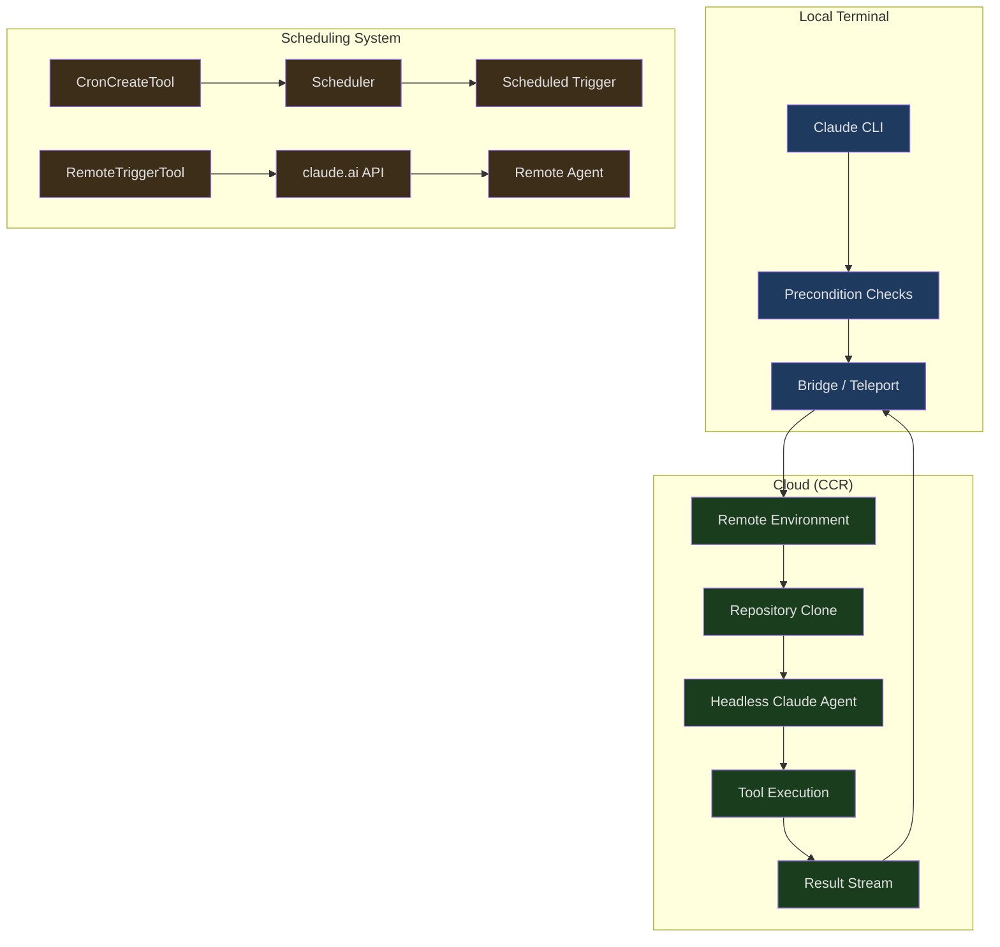
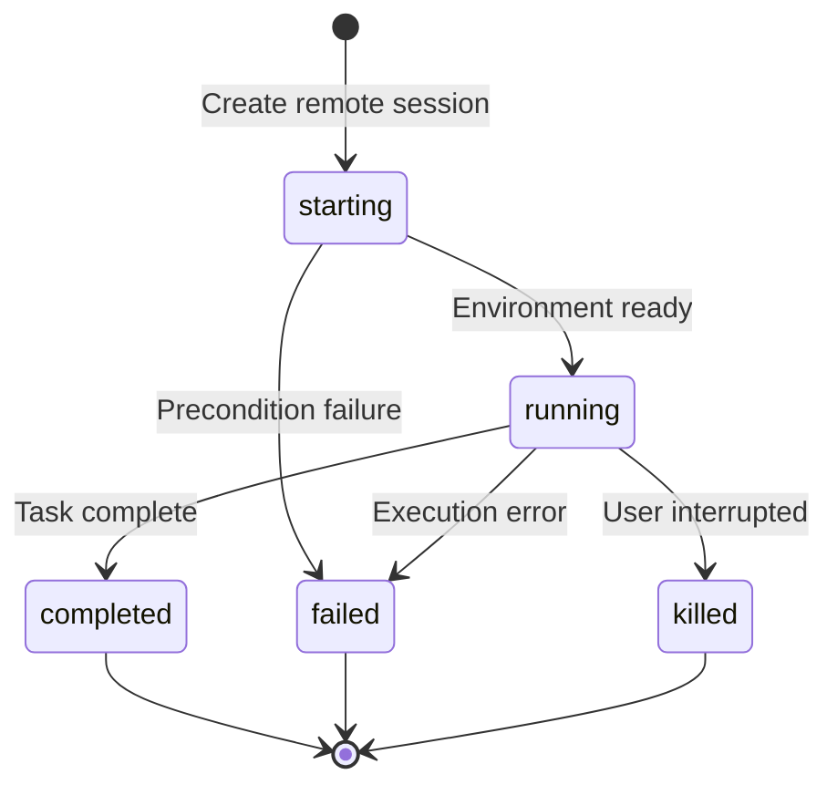
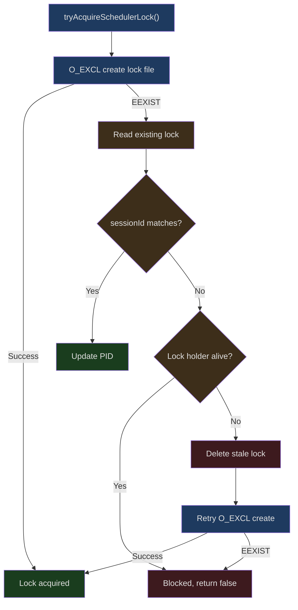
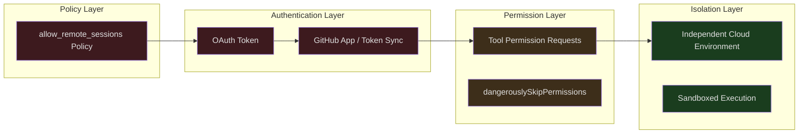

## The Problem

You're on a development machine using Claude Code to fix a bug, and suddenly you need to step out. You don't want to interrupt the current task — can Claude continue working in the cloud? The next morning, you also want Claude to automatically check PR status and report back daily. This isn't science fiction — it's the core capability of Claude Code's remote execution system.

Traditional CLI tools are bound to terminal sessions — close the terminal, and the process dies. Claude Code breaks this limitation by introducing remote capabilities across three dimensions:

1. **Remote Sessions** — Run Claude in a cloud environment, with the local terminal acting only as a proxy
2. **Server Mode (Direct Connect)** — Connect to a remote Claude instance via WebSocket
3. **Scheduled Triggers (Cron + RemoteTrigger)** — Let Claude execute tasks automatically on a schedule

This article provides a deep analysis of the design and implementation across all three dimensions.

---

## Remote Session Architecture Overview



---

## Remote Session Preconditions

Remote sessions aren't unconditionally available. The system performs a series of eligibility checks before creating a remote session to ensure the environment meets requirements. These checks are defined in `src/utils/background/remote/preconditions.ts`:

```typescript
// src/utils/background/remote/preconditions.ts (lines 23-28)
export async function checkNeedsClaudeAiLogin(): Promise<boolean> {
  if (!isClaudeAISubscriber()) {
    return false
  }
  return checkAndRefreshOAuthTokenIfNeeded()
}
```

The precondition checks use a parallel execution strategy, coordinated in `remoteSession.ts`:

```typescript
// src/utils/background/remote/remoteSession.ts (lines 58-62)
const [needsLogin, hasRemoteEnv, repository] = await Promise.all([
  checkNeedsClaudeAiLogin(),
  checkHasRemoteEnvironment(),
  detectCurrentRepositoryWithHost(),
])
```

This code demonstrates an important design pattern — **parallel precondition checks**. Three independent checks fire simultaneously:

1. **Login status** — Whether the OAuth token is valid
2. **Remote environment** — Whether the user has an available cloud environment
3. **Repository detection** — Whether the current directory is within a Git repository, along with remote information

### Bundle Seed Mechanism

An interesting optimization is the Bundle Seed mechanism. When enabled (via the `CCR_FORCE_BUNDLE` or `CCR_ENABLE_BUNDLE` environment variables), the system only needs a local `.git/` directory — no GitHub remote and no GitHub App required:

```typescript
// src/utils/background/remote/remoteSession.ts (lines 75-84)
const bundleSeedGateOn =
  !skipBundle &&
  (isEnvTruthy(process.env.CCR_FORCE_BUNDLE) ||
    isEnvTruthy(process.env.CCR_ENABLE_BUNDLE) ||
    (await checkGate_CACHED_OR_BLOCKING('tengu_ccr_bundle_seed_enabled')))

if (!checkIsInGitRepo()) {
  errors.push({ type: 'not_in_git_repo' })
} else if (bundleSeedGateOn) {
  // has .git/, bundle will work — skip remote+app checks
}
```

This means for local repositories (a `git init` repo without a GitHub remote), Bundle Seed can package and upload local code to the cloud instead of requiring CCR (Claude Code Remote) to pull from GitHub.

### Repository Access Layers

For scenarios that require pulling code from GitHub, the system implements layered access checking:

```typescript
// src/utils/background/remote/preconditions.ts (lines 222-235)
export async function checkRepoForRemoteAccess(
  owner: string,
  repo: string,
): Promise<{ hasAccess: boolean; method: RepoAccessMethod }> {
  if (await checkGithubAppInstalled(owner, repo)) {
    return { hasAccess: true, method: 'github-app' }
  }
  if (
    getFeatureValue_CACHED_MAY_BE_STALE('tengu_cobalt_lantern', false) &&
    (await checkGithubTokenSynced())
  ) {
    return { hasAccess: true, method: 'token-sync' }
  }
  return { hasAccess: false, method: 'none' }
}
```

Three priority levels:
1. **GitHub App** — The preferred method, authorized through a GitHub App installed on the repository
2. **Token Sync** — A GitHub token synced via `/web-setup` (gated by a feature flag)
3. **None** — The user needs to configure an access method

---

## Remote Session Type System

Remote sessions have explicit type definitions and a state machine:

```typescript
// src/utils/background/remote/remoteSession.ts (lines 17-26)
export type BackgroundRemoteSession = {
  id: string
  command: string
  startTime: number
  status: 'starting' | 'running' | 'completed' | 'failed' | 'killed'
  todoList: TodoList
  title: string
  type: 'remote_session'
  log: SDKMessage[]
}
```



Sessions record a complete message log via `SDKMessage[]`, meaning that even if the local connection drops, the full execution history can be restored upon reconnecting.

---

## Direct Connect: Server Mode

Server mode is an alternative remote execution method — rather than creating a new environment via Teleport in the cloud, it connects to a server already running Claude Code. This is particularly useful in enterprise intranet scenarios.

### Session Creation

```typescript
// src/server/createDirectConnectSession.ts (lines 26-39)
export async function createDirectConnectSession({
  serverUrl,
  authToken,
  cwd,
  dangerouslySkipPermissions,
}: {
  serverUrl: string
  authToken?: string
  cwd: string
  dangerouslySkipPermissions?: boolean
}): Promise<{
  config: DirectConnectConfig
  workDir?: string
}> {
```

The creation process sends a POST request to `${serverUrl}/sessions`, and the returned `DirectConnectConfig` contains key information:

```typescript
// src/server/directConnectManager.ts (lines 13-18)
export type DirectConnectConfig = {
  serverUrl: string
  sessionId: string
  wsUrl: string
  authToken?: string
}
```

### WebSocket Bidirectional Communication

`DirectConnectSessionManager` encapsulates the complete WebSocket communication protocol:

```typescript
// src/server/directConnectManager.ts (lines 40-46)
export class DirectConnectSessionManager {
  private ws: WebSocket | null = null
  private config: DirectConnectConfig
  private callbacks: DirectConnectCallbacks

  constructor(config: DirectConnectConfig, callbacks: DirectConnectCallbacks) {
    this.config = config
    this.callbacks = callbacks
  }
```

Message handling splits into three channels:

1. **SDK messages** — Standard messages like assistant/result/system, forwarded to the local UI
2. **Permission requests** — `control_request` type messages requiring local user confirmation
3. **Filtered messages** — Internal messages like keep_alive and streamlined_text, not forwarded

```typescript
// src/server/directConnectManager.ts (lines 102-113)
if (
  parsed.type !== 'control_response' &&
  parsed.type !== 'keep_alive' &&
  parsed.type !== 'control_cancel_request' &&
  parsed.type !== 'streamlined_text' &&
  parsed.type !== 'streamlined_tool_use_summary' &&
  !(parsed.type === 'system' && parsed.subtype === 'post_turn_summary')
) {
  this.callbacks.onMessage(parsed)
}
```

### Permission Requests and Interrupts

Permission handling during remote execution is particularly critical. When the remote Agent needs to perform a dangerous operation, the permission request is sent to the local machine via WebSocket. After the user makes a decision, the result is sent back:

```typescript
// src/server/directConnectManager.ts (lines 144-167)
respondToPermissionRequest(
  requestId: string,
  result: RemotePermissionResponse,
): void {
  if (!this.ws || this.ws.readyState !== WebSocket.OPEN) {
    return
  }
  const response = jsonStringify({
    type: 'control_response',
    response: {
      subtype: 'success',
      request_id: requestId,
      response: {
        behavior: result.behavior,
        ...(result.behavior === 'allow'
          ? { updatedInput: result.updatedInput }
          : { message: result.message }),
      },
    },
  })
  this.ws.send(response)
}
```

The interrupt mechanism also works through WebSocket:

```typescript
// src/server/directConnectManager.ts (lines 172-186)
sendInterrupt(): void {
  if (!this.ws || this.ws.readyState !== WebSocket.OPEN) {
    return
  }
  const request = jsonStringify({
    type: 'control_request',
    request_id: crypto.randomUUID(),
    request: {
      subtype: 'interrupt',
    },
  })
  this.ws.send(request)
}
```

---

## Cron Scheduled Task System

Claude Code includes a complete Cron scheduling system that lets the AI Agent execute tasks automatically on a schedule.

### Task Storage

```typescript
// src/utils/cronTasks.ts (lines 30-70)
export type CronTask = {
  id: string
  /** 5-field cron string (local time) */
  cron: string
  /** Prompt to enqueue when the task fires. */
  prompt: string
  /** Epoch ms when the task was created. */
  createdAt: number
  /** Epoch ms of the most recent fire. */
  lastFiredAt?: number
  /** When true, the task reschedules after firing. */
  recurring?: boolean
  /** When true, exempt from recurringMaxAgeMs auto-expiry. */
  permanent?: boolean
  /** Runtime-only flag. false → session-scoped. */
  durable?: boolean
  /** Runtime-only. Created by an in-process teammate. */
  agentId?: string
}
```

Tasks are stored in two ways:

| Type | Storage Location | Lifecycle | Use Case |
|------|---------|---------|---------|
| **Durable** | `.claude/scheduled_tasks.json` | Persists across sessions | Created by users via CronCreateTool |
| **Session-only** | In-process memory (bootstrap/state) | Dies with the process | Temporary tasks created by sub-agents |

### Scheduler Lock

When multiple Claude sessions run in the same project directory, only one should drive the Cron scheduler. The system uses file locks for coordination:

```typescript
// src/utils/cronTasksLock.ts (lines 111-173)
export async function tryAcquireSchedulerLock(
  opts?: SchedulerLockOptions,
): Promise<boolean> {
  const dir = opts?.dir
  const sessionId = opts?.lockIdentity ?? getSessionId()
  const lock: SchedulerLock = {
    sessionId,
    pid: process.pid,
    acquiredAt: Date.now(),
  }

  if (await tryCreateExclusive(lock, dir)) {
    lastBlockedBy = undefined
    registerLockCleanup(opts)
    return true
  }

  const existing = await readLock(dir)
  // Already ours (idempotent)
  if (existing?.sessionId === sessionId) {
    if (existing.pid !== process.pid) {
      await writeFile(getLockPath(dir), jsonStringify(lock))
      registerLockCleanup(opts)
    }
    return true
  }

  // Another live session — blocked
  if (existing && isProcessRunning(existing.pid)) {
    return false
  }

  // Stale — unlink and retry
  await unlink(getLockPath(dir)).catch(() => {})
  if (await tryCreateExclusive(lock, dir)) {
    return true
  }
  return false
}
```

The lock design has several subtle features:

1. **O_EXCL atomic creation** — Uses the `'wx'` flag to ensure lock file creation is atomic
2. **PID liveness detection** — Uses `isProcessRunning()` to check whether the lock-holding process is still alive
3. **Stale lock recovery** — If the lock-holding process has died, deletes the lock file and retries
4. **Idempotent reacquisition** — If the session ID matches (PID changed after `--resume`), updates the PID



### Jitter to Prevent Thundering Herd

When many users set the same cron expression (e.g., `0 * * * *`, every hour on the hour), all tasks fire simultaneously, causing inference service load spikes. The system uses a Jitter mechanism to spread out trigger times.

**Forward jitter for recurring tasks:**

```typescript
// src/utils/cronTasks.ts (lines 381-398)
export function jitteredNextCronRunMs(
  cron: string,
  fromMs: number,
  taskId: string,
  cfg: CronJitterConfig = DEFAULT_CRON_JITTER_CONFIG,
): number | null {
  const t1 = nextCronRunMs(cron, fromMs)
  if (t1 === null) return null
  const t2 = nextCronRunMs(cron, t1)
  if (t2 === null) return t1
  const jitter = Math.min(
    jitterFrac(taskId) * cfg.recurringFrac * (t2 - t1),
    cfg.recurringCapMs,
  )
  return t1 + jitter
}
```

Jitter is calculated based on a hash of the task ID, ensuring determinism (the same task always gets the same delay) and uniform distribution. With default configuration, recurring tasks with a one-hour interval are spread between `:00` and `:06`.

**Backward jitter for one-shot tasks:**

One-shot tasks (like "remind me at 3 PM") can't be delayed — that would violate user expectations. But firing slightly early is acceptable:

```typescript
// src/utils/cronTasks.ts (lines 421-445)
export function oneShotJitteredNextCronRunMs(
  cron: string,
  fromMs: number,
  taskId: string,
  cfg: CronJitterConfig = DEFAULT_CRON_JITTER_CONFIG,
): number | null {
  const t1 = nextCronRunMs(cron, fromMs)
  if (t1 === null) return null
  if (new Date(t1).getMinutes() % cfg.oneShotMinuteMod !== 0) return t1
  const lead =
    cfg.oneShotFloorMs +
    jitterFrac(taskId) * (cfg.oneShotMaxMs - cfg.oneShotFloorMs)
  return Math.max(t1 - lead, fromMs)
}
```

Jitter is only applied at the top and bottom of the hour (`:00` and `:30`) — because humans tend to choose these "round" times. The default maximum is 90 seconds early.

### Jitter Configuration as Operational Knobs

```typescript
// src/utils/cronTasks.ts (lines 348-355)
export const DEFAULT_CRON_JITTER_CONFIG: CronJitterConfig = {
  recurringFrac: 0.1,
  recurringCapMs: 15 * 60 * 1000,      // 15-minute cap
  oneShotMaxMs: 90 * 1000,              // 90-second max lead
  oneShotFloorMs: 0,
  oneShotMinuteMod: 30,                  // Jitter only at :00 and :30
  recurringMaxAgeMs: 7 * 24 * 60 * 60 * 1000,  // 7-day auto-expiry
}
```

These configurations can be remotely adjusted via GrowthBook's `tengu_kairos_cron_config`. When the inference service experiences capacity issues, operations can push more aggressive configurations — for example, changing `oneShotMinuteMod` to 15 (covering `:00/:15/:30/:45`) and `oneShotMaxMs` to 300000 (5 minutes) to significantly spread the load.

### Recurring Task Auto-Expiry

Recurring tasks have a default 7-day lifetime, preventing forgotten tasks from consuming resources indefinitely:

```typescript
// cronTasks.ts comment
// Recurring tasks auto-expire this many ms after creation (unless marked
// permanent). Cron is the primary driver of multi-day sessions (p99
// uptime 61min → 53h post-#19931), and unbounded recurrence lets Tier-1
// heap leaks compound indefinitely.
```

Only tasks marked as `permanent` (such as the built-in catch-up/morning-checkin/dream tasks in assistant mode) are exempt from expiry.

---

## RemoteTrigger Tool

RemoteTriggerTool is another remote execution path — instead of using the local scheduler, it directly calls the claude.ai API to manage remote triggers:

```typescript
// src/tools/RemoteTriggerTool/prompt.ts (lines 6-15)
export const PROMPT = `Call the claude.ai remote-trigger API.
Use this instead of curl — the OAuth token is added automatically
in-process and never exposed.

Actions:
- list: GET /v1/code/triggers
- get: GET /v1/code/triggers/{trigger_id}
- create: POST /v1/code/triggers (requires body)
- update: POST /v1/code/triggers/{trigger_id} (requires body, partial update)
- run: POST /v1/code/triggers/{trigger_id}/run`
```

The core security principle is that the **OAuth token is never exposed in the shell**. The tool adds the authentication header directly in-process, preventing the token from appearing in command-line arguments or environment variables where it could be captured by other processes or log systems.

---

## SDK Headless Mode

The lowest layer of remote execution is the SDK's headless mode. When launched with `--input-format stream-json`, Claude Code doesn't start a terminal UI — instead, it communicates via JSON streams over stdin/stdout.

The Direct Connect message format must match SDK expectations:

```typescript
// src/server/directConnectManager.ts (lines 131-139)
const message = jsonStringify({
  type: 'user',
  message: {
    role: 'user',
    content: content,
  },
  parent_tool_use_id: null,
  session_id: '',
})
```

This format is fully consistent with `SDKUserMessage`, ensuring unified message handling whether the instance is a local REPL or a remote headless instance.

---

## Security Model

Remote execution introduces additional security considerations:



1. **Policy control** — `isPolicyAllowed('allow_remote_sessions')` intercepts at the outermost layer
2. **OAuth authentication** — Ensures the user's identity is legitimate
3. **Repository access** — Layered checks for GitHub App or Token Sync
4. **Permission proxying** — The remote Agent's tool usage requires local user confirmation via WebSocket
5. **Environment isolation** — Each remote session runs in an independent environment

The `dangerouslySkipPermissions` option is intended only for controlled environments (such as CI/CD). It bypasses permission interactions but does not bypass security policies.

---

## Complete Data Flow

The data flow for a complete remote execution request is as follows:

1. The user initiates a remote task locally
2. The system checks preconditions in parallel (login, environment, repository)
3. A connection is established via Teleport/Direct Connect
4. The remote Agent receives the prompt and begins execution
5. Tool permission requests are sent back to the local machine via WebSocket
6. After user confirmation, the permission response is sent back to the remote
7. Execution results stream back via SDK messages
8. The task completes and status updates to `completed`

For Cron tasks, the trigger flow is slightly different:
1. The scheduler acquires the lock (ensuring single-instance execution)
2. Checks `.claude/scheduled_tasks.json` for due tasks
3. Calculates the actual trigger time with jitter applied
4. Enqueues the prompt into the message queue
5. The main REPL loop (or sub-agent) processes tasks from the queue
6. Recurring tasks update `lastFiredAt` and reschedule

---

## Summary

Claude Code's remote execution system demonstrates how to extend a terminal tool into a distributed AI Agent platform. The core design principles include:

- **Multi-path remote execution** — Teleport (new cloud environment), Direct Connect (connect to existing server), and RemoteTrigger (API-triggered) are three independent paths covering different scenarios
- **Deterministic jitter** — Hash-based deterministic delays tied to task IDs prevent thundering herd effects while maintaining predictability
- **File lock coordination** — O_EXCL atomic creation + PID liveness detection resolves multi-session scheduler contention
- **Layered security** — Policy, authentication, permissions, and isolation form four layers of protection, ensuring remote execution doesn't weaken security guarantees
- **Operational controllability** — Jitter configuration and task expiry policies can be adjusted in real time via remote configuration

These designs weren't built in a vacuum — they solve the engineering challenges that inevitably arise when an AI Agent evolves from a single-machine tool into a distributed system.
