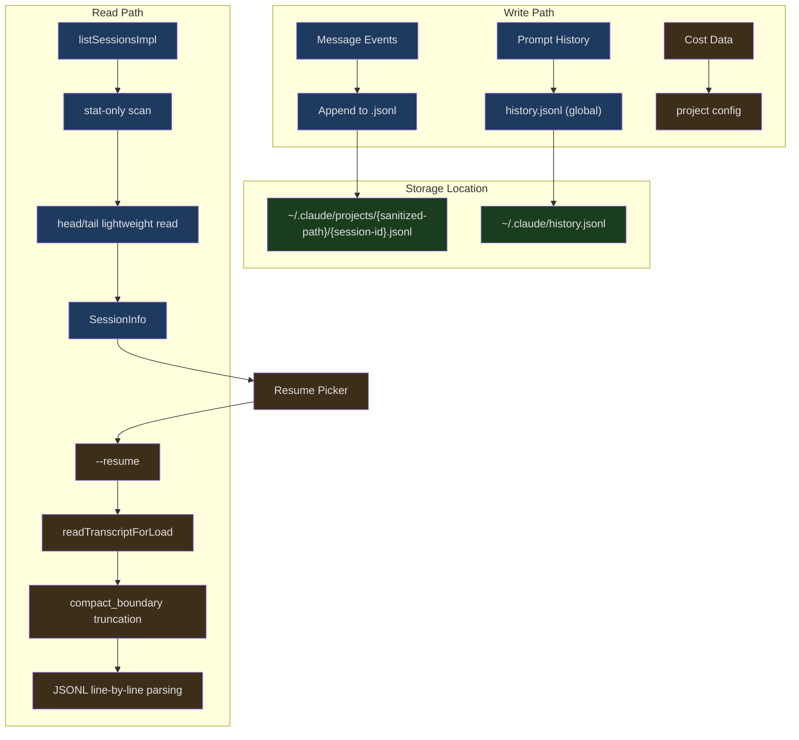
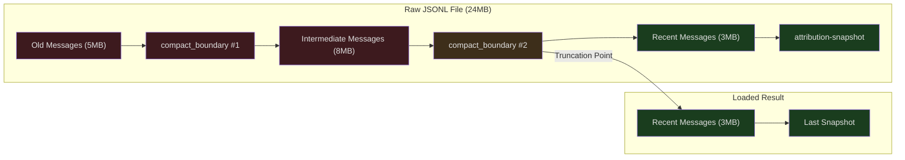

## The Problem

You're in the middle of discussing a complex architectural refactor with Claude when your laptop battery dies. A few minutes later, you plug in the charger and type `claude --resume` — the entire previous conversation is fully restored, including Claude's analysis, file modifications already executed, and unfinished steps. You can even continue the session on a different machine via a session URL.

This isn't magic — it's the work of Claude Code's session persistence system. It needs to solve several core problems:

1. How to reliably write a live conversation to disk without losing data?
2. How to skip compressed history during resumption and load only the necessary context?
3. How to find and resume sessions across different project directories and devices?

This article provides an in-depth analysis of the complete session persistence mechanism.

---

## Session Storage Architecture



---

## Path Sanitization

Session files are stored under `~/.claude/projects/`, with subdirectory names derived from the project path. Path sanitization ensures correct handling on any operating system:

```typescript
// src/utils/sessionStoragePortable.ts (lines 311-319)
export function sanitizePath(name: string): string {
  const sanitized = name.replace(/[^a-zA-Z0-9]/g, '-')
  if (sanitized.length <= MAX_SANITIZED_LENGTH) {
    return sanitized
  }
  const hash =
    typeof Bun !== 'undefined' ? Bun.hash(name).toString(36) : simpleHash(name)
  return `${sanitized.slice(0, MAX_SANITIZED_LENGTH)}-${hash}`
}
```

All non-alphanumeric characters are replaced with hyphens. For deeply nested paths (exceeding 200 characters), the name is truncated and a hash suffix is appended to ensure uniqueness. There's a subtle compatibility issue here — the CLI uses `Bun.hash` when running in the Bun runtime, while the SDK uses `djb2Hash` under Node.js, producing different directory suffixes for very long paths. `findProjectDir` resolves this through a prefix-matching fallback:

```typescript
// src/utils/sessionStoragePortable.ts (lines 354-380)
export async function findProjectDir(
  projectPath: string,
): Promise<string | undefined> {
  const exact = getProjectDir(projectPath)
  try {
    await readdir(exact)
    return exact
  } catch {
    const sanitized = sanitizePath(projectPath)
    if (sanitized.length <= MAX_SANITIZED_LENGTH) {
      return undefined
    }
    const prefix = sanitized.slice(0, MAX_SANITIZED_LENGTH)
    const projectsDir = getProjectsDir()
    try {
      const dirents = await readdir(projectsDir, { withFileTypes: true })
      const match = dirents.find(
        d => d.isDirectory() && d.name.startsWith(prefix + '-'),
      )
      return match ? join(projectsDir, match.name) : undefined
    } catch {
      return undefined
    }
  }
}
```

---

## Session Listing: Two-Phase Scan

When listing sessions, the system must balance performance against completeness. A project directory might contain thousands of session files — reading the full contents of each would be prohibitively expensive.

```typescript
// src/utils/listSessionsImpl.ts (lines 439-454)
export async function listSessionsImpl(
  options?: ListSessionsOptions,
): Promise<SessionInfo[]> {
  const { dir, limit, offset, includeWorktrees } = options ?? {}
  const off = offset ?? 0
  const doStat = (limit !== undefined && limit > 0) || off > 0

  const candidates = dir
    ? await gatherProjectCandidates(dir, includeWorktrees ?? true, doStat)
    : await gatherAllCandidates(doStat)

  if (!doStat) return readAllAndSort(candidates)
  return applySortAndLimit(candidates, limit, off)
}
```

When `limit` or `offset` is specified, a two-phase strategy is used:

1. **stat-only scan** — reads only file metadata (mtime), one syscall per file
2. **on-demand content read** — after sorting, reads only the head/tail of the top N candidates

This means `limit: 20` in a directory with 1000 sessions performs ~1000 stat calls + ~20 content reads, rather than 1000 content reads.

### Lightweight Metadata Extraction

Metadata for each session file is obtained through head/tail reads — no need to parse the entire file:

```typescript
// src/utils/sessionStoragePortable.ts (lines 215-242)
export async function readHeadAndTail(
  filePath: string,
  fileSize: number,
  buf: Buffer,
): Promise<{ head: string; tail: string }> {
  try {
    const fh = await fsOpen(filePath, 'r')
    try {
      const headResult = await fh.read(buf, 0, LITE_READ_BUF_SIZE, 0)
      if (headResult.bytesRead === 0) return { head: '', tail: '' }

      const head = buf.toString('utf8', 0, headResult.bytesRead)

      const tailOffset = Math.max(0, fileSize - LITE_READ_BUF_SIZE)
      let tail = head
      if (tailOffset > 0) {
        const tailResult = await fh.read(buf, 0, LITE_READ_BUF_SIZE, tailOffset)
        tail = buf.toString('utf8', 0, tailResult.bytesRead)
      }

      return { head, tail }
    } finally {
      await fh.close()
    }
  } catch {
    return { head: '', tail: '' }
  }
}
```

`LITE_READ_BUF_SIZE` is 64KB — the file head provides session creation information, while the file tail provides the latest state (title, branch, tags, etc.). Metadata fields are extracted directly from the JSON text using regex, without full JSON parsing:

```typescript
// src/utils/sessionStoragePortable.ts (lines 53-76)
export function extractJsonStringField(
  text: string,
  key: string,
): string | undefined {
  const patterns = [`"${key}":"`, `"${key}": "`]
  for (const pattern of patterns) {
    const idx = text.indexOf(pattern)
    if (idx < 0) continue
    const valueStart = idx + pattern.length
    let i = valueStart
    while (i < text.length) {
      if (text[i] === '\\') { i += 2; continue }
      if (text[i] === '"') {
        return unescapeJsonString(text.slice(valueStart, i))
      }
      i++
    }
  }
  return undefined
}
```

This "pattern matching rather than full parsing" approach also works on truncated JSONL lines (where the file tail cuts off mid-line).

### Session Info Assembly

```typescript
// src/utils/listSessionsImpl.ts (lines 79-149)
export function parseSessionInfoFromLite(
  sessionId: string,
  lite: LiteSessionFile,
  projectPath?: string,
): SessionInfo | null {
  const { head, tail, mtime, size } = lite

  // Filter out sidechain sessions (internal sessions of sub-agents)
  const firstLine = firstNewline >= 0 ? head.slice(0, firstNewline) : head
  if (firstLine.includes('"isSidechain":true')) {
    return null
  }

  // Title priority: customTitle > aiTitle > lastPrompt > firstPrompt
  const customTitle =
    extractLastJsonStringField(tail, 'customTitle') ||
    extractLastJsonStringField(head, 'customTitle') ||
    extractLastJsonStringField(tail, 'aiTitle') ||
    extractLastJsonStringField(head, 'aiTitle') ||
    undefined

  const summary =
    customTitle ||
    extractLastJsonStringField(tail, 'lastPrompt') ||
    extractLastJsonStringField(tail, 'summary') ||
    firstPrompt

  // No title or summary — skip metadata-only sessions
  if (!summary) return null
  // ...
}
```

---

## Session Resumption: Compact Boundary Truncation

For long-running sessions (5MB+), loading all messages in full is both inefficient and unnecessary — auto-compact has already compressed old messages into summaries. `readTranscriptForLoad` finds the last `compact_boundary` marker at the file level and loads only the messages that follow it:

```typescript
// src/utils/sessionStoragePortable.ts (lines 717-793)
export async function readTranscriptForLoad(
  filePath: string,
  fileSize: number,
): Promise<{
  boundaryStartOffset: number
  postBoundaryBuf: Buffer
  hasPreservedSegment: boolean
}> {
  // ...
  const chunk = Buffer.allocUnsafe(CHUNK_SIZE)
  const fd = await fsOpen(filePath, 'r')
  try {
    let filePos = 0
    while (filePos < fileSize) {
      const { bytesRead } = await fd.read(
        chunk, 0,
        Math.min(CHUNK_SIZE, fileSize - filePos),
        filePos,
      )
      if (bytesRead === 0) break
      filePos += bytesRead
      // processStraddle + scanChunkLines handle lines spanning chunk boundaries
    }
    finalizeOutput(s)
  } finally {
    await fd.close()
  }
}
```

The design of this function is highly refined:

1. **1MB chunked reads** — avoids loading large files entirely into memory
2. **attribution-snapshot filtering** — skipped at the fd level, retaining only the last snapshot
3. **compact_boundary truncation** — upon encountering a new boundary, all prior output is discarded
4. **preservedSegment detection** — preserved segments are message fragments marked as important during compaction



### Cross-Chunk Line Handling

A single line in a JSONL file may span a 1MB chunk boundary. `processStraddle` handles this case:

```typescript
// Simplified representation — processStraddle logic
// The incomplete line from the previous chunk is saved in carryBuf
// The first \n in the current chunk completes the line
// Then determines whether the line is an attr-snap (skip) or boundary (truncate)
```

This streaming approach ensures peak memory usage equals the output size rather than the file size — for a 24MB session file where only 3MB of data follows the last boundary, memory usage is only ~3MB.

---

## Prompt History

Unlike session messages (which record the complete conversation), prompt history only records user inputs — used for Up-arrow and Ctrl+R search.

```typescript
// src/history.ts (lines 281-284)
let pendingEntries: LogEntry[] = []
let isWriting = false
let currentFlushPromise: Promise<void> | null = null
let cleanupRegistered = false
```

History writes are asynchronous and batched — new entries first enter the `pendingEntries` buffer, then are periodically flushed to `~/.claude/history.jsonl` in the background.

### Concurrency Safety

Multiple Claude sessions may write to the same history file simultaneously. The system uses file locking to ensure safety:

```typescript
// src/history.ts (lines 297-327)
async function immediateFlushHistory(): Promise<void> {
  if (pendingEntries.length === 0) return

  let release
  try {
    const historyPath = join(getClaudeConfigHomeDir(), 'history.jsonl')
    await writeFile(historyPath, '', { encoding: 'utf8', mode: 0o600, flag: 'a' })

    release = await lock(historyPath, {
      stale: 10000,
      retries: { retries: 3, minTimeout: 50 },
    })

    const jsonLines = pendingEntries.map(entry => jsonStringify(entry) + '\n')
    pendingEntries = []

    await appendFile(historyPath, jsonLines.join(''), { mode: 0o600 })
  } catch (error) {
    logForDebugging(`Failed to write prompt history: ${error}`)
  } finally {
    if (release) { await release() }
  }
}
```

Note the file permissions `0o600` — only the owner can read and write, protecting the privacy of user inputs.

### History Deduplication and Ordering

```typescript
// src/history.ts (lines 190-217)
export async function* getHistory(): AsyncGenerator<HistoryEntry> {
  const currentProject = getProjectRoot()
  const currentSession = getSessionId()
  const otherSessionEntries: LogEntry[] = []
  let yielded = 0

  for await (const entry of makeLogEntryReader()) {
    if (!entry || typeof entry.project !== 'string') continue
    if (entry.project !== currentProject) continue

    if (entry.sessionId === currentSession) {
      yield await logEntryToHistoryEntry(entry)
      yielded++
    } else {
      otherSessionEntries.push(entry)
    }

    if (yielded + otherSessionEntries.length >= MAX_HISTORY_ITEMS) break
  }

  for (const entry of otherSessionEntries) {
    if (yielded >= MAX_HISTORY_ITEMS) return
    yield await logEntryToHistoryEntry(entry)
    yielded++
  }
}
```

History entries from the current session take priority over those from other sessions — this prevents concurrent sessions from interleaving their history records. Up-arrow always shows the current session's inputs first.

### History Undo

When a user presses Esc to cancel input before the AI responds, that input should be removed from history:

```typescript
// src/history.ts (lines 453-464)
export function removeLastFromHistory(): void {
  if (!lastAddedEntry) return
  const entry = lastAddedEntry
  lastAddedEntry = null

  const idx = pendingEntries.lastIndexOf(entry)
  if (idx !== -1) {
    pendingEntries.splice(idx, 1)
  } else {
    skippedTimestamps.add(entry.timestamp)
  }
}
```

The fast path removes the entry directly from the pending buffer. If the async flush has already written the entry to disk (TTFT is typically >> disk write latency, but race conditions occasionally occur), the timestamp is added to a skip-set and filtered out on the next read.

### Pasted Content Handling

Large blocks of pasted text are not suitable for storing directly in the history file. The system uses size-based tiering:

```typescript
// src/history.ts (lines 365-395)
for (const [id, content] of Object.entries(entry.pastedContents)) {
  if (content.type === 'image') continue  // Images stored separately

  if (content.content.length <= MAX_PASTED_CONTENT_LENGTH) {
    // Small text (<=1024 characters) stored inline
    storedPastedContents[Number(id)] = {
      id: content.id, type: content.type,
      content: content.content,
    }
  } else {
    // Large text stored as hash reference, content written to paste store
    const hash = hashPastedText(content.content)
    storedPastedContents[Number(id)] = {
      id: content.id, type: content.type,
      contentHash: hash,
    }
    void storePastedText(hash, content.content)
  }
}
```

---

## Cross-Project Resumption

A user might start Claude in one directory and then want to resume a session from a different project. `crossProjectResume.ts` handles this scenario:

```typescript
// src/utils/crossProjectResume.ts (lines 30-75)
export function checkCrossProjectResume(
  log: LogOption,
  showAllProjects: boolean,
  worktreePaths: string[],
): CrossProjectResumeResult {
  const currentCwd = getOriginalCwd()

  if (!showAllProjects || !log.projectPath || log.projectPath === currentCwd) {
    return { isCrossProject: false }
  }

  // Check if it's a different worktree of the same Git repository
  const isSameRepo = worktreePaths.some(
    wt => log.projectPath === wt || log.projectPath!.startsWith(wt + sep),
  )

  if (isSameRepo) {
    return {
      isCrossProject: true,
      isSameRepoWorktree: true,
      projectPath: log.projectPath,
    }
  }

  // Different repository — generate a cd command
  const sessionId = getSessionIdFromLog(log)
  const command = `cd ${quote([log.projectPath])} && claude --resume ${sessionId}`
  return {
    isCrossProject: true,
    isSameRepoWorktree: false,
    command,
    projectPath: log.projectPath,
  }
}
```

For different worktrees of the same Git repository, resumption can happen directly (same codebase). For entirely different projects, the system generates a `cd + claude --resume` command for the user to execute.

---

## Session URL Parsing

The `--resume` argument supports three formats:

```typescript
// src/utils/sessionUrl.ts (lines 20-64)
export function parseSessionIdentifier(
  resumeIdentifier: string,
): ParsedSessionUrl | null {
  // 1. JSONL file path
  if (resumeIdentifier.toLowerCase().endsWith('.jsonl')) {
    return {
      sessionId: randomUUID() as UUID,
      ingressUrl: null,
      isUrl: false,
      jsonlFile: resumeIdentifier,
      isJsonlFile: true,
    }
  }

  // 2. UUID session ID
  if (validateUuid(resumeIdentifier)) {
    return {
      sessionId: resumeIdentifier as UUID,
      ingressUrl: null,
      isUrl: false,
      jsonlFile: null,
      isJsonlFile: false,
    }
  }

  // 3. Ingress URL (remote resumption)
  try {
    const url = new URL(resumeIdentifier)
    return {
      sessionId: randomUUID() as UUID,
      ingressUrl: url.href,
      isUrl: true,
      jsonlFile: null,
      isJsonlFile: false,
    }
  } catch {
    // Not a valid URL
  }

  return null
}
```

The three formats cover different use cases:
- **UUID** — most common, looked up from the local `~/.claude/projects/` directory
- **JSONL file** — direct file path, used for debugging or importing
- **URL** — connects to a remote session ingress, used for cross-device resumption

---

## Session File Resolution

When resuming a session, the system needs to find the corresponding JSONL file under `~/.claude/projects/`. The search logic accounts for worktree scenarios:

```typescript
// src/utils/sessionStoragePortable.ts (lines 403-466)
export async function resolveSessionFilePath(
  sessionId: string,
  dir?: string,
): Promise<...> {
  const fileName = `${sessionId}.jsonl`

  if (dir) {
    // First look in the current project directory
    const canonical = await canonicalizePath(dir)
    const projectDir = await findProjectDir(canonical)
    if (projectDir) {
      const filePath = join(projectDir, fileName)
      // stat check + zero-byte filtering
    }

    // Worktree fallback — the session may exist in a different worktree root
    let worktreePaths = await getWorktreePathsPortable(canonical)
    for (const wt of worktreePaths) {
      if (wt === canonical) continue
      // Search each worktree
    }
    return undefined
  }

  // No dir — scan all project directories
  const projectsDir = getProjectsDir()
  let dirents = await readdir(projectsDir)
  for (const name of dirents) {
    // Search each directory
  }
  return undefined
}
```

Zero-byte files are treated as not found — this handles cases where a file was truncated but not deleted, allowing the search to continue to a valid copy in a sibling directory.

---

## Cost State Restoration

Resuming a session restores not only the conversation content but also the cost tracking state:

```typescript
// src/cost-tracker.ts (lines 130-137)
export function restoreCostStateForSession(sessionId: string): boolean {
  const data = getStoredSessionCosts(sessionId)
  if (!data) {
    return false
  }
  setCostStateForRestore(data)
  return true
}
```

Cost data is saved in the project configuration, associated by session ID. During restoration, the session ID is checked for a match — preventing cost data from different sessions from getting mixed up. The restored data includes:

- Total API cost (USD)
- API duration (with and without retries)
- Tool execution duration
- Lines of code changed statistics
- Per-model usage

---

## Summary

Claude Code's session management system addresses the core challenges of AI Agent persistence:

- **Incremental writes** — the JSONL format supports append-only writes; a process crash only loses the last line
- **Two-phase listing** — stat-only pre-filtering + on-demand content reads keeps things fast even with thousands of sessions
- **Compact Boundary truncation** — on resume, only messages after the last compaction are loaded; a 24MB file becomes 3MB in memory
- **Cross-environment compatibility** — Bun/Node hash differences are resolved through prefix fallback
- **Concurrency safety** — file locking protects history writes; session-first ordering prevents session interleaving
- **Complete state restoration** — conversation, cost, and permission context are all restored together

The core design philosophy of this system is "dealing with reality" — files get truncated, processes crash, multiple sessions run concurrently, and users switch between different directories and devices. Every edge case has a corresponding safeguard.
