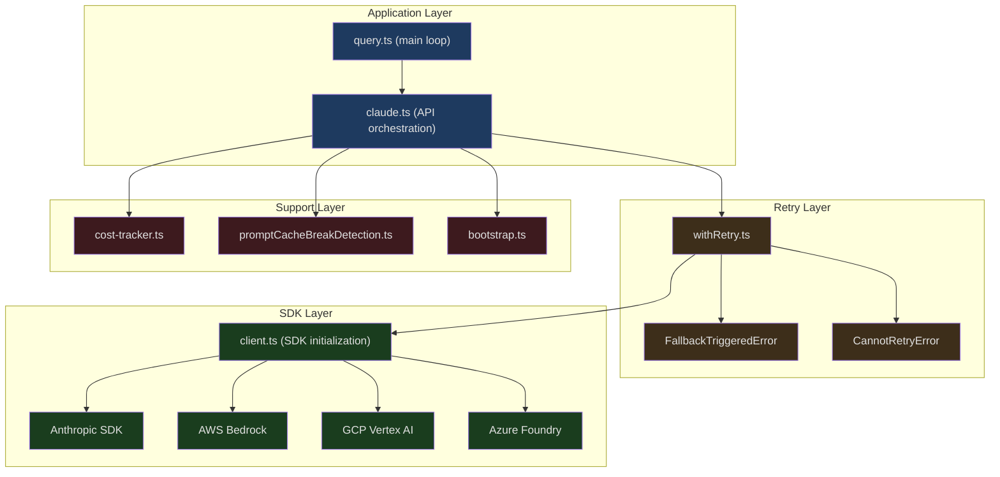
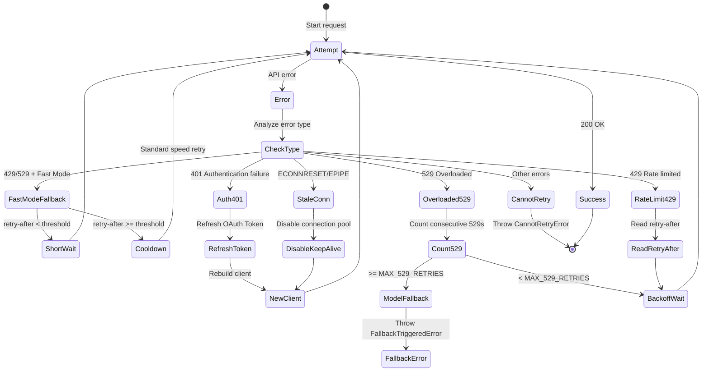

## The Problem

The moment you type a question in Claude Code and press Enter, a precisely orchestrated chain of operations begins: the system builds the message array, selects the appropriate model, adds Beta headers, receives the response via SSE streaming, parses token usage in real time, calculates costs, handles potential 429/529 errors, and falls back to an alternative model if necessary. All of this completes within 1-2 seconds — the user simply sees text start flowing.

Claude Code's API client is not a simple HTTP wrapper — it's a complex system encompassing retry logic, fallback, caching, cost tracking, and multi-provider adaptation. This article provides an in-depth analysis of every layer of this system.

---

## API Client Layer Architecture



---

## Multi-Provider Client

Claude Code supports four API providers, each with different authentication and configuration methods:

```typescript
// src/services/api/client.ts (lines 36-71, comment excerpts)
// Direct API:
//   ANTHROPIC_API_KEY: Required for direct API access
//
// AWS Bedrock:
//   AWS credentials configured via aws-sdk defaults
//   AWS_REGION or AWS_DEFAULT_REGION
//   ANTHROPIC_SMALL_FAST_MODEL_AWS_REGION: Optional override for Haiku
//
// Foundry (Azure):
//   ANTHROPIC_FOUNDRY_RESOURCE: Azure resource name
//   ANTHROPIC_FOUNDRY_BASE_URL: Alternative full base URL
//
// Vertex AI:
//   Model-specific region variables (VERTEX_REGION_CLAUDE_*)
//   CLOUD_ML_REGION: Default GCP region
//   ANTHROPIC_VERTEX_PROJECT_ID: Required GCP project ID
```

Client initialization accounts for debugging needs — when stderr is in debug mode, SDK logs are redirected to stderr:

```typescript
// src/services/api/client.ts (lines 73-86)
function createStderrLogger(): ClientOptions['logger'] {
  return {
    error: (msg, ...args) =>
      console.error('[Anthropic SDK ERROR]', msg, ...args),
    warn: (msg, ...args) =>
      console.error('[Anthropic SDK WARN]', msg, ...args),
    info: (msg, ...args) =>
      console.error('[Anthropic SDK INFO]', msg, ...args),
    debug: (msg, ...args) =>
      console.error('[Anthropic SDK DEBUG]', msg, ...args),
  }
}
```

---

## Beta Headers Management

Claude Code uses numerous Beta API features, declared via the `anthropic-beta` header:

```typescript
// src/services/api/claude.ts (lines 134-143)
import {
  AFK_MODE_BETA_HEADER,
  CONTEXT_1M_BETA_HEADER,
  CONTEXT_MANAGEMENT_BETA_HEADER,
  EFFORT_BETA_HEADER,
  FAST_MODE_BETA_HEADER,
  PROMPT_CACHING_SCOPE_BETA_HEADER,
  REDACT_THINKING_BETA_HEADER,
  STRUCTURED_OUTPUTS_BETA_HEADER,
  TASK_BUDGETS_BETA_HEADER,
} from 'src/constants/betas.js'
```

These Beta features include:

| Beta Header | Feature |
|-------------|---------|
| `CONTEXT_1M_BETA_HEADER` | 1M token context window |
| `CONTEXT_MANAGEMENT_BETA_HEADER` | Server-side context management |
| `FAST_MODE_BETA_HEADER` | Fast mode (reduced latency) |
| `EFFORT_BETA_HEADER` | Effort control (adjusts reasoning depth) |
| `PROMPT_CACHING_SCOPE_BETA_HEADER` | Prompt caching scope |
| `REDACT_THINKING_BETA_HEADER` | Thinking content redaction |
| `STRUCTURED_OUTPUTS_BETA_HEADER` | Structured outputs |
| `TASK_BUDGETS_BETA_HEADER` | Task budget control |
| `AFK_MODE_BETA_HEADER` | Away mode (background execution optimization) |

### Extra Body Parameters

Users can inject additional API parameters via the `CLAUDE_CODE_EXTRA_BODY` environment variable:

```typescript
// src/services/api/claude.ts (lines 272-331)
export function getExtraBodyParams(betaHeaders?: string[]): JsonObject {
  const extraBodyStr = process.env.CLAUDE_CODE_EXTRA_BODY
  let result: JsonObject = {}

  if (extraBodyStr) {
    try {
      const parsed = safeParseJSON(extraBodyStr)
      if (parsed && typeof parsed === 'object' && !Array.isArray(parsed)) {
        // Shallow clone — safeParseJSON is LRU-cached and returns the
        // same object reference. Mutating result would poison the cache.
        result = { ...(parsed as JsonObject) }
      }
    } catch (error) {
      logForDebugging(`Error parsing CLAUDE_CODE_EXTRA_BODY: ${errorMessage(error)}`)
    }
  }

  // Anti-distillation: send fake_tools opt-in for 1P CLI only
  if (feature('ANTI_DISTILLATION_CC') ? /* gate check */ : false) {
    result.anti_distillation = ['fake_tools']
  }

  return result
}
```

Note the shallow clone — `safeParseJSON` uses an LRU cache, so directly mutating the return value would poison the cache, causing subsequent calls to see the modified value.

---

## Prompt Cache Control

Prompt caching can be controlled at per-model granularity:

```typescript
// src/services/api/claude.ts (line 333 onwards)
export function getPromptCachingEnabled(model: string): boolean {
  if (isEnvTruthy(process.env.DISABLE_PROMPT_CACHING)) return false
  if (isEnvTruthy(process.env.DISABLE_PROMPT_CACHING_HAIKU)) {
    if (model === getSmallFastModel()) return false
  }
  if (isEnvTruthy(process.env.DISABLE_PROMPT_CACHING_SONNET)) {
    if (model === getDefaultSonnetModel()) return false
  }
  // ...
}
```

This per-model disabling design stems from practical needs — the cache creation cost for some models may not be worthwhile (for instance, Haiku is already inexpensive, and the cache creation fee can actually exceed the savings).

---

## Retry System

The retry logic is the most complex part of the API client, defined in `withRetry.ts`.

### Retry Configuration

```typescript
// src/services/api/withRetry.ts (lines 53-56)
const DEFAULT_MAX_RETRIES = 10
const FLOOR_OUTPUT_TOKENS = 3000
const MAX_529_RETRIES = 3
export const BASE_DELAY_MS = 500
```

### Foreground vs. Background Query Sources

Not all queries should be retried. Background queries (summaries, title generation, classifiers) immediately give up on 529 errors — they are not what the user is waiting for, and retrying would only amplify capacity cascades:

```typescript
// src/services/api/withRetry.ts (lines 62-82)
const FOREGROUND_529_RETRY_SOURCES = new Set<QuerySource>([
  'repl_main_thread',
  'repl_main_thread:outputStyle:custom',
  'repl_main_thread:outputStyle:Explanatory',
  'repl_main_thread:outputStyle:Learning',
  'sdk',
  'agent:custom',
  'agent:default',
  'agent:builtin',
  'compact',
  'hook_agent',
  'hook_prompt',
  'verification_agent',
  'side_question',
  'auto_mode',
])
```

### Retry State Machine



### Fast Mode Fallback

Fast Mode is a low-latency mode. When rate-limited, the system must decide whether to wait (preserving cache hits) or fall back (switching to standard speed):

```typescript
// src/services/api/withRetry.ts (lines 267-305)
if (wasFastModeActive && !isPersistentRetryEnabled() &&
    error instanceof APIError &&
    (error.status === 429 || is529Error(error))) {
  // Overage limit — permanently disable fast mode
  const overageReason = error.headers?.get(
    'anthropic-ratelimit-unified-overage-disabled-reason',
  )
  if (overageReason !== null && overageReason !== undefined) {
    handleFastModeOverageRejection(overageReason)
    retryContext.fastMode = false
    continue
  }

  const retryAfterMs = getRetryAfterMs(error)
  if (retryAfterMs !== null && retryAfterMs < SHORT_RETRY_THRESHOLD_MS) {
    // Short wait — keep fast mode to protect prompt cache
    await sleep(retryAfterMs, options.signal, { abortError })
    continue
  }

  // Long wait or unknown — enter cooldown period (switch to standard speed)
  const cooldownMs = Math.max(
    retryAfterMs ?? DEFAULT_FAST_MODE_FALLBACK_HOLD_MS,
    MIN_COOLDOWN_MS,
  )
  triggerFastModeCooldown(Date.now() + cooldownMs, cooldownReason)
  retryContext.fastMode = false
  continue
}
```

The decision logic:
- **retry-after < threshold** -- short wait, keep fast mode (protects prompt cache from invalidation)
- **retry-after >= threshold or unknown** -- enter cooldown period, switch to standard speed
- **Overage limit** -- permanently disable fast mode

### Authentication Error Recovery

```typescript
// src/services/api/withRetry.ts (lines 218-251)
const isStaleConnection = isStaleConnectionError(lastError)
if (isStaleConnection && getFeatureValue_CACHED_MAY_BE_STALE(...)) {
  disableKeepAlive()  // Disable connection pool, rebuild connection
}

if (
  client === null ||
  (lastError instanceof APIError && lastError.status === 401) ||
  isOAuthTokenRevokedError(lastError) ||
  isBedrockAuthError(lastError) ||
  isVertexAuthError(lastError) ||
  isStaleConnection
) {
  if ((lastError instanceof APIError && lastError.status === 401) ||
      isOAuthTokenRevokedError(lastError)) {
    const failedAccessToken = getClaudeAIOAuthTokens()?.accessToken
    if (failedAccessToken) {
      await handleOAuth401Error(failedAccessToken)
    }
  }
  client = await getClient()  // Rebuild client
}
```

Authentication recovery covers special cases for all providers:
- **Anthropic 1P** — refresh OAuth token on 401
- **AWS Bedrock** — 403 or CredentialsProviderError
- **GCP Vertex** — credential refresh failure
- **Connection reset** — disable keep-alive and reconnect on ECONNRESET/EPIPE

### Consecutive 529 Errors and Model Fallback

```typescript
// src/services/api/withRetry.ts (lines 327-348)
if (is529Error(error) &&
    (process.env.FALLBACK_FOR_ALL_PRIMARY_MODELS ||
     (!isClaudeAISubscriber() && isNonCustomOpusModel(options.model)))) {
  consecutive529Errors++
  if (consecutive529Errors >= MAX_529_RETRIES) {
    if (options.fallbackModel) {
      throw new FallbackTriggeredError(
        options.model,
        options.fallbackModel,
      )
    }
  }
}
```

After 3 consecutive 529 errors, a model fallback is triggered (e.g., Opus to Sonnet). `FallbackTriggeredError` is caught and handled by `query.ts` — existing assistant messages are cleared, the model is switched, and the entire request is retried.

### Persistent Retry (Unattended Mode)

For automation scenarios (CI/CD, cron jobs), the system supports unlimited retries:

```typescript
// src/services/api/withRetry.ts (lines 96-104)
const PERSISTENT_MAX_BACKOFF_MS = 5 * 60 * 1000    // 5 minute max backoff
const PERSISTENT_RESET_CAP_MS = 6 * 60 * 60 * 1000 // 6 hour timeout
const HEARTBEAT_INTERVAL_MS = 30_000                 // 30 second heartbeat

function isPersistentRetryEnabled(): boolean {
  return feature('UNATTENDED_RETRY')
    ? isEnvTruthy(process.env.CLAUDE_CODE_UNATTENDED_RETRY)
    : false
}
```

Persistent retry sends heartbeats via `SystemAPIErrorMessage`, preventing the host environment (such as a container orchestration system) from marking the session as idle.

---

## Cost Tracking

Every API response updates the cost state:

```typescript
// src/cost-tracker.ts (lines 71-79)
type StoredCostState = {
  totalCostUSD: number
  totalAPIDuration: number
  totalAPIDurationWithoutRetries: number
  totalToolDuration: number
  totalLinesAdded: number
  totalLinesRemoved: number
  lastDuration: number | undefined
  modelUsage: { [modelName: string]: ModelUsage } | undefined
}
```

Cost calculation uses the `calculateUSDCost` function based on per-model pricing tables:

```typescript
// src/services/api/claude.ts (line 146)
import { addToTotalSessionCost } from 'src/cost-tracker.js'
```

The cost state is not just for display — it is saved to the project configuration during session switches and read back on resume:

```typescript
// src/cost-tracker.ts (lines 143-158)
export function saveCurrentSessionCosts(fpsMetrics?: FpsMetrics): void {
  saveCurrentProjectConfig(current => ({
    ...current,
    lastCost: getTotalCostUSD(),
    lastAPIDuration: getTotalAPIDuration(),
    lastAPIDurationWithoutRetries: getTotalAPIDurationWithoutRetries(),
    lastToolDuration: getTotalToolDuration(),
    lastDuration: getTotalDuration(),
    // ...
  }))
}
```

---

## Bootstrap API

At startup, the system fetches server-side configuration via the Bootstrap API:

```typescript
// src/services/api/bootstrap.ts (lines 42-100)
async function fetchBootstrapAPI(): Promise<BootstrapResponse | null> {
  if (isEssentialTrafficOnly()) return null  // Skip in privacy mode
  if (getAPIProvider() !== 'firstParty') return null  // Skip for third-party providers

  // OAuth preferred, API Key fallback
  const hasUsableOAuth =
    getClaudeAIOAuthTokens()?.accessToken && hasProfileScope()
  if (!hasUsableOAuth && !apiKey) return null

  const endpoint = `${getOauthConfig().BASE_API_URL}/api/claude_cli/bootstrap`

  return await withOAuth401Retry(async () => {
    const token = getClaudeAIOAuthTokens()?.accessToken
    // Re-read OAuth token each time (retry may have refreshed it)
    let authHeaders: Record<string, string>
    if (token && hasProfileScope()) {
      authHeaders = { Authorization: `Bearer ${token}`, ... }
    } else if (apiKey) {
      authHeaders = { 'x-api-key': apiKey }
    } else {
      return null
    }

    const response = await axios.get(endpoint, {
      headers: { ...authHeaders },
      timeout: 5000,
    })
    return bootstrapResponseSchema().safeParse(response.data)
  })
}
```

The data returned by Bootstrap includes:
- `client_data` — client configuration
- `additional_model_options` — list of additional available models

The 5-second timeout ensures startup doesn't hang due to network issues.

---

## Streaming Response Handling

The main loop in query.ts consumes streaming responses via `for await...of`. Key processing logic includes:

### Fallback Handling

When model fallback is triggered during streaming, partially received messages need to be discarded:

```typescript
// src/query.ts (lines 709-741)
if (streamingFallbackOccured) {
  // Generate tombstones for already-emitted messages
  for (const msg of assistantMessages) {
    yield { type: 'tombstone' as const, message: msg }
  }

  assistantMessages.length = 0
  toolResults.length = 0
  toolUseBlocks.length = 0
  needsFollowUp = false

  // Discard pending results from the streaming tool executor
  if (streamingToolExecutor) {
    streamingToolExecutor.discard()
    streamingToolExecutor = new StreamingToolExecutor(
      toolUseContext.options.tools,
      canUseTool,
      toolUseContext,
    )
  }
}
```

Tombstone messages tell the UI and transcript to remove these partial messages — it is particularly important to remove incomplete thinking blocks, as they carry model-specific signatures that would cause API errors after falling back to a different model.

### Error Suppression and Recovery

Certain API errors are recoverable — the system suppresses them within the streaming loop and attempts recovery after the stream ends:

```typescript
// src/query.ts (lines 800-825)
let withheld = false
if (feature('CONTEXT_COLLAPSE')) {
  if (contextCollapse?.isWithheldPromptTooLong(message, ...)) {
    withheld = true
  }
}
if (reactiveCompact?.isWithheldPromptTooLong(message)) {
  withheld = true
}
if (mediaRecoveryEnabled && reactiveCompact?.isWithheldMediaSizeError(message)) {
  withheld = true
}
if (isWithheldMaxOutputTokens(message)) {
  withheld = true
}
if (!withheld) {
  yield yieldMessage
}
```

Suppressed messages still join the `assistantMessages` array — the recovery logic needs to inspect them. However, they are not sent to SDK consumers, as those consumers (such as desktop applications) might terminate the session upon seeing an error.

---

## Request Construction Details

### Tool Schema Conversion

Each tool definition needs to be converted to an API-compatible format, including handling of deferred tools:

```typescript
// Reference: src/services/api/claude.ts
import {
  formatDeferredToolLine,
  isDeferredTool,
  TOOL_SEARCH_TOOL_NAME,
} from '../../tools/ToolSearchTool/prompt.js'
```

### Advisor Mode

When Advisor is enabled, an additional model (such as Opus advising Sonnet) participates in decision-making:

```typescript
// src/services/api/claude.ts (lines 150-155)
import {
  ADVISOR_TOOL_INSTRUCTIONS,
  getExperimentAdvisorModels,
  isAdvisorEnabled,
  isValidAdvisorModel,
  modelSupportsAdvisor,
} from 'src/utils/advisor.js'
```

### Session Activity Tracking

During API requests, the session is marked as active, used for resource management in remote environments:

```typescript
// src/services/api/claude.ts (lines 208-210)
import {
  startSessionActivity,
  stopSessionActivity,
} from '../../utils/sessionActivity.js'
```

---

## Summary

Claude Code's API client is a multi-layered defense system:

- **Multi-provider abstraction** — unified interface for Anthropic/Bedrock/Vertex/Foundry, configured via environment variables
- **Layered retry** — different strategies for different error types (authentication/rate-limiting/overload/connection reset)
- **Intelligent fallback** — Fast Mode to standard speed to alternative model, with sound decision logic at each step
- **Streaming error suppression** — recoverable errors are not immediately exposed to consumers, giving the system a chance to recover
- **Full-chain cost tracking** — from API response to project configuration persistence, with support for session resumption
- **Operational knobs** — prompt caching, Fast Mode, retry strategies, and more are all controllable via environment variables and feature flags

The complexity of this system is not accidental — it reflects the reality that production AI applications face: networks are unreliable, services get overloaded, credentials expire, and users need an uninterrupted experience. Every layer of protection corresponds to a real-world failure mode.
