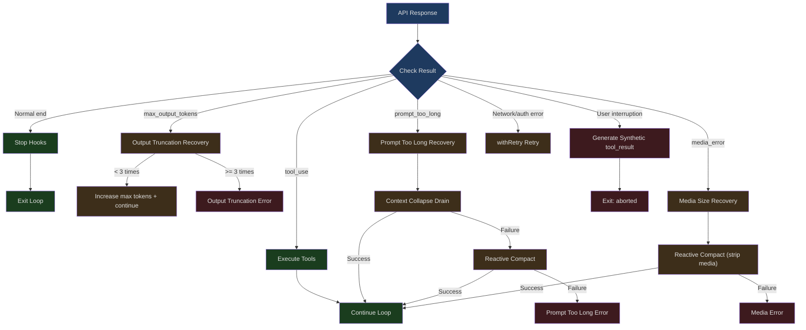
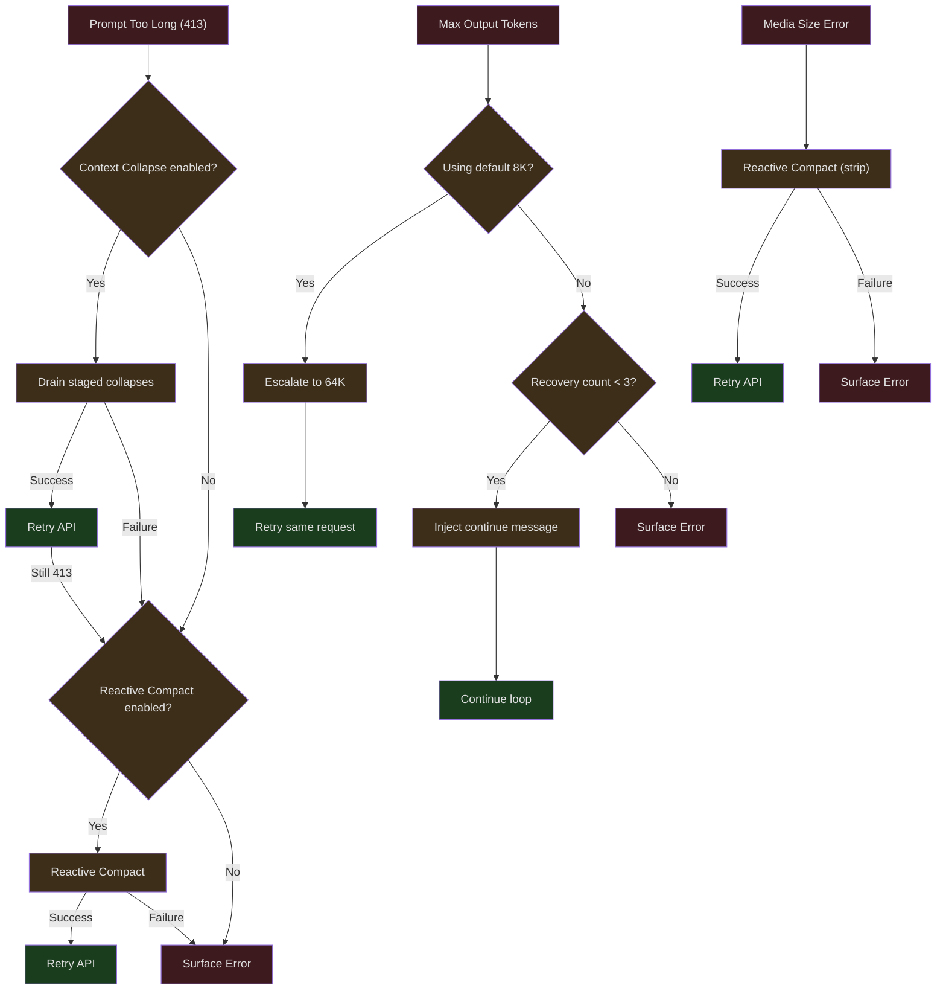

## The Problem

When an AI Agent runs in a real-world environment, failure is the norm rather than the exception. Network timeouts, API overloads, insufficient file permissions, truncated model output, users suddenly pressing Esc — these are not edge cases, but everyday events that happen millions of times per day.

Claude Code's core design philosophy is: **errors should not terminate the session; they should trigger recovery**. The main loop in `query.ts` is not a linear request-response flow, but a state machine with multiple recovery paths. When the API returns a `max_output_tokens` error, the system automatically retries with an injected "continue" instruction; when the prompt is too long, the system triggers reactive compaction and retries; when the user presses Esc to interrupt, the system generates synthetic `tool_result` messages to keep the message format valid.

This article provides an in-depth analysis of every path in this recovery state machine.

---

## The query.ts Recovery State Machine

### State Definition

The query loop maintains a mutable state object that is passed between iterations:

```typescript
// src/query.ts (lines 204-217)
type State = {
  messages: Message[]
  toolUseContext: ToolUseContext
  autoCompactTracking: AutoCompactTrackingState | undefined
  maxOutputTokensRecoveryCount: number
  hasAttemptedReactiveCompact: boolean
  maxOutputTokensOverride: number | undefined
  pendingToolUseSummary: Promise<ToolUseSummaryMessage | null> | undefined
  stopHookActive: boolean | undefined
  turnCount: number
  transition: Continue | undefined
}
```

Key recovery state fields:
- `maxOutputTokensRecoveryCount` — number of output truncation recovery attempts made (max 3)
- `hasAttemptedReactiveCompact` — whether reactive compaction has been attempted
- `maxOutputTokensOverride` — current override for max output tokens
- `transition` — reason the previous iteration continued (used to prevent duplicate recovery)

### Loop Initialization

```typescript
// src/query.ts (lines 268-279)
let state: State = {
  messages: params.messages,
  toolUseContext: params.toolUseContext,
  maxOutputTokensOverride: params.maxOutputTokensOverride,
  autoCompactTracking: undefined,
  stopHookActive: undefined,
  maxOutputTokensRecoveryCount: 0,
  hasAttemptedReactiveCompact: false,
  turnCount: 1,
  pendingToolUseSummary: undefined,
  transition: undefined,
}
```

---

## Recovery Path Overview



---

## max_output_tokens Recovery

When model output is truncated (`stop_reason: max_output_tokens`), the system doesn't immediately report an error — instead, it attempts to let the model continue:

```typescript
// src/query.ts (line 164)
const MAX_OUTPUT_TOKENS_RECOVERY_LIMIT = 3
```

### Error Suppression

In the streaming loop, max_output_tokens errors are suppressed (not sent to SDK consumers):

```typescript
// src/query.ts (lines 175-179)
function isWithheldMaxOutputTokens(
  msg: Message | StreamEvent | undefined,
): msg is AssistantMessage {
  return msg?.type === 'assistant' && msg.apiError === 'max_output_tokens'
}
```

```typescript
// src/query.ts (lines 820-822)
if (isWithheldMaxOutputTokens(message)) {
  withheld = true
}
```

### Escalating Retry

If the default 8K max output tokens was used, the system first escalates to 64K and retries the same request — no continue message is injected, and the recovery counter is not incremented:

```typescript
// src/query.ts (approximately lines 1188-1200)
// Escalating retry: if we used the capped 8k default and hit the
// limit, retry the SAME request at 64k — no meta message, no
// multi-turn dance. This fires once per turn.
const capEnabled = getFeatureValue_CACHED_MAY_BE_STALE(
  'tengu_otk_slot_v1',
  false,
)
```

If 64K is also insufficient, multi-turn recovery kicks in — a user message is injected ("Your output was truncated here, please continue from the truncation point"), and the loop returns to the API call:

```typescript
// Recovery logic pseudocode
if (maxOutputTokensRecoveryCount < MAX_OUTPUT_TOKENS_RECOVERY_LIMIT) {
  // Inject continue message
  state = {
    ...state,
    maxOutputTokensRecoveryCount: maxOutputTokensRecoveryCount + 1,
    maxOutputTokensOverride: ESCALATED_MAX_TOKENS,
    transition: { reason: 'max_output_tokens_recovery' },
  }
  continue  // Return to loop top
}
// Exceeded limit — surface the error
yield lastMessage
return { reason: 'max_output_tokens' }
```

The recovery limit is capped at 3 attempts — preventing infinite loops (the model may continuously produce excessively long output in some cases).

---

## Prompt Too Long Recovery

When the context exceeds the model's limit, the system has two levels of recovery:

### Level 1: Context Collapse Drain

Context Collapse is a lightweight compression approach — it folds old messages into summaries while preserving granularity. Draining commits all staged folds at once:

```typescript
// src/query.ts (lines 1086-1117)
if (feature('CONTEXT_COLLAPSE') && contextCollapse &&
    state.transition?.reason !== 'collapse_drain_retry') {
  const drained = contextCollapse.recoverFromOverflow(
    messagesForQuery,
    querySource,
  )
  if (drained.committed > 0) {
    const next: State = {
      messages: drained.messages,
      toolUseContext,
      autoCompactTracking: tracking,
      maxOutputTokensRecoveryCount,
      hasAttemptedReactiveCompact,
      maxOutputTokensOverride: undefined,
      pendingToolUseSummary: undefined,
      stopHookActive: undefined,
      turnCount,
      transition: { reason: 'collapse_drain_retry', committed: drained.committed },
    }
    state = next
    continue
  }
}
```

Note the `state.transition?.reason !== 'collapse_drain_retry'` check — if the previous iteration was already a collapse drain and still resulted in a 413, draining wasn't sufficient and more aggressive measures are needed.

### Level 2: Reactive Compact

If collapse draining isn't enough (or isn't enabled), full reactive compaction is triggered:

```typescript
// src/query.ts (lines 1119-1166)
if ((isWithheld413 || isWithheldMedia) && reactiveCompact) {
  const compacted = await reactiveCompact.tryReactiveCompact({
    hasAttempted: hasAttemptedReactiveCompact,
    querySource,
    aborted: toolUseContext.abortController.signal.aborted,
    messages: messagesForQuery,
    cacheSafeParams: {
      systemPrompt, userContext, systemContext,
      toolUseContext,
      forkContextMessages: messagesForQuery,
    },
  })

  if (compacted) {
    const postCompactMessages = buildPostCompactMessages(compacted)
    for (const msg of postCompactMessages) {
      yield msg
    }
    const next: State = {
      messages: postCompactMessages,
      toolUseContext,
      autoCompactTracking: undefined,
      maxOutputTokensRecoveryCount,
      hasAttemptedReactiveCompact: true,  // Mark as attempted
      maxOutputTokensOverride: undefined,
      pendingToolUseSummary: undefined,
      stopHookActive: undefined,
      turnCount,
      transition: { reason: 'reactive_compact_retry' },
    }
    state = next
    continue
  }

  // Cannot recover — surface the error
  yield lastMessage
  void executeStopFailureHooks(lastMessage, toolUseContext)
  return { reason: isWithheldMedia ? 'image_error' : 'prompt_too_long' }
}
```

Key safety measures:
- `hasAttemptedReactiveCompact: true` ensures only one attempt — preventing a "compact -> retry -> 413 -> compact" death loop
- Stop hooks are not executed — the model didn't produce a valid response, so hooks cannot evaluate
- `executeStopFailureHooks` is a different function — it only performs minimal failure notification

### Pre-emptive Blocking

Before entering the API call, if auto-compact is disabled and tokens have reached the threshold, the request is blocked outright:

```typescript
// src/query.ts (approximately lines 626-648)
if (!compactionResult && querySource !== 'compact' && querySource !== 'session_memory'
    && !(reactiveCompact?.isReactiveCompactEnabled() && isAutoCompactEnabled())
    && !collapseOwnsIt) {
  const { isAtBlockingLimit } = calculateTokenWarningState(
    tokenCountWithEstimation(messagesForQuery) - snipTokensFreed,
    toolUseContext.options.mainLoopModel,
  )
  if (isAtBlockingLimit) {
    yield createAssistantAPIErrorMessage({
      content: PROMPT_TOO_LONG_ERROR_MESSAGE,
    })
    return { reason: 'blocking_limit' }
  }
}
```

Note the skip conditions — when reactive compact or context collapse is enabled, pre-emptive blocking is not performed, because they can recover after the API error occurs. Pre-emptive blocking would prevent the error from happening, thereby also preventing the recovery opportunity.

---

## Model Fallback Recovery

When `FallbackTriggeredError` is thrown during streaming:

```typescript
// src/query.ts (lines 893-953)
} catch (innerError) {
  if (innerError instanceof FallbackTriggeredError && fallbackModel) {
    currentModel = fallbackModel
    attemptWithFallback = true

    // Generate placeholder tool_results for already-emitted messages
    yield* yieldMissingToolResultBlocks(
      assistantMessages,
      'Model fallback triggered',
    )
    assistantMessages.length = 0
    toolResults.length = 0

    // Discard pending results from the streaming tool executor
    if (streamingToolExecutor) {
      streamingToolExecutor.discard()
      streamingToolExecutor = new StreamingToolExecutor(...)
    }

    // Update model in tool context
    toolUseContext.options.mainLoopModel = fallbackModel

    // Thinking signatures are model-bound — clear them to avoid 400 errors
    if (process.env.USER_TYPE === 'ant') {
      messagesForQuery = stripSignatureBlocks(messagesForQuery)
    }

    yield createSystemMessage(
      `Switched to ${renderModelName(innerError.fallbackModel)} due to high demand`,
      'warning',
    )

    continue  // Retry inner loop
  }
  throw innerError
}
```

Of particular note is `stripSignatureBlocks` — protected thinking blocks carry model-specific cryptographic signatures that would cause API 400 errors after falling back to a different model.

---

## User Interruption Handling

When the user presses Esc or Ctrl+C, the system needs to stop gracefully:

```typescript
// src/hooks/useCancelRequest.ts (lines 87-122)
const handleCancel = useCallback(() => {
  // Priority 1: If there's an active task, cancel it
  if (abortSignal !== undefined && !abortSignal.aborted) {
    logEvent('tengu_cancel', cancelProps)
    setToolUseConfirmQueue(() => [])
    onCancel()
    return
  }

  // Priority 2: If Claude is idle, pop from queue
  if (hasCommandsInQueue()) {
    if (popCommandFromQueue) {
      popCommandFromQueue()
      return
    }
  }

  // Fallback: Nothing to cancel
  logEvent('tengu_cancel', cancelProps)
  setToolUseConfirmQueue(() => [])
  onCancel()
}, [...])
```

Interruption priority:
1. **Active task** — set the abort signal, cancel API calls and tool execution
2. **Command queue** — if Claude is idle but has queued commands, pop the last one
3. **Fallback** — clear the permission confirmation queue

### Post-Interruption Message Cleanup

In query.ts, after an interruption, synthetic `tool_result` messages must be generated for all incomplete `tool_use` blocks:

```typescript
// src/query.ts (lines 1015-1051)
if (toolUseContext.abortController.signal.aborted) {
  if (streamingToolExecutor) {
    // Consume remaining results — executor generates synthetic tool_results for interrupted tools
    for await (const update of streamingToolExecutor.getRemainingResults()) {
      if (update.message) {
        yield update.message
      }
    }
  } else {
    yield* yieldMissingToolResultBlocks(
      assistantMessages,
      'Interrupted by user',
    )
  }

  // Skip interruption message for submit-interrupt
  if (toolUseContext.abortController.signal.reason !== 'interrupt') {
    yield createUserInterruptionMessage({ toolUse: false })
  }
  return { reason: 'aborted_streaming' }
}
```

`yieldMissingToolResultBlocks` ensures message format validity — the API requires every `tool_use` to be followed by a corresponding `tool_result`:

```typescript
// src/query.ts (lines 123-149)
function* yieldMissingToolResultBlocks(
  assistantMessages: AssistantMessage[],
  errorMessage: string,
) {
  for (const assistantMessage of assistantMessages) {
    const toolUseBlocks = assistantMessage.message.content.filter(
      content => content.type === 'tool_use',
    ) as ToolUseBlock[]

    for (const toolUse of toolUseBlocks) {
      yield createUserMessage({
        content: [{
          type: 'tool_result',
          content: errorMessage,
          is_error: true,
          tool_use_id: toolUse.id,
        }],
        toolUseResult: errorMessage,
        sourceToolAssistantUUID: assistantMessage.uuid,
      })
    }
  }
}
```

### Ctrl+C vs. Esc Differences

```typescript
// src/hooks/useCancelRequest.ts (lines 148-155)
// Escape: respects mode switching, doesn't trigger in special input modes
const isEscapeActive =
  isContextActive &&
  (canCancelRunningTask || hasQueuedCommands) &&
  !isInSpecialModeWithEmptyInput &&
  !isViewingTeammate

// Ctrl+C: more forceful, can interrupt even when viewing a teammate
const isCtrlCActive =
  isContextActive &&
  (canCancelRunningTask || hasQueuedCommands || isViewingTeammate)
```

Ctrl+C additionally handles the teammate viewing scenario — stopping all background agents and returning to the main thread.

### Kill All Agents (Double Confirmation)

```typescript
// src/hooks/useCancelRequest.ts (lines 225-266)
const handleKillAgents = useCallback(() => {
  const now = Date.now()
  const elapsed = now - lastKillAgentsPressRef.current

  if (elapsed <= KILL_AGENTS_CONFIRM_WINDOW_MS) {
    // Second press within 3 seconds — confirm kill all background agents
    lastKillAgentsPressRef.current = 0
    killAllAgentsAndNotify()
    return
  }

  // First press — show confirmation prompt
  lastKillAgentsPressRef.current = now
  addNotification({
    key: 'kill-agents-confirm',
    text: `Press ${shortcut} again to stop background agents`,
    timeoutMs: KILL_AGENTS_CONFIRM_WINDOW_MS,
  })
}, [...])
```

The 3-second confirmation window prevents accidental termination — background agents may be executing important tasks.

---

## Tool Execution Failure Feedback

When tool execution fails, the error information is fed back to the model as `tool_result` content with `is_error: true`. This allows the model to understand what happened and decide the next step — retry, try a different approach, or report to the user:

```typescript
// Simplified representation — tool execution error handling
yield createUserMessage({
  content: [{
    type: 'tool_result',
    content: `Error: ${error.message}`,
    is_error: true,
    tool_use_id: toolUse.id,
  }],
})
```

This is Claude Code's core self-healing pattern — **errors are not system termination signals, but input signals for the model**. After seeing a `bash` command fail, the model typically modifies the command and retries. After seeing a file doesn't exist, it first runs `ls` to check.

---

## /doctor Environment Self-Diagnostics

The `/doctor` command provides system-level diagnostics:

```typescript
// src/utils/doctorDiagnostic.ts (lines 54-71)
export type DiagnosticInfo = {
  installationType: InstallationType
  version: string
  installationPath: string
  invokedBinary: string
  configInstallMethod: InstallMethod | 'not set'
  autoUpdates: string
  hasUpdatePermissions: boolean | null
  multipleInstallations: Array<{ type: string; path: string }>
  warnings: Array<{ issue: string; fix: string }>
  recommendation?: string
  packageManager?: string
  ripgrepStatus: {
    working: boolean
    mode: 'system' | 'builtin' | 'embedded'
    systemPath: string | null
  }
}
```

The diagnostics cover:

1. **Installation type detection** — npm-global/npm-local/native/package-manager/development
2. **Multiple installation detection** — discovers multiple Claude Code installations on the system
3. **Permission checks** — whether auto-updates have write permissions
4. **ripgrep status** — whether the search engine is working properly
5. **Shell configuration** — whether aliases and environment variables are correct

The installation type detection logic is quite thorough:

```typescript
// src/utils/doctorDiagnostic.ts (lines 86-148)
export async function getCurrentInstallationType(): Promise<InstallationType> {
  if (process.env.NODE_ENV === 'development') return 'development'

  if (isInBundledMode()) {
    // Check if installed by a package manager
    if (detectHomebrew() || detectWinget() || detectMise() ||
        detectAsdf() || await detectPacman() ||
        await detectDeb() || await detectRpm() || await detectApk()) {
      return 'package-manager'
    }
    return 'native'
  }

  if (isRunningFromLocalInstallation()) return 'npm-local'

  // Check typical npm global paths
  const npmGlobalPaths = [
    '/usr/local/lib/node_modules',
    '/usr/lib/node_modules',
    '/opt/homebrew/lib/node_modules',
    '/.nvm/versions/node/',
  ]
  if (npmGlobalPaths.some(path => invokedPath.includes(path))) {
    return 'npm-global'
  }

  return 'unknown'
}
```

The detection covers all major package managers — Homebrew, winget, mise, asdf, pacman, deb, rpm, apk — ensuring correct identification of the installation method on any Linux/macOS/Windows environment.

---

## Interactions Between Recovery Paths

The various recovery paths have complex interactions, and understanding these relationships is key to understanding the system's resilience:



Key interaction rules:

1. **Pre-emptive blocking and recovery are mutually exclusive** — when reactive compact or context collapse is enabled, pre-emptive blocking is skipped (otherwise the recovery path would never be triggered)
2. **Collapse to Reactive cascade** — reactive compact is only attempted after collapse draining fails
3. **Each type attempted only once** — `hasAttemptedReactiveCompact` prevents a reactive compact death loop
4. **Transitions prevent repetition** — `state.transition?.reason` checks prevent the same recovery strategy from executing consecutively
5. **Error suppression and recovery must be consistent** — errors suppressed in the streaming loop must have corresponding handling in the recovery check; otherwise errors get silently swallowed

### Consistency Requirement for Streaming Error Suppression

```typescript
// src/query.ts (approximately line 626, comment)
// Hoist media-recovery gate once per turn. Withholding (inside the
// stream loop) and recovery (after) must agree; CACHED_MAY_BE_STALE can
// flip during the 5-30s stream, and withhold-without-recover would eat
// the message.
const mediaRecoveryEnabled =
  reactiveCompact?.isReactiveCompactEnabled() ?? false
```

Feature flag values can change during the 5-30 seconds of streaming (GrowthBook cache refresh). If an error was suppressed at the start of the stream, but the recovery check sees the flag as disabled at the end of the stream, the error is lost. Therefore, the flag value is extracted once at the start of the turn and used consistently throughout.

---

## Summary

Claude Code's error recovery system embodies several core principles:

- **Errors are input, not termination signals** — tool execution failures become `tool_result(is_error: true)` feedback to the model
- **Graduated recovery** — from lightweight (collapse drain) to heavyweight (reactive compact), escalating level by level
- **Bounded retries** — each recovery path has a clear attempt limit, preventing death loops
- **State integrity** — synthetic tool_results are generated after interruption, keeping message format valid
- **Flag consistency** — suppression and recovery must see the same feature flag values
- **Environment self-diagnostics** — /doctor provides system-level diagnostics to help users troubleshoot environment issues

The complexity of this system stems directly from the design goal of "never terminating the session." In a world where an AI Agent may run continuously for hours, every failure mode needs a recovery path — not because engineers enjoy complexity, but because reality is complex.
