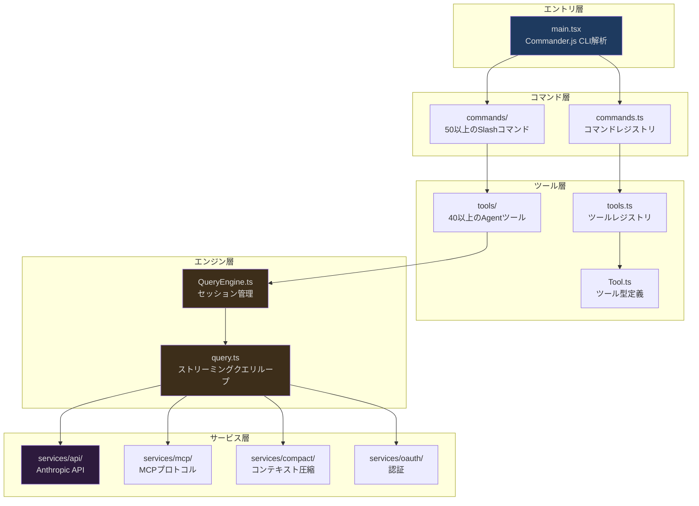
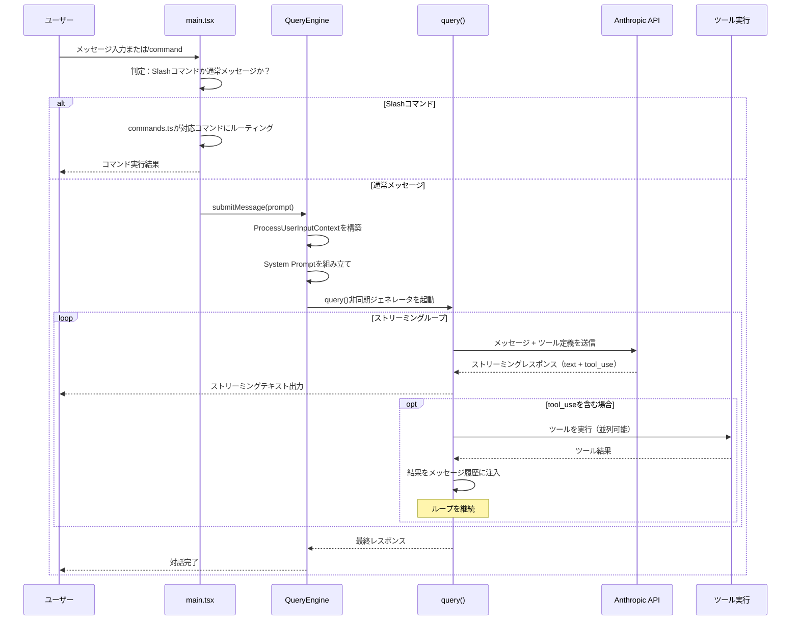
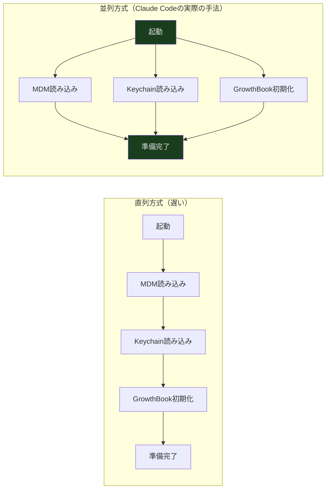

## 概要

2026年3月31日、セキュリティ研究者のChaofan Shouが、AnthropicのnpmレジストリにClaude Code CLIの完全な未難読化TypeScriptソースコードを含む `.map` ファイルが公開されていることを発見しました。このソースコードは約1,900ファイル、512,000行以上のコードで構成されています。これは単なるコマンドラインツールではなく、エンジニアリングの複雑さが極めて高い、完全なAIエージェントプラットフォームです。

本記事はこのシリーズの第1回です。個別モジュールの実装詳細には踏み込みません（それは後続の記事で行います）。ここでは最も高い視点からコードベース全体を俯瞰します。どのような技術スタックが選ばれたのか？なぜこれらの選択がなされたのか？コードはどのように構成されているのか？ユーザーの入力から出力まで、どのような層を通過するのか？これらのグローバルな問題を理解することが、あらゆるサブシステムを深く理解するための前提条件です。

AIツールを開発中の方にとっては、プロダクションレベルのAI CLIのアーキテクチャの青写真を理解する助けになるでしょう。Claude Codeの内部がどのように動作しているのか単純に興味がある方には、明確な全体像を提供します。

---

## 技術選定：なぜこの組み合わせなのか？

Claude Codeのソースコードを開いて最初に驚くのは、その技術スタックです：

| カテゴリ | 技術選択 |
|------|----------|
| ランタイム | Bun |
| 言語 | TypeScript（strictモード） |
| ターミナルUI | React + Ink |
| CLI解析 | Commander.js（extra-typings） |
| スキーマ検証 | Zod v4 |
| コード検索 | ripgrep |
| プロトコル | MCP SDK, LSP |
| API | Anthropic SDK |
| テレメトリ | OpenTelemetry + gRPC |
| 認証 | OAuth 2.0, JWT, macOS Keychain |

### なぜNode.jsではなくBunなのか？

Bunが選ばれた理由は、起動速度（CLIツールにとって極めて重要）だけではありません。もう一つの重要な特徴は、**コンパイル時Feature Flag**です。

```typescript
// src/main.tsx
import { feature } from 'bun:bundle'

const coordinatorModeModule = feature('COORDINATOR_MODE')
  ? require('./coordinator/coordinatorMode.js')
  : null

const assistantModule = feature('KAIROS')
  ? require('./assistant/index.js')
  : null
```

`feature('COORDINATOR_MODE')` がビルド時に `false` と評価されると、Bunのバンドラは `require()` ブランチ全体、およびそれが推移的に依存するすべてのモジュールを最終成果物から完全に削除します。これはランタイムの `if` 判定ではなく、コンパイル時のデッドコード除去（Dead Code Elimination）です。スタンドアロンCLIモード、IDE統合モード（BRIDGE_MODE）、音声モード（VOICE_MODE）、バックグラウンドデーモンモード（DAEMON）など、複数の形態をサポートする必要があるツールにとって、これは各ビルド成果物に実際に必要なコードのみが含まれることを意味します。

### なぜReactでコマンドラインインターフェースを構築するのか？

これはおそらく最も直感に反する選択でしょう。Reactはブラウザ向けに設計されたものですが、Claude Codeのターミナルインターフェースは一般的なCLIよりもはるかに複雑です。ストリーミングAIレスポンスのリアルタイムレンダリング、ツール実行のプログレスバー表示、ファイルdiffの表示、インタラクティブな権限承認ダイアログなどが必要です。これらのインタラクションパターンは、従来のコマンドラインよりもWebアプリケーションに近いものです。

InkはReactのレンダリングターゲットをブラウザDOMからターミナル文字に切り替えます。これにより、Claude CodeはReactのコンポーネントモデル、Hookシステム、状態管理を使用してUIを構築しながら、ターミナルに出力できます。`src/components/` ディレクトリには**140以上のReactコンポーネント**があり、メッセージレンダリングから権限ダイアログ、ファイルdiff表示からプログレスインジケータまで多岐にわたります。

---

## ディレクトリ構成と階層アーキテクチャ

Claude Codeの `src/` ディレクトリには33のトップレベルサブディレクトリがあります。一見すると圧倒されますが、5層のアーキテクチャモデルに明確にマッピングできます：



各層を順に理解していきましょう：

### エントリ層：`main.tsx`

すべては `main.tsx` から始まります。このファイルは3つの重要なことを行います：

1. **CLI引数の解析** — Commander.jsを使用して `claude --model sonnet "fix the bug"` のようなコマンドを処理
2. **ランタイムの初期化** — 設定の読み込み、API接続の確立、テレメトリの設定
3. **Inkレンダリングループの開始** — Reactコンポーネントツリーをターミナルにマウント

しかし最も興味深いのは何をするかではなく、**どのように行うか**です。起動シーケンスは並列実行に最適化されています：

```typescript
// src/main.tsx:12-20
// これらの呼び出しは重いimportの前に実行される
profileCheckpoint('main_tsx_entry')
startMdmRawRead()      // MDM設定を並列で読み込み
startKeychainPrefetch() // Keychain資格情報を並列でプリフェッチ
```

残りのモジュールをロードする前に、`main.tsx` はすでにMDM（Mobile Device Management）設定の読み込みとmacOS Keychain資格情報のプリフェッチを開始しています。これら2つのI/O操作は並列で実行され、必要になるまで直列に待つことはありません。高速起動が求められるCLIツールにとって、この「早期開始・遅延消費」パターンは重要なパフォーマンス最適化です。

### コマンド層：`commands.ts` + `commands/`

ユーザーが `/commit`、`/review`、`/compact` などのスラッシュコマンドを入力すると、`commands.ts` が対応する実装にルーティングします。コマンドレジストリはツールと同じFeature Flagパターンを使用しています：

```typescript
// src/commands.ts:62-122
// 条件付きインポート：有効でないコマンドはビルド時に除去される
import { feature } from 'bun:bundle'

// VOICE_MODEがオフの場合、音声コマンドのコード全体が最終成果物に含まれない
// BRIDGE_MODEがオフの場合、IDE統合関連コマンドが削除される
```

特に重いコマンド（例えば `insights`、単一ファイルで113KB）に対しては、興味深い遅延読み込みパターンが使われています。起動時のロードを回避するため、ランタイムの動的インポートを使用しています：

```typescript
// src/commands.ts:190-200
const usageReport: Command = {
  type: 'prompt',
  name: 'insights',
  async getPromptForCommand(args, context) {
    // ユーザーが実際に/insightsを実行した時のみ、113KBのモジュールをロード
    const real = (await import('./commands/insights.js')).default
    return real.getPromptForCommand(args, context)
  }
}
```

これはコンパイル時除去とランタイム遅延読み込みの組み合わせです。不要な機能はコンパイル時に削除され、必要だが頻繁に使われない機能はランタイムで遅延読み込みされます。

### ツール層：`Tool.ts` + `tools.ts` + `tools/`

ツールはClaude Codeの最も中核的な概念の一つです。各ツールはAIが実行できる操作を表します。ファイルの読み取り、ファイルの書き込み、Shellコマンドの実行、コード検索、Webページへのアクセスなどです。ツールシステムは第03回の記事で詳しく分析しますが、ここではその位置と役割を理解するだけで十分です：

- **`Tool.ts`（792行）** — ツールの型システムと権限モデルを定義
- **`tools.ts`** — ツールレジストリ、すべての利用可能なツールのsource of truth
- **`tools/`** — 45のサブディレクトリ、各ディレクトリがツールの完全な実装

```typescript
// src/tools.ts — ツールレジストリ
// getAllBaseTools()はシステム全体のツール一覧
// 条件付きインポートと遅延requireを使用して依存関係を管理

// Feature-gatedツールの例：
const cronTools = feature('AGENT_TRIGGERS')
  ? [
      require('./tools/ScheduleCronTool/CronCreateTool.js').CronCreateTool,
      require('./tools/ScheduleCronTool/CronDeleteTool.js').CronDeleteTool,
      require('./tools/ScheduleCronTool/CronListTool.js').CronListTool,
    ]
  : []

// 遅延requireによる循環依存の解消：
const getTeamCreateTool = () =>
  require('./tools/TeamCreateTool/TeamCreateTool.js').TeamCreateTool
```

### エンジン層：`QueryEngine.ts` + `query.ts`

ここがClaude Codeの心臓部です。`QueryEngine.ts`（1,295行）は対話セッション全体の状態を管理します。メッセージ履歴、ファイルキャッシュ、トークンカウント、権限記録などです。`query.ts`（1,729行）はストリーミングクエリループを実装しています。非同期ジェネレータ駆動のステートマシンで、APIの呼び出し、ツール呼び出しの処理、リカバリ戦略の実行を担当します。

エンジン層は第02回の記事で完全に分析します。ここでは以下の流れだけ把握しておけば十分です：

```
ユーザーメッセージ → QueryEngine.submitMessage()
         → query() 非同期ジェネレータ
         → APIストリーミング呼び出し
         → tool_use検出 → ツール実行 → 結果の注入 → 生成を継続
         → 最終レスポンス
```

### サービス層：`services/`

サービス層はエンジンとツールが必要とするインフラストラクチャ機能を提供します：

| サービス | パス | 役割 |
|------|------|------|
| APIクライアント | `services/api/` | Anthropic API呼び出し、ストリーミングレスポンス、リトライ |
| MCPプロトコル | `services/mcp/` | Model Context Protocolサーバーの接続管理 |
| コンテキスト圧縮 | `services/compact/` | 対話履歴の圧縮、コンテキストウィンドウの超過防止 |
| 認証 | `services/oauth/` | OAuth 2.0フロー、トークンリフレッシュ |
| テレメトリ | `services/analytics/` | GrowthBook Feature Flag、ユーザーセグメンテーション |
| LSP | `services/lsp/` | Language Server Protocol統合 |
| プラグイン | `services/plugins/` | プラグインの読み込みと管理 |

---

## コアデータフロー：一回のインタラクションの旅

階層アーキテクチャを理解したところで、入力から出力まで、一回の完全なユーザーインタラクションを追跡し、データが各層をどのように流れるかを見てみましょう：



このフローにはいくつかの重要な設計上の決定があります：

1. **ストリーミング出力**：AIのテキストレスポンスは生成と同時にターミナルにストリーミング出力され、ユーザーは完全なレスポンスを待つ必要がありません
2. **ツール呼び出しループ**：LLMは1回のレスポンスで複数のツールを呼び出すことができ、ツールの結果はメッセージ履歴に注入され、LLMは新しい情報に基づいて生成を継続します
3. **並列ツール実行**：互いに競合しない複数のツールは並列に実行できます（`StreamingToolExecutor` が管理）

---

## 主要な設計思想

コードベース全体を通じて、繰り返し現れるいくつかの設計パターンがあります。これらを理解することで、後続の記事で各サブシステムの設計意図をより早く把握できるでしょう：

### 1. 並列プリフェッチ（Parallel Prefetch）

起動時に待機せず、I/Oをできるだけ早く開始します：



### 2. 遅延読み込み（Lazy Loading）

重いモジュールは初回使用時まで読み込みを遅延させます：

- OpenTelemetry（約400KB） — 最初のテレメトリイベント時に読み込み
- gRPC（約700KB） — 最初にgRPCトランスポートが必要になった時に読み込み
- 大型コマンドモジュール — ユーザーが実際にコマンドを実行した時に読み込み

### 3. コンパイル時コード除去（Dead Code Elimination）

`feature()` flagによってビルド時に不要なコードパスを完全に除去します。既知のflagは以下の通りです：

| Flag | 制御する機能 |
|------|-----------|
| `COORDINATOR_MODE` | マルチエージェントコーディネータ |
| `KAIROS` | 高度なエージェント機能 |
| `BRIDGE_MODE` | IDE統合 |
| `VOICE_MODE` | 音声入力 |
| `DAEMON` | バックグラウンドデーモンモード |
| `PROACTIVE` | プロアクティブモード（SleepTool） |
| `AGENT_TRIGGERS` | リモートトリガーとスケジュールタスク |
| `BUDDY` | バディイースターエッグ |

### 4. ミニマルな状態管理

Redux不使用、MobX不使用、Zustand不使用。Claude Codeのグローバル状態管理は、わずか35行未満のカスタムStore実装に基づいています：

```typescript
// src/state/store.ts（完全な実装）
export function createStore<T>(
  initialState: T,
  onChange?: OnChange<T>,
): Store<T> {
  let state = initialState
  const listeners = new Set<Listener>()

  return {
    getState: () => state,
    setState: (updater: (prev: T) => T) => {
      const prev = state
      const next = updater(prev)
      if (Object.is(next, prev)) return
      state = next
      onChange?.({ newState: next, oldState: prev })
      for (const listener of listeners) listener()
    },
    subscribe: (listener: Listener) => {
      listeners.add(listener)
      return () => listeners.delete(listener)
    },
  }
}
```

3つのメソッド — `getState`、`setState`、`subscribe` — に `Object.is()` による参照等価性チェック。これだけで十分です。

---

## その他のサブシステム

この概要の範囲外にも、Claude Codeのコードベースには多くの魅力的なサブシステムがあり、後続の記事で一つずつ詳しく分析していきます：

| サブシステム | パス | 概要 |
|--------|------|------|
| Bridge | `src/bridge/` | 34ファイル、1MB以上のコードでCLIとIDEの双方向通信を実現 |
| Coordinator | `src/coordinator/` | マルチエージェントオーケストレーション — ディスパッチャー/ワーカーパターン |
| Memory | `src/memdir/` | ファイルシステムベースの永続メモリ — 4種類、自動抽出 |
| Skills | `src/skills/` | Markdown frontmatterを設定として使う拡張可能なスキルシステム |
| Plugins | `src/plugins/` | 二段階登録のプラグインアーキテクチャ |
| Ink | `src/ink/` | 50ファイルのターミナルUIレンダリングエンジン |
| Vim | `src/vim/` | 網羅的な型ステートマシンで実装されたVimモーダル編集 |
| Buddy | `src/buddy/` | 決定論的乱数駆動の仮想バディイースターエッグ |

---

## 次回予告

本記事でグローバルなアーキテクチャの理解を確立した後、[第02回：クエリエンジン](/articles/02-query-engine)ではClaude Codeの最もコアなエンジン層 — `QueryEngine.ts` と `query.ts` — に深く踏み込みます。ユーザー入力から最終レスポンスまでの対話の完全なライフサイクルを追跡します。非同期ジェネレータがどのようにストリーミングクエリループを駆動するか、そして問題が発生した時（コンテキストオーバーフロー、APIタイムアウト、モデルの拒否）にエンジンがどのように優雅にリカバリするかを見ていきます。
