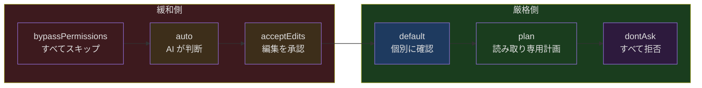
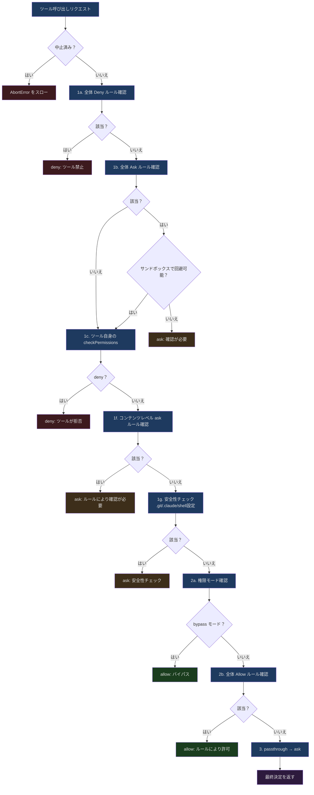
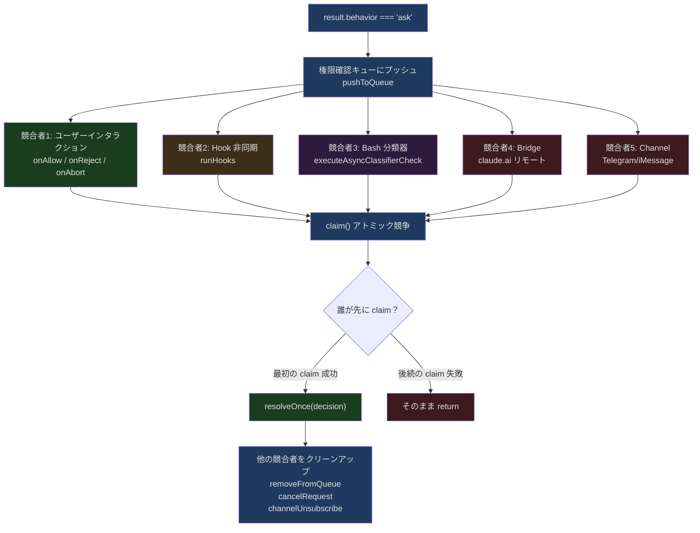

## 問題提起

AI に確認なしで `rm -rf /` を実行させてもいいでしょうか？おそらく誰もそうは思わないでしょう。では `git push` はどうでしょうか？この答えは人によって異なります。自分の開発ブランチへのプッシュなら全く問題ないと考える人もいれば、`main` へのプッシュには必ず確認が必要だと考える人もいます。では `cat package.json` は？ファイルを読むたびに「許可」をクリックする必要があるなら、ユーザー体験は最悪です。

各操作のリスクは異なりますが、権限の境界線はどこに引くべきでしょうか？

これは新しい問題ではありません。Unix の rwx 権限モデル、Android のランタイム権限、ブラウザの同一オリジンポリシー——あらゆるプラットフォームが「機能」と「安全性」のバランスを模索してきました。しかし、AI コーディングツールが直面する課題はさらに複雑です：

1. **操作空間が広大**：ファイルの読み書きだけでなく、コマンド実行、ネットワークリクエスト、外部サービス呼び出しまで含まれます
2. **リスク評価に意味理解が必要**：`rm -rf node_modules` と `rm -rf /` は構文上は似ていますが、リスクは天と地の差があります
3. **ユーザーの期待が矛盾**：「自動化」と「安全」の両立、「高速」と「確認を求める」の両立が求められます
4. **マルチロール協調**：メイン agent、coordinator worker、swarm worker の権限要件はそれぞれ全く異なります

Claude Code の権限システムは、精巧な多層評価パイプラインによってこの問題を解決しています。本記事では、ソースコードレベルでその設計を詳しく解析します。

---

## 権限モードの全体像

評価パイプラインに入る前に、まず Claude Code が定義している権限モードを見てみましょう。これらのモードがシステムの「デフォルトの姿勢」を決定します。

### モード定義

権限モードは `src/types/permissions.ts` で定義されています：

```typescript
// src/types/permissions.ts, lines 16-38
export const EXTERNAL_PERMISSION_MODES = [
  'acceptEdits',
  'bypassPermissions',
  'default',
  'dontAsk',
  'plan',
] as const

export type ExternalPermissionMode = (typeof EXTERNAL_PERMISSION_MODES)[number]

export type InternalPermissionMode = ExternalPermissionMode | 'auto' | 'bubble'
export type PermissionMode = InternalPermissionMode

export const INTERNAL_PERMISSION_MODES = [
  ...EXTERNAL_PERMISSION_MODES,
  ...(feature('TRANSCRIPT_CLASSIFIER') ? (['auto'] as const) : ([] as const)),
] as const satisfies readonly PermissionMode[]
```

`auto` モードが `feature('TRANSCRIPT_CLASSIFIER')` でガードされていることに注目してください。これは内部専用のフィーチャーゲートです。`bubble` モードは完全に内部的なもので、ユーザーが設定できるオプションには表示されません。

### モード動作マトリックス

各モードの具体的な動作は `src/utils/permissions/PermissionMode.ts` で設定されています：

```typescript
// src/utils/permissions/PermissionMode.ts, lines 42-91
const PERMISSION_MODE_CONFIG: Partial<
  Record<PermissionMode, PermissionModeConfig>
> = {
  default: {
    title: 'Default',
    shortTitle: 'Default',
    symbol: '',
    color: 'text',
    external: 'default',
  },
  plan: {
    title: 'Plan Mode',
    shortTitle: 'Plan',
    symbol: PAUSE_ICON,
    color: 'planMode',
    external: 'plan',
  },
  acceptEdits: {
    title: 'Accept edits',
    shortTitle: 'Accept',
    symbol: '⏵⏵',
    color: 'autoAccept',
    external: 'acceptEdits',
  },
  bypassPermissions: {
    title: 'Bypass Permissions',
    shortTitle: 'Bypass',
    symbol: '⏵⏵',
    color: 'error',
    external: 'bypassPermissions',
  },
  // ...
}
```

各モードのセマンティクスは以下のとおりです：

| モード | セマンティクス | 典型的な利用シーン |
|------|------|----------|
| `default` | 読み取り専用以外のすべての操作にユーザー確認が必要 | 日常的な対話利用 |
| `plan` | 計画の生成のみ、変更操作は実行しない | コードレビュー、アーキテクチャ議論 |
| `acceptEdits` | ファイル編集は自動承認、ただし Bash コマンドは確認が必要 | モデルの編集能力を信頼する場合 |
| `bypassPermissions` | ほぼすべての権限チェックをスキップ | CI/CD 環境、完全信頼のシナリオ |
| `dontAsk` | すべての `ask` を `deny` に変換 | 非対話型環境 |
| `auto` | AI 分類器でリスクを自動判定 | 内部の上級ユーザー |



このスペクトラム設計は非常にエレガントです。「完全信頼」から「完全不信頼」まで、ユーザーはシナリオに応じて適切な位置を選択できます。ただし、モードは最初のレイヤーに過ぎません。モードは「デフォルトの姿勢」を決定しますが、具体的な権限判断はさらに多層の評価を経る必要があります。

---

## 多層評価パイプライン

権限評価のコアエントリーポイントは `hasPermissionsToUseTool` 関数で、`src/utils/permissions/permissions.ts` に定義されています。パイプライン全体は大きく 2 つのフェーズに分けられます：**静的ルール評価**（同期、高速）と**動的インタラクション評価**（非同期、ユーザーとのやり取りを伴う可能性あり）。

### 第 1 フェーズ：静的ルール評価（hasPermissionsToUseToolInner）

```typescript
// src/utils/permissions/permissions.ts, lines 1158-1319
async function hasPermissionsToUseToolInner(
  tool: Tool,
  input: { [key: string]: unknown },
  context: ToolUseContext,
): Promise<PermissionDecision> {
  if (context.abortController.signal.aborted) {
    throw new AbortError()
  }

  let appState = context.getAppState()

  // 1. ツールが拒否されているか確認
  // 1a. ツール全体が拒否されている
  const denyRule = getDenyRuleForTool(appState.toolPermissionContext, tool)
  if (denyRule) {
    return {
      behavior: 'deny',
      decisionReason: { type: 'rule', rule: denyRule },
      message: `Permission to use ${tool.name} has been denied.`,
    }
  }
  // ...
}
```

完全な静的評価フローを優先順位順に示すと以下のようになります：



この順序には深い意味があります：

**Deny 優先**：現在のモードが何であれ、deny ルールは常に最初にチェックされます。これにより安全の最低ラインが保証されます。`bypassPermissions` モードであっても、明示的な deny ルールは有効です。

**安全チェックのバイパス免除**：ステップ 1f と 1g により、`bypassPermissions` モードでもバイパスできない安全チェックがあります。`.git/`、`.claude/`、シェル設定ファイルへの変更は常に確認が必要です。これは「trust but verify」の思想の体現です。AI の能力は信頼しますが、一部の操作の影響は重大すぎるのです。

**モードチェックは中間に配置**：bypassPermissions モードのチェックは、deny ルールと安全チェックの後、allow ルールの前に配置されます。つまり、bypass モードは「通常の権限をスキップする」のであって「すべてをスキップする」のではありません。

**Passthrough のフォールバック**：ツール自身の `checkPermissions` が `passthrough`（「この権限判断には関与しない」の意）を返した場合、システムはそれを `ask` に変換し、どの操作も暗黙のうちに許可されないことを保証します。

### 第 2 フェーズ：動的インタラクション評価（useCanUseTool 以降）

第 1 フェーズが `ask` を返すと、制御フローは `useCanUseTool` フックに入ります。ここに真の複雑さがあります：

```typescript
// src/hooks/useCanUseTool.tsx, lines 28-33
function useCanUseTool(setToolUseConfirmQueue, setToolPermissionContext) {
  // ...
  return async (tool, input, toolUseContext, assistantMessage, toolUseID) =>
    new Promise(resolve => {
      const ctx = createPermissionContext(/* ... */)
      // ...
      const result = await hasPermissionsToUseTool(tool, input, toolUseContext, ...)
      // result.behavior に基づく分岐処理
    })
}
```

`result.behavior === 'ask'` の場合、システムはマルチ競合者モードに入ります。Hook、分類器、ユーザー、Bridge（claude.ai リモート）、Channel（Telegram 等のチャネル）の 5 つのソースが「誰が先に決定を下すか」を同時に競います。この部分は後続のセクションで詳しく展開します。

---

## ルールシステムの詳細解析

### 3 種類のルール

権限ルールは 3 種類に分かれており、それぞれ独立したソース追跡があります：

```typescript
// src/Tool.ts, lines 123-148
export type ToolPermissionContext = DeepImmutable<{
  mode: PermissionMode
  additionalWorkingDirectories: Map<string, AdditionalWorkingDirectory>
  alwaysAllowRules: ToolPermissionRulesBySource
  alwaysDenyRules: ToolPermissionRulesBySource
  alwaysAskRules: ToolPermissionRulesBySource
  isBypassPermissionsModeAvailable: boolean
  isAutoModeAvailable?: boolean
  strippedDangerousRules?: ToolPermissionRulesBySource
  shouldAvoidPermissionPrompts?: boolean
  awaitAutomatedChecksBeforeDialog?: boolean
  prePlanMode?: PermissionMode
}>
```

`ToolPermissionRulesBySource` の型は本質的に `Record<PermissionRuleSource, string[]>` です。各ソースにルール文字列のセットが対応します。ルールのソースは `src/utils/permissions/permissions.ts` で定義されています：

```typescript
// src/utils/permissions/permissions.ts, lines 109-114
const PERMISSION_RULE_SOURCES = [
  ...SETTING_SOURCES,   // localSettings, userSettings, projectSettings, policySettings, flagSettings
  'cliArg',             // コマンドライン引数
  'command',            // コマンドレベル
  'session',            // セッションレベル
] as const satisfies readonly PermissionRuleSource[]
```

7 種類のソースを優先度の高い順に並べると：

1. **policySettings**：企業ポリシー（管理者が設定、上書き不可）
2. **flagSettings**：フィーチャーフラグ
3. **projectSettings**：プロジェクトレベルの設定（`.claude/settings.json`）
4. **localSettings**：ローカル設定（`.claude/settings.local.json`）
5. **userSettings**：ユーザーグローバル設定（`~/.claude/settings.json`）
6. **cliArg**：コマンドライン引数から渡された設定
7. **session**：現在のセッションでのユーザーの一時的な選択

### ルールマッチング機構

ルールのマッチングロジックは 2 つの粒度をサポートしています：

```typescript
// src/utils/permissions/permissions.ts, lines 238-269
function toolMatchesRule(
  tool: Pick<Tool, 'name' | 'mcpInfo'>,
  rule: PermissionRule,
): boolean {
  // ルールにコンテンツがない場合、ツール全体にマッチ
  if (rule.ruleValue.ruleContent !== undefined) {
    return false
  }

  const nameForRuleMatch = getToolNameForPermissionCheck(tool)

  // ツール名の直接マッチ
  if (rule.ruleValue.toolName === nameForRuleMatch) {
    return true
  }

  // MCP サーバーレベルの権限: ルール "mcp__server1" はツール "mcp__server1__tool1" にマッチ
  const ruleInfo = mcpInfoFromString(rule.ruleValue.toolName)
  const toolInfo = mcpInfoFromString(nameForRuleMatch)

  return (
    ruleInfo !== null &&
    toolInfo !== null &&
    (ruleInfo.toolName === undefined || ruleInfo.toolName === '*') &&
    ruleInfo.serverName === toolInfo.serverName
  )
}
```

**ツールレベルマッチ**：ルール `"Bash"` はすべての Bash ツール呼び出しにマッチします。
**コンテンツレベルマッチ**：ルール `"Bash(prefix:npm install)"` は `npm install` で始まる Bash コマンドのみにマッチします。
**MCP サーバーレベルマッチ**：ルール `"mcp__server1"` はそのサーバー配下のすべてのツールにマッチします。

コンテンツレベルマッチは `getRuleByContentsForTool` によって実現されています：

```typescript
// src/utils/permissions/permissions.ts, lines 362-389
export function getRuleByContentsForToolName(
  context: ToolPermissionContext,
  toolName: string,
  behavior: PermissionBehavior,
): Map<string, PermissionRule> {
  const ruleByContents = new Map<string, PermissionRule>()
  let rules: PermissionRule[] = []
  switch (behavior) {
    case 'allow': rules = getAllowRules(context); break
    case 'deny':  rules = getDenyRules(context); break
    case 'ask':   rules = getAskRules(context); break
  }
  for (const rule of rules) {
    if (
      rule.ruleValue.toolName === toolName &&
      rule.ruleValue.ruleContent !== undefined &&
      rule.ruleBehavior === behavior
    ) {
      ruleByContents.set(rule.ruleValue.ruleContent, rule)
    }
  }
  return ruleByContents
}
```

この設計の精巧さは、単純な「全許可/全拒否」ではなく、同じツールの異なる操作に対して異なる権限レベルを設定できる点にあります。`Bash(prefix:npm test)` を許可しつつ `Bash(prefix:npm publish)` を拒否する、`Bash(prefix:git status)` を許可しつつ `Bash(prefix:git push)` には確認を求める、といった設定が可能です。

### ルールソース追跡の例

実際の実行時には、ルールのライフサイクルは以下のようになります：

```
ユーザーが対話で「Always allow for this project」を選択
  → PermissionUpdate を生成: { type: 'addRules', destination: 'projectSettings', ... }
  → persistPermissionUpdates が .claude/settings.json に書き込み
  → applyPermissionUpdates がメモリ上の ToolPermissionContext を更新
  → 次回マッチ時、projectSettings ソース経由でこのルールが見つかる
```

---

## ToolPermissionContext の DeepImmutable 設計

`ToolPermissionContext` の型定義を詳しく見てみましょう：

```typescript
// src/Tool.ts, line 123
export type ToolPermissionContext = DeepImmutable<{
  mode: PermissionMode
  additionalWorkingDirectories: Map<string, AdditionalWorkingDirectory>
  alwaysAllowRules: ToolPermissionRulesBySource
  alwaysDenyRules: ToolPermissionRulesBySource
  alwaysAskRules: ToolPermissionRulesBySource
  // ...
}>
```

`DeepImmutable` はオブジェクトのすべての階層を `readonly` としてマークする再帰的型ユーティリティです。これは偶然の設計選択ではなく、権限システムにおける最も危険なバグのカテゴリである**実行時の権限の意図しない変更**を防ぐためです。

以下のシナリオを想像してください：

```typescript
// 危険なミュータブル設計（Claude Code はこの方式を使用しません）
const context = getToolPermissionContext()
context.mode = 'bypassPermissions'  // グローバルな権限モードを直接変更！
```

`DeepImmutable` により、権限コンテキストを変更しようとするコードはコンパイル時にエラーになります。権限状態を変更するには、`setToolPermissionContext` を通じて新しいオブジェクトを作成する必要があります。これにより、権限状態の変更が追跡可能かつアトミックであることが保証されます。

同時に、初期化時にも明確な空状態ファクトリ関数があります：

```typescript
// src/Tool.ts, lines 140-148
export const getEmptyToolPermissionContext: () => ToolPermissionContext =
  () => ({
    mode: 'default',
    additionalWorkingDirectories: new Map(),
    alwaysAllowRules: {},
    alwaysDenyRules: {},
    alwaysAskRules: {},
    isBypassPermissionsModeAvailable: false,
  })
```

デフォルトモードは `default`、すべてのルールは空、bypass は無効です。これは「安全なデフォルト値」設計です。システム起動時は最も厳格な状態にあり、明示的に緩和する必要があります。

---

## ファイルシステムスコープ

権限システムは「どのツールを使えるか」だけでなく、「どのファイルを操作できるか」もチェックします。`additionalWorkingDirectories` がこの機構の重要なコンポーネントです。

### 作業ディレクトリ境界

デフォルトでは、Claude Code のファイル操作は現在の作業ディレクトリ（`cwd`）内に制限されています。しかし実際の開発では、プロジェクトが複数のディレクトリにまたがることがあります。monorepo 内の複数サブプロジェクト、共有ライブラリディレクトリなどです。`additionalWorkingDirectories` により、ユーザーはこの境界を拡張できます。

### 危険なファイルとディレクトリの保護

作業ディレクトリ内であっても、一部のファイルには追加の保護が適用されます：

```typescript
// src/utils/permissions/filesystem.ts, lines 57-79
export const DANGEROUS_FILES = [
  '.gitconfig',
  '.gitmodules',
  '.bashrc',
  '.bash_profile',
  '.zshrc',
  '.zprofile',
  '.profile',
  '.ripgreprc',
  '.mcp.json',
  '.claude.json',
] as const

export const DANGEROUS_DIRECTORIES = [
  '.git',
  '.vscode',
  '.idea',
  '.claude',
] as const
```

これらのファイルに共通するのは、**変更するとコード実行やデータ漏洩につながる可能性がある**という点です。`.bashrc` が変更されれば、次にターミナルを開いた時に悪意のあるコードが実行されます。`.gitconfig` が変更されれば認証情報が漏洩する可能性があります。`.mcp.json` が変更されれば悪意のある MCP サーバーが導入される可能性があります。

`bypassPermissions` や `auto` モードであっても、これらのパスへの変更にはユーザー確認が必要です（ステップ 1g の安全性チェック）。これは権限システム全体で唯一の設定不可能なハードコンストレイントです。

---

## PermissionContext と ResolveOnce のアトミック性パターン

権限評価がインタラクションフェーズに入ると、システムは古典的な並行性の問題に直面します。複数の非同期ソースが同時に権限決定を下す可能性があるのです。`PermissionContext` と `ResolveOnce` パターンがこの問題を解決するコア機構です。

### createPermissionContext

`createPermissionContext` は `src/hooks/toolPermission/PermissionContext.ts` で定義されており、すべての権限操作をカプセル化したコンテキストオブジェクトを作成します：

```typescript
// src/hooks/toolPermission/PermissionContext.ts, lines 96-347
function createPermissionContext(
  tool: ToolType,
  input: Record<string, unknown>,
  toolUseContext: ToolUseContext,
  assistantMessage: AssistantMessage,
  toolUseID: string,
  setToolPermissionContext: (context: ToolPermissionContext) => void,
  queueOps?: PermissionQueueOps,
) {
  const ctx = {
    tool,
    input,
    toolUseContext,
    assistantMessage,
    messageId: assistantMessage.message.id,
    toolUseID,
    logDecision(args, opts?) { /* ... */ },
    logCancelled() { /* ... */ },
    async persistPermissions(updates) { /* ... */ },
    resolveIfAborted(resolve) { /* ... */ },
    cancelAndAbort(feedback?, isAbort?, contentBlocks?) { /* ... */ },
    async tryClassifier(pendingClassifierCheck, updatedInput) { /* ... */ },
    async runHooks(permissionMode, suggestions, updatedInput?, startMs?) { /* ... */ },
    buildAllow(updatedInput, opts?) { /* ... */ },
    buildDeny(message, decisionReason) { /* ... */ },
    async handleUserAllow(updatedInput, permissionUpdates, ...) { /* ... */ },
    async handleHookAllow(finalInput, permissionUpdates, ...) { /* ... */ },
    pushToQueue(item) { queueOps?.push(item) },
    removeFromQueue() { queueOps?.remove(toolUseID) },
    updateQueueItem(patch) { queueOps?.update(toolUseID, patch) },
  }
  return Object.freeze(ctx)
}
```

最後の `Object.freeze(ctx)` に注目してください。コンテキストオブジェクトは凍結され、変更不可になります。これは `DeepImmutable` の設計哲学と一致しています：権限に関連するオブジェクトはイミュータブルであるべきです。

### ResolveOnce：アトミック性の決定保証

複数のソースが権限決定を競い合うとき、最も危険なのは「二重決定」です。Hook が操作を承認すると同時に、ユーザーが「拒否」をクリックした場合、両方の決定が実行されるとシステム状態が混乱します。

`ResolveOnce` はシンプルなアトミック性パターンでこの問題を解決しています：

```typescript
// src/hooks/toolPermission/PermissionContext.ts, lines 63-94
type ResolveOnce<T> = {
  resolve(value: T): void
  isResolved(): boolean
  claim(): boolean
}

function createResolveOnce<T>(resolve: (value: T) => void): ResolveOnce<T> {
  let claimed = false
  let delivered = false
  return {
    resolve(value: T) {
      if (delivered) return
      delivered = true
      claimed = true
      resolve(value)
    },
    isResolved() {
      return claimed
    },
    claim() {
      if (claimed) return false
      claimed = true
      return true
    },
  }
}
```

ここには `claimed` と `delivered` の 2 つのフラグがあり、その違いは重要です：

- `claimed`：「誰かが決定権を主張した」ことを示します。一度セットされると、他の競合者の `claim()` 呼び出しは `false` を返します。
- `delivered`：「Promise が resolve された」ことを示します。`resolve` が複数回呼ばれるのを防ぎます。

なぜ 1 つではなく 2 つのフラグが必要なのでしょうか？非同期コールバック内では、`claim()` と `resolve()` の間に `await` が存在する可能性があるからです：

```typescript
// src/hooks/toolPermission/handlers/interactiveHandler.ts, lines 159-161
async onAllow(updatedInput, permissionUpdates, feedback?, contentBlocks?) {
  if (!claim()) return // アトミックチェック：他のソースが決定済みなら即座に終了
  // ↑ ここから下の resolveOnce の間に await がある
  resolveOnce(
    await ctx.handleUserAllow(updatedInput, permissionUpdates, ...)
  )
}
```

`delivered` の 1 つのフラグだけだと、2 つのコールバックが両方とも `!delivered` チェックを通過し、両方が `await ctx.handleUserAllow` を実行して二重処理になる可能性があります。`claim()` のアトミックチェックがこのウィンドウを閉じます。

---

## 3 種類の権限ハンドラー

権限システムのインタラクションフェーズは、3 つの専門ハンドラーが担当しており、それぞれ異なる実行シナリオに対応します。

### interactiveHandler：メイン agent のインタラクティブ処理

これは最も複雑なハンドラーで、最も多くの競合ソースを調整する必要があるためです。`src/hooks/toolPermission/handlers/interactiveHandler.ts` で定義されています。

```typescript
// src/hooks/toolPermission/handlers/interactiveHandler.ts, lines 57-60
function handleInteractivePermission(
  params: InteractivePermissionParams,
  resolve: (decision: PermissionDecision) => void,
): void {
```

戻り値の型が `void` であり `Promise` ではないことに注目してください。この関数はすべてのコールバックを設定した後、即座に返ります。決定はコールバックを通じて非同期に行われます。

競合ソースは以下の通りです：

1. **ユーザーインタラクション**（onAllow / onReject / onAbort）
2. **Hook の非同期実行**（runHooks）
3. **Bash 分類器**（executeAsyncClassifierCheck）
4. **Bridge リモート応答**（claude.ai からの承認/拒否）
5. **Channel 応答**（Telegram/iMessage 等のチャネルからの承認/拒否）



注目すべき詳細として、分類器のユーザーインタラクション保護機構があります：

```typescript
// src/hooks/toolPermission/handlers/interactiveHandler.ts, lines 108-122
onUserInteraction() {
  // Grace period: ignore interactions in the first 200ms to prevent
  // accidental keypresses from canceling the classifier prematurely
  const GRACE_PERIOD_MS = 200
  if (Date.now() - permissionPromptStartTimeMs < GRACE_PERIOD_MS) {
    return
  }
  userInteracted = true
  clearClassifierChecking(ctx.toolUseID)
  clearClassifierIndicator()
},
```

ユーザーが権限ダイアログとインタラクション（矢印キー、Tab キー、入力）を開始すると、分類器の自動承認がキャンセルされます。ただし 200ms の猶予期間があり、ダイアログがポップアップした直後の意図しないキー入力で分類器がキャンセルされるのを防ぎます。このユーザー体験への細やかな配慮は、エンジニアリングチームの経験を反映しています。

### coordinatorHandler：coordinator worker のシリアル事前チェック

Coordinator worker（コーディネーターサブ agent）の処理ロジックはよりシンプルです。メイン agent のコンテキスト内で実行されますが直接 UI を表示できないため、まず自動化チェックをシリアルに実行し、いずれも決定できなかった場合にのみインタラクティブダイアログにフォールバックします：

```typescript
// src/hooks/toolPermission/handlers/coordinatorHandler.ts, lines 26-62
async function handleCoordinatorPermission(
  params: CoordinatorPermissionParams,
): Promise<PermissionDecision | null> {
  const { ctx, updatedInput, suggestions, permissionMode } = params

  try {
    // 1. まず権限フックを試行（高速、ローカル）
    const hookResult = await ctx.runHooks(
      permissionMode, suggestions, updatedInput,
    )
    if (hookResult) return hookResult

    // 2. 分類器を試行（低速、推論 -- Bash のみ）
    const classifierResult = feature('BASH_CLASSIFIER')
      ? await ctx.tryClassifier?.(params.pendingClassifierCheck, updatedInput)
      : null
    if (classifierResult) return classifierResult
  } catch (error) {
    if (error instanceof Error) {
      logError(error)
    } else {
      logError(new Error(`Automated permission check failed: ${String(error)}`))
    }
  }

  // 3. いずれも解決できなかった -- ダイアログにフォールスルー
  return null
}
```

重要な違いは、interactive handler では Hook と分類器がユーザーと**並行に競争**するのに対し、coordinator handler ではそれらが**シリアルに実行され、ダイアログの表示前に完了**することです。これは coordinator worker の `awaitAutomatedChecksBeforeDialog` フラグが `true` だからです。設計哲学は「まず自動化システムに解決を試みさせ、解決できなければユーザーに問い合わせる」です。

### swarmWorkerHandler：swarm worker のメールボックス転送

Swarm worker（クラスターワークノード）は最も特殊な役割です。ユーザーと直接インタラクションすることも、権限ダイアログを直接表示することもできません。その戦略は、まず分類器で自動承認を試み、ダメならリーダーに権限リクエストを転送します：

```typescript
// src/hooks/toolPermission/handlers/swarmWorkerHandler.ts, lines 40-156
async function handleSwarmWorkerPermission(
  params: SwarmWorkerPermissionParams,
): Promise<PermissionDecision | null> {
  if (!isAgentSwarmsEnabled() || !isSwarmWorker()) {
    return null  // swarm 環境ではない場合、null を返してインタラクティブ処理にフォールバック
  }

  // まず分類器で自動承認を試行
  const classifierResult = feature('BASH_CLASSIFIER')
    ? await ctx.tryClassifier?.(params.pendingClassifierCheck, updatedInput)
    : null
  if (classifierResult) return classifierResult

  // 権限リクエストをリーダーに転送
  const decision = await new Promise<PermissionDecision>(resolve => {
    const { resolve: resolveOnce, claim } = createResolveOnce(resolve)

    const request = createPermissionRequest({
      toolName: ctx.tool.name,
      toolUseId: ctx.toolUseID,
      input: ctx.input,
      description,
      permissionSuggestions: suggestions,
    })

    // コールバックを先に登録してからリクエストを送信——競合状態を回避
    registerPermissionCallback({
      requestId: request.id,
      toolUseId: ctx.toolUseID,
      async onAllow(allowedInput, permissionUpdates, feedback?, contentBlocks?) {
        if (!claim()) return
        // ...
      },
      onReject(feedback?, contentBlocks?) {
        if (!claim()) return
        // ...
      },
    })

    // リクエストを送信
    void sendPermissionRequestViaMailbox(request)

    // 待機インジケーターを表示
    ctx.toolUseContext.setAppState(prev => ({
      ...prev,
      pendingWorkerRequest: { toolName: ctx.tool.name, toolUseId: ctx.toolUseID, description },
    }))

    // abort シグナル処理
    ctx.toolUseContext.abortController.signal.addEventListener('abort', () => {
      if (!claim()) return
      resolveOnce(ctx.cancelAndAbort(undefined, true))
    }, { once: true })
  })

  return decision
}
```

ここにはエレガントな競合状態の防御があります：**コールバックを先に登録してからリクエストを送信**しています。順序が逆だと、以下のシナリオが発生する可能性があります：

1. Worker がリーダーに権限リクエストを送信
2. リーダーが即座に応答
3. 応答到着時にコールバックがまだ登録されていない
4. 応答が破棄される

先に登録してから送信することで、`sendPermissionRequestViaMailbox` が返る前にリーダーの応答が到着しても、コールバックは既に配置されているため応答を処理できます。

### 3 種類のハンドラーのディスパッチロジック

`useCanUseTool.tsx` では、3 種類のハンドラーが以下の順序でディスパッチされます：

```typescript
// src/hooks/useCanUseTool.tsx, lines 94-168
case "ask": {
  // 1. Coordinator 事前チェック（awaitAutomatedChecksBeforeDialog の場合）
  if (appState.toolPermissionContext.awaitAutomatedChecksBeforeDialog) {
    const coordinatorDecision = await handleCoordinatorPermission({...})
    if (coordinatorDecision) {
      resolve(coordinatorDecision)
      return
    }
  }

  // 2. Swarm worker 処理（swarm 環境の場合）
  const swarmDecision = await handleSwarmWorkerPermission({...})
  if (swarmDecision) {
    resolve(swarmDecision)
    return
  }

  // 3. インタラクティブ処理（メイン agent のフォールバック）
  handleInteractivePermission({
    ctx, description, result,
    awaitAutomatedChecksBeforeDialog: ...,
    bridgeCallbacks: ...,
    channelCallbacks: ...,
  }, resolve)
  return
}
```

これは典型的な責任の連鎖パターンです。各ハンドラーは決定（non-null）を返すか、null を返して次のハンドラーに委譲します。最後の `handleInteractivePermission` がフォールバックで、常にリクエストを処理できます（UI を表示することで）。

---

## Auto モードと AI 分類器

`auto` モードは権限システムの最先端の部分です。すべての操作を単純に許可または拒否するのではなく、AI 分類器を使って各操作のリスクを評価します。

### 分類器の評価フロー

モードが `auto` の場合、`hasPermissionsToUseTool` は `ask` を返す前にいくつかのファストパスチェックを通過します：

```typescript
// src/utils/permissions/permissions.ts, lines 519-648（簡略化）
if (appState.toolPermissionContext.mode === 'auto') {
  // ファストパス 1: 安全チェックは分類器でバイパスできない
  if (result.decisionReason?.type === 'safetyCheck' && !result.decisionReason.classifierApprovable) {
    return result  // ask のまま維持
  }

  // ファストパス 2: ユーザーインタラクションが必要なツール
  if (tool.requiresUserInteraction?.()) {
    return result
  }

  // ファストパス 3: acceptEdits モードで許可される操作
  const acceptEditsResult = await tool.checkPermissions(parsedInput, {
    ...context,
    getAppState: () => ({
      ...state,
      toolPermissionContext: { ...state.toolPermissionContext, mode: 'acceptEdits' },
    }),
  })
  if (acceptEditsResult.behavior === 'allow') {
    return { behavior: 'allow', ... }  // 分類器不要で直接許可
  }

  // ファストパス 4: 安全なツールのホワイトリスト
  if (classifierDecisionModule.isAutoModeAllowlistedTool(tool.name)) {
    return { behavior: 'allow', ... }
  }

  // 最後: 分類器 API を呼び出し
  // ...
}
```

この設計は「段階的信頼」の理念を体現しています：

1. ハードな安全チェックは絶対にバイパスできない
2. `acceptEdits` モードが安全と判断するなら、`auto` モードも安全と判断すべき——不要な分類器 API 呼び出しを回避
3. ホワイトリストのツール（読み取り専用ツールなど）は直接通過
4. 本当に判断が必要な操作のみ分類器に送信

### 連続拒否トラッキング

`auto` モードには連続拒否トラッキング機構（`denialTracking`）もあり、分類器が連続して複数の操作を拒否した場合、システムはインタラクティブプロンプトにフォールバックします。これにより、分類器が過度に保守的でワークフローが完全に停止することを防ぎます。

---

## フック（Hook）の事前審査機構

権限フックは Claude Code の拡張性における重要な要素です。ユーザーはカスタムの `PermissionRequest` フックを設定して、標準の権限チェック以外に追加のロジックを加えることができます。

### フックのパイプライン内での位置

フックの実行タイミングは実行モードに依存します：

- **インタラクティブモード**：フックはユーザーダイアログと並行に競争（fire-and-forget 非同期）
- **Coordinator モード**：フックはダイアログ表示前にシリアルに実行
- **Swarm モード**：フックは直接参与しない（リーダー側で実行）

```typescript
// src/hooks/toolPermission/PermissionContext.ts, lines 216-263
async runHooks(
  permissionMode, suggestions, updatedInput?, permissionPromptStartTimeMs?,
): Promise<PermissionDecision | null> {
  for await (const hookResult of executePermissionRequestHooks(
    tool.name, toolUseID, input, toolUseContext,
    permissionMode, suggestions, toolUseContext.abortController.signal,
  )) {
    if (hookResult.permissionRequestResult) {
      const decision = hookResult.permissionRequestResult
      if (decision.behavior === 'allow') {
        return await this.handleHookAllow(finalInput, decision.updatedPermissions ?? [], ...)
      } else if (decision.behavior === 'deny') {
        // フックは interrupt: true でセッション全体を中止することも可能
        if (decision.interrupt) {
          toolUseContext.abortController.abort()
        }
        return this.buildDeny(decision.message || 'Permission denied by hook', ...)
      }
    }
  }
  return null  // フックが決定を下さなかった
}
```

フックは 3 つのことができます：

1. **許可**（`behavior: 'allow'`）：ユーザー確認をスキップし、直接実行。`updatedPermissions` を付けて新しいルールを永続化可能。
2. **拒否**（`behavior: 'deny'`）：実行をブロック。`interrupt: true` でセッション全体を中止可能。
3. **決定しない**（返さないかスキップ）：他の機構に処理を委ねる。

### ヘッドレス agent のフック処理

`shouldAvoidPermissionPrompts` が `true` のヘッドレス agent（バックグラウンド実行、UI なしの agent）では、フックが唯一の自動化承認経路です。フックが決定を下さなかった場合、操作は自動的に拒否されます：

```typescript
// src/utils/permissions/permissions.ts, lines 400-470
async function runPermissionRequestHooksForHeadlessAgent(
  tool, input, toolUseID, context, permissionMode, suggestions,
): Promise<PermissionDecision | null> {
  try {
    for await (const hookResult of executePermissionRequestHooks(
      tool.name, toolUseID, input, context,
      permissionMode, suggestions, context.abortController.signal,
    )) {
      if (!hookResult.permissionRequestResult) continue
      const decision = hookResult.permissionRequestResult
      if (decision.behavior === 'allow') {
        // 永続化更新、allow を返す
        return { behavior: 'allow', updatedInput: finalInput, decisionReason: { type: 'hook', ... } }
      }
      if (decision.behavior === 'deny') {
        return { behavior: 'deny', message: ..., decisionReason: { type: 'hook', ... } }
      }
    }
  } catch (error) {
    logError(new Error('PermissionRequest hook failed for headless agent', { cause: toError(error) }))
  }
  return null  // 呼び出し元が auto-deny を実行
}
```

---

## 権限キューと React ステートブリッジ

権限ダイアログは単純な `window.confirm` ではなく、入力の編集、永続化オプションの選択、フィードバックの提供などをサポートする完全な React コンポーネントです。権限システムは `PermissionQueueOps` インターフェースを通じて React ステートと連携します：

```typescript
// src/hooks/toolPermission/PermissionContext.ts, lines 357-379
function createPermissionQueueOps(
  setToolUseConfirmQueue: React.Dispatch<React.SetStateAction<ToolUseConfirm[]>>,
): PermissionQueueOps {
  return {
    push(item: ToolUseConfirm) {
      setToolUseConfirmQueue(queue => [...queue, item])
    },
    remove(toolUseID: string) {
      setToolUseConfirmQueue(queue =>
        queue.filter(item => item.toolUseID !== toolUseID),
      )
    },
    update(toolUseID: string, patch: Partial<ToolUseConfirm>) {
      setToolUseConfirmQueue(queue =>
        queue.map(item =>
          item.toolUseID === toolUseID ? { ...item, ...patch } : item,
        ),
      )
    },
  }
}
```

これはエレガントな「ブリッジ」設計です。権限ロジックは React に一切依存しません。`PermissionQueueOps` は汎用インターフェースであり、`push`/`remove`/`update` 操作を提供できるシステムなら React の実装を置き換えることが可能です。つまり、権限システムは他の UI フレームワークや完全に UI なしの環境にも移植できます。

### recheckPermission：権限のホットリロード

権限ダイアログには `recheckPermission` という特別なコールバックもあり、ダイアログ表示中に権限を再評価することができます：

```typescript
// src/hooks/toolPermission/handlers/interactiveHandler.ts, lines 204-231
async recheckPermission() {
  if (isResolved()) return
  const freshResult = await hasPermissionsToUseTool(
    ctx.tool, ctx.input, ctx.toolUseContext, ctx.assistantMessage, ctx.toolUseID,
  )
  if (freshResult.behavior === 'allow') {
    if (!claim()) return
    if (bridgeCallbacks && bridgeRequestId) {
      bridgeCallbacks.cancelRequest(bridgeRequestId)
    }
    channelUnsubscribe?.()
    ctx.removeFromQueue()
    ctx.logDecision({ decision: 'accept', source: 'config' })
    resolveOnce(ctx.buildAllow(freshResult.updatedInput ?? ctx.input))
  }
},
```

これは実際のシナリオを解決します。ユーザーが claude.ai（Bridge）で権限モードを切り替えた場合（例えば `default` から `bypassPermissions` へ）、CLI 側で表示中の権限ダイアログは即座に消え、操作が自動的に続行されるべきです。`recheckPermission` はモード切替イベント発生時に呼び出され、権限を再評価し、新しいモードがその操作を許可する場合はダイアログを自動承認して閉じます。

---

## 分類器の自動承認における視覚的フィードバック

分類器がユーザーの決定前に操作を自動承認した場合、インタラクティブハンドラーは短時間のチェックマークを表示します：

```typescript
// src/hooks/toolPermission/handlers/interactiveHandler.ts, lines 469-521
onAllow: decisionReason => {
  if (!claim()) return
  // ...

  // 自動承認のトランジションアニメーションを表示
  if (feature('TRANSCRIPT_CLASSIFIER')) {
    ctx.updateQueueItem({
      classifierCheckInProgress: false,
      classifierAutoApproved: true,
      classifierMatchedRule: matchedRule,
    })
  }

  // チェックマークを一定時間表示してからダイアログを削除
  // ターミナルフォーカス時は 3 秒、非フォーカス時は 1 秒
  // ユーザーは Esc で早期に閉じることが可能（onDismissCheckmark 経由）
  const checkmarkMs = getTerminalFocused() ? 3000 : 1000
  checkmarkTransitionTimer = setTimeout(() => {
    ctx.removeFromQueue()
  }, checkmarkMs)
},
```

この設計はユーザーの認知を考慮しています：

- **ターミナルフォーカス時**：ユーザーが画面を見ている可能性が高いため、操作が自動承認されたことに気づけるよう 3 秒表示
- **ターミナル非フォーカス時**：ユーザーが見ていないため、1 秒で十分
- **手動クローズ可能**：Esc で即座に閉じ、ワークフローをブロックしない
- **abort 安全**：チェックマーク表示中に sibling abort（別のツール失敗など）が発生しても、チェックマークダイアログは適切にクリーンアップされる

---

## 移植可能なパターン：AI アプリケーションのための階層型権限システム構築

Claude Code の権限システム設計は、汎用的な AI アプリケーション権限アーキテクチャパターンとして抽出できます。以下は主要な設計原則とそれに対応する実装戦略です。

### 原則 1：階層的評価、Deny 優先

```
Deny ルール → 安全チェック → モードチェック → Allow ルール → ツール自身の判断 → デフォルト Ask
```

各レイヤーは 1 つのことだけを行い、評価順序は固定です。deny ルールが最前面にあることで、安全の最低ラインがバイパスされないことが保証されます。このパターンは権限制御が必要なあらゆる AI アプリケーションに直接適用できます。

### 原則 2：イミュータブルステート + アトミック決定

権限ステートは `DeepImmutable` で保護し、決定プロセスは `ResolveOnce` でアトミック性を保証します。複数の非同期ソースが同時に決定を下す可能性があるシステム（ユーザー、自動化システム、リモート承認）では、`claim()` パターンは軽量ながら信頼性の高いソリューションです。

### 原則 3：安全なデフォルト値 + 明示的な緩和

```typescript
// デフォルト状態：最も厳格
const empty = {
  mode: 'default',
  alwaysAllowRules: {},
  alwaysDenyRules: {},
  alwaysAskRules: {},
  isBypassPermissionsModeAvailable: false,
}
```

システム起動時は「最も安全」な状態にあります。すべての緩和には明示的な操作が必要です——ユーザーが「Always allow」をクリック、管理者がポリシーを設定、コマンドライン引数で渡す、など。これにより、設定の漏れで安全性が意図せず低下することを防ぎます。

### 原則 4：ルールソースの追跡

すべてのルールがソース情報（どの設定ファイルから、どのレイヤーから）を持ちます。これは優先順位のソートだけでなく、監査にも使用されます。権限の問題が発生した時に、「このルールはどこから来たのか」を正確に把握できます。

```typescript
type PermissionRule = {
  source: PermissionRuleSource  // 'projectSettings' | 'userSettings' | ...
  ruleBehavior: 'allow' | 'deny' | 'ask'
  ruleValue: PermissionRuleValue  // { toolName: string, ruleContent?: string }
}
```

### 原則 5：ハンドラーの分離

異なる実行環境には異なる権限要件があります。Claude Code の 3 種類のハンドラーモード——インタラクティブ（競争型）、coordinator（シリアル事前チェック）、swarm（メールボックス転送）——は、同一のルールシステムを異なる実行環境に適応させる方法を示しています。

コアの抽象は `PermissionContext` です。すべての権限操作（ログ、永続化、キュー管理）をカプセル化し、ハンドラーはフロー制御のみに集中できます。新しい実行環境を追加する場合、新しいハンドラー関数を実装するだけでよく、ルール評価ロジックを変更する必要はありません。

### 原則 6：段階的信頼

`auto` モードの分類器はすべての操作に対して直接 AI 評価を呼び出すのではなく、ファストパスで明らかに安全または明らかに危険な操作をフィルタリングします：

```
安全チェック（バイパス不可）→ acceptEdits ファストパス → ホワイトリストファストパス → 分類器 API
```

ファストパスのレイヤーが増えるたびに、不要な API 呼び出しが削減されます。このパターンは、AI を使って実行時の決定を行うあらゆるシステムに適用可能です。

### 実際のアーキテクチャ提案

AI アプリケーションの権限システムを構築する場合、以下の最小アーキテクチャから始められます：

```typescript
// 最小権限システムのスケルトン
type PermissionDecision = { behavior: 'allow' | 'deny' | 'ask' }

type PermissionRule = {
  source: string
  behavior: 'allow' | 'deny' | 'ask'
  pattern: string  // ツール名や操作内容にマッチ
}

// 1. 静的評価
function evaluateStaticRules(
  action: string,
  rules: PermissionRule[],
): PermissionDecision | null {
  // Deny 優先
  const denyMatch = rules.find(r => r.behavior === 'deny' && matches(action, r.pattern))
  if (denyMatch) return { behavior: 'deny' }

  // Allow マッチ
  const allowMatch = rules.find(r => r.behavior === 'allow' && matches(action, r.pattern))
  if (allowMatch) return { behavior: 'allow' }

  return null  // ルールマッチなし、動的評価に委譲
}

// 2. 動的評価（拡張可能）
async function evaluateDynamic(
  action: string,
  handlers: PermissionHandler[],
): Promise<PermissionDecision> {
  for (const handler of handlers) {
    const decision = await handler.evaluate(action)
    if (decision) return decision
  }
  return { behavior: 'ask' }  // フォールバック：ユーザーに問い合わせ
}
```

その後、要件に応じて段階的に追加していきます：

- **イミュータブルステート保護**：実行時の変更を防止
- **アトミック競争**：複数の非同期決定ソースがある場合
- **ソース追跡**：監査やデバッグが必要な場合
- **分類器統合**：操作空間が大きすぎてルールではカバーできない場合
- **ハンドラー分離**：複数の実行環境がある場合

---

## まとめ

Claude Code の権限システムは多層防御体系であり、そのコアとなる洞察は、**権限は二者択一（許可/拒否）ではなく、複数の次元にわたる連続的なスペクトラムである**ということです。

- **モード次元**：`bypassPermissions` から `dontAsk` まで、ユーザーが自分のリスク選好を選択
- **ルール次元**：ツール全体レベルからコンテンツレベルまで、きめ細かい権限制御をサポート
- **ソース次元**：ポリシーからセッションまで、多層の設定が相互に積み重なる
- **ロール次元**：メイン agent、coordinator、swarm worker がそれぞれ異なる処理フローを持つ
- **時間次元**：分類器、Hook、ユーザーインタラクションがタイムライン上で競争し、最初に決定を下した者が勝つ

このシステムのエンジニアリング実装には、学ぶべきパターンが多くあります。`DeepImmutable` によるステート安全性の保護、`ResolveOnce` によるアトミック性の保証、ハンドラー分離による拡張性の確保、段階的ファストパスによる不要な計算の削減。これらのパターンは権限システムに限定されず、複数ソースの非同期決定を伴うあらゆるシステムに応用できます。

最後に、冒頭の問いに戻りましょう。権限の境界線はどこに引くべきか？Claude Code の答えは——**固定の線を引くのではなく、各ユーザーが自分の線を引くためのツールセットを提供する**ことです。これはおそらく、現在の AI ツールセキュリティ分野で最も実用的なアプローチでしょう。
