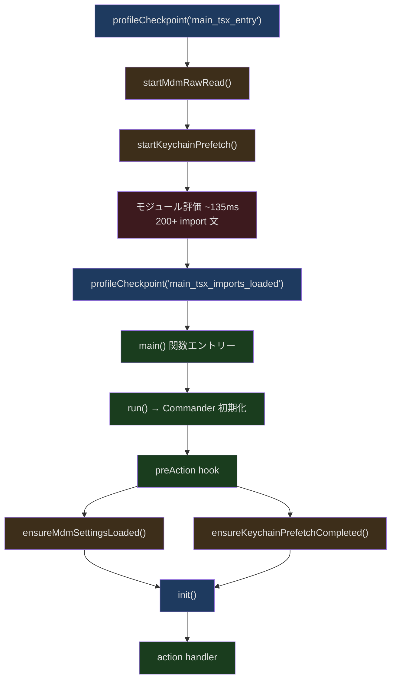
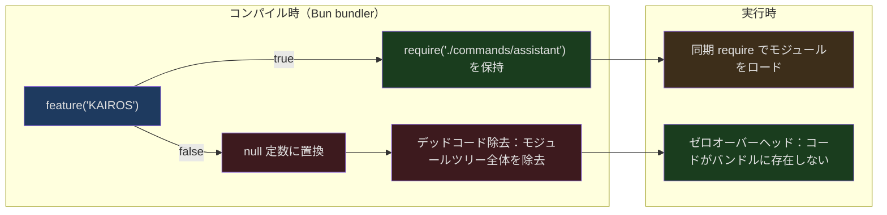

## 問題提起

Claude Code は大規模な TypeScript CLI アプリケーションです。OpenTelemetry（約 400KB）、gRPC（`@grpc/grpc-js` 経由で約 700KB）などのヘビー級モジュールに依存し、1900 以上のソースファイルを持ち、60 以上のスラッシュコマンドと 30 以上のツールを登録しています。ユーザーがターミナルで `claude` と入力して Enter を押すと、以下のことが必要です：

1. すべてのトップレベルモジュールインポートを解析・評価（evaluate）
2. 多層設定の読み込み（MDM 企業ポリシー、macOS Keychain、ユーザー設定、プロジェクト設定など）
3. テレメトリー、権限、GrowthBook フィーチャーフラグの初期化
4. MCP サーバー接続、プラグインとスキルのロード
5. セッションの復元または作成、インタラクティブ TUI のレンダリング

このプロセスを素朴に順次実行すると、コールドスタートは容易に 1 秒を超えます。しかし実際の体験では、`claude` のレスポンスはかなり高速です。どのようにしてそれを実現しているのでしょうか？

本記事では、Claude Code の起動パスを深掘りします。`main.tsx` の最初の 1 行から始まり、使用されているすべての最適化技術をレイヤーごとに解析します：並行プリフェッチ、Bun コンパイル時デッドコード除去、動的遅延ロード、パフォーマンスプロファイリングインフラ、そして循環依存を処理する遅延 require パターンです。

## main.tsx のフェーズ分割初期化

Claude Code のエントリーファイル `src/main.tsx` は起動フロー全体の「オーケストレーションセンター」です。その設計哲学は、起動を複数のフェーズに分割し、各フェーズをできるだけ並行化し、`profileCheckpoint()` で各フェーズの所要時間を精確に計測することです。

```typescript
// src/main.tsx:1-20
// These side-effects must run before all other imports:
// 1. profileCheckpoint marks entry before heavy module evaluation begins
// 2. startMdmRawRead fires MDM subprocesses (plutil/reg query) so they run in
//    parallel with the remaining ~135ms of imports below
// 3. startKeychainPrefetch fires both macOS keychain reads (OAuth + legacy API
//    key) in parallel — isRemoteManagedSettingsEligible() otherwise reads them
//    sequentially via sync spawn inside applySafeConfigEnvironmentVariables()
//    (~65ms on every macOS startup)
import { profileCheckpoint, profileReport } from './utils/startupProfiler.js';

// eslint-disable-next-line custom-rules/no-top-level-side-effects
profileCheckpoint('main_tsx_entry');
import { startMdmRawRead } from './utils/settings/mdm/rawRead.js';

// eslint-disable-next-line custom-rules/no-top-level-side-effects
startMdmRawRead();
import { ensureKeychainPrefetchCompleted, startKeychainPrefetch } from './utils/secureStorage/keychainPrefetch.js';

// eslint-disable-next-line custom-rules/no-top-level-side-effects
startKeychainPrefetch();
```

これら 3 行のトップレベル副作用（side-effects）の配置は入念に設計されており、他のすべての `import` 文の前に置かれています。JavaScript/TypeScript では、`import` 文は静的であり、モジュールはインポート時に同期的に評価（evaluate）されます。`main.tsx` には約 200 行の `import` 文があり、モジュール評価には約 135ms かかります。最初の行でタイムスタンプを記録し（`profileCheckpoint('main_tsx_entry')`）、続いて 2 つの非同期サブプロセスを即座に起動することで、これらのサブプロセスは後続の 135ms のモジュール評価と並行して実行できます。

すべての `import` が完了すると、コードは即座に記録します：

```typescript
// src/main.tsx:209
profileCheckpoint('main_tsx_imports_loaded');
```

このフェーズ分割モデルは以下の図で概括できます：



`main()` 関数自体（585 行）はすべてを行う場所ではないことに注意してください。シグナルハンドラーとセキュリティチェックを設定した後、`run()` 関数（884 行）を呼び出し、Commander インスタンスを作成して `preAction` フックで遅延初期化を行います。つまり、コマンドの実際の実行時（単に `--help` を表示するだけではない時）にのみ `init()` が実行されます：

```typescript
// src/main.tsx:905-917
// Use preAction hook to run initialization only when executing a command,
// not when displaying help. This avoids the need for env variable signaling.
program.hook('preAction', async thisCommand => {
    profileCheckpoint('preAction_start');
    // Await async subprocess loads started at module evaluation (lines 12-20).
    // Nearly free — subprocesses complete during the ~135ms of imports above.
    await Promise.all([ensureMdmSettingsLoaded(), ensureKeychainPrefetchCompleted()]);
    profileCheckpoint('preAction_after_mdm');
    await init();
    profileCheckpoint('preAction_after_init');
    // ...
});
```

`preAction` フックはまず先に起動した非同期サブプロセスを待ちます。しかし、それらは 135ms の import と並行して実行されるため、この時点ではほぼ完了しており、`await` は実質ゼロオーバーヘッドです。

## 並行プリフェッチ：startMdmRawRead() と startKeychainPrefetch()

この 2 つの関数は Claude Code の起動最適化で最も精巧な設計の 1 つです。核心的なアイデアは、**モジュール評価の同期ブロッキング中に、非同期サブプロセスを起動して時間のかかる I/O 操作を実行する**ことです。

### MDM 生データ読み取り

`startMdmRawRead()` は企業 MDM（Mobile Device Management）設定の読み取りを担当します。macOS では `plutil` サブプロセスで plist ファイルを読み取り、Windows では `reg query` でレジストリを読み取ります。

```typescript
// src/utils/settings/mdm/rawRead.ts:55-60
export function fireRawRead(): Promise<RawReadResult> {
  return (async (): Promise<RawReadResult> => {
    if (process.platform === 'darwin') {
      const plistPaths = getMacOSPlistPaths()
      const allResults = await Promise.all(
        // ... 各 plist パスに対して並行で plutil を実行
```

重要なのは、`fireRawRead()` が `Promise` を返し、モジュール評価時に即座に呼び出され、サブプロセスがバックグラウンドで実行されることです。結果はモジュールレベル変数 `rawReadPromise` にキャッシュされます：

```typescript
// src/utils/settings/mdm/rawRead.ts:30
let rawReadPromise: Promise<RawReadResult> | null = null
```

### Keychain プリフェッチ

`startKeychainPrefetch()` はさらに精密です。macOS での Keychain 読み取りにはシステムの `security` コマンドラインツールの呼び出しが必要で、1 回あたり約 32-33ms かかります。Claude Code は 2 つのエントリーを読み取る必要があります：

1. **OAuth 資格情報**（`"Claude Code-credentials"`）—— 約 32ms
2. **レガシー API キー**（`"Claude Code"`）—— 約 33ms

順次実行すると、毎回の macOS 起動で約 65ms が無駄になります。プリフェッチはこの 2 つの読み取りを並列化します：

```typescript
// src/utils/secureStorage/keychainPrefetch.ts:45-60
function spawnSecurity(serviceName: string): Promise<SpawnResult> {
  return new Promise(resolve => {
    execFile(
      'security',
      ['find-generic-password', '-a', getUsername(), '-w', '-s', serviceName],
      { encoding: 'utf-8', timeout: KEYCHAIN_PREFETCH_TIMEOUT_MS },
      (err, stdout) => {
        resolve({
          stdout: err ? null : stdout?.trim() || null,
          timedOut: Boolean(err && 'killed' in err && err.killed),
        })
      },
    )
  })
}
```

このモジュールのインポートチェーンは意図的に最小化されていることに注目してください。`child_process` と軽量な `macOsKeychainHelpers.ts` を直接インポートしており、完全な `macOsKeychainStorage.ts` はインポートしていません。ソースコードのコメントで理由が明確に説明されています：

```
// Imports stay minimal: child_process + macOsKeychainHelpers.ts (NOT
// macOsKeychainStorage.ts — that pulls in execa → human-signals →
// cross-spawn, ~58ms of synchronous module init).
```

完全な keychain ストレージモジュールをインポートすると `execa`、`human-signals`、`cross-spawn` などの依存関係が引き込まれ、同期的なモジュール初期化だけで約 58ms かかります。これではプリフェッチの意味が完全になくなります。

### 並行タイムライン

以下のタイムライン図は、「同期ブロッキング中に非同期 I/O を並行実行する」パターンを示しています：

```mermaid
gantt
    title 起動フェーズ並行タイムライン
    dateFormat X
    axisFormat %L ms

    section メインスレッド（同期）
    profileCheckpoint entry     :a1, 0, 1
    startMdmRawRead()           :a2, 1, 2
    startKeychainPrefetch()     :a3, 2, 3
    モジュール評価 200+ imports       :a4, 3, 138

    section MDM サブプロセス（非同期）
    plutil/reg query            :b1, 2, 50

    section Keychain サブプロセス（非同期）
    security OAuth              :c1, 3, 35
    security API key            :c2, 3, 36

    section preAction
    ensureMdmSettingsLoaded     :d1, 138, 140
    ensureKeychainPrefetchCompleted :d2, 138, 140
    init()                      :d3, 140, 180
```



`preAction` フェーズでこれらの Promise を await する時点では、サブプロセスはとっくに完了しています。`await` はキャッシュから結果を取り出すだけで、オーバーヘッドはほぼゼロです。これが「fire-and-forget + late-collect」パターンの真髄です。

### --bare モードの特別処理

注目すべき点として、`startKeychainPrefetch()` は `--bare` モードではスキップされます：

```typescript
// src/utils/secureStorage/keychainPrefetch.ts（概念）
if (isBareMode()) return  // --bare モードでは Keychain を読まない
```

`--bare` は極小モードで、hooks、LSP、プラグイン同期、auto-memory、バックグラウンドプリフェッチ、Keychain 読み取り、CLAUDE.md の自動発見をすべてスキップします。認証は `ANTHROPIC_API_KEY` または `--settings` で設定された `apiKeyHelper` に厳密に制限されます。これはスクリプト化と CI/CD シナリオ向けに設計されており、最速の起動速度を追求しています。

## feature() と Bun コンパイル時デッドコード除去

Claude Code はビルドとバンドリングに Bun を使用しています。Bun は `bun:bundle` という特別なモジュールを提供しており、その `feature()` 関数はコンパイル時の条件付きコンパイルを実現します。これは実行時のフィーチャースイッチではなく、ビルド時にコードが最終成果物に含まれるかどうかが決定されます。

```typescript
// src/commands.ts:59
import { feature } from 'bun:bundle';
```

### 動作原理

`feature()` はコンパイル時に `true` または `false` の定数に評価されます。Bun のビルダー（または JavaScript エンジンのデッドコード除去）が、決して実行されないブランチを除去します。つまり、有効化されていない機能は実行されないだけでなく、その**モジュールツリー全体**がロードされません。

`src/commands.ts` でこのパターンが大量に使用されています：

```typescript
// src/commands.ts:62-122
const proactive =
  feature('PROACTIVE') || feature('KAIROS')
    ? require('./commands/proactive.js').default
    : null
const briefCommand =
  feature('KAIROS') || feature('KAIROS_BRIEF')
    ? require('./commands/brief.js').default
    : null
const assistantCommand = feature('KAIROS')
  ? require('./commands/assistant/index.js').default
  : null
const bridge = feature('BRIDGE_MODE')
  ? require('./commands/bridge/index.js').default
  : null
const remoteControlServerCommand =
  feature('DAEMON') && feature('BRIDGE_MODE')
    ? require('./commands/remoteControlServer/index.js').default
    : null
const voiceCommand = feature('VOICE_MODE')
  ? require('./commands/voice/index.js').default
  : null
const forceSnip = feature('HISTORY_SNIP')
  ? require('./commands/force-snip.js').default
  : null
const workflowsCmd = feature('WORKFLOW_SCRIPTS')
  ? (require('./commands/workflows/index.js') as typeof import('./commands/workflows/index.js')).default
  : null
const webCmd = feature('CCR_REMOTE_SETUP')
  ? (require('./commands/remote-setup/index.js') as typeof import('./commands/remote-setup/index.js')).default
  : null
```

ここで `import` ではなく `require()` を使用していることに注目してください。これは意図的なものです。`import` は静的であり、外側にどのような条件を付けてもモジュール評価時に実行されます。一方 `require()` は動的であり、`feature()` が `true` を返した場合にのみ実行されます。コンパイル時に `feature()` が `false` の場合、`require()` 呼び出し全体（およびその依存ツリー）が除去されます。

### ツールシステムでの適用

同じパターンが `src/tools.ts` でもツールのロード制御に広く使用されています：

```typescript
// src/tools.ts:26-53
const SleepTool =
  feature('PROACTIVE') || feature('KAIROS')
    ? require('./tools/SleepTool/SleepTool.js').SleepTool
    : null
const cronTools = feature('AGENT_TRIGGERS')
  ? [
      require('./tools/ScheduleCronTool/CronCreateTool.js').CronCreateTool,
      require('./tools/ScheduleCronTool/CronDeleteTool.js').CronDeleteTool,
      require('./tools/ScheduleCronTool/CronListTool.js').CronListTool,
    ]
  : []
const MonitorTool = feature('MONITOR_TOOL')
  ? require('./tools/MonitorTool/MonitorTool.js').MonitorTool
  : null
const WebBrowserTool = feature('WEB_BROWSER_TOOL')
  ? require('./tools/WebBrowserTool/WebBrowserTool.js').WebBrowserTool
  : null
const SnipTool = feature('HISTORY_SNIP')
  ? require('./tools/SnipTool/SnipTool.js').SnipTool
  : null
```

### パフォーマンスへの影響分析

仮に外部リリース版で `PROACTIVE`、`KAIROS`、`BRIDGE_MODE`、`VOICE_MODE`、`WORKFLOW_SCRIPTS` などのフィーチャーフラグが有効化されていないとします。`commands.ts` だけで **16 個**の条件ロードポイントがあります。各モジュールとその依存ツリーが平均 50KB だとすると、外部ビルドではコンパイル時除去により約 800KB のモジュールロードが節約されます。これはディスクスペースとメモリの節約だけでなく、より重要なのはモジュール評価時間の節約です。

ここには重要なアーキテクチャ上の決定が反映されています：**フィーチャースイッチは実行時の判断だけでなく、コンパイル時に不要なコードを排除すべき**です。



### process.env 条件 vs feature() 条件

Claude Code には `feature()` ではなく `process.env` を使用する別のカテゴリの条件ロードもあります：

```typescript
// src/tools.ts:16-24
const REPLTool =
  process.env.USER_TYPE === 'ant'
    ? require('./tools/REPLTool/REPLTool.js').REPLTool
    : null
const SuggestBackgroundPRTool =
  process.env.USER_TYPE === 'ant'
    ? require('./tools/SuggestBackgroundPRTool/SuggestBackgroundPRTool.js')
        .SuggestBackgroundPRTool
    : null
```

`process.env.USER_TYPE` の値はコンパイル時にも Bun によってインライン化できます（ビルド設定で `define` を指定した場合）。同じデッドコード除去効果が得られます。外部リリース版では `USER_TYPE` は `"external"` に設定され、すべての `=== 'ant'` ブランチが除去されるため、内部専用ツール（REPLTool、SuggestBackgroundPRTool など）は外部成果物に含まれません。

## 動的 import() によるヘビー級モジュールの遅延ロード

`feature()` で未使用の機能モジュールを除去しても、必須だが起動時すぐには使わない大型モジュールが残ります。これらのモジュールに対して、Claude Code は動的 `import()` で遅延ロードを行います。

### OpenTelemetry の遅延ロード

`init.ts` のコメントは非常に率直です：

```typescript
// src/entrypoints/init.ts:44-46
// initializeTelemetry is loaded lazily via import() in setMeterState() to defer
// ~400KB of OpenTelemetry + protobuf modules until telemetry is actually initialized.
// gRPC exporters (~700KB via @grpc/grpc-js) are further lazy-loaded within instrumentation.ts.
```

OpenTelemetry SDK は約 400KB、gRPC は約 700KB。合計 1MB 以上のモジュールを起動時に同期ロードすると、コールドスタートが著しく遅延します。動的 `import()` により、これらのモジュールはテレメトリーの実際の初期化時にのみロードされ、`init()` 関数内で非同期に実行されるため、メインの起動パスをブロックしません。

同様に、1P イベントログも非同期で初期化されます：

```typescript
// src/entrypoints/init.ts:94-99
void Promise.all([
  import('../services/analytics/firstPartyEventLogger.js'),
  import('../services/analytics/growthbook.js'),
]).then(([fp, gb]) => {
  fp.initialize1PEventLogging()
  // ...
```

`void` プレフィックスに注目してください。この Promise は「fire-and-forget」であり、`init()` の返却をブロックしません。

### insights コマンドの遅延 shim

`src/commands.ts` には特にエレガントな遅延ロードの事例があります。`/insights` コマンドです。`insights.ts` は 113KB、3200 行の大きなファイルで、diff レンダリングと HTML 生成を含みます：

```typescript
// src/commands.ts:188-202
// insights.ts is 113KB (3200 lines, includes diffLines/html rendering). Lazy
// shim defers the heavy module until /insights is actually invoked.
const usageReport: Command = {
  type: 'prompt',
  name: 'insights',
  description: 'Generate a report analyzing your Claude Code sessions',
  contentLength: 0,
  progressMessage: 'analyzing your sessions',
  source: 'builtin',
  async getPromptForCommand(args, context) {
    const real = (await import('./commands/insights.js')).default
    if (real.type !== 'prompt') throw new Error('unreachable')
    return real.getPromptForCommand(args, context)
  },
}
```

この shim オブジェクトは本物のコマンドと同じインターフェース（type、name、description など）を持ちますが、`getPromptForCommand` メソッド内部で動的 `import()` を通じて本物のモジュールをロードします。ユーザーが実際に `/insights` と入力した時にのみ、113KB のコードがロードされます。このパターンは「登録時は軽量、呼び出し時にロード」が必要なあらゆるシナリオに一般化できます。

### setup.js の動的ロード

`setup.js` すら動的にロードされます：

```typescript
// src/main.tsx:1908-1909
const { setup } = await import('./setup.js');
```

これにより、作業ディレクトリと権限の設定が本当に必要な時にのみ setup モジュールがロードされます。

### print モードのサブコマンドスキップ

`-p/--print` モード（非対話型）では、Claude Code は 52 個のサブコマンド登録をすべてスキップします：

```typescript
// src/main.tsx:3875-3889
// -p/--print mode: skip subcommand registration. The 52 subcommands
// (mcp, auth, plugin, skill, task, config, doctor, update, etc.) are
// never dispatched in print mode — commander routes the prompt to the
// default action. The subcommand registration path was measured at ~65ms
// on baseline — mostly the isBridgeEnabled() call (25ms settings Zod parse
// + 40ms sync keychain subprocess)...
const isPrintMode = process.argv.includes('-p') || process.argv.includes('--print');
const isCcUrl = process.argv.some(a => a.startsWith('cc://') || a.startsWith('cc+unix://'));
if (isPrintMode && !isCcUrl) {
    profileCheckpoint('run_before_parse');
    await program.parseAsync(process.argv);
    profileCheckpoint('run_after_parse');
    return program;
```

単純な `process.argv.includes('-p')` チェックで、約 65ms のサブコマンド登録オーバーヘッドを節約しています。パイプで頻繁に呼び出されるスクリプトモード（`echo "fix bug" | claude -p` など）にとって、これは非常に重要です。

## profileCheckpoint() パフォーマンスプロファイリングシステム

Claude Code には完全な起動パフォーマンスプロファイリングシステムが内蔵されており、`src/utils/startupProfiler.ts` で定義されています。このシステムには 2 つのモードがあります：

1. **サンプリングログモード**：内部ユーザーの 100% + 外部ユーザーの 0.5% で各フェーズの所要時間を Statsig にレポート
2. **詳細プロファイリングモード**：`CLAUDE_CODE_PROFILE_STARTUP=1` 環境変数で有効化し、メモリスナップショットを含む完全なレポートを出力

```typescript
// src/utils/startupProfiler.ts:26-36
const DETAILED_PROFILING = isEnvTruthy(process.env.CLAUDE_CODE_PROFILE_STARTUP)
const STATSIG_SAMPLE_RATE = 0.005
const STATSIG_LOGGING_SAMPLED =
  process.env.USER_TYPE === 'ant' || Math.random() < STATSIG_SAMPLE_RATE
const SHOULD_PROFILE = DETAILED_PROFILING || STATSIG_LOGGING_SAMPLED
```

### ゼロオーバーヘッド設計

`SHOULD_PROFILE` が `false` の場合（外部ユーザーの約 99.5%）、`profileCheckpoint()` は空関数です。完全にゼロオーバーヘッドです：

```typescript
// src/utils/startupProfiler.ts:65-75
export function profileCheckpoint(name: string): void {
  if (!SHOULD_PROFILE) return

  const perf = getPerformance()
  perf.mark(name)

  // Only capture memory when detailed profiling enabled (env var)
  if (DETAILED_PROFILING) {
    memorySnapshots.push(process.memoryUsage())
  }
}
```

Node.js 組み込みの `performance.mark()` API で時間マークを行い、詳細モードでのみ `process.memoryUsage()` スナップショットを収集します（メモリ使用量の取得自体にオーバーヘッドがあるため）。

### 事前定義されたフェーズ

システムは Statsig レポート用にいくつかの重要なフェーズを事前定義しています：

```typescript
// src/utils/startupProfiler.ts:48-54
const PHASE_DEFINITIONS = {
  import_time: ['cli_entry', 'main_tsx_imports_loaded'],
  init_time: ['init_function_start', 'init_function_end'],
  settings_time: ['eagerLoadSettings_start', 'eagerLoadSettings_end'],
  total_time: ['cli_entry', 'main_after_run'],
} as const
```

これにより、チームは Statsig ダッシュボードで起動パフォーマンスの推移を監視し、リグレッションを早期に発見できます。

### チェックポイントの分布

`main.tsx` 内のすべての `profileCheckpoint()` 呼び出しを検索すると、チェックポイントが起動の各重要ノードをカバーしていることが分かります：

| チェックポイント | 位置（行番号） | 意味 |
|--------|-------------|------|
| `main_tsx_entry` | 12 | エントリー、モジュール評価前 |
| `main_tsx_imports_loaded` | 209 | すべての import 完了 |
| `main_function_start` | 586 | main() エントリー |
| `main_warning_handler_initialized` | 607 | 警告ハンドラー準備完了 |
| `run_function_start` | 885 | run() エントリー |
| `run_commander_initialized` | 903 | Commander インスタンス作成 |
| `preAction_start` | 908 | preAction フック開始 |
| `preAction_after_mdm` | 915 | MDM/Keychain 待機完了 |
| `preAction_after_init` | 917 | init() 完了 |
| `preAction_after_sinks` | 935 | ログ sink 接続 |
| `preAction_after_migrations` | 951 | データマイグレーション完了 |
| `preAction_after_remote_settings` | 959 | リモート設定ロード開始 |
| `action_handler_start` | 1007 | action ハンドラー開始 |
| `action_after_input_prompt` | 1862 | 入力プロンプト処理完了 |
| `action_tools_loaded` | 1878 | ツールロード完了 |
| `action_before_setup` | 1904 | setup() 前 |
| `action_after_setup` | 1936 | setup() 後 |
| `action_commands_loaded` | 2031 | コマンドロード完了 |
| `action_mcp_configs_loaded` | 2402 | MCP 設定ロード完了 |
| `before_connectMcp` / `after_connectMcp` | 2728/2730 | MCP 接続の所要時間 |
| `action_after_hooks` | 3766 | SessionStart hooks 完了 |
| `run_main_options_built` | 3873 | Commander オプション定義完了 |

この密なチェックポイントネットワークにより、チームはパフォーマンスリグレッションの発生源を正確に特定できます。

## 循環依存の遅延 require パターン

1900 以上のファイルを持つ大規模プロジェクトでは、循環依存はほぼ不可避です。Claude Code は遅延 `require()` 関数を使って循環を断ち切ります：

```typescript
// src/tools.ts:61-72
// Lazy require to break circular dependency: tools.ts -> TeamCreateTool/TeamDeleteTool -> ... -> tools.ts
const getTeamCreateTool = () =>
  require('./tools/TeamCreateTool/TeamCreateTool.js')
    .TeamCreateTool as typeof import('./tools/TeamCreateTool/TeamCreateTool.js').TeamCreateTool
const getTeamDeleteTool = () =>
  require('./tools/TeamDeleteTool/TeamDeleteTool.js')
    .TeamDeleteTool as typeof import('./tools/TeamDeleteTool/TeamDeleteTool.js').TeamDeleteTool
const getSendMessageTool = () =>
  require('./tools/SendMessageTool/SendMessageTool.js')
    .SendMessageTool as typeof import('./tools/SendMessageTool/SendMessageTool.js').SendMessageTool
```

`main.tsx` にも同じパターンがあります：

```typescript
// src/main.tsx:69-73
// Lazy require to avoid circular dependency: teammate.ts -> AppState.tsx -> ... -> main.tsx
const getTeammateUtils = () => require('./utils/teammate.js') as typeof import('./utils/teammate.js');
const getTeammatePromptAddendum = () => require('./utils/swarm/teammatePromptAddendum.js') as typeof import('./utils/swarm/teammatePromptAddendum.js');
const getTeammateModeSnapshot = () => require('./utils/swarm/backends/teammateModeSnapshot.js') as typeof import('./utils/swarm/backends/teammateModeSnapshot.js');
```

このパターンにはいくつかの巧みな点があります：

1. **関数ラッピング**：`const getX = () => require('...')` により、`require()` はモジュール評価時ではなく関数呼び出し時にのみ実行されます
2. **型安全性**：`as typeof import('...')` で完全な TypeScript 型推論を維持
3. **キャッシュ**：Node.js/Bun の `require()` はモジュールキャッシュを内蔵しており、`getTeamCreateTool()` を複数回呼んでもモジュールは 1 回だけロードされます

`feature()` パターンとの違いは、`feature()` はコンパイル時の決定——コードが存在するか存在しないか。遅延 `require()` は実行時の戦略——コードはバンドルに常に存在するが、初回使用時まで遅延してロードするということです。

## マルチソース設定のロード優先順位

Claude Code の設定システムは 5 つのソースをサポートしており、優先度は低い順に：

```typescript
// src/utils/settings/constants.ts:7-22
export const SETTING_SOURCES = [
  // User settings (global)
  'userSettings',

  // Project settings (shared per-directory)
  'projectSettings',

  // Local settings (gitignored)
  'localSettings',

  // Flag settings (from --settings flag)
  'flagSettings',

  // Policy settings (managed-settings.json or remote settings from API)
  'policySettings',
] as const
```

この優先チェーンは、企業ポリシー（`policySettings`）が他のすべての設定を上書きでき、コマンドラインフラグ（`flagSettings`）がプロジェクトとユーザー設定を上書きできることを意味します。

### 設定ロードのタイミング

設定ロード自体も「できるだけ早く起動、遅れて収集」のパターンに従います：

```typescript
// src/main.tsx:502-515
function eagerLoadSettings(): void {
  profileCheckpoint('eagerLoadSettings_start');
  // Parse --settings flag early to ensure settings are loaded before init()
  const settingsFile = eagerParseCliFlag('--settings');
  if (settingsFile) {
    loadSettingsFromFlag(settingsFile);
  }

  const settingSourcesArg = eagerParseCliFlag('--setting-sources');
  if (settingSourcesArg !== undefined) {
    loadSettingSourcesFromFlag(settingSourcesArg);
  }
  profileCheckpoint('eagerLoadSettings_end');
}
```

`eagerParseCliFlag()` は極小の argv パーサーで、Commander の完全なパースは使わず、`process.argv` を直接スキャンして `--settings` フラグの値を見つけます。これにより、設定が `init()` の前に利用可能になります。

リモート管理設定とポリシー制限は非同期でロードされます：

```typescript
// src/main.tsx:953-958
// Load remote managed settings for enterprise customers (non-blocking)
void loadRemoteManagedSettings();
void loadPolicyLimits();
profileCheckpoint('preAction_after_remote_settings');
```

`void` プレフィックスは再びこれらがノンブロッキングであることを示しています。リモート設定はホットリロード機構を通じて到着後に自動的に有効になります。

### コマンドリストの遅延評価とメモ化

コマンドリストの構築も同じ理念を体現しています。関数として宣言し、初回呼び出し時まで評価を遅延します：

```typescript
// src/commands.ts:257-258
// Declared as a function so that we don't run this until getCommands is called,
// since underlying functions read from config, which can't be read at module initialization time
const COMMANDS = memoize((): Command[] => [
  addDir,
  advisor,
  agents,
  // ... 60+ commands
])
```

`memoize()` によりコマンドリストは 1 回だけ構築されます。これは重要です。一部のコマンド（`login()` など）は初期化時に設定を読む必要があり、モジュール評価フェーズでリストを構築すると、設定システムがまだ準備できていないためです。

## セッション復元パス：teleport、remote、resume

Claude Code には 3 つのセッション復元モードがあり、それぞれ異なる起動パスとパフォーマンス特性を持ちます。

### --continue / --resume：ローカル復元

最もシンプルなモードです。`--continue` は現在のディレクトリの直近の会話を復元し、`--resume` はセッション ID またはインタラクティブセレクターで指定された会話を復元します：

```typescript
// src/main.tsx:3355-3363
} else if (options.resume || options.fromPr || teleport || remote !== null) {
  // Clear stale caches before resuming to ensure fresh file/skill discovery
  const { clearSessionCaches } = await import('./commands/clear/caches.js');
  clearSessionCaches();
  let messages: MessageType[] | null = null;
  let processedResume: ProcessedResume | undefined = undefined;
  let maybeSessionId = validateUuid(options.resume);
```

復元前にキャッシュをクリアすることに注目してください。これにより、復元されたセッションが最新のファイルとスキルの変更を確認できます。

### --remote：リモートセッション

`--remote` は Claude Code Web (CCR) リモートセッションを作成します：

```typescript
// src/main.tsx:3401-3440
// --remote and --teleport both create/resume Claude Code Web (CCR) sessions.
if (remote !== null || teleport) {
    await waitForPolicyLimitsToLoad();
    if (!isPolicyAllowed('allow_remote_sessions')) {
      return await exitWithError(root, "Error: Remote sessions are disabled by your organization's policy.", () => gracefulShutdown(1));
    }
}
```

リモートモードはポリシー制限のロード完了を追加で待つ必要があります（`waitForPolicyLimitsToLoad()`）。企業がリモートセッションを禁止している可能性があるためです。これはブロッキング待機が必要な数少ないケースの 1 つです。

### --teleport：クロスデバイス復元

Teleport は最も複雑な復元パスで、デバイス間のセッション復元をサポートしています。以下が必要です：

1. API からセッションデータを取得
2. Git リポジトリの一致を検証
3. 正しいブランチに切り替え
4. メッセージ履歴を処理

```typescript
// src/main.tsx:3504-3519
} else if (teleport) {
    if (teleport === true || teleport === '') {
      // インタラクティブ選択
      logEvent('tengu_teleport_interactive_mode', {});
      const teleportResult = await launchTeleportResumeWrapper(root);
      if (!teleportResult) {
        // ユーザーキャンセル
      }
      } = await checkOutTeleportedSessionBranch(teleportResult.branch);
      messages = processMessagesForTeleportResume(teleportResult.log, branchError);
    } else if (typeof teleport === 'string') {
      // セッション ID で直接復元
      const sessionData = await fetchSession(teleport);
```

Teleport のプログレス UI は動的インポートされ（`teleportWithProgress dynamically imported at call site`、187 行コメント）、teleport を使用しない場合の関連モジュールのロードを回避しています。

### 復元パスと起動 Hooks の相互作用

微妙だが重要な詳細として、復元パスは startup hooks をスキップします：

```typescript
// src/main.tsx:2602-2607
// continue/resume/teleport paths don't fire startup hooks (or fire them
// with a different trigger)
const sessionStartHooksPromise = options.continue || options.resume || teleport || setupTrigger
  ? undefined
  : processSessionStartHooks('startup');
```

これは、セッション復元時に `conversationRecovery.ts` が `'resume'` タイプの hook をトリガーし、startup hook との重複実行を回避するためです。

## setup() とコマンドロードの並列化

action handler 内で、`setup()` とコマンド/agent ロードが並列化されています：

```typescript
// src/main.tsx:1913-1934
// Parallelize setup() with commands+agents loading. setup()'s ~28ms is
// mostly startUdsMessaging (socket bind, ~20ms) — not disk-bound, so it
// doesn't contend with getCommands' file reads.
const preSetupCwd = getCwd();
// Register bundled skills/plugins before kicking getCommands()
if (process.env.CLAUDE_CODE_ENTRYPOINT !== 'local-agent') {
  initBuiltinPlugins();
  initBundledSkills();
}
const setupPromise = setup(preSetupCwd, permissionMode, ...);
const commandsPromise = worktreeEnabled ? null : getCommands(preSetupCwd);
const agentDefsPromise = worktreeEnabled ? null : getAgentDefinitionsWithOverrides(preSetupCwd);
// Suppress transient unhandledRejection if these reject during the
// ~28ms setupPromise await before Promise.all joins them below.
commandsPromise?.catch(() => {});
agentDefsPromise?.catch(() => {});
await setupPromise;
```

いくつかの注目すべき設計上の決定があります：

1. `initBuiltinPlugins()` と `initBundledSkills()` は並列起動前に同期的に実行されます。これらは純粋なインメモリ操作（1ms 未満、I/O ゼロ）ですが、`getCommands()` 内部の `getBundledSkills()` がこれらの結果を同期的に読み取ります。`setup()` 内部に配置する（以前のやり方）と、並列の `getCommands()` が空リストをメモ化してしまいます。

2. `commandsPromise?.catch(() => {})` は一過性の `unhandledRejection` を抑制します。`setupPromise` の 28ms 待機中に `commandsPromise` が例外をスローしてもまだ `await` されていない場合、Node.js はハンドルされていない rejection を報告します。空の `catch` がこの問題を解決します。

3. Worktree モードでは（`worktreeEnabled`）並列化できません。`setup()` が `process.chdir()` を行うため、コマンドと agent は chdir 後の作業ディレクトリが必要だからです。

## 移植可能なパターン：大規模 CLI コールドスタート最適化チェックリスト

Claude Code の起動最適化から、汎用的な大規模 CLI コールドスタート最適化チェックリストを抽出できます：

### 1. フェーズ分割初期化 + チェックポイントマーキング

起動プロセスを明確なフェーズに分割し、各フェーズにチェックポイントを打ち、定量的なパフォーマンスベースラインを確立します：

```
cli_entry → imports_loaded → init_start → init_end → action_start → setup → ready
```

どこが遅いかを推測するのではなく、データで語りましょう。Claude Code の `profileCheckpoint()` システムは 99.5% のケースでゼロオーバーヘッドで、サンプリングされたユーザーからのみデータを収集します。

### 2. "Fire early, collect late" 並行 I/O

起動パスの I/O 操作（ファイル読み取り、サブプロセス呼び出し、ネットワークリクエスト）を特定し、最も早いタイミングで起動し、結果が最も遅く必要になるタイミングで収集します：

```
| 操作 | 起動タイミング | 収集タイミング | 並行ウィンドウ |
|------|---------|---------|---------|
| MDM 読み取り | モジュール評価前 | preAction | ~135ms |
| Keychain 読み取り | モジュール評価前 | preAction | ~135ms |
| リモート設定 | init() 後 | ホットリロード | 無制限 |
| MCP 接続 | action handler | REPL レンダリング後 | ~500ms |
```

### 3. コンパイル時除去 > 実行時判断

特定のビルド構成で使用されないことが分かっている機能は、実行時にスキップするのではなくコンパイル時に除去します。Bun の `feature()` は 1 つの実装であり、Webpack の `DefinePlugin` + `NormalModuleReplacementPlugin` は別の実装です。重要なのは、バンドラーの tree-shaking が未使用のモジュールツリー全体を除去できるようにすることです。

### 4. 遅延 Shim パターン

登録時にメタデータが必要だが、実行時にのみ完全なコードが必要なコンポーネント（コマンド、ルート、プラグイン）に対して、軽量な shim オブジェクトを作成します：

```typescript
const heavyCommand: Command = {
  name: 'heavy',
  description: 'Does heavy work',
  async execute() {
    const real = (await import('./heavy-impl.js')).default;
    return real.execute();
  }
}
```

### 5. 遅延 require による循環依存の解消

大規模コードベースでは、リファクタリングで循環依存を根本的に解決するコストは往々にして大きすぎます。関数ラッピングの `require()` で最小限の侵入性で循環を断ち切りつつ、型安全性を維持できます：

```typescript
const getHeavyDep = () =>
  require('./heavy-dep.js') as typeof import('./heavy-dep.js');
```

### 6. モード認識型ファストパス

実行モードに応じて不要な初期化をスキップします。Claude Code は `-p/--print` モードで 52 個のサブコマンド登録をスキップし（65ms 節約）、`--bare` モードでは hooks、LSP、プラグインなどすべての非必須コンポーネントをスキップします：

```typescript
if (isPrintMode && !isCcUrl) {
  // すべてのサブコマンド登録をスキップ
  await program.parseAsync(process.argv);
  return program;
}
```

### 7. 高コスト計算のメモ化

コマンドリスト、ツールリスト、スキルリストなどは一度計算が完了したら、`lodash/memoize` で結果をキャッシュします：

```typescript
const loadAllCommands = memoize(async (cwd: string): Promise<Command[]> => {
  // ... 高コストなロードロジック
});
```

キャッシュの無効化が必要な場合（動的に新しいスキルが追加された場合など）は、明示的な `clearCache()` メソッドを提供します：

```typescript
export function clearCommandMemoizationCaches(): void {
  loadAllCommands.cache?.clear?.()
  getSkillToolCommands.cache?.clear?.()
  getSlashCommandToolSkills.cache?.clear?.()
  clearSkillIndexCache?.()
}
```

### 8. インポートチェーンの最小化

プリフェッチモジュール（`keychainPrefetch.ts` など）は最小限のインポートチェーンを維持する必要があります。プリフェッチモジュール自体が大量の依存関係を持ち込むと、プリフェッチの並行化メリットが同期的なモジュール評価オーバーヘッドで相殺されます。なぜ `execa` ではなく `child_process` を選んだのか、なぜ `storage` ではなく `helpers` をインポートしたのかを明確にコメントしましょう。

### 9. ノンブロッキングバックグラウンドタスク

クリーンアップ、同期、プリフェッチなどの非クリティカルタスクをバックグラウンドに置きます：

```typescript
// ノンブロッキング
void loadRemoteManagedSettings();
void loadPolicyLimits();

// さらに遅く起動するバックグラウンドタスク
if (!isBareMode()) {
  startDeferredPrefetches();
  void import('./utils/backgroundHousekeeping.js')
    .then(m => m.startBackgroundHousekeeping());
}
```

### 10. 可観測性ファースト

最適化の前に、まず可観測性を確立しましょう。Claude Code のアプローチは：

- Statsig へのサンプリングレポート（本番環境モニタリング）
- `CLAUDE_CODE_PROFILE_STARTUP=1` 詳細レポート（ローカルデバッグ）
- 各フェーズの所要時間とメモリ使用量
- パフォーマンスリグレッションの自動検出とレポート

計測なくして最適化なし。継続的なモニタリングなくして、最適化は新機能の追加とともに退行していきます。

## まとめ

Claude Code のコールドスタート最適化は単一の銀の弾丸ではなく、入念に設計された技術の組み合わせです：

- **並行プリフェッチ**が非同期 I/O を同期モジュール評価の背後に隠します
- **コンパイル時デッドコード除去**がビルド時に未使用の機能モジュールツリーを除去します
- **動的 import() 遅延ロード**がヘビー級モジュールのコストを初回使用まで先送りします
- **profileCheckpoint() プロファイリングシステム**がゼロオーバーヘッドのパフォーマンス可観測性を提供します
- **遅延 require パターン**が最小限の侵入性で循環依存を解決します
- **モード認識型ファストパス**が使用シナリオに応じて不要な初期化をスキップします

各技術は単独では目新しくありませんが、それらの組み合わせ——そして一貫した「まず計測、次に最適化、継続的にモニタリング」の原則——により、1900 のソースファイルを持ち OpenTelemetry や gRPC などのヘビー級ライブラリに依存する CLI アプリケーションが、高速なコールドスタート体験を実現しています。

独自の大規模 CLI やデスクトップアプリケーションを構築する開発者にとって、これらのパターンは高い移植性を持ちます。核心的なアイデアはただ 1 つです：**起動パス上のすべてのミリ秒を希少なリソースと見なし、並列化・遅延化・除去によってそれらを獲得すること**です。
