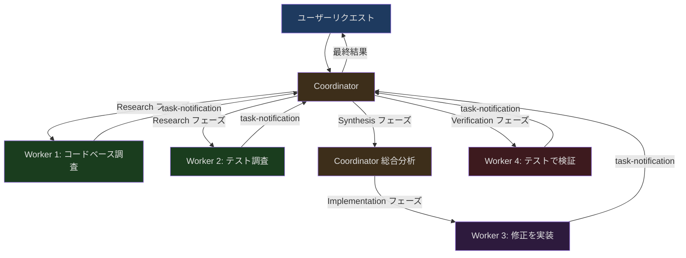
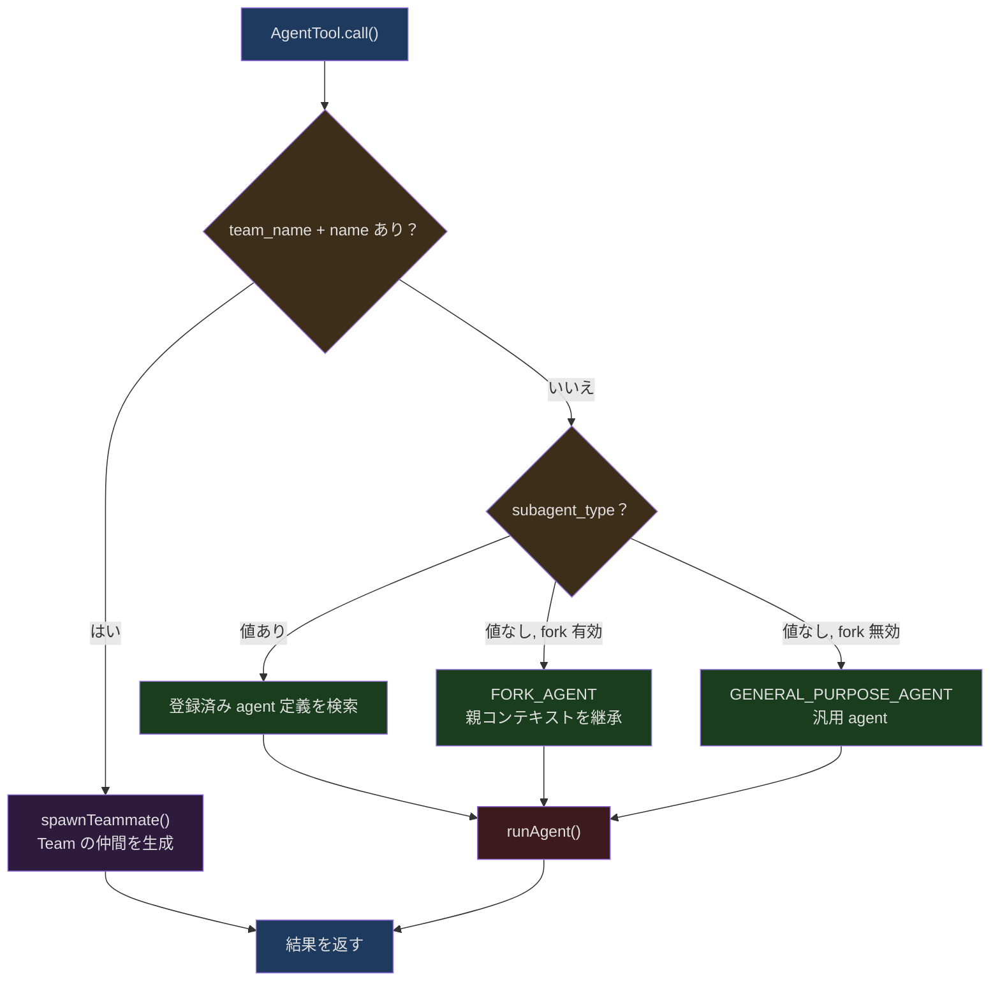
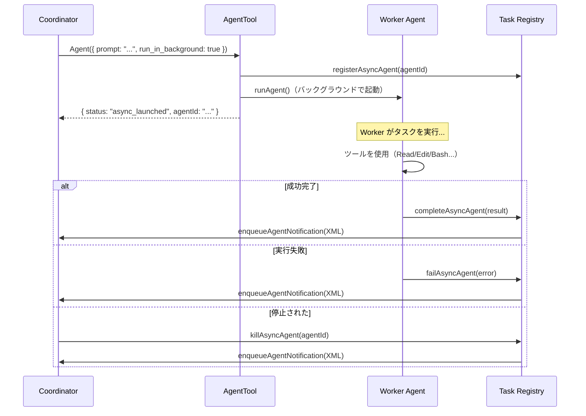
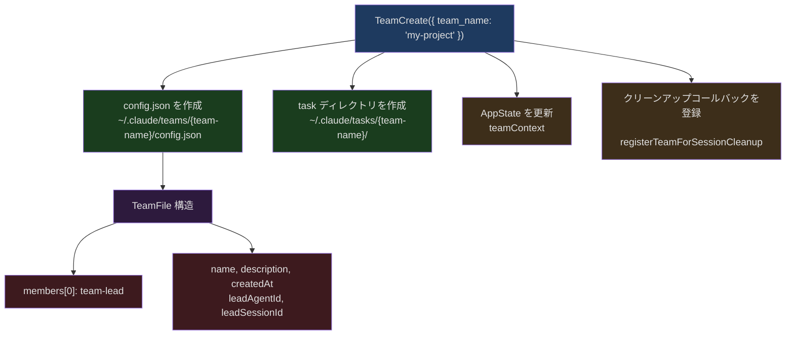
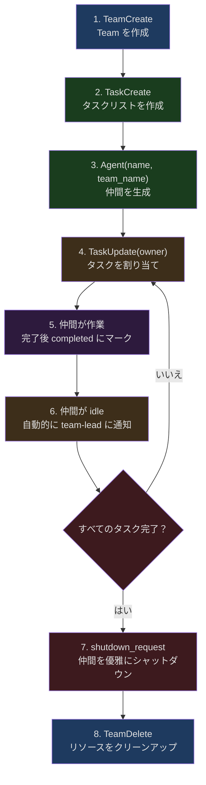

## 問題提起

1 つの AI agent では足りない場合、どうすればよいでしょうか？直感的な答えは「もっと agent を生成する」ですが、問題はそれほど単純ではありません。複数の agent はどのように分担するのか？それらの間でどのように通信するのか？コンフリクトなくコンテキストを共有するにはどうすればよいか？worker がタスクを完了したら、結果をどのようにコーディネーターに報告するのか？ある worker が間違った方向に進んだ場合、どのように適時に停止させるのか？

これらの問題の核心は、古典的な分散システム設計の課題です。ただし、ここでの「ノード」はサーバーではなく、LLM インスタンスです。Claude Code は精巧なマルチ Agent アーキテクチャでこれらの問いに答えています。そのコアパターンは **Coordinator/Worker** と呼ばれます。

本記事では、Claude Code のマルチ Agent システムを深掘りします。Coordinator パターンの全体アーキテクチャから始め、`AgentTool` の agent 生成機構、Worker の制限付きツールセット、タスク通知の XML プロトコル、`SendMessageTool` のクロス agent 通信、Scratchpad ディレクトリの永続化状態共有、バックグラウンド実行と進捗追跡、Team swarm モード、そして MCP Server の agent 間での継承と分離をレイヤーごとに解析します。

## Coordinator パターンの全体アーキテクチャ

Claude Code のマルチ Agent システムは、明確なロール分離モデルの上に構築されています。**Coordinator** はユーザーの意図を理解し、タスクを分解し、結果を統合する責任を持ちます。**Worker** は具体的な作業（調査、実装、検証）を実行する責任を持ちます。Coordinator 自身はファイルの操作やコマンドの実行を直接行いません。極少数の「管理ツール」のみを持ちます。

### ロール分離の設計哲学

この設計の背後にある哲学はシンプルです。Coordinator には「思考」に、Worker には「実行」に専念させるということです。Coordinator のツールセットは厳密に 4 つに制限されています：

```typescript
// src/constants/tools.ts:107-112
export const COORDINATOR_MODE_ALLOWED_TOOLS = new Set([
  AGENT_TOOL_NAME,        // 'Agent' — 新しい worker を生成
  TASK_STOP_TOOL_NAME,    // 'TaskStop' — 実行中の worker を停止
  SEND_MESSAGE_TOOL_NAME, // 'SendMessage' — 既存の worker にメッセージを送信
  SYNTHETIC_OUTPUT_TOOL_NAME, // 'SyntheticOutput' — 内部出力ツール
])
```

Coordinator はファイルの読み書きができず、シェルコマンドも実行できず、コード検索もできません。できることは 3 つだけです：worker の生成、worker の停止、worker へのメッセージ送信。この極端な制約により、Coordinator は純粋な「指揮官」となることが強制されます。

### Coordinator モードの有効化と検出

Coordinator モードは環境変数 `CLAUDE_CODE_COORDINATOR_MODE` で制御されます：

```typescript
// src/coordinator/coordinatorMode.ts:36-41
export function isCoordinatorMode(): boolean {
  if (feature('COORDINATOR_MODE')) {
    return isEnvTruthy(process.env.CLAUDE_CODE_COORDINATOR_MODE)
  }
  return false
}
```

ここには二重のゲートがあります。まず `COORDINATOR_MODE` のコンパイル時フィーチャーフラグが有効である必要があり（Bun の `feature()` マクロによるデッドコード除去を実現）、次に環境変数が truthy 値である必要があります。これにより、Coordinator モードをサポートしないビルドでは関連コードが完全に除去されます。

以前 Coordinator モードで実行されたセッションを復元する場合、システムは自動的にモードをマッチさせます：

```typescript
// src/coordinator/coordinatorMode.ts:49-78
export function matchSessionMode(
  sessionMode: 'coordinator' | 'normal' | undefined,
): string | undefined {
  if (!sessionMode) {
    return undefined
  }
  const currentIsCoordinator = isCoordinatorMode()
  const sessionIsCoordinator = sessionMode === 'coordinator'

  if (currentIsCoordinator === sessionIsCoordinator) {
    return undefined
  }

  // 環境変数を切り替え — isCoordinatorMode() はライブで読み取り、キャッシュなし
  if (sessionIsCoordinator) {
    process.env.CLAUDE_CODE_COORDINATOR_MODE = '1'
  } else {
    delete process.env.CLAUDE_CODE_COORDINATOR_MODE
  }

  return sessionIsCoordinator
    ? 'Entered coordinator mode to match resumed session.'
    : 'Exited coordinator mode to match resumed session.'
}
```

このコードは興味深い設計選択を示しています。モード状態はステートオブジェクトではなく `process.env` に格納されます。`isCoordinatorMode()` は大量に呼び出されるため、環境変数を直接読むことで追加のステート管理レイヤーの導入を回避しています。

### Coordinator のシステムプロンプトとタスクワークフロー

Coordinator のシステムプロンプトは、4 つのフェーズを含む完全なタスクワークフローを定義しています：



システムプロンプトで定義されている並行性ルールは非常に実用的です：

```typescript
// src/coordinator/coordinatorMode.ts:213-219 (システムプロンプト抜粋)
// Manage concurrency:
// - **Read-only tasks** (research) — run in parallel freely
// - **Write-heavy tasks** (implementation) — one at a time per set of files
// - **Verification** can sometimes run alongside implementation on different file areas
```

これはコードで強制されるものではなく、LLM 自身がこれらのルールを理解し遵守することに依存しています。これは注目に値するアーキテクチャ上の決定です。「ハードコーディングされた並行性制御」と「LLM の判断を信頼する」の間で、Claude Code は後者を選択しています。ファイルコンフリクトの状況は複雑多岐にわたり、ハードコーディングされたルールですべてのシナリオをカバーするのは困難だからです。

## AgentTool の Agent 生成機構

`AgentTool` はマルチ Agent システム全体のエントリーポイントで、すべての worker の作成はこれを通じて行われます。実装は `src/tools/AgentTool/AgentTool.tsx` にあり、コードベース全体で最も複雑なツールの 1 つです（4000 行以上）。

### 入力スキーマとモードルーティング

AgentTool の入力スキーマはコンパイル時フィーチャーフラグに基づいて動的に組み立てられます：

```typescript
// src/tools/AgentTool/AgentTool.tsx:82-101
const baseInputSchema = lazySchema(() => z.object({
  description: z.string().describe('A short (3-5 word) description of the task'),
  prompt: z.string().describe('The task for the agent to perform'),
  subagent_type: z.string().optional()
    .describe('The type of specialized agent to use for this task'),
  model: z.enum(['sonnet', 'opus', 'haiku']).optional()
    .describe("Optional model override for this agent."),
  run_in_background: z.boolean().optional()
    .describe('Set to true to run this agent in the background.')
}));

const fullInputSchema = lazySchema(() => {
  const multiAgentInputSchema = z.object({
    name: z.string().optional()
      .describe('Name for the spawned agent.'),
    team_name: z.string().optional()
      .describe('Team name for spawning.'),
    mode: permissionModeSchema().optional()
      .describe('Permission mode for spawned teammate.'),
  });
  return baseInputSchema().merge(multiAgentInputSchema).extend({
    isolation: z.enum(['worktree']).optional()
      .describe('Isolation mode. "worktree" creates a temporary git worktree.'),
    cwd: z.string().optional()
      .describe('Absolute path to run the agent in.')
  });
});
```

`lazySchema()` でラップすることで、Zod スキーマは初回使用時にのみインスタンス化されます。`isolation` フィールドの列挙値はビルドタイプによって異なることに注目してください。内部ビルドでは `'worktree' | 'remote'` をサポートし、外部ビルドでは `'worktree'` のみです。

### Agent タイプの解決とルーティング

`AgentTool.call()` が呼び出されると、まずターゲット agent のタイプを解決する必要があります。ここには 3 つのパスがあります：



重要なルーティングロジックは以下のとおりです：

```typescript
// src/tools/AgentTool/AgentTool.tsx:322-356
const effectiveType = subagent_type
  ?? (isForkSubagentEnabled() ? undefined : GENERAL_PURPOSE_AGENT.agentType);
const isForkPath = effectiveType === undefined;

let selectedAgent: AgentDefinition;
if (isForkPath) {
  // 再帰 fork 防護：fork 子プロセスは再び fork できない
  if (toolUseContext.options.querySource ===
      `agent:builtin:${FORK_AGENT.agentType}`
      || isInForkChild(toolUseContext.messages)) {
    throw new Error(
      'Fork is not available inside a forked worker.'
    );
  }
  selectedAgent = FORK_AGENT;
} else {
  const allAgents = toolUseContext.options.agentDefinitions.activeAgents;
  const agents = filterDeniedAgents(allAgents,
    appState.toolPermissionContext, AGENT_TOOL_NAME);
  const found = agents.find(agent => agent.agentType === effectiveType);
  if (!found) {
    // 「存在しない」と「権限ルールで拒否された」を区別
    const agentExistsButDenied = allAgents.find(
      agent => agent.agentType === effectiveType
    );
    if (agentExistsButDenied) {
      const denyRule = getDenyRuleForAgent(
        appState.toolPermissionContext, AGENT_TOOL_NAME, effectiveType
      );
      throw new Error(
        `Agent type '${effectiveType}' has been denied by permission rule.`
      );
    }
    throw new Error(`Agent type '${effectiveType}' not found.`);
  }
  selectedAgent = found;
}
```

ここにはいくつかの重要な設計上の詳細があります：

1. **再帰 fork 防護**：二重検出を使用しています。`querySource`（圧縮耐性あり、spawn 時に設定されるため）とメッセージスキャン（フォールバックパス）により、fork 子プロセスが無限再帰しないことを保証します。

2. **権限フィルタリング**：agent タイプは権限ルールで拒否できます（設定で `Agent(AgentName)` 構文を使用）。エラーメッセージは「存在しない」と「拒否された」の 2 つのケースを区別します。

3. **モデルオーバーライド**：Coordinator モードでは、`model` パラメータは強制的に無視されます（`undefined` に設定）。worker が実質的なタスクを完了するためにデフォルトの高能力モデルが必要だからです。

### Worker ツールセットの組み立て

Worker のツールセットは Coordinator から単純に継承されるのではなく、独立して組み立てられます：

```typescript
// src/tools/AgentTool/AgentTool.tsx:573-577
const workerPermissionContext = {
  ...appState.toolPermissionContext,
  mode: selectedAgent.permissionMode ?? 'acceptEdits'
};
const workerTools = assembleToolPool(
  workerPermissionContext, appState.mcp.tools
);
```

Worker は独自の権限モード（デフォルト `'acceptEdits'`）を取得し、グローバルツールプールから独立して利用可能なツールを組み立てます。つまり Worker のツールセットは Coordinator の制限とは完全に無関係です。Coordinator が 4 つの管理ツールしか持っていなくても、Worker は完全なファイル操作やコード検索などのツールを使用できます。

### Worktree 分離

`isolation: 'worktree'` の場合、AgentTool は一時的な git worktree を作成し、Worker がコードベースの分離されたコピー上で作業できるようにします：

```typescript
// src/tools/AgentTool/AgentTool.tsx:590-593
if (effectiveIsolation === 'worktree') {
  const slug = `agent-${earlyAgentId.slice(0, 8)}`;
  worktreeInfo = await createAgentWorktree(slug);
}
```

Worktree 分離には 2 つの重要なメリットがあります。Worker はメインのワークスペースに影響を与えることなく自由にコードを変更でき、複数の Worker が異なる worktree で同時に並行してコードを変更できます。Worker が完了した後、worktree に変更がなければ自動的にクリーンアップされます。変更がある場合は worktree パスとブランチ名が Coordinator に返されます。

## Worker の制限付きツールセット

Worker は非同期で実行されるサブ agent として、ツールセットに入念に設計された制限を受けます。これらの制限は `ASYNC_AGENT_ALLOWED_TOOLS` セットで定義されています：

```typescript
// src/constants/tools.ts:55-71
export const ASYNC_AGENT_ALLOWED_TOOLS = new Set([
  FILE_READ_TOOL_NAME,      // ファイル読み取り
  WEB_SEARCH_TOOL_NAME,     // Web 検索
  TODO_WRITE_TOOL_NAME,     // TODO 書き込み
  GREP_TOOL_NAME,           // 内容検索
  WEB_FETCH_TOOL_NAME,      // Web ページ取得
  GLOB_TOOL_NAME,           // ファイルパターンマッチ
  ...SHELL_TOOL_NAMES,      // Bash / PowerShell
  FILE_EDIT_TOOL_NAME,      // ファイル編集
  FILE_WRITE_TOOL_NAME,     // ファイル書き込み
  NOTEBOOK_EDIT_TOOL_NAME,  // Notebook 編集
  SKILL_TOOL_NAME,          // スキル呼び出し
  SYNTHETIC_OUTPUT_TOOL_NAME,
  TOOL_SEARCH_TOOL_NAME,    // ツール検索
  ENTER_WORKTREE_TOOL_NAME, // worktree に入る
  EXIT_WORKTREE_TOOL_NAME,  // worktree を出る
])
```

明示的に除外されるツールは以下のとおりです：

```typescript
// src/constants/tools.ts:36-46
export const ALL_AGENT_DISALLOWED_TOOLS = new Set([
  TASK_OUTPUT_TOOL_NAME,      // 再帰防止
  EXIT_PLAN_MODE_V2_TOOL_NAME, // Plan モードはメインスレッドの抽象化
  ENTER_PLAN_MODE_TOOL_NAME,
  AGENT_TOOL_NAME,            // agent の再帰生成を防止（ant ユーザーを除く）
  ASK_USER_QUESTION_TOOL_NAME, // 非同期 worker はユーザーに質問できない
  TASK_STOP_TOOL_NAME,        // メインスレッドのタスク状態が必要
  WORKFLOW_TOOL_NAME,         // ワークフローの再帰を防止
])
```

ツールフィルタリングの実際のロジックは `filterToolsForAgent` で実装されています：

```typescript
// src/tools/AgentTool/agentToolUtils.ts:70-116
export function filterToolsForAgent({
  tools, isBuiltIn, isAsync = false, permissionMode,
}: { tools: Tools; isBuiltIn: boolean; isAsync?: boolean;
     permissionMode?: PermissionMode }): Tools {
  return tools.filter(tool => {
    // MCP ツールは常に許可
    if (tool.name.startsWith('mcp__')) {
      return true
    }
    // Plan モードでは ExitPlanMode を許可
    if (toolMatchesName(tool, EXIT_PLAN_MODE_V2_TOOL_NAME)
        && permissionMode === 'plan') {
      return true
    }
    // グローバル禁止リスト
    if (ALL_AGENT_DISALLOWED_TOOLS.has(tool.name)) {
      return false
    }
    // カスタム agent の追加禁止リスト
    if (!isBuiltIn && CUSTOM_AGENT_DISALLOWED_TOOLS.has(tool.name)) {
      return false
    }
    // 非同期 agent のホワイトリストフィルタリング
    if (isAsync && !ASYNC_AGENT_ALLOWED_TOOLS.has(tool.name)) {
      // 特例：in-process teammate は AgentTool とタスクツールを使用可能
      if (isAgentSwarmsEnabled() && isInProcessTeammate()) {
        if (toolMatchesName(tool, AGENT_TOOL_NAME)) {
          return true
        }
        if (IN_PROCESS_TEAMMATE_ALLOWED_TOOLS.has(tool.name)) {
          return true
        }
      }
      return false
    }
    return true
  })
}
```

ここには特に興味深い階層的な設計があります。in-process teammate（Team モードの仲間）には、タスク管理ツールのセットが追加で許可されています：

```typescript
// src/constants/tools.ts:77-88
export const IN_PROCESS_TEAMMATE_ALLOWED_TOOLS = new Set([
  TASK_CREATE_TOOL_NAME,
  TASK_GET_TOOL_NAME,
  TASK_LIST_TOOL_NAME,
  TASK_UPDATE_TOOL_NAME,
  SEND_MESSAGE_TOOL_NAME,
])
```

これにより、Team の仲間はタスクの作成、タスクステータスの更新、他の仲間へのメッセージ送信が可能になります。これらはすべて swarm 協調に不可欠な機能です。

## タスク通知機構

Worker がタスクを完了すると、関数呼び出しで結果を返すのではなく、入念に設計された **XML 形式の通知** で結果を Coordinator に送信します。この通知は `user-role message` として Coordinator の会話に注入されます。

### 通知フォーマット

```xml
<task-notification>
  <task-id>{agentId}</task-id>
  <status>completed|failed|killed</status>
  <summary>{human-readable status summary}</summary>
  <result>{agent's final text response}</result>
  <usage>
    <total_tokens>N</total_tokens>
    <tool_uses>N</tool_uses>
    <duration_ms>N</duration_ms>
  </usage>
</task-notification>
```

なぜ JSON ではなく XML なのでしょうか？`<task-notification>` 開始タグが明確で LLM が認識しやすいシグナルを提供するからです。Coordinator のシステムプロンプトは「`<task-notification>` 開始タグで通知とユーザーメッセージを区別する」と明示的に指示しています。XML のタグ構造は JSON の波括弧よりも、LLM がストリーム生成中に認識・パースしやすいのです。

### 通知の注入パス

通知は `enqueueAgentNotification` を通じて Coordinator のメッセージフローに注入されます。非同期 agent のライフサイクル管理全体は `runAsyncAgentLifecycle` 関数にあります：



Worker がバックグラウンドで実行中、Coordinator はユーザーとのインタラクションを続けたり、さらに Worker を起動したりできます。通知は user-role メッセージとして到着し、Coordinator は次のターン開始時にそれらを処理します。

### One-shot 最適化

一部のビルトイン agent（`Explore` や `Plan` など）は 1 回だけ実行され、Coordinator は `SendMessage` でそれらを継続しません。これらの agent に対しては、通知から `agentId` と `SendMessage` の使用説明を省略してトークンを節約します：

```typescript
// src/tools/AgentTool/constants.ts:9-12
export const ONE_SHOT_BUILTIN_AGENT_TYPES: ReadonlySet<string> = new Set([
  'Explore',
  'Plan',
])
```

コメントによれば、この最適化は「saves ~135 chars x 34M Explore runs/week」とのこと。大規模運用では、すべてのトークンが重要です。

## SendMessageTool：クロス Agent 通信

`SendMessageTool` は Agent 間通信のコアツールです。Coordinator から Worker への後続指示だけでなく、Team モードでの仲間同士の直接通信もサポートします。

### メッセージルーティングロジック

SendMessageTool のメッセージルーティングは非常に精密で、複数のターゲットタイプを処理します：

```typescript
// src/tools/SendMessageTool/SendMessageTool.ts:67-87
const inputSchema = lazySchema(() =>
  z.object({
    to: z.string().describe(
      'Recipient: teammate name, or "*" for broadcast to all teammates'
    ),
    summary: z.string().optional().describe(
      'A 5-10 word summary shown as a preview in the UI'
    ),
    message: z.union([
      z.string().describe('Plain text message content'),
      StructuredMessage(),
    ]),
  }),
)
```

`to` フィールドには以下を指定できます：
- 仲間の名前（例：`"researcher"`）——特定の仲間に送信
- `"*"`——すべての仲間にブロードキャスト
- `"uds:/path/to.sock"`——クロスプロセス通信（Unix Domain Socket 経由）
- `"bridge:session_..."`——クロスマシン通信（Remote Control 経由）

### 既存の Worker へのメッセージ送信

Coordinator が `SendMessage` を使って完了済みまたは実行中の Worker にメッセージを送信する際、処理ロジックには 3 つの分岐があります：

```typescript
// src/tools/SendMessageTool/SendMessageTool.ts:802-873
if (typeof input.message === 'string' && input.to !== '*') {
  const appState = context.getAppState()
  const registered = appState.agentNameRegistry.get(input.to)
  const agentId = registered ?? toAgentId(input.to)

  if (agentId) {
    const task = appState.tasks[agentId]
    if (isLocalAgentTask(task) && !isMainSessionTask(task)) {
      if (task.status === 'running') {
        // Worker がまだ実行中：メッセージをキューに入れ、次のツールターンで配信
        queuePendingMessage(agentId, input.message, ...)
        return { data: {
          success: true,
          message: `Message queued for delivery to ${input.to}.`
        }}
      }
      // Worker は停止済み：自動的に再開
      const result = await resumeAgentBackground({
        agentId, prompt: input.message, ...
      })
      return { data: {
        success: true,
        message: `Agent "${input.to}" was stopped; resumed it in background.`
      }}
    }
  }
}
```

ここには 2 つの重要な動作があります：

1. **実行中の Worker**：メッセージはキューに入れられ（`queuePendingMessage`）、Worker の次のツール呼び出しターンで配信されます。Worker の現在の作業を中断することを回避します。

2. **停止済みの Worker**：Worker は自動的に再開され（`resumeAgentBackground`）、ディスク上の transcript から以前の会話コンテキストをロードし、新しいメッセージを続行プロンプトとして使用します。これにより Coordinator は同じ Worker の既存コンテキストを繰り返し活用できます。

### 構造化メッセージプロトコル

プレーンテキストメッセージに加えて、SendMessageTool は Team モードの調整操作用の構造化メッセージもサポートしています：

```typescript
// src/tools/SendMessageTool/SendMessageTool.ts:46-65
const StructuredMessage = lazySchema(() =>
  z.discriminatedUnion('type', [
    z.object({
      type: z.literal('shutdown_request'),
      reason: z.string().optional(),
    }),
    z.object({
      type: z.literal('shutdown_response'),
      request_id: z.string(),
      approve: semanticBoolean(),
      reason: z.string().optional(),
    }),
    z.object({
      type: z.literal('plan_approval_response'),
      request_id: z.string(),
      approve: semanticBoolean(),
      feedback: z.string().optional(),
    }),
  ]),
)
```

これらの構造化メッセージは 3 つの調整プロトコルを実装しています：

- **シャットダウンプロトコル**：Team lead が仲間に `shutdown_request` を送信し、仲間が `shutdown_response`（承認または拒否）で応答します。承認されたシャットダウンは仲間プロセスの `gracefulShutdown` をトリガーします。
- **計画承認プロトコル**：plan 権限モードでは、仲間は Team lead が計画を承認した後にのみ実装を実行できます。
- **ブロードキャスト**：`to: "*"` はすべての仲間にメッセージをブロードキャストし、team file 内のすべてのメンバー（送信者自身を除く）を走査します。

### Mailbox 通信モデル

Team モードのメッセージ伝達は **mailbox モデル** に基づいています。メッセージは直接プッシュされるのではなく、受信者の mailbox ファイルに書き込まれます：

```typescript
// src/tools/SendMessageTool/SendMessageTool.ts:161-170
await writeToMailbox(
  recipientName,
  {
    from: senderName,
    text: content,
    summary,
    timestamp: new Date().toISOString(),
    color: senderColor,
  },
  teamName,
)
```

この設計の利点は、送信者と受信者を完全にデカップリングしていることです。送信者は受信者がオンラインであるのを待つ必要がなく、メッセージは受信者が次に mailbox をポーリングした時に配信されます。

## Scratchpad ディレクトリ：クロス Worker の永続化状態共有

複数の Worker 間で情報を共有するにはどうすればよいでしょうか？Claude Code は **Scratchpad** と呼ばれる機構を提供しています。セッションレベルの一時ディレクトリで、すべての Worker が権限プロンプトなしで自由に読み書きできます。

### Scratchpad の場所と権限

```typescript
// src/utils/permissions/filesystem.ts:384-386
export function getScratchpadDir(): string {
  return join(getProjectTempDir(), getSessionId(), 'scratchpad')
}
```

パスフォーマットは `/tmp/claude-{uid}/{sanitized-cwd}/{sessionId}/scratchpad/` です。ディレクトリは `0o700` パーミッション（所有者のみアクセス可）で作成され、セキュリティを確保しています。

### Coordinator が Worker に Scratchpad の存在を伝える方法

Scratchpad ディレクトリの情報は、user context を通じて Coordinator のコンテキストに注入されます：

```typescript
// src/coordinator/coordinatorMode.ts:80-108
export function getCoordinatorUserContext(
  mcpClients: ReadonlyArray<{ name: string }>,
  scratchpadDir?: string,
): { [k: string]: string } {
  if (!isCoordinatorMode()) {
    return {}
  }

  let content = `Workers spawned via the ${AGENT_TOOL_NAME} tool have ` +
    `access to these tools: ${workerTools}`

  if (mcpClients.length > 0) {
    const serverNames = mcpClients.map(c => c.name).join(', ')
    content += `\n\nWorkers also have access to MCP tools from ` +
      `connected MCP servers: ${serverNames}`
  }

  if (scratchpadDir && isScratchpadGateEnabled()) {
    content += `\n\nScratchpad directory: ${scratchpadDir}\n` +
      `Workers can read and write here without permission prompts. ` +
      `Use this for durable cross-worker knowledge — ` +
      `structure files however fits the work.`
  }

  return { workerToolsContext: content }
}
```

プロンプト内のキーフレーズに注目してください：「structure files however fits the work」。システムは Scratchpad 内のファイル構造を規定せず、Coordinator と Worker がタスクの必要に応じて自由に組織できるようにしています。これは意図的な柔軟性です。

### セキュリティ：パストラバーサル防護

Scratchpad のパス検出にはパストラバーサル防護が含まれています：

```typescript
// src/utils/permissions/filesystem.ts:410-423
function isScratchpadPath(absolutePath: string): boolean {
  if (!isScratchpadEnabled()) {
    return false
  }
  const scratchpadDir = getScratchpadDir()
  // SECURITY: Normalize the path to resolve .. segments before checking
  const normalizedPath = normalize(absolutePath)
  return (
    normalizedPath === scratchpadDir ||
    normalizedPath.startsWith(scratchpadDir + sep)
  )
}
```

コメントで攻撃ベクトルが明確に警告されています。正規化しなければ、`/tmp/claude-0/proj/session/scratchpad/../../../etc/passwd` のようなパスが `startsWith` チェックを通過しますが、実際には `/etc/passwd` に書き込むことになります。`normalize()` 呼び出しが `..` セグメントを解決し、この脆弱性を塞いでいます。

## バックグラウンド実行と進捗追跡

### 同期 vs 非同期実行

AgentTool は 2 つの実行モードをサポートしています：同期（フォアグラウンド）と非同期（バックグラウンド）です。どちらのモードを使用するかを決定するロジックは複数のシグナルを総合しています：

```typescript
// src/tools/AgentTool/AgentTool.tsx:557-567
const shouldRunAsync = (
  run_in_background === true ||        // 明示的にバックグラウンド実行を要求
  selectedAgent.background === true ||   // agent 定義がバックグラウンド実行を要求
  isCoordinator ||                       // Coordinator モードではすべて非同期
  forceAsync ||                          // Fork 実験モードではすべて非同期
  assistantForceAsync ||                 // Assistant モードでは強制非同期
  (proactiveModule?.isProactiveActive() ?? false)  // プロアクティブモード
) && !isBackgroundTasksDisabled;         // グローバル無効化スイッチ
```

Coordinator モードでは、**すべて**の agent が非同期で実行されます。Coordinator のコアバリューは並行オーケストレーションにあり、Worker が同期で実行されると、Coordinator は同時に複数の Worker を起動できなくなるためです。

### 自動バックグラウンド化

Worker が一定時間（120 秒）を超えて実行されると、自動的にバックグラウンドに移行する機構もあります：

```typescript
// src/tools/AgentTool/AgentTool.tsx:72-77
function getAutoBackgroundMs(): number {
  if (isEnvTruthy(process.env.CLAUDE_AUTO_BACKGROUND_TASKS)
      || getFeatureValue_CACHED_MAY_BE_STALE(
           'tengu_auto_background_agents', false)) {
    return 120_000;
  }
  return 0;
}
```

### Agent 復元機構

停止した agent を復元する必要がある場合、`resumeAgentBackground` 関数がディスクの transcript から会話コンテキストを再構築します：

```typescript
// src/tools/AgentTool/resumeAgent.ts:42-60
export async function resumeAgentBackground({
  agentId,
  prompt,
  toolUseContext,
  canUseTool,
  invokingRequestId,
}: {
  agentId: string
  prompt: string
  toolUseContext: ToolUseContext
  canUseTool: CanUseToolFn
  invokingRequestId?: string
}): Promise<ResumeAgentResult> {
  const startTime = Date.now()
  const appState = toolUseContext.getAppState()
  const rootSetAppState =
    toolUseContext.setAppStateForTasks ?? toolUseContext.setAppState
  // ...
}
```

復元プロセスは agent の以前の transcript（すべてのツール呼び出しと結果を含む）を読み取り、メッセージ履歴を再構築し、新しいプロンプトを user message として末尾に追加します。これにより、復元された agent は以前の実行コンテキストの完全な状態を持ちます。

## runAgent：Worker の実行エンジン

`runAgent` は Worker のコア実行関数で、MCP サーバーの初期化、コンテキスト構築、クエリループの実行を担当する非同期ジェネレーターです。

### MCP Server の継承と分離

Agent 定義は独自の MCP サーバーを宣言でき、これらのサーバーは親コンテキストの MCP クライアントの**増分拡張**です：

```typescript
// src/tools/AgentTool/runAgent.ts:95-110
async function initializeAgentMcpServers(
  agentDefinition: AgentDefinition,
  parentClients: MCPServerConnection[],
): Promise<{
  clients: MCPServerConnection[]
  tools: Tools
  cleanup: () => Promise<void>
}> {
  if (!agentDefinition.mcpServers?.length) {
    return {
      clients: parentClients,  // カスタム MCP なしの場合、親クライアントをそのまま継承
      tools: [],
      cleanup: async () => {},
    }
  }
  // ...
}
```

MCP サーバーの参照には 2 つの方法があります：

1. **文字列参照**：設定済みの MCP サーバー名を参照し、メモ化された `connectToServer` で接続を共有。
2. **インライン定義**：`{ [name]: config }` 形式の新しい MCP サーバー設定。agent 終了時にクリーンアップが必要。

```typescript
// src/tools/AgentTool/runAgent.ts:135-175
for (const spec of agentDefinition.mcpServers) {
  if (typeof spec === 'string') {
    // 名前で参照——メモ化された connectToServer で接続を共有
    name = spec
    config = getMcpConfigByName(spec)
  } else {
    // インライン定義——agent 専用、終了時にクリーンアップが必要
    const [serverName, serverConfig] = Object.entries(spec)[0]!
    name = serverName
    config = { ...serverConfig, scope: 'dynamic' }
    isNewlyCreated = true
  }

  const client = await connectToServer(name, config)
  agentClients.push(client)
  if (isNewlyCreated) {
    newlyCreatedClients.push(client)
  }
}
```

重要なセキュリティ制約として、MCP が plugin-only モードにロックされている場合、**ユーザー制御の agent** の frontmatter MCP サーバーはスキップされますが、plugin、built-in、policySettings agent の MCP は影響を受けません。これらは管理者が信頼したソースだからです：

```typescript
// src/tools/AgentTool/runAgent.ts:117-127
const agentIsAdminTrusted = isSourceAdminTrusted(agentDefinition.source)
if (isRestrictedToPluginOnly('mcp') && !agentIsAdminTrusted) {
  logForDebugging(
    `[Agent: ${agentDefinition.agentType}] Skipping MCP servers: ` +
    `strictPluginOnlyCustomization locks MCP to plugin-only`
  )
  return { clients: parentClients, tools: [], cleanup: async () => {} }
}
```

クリーンアップ関数は新しく作成されたクライアントのみをクリーンアップし、共有クライアントは親コンテキストが管理します：

```typescript
// src/tools/AgentTool/runAgent.ts:197-210
const cleanup = async () => {
  for (const client of newlyCreatedClients) {
    if (client.type === 'connected') {
      try {
        await client.cleanup()
      } catch (error) {
        logForDebugging(
          `Error cleaning up MCP server '${client.name}': ${error}`
        )
      }
    }
  }
}

return {
  clients: [...parentClients, ...agentClients],  // 親 + agent 専用をマージ
  tools: agentTools,
  cleanup,
}
```

### Agent 定義とツール制御

各 agent の能力は `AgentDefinition` で制御されます。ビルトインの general-purpose agent を例に取ると：

```typescript
// src/tools/AgentTool/built-in/generalPurposeAgent.ts:25-34
export const GENERAL_PURPOSE_AGENT: BuiltInAgentDefinition = {
  agentType: 'general-purpose',
  whenToUse: 'General-purpose agent for researching complex questions...',
  tools: ['*'],          // すべての利用可能なツールを使用
  source: 'built-in',
  baseDir: 'built-in',
  // model は意図的に省略——getDefaultSubagentModel() を使用
  getSystemPrompt: getGeneralPurposeSystemPrompt,
}
```

`tools: ['*']` はすべての利用可能なツール（フィルタリング後）を使用することを意味します。カスタム agent は具体的なツールリストや disallowed リストを指定できます。`resolveAgentTools` 関数がこれらの複雑なツール解決ロジックを処理します：

```typescript
// src/tools/AgentTool/agentToolUtils.ts:122-173
export function resolveAgentTools(
  agentDefinition, availableTools, isAsync = false, isMainThread = false,
): ResolvedAgentTools {
  const filteredAvailableTools = isMainThread
    ? availableTools
    : filterToolsForAgent({
        tools: availableTools,
        isBuiltIn: source === 'built-in',
        isAsync,
        permissionMode,
      })

  // 無効化ツールセットを作成
  const disallowedToolSet = new Set(
    disallowedTools?.map(toolSpec => {
      const { toolName } = permissionRuleValueFromString(toolSpec)
      return toolName
    }) ?? [],
  )

  // フィルタリング
  const allowedAvailableTools = filteredAvailableTools.filter(
    tool => !disallowedToolSet.has(tool.name),
  )

  // ワイルドカード処理
  const hasWildcard = agentTools === undefined
    || (agentTools.length === 1 && agentTools[0] === '*')
  if (hasWildcard) {
    return {
      hasWildcard: true,
      validTools: [],
      invalidTools: [],
      resolvedTools: allowedAvailableTools,
    }
  }
  // ...
}
```

## Team システム：Swarm モード

Coordinator/Worker モードに加えて、Claude Code はよりルーズなマルチ Agent 協調方式もサポートしています。**Team（Swarm）モード**です。このモードでは、複数の agent が「仲間」として並行して作業し、共有タスクリストとメッセージシステムを通じて協調します。

### TeamCreateTool：Team の作成

```typescript
// src/tools/TeamCreateTool/TeamCreateTool.ts:37-49
const inputSchema = lazySchema(() =>
  z.strictObject({
    team_name: z.string()
      .describe('Name for the new team to create.'),
    description: z.string().optional()
      .describe('Team description/purpose.'),
    agent_type: z.string().optional()
      .describe('Type/role of the team lead.'),
  }),
)
```

Team の作成は以下のことを行います：



Team と Task List は 1:1 対応です。各 Team は独自のタスクリストディレクトリを持ち、タスク番号は 1 から始まります：

```typescript
// src/tools/TeamCreateTool/TeamCreateTool.ts:182-191
const taskListId = sanitizeName(finalTeamName)
await resetTaskList(taskListId)
await ensureTasksDir(taskListId)

// team name を登録し、getTaskListId() がそれを返すようにする
setLeaderTeamName(sanitizeName(finalTeamName))
```

### TeamFile 構造

```typescript
// src/tools/TeamCreateTool/TeamCreateTool.ts:157-175
const teamFile: TeamFile = {
  name: finalTeamName,
  description: _description,
  createdAt: Date.now(),
  leadAgentId,
  leadSessionId: getSessionId(),
  members: [
    {
      agentId: leadAgentId,
      name: TEAM_LEAD_NAME,  // 'team-lead'
      agentType: leadAgentType,
      model: leadModel,
      joinedAt: Date.now(),
      tmuxPaneId: '',
      cwd: getCwd(),
      subscriptions: [],
    },
  ],
}
```

Team lead の ID は決定論的です。`formatAgentId(TEAM_LEAD_NAME, finalTeamName)` で生成され、ランダムな UUID ではありません。これにより、他の仲間はレジストリに問い合わせることなく Team lead の ID を推論できます。

### 仲間の生成

Team モードでは、`AgentTool` に `team_name` と `name` パラメータを渡して仲間を生成します。これが `spawnTeammate()` パスをトリガーします：

```typescript
// src/tools/AgentTool/AgentTool.tsx:284-316
if (teamName && name) {
  const result = await spawnTeammate({
    name,
    prompt,
    description,
    team_name: teamName,
    use_splitpane: true,
    plan_mode_required: spawnMode === 'plan',
    model: model ?? agentDef?.model,
    agent_type: subagent_type,
    invokingRequestId: assistantMessage?.requestId
  }, toolUseContext);

  const spawnResult: TeammateSpawnedOutput = {
    status: 'teammate_spawned' as const,
    prompt,
    ...result.data
  };
  // ...
}
```

重要な制約として、**仲間は仲間を生成できません**：

```typescript
// src/tools/AgentTool/AgentTool.tsx:272-274
if (isTeammate() && teamName && name) {
  throw new Error(
    'Teammates cannot spawn other teammates — the team roster is flat.'
  );
}
```

Team のメンバーリストは**フラット**です。Team lead のみがメンバーを追加できます。これにより仲間関係の無限ネストを回避し、通信とライフサイクル管理を簡素化しています。

### TeamDeleteTool：Team のクリーンアップ

Team が完了したら、`TeamDeleteTool` がすべてのリソースをクリーンアップします：

```typescript
// src/tools/TeamDeleteTool/TeamDeleteTool.ts:71-135
async call(_input, context) {
  const appState = getAppState()
  const teamName = appState.teamContext?.teamName

  if (teamName) {
    const teamFile = readTeamFile(teamName)
    if (teamFile) {
      // 本当にアクティブなメンバーのみチェック（idle/dead をフィルタリング）
      const nonLeadMembers = teamFile.members.filter(
        m => m.name !== TEAM_LEAD_NAME
      )
      const activeMembers = nonLeadMembers.filter(
        m => m.isActive !== false
      )
      if (activeMembers.length > 0) {
        throw new Error(
          `Cannot cleanup team with ${activeMembers.length} active member(s).`
        )
      }
    }
    await cleanupTeamDirectories(teamName)
    unregisterTeamForSessionCleanup(teamName)
    clearTeammateColors()
    clearLeaderTeamName()
  }

  // AppState の team コンテキストと inbox をクリア
  setAppState(prev => ({
    ...prev,
    teamContext: undefined,
    inbox: { messages: [] },
  }))
}
```

重要なセーフティチェック：アクティブなメンバーがいる間は Team を削除できません。まず `SendMessage` の `shutdown_request` プロトコルですべての仲間を優雅に終了させる必要があります。

### Team ワークフロー

Team の完全なワークフローはシステムプロンプトで記述されているとおりです：



## Fork サブ Agent：コンテキスト継承

Coordinator/Worker と Team swarm に加えて、第 3 のマルチ Agent パターンがあります——**Fork**。Fork サブ agent は親 agent の完全な会話コンテキスト（システムプロンプトとすべての履歴メッセージを含む）を継承し、中間のツール出力を親コンテキストに保持する必要がないタスクに適しています。

```typescript
// src/tools/AgentTool/forkSubagent.ts:32-39
export function isForkSubagentEnabled(): boolean {
  if (feature('FORK_SUBAGENT')) {
    if (isCoordinatorMode()) return false     // Coordinator モードとは排他的
    if (getIsNonInteractiveSession()) return false  // 非対話型はサポートしない
    return true
  }
  return false
}
```

Fork と Coordinator モードは**排他的**です。Coordinator は既に独自のオーケストレーションモデルを持っているためです。Fork の利点は以下のとおりです：

1. **キャッシュフレンドリー**：Fork サブ agent は親 agent の完全なシステムプロンプトとツールセット（`useExactTools: true`）を使用するため、API リクエストプレフィックスが親 agent と完全に一致し、プロンプトキャッシュを再利用できます。
2. **コンテキスト継承**：プロンプトで背景を繰り返し説明する必要がありません。サブ agent は既にすべてを「知って」います。
3. **命令型プロンプト**：コンテキストが継承されているため、プロンプトは「何をするか」の指示だけでよく、「状況は何か+何をするか」の完全な説明は不要です。

## Agent の永続化メモリ

Worker agent は永続化メモリ（persistent memory）を持つことができ、学習した知識をセッション間で保存します。メモリシステムは 3 つのスコープをサポートしています：

```typescript
// src/tools/AgentTool/agentMemory.ts:13
export type AgentMemoryScope = 'user' | 'project' | 'local'
```

各スコープの保存場所は異なります：

```typescript
// src/tools/AgentTool/agentMemory.ts:52-65
export function getAgentMemoryDir(
  agentType: string, scope: AgentMemoryScope,
): string {
  const dirName = sanitizeAgentTypeForPath(agentType)
  switch (scope) {
    case 'project':
      return join(getCwd(), '.claude', 'agent-memory', dirName) + sep
    case 'local':
      return getLocalAgentMemoryDir(dirName)
    case 'user':
      return join(getMemoryBaseDir(), 'agent-memory', dirName) + sep
  }
}
```

- **user**：`~/.claude/agent-memory/{agentType}/`——プロジェクト横断の汎用知識
- **project**：`.claude/agent-memory/{agentType}/`——プロジェクト固有の知識（バージョン管理で共有可能）
- **local**：`.claude/agent-memory-local/{agentType}/`——マシン固有の知識（バージョン管理に入れない）

メモリのエントリーファイルは常に `MEMORY.md` です：

```typescript
// src/tools/AgentTool/agentMemory.ts:109-114
export function getAgentMemoryEntrypoint(
  agentType: string, scope: AgentMemoryScope,
): string {
  return join(getAgentMemoryDir(agentType, scope), 'MEMORY.md')
}
```

## 移植可能なパターン：マルチ Agent システム構築のアーキテクチャ要点

Claude Code のマルチ Agent 実装から、あらゆるマルチ Agent システムの構築に適用可能ないくつかの汎用アーキテクチャパターンを抽出できます。

### パターン 1：ロール分離とツール制約

Coordinator は管理ツールのみ、Worker は実行ツールのみを持ちます。この厳格な分離によりロールの混同を回避します。Coordinator が「ついつい」ファイルを直接修正することはなく、Worker が他の Worker をオーケストレーションしようとすることもありません。

この分離を実現する鍵は**ツールセットフィルタリング**です。agent 起動時にどのツールを使用できるかを確定し、システムプロンプトの指示には依存しません。LLM は「X ツールを使うな」という指示に従わない可能性がありますが、ツールが利用可能リストにそもそも存在しなければ、物理的に使用できません。

### パターン 2：同期待機ではなく非同期通知

Worker の結果は Coordinator をブロックして待つのではなく、非同期通知（`<task-notification>`）で返されます。これにより Coordinator は同時に複数の Worker をオーケストレーションできます。

通知フォーマットは JSON ではなく XML を使用しています。XML タグの方がストリーム処理中に LLM が認識しやすいためです。`<task-notification>` 開始タグは確定的なシグナルを提供し、LLM が Worker の結果をユーザーメッセージと混同することを防ぎます。

### パターン 3：ロックなし共有状態

Scratchpad ディレクトリはクロス Worker の状態共有を提供しますが、ロック機構はありません。実践上、これがうまく機能するのは、Coordinator が通常、同じ領域を読み書きする Worker が同時に実行されないようにするためです。

この設計はファイルロックの導入よりもはるかにシンプルで、エラーも起こりにくくなっています。デッドロックはマルチ Agent システムで特に危険です。LLM には「デッドロックを検出し回復する」能力がないからです。

### パターン 4：メッセージ信箱モデル

Team モードの mailbox 通信モデル——送信者が受信者の信箱ファイルに書き込む——は古典的な非同期メッセージパターンです。送信者と受信者の実行タイミングを完全にデカップリングし、オフラインメッセージを天然にサポートします。

### パターン 5：フラットなメンバー構造

Team のメンバーリストはフラットです。lead のみがメンバーを追加でき、仲間は仲間を生成できません。これにより組織構造の制御不能な増殖を回避し、通信トポロジーを簡素化し（任意のグラフからスター型に退化）、システムの複雑さを低減しています。

## まとめ

Claude Code のマルチ Agent システムは、実用的な分散 AI システム設計アプローチを示しています。理論的な完全性を追求するのではなく、分散トランザクションも、コンセンサスアルゴリズムも、形式検証もない代わりに、シンプルな機構で実際の問題を解決しています：

- **ロール分離**はツールセットフィルタリングで実現し、プロンプトのみに依存しない
- **タスク通知**は XML フォーマットで user-role メッセージに注入し、LLM が自然に処理
- **状態共有**はファイルシステムの Scratchpad ディレクトリで行い、ロックもプロトコルも不要
- **ライフサイクル管理**は構造化メッセージプロトコル（shutdown_request/response）で優雅なシャットダウンを実現
- **MCP 継承**はマージ+独立クリーンアップの方式で、子 agent が親 agent の能力を増分拡張

これらの設計選択に共通するのは、「十分良い」と「過剰なエンジニアリング」の間のバランスポイントを見つけていることです。AI agent システムという急速に進化する領域では、この実用的なエンジニアリング哲学が、完璧なアーキテクチャの追求よりも価値があるかもしれません。
