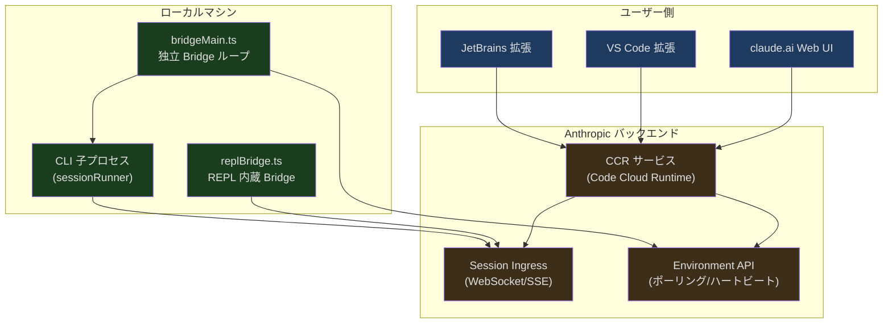
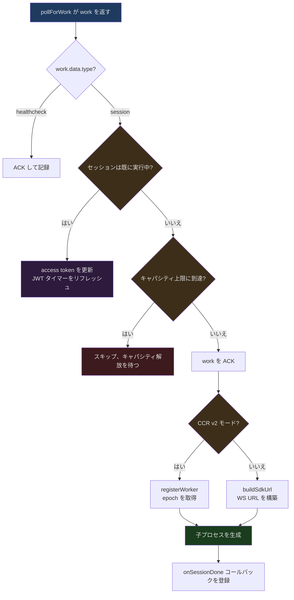
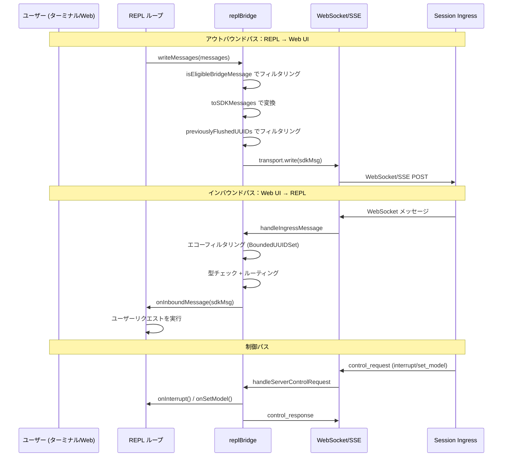

## 問題提起

Claude Code は独立したターミナルツールであると同時に、VS Code や JetBrains に組み込むこともできます。一つのプロセスが、まったく異なる二つのインタラクションインターフェースにどう対応するのでしょうか。

ターミナルで `claude` コマンドを打つと、Node.js プロセスが起動し、REPL ループを読み込み、stdin/stdout を通じてやり取りします。しかし VS Code のサイドバーで Claude アイコンをクリックしたり、claude.ai の Web ページで Remote Control セッションを開いたりするとき、背後では同じ CLI プロセスが応答しています。これは以下を意味します：

- ターミナルで実行中の Claude Code はリモートの Web UI とリアルタイムにメッセージを同期する必要がある
- Web UI 上のユーザー操作（プロンプト送信、中断、モデル切り替え）をローカル CLI プロセスに伝達する必要がある
- 権限リクエストをプロセス間・ネットワーク間で伝達し、応答を待つ必要がある
- セッションの JWT トークンを自動更新し、長時間実行タスクが認証期限切れで中断されるのを防ぐ必要がある
- ファイル添付を Web 側からダウンロードし、CLI プロセスのツールで使用できるようにする必要がある

これらすべての核心が **Bridge システム**です。CLI プロセスを「バックエンド」、IDE 拡張や Web UI を「フロントエンド」として、ポーリング、WebSocket、SSE を通じてリアルタイムのインタラクションを実現する完全な双方向通信アーキテクチャです。

## アーキテクチャ全体像

Bridge システムのアーキテクチャは一言で要約できます：**CLI プロセスが Environment として登録され、ポーリングで Work Item を取得し、WebSocket/SSE で Session Ingress と双方向通信する**。



システムには二つの実行モードがあります：

1. **独立 Bridge モード**（`bridgeMain.ts`）：`claude remote-control` コマンドで起動し、常駐プロセスとしてサーバーをポーリングし、各セッションに対して子プロセスを fork します。マルチセッション並行、worktree 隔離をサポートします。
2. **REPL 内蔵 Bridge モード**（`replBridge.ts`）：インタラクティブ REPL 実行時に自動接続し、現在のセッションを Web UI に公開して「ターミナルでコーディングしながら、スマートフォンでモニタリング」を実現します。

## bridgeMain.ts：独立 Bridge のメインループ

`bridgeMain.ts` は独立 Bridge モードの核心です。`runBridgeLoop` 関数は完全なポーリング-ディスパッチ-管理ループを実装し、環境登録、ワーク取得、セッション生成、ハートビート維持、エラーリカバリを担います。

### BackoffConfig とバックオフ戦略

ネットワーク環境では、一時的な障害は日常茶飯事です。Bridge システムは精細なバックオフ設定を定義しています：

```typescript
// src/bridge/bridgeMain.ts, 第 59-79 行
export type BackoffConfig = {
  connInitialMs: number
  connCapMs: number
  connGiveUpMs: number
  generalInitialMs: number
  generalCapMs: number
  generalGiveUpMs: number
  shutdownGraceMs?: number
  stopWorkBaseDelayMs?: number
}

const DEFAULT_BACKOFF: BackoffConfig = {
  connInitialMs: 2_000,
  connCapMs: 120_000,      // 2 分
  connGiveUpMs: 600_000,   // 10 分
  generalInitialMs: 500,
  generalCapMs: 30_000,
  generalGiveUpMs: 600_000, // 10 分
}
```

バックオフ設定は二つのカテゴリに分かれています：**接続エラー**（`conn*`）と**一般エラー**（`general*`）。接続エラーは 2 秒から開始し、上限 2 分、10 分後に諦めます。一般エラーはより速く開始（500ms）し、上限 30 秒です。`shutdownGraceMs` は SIGTERM から SIGKILL までの猶予期間（デフォルト 30 秒）を制御し、子プロセスがクリーンアップする時間を確保します。

### メインループの中核構造

`runBridgeLoop` 関数のシグネチャ自体が、システムの依存性注入設計を示しています：

```typescript
// src/bridge/bridgeMain.ts, 第 141-152 行
export async function runBridgeLoop(
  config: BridgeConfig,
  environmentId: string,
  environmentSecret: string,
  api: BridgeApiClient,
  spawner: SessionSpawner,
  logger: BridgeLogger,
  signal: AbortSignal,
  backoffConfig: BackoffConfig = DEFAULT_BACKOFF,
  initialSessionId?: string,
  getAccessToken?: () => string | undefined | Promise<string | undefined>,
): Promise<void> {
```

関数内部では多くのステート Map を保持しており、これらのデータ構造がセッション管理の核心を構成しています：

```typescript
// src/bridge/bridgeMain.ts, 第 163-194 行
const activeSessions = new Map<string, SessionHandle>()
const sessionStartTimes = new Map<string, number>()
const sessionWorkIds = new Map<string, string>()
const sessionCompatIds = new Map<string, string>()
const sessionIngressTokens = new Map<string, string>()
const sessionTimers = new Map<string, ReturnType<typeof setTimeout>>()
const completedWorkIds = new Set<string>()
const sessionWorktrees = new Map<string, {
  worktreePath: string
  worktreeBranch?: string
  gitRoot?: string
  hookBased?: boolean
}>()
const timedOutSessions = new Set<string>()
const titledSessions = new Set<string>()
```

ここで注目すべきは `sessionCompatIds` の存在です。CCR v2 のインフラ層は `cse_*` プレフィックスの ID を使用し、claude.ai フロントエンドと互換 API は `session_*` プレフィックスを使用します。両者は同じ UUID が基盤ですが、異なる API エンドポイントで異なるフォーマットが必要です。`sessionCompatIds` は spawn 時に一度計算してキャッシュし、クリーンアップとステータス更新で一貫したキーを使用します。

### ワークポーリングとディスパッチ

メインループの核心は `while (!loopSignal.aborted)` ループで、各イテレーションで `pollForWork` を通じて新しいワークアイテムがあるかクエリします：

```typescript
// src/bridge/bridgeMain.ts, 第 600-612 行
while (!loopSignal.aborted) {
  const pollConfig = getPollIntervalConfig()

  try {
    const work = await api.pollForWork(
      environmentId,
      environmentSecret,
      loopSignal,
      pollConfig.reclaim_older_than_ms,
    )
    // ... ワーク結果を処理
```

セッションタイプのワークアイテムを受信した場合、システムは一連の判断を行う必要があります：



既に実行中のセッションに対しては、プロセスを重複生成するのではなく、新しい access token を既存の子プロセスに渡します。これが JWT リフレッシュの重要なパスです。サーバーは JWT 期限切れ前にワークアイテムを再ディスパッチし、新しい `session_ingress_token` を携えます。Bridge は `existingHandle.updateAccessToken()` を通じて子プロセスに新しいトークンを注入します。

### ハートビートメカニズム

ハートビートはワークリースを維持するための鍵です。`heartbeatActiveWorkItems` 関数はすべてのアクティブセッションを走査し、サーバーにハートビートを送信します：

```typescript
// src/bridge/bridgeMain.ts, 第 202-270 行
async function heartbeatActiveWorkItems(): Promise<
  'ok' | 'auth_failed' | 'fatal' | 'failed'
> {
  let anySuccess = false
  let anyFatal = false
  const authFailedSessions: string[] = []
  for (const [sessionId] of activeSessions) {
    const workId = sessionWorkIds.get(sessionId)
    const ingressToken = sessionIngressTokens.get(sessionId)
    if (!workId || !ingressToken) continue
    try {
      await api.heartbeatWork(environmentId, workId, ingressToken)
      anySuccess = true
    } catch (err) {
      // ... エラー分類処理
      if (err.status === 401 || err.status === 403) {
        authFailedSessions.push(sessionId)
      } else {
        anyFatal = true  // 404/410 = 環境期限切れ
      }
    }
  }
  // JWT 期限切れ → サーバー側で再ディスパッチをトリガー
  for (const sessionId of authFailedSessions) {
    await api.reconnectSession(environmentId, sessionId)
  }
  // ...
}
```

ハートビートは四つのステータスを返します：`ok`（少なくとも一つ成功）、`auth_failed`（JWT 期限切れ、再接続をトリガー済み）、`fatal`（環境が存在しない）、`failed`（すべて失敗）。メインループはハートビート結果に基づいて次のステップを判断します：`auth_failed` は新しいトークンを取得するための再ポーリングをトリガーし、`fatal` は環境の再構築につながる可能性があります。

### キャパシティ管理とポーリングリズム

Bridge のポーリング頻度は固定ではなく、現在の状態に応じて動的に調整されます。`PollIntervalConfig` は複数の次元でインターバルを定義しています：

```typescript
// src/bridge/pollConfigDefaults.ts, 第 55-82 行
export const DEFAULT_POLL_CONFIG: PollIntervalConfig = {
  poll_interval_ms_not_at_capacity: 2000,       // 空きあり：2 秒
  poll_interval_ms_at_capacity: 600_000,         // 満載時：10 分
  non_exclusive_heartbeat_interval_ms: 0,        // ハートビート独立間隔（デフォルト無効）
  multisession_poll_interval_ms_not_at_capacity: 2000,
  multisession_poll_interval_ms_partial_capacity: 2000,
  multisession_poll_interval_ms_at_capacity: 600_000,
  reclaim_older_than_ms: 5000,                   // 未確認ワークの回収タイムアウト
  session_keepalive_interval_v2_ms: 120_000,     // SSE keep-alive
}
```

これらの設定は GrowthBook を通じてリアルタイムに配信され、運用チームはバージョンリリースなしにグローバルなポーリングレートを調整できます。コード内の `pollConfig.ts` は Zod schema で設定値を厳密に検証しています：

```typescript
// src/bridge/pollConfig.ts, 第 102-110 行
export function getPollIntervalConfig(): PollIntervalConfig {
  const raw = getFeatureValue_CACHED_WITH_REFRESH<unknown>(
    'tengu_bridge_poll_interval_config',
    DEFAULT_POLL_CONFIG,
    5 * 60 * 1000,  // 5 分キャッシュ更新
  )
  const parsed = pollIntervalConfigSchema().safeParse(raw)
  return parsed.success ? parsed.data : DEFAULT_POLL_CONFIG
}
```

すべてのセッションスロットが埋まると、Bridge は「満載ハートビートモード」に入ります。新しいワークのポーリングを停止し、ハートビートのみでリースを維持します。セッションが終了してスロットが解放されると、キャパシティウェイクメカニズムが即座にスリープを中断し、Bridge が再びポーリングを開始します：

```typescript
// src/bridge/bridgeMain.ts, 第 650-687 行
while (
  !loopSignal.aborted &&
  activeSessions.size >= config.maxSessions &&
  (pollDeadline === null || Date.now() < pollDeadline)
) {
  const hbConfig = getPollIntervalConfig()
  if (hbConfig.non_exclusive_heartbeat_interval_ms <= 0) break

  const cap = capacityWake.signal()
  hbResult = await heartbeatActiveWorkItems()
  if (hbResult === 'auth_failed' || hbResult === 'fatal') {
    cap.cleanup()
    break
  }
  hbCycles++
  await sleep(hbConfig.non_exclusive_heartbeat_interval_ms, cap.signal)
  cap.cleanup()
}
```

## キャパシティウェイクメカニズム

キャパシティウェイク（`capacityWake`）は精巧なシグナル統合プリミティブで、`capacityWake.ts` に定義されています：

```typescript
// src/bridge/capacityWake.ts, 第 28-56 行
export function createCapacityWake(outerSignal: AbortSignal): CapacityWake {
  let wakeController = new AbortController()

  function wake(): void {
    wakeController.abort()
    wakeController = new AbortController()
  }

  function signal(): CapacitySignal {
    const merged = new AbortController()
    const abort = (): void => merged.abort()
    if (outerSignal.aborted || wakeController.signal.aborted) {
      merged.abort()
      return { signal: merged.signal, cleanup: () => {} }
    }
    outerSignal.addEventListener('abort', abort, { once: true })
    const capSig = wakeController.signal
    capSig.addEventListener('abort', abort, { once: true })
    return {
      signal: merged.signal,
      cleanup: () => {
        outerSignal.removeEventListener('abort', abort)
        capSig.removeEventListener('abort', abort)
      },
    }
  }

  return { signal, wake }
}
```

設計思想：「満載スリープ」に入る前に `signal()` を呼び出して統合シグナルを取得します。このシグナルは三つの状況でトリガーされます：

1. 外側のループが abort（プロセス終了）
2. キャパシティコントローラが abort（`wake()` が呼ばれた）
3. スリープタイムアウトの自然満了

セッション終了時、`onSessionDone` コールバックが `capacityWake.wake()` を呼び出し、`sleep(interval, cap.signal)` で待機中のメインループを即座にウェイクアップします。`wake()` は現在のコントローラを abort するだけでなく、新しいコントローラも作成します。これにより次のループイテレーションで再びスリープ可能になります。`cleanup()` 関数はイベントリスナーを除去し、`AbortSignal` オブジェクトにリスナーが蓄積するのを防ぎます。

`replBridge.ts` と `bridgeMain.ts` はまったく同じ `createCapacityWake` プリミティブを使用しており、以前の二つの重複コードのメンテナンス負担を解消しています。

## bridgeMessaging.ts：メッセージプロトコル層

メッセージプロトコル層は Bridge システムの「翻訳者」であり、タイプ判定、インバウンドルーティング、エコー除去、制御リクエスト処理を担当します。

### タイプガードとメッセージフィルタリング

システムは異なるタイプのメッセージを区別するための厳格なタイプガードを定義しています：

```typescript
// src/bridge/bridgeMessaging.ts, 第 36-70 行
export function isSDKMessage(value: unknown): value is SDKMessage {
  return (
    value !== null &&
    typeof value === 'object' &&
    'type' in value &&
    typeof value.type === 'string'
  )
}

export function isSDKControlResponse(
  value: unknown,
): value is SDKControlResponse {
  return (
    value !== null &&
    typeof value === 'object' &&
    'type' in value &&
    value.type === 'control_response' &&
    'response' in value
  )
}

export function isSDKControlRequest(
  value: unknown,
): value is SDKControlRequest {
  return (
    value !== null &&
    typeof value === 'object' &&
    'type' in value &&
    value.type === 'control_request' &&
    'request_id' in value &&
    'request' in value
  )
}
```

すべての REPL 内部メッセージが Bridge に送信されるべきではありません。`isEligibleBridgeMessage` が正確なフィルタリングを行います：

```typescript
// src/bridge/bridgeMessaging.ts, 第 77-88 行
export function isEligibleBridgeMessage(m: Message): boolean {
  if ((m.type === 'user' || m.type === 'assistant') && m.isVirtual) {
    return false
  }
  return (
    m.type === 'user' ||
    m.type === 'assistant' ||
    (m.type === 'system' && m.subtype === 'local_command')
  )
}
```

仮想メッセージ（REPL 内部呼び出しで生成されたもの）は送信されません。Bridge/SDK の消費者が見るのは集約後の `tool_use/result` であり、中間プロセスではありません。

### インバウンドメッセージルーティングとエコー除去

`handleIngressMessage` はインバウンドメッセージの総合入口で、重要なエコー除去メカニズムを実装しています：

```typescript
// src/bridge/bridgeMessaging.ts, 第 132-208 行
export function handleIngressMessage(
  data: string,
  recentPostedUUIDs: BoundedUUIDSet,
  recentInboundUUIDs: BoundedUUIDSet,
  onInboundMessage: ((msg: SDKMessage) => void | Promise<void>) | undefined,
  onPermissionResponse?: ((response: SDKControlResponse) => void) | undefined,
  onControlRequest?: ((request: SDKControlRequest) => void) | undefined,
): void {
  try {
    const parsed: unknown = normalizeControlMessageKeys(jsonParse(data))

    // control_response は SDKMessage ではないため、先にチェック
    if (isSDKControlResponse(parsed)) {
      onPermissionResponse?.(parsed)
      return
    }

    if (isSDKControlRequest(parsed)) {
      onControlRequest?.(parsed)
      return
    }

    if (!isSDKMessage(parsed)) return

    const uuid = 'uuid' in parsed && typeof parsed.uuid === 'string'
      ? parsed.uuid : undefined

    // エコーフィルタリング：自分が送信して戻ってきたメッセージを無視
    if (uuid && recentPostedUUIDs.has(uuid)) return

    // 重複配信フィルタリング：既に処理済みのインバウンドメッセージを無視
    if (uuid && recentInboundUUIDs.has(uuid)) return

    if (parsed.type === 'user') {
      if (uuid) recentInboundUUIDs.add(uuid)
      void onInboundMessage?.(parsed)
    }
  } catch (err) {
    // パースエラーはサイレントに無視
  }
}
```

**なぜエコー除去が必要なのでしょうか。** WebSocket は双方向であるため、CLI が送信したメッセージがサーバーからブロードキャストされて戻ってくる可能性があるからです。エコー除去がなければ、一つのユーザーメッセージが CLI で二度実行されるかもしれません。システムは二つの独立した `BoundedUUIDSet` を使用しています：`recentPostedUUIDs` は自分が送信したメッセージをフィルタリングし、`recentInboundUUIDs` は重複配信されたインバウンドメッセージをフィルタリングします。

### BoundedUUIDSet：リングバッファ

エコー除去のデータ構造は単純な `Set<string>` ではなく、容量制限付きのリングバッファです：

```typescript
// src/bridge/bridgeMessaging.ts, 第 429-461 行
export class BoundedUUIDSet {
  private readonly capacity: number
  private readonly ring: (string | undefined)[]
  private readonly set = new Set<string>()
  private writeIdx = 0

  constructor(capacity: number) {
    this.capacity = capacity
    this.ring = new Array<string | undefined>(capacity)
  }

  add(uuid: string): void {
    if (this.set.has(uuid)) return
    const evicted = this.ring[this.writeIdx]
    if (evicted !== undefined) {
      this.set.delete(evicted)
    }
    this.ring[this.writeIdx] = uuid
    this.set.add(uuid)
    this.writeIdx = (this.writeIdx + 1) % this.capacity
  }

  has(uuid: string): boolean {
    return this.set.has(uuid)
  }
}
```

この設計はメモリ使用量を O(capacity) に固定します。メッセージは時間順に追加され、退去されるのは常に最も古いエントリです。デフォルト容量は 2000 で、実際のエコーウィンドウ（エコーは通常ミリ秒単位で到着）を大きく上回ります。

### サーバー側制御リクエスト処理

サーバーは CLI に制御リクエスト（初期化、モデル切り替え、中断、権限モード設定）を送信でき、CLI は 10-14 秒以内に応答する必要があります。そうしないとサーバーが WebSocket を切断します：

```typescript
// src/bridge/bridgeMessaging.ts, 第 243-391 行
export function handleServerControlRequest(
  request: SDKControlRequest,
  handlers: ServerControlRequestHandlers,
): void {
  const { transport, sessionId, outboundOnly } = handlers
  if (!transport) return

  // Outbound-only モード：すべての可変リクエストを拒否（ただし initialize は成功する必要がある）
  if (outboundOnly && request.request.subtype !== 'initialize') {
    // 偽の成功ではなくエラー応答を返す
    response = { type: 'control_response', response: {
      subtype: 'error', request_id: request.request_id,
      error: 'This session is outbound-only...'
    }}
    void transport.write(event)
    return
  }

  switch (request.request.subtype) {
    case 'initialize':
      // 最小限の機能セットを返す——REPL 自身がコマンド、モデル、アカウント情報を処理
      response = { type: 'control_response', response: {
        subtype: 'success', request_id: request.request_id,
        response: { commands: [], models: [], account: {}, pid: process.pid }
      }}
      break
    case 'set_model':
      onSetModel?.(request.request.model)
      // ... success を返す
      break
    case 'interrupt':
      onInterrupt?.()
      // ... success を返す
      break
    case 'set_permission_mode':
      // 権限モード切り替えにはポリシーチェックが必要
      const verdict = onSetPermissionMode?.(request.request.mode)
      // verdict に基づいて success または error を返す
      break
    default:
      // 未知のタイプにも応答が必要、さもないとサーバーがハングする
      response = { type: 'control_response', response: {
        subtype: 'error', request_id: request.request_id,
        error: `REPL bridge does not handle: ${request.request.subtype}`
      }}
  }

  void transport.write(event)
}
```

このコードにはいくつかの注目すべき設計があります：

1. **Outbound-only モード**：Bridge が出力ミラーリングのみを行う場合（リモート制御を受け入れない）、すべての可変リクエストはエラーを返しますが、`initialize` だけは成功を返します。サーバーは initialize 失敗時に直ちに接続を切断するからです。
2. **権限モードのセキュリティ境界**：`set_permission_mode` は `transitionPermissionMode` を直接呼び出さず、コールバックを通じて呼び出し側に判断を委ねます。`auto` モードと `bypassPermissions` モードには追加のセキュリティチェックが必要で、それらの依存関係を Bridge モジュールに持ち込むことはできません（起動時の隔離制約）。

## JWT 認証システム

Bridge の認証は短期間有効の JWT（JSON Web Token）に基づいています。各セッションの `session_ingress_token` には有効期限があり、システムは期限切れ前に能動的にリフレッシュする必要があります。

### Token デコード

`jwtUtils.ts` は署名検証なしの JWT デコードを提供します。Bridge は `exp` フィールドを読み取ってリフレッシュをスケジュールするだけで、署名検証はサーバー側で行われます：

```typescript
// src/bridge/jwtUtils.ts, 第 21-49 行
export function decodeJwtPayload(token: string): unknown | null {
  // sk-ant-si- プレフィックスを除去（Session Ingress トークン特有のプレフィックス）
  const jwt = token.startsWith('sk-ant-si-')
    ? token.slice('sk-ant-si-'.length)
    : token
  const parts = jwt.split('.')
  if (parts.length !== 3 || !parts[1]) return null
  try {
    return jsonParse(Buffer.from(parts[1], 'base64url').toString('utf8'))
  } catch {
    return null
  }
}

export function decodeJwtExpiry(token: string): number | null {
  const payload = decodeJwtPayload(token)
  if (payload !== null && typeof payload === 'object'
    && 'exp' in payload && typeof payload.exp === 'number') {
    return payload.exp
  }
  return null
}
```

### createTokenRefreshScheduler：リフレッシュスケジューラ

リフレッシュスケジューラは認証システム全体の核心です。これはファクトリ関数で、`schedule`、`scheduleFromExpiresIn`、`cancel`、`cancelAll` の四つのメソッドを返します：

```typescript
// src/bridge/jwtUtils.ts, 第 72-256 行
export function createTokenRefreshScheduler({
  getAccessToken,
  onRefresh,
  label,
  refreshBufferMs = TOKEN_REFRESH_BUFFER_MS,  // デフォルト 5 分
}: {
  getAccessToken: () => string | undefined | Promise<string | undefined>
  onRefresh: (sessionId: string, oauthToken: string) => void
  label: string
  refreshBufferMs?: number
}) {
  const timers = new Map<string, ReturnType<typeof setTimeout>>()
  const failureCounts = new Map<string, number>()
  const generations = new Map<string, number>()
```

**世代カウンター**は精巧な並行制御メカニズムです。`schedule()` や `cancel()` が呼ばれるたびに世代番号がインクリメントされます。非同期の `doRefresh()` は `await getAccessToken()` の戻り後に世代番号が変わっていないかチェックします：

```typescript
// src/bridge/jwtUtils.ts, 第 165-230 行
async function doRefresh(sessionId: string, gen: number): Promise<void> {
  let oauthToken: string | undefined
  try {
    oauthToken = await getAccessToken()
  } catch (err) { /* ... */ }

  // await 中にセッションがキャンセルまたは再スケジュールされた場合、世代番号が変わる
  if (generations.get(sessionId) !== gen) {
    logForDebugging(`... stale (gen ${gen} vs ${generations.get(sessionId)})`)
    return  // 放棄し、孤立タイマーを防止
  }

  if (!oauthToken) {
    const failures = (failureCounts.get(sessionId) ?? 0) + 1
    failureCounts.set(sessionId, failures)
    // 最大 3 回リトライ、各 60 秒間隔
    if (failures < MAX_REFRESH_FAILURES) {
      const retryTimer = setTimeout(doRefresh, REFRESH_RETRY_DELAY_MS,
        sessionId, gen)
      timers.set(sessionId, retryTimer)
    }
    return
  }

  failureCounts.delete(sessionId)
  onRefresh(sessionId, oauthToken)

  // 後続のリフレッシュをスケジュール、長期セッションの認証を継続
  const timer = setTimeout(doRefresh, FALLBACK_REFRESH_INTERVAL_MS,  // 30 分
    sessionId, gen)
  timers.set(sessionId, timer)
}
```

リフレッシュ戦略の主要パラメータ：

| 定数 | 値 | 用途 |
|------|------|------|
| `TOKEN_REFRESH_BUFFER_MS` | 5 分 | JWT 期限切れの何分前にリフレッシュをトリガーするか |
| `FALLBACK_REFRESH_INTERVAL_MS` | 30 分 | リフレッシュ成功後の後続リフレッシュ間隔 |
| `MAX_REFRESH_FAILURES` | 3 | 最大連続失敗回数 |
| `REFRESH_RETRY_DELAY_MS` | 60 秒 | 失敗後のリトライ間隔 |

`bridgeMain.ts` では、リフレッシュスケジューラがセッションタイプに応じて異なるリフレッシュ戦略を選択します：

```typescript
// src/bridge/bridgeMain.ts, 第 284-313 行
const tokenRefresh = getAccessToken
  ? createTokenRefreshScheduler({
      getAccessToken,
      onRefresh: (sessionId, oauthToken) => {
        const handle = activeSessions.get(sessionId)
        if (!handle) return
        if (v2Sessions.has(sessionId)) {
          // v2 セッション：OAuth token を直接渡せない、reconnectSession で再ディスパッチをトリガー
          void api.reconnectSession(environmentId, sessionId)
            .catch(/* ... */)
        } else {
          // v1 セッション：OAuth token を直接渡す
          handle.updateAccessToken(oauthToken)
        }
      },
      label: 'bridge',
    })
  : null
```

v1 と v2 セッションの違いは重要です：v2 は CCR の worker エンドポイントを使用し、これらは JWT の `session_id` claim を検証します。汎用の OAuth token にはこの claim が含まれないため、v2 セッションでは `reconnectSession` を通じてサーバーに新しい JWT を付けて再ディスパッチさせる必要があります。

## bridgePermissionCallbacks.ts：権限コールバックのクロスプロセス転送

Bridge モードでは、権限判断がリモート側で行われる場合があります（ユーザーが claude.ai の Web UI で「許可」や「拒否」をクリック）。権限コールバックシステムはクロスプロセス転送のインターフェースを定義しています：

```typescript
// src/bridge/bridgePermissionCallbacks.ts, 第 1-43 行
type BridgePermissionResponse = {
  behavior: 'allow' | 'deny'
  updatedInput?: Record<string, unknown>
  updatedPermissions?: PermissionUpdate[]
  message?: string
}

type BridgePermissionCallbacks = {
  sendRequest(
    requestId: string,
    toolName: string,
    input: Record<string, unknown>,
    toolUseId: string,
    description: string,
    permissionSuggestions?: PermissionUpdate[],
    blockedPath?: string,
  ): void
  sendResponse(requestId: string, response: BridgePermissionResponse): void
  cancelRequest(requestId: string): void
  onResponse(
    requestId: string,
    handler: (response: BridgePermissionResponse) => void,
  ): () => void  // unsubscribe 関数を返す
}
```

このインターフェースの設計にはいくつかの重要な考慮事項が反映されています：

1. **リクエスト-レスポンスモデル**：各権限リクエストには一意の `requestId` があり、`sendRequest` で送信し、`onResponse` で応答をサブスクライブします。`cancelRequest` は CLI 側でキャンセルした際に Web UI に通知してプロンプトを取り消すために使われます。

2. **入力の変更が可能**：`updatedInput` によりユーザーは認可時にツールパラメータを変更でき（例えばファイルパスの変更）、`updatedPermissions` により認可時に永続化ルールを同時に追加できます（「このディレクトリの読み取りを常に許可」など）。

3. **型安全な検証**：`isBridgePermissionResponse` タイプガードが `as` キャストのリスクを回避します：

```typescript
// src/bridge/bridgePermissionCallbacks.ts, 第 32-41 行
function isBridgePermissionResponse(
  value: unknown,
): value is BridgePermissionResponse {
  if (!value || typeof value !== 'object') return false
  return (
    'behavior' in value &&
    (value.behavior === 'allow' || value.behavior === 'deny')
  )
}
```

独立 Bridge モードでは、`sessionRunner.ts` が子プロセスの stdout から `control_request`（`subtype: 'can_use_tool'`）を捕捉し、サーバーに転送して、Web UI 上でのユーザーの判断を待ち、子プロセスの stdin を通じてレスポンスを返します。

## sessionRunner.ts：セッションライフサイクル

`sessionRunner.ts` は子プロセスの完全なライフサイクルを担当します：spawn、モニタリング、通信、クリーンアップ。

### 子プロセスの生成

```typescript
// src/bridge/sessionRunner.ts, 第 248-340 行
export function createSessionSpawner(deps: SessionSpawnerDeps): SessionSpawner {
  return {
    spawn(opts: SessionSpawnOpts, dir: string): SessionHandle {
      const args = [
        ...deps.scriptArgs,
        '--print',
        '--sdk-url', opts.sdkUrl,
        '--session-id', opts.sessionId,
        '--input-format', 'stream-json',
        '--output-format', 'stream-json',
        '--replay-user-messages',
        ...(deps.verbose ? ['--verbose'] : []),
        ...(debugFile ? ['--debug-file', debugFile] : []),
        ...(deps.permissionMode
          ? ['--permission-mode', deps.permissionMode] : []),
      ]

      const env: NodeJS.ProcessEnv = {
        ...deps.env,
        CLAUDE_CODE_OAUTH_TOKEN: undefined,  // 子プロセスはセッショントークンを使用
        CLAUDE_CODE_ENVIRONMENT_KIND: 'bridge',
        ...(deps.sandbox && { CLAUDE_CODE_FORCE_SANDBOX: '1' }),
        CLAUDE_CODE_SESSION_ACCESS_TOKEN: opts.accessToken,
        ...(opts.useCcrV2 && {
          CLAUDE_CODE_USE_CCR_V2: '1',
          CLAUDE_CODE_WORKER_EPOCH: String(opts.workerEpoch),
        }),
      }

      const child: ChildProcess = spawn(deps.execPath, args, {
        cwd: dir,
        stdio: ['pipe', 'pipe', 'pipe'],
        env,
        windowsHide: true,
      })
```

いくつかの重要な判断があります：

- `CLAUDE_CODE_OAUTH_TOKEN: undefined` で親プロセスの OAuth token を明示的にクリアし、子プロセスが `CLAUDE_CODE_SESSION_ACCESS_TOKEN` を使用するようにします。
- `--input-format stream-json` と `--output-format stream-json` で子プロセスを NDJSON 形式で通信させます（各行が一つの JSON オブジェクト）。
- `--replay-user-messages` で子プロセスにユーザーメッセージを再生させ、最初のメッセージテキストの抽出（タイトル推定）に使用します。
- 三つのパイプすべてが `'pipe'` モードを使用：stdin は制御指示（トークンリフレッシュ、権限レスポンス）、stdout は NDJSON パース、stderr はエラー診断用です。

### アクティビティトラッキング

子プロセスの各 stdout 出力行がアクティビティイベントとしてパースされます：

```typescript
// src/bridge/sessionRunner.ts, 第 107-200 行
function extractActivities(
  line: string, sessionId: string, onDebug: (msg: string) => void,
): SessionActivity[] {
  let parsed: unknown
  try { parsed = jsonParse(line) } catch { return [] }

  const msg = parsed as Record<string, unknown>
  const activities: SessionActivity[] = []

  switch (msg.type) {
    case 'assistant': {
      const content = (msg.message as any)?.content
      if (!Array.isArray(content)) break
      for (const block of content) {
        if (block.type === 'tool_use') {
          const summary = toolSummary(block.name, block.input ?? {})
          activities.push({ type: 'tool_start', summary, timestamp: Date.now() })
        } else if (block.type === 'text' && block.text?.length > 0) {
          activities.push({ type: 'text', summary: block.text.slice(0, 80),
            timestamp: Date.now() })
        }
      }
      break
    }
    case 'result':
      // 完了またはエラーを記録
      break
  }
  return activities
}
```

ツール名から動詞へのマッピングテーブルにより、ステータス表示がより分かりやすくなります：

```typescript
// src/bridge/sessionRunner.ts, 第 70-89 行
const TOOL_VERBS: Record<string, string> = {
  Read: 'Reading',
  Write: 'Writing',
  Edit: 'Editing',
  Bash: 'Running',
  Glob: 'Searching',
  Grep: 'Searching',
  WebFetch: 'Fetching',
  // ...
}
```

### Token ホットアップデート

子プロセスの `updateAccessToken` メソッドは stdin を通じて新しいトークンを注入し、子プロセスの再起動を不要にします：

```typescript
// src/bridge/sessionRunner.ts, 第 527-543 行
updateAccessToken(token: string): void {
  handle.accessToken = token
  handle.writeStdin(
    jsonStringify({
      type: 'update_environment_variables',
      variables: { CLAUDE_CODE_SESSION_ACCESS_TOKEN: token },
    }) + '\n',
  )
}
```

子プロセスの `StructuredIO` ハンドラは `update_environment_variables` メッセージを受信すると、直接 `process.env` を変更し、次回の `getSessionIngressAuthToken()` 呼び出しで自動的に新しいトークンが使用されます。

## replBridge.ts：REPL セッションの Bridge 公開

独立 Bridge とは異なり、REPL 内蔵 Bridge は子プロセスを生成しません。直接 Session Ingress に接続し、現在の REPL のメッセージストリームを Web UI と双方向同期します。

### initBridgeCore：起動フロー

`initBridgeCore` は REPL Bridge のコア初期化関数です。依存性注入を通じてすべての外部依存を受け取ります：

```typescript
// src/bridge/replBridge.ts, 第 260-296 行
export async function initBridgeCore(
  params: BridgeCoreParams,
): Promise<BridgeCoreHandle | null> {
  const {
    dir, machineName, branch, gitRepoUrl, title,
    baseUrl, sessionIngressUrl, workerType,
    getAccessToken, createSession, archiveSession,
    toSDKMessages, onAuth401,
    getPollIntervalConfig, initialHistoryCap,
    initialMessages, previouslyFlushedUUIDs,
    onInboundMessage, onPermissionResponse,
    onInterrupt, onSetModel, onSetPermissionMode,
    onStateChange, onUserMessage,
    perpetual, initialSSESequenceNum,
  } = params
```

初期化フローには複数のステップがあります：

1. **クラッシュリカバリポインタのチェック**：`bridgePointer` ファイルを読み取り、以前のセッション状態が存在し perpetual モードの場合、リカバリを試みます。
2. **環境の登録**：`registerBridgeEnvironment` を呼び出してサーバーに登録します。
3. **セッションの作成またはリカバリ**：perpetual モードでは `reconnectSession` を試み、そうでなければ新規セッションを作成します。
4. **クラッシュリカバリポインタの書き込み**：kill -9 後のリカバリ用に現在の状態を保存します。
5. **ポーリングループの開始**：サーバーがワークアイテムをディスパッチするのを待ちます（ユーザーが Web UI でメッセージ送信）。

### 環境再構築戦略

ポーリングが 404 を返した場合（環境がサーバー側で回収された）、システムは環境再構築フローを開始し、二つの戦略を試みます：

```typescript
// src/bridge/replBridge.ts, 第 605-800 行
async function doReconnect(): Promise<boolean> {
  environmentRecreations++
  v2Generation++  // 進行中の v2 ハンドシェイクを無効化

  // 戦略 1：インプレース再接続
  // 元の environmentId で再登録し、サーバーが同じ ID を返した場合、
  // reconnectSession で既存セッションを再キューイング
  bridgeConfig.reuseEnvironmentId = requestedEnvId
  const reg = await api.registerBridgeEnvironment(bridgeConfig)
  environmentId = reg.environment_id

  if (await tryReconnectInPlace(requestedEnvId, currentSessionId)) {
    return true  // セッション URL は変わらず、ユーザーは気付かない
  }

  // 戦略 2：新規セッション
  // 旧セッションをアーカイブし、新しく登録された環境で新規セッションを作成
  await archiveSession(currentSessionId)
  const newSessionId = await createSession({ environmentId, ... })
  currentSessionId = newSessionId
  // SSE シーケンス番号をリセット——新セッションのイベントストリームは 1 から開始
  lastTransportSequenceNum = 0
  return true
}
```

戦略 1 は「シームレスリカバリ」です。ユーザーがスマートフォンで見ている URL は変わらず、セッション状態（`previouslyFlushedUUIDs` を含む）は保持され、履歴メッセージの再送信はありません。戦略 2 は「デグレードリカバリ」です。旧セッションがアーカイブされ、新セッションが作成されますが、コンテキストが失われる可能性があります。

並行再構築は promise ガードで実装されています：

```typescript
// src/bridge/replBridge.ts, 第 605-615 行
async function reconnectEnvironmentWithSession(): Promise<boolean> {
  if (reconnectPromise) {
    return reconnectPromise  // 同一の再接続試行を共有
  }
  reconnectPromise = doReconnect()
  try {
    return await reconnectPromise
  } finally {
    reconnectPromise = null
  }
}
```

### メッセージの双方向同期

REPL Bridge のメッセージフローは以下の図の通りです：



## Inbound Attachments：Web から CLI へのファイル転送

ユーザーが claude.ai でファイルや画像をアップロードすると、これらの添付ファイルはローカル CLI プロセスに転送される必要があります。`inboundAttachments.ts` がこのフローを実装しています：

```typescript
// src/bridge/inboundAttachments.ts, 第 68-117 行
async function resolveOne(att: InboundAttachment): Promise<string | undefined> {
  const token = getBridgeAccessToken()
  if (!token) return undefined

  let data: Buffer
  try {
    const url = `${getBridgeBaseUrl()}/api/oauth/files/` +
      `${encodeURIComponent(att.file_uuid)}/content`
    const response = await axios.get(url, {
      headers: { Authorization: `Bearer ${token}` },
      responseType: 'arraybuffer',
      timeout: DOWNLOAD_TIMEOUT_MS,  // 30 秒
      validateStatus: () => true,
    })
    if (response.status !== 200) return undefined
    data = Buffer.from(response.data)
  } catch (e) {
    return undefined
  }

  // UUID プレフィックスでファイル名の衝突を防止
  const safeName = sanitizeFileName(att.file_name)
  const prefix = (att.file_uuid.slice(0, 8) || randomUUID().slice(0, 8))
    .replace(/[^a-zA-Z0-9_-]/g, '_')
  const dir = uploadsDir()  // ~/.claude/uploads/{sessionId}/
  const outPath = join(dir, `${prefix}-${safeName}`)

  await mkdir(dir, { recursive: true })
  await writeFile(outPath, data)
  return outPath
}
```

フローは：
1. Web composer がファイルを Anthropic サーバーにアップロードし、`file_uuid` を取得
2. ユーザーメッセージに `file_attachments` 配列が含まれる
3. CLI がインバウンドメッセージを受信後、OAuth token で `/api/oauth/files/{uuid}/content` からファイルをダウンロード
4. `~/.claude/uploads/{sessionId}/` ディレクトリに書き込み
5. メッセージテキストに `@"filepath"` 参照プレフィックスを追加

`prependPathRefs` はマルチブロックコンテンツの場合を特別に処理します。参照は**最後の**テキストブロックに追加されます。`processUserInputBase` が `processedBlocks` の末尾から `inputString` を読み取るためです：

```typescript
// src/bridge/inboundAttachments.ts, 第 142-161 行
export function prependPathRefs(
  content: string | Array<ContentBlockParam>,
  prefix: string,
): string | Array<ContentBlockParam> {
  if (!prefix) return content
  if (typeof content === 'string') return prefix + content
  // 最後のテキストブロックを見つける
  const i = content.findLastIndex(b => b.type === 'text')
  if (i !== -1) {
    const b = content[i]!
    if (b.type === 'text') {
      return [
        ...content.slice(0, i),
        { ...b, text: prefix + b.text },
        ...content.slice(i + 1),
      ]
    }
  }
  return [...content, { type: 'text', text: prefix.trimEnd() }]
}
```

これは優雅なフォールトトレランス設計です。ファイル名は `sanitizeFileName` でパストラバーサル攻撃を防止し、引用符でパスを囲んでスペースによるパースエラーを防ぎ（`@"path"` であって `@path` ではない）、すべてのネットワークおよび IO 操作は best-effort で、失敗時は添付ファイルをスキップするだけでメッセージ処理は中断しません。

## BRIDGE_MODE Feature Flag

Bridge システムへのエントリはコンパイル時の feature flag で制御されます。`bridgeEnabled.ts` が多層のゲートを定義しています：

```typescript
// src/bridge/bridgeEnabled.ts, 第 28-36 行
export function isBridgeEnabled(): boolean {
  return feature('BRIDGE_MODE')
    ? isClaudeAISubscriber() &&
        getFeatureValue_CACHED_MAY_BE_STALE('tengu_ccr_bridge', false)
    : false
}
```

ここで `feature('BRIDGE_MODE')` はコンパイル時定数です。外部ビルドでは、三項演算式全体の true 分岐がデッドコード除去で削除され、GrowthBook の文字列リテラルも含まれます。これにより：

- **外部ビルド**：Bridge コードが完全に存在しない
- **内部ビルド**：二つのランタイム条件を満たす必要がある
  - `isClaudeAISubscriber()` —— Bedrock/Vertex/Foundry および API キーユーザーを除外
  - GrowthBook `tengu_ccr_bridge` ゲート —— 段階的グレーリリース

ブロッキング版の `isBridgeEnabledBlocking` はエントリゲート（`claude remote-control` コマンド）に使用し、ノンブロッキング版は UI レンダリング（サイドバーに Remote Control ボタンを表示するかどうか）に使用します。

より高度なゲートにはバージョンチェックも含まれます：

```typescript
// src/bridge/bridgeEnabled.ts, 第 160-173 行
export function checkBridgeMinVersion(): string | null {
  if (feature('BRIDGE_MODE')) {
    const config = getDynamicConfig_CACHED_MAY_BE_STALE<{
      minVersion: string
    }>('tengu_bridge_min_version', { minVersion: '0.0.0' })
    if (config.minVersion && lt(MACRO.VERSION, config.minVersion)) {
      return `Your version of Claude Code (${MACRO.VERSION}) is too old...`
    }
  }
  return null
}
```

これにより運用チームは新バージョンをリリースせずにユーザーにアップデートを強制できます。GrowthBook で `tengu_bridge_min_version` を上げるだけです。

## Perpetual モード（永続モード）

通常モードでは、Bridge セッションはプロセス終了とともに終了します。Perpetual モードではセッションがプロセスをまたいで存続でき、CLI を終了して再起動しても同じ Web 側のセッションを引き継げます。

実装は `bridgePointer`（ディスクに書き込まれるステートポインタ）に依存しています：

```typescript
// src/bridge/replBridge.ts, 第 302-312 行
// Perpetual モード：クラッシュリカバリポインタを読み取り
const rawPrior = perpetual ? await readBridgePointer(dir) : null
const prior = rawPrior?.source === 'repl' ? rawPrior : null
```

ポインタには `sessionId`、`environmentId`、`source`（REPL と standalone を区別）が含まれます。CLI 再起動時：

1. ポインタファイルを読み取り
2. `reuseEnvironmentId` で環境を登録（冪等操作）
3. 登録が同じ `environmentId` を返した場合、`reconnectSession` で再キューイング
4. 環境が期限切れの場合（異なる ID が返る）、新規セッション作成にデグレード

重要な詳細：perpetual モードでのセッションリカバリ時、`initialMessages` は送信済みとしてマーク（`previouslyFlushedUUIDs` に追加）され、サーバーが重複メッセージを受信して WebSocket を切断するのを防ぎます。同時に `lastTransportSequenceNum` は前回保存した値から復元され、SSE 接続が断点から再開し、全履歴を再送しないようにします。

## SpawnMode：マルチセッション管理戦略

独立 Bridge は三つの生成モードをサポートし、`BridgeConfig.spawnMode` で制御されます：

```typescript
// src/bridge/types.ts, 第 64-69 行
export type SpawnMode = 'single-session' | 'worktree' | 'same-dir'
```

| モード | 動作 | 適用シナリオ |
|------|------|----------|
| `single-session` | 一つのセッション終了後に Bridge が終了 | デフォルト動作、`claude remote-control` |
| `worktree` | 各セッションに独立した git worktree を作成 | 並行マルチセッション、相互干渉なし |
| `same-dir` | すべてのセッションが作業ディレクトリを共有 | マルチセッションだがファイル隔離不要 |

`worktree` モードでは spawn 時に `createAgentWorktree` を呼び出します：

```typescript
// src/bridge/bridgeMain.ts, 第 977-993 行
if (spawnModeAtDecision === 'worktree' &&
  (initialSessionId === undefined ||
   !sameSessionId(sessionId, initialSessionId))) {
  const wt = await createAgentWorktree(
    `bridge-${safeFilenameId(sessionId)}`)
  sessionWorktrees.set(sessionId, {
    worktreePath: wt.worktreePath,
    worktreeBranch: wt.worktreeBranch,
    gitRoot: wt.gitRoot,
    hookBased: wt.hookBased,
  })
  sessionDir = wt.worktreePath
}
```

セッション終了後、`onSessionDone` が自動的に worktree をクリーンアップします：

```typescript
// src/bridge/bridgeMain.ts, 第 537-551 行
const wt = sessionWorktrees.get(sessionId)
if (wt) {
  sessionWorktrees.delete(sessionId)
  trackCleanup(
    removeAgentWorktree(
      wt.worktreePath, wt.worktreeBranch, wt.gitRoot, wt.hookBased
    ).catch((err) =>
      logger.logVerbose(`Failed to remove worktree: ${errorMessage(err)}`)
    ),
  )
}
```

`trackCleanup` の使用に注意してください。すべてのクリーンアップ操作の Promise がトラッキングされ、shutdown シーケンスでそれらの完了を `await` してから `process.exit()` します。孤立した worktree が残ることを防ぎます。

## システムスリープ検出

長時間実行される Bridge はシステムの休止/復帰イベントを処理する必要があります。ノートパソコンの蓋を閉じると、`setTimeout` と `setInterval` のタイマーが一時停止し、復帰時に大量の蓄積されたコールバックがトリガーされる可能性があります。Bridge はシンプルで効果的な検出方法を使用しています：

```typescript
// src/bridge/bridgeMain.ts, 第 107-109 行
function pollSleepDetectionThresholdMs(backoff: BackoffConfig): number {
  return backoff.connCapMs * 2  // 接続バックオフ上限の 2 倍
}
```

二つのポーリング間の実際の間隔が `connCapMs * 2`（デフォルト 4 分）を超えた場合、システム休止が発生したと判定します。この場合、エラーカウンターをリセットします。以前のタイムアウトは本当のネットワークエラーではなく、システム休止による見かけ上のものだからです。

## 設計のまとめ

Bridge システムのアーキテクチャは、いくつかの核心的な設計原則を体現しています：

**1. 依存性注入と起動時隔離**。`initBridgeCore` は `commands.ts`、`config.ts`、React コンポーネントをインポートしません。これらすべての依存はパラメータ経由で注入されます。これにより Agent SDK や Daemon が REPL の完全な依存ツリー（約 1300 モジュール）を引き込むことなくコアロジックを再利用できます。

**2. Best-effort デグレード**。添付ファイルのダウンロード失敗はメッセージ処理をブロックしません。環境再構築の失敗はプロセスをクラッシュさせません。トークンリフレッシュの失敗には上限付きのリトライがあります。各操作に明確なデグレードパスがあります。

**3. 冪等性と重複排除**。環境登録は冪等（`reuseEnvironmentId`）です。メッセージ送信は `BoundedUUIDSet` で重複排除されます。ワーク確認（ack）の失敗はワークを失わせません——サーバーが再配信します。`completedWorkIds` は完了済みワークの重複処理を防ぎます。

**4. コンパイル時除去**。`feature('BRIDGE_MODE')` の三項演算式パターンにより、外部ビルドには Bridge コードが一切含まれず、GrowthBook flag の文字列リテラルさえ含まれません。

**5. 並行安全性**。世代カウンター（token refresh の `generations`）、Promise ガード（`reconnectPromise`）、abort signal の統合（`capacityWake`）——各並行シナリオに対応する安全メカニズムがあり、孤立タイマー、重複再接続、シグナルロストを防ぎます。

Bridge システムは、Claude Code が「ターミナルツール」から「クロスプラットフォーム AI 開発環境」へ進化するための基盤インフラです。解決している核心的な問題——ローカルプロセスをリモート UI と安全に、信頼性高く、効率的に双方向通信させること——は、すべての分散開発ツールが直面する課題です。
