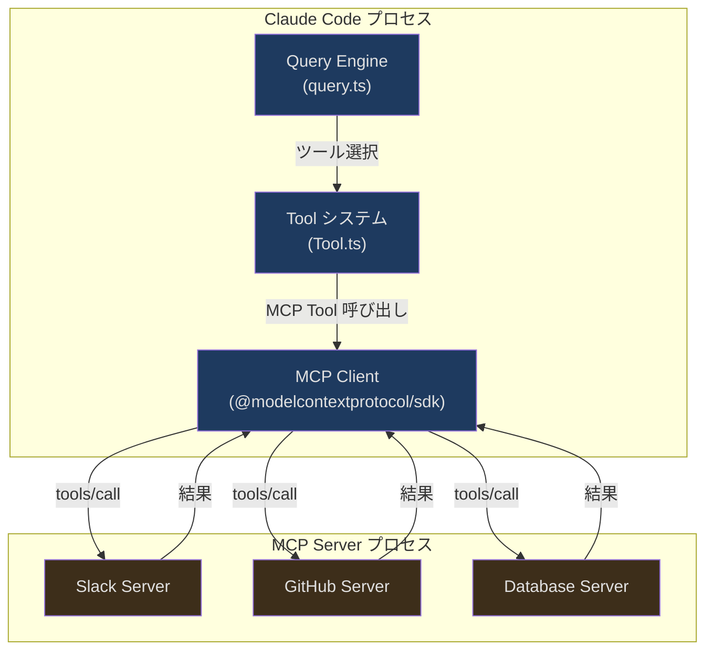
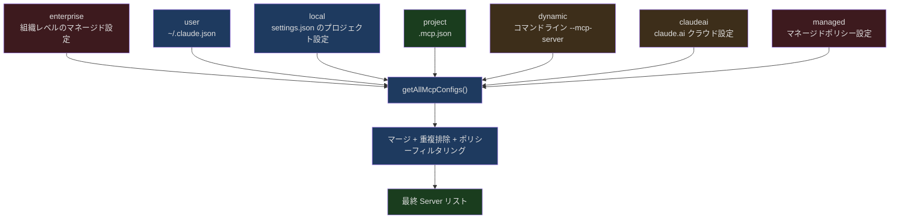
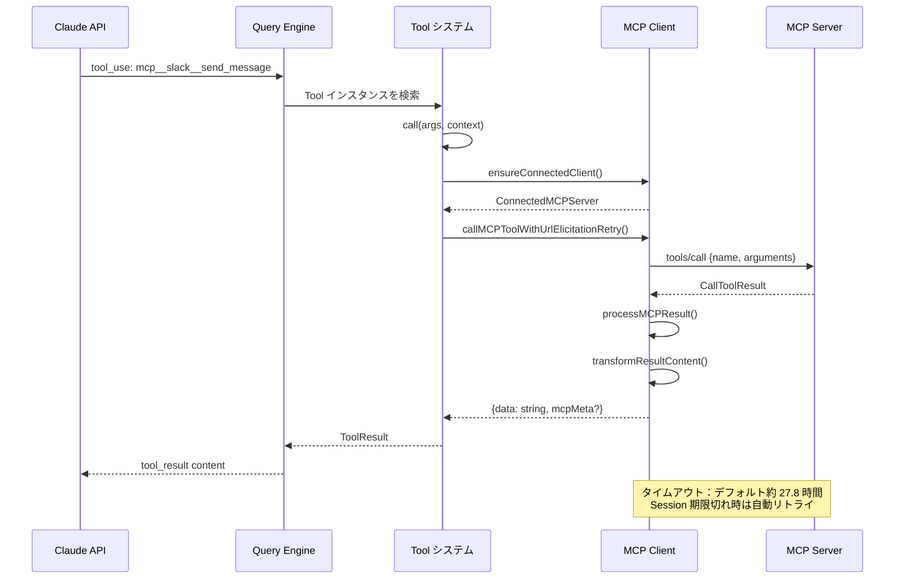

## 問題提起

Claude Code はデータベースにクエリを投げ、API にアクセスし、Figma を操作できます。これらの能力はハードコードされているのではなく、MCP を通じて動的にロードされます。

`.mcp.json` に Slack Server を設定すると、Claude Code は自動的にそれに接続し、提供されるすべてのツール（メッセージ検索、メッセージ送信、チャンネル一覧）を発見し、それらを Claude が呼び出し可能な Tool として登録します。まるで組み込みツールのように扱われます。「#general チャンネルにメッセージを送って」と言えば、Claude は `mcp__slack__send_message` の呼び出しを選択し、パラメータを JSON にシリアライズし、stdio パイプ経由で Slack Server プロセスに送信し、レスポンスを待って結果を表示します。

この仕組みは単純な RPC 呼び出しではありません。以下が関与しています：

- 複数のトランスポートプロトコル（stdio、SSE、HTTP Streamable、WebSocket、SDK 内蔵）の統一的な抽象化
- コネクションプールと memoize キャッシュで重複ハンドシェイクを回避
- 動的なツール発見：Server が能力を宣言すると、Claude Code が MCP Tool を自動的に内部 `Tool` インターフェースに変換
- JSON Schema 直接転送：MCP ツールは Zod パースを通さず、`inputSchema` を JSON Schema 形式で API にそのまま渡す
- Resource と Prompt という二つの補助プリミティブの統合
- OAuth 認証、URL Elicitation、Session 期限切れ再接続などのエッジケースの処理
- Agent 子プロセス間での MCP Server 共有と隔離

本記事では、プロトコルの概要から始めて、Claude Code の MCP 統合実装を階層ごとに深掘りします。

## MCP プロトコル概要

Model Context Protocol（MCP）は Anthropic が提案したオープンプロトコルで、AI モデルと外部ツール/データソースとのインタラクションを標準化することを目的としています。核心的な設計理念は：**モデルはツールの実装詳細を知る必要がなく、ツールの名前、説明、入力 Schema だけを知ればよい**というものです。



MCP プロトコルは五つの核心概念を定義しています：

| 概念 | 役割 | 説明 |
|------|------|------|
| **Client** | 消費者 | Claude Code プロセス内の MCP クライアント、Server への接続、ツール発見、呼び出しの発行を担当 |
| **Server** | 提供者 | 独立プロセスまたはリモートサービス、tools/resources/prompts を公開 |
| **Tool** | 実行可能な操作 | Server が提供する関数、名前・説明・JSON Schema で定義された入力パラメータを持つ |
| **Resource** | コンテキストデータ | Server が提供する読み取り専用データ（ファイル内容、API レスポンスなど）、会話コンテキストに注入可能 |
| **Prompt** | プリセットテンプレート | Server が提供するプロンプトテンプレート、ユーザーがスラッシュコマンドとして呼び出し可能 |

### トランスポート層の多様性

Claude Code がサポートするトランスポートタイプは基本仕様を大きく超えています。`types.ts` の Schema 定義から完全なタイプリストがわかります：

```typescript
// src/services/mcp/types.ts (第 23-26 行)
export const TransportSchema = lazySchema(() =>
  z.enum(['stdio', 'sse', 'sse-ide', 'http', 'ws', 'sdk']),
)
```

各トランスポートタイプは異なる使用シナリオに対応します：

| トランスポートタイプ | シナリオ | 特徴 |
|----------|------|------|
| `stdio` | ローカル CLI ツール | 子プロセスを起動、stdin/stdout で通信 |
| `sse` | リモート HTTP サービス | Server-Sent Events、OAuth サポート |
| `http` | Streamable HTTP | MCP 2025-03-26 仕様の新トランスポート |
| `ws` | WebSocket | 双方向リアルタイム通信 |
| `sse-ide` | IDE 拡張 | VS Code/JetBrains 内部使用 |
| `sdk` | プロセス内 Server | Agent SDK シナリオ、子プロセス不要 |

`sdk` タイプは精巧な `InProcessTransport` を使用しています：

```typescript
// src/services/mcp/InProcessTransport.ts (第 11-49 行)
class InProcessTransport implements Transport {
  private peer: InProcessTransport | undefined
  private closed = false

  onclose?: () => void
  onerror?: (error: Error) => void
  onmessage?: (message: JSONRPCMessage) => void

  /** @internal */
  _setPeer(peer: InProcessTransport): void {
    this.peer = peer
  }

  async start(): Promise<void> {}

  async send(message: JSONRPCMessage): Promise<void> {
    if (this.closed) {
      throw new Error('Transport is closed')
    }
    // 非同期配信、同期リクエスト/レスポンスによるスタック深度の問題を回避
    queueMicrotask(() => {
      this.peer?.onmessage?.(message)
    })
  }

  async close(): Promise<void> {
    if (this.closed) {
      return
    }
    this.closed = true
    this.onclose?.()
    if (this.peer && !this.peer.closed) {
      this.peer.closed = true
      this.peer.onclose?.()
    }
  }
}
```

`createLinkedTransportPair()` は相互接続された一対の Transport を作成し、一方を Client に、もう一方を Server に渡します。`send()` 内部では `queueMicrotask` で非同期にメッセージを配信し、同期的な RPC 呼び出しによるスタックオーバーフローを防ぎます。これは高頻度ツール呼び出しシナリオで非常に重要です。

## Server の設定と発見

### 設定階層

MCP Server の設定ソースは複数の階層があり、各階層のスコープが異なります：



各設定ソースの `ConfigScope` タイプ定義は以下の通りです：

```typescript
// src/services/mcp/types.ts (第 10-20 行)
export const ConfigScopeSchema = lazySchema(() =>
  z.enum([
    'local',
    'user',
    'project',
    'dynamic',
    'enterprise',
    'claudeai',
    'managed',
  ]),
)
```

`project` スコープはプロジェクトルートの `.mcp.json` ファイルから来ます。これが最も一般的な設定方法です。プロジェクト設定には悪意のある Server が含まれる可能性があるため、Claude Code は承認メカニズムを導入しています：

```typescript
// src/services/mcp/utils.ts (第 351-406 行)
export function getProjectMcpServerStatus(
  serverName: string,
): 'approved' | 'rejected' | 'pending' {
  const settings = getSettings_DEPRECATED()
  const normalizedName = normalizeNameForMCP(serverName)

  if (
    settings?.disabledMcpjsonServers?.some(
      name => normalizeNameForMCP(name) === normalizedName,
    )
  ) {
    return 'rejected'
  }

  if (
    settings?.enabledMcpjsonServers?.some(
      name => normalizeNameForMCP(name) === normalizedName,
    ) ||
    settings?.enableAllProjectMcpServers
  ) {
    return 'approved'
  }

  // 非インタラクティブモードで projectSettings が有効な場合は自動承認
  if (
    getIsNonInteractiveSession() &&
    isSettingSourceEnabled('projectSettings')
  ) {
    return 'approved'
  }

  return 'pending'
}
```

セキュリティ境界に注意：`--dangerously-skip-permissions` モードでの自動承認は `hasSkipDangerousModePermissionPrompt()` のみをチェックします。この関数は意図的に projectSettings を除外しており、悪意のあるリポジトリがプロジェクト設定を通じて自らバイパスモードを承認するのを防ぎます。

### 名前の正規化

MCP プロトコルはツール名が `^[a-zA-Z0-9_-]{1,64}$` にマッチすることを要求します。Server 名にはスペースやドット等の特殊文字が含まれる可能性があるため（特に claude.ai の Server）、正規化処理が必要です：

```typescript
// src/services/mcp/normalization.ts (第 17-23 行)
export function normalizeNameForMCP(name: string): string {
  let normalized = name.replace(/[^a-zA-Z0-9_-]/g, '_')
  if (name.startsWith(CLAUDEAI_SERVER_PREFIX)) {
    // claude.ai Server は連続するアンダースコアを追加圧縮し、__ セパレータとの衝突を回避
    normalized = normalized.replace(/_+/g, '_').replace(/^_|_$/g, '')
  }
  return normalized
}
```

ツールの完全修飾名は `mcp__<serverName>__<toolName>` 形式です：

```typescript
// src/services/mcp/mcpStringUtils.ts (第 50-52 行)
export function buildMcpToolName(serverName: string, toolName: string): string {
  return `${getMcpPrefix(serverName)}${normalizeNameForMCP(toolName)}`
}
```

この命名規約には既知の制限があります：Server 名自体に `__` が含まれている場合、パースがうまくいきません。コードのコメントにこの点が明記されています。実際にはこのケースは極めて稀です。

## Server ライフサイクル管理

### 接続フロー

`connectToServer` は MCP 統合全体のエントリ関数です。`memoize` でラップされ、`name + JSON(config)` をキャッシュキーとして使用し、同じ設定の Server への重複接続を防ぎます：

```typescript
// src/services/mcp/client.ts (第 595-607 行)
export const connectToServer = memoize(
  async (
    name: string,
    serverRef: ScopedMcpServerConfig,
    serverStats?: {
      totalServers: number
      stdioCount: number
      sseCount: number
      httpCount: number
      sseIdeCount: number
      wsIdeCount: number
    },
  ): Promise<MCPServerConnection> => {
    // ...接続ロジック
  },
  getServerCacheKey,
)
```

接続結果は五つの可能な状態を正確に表現する共用体型です：

```typescript
// src/services/mcp/types.ts (第 221-227 行)
export type MCPServerConnection =
  | ConnectedMCPServer    // 接続成功、Client インスタンスを保持
  | FailedMCPServer       // 接続失敗、エラー情報を保持
  | NeedsAuthMCPServer    // OAuth 認証が必要
  | PendingMCPServer      // 接続待ち（再接続試行回数を含む）
  | DisabledMCPServer     // ユーザー/ポリシーにより無効化
```

`ConnectedMCPServer` は接続の核心的な状態を保持します：

```typescript
// src/services/mcp/types.ts (第 180-193 行)
export type ConnectedMCPServer = {
  client: Client                    // MCP SDK Client インスタンス
  name: string
  type: 'connected'
  capabilities: ServerCapabilities  // Server が宣言した能力
  serverInfo?: {
    name: string
    version: string
  }
  instructions?: string            // Server が提供する指示（system prompt に注入）
  config: ScopedMcpServerConfig
  cleanup: () => Promise<void>      // クリーンアップ関数
}
```

### バッチ接続戦略

Claude Code はすべての Server に一度に接続するわけではありません。ローカル Server（stdio/sdk）とリモート Server を区別し、異なる並行制限を使用します：

```typescript
// src/services/mcp/client.ts (第 552-561 行)
export function getMcpServerConnectionBatchSize(): number {
  return parseInt(process.env.MCP_SERVER_CONNECTION_BATCH_SIZE || '', 10) || 3
}

function getRemoteMcpServerConnectionBatchSize(): number {
  return (
    parseInt(process.env.MCP_REMOTE_SERVER_CONNECTION_BATCH_SIZE || '', 10) ||
    20
  )
}
```

ローカル Server はデフォルト並行 3（プロセス起動のオーバーヘッドが大きい）、リモート Server はデフォルト並行 20（ネットワーク接続のみ）です。`getMcpToolsCommandsAndResources` では二つのグループが並行処理されます：

```typescript
// src/services/mcp/client.ts (第 2391-2402 行)
await Promise.all([
  processBatched(
    localServers,
    getMcpServerConnectionBatchSize(),
    processServer,
  ),
  processBatched(
    remoteServers,
    getRemoteMcpServerConnectionBatchSize(),
    processServer,
  ),
])
```

### クリーンアップと再接続

各 stdio Server の接続時にクリーンアップ関数がグローバルクリーンアップレジストリに登録され、プロセス終了時にすべての子プロセスが確実に終了されます：

```typescript
// src/services/mcp/client.ts (第 1572-1578 行)
// すべてのトランスポートタイプでクリーンアップを登録——ネットワークトランスポートもクリーンアップが必要な場合がある
const cleanupUnregister = registerCleanup(cleanup)

// 登録解除を含むラッパークリーンアップ関数を作成
const wrappedCleanup = async () => {
  cleanupUnregister?.()
  await cleanup()
}
```

stdio Server のクリーンアッププロセスは特に重要です。まず SIGTERM を送信してプロセスの終了を待ち、タイムアウトした場合は SIGKILL にエスカレートします：

```typescript
// src/services/mcp/client.ts (第 1520-1531 行)
logMCPDebug(
  name,
  'SIGTERM failed, sending SIGKILL to MCP server process',
)
try {
  process.kill(childPid, 'SIGKILL')
} catch (killError) {
  logMCPDebug(
    name,
    `Error sending SIGKILL: ${killError}`,
  )
}
```

キャッシュ無効化時は `clearServerCache` で関連するすべてのキャッシュをクリアします：

```typescript
// src/services/mcp/client.ts (第 1648-1673 行)
export async function clearServerCache(
  name: string,
  serverRef: ScopedMcpServerConfig,
): Promise<void> {
  const key = getServerCacheKey(name, serverRef)

  try {
    const wrappedClient = await connectToServer(name, serverRef)
    if (wrappedClient.type === 'connected') {
      await wrappedClient.cleanup()
    }
  } catch {
    // 無視——Server が接続失敗している可能性がある
  }

  // 接続キャッシュとすべての fetch キャッシュをクリアし、再接続時に最新データを取得
  connectToServer.cache.delete(key)
  fetchToolsForClient.cache.delete(name)
  fetchResourcesForClient.cache.delete(name)
  fetchCommandsForClient.cache.delete(name)
}
```

ここで四つの独立したキャッシュをクリアしている点に注意してください。接続キャッシュのみクリアして fetch キャッシュを残すと、再接続後に古いツールリストが使用されてしまいます。

### Session 期限切れ再接続

HTTP Streamable トランスポートでは、MCP 仕様が Session 期限切れメカニズム（HTTP 404 + JSON-RPC エラーコード -32001）を定義しています。Claude Code には専用の検出ロジックがあります：

```typescript
// src/services/mcp/client.ts (第 193-206 行)
export function isMcpSessionExpiredError(error: Error): boolean {
  const httpStatus =
    'code' in error ? (error as Error & { code?: number }).code : undefined
  if (httpStatus !== 404) {
    return false
  }
  // JSON-RPC エラーコードで汎用 404 と区別
  return (
    error.message.includes('"code":-32001') ||
    error.message.includes('"code": -32001')
  )
}
```

ツール呼び出し時に Session 期限切れを検出すると、自動的に一度リトライします：

```typescript
// src/services/mcp/client.ts (第 1859-1922 行)
const MAX_SESSION_RETRIES = 1
for (let attempt = 0; ; attempt++) {
  try {
    const connectedClient = await ensureConnectedClient(client)
    const mcpResult = await callMCPToolWithUrlElicitationRetry({
      client: connectedClient,
      // ...
    })
    return { data: mcpResult.content, /* ... */ }
  } catch (error) {
    if (
      error instanceof McpSessionExpiredError &&
      attempt < MAX_SESSION_RETRIES
    ) {
      logMCPDebug(
        client.name,
        `Retrying tool '${tool.name}' after session recovery`,
      )
      continue
    }
    // ...エラー処理
  }
}
```

## 動的ツール生成

これは MCP 統合の最も核心的な部分です。MCP Server が宣言したツールを Claude Code 内部の `Tool` インターフェースにどう変換するかです。

### MCPTool テンプレート

`MCPTool.ts` は「テンプレート」オブジェクトを定義し、すべての MCP ツールが共有する基本動作を含みます：

```typescript
// src/tools/MCPTool/MCPTool.ts (第 27-77 行)
export const MCPTool = buildTool({
  isMcp: true,
  // mcpClient.ts で実際の MCP ツール名 + パラメータによってオーバーライドされる
  isOpenWorld() {
    return false
  },
  name: 'mcp',                      // オーバーライドされる
  maxResultSizeChars: 100_000,
  async description() {
    return DESCRIPTION                // オーバーライドされる
  },
  async prompt() {
    return PROMPT                     // オーバーライドされる
  },
  get inputSchema(): InputSchema {
    return inputSchema()              // 汎用の z.object({}).passthrough()
  },
  async call() {
    return { data: '' }               // オーバーライドされる
  },
  async checkPermissions(): Promise<PermissionResult> {
    return {
      behavior: 'passthrough',
      message: 'MCPTool requires permission.',
    }
  },
  userFacingName: () => 'mcp',       // オーバーライドされる
  // ...レンダリング関数
} satisfies ToolDef<InputSchema, Output>)
```

ここでの設計パターンに注目してください：MCPTool は `z.object({}).passthrough()` を inputSchema として使用しています。これは「任意のオブジェクトを受け入れる」Zod Schema です。MCP ツールの実際の Schema は `inputJSONSchema` を通じて渡されるからです。

### fetchToolsForClient：Server から Tool へ

`fetchToolsForClient` はツール発見の核心関数です。MCP プロトコルの `tools/list` メソッドを呼び出し、各 MCP Tool を内部の `Tool` オブジェクトにマッピングします：

```typescript
// src/services/mcp/client.ts (第 1743-1813 行)
export const fetchToolsForClient = memoizeWithLRU(
  async (client: MCPServerConnection): Promise<Tool[]> => {
    if (client.type !== 'connected') return []

    const result = (await client.client.request(
      { method: 'tools/list' },
      ListToolsResultSchema,
    )) as ListToolsResult

    // Unicode 制御文字をクリーンアップ
    const toolsToProcess = recursivelySanitizeUnicode(result.tools)

    // SDK モードで mcp__ プレフィックスをスキップするかどうか
    const skipPrefix =
      client.config.type === 'sdk' &&
      isEnvTruthy(process.env.CLAUDE_AGENT_SDK_MCP_NO_PREFIX)

    return toolsToProcess.map((tool): Tool => {
      const fullyQualifiedName = buildMcpToolName(client.name, tool.name)
      return {
        ...MCPTool,                         // テンプレートを展開
        name: skipPrefix ? tool.name : fullyQualifiedName,
        mcpInfo: { serverName: client.name, toolName: tool.name },
        isMcp: true,
        // _meta から検索ヒントを読み取り
        searchHint:
          typeof tool._meta?.['anthropic/searchHint'] === 'string'
            ? tool._meta['anthropic/searchHint']
                .replace(/\s+/g, ' ').trim() || undefined
            : undefined,
        alwaysLoad: tool._meta?.['anthropic/alwaysLoad'] === true,
        // MCP ツールの元の説明を使用
        async description() {
          return tool.description ?? ''
        },
        // 長すぎる説明をトランケート（2048 文字上限）
        async prompt() {
          const desc = tool.description ?? ''
          return desc.length > MAX_MCP_DESCRIPTION_LENGTH
            ? desc.slice(0, MAX_MCP_DESCRIPTION_LENGTH) + '... [truncated]'
            : desc
        },
        // annotations から動作特性を推定
        isConcurrencySafe() {
          return tool.annotations?.readOnlyHint ?? false
        },
        isReadOnly() {
          return tool.annotations?.readOnlyHint ?? false
        },
        isDestructive() {
          return tool.annotations?.destructiveHint ?? false
        },
        isOpenWorld() {
          return tool.annotations?.openWorldHint ?? false
        },
        // JSON Schema を直接渡す、Zod に変換しない
        inputJSONSchema: tool.inputSchema as Tool['inputJSONSchema'],
        // ...call 実装, checkPermissions 等
      }
    }).filter(isIncludedMcpTool)
  },
  { maxSize: MCP_FETCH_CACHE_SIZE, getCacheKey: client => client.name },
)
```

このコードはいくつかの重要な設計判断を示しています：

**1. オブジェクト展開によるオーバーライドパターン**：`{ ...MCPTool, ...overrides }` でテンプレートオブジェクトを基盤とし、フィールドごとにオーバーライドします。これは継承よりも柔軟で、TypeScript の構造的型システムにもよく合います。

**2. MCP Annotations マッピング**：MCP 2025-03-26 仕様で導入された Tool Annotations（`readOnlyHint`、`destructiveHint`、`openWorldHint`）を、Claude Code は内部 Tool インターフェースの対応メソッドに直接マッピングしています。

**3. 説明長の制限**：`MAX_MCP_DESCRIPTION_LENGTH = 2048`。OpenAPI から自動生成された一部の MCP Server は 15-60KB のツール説明を生成することがあり、制限なしでは大量のトークンが無駄になります。

**4. IDE ツールフィルタリング**：`isIncludedMcpTool` 関数がホワイトリスト外の IDE ツールを除外し、`executeCode` と `getDiagnostics` のみを許可します。

### ツール呼び出しチェーン

モデルが MCP ツールの呼び出しを決定すると、呼び出しチェーンは以下の通りです：



`call` メソッド内のリトライロジックは二層に分かれています：

1. **Session 期限切れリトライ**：最大 1 回、接続キャッシュをクリアして Client を再取得
2. **URL Elicitation リトライ**：最大 3 回、MCP -32042 エラーコード（Server がユーザーに URL を開いて認可を求める）を処理

## JSON Schema vs Zod：二つのパラメータ検証トラック

これは Claude Code のツールシステムにおける興味深い設計の分岐です。組み込みツールは Zod Schema を使用し、MCP ツールは JSON Schema を使用する——二つの体系が並行して運用されています。

### 組み込みツールの Zod パス

組み込みツール（Read、Write、Bash など）は `inputSchema` を Zod Schema として定義します：

```typescript
// 典型的な組み込みツールの inputSchema
const inputSchema = z.object({
  file_path: z.string().describe('Absolute path to the file'),
  offset: z.number().optional().describe('Line offset'),
  limit: z.number().optional().describe('Number of lines'),
})
```

Zod Schema は API に送信する前に自動的に JSON Schema に変換されます。

### MCP ツールの JSON Schema 直接転送

MCP ツールは Zod 層をバイパスします。`Tool` インターフェースに `inputJSONSchema` フィールドが専用に定義されています：

```typescript
// src/Tool.ts (第 15-21 行)
export type ToolInputJSONSchema = {
  [x: string]: unknown
  type: 'object'
  properties?: {
    [x: string]: unknown
  }
}
```

```typescript
// src/Tool.ts (第 396-397 行)
// MCP ツールは Zod Schema からの変換ではなく、
// JSON Schema 形式で入力 Schema を直接指定できる
readonly inputJSONSchema?: ToolInputJSONSchema
```

`fetchToolsForClient` では、MCP ツールの `inputSchema`（Server からの JSON Schema）が `inputJSONSchema` に直接代入されます：

```typescript
// src/services/mcp/client.ts (第 1813 行)
inputJSONSchema: tool.inputSchema as Tool['inputJSONSchema'],
```

なぜ JSON Schema を Zod に変換しないのでしょうか。理由は三つあります：

1. **パフォーマンス**：JSON Schema から Zod へのランタイム変換にはオーバーヘッドがあり、MCP Server は複雑なネストされた Schema を提供する可能性がある
2. **忠実度**：JSON Schema の一部の機能（`patternProperties`、`additionalProperties`、`oneOf` の組み合わせなど）には Zod に直接的な対応物がない
3. **不要**：Claude API 自体が JSON Schema を受け入れるため、中間変換は不要

これが MCPTool の `inputSchema` が緩い `z.object({}).passthrough()` である理由です。ランタイムでは実際の検証を行わず、本当の Schema は `inputJSONSchema` を通じて API に直接渡されます。

## Resource と Prompt の統合

### Resource：コンテキストデータの注入

MCP Resource により Server は読み取り専用データを公開できます。Claude Code はこのための二つの組み込みツールを提供しています：

- `ListMcpResourcesTool`：すべての MCP Server が提供する Resource を一覧表示
- `ReadMcpResourceTool`：特定の Resource の内容を読み取り

Resource の型定義は MCP SDK を継承し、Server 帰属情報で拡張されています：

```typescript
// src/services/mcp/types.ts (第 229 行)
export type ServerResource = Resource & { server: string }
```

`getMcpToolsCommandsAndResources` では、Server が `resources` capability を宣言した場合にのみ Resource ツールが追加され、グローバルで一度だけ追加されます：

```typescript
// src/services/mcp/client.ts (第 2360-2364 行)
const resourceTools: Tool[] = []
if (supportsResources && !resourceToolsAdded) {
  resourceToolsAdded = true
  resourceTools.push(ListMcpResourcesTool, ReadMcpResourceTool)
}
```

この `resourceToolsAdded` フラグにより、10 個の Server がすべて Resource capability を宣言していても、List と Read ツールは一度だけ登録されます。それらはすべての Server の Resource にアクセスできるからです。

Resource 取得も LRU キャッシュと並行処理を使用しています。`prefetchAllMcpResources` は起動時にすべての Server のツール、コマンド、Resource をプリフェッチし、最初の会話時の遅延を回避します。

### Prompt：プリセットコマンドテンプレート

MCP Prompt は Claude Code の `Command`（スラッシュコマンド）に変換されます。Server が `prompts` capability を宣言すると、`fetchCommandsForClient` が `prompts/list` を呼び出してリストを取得します：

```typescript
// Prompt コマンドの命名は mcp__<server>__<prompt> 形式に従う
// Tool の命名と一致し、ダブルアンダースコアで区切る
```

Prompt と Skill の区別は微妙です：MCP Prompt は `isMcp: true` を設定し、MCP Skill（`skill://` Resource から発見されたもの）は `loadedFrom: 'mcp'` を設定します。この区別は `/mcp` メニューの能力表示に影響します：

```typescript
// src/services/mcp/utils.ts (第 85-94 行)
export function filterMcpPromptsByServer(
  commands: Command[],
  serverName: string,
): Command[] {
  return commands.filter(
    c =>
      commandBelongsToServer(c, serverName) &&
      !(c.type === 'prompt' && c.loadedFrom === 'mcp'),
  )
}
```

## Agent 間の MCP Server 共有と隔離

Claude Code のマルチ Agent アーキテクチャ（メインスレッド + 子 Agent）は MCP Server の共有問題を引き起こします。

### 共有メカニズム

メインスレッドが MCP Server に接続した後、子 Agent は `ToolUseContext.options.mcpClients` を通じて親プロセスの接続を継承します：

```typescript
// src/Tool.ts (第 167 行)
mcpClients: MCPServerConnection[]
```

子 Agent は MCP Server に再接続する必要はありません。`connectToServer` の memoize キャッシュがプロセス内でグローバルに共有されているからです。

### 隔離メカニズム

ただし、Server 設定の変更は自動的には伝播しません。`excludeStalePluginClients` が期限切れの接続を検出します：

```typescript
// src/services/mcp/utils.ts (第 185-224 行)
export function excludeStalePluginClients(
  mcp: {
    clients: MCPServerConnection[]
    tools: Tool[]
    commands: Command[]
    resources: Record<string, ServerResource[]>
  },
  configs: Record<string, ScopedMcpServerConfig>,
): {
  clients: MCPServerConnection[]
  tools: Tool[]
  commands: Command[]
  resources: Record<string, ServerResource[]>
  stale: MCPServerConnection[]
} {
  const stale = mcp.clients.filter(c => {
    const fresh = configs[c.name]
    if (!fresh) return c.config.scope === 'dynamic'
    return hashMcpConfig(c.config) !== hashMcpConfig(fresh)
  })
  // ...期限切れの tools/commands/resources を除去
}
```

期限切れ検出は設定の SHA-256 ハッシュ比較を使用し、`scope` フィールドは除外されます（scope はメタデータであり、接続パラメータに影響しないため）。

### 変更通知

MCP プロトコルは Server 側からの変更通知プッシュをサポートしています。`useManageMCPConnections` は三種類の通知をリッスンします：

```typescript
// useManageMCPConnections.ts からの通知サブスクリプション
ToolListChangedNotificationSchema    // ツールリスト変更
ResourceListChangedNotificationSchema // リソースリスト変更
PromptListChangedNotificationSchema   // Prompt リスト変更
```

通知を受信すると、Claude Code は対応する fetch キャッシュをクリアしてデータを再取得します。これにより Server はランタイムで動的にツールを追加/削除できます。例えば、データベース Server はユーザーがデータベース接続を切り替えた後に利用可能なクエリツールを更新できます。

### 再接続と指数バックオフ

断線再接続は指数バックオフ戦略を使用します：

```typescript
// src/services/mcp/useManageMCPConnections.ts (第 87-89 行)
const MAX_RECONNECT_ATTEMPTS = 5
const INITIAL_BACKOFF_MS = 1000
const MAX_BACKOFF_MS = 30000
```

再接続試行ごとに間隔が倍増し、30 秒の上限まで、最大 5 回試行します。

## OAuth と Elicitation

### 認証キャッシュ

OAuth が必要なリモート Server（SSE、HTTP）に対して、Claude Code は繰り返しプローブを避けるための認証キャッシュを維持しています：

```typescript
// src/services/mcp/client.ts (第 257-278 行)
const MCP_AUTH_CACHE_TTL_MS = 15 * 60 * 1000 // 15 分

type McpAuthCacheData = Record<string, { timestamp: number }>

// memoize で並行する isMcpAuthCached() が同一のファイル読み取りを共有
let authCachePromise: Promise<McpAuthCacheData> | null = null

function getMcpAuthCache(): Promise<McpAuthCacheData> {
  if (!authCachePromise) {
    authCachePromise = readFile(getMcpAuthCachePath(), 'utf-8')
      .then(data => jsonParse(data) as McpAuthCacheData)
      .catch(() => ({}))
  }
  return authCachePromise
}
```

キャッシュ書き込みは promise チェーンでシリアライズされ、並行 read-modify-write 競合を防ぎます：

```typescript
// src/services/mcp/client.ts (第 291-309 行)
let writeChain = Promise.resolve()

function setMcpAuthCacheEntry(serverId: string): void {
  writeChain = writeChain
    .then(async () => {
      const cache = await getMcpAuthCache()
      cache[serverId] = { timestamp: Date.now() }
      // ...ファイルに書き込み
      // 書き込み後に読み取りキャッシュを無効化
      authCachePromise = null
    })
    .catch(() => {
      // ベストエフォート
    })
}
```

### URL Elicitation

MCP 仕様の `-32042` エラーコードは、Server がユーザーに URL を開いて認可を完了するよう求めていることを示します。Claude Code にはこれに対する完全な処理フローがあります：

```typescript
// src/services/mcp/client.ts (第 2850-2860 行)
const MAX_URL_ELICITATION_RETRIES = 3
for (let attempt = 0; ; attempt++) {
  try {
    return await callToolFn({
      client: connectedClient,
      tool, args, meta, signal, onProgress,
    })
  } catch (error) {
    if (
      !(error instanceof McpError) ||
      error.code !== ErrorCode.UrlElicitationRequired
    ) {
      throw error
    }
    // ...Elicitation を処理
  }
}
```

Elicitation の処理は三層に分かれています：
1. **Hook 優先**：`runElicitationHooks` でカスタムロジックが自動処理
2. **SDK/Print モード**：`handleElicitation` コールバックで構造化 IO に委任
3. **REPL モード**：AppState キューで UI ダイアログを表示

## 大きな結果の処理

MCP ツールは大量のデータを返す可能性があります。`processMCPResult` は階層的な処理戦略を実装しています：

```typescript
// src/services/mcp/client.ts (第 2720-2799 行)
export async function processMCPResult(
  result: unknown,
  tool: string,
  name: string,
): Promise<MCPToolResult> {
  const { content, type, schema } = await transformMCPResult(result, tool, name)

  // IDE ツールはモデルに送信しないため、サイズチェックをスキップ
  if (name === 'ide') {
    return content
  }

  // トランケーションが必要かチェック
  if (!(await mcpContentNeedsTruncation(content))) {
    return content
  }

  // 画像を含む場合はトランケーションにフォールバック（画像の圧縮と閲覧可能性を維持）
  if (contentContainsImages(content)) {
    return await truncateMcpContentIfNeeded(content)
  }

  // 大きなテキスト結果：ファイルに永続化し、パスと読み取り指示を返す
  const persistId = `mcp-${normalizeNameForMCP(name)}-${normalizeNameForMCP(tool)}-${timestamp}`
  const persistResult = await persistToolResult(contentStr, persistId)
  // ...読み取り指示を返す
}
```

処理戦略の優先順位：
1. 小さな結果：そのまま返す
2. 大きな画像結果：トランケート（閲覧可能性を維持）
3. 大きなテキスト結果：ファイルに永続化し、Read 指示を返してモデルが必要に応じて読み取り
4. 永続化失敗：トランケーションにフォールバック

`inferCompactSchema` 関数は構造化コンテンツに対してコンパクトな Schema 記述を生成し、モデルが出力形式を理解するのを助けます：

```typescript
// src/services/mcp/client.ts (第 2644-2659 行)
export function inferCompactSchema(value: unknown, depth = 2): string {
  // 値の簡潔な構造記述を推定
  // 例：{name: string, items: [{id: number, ...}]}
}
```

## Claude.ai プロキシ接続

Claude Code は claude.ai 上で設定された MCP Server にアクセスでき、特殊な `claudeai-proxy` トランスポートタイプを使用します。プロキシ接続は OAuth token のリフレッシュを処理する必要があります：

```typescript
// src/services/mcp/client.ts (第 372-422 行)
export function createClaudeAiProxyFetch(innerFetch: FetchLike): FetchLike {
  return async (url, init) => {
    const doRequest = async () => {
      await checkAndRefreshOAuthTokenIfNeeded()
      const currentTokens = getClaudeAIOAuthTokens()
      if (!currentTokens) {
        throw new Error('No claude.ai OAuth token available')
      }
      const headers = new Headers(init?.headers)
      headers.set('Authorization', `Bearer ${currentTokens.accessToken}`)
      const response = await innerFetch(url, { ...init, headers })
      // 送信時に使用したトークンを返す、現在のトークンではなく
      return { response, sentToken: currentTokens.accessToken }
    }

    const { response, sentToken } = await doRequest()
    if (response.status !== 401) {
      return response
    }
    // 401 の場合、token をリフレッシュして一度リトライ
    const tokenChanged = await handleOAuth401Error(sentToken).catch(() => false)
    if (!tokenChanged) {
      return response
    }
    try {
      return (await doRequest()).response
    } catch {
      return response
    }
  }
}
```

`sentToken` の使用に注意してください。コードは意図的にリクエスト送信時に使用したトークンを記録しています。401 レスポンス後に現在のトークンを再読み取りするのではありません。並行する connector がその間に `handleOAuth401Error` でトークンをリフレッシュしている可能性があるため、再読み取りすると新しいトークンが得られ、`handleOAuth401Error` に渡すと「トークンは変わっていない」と判断されてリフレッシュがスキップされてしまうからです。

## タイムアウトとリクエストラッピング

### ツール呼び出しタイムアウト

MCP ツール呼び出しのデフォルトタイムアウトは約 27.8 時間（事実上「無限」）です：

```typescript
// src/services/mcp/client.ts (第 211 行)
const DEFAULT_MCP_TOOL_TIMEOUT_MS = 100_000_000
```

一見非常識に見えるこの値は意図的なものです。一部の MCP ツール（データベースマイグレーション、大規模分析など）は実際に非常に長い時間がかかります。ユーザーは `MCP_TOOL_TIMEOUT` 環境変数でカスタマイズできます。

### リクエストレベルのタイムアウトラッピング

ツールタイムアウトとは異なり、各 HTTP リクエストには 60 秒のタイムアウトがあります。`wrapFetchWithTimeout` は各リクエストに独立した AbortController を作成します：

```typescript
// src/services/mcp/client.ts (第 492-549 行)
export function wrapFetchWithTimeout(baseFetch: FetchLike): FetchLike {
  return async (url: string | URL, init?: RequestInit) => {
    const method = (init?.method ?? 'GET').toUpperCase()

    // GET リクエストはタイムアウトをスキップ——MCP の GET は長時間接続の SSE ストリーム
    if (method === 'GET') {
      return baseFetch(url, init)
    }

    // AbortSignal.timeout() ではなく setTimeout を使用
    // Bun では AbortSignal.timeout の内部タイマーが
    // GC まで解放されず、リクエストごとに約 2.4KB のネイティブメモリを消費するため
    const controller = new AbortController()
    const timer = setTimeout(
      c => c.abort(new DOMException('The operation timed out.', 'TimeoutError')),
      MCP_REQUEST_TIMEOUT_MS,
      controller,
    )
    timer.unref?.()

    // 親シグナルを関連付け
    const parentSignal = init?.signal
    const abort = () => controller.abort(parentSignal?.reason)
    parentSignal?.addEventListener('abort', abort)
    // ...
  }
}
```

コードのコメントが興味深い Bun ランタイムの詳細を明らかにしています：`AbortSignal.timeout()` で作成された内部タイマーは GC 時にしか解放されず、リクエストごとに約 2.4KB のネイティブメモリがリークします。そのため `setTimeout` + `clearTimeout` で手動でライフサイクルを管理しています。

## シリアライズ状態と CLI 統合

MCP の状態は JSON にシリアライズでき、`/mcp` コマンドや CLI 状態エクスポートに使用されます：

```typescript
// src/services/mcp/types.ts (第 232-258 行)
export interface SerializedTool {
  name: string
  description: string
  inputJSONSchema?: {
    [x: string]: unknown
    type: 'object'
    properties?: { [x: string]: unknown }
  }
  isMcp?: boolean
  originalToolName?: string  // 正規化前の元のツール名
}

export interface MCPCliState {
  clients: SerializedClient[]
  configs: Record<string, ScopedMcpServerConfig>
  tools: SerializedTool[]
  resources: Record<string, ServerResource[]>
  normalizedNames?: Record<string, string>  // 正規化名から元の名前へのマッピング
}
```

`normalizedNames` マッピングは実際の問題を解決します：ユーザーは権限ルールで元の名前を使用しますが、システム内部では正規化名を使用します。このマッピングにより権限チェックが正しく関連付けられます。

## 移植可能なパターンとベストプラクティス

### 設定の整理に関する推奨事項

Claude Code の設定階層設計に基づく推奨整理方法：

| シナリオ | 推奨設定場所 | 理由 |
|------|-------------|------|
| チーム共有のプロジェクトツール | `.mcp.json`（project scope） | コードのバージョン管理に含まれ、新メンバーが自動取得 |
| 個人的な汎用ツール | `~/.claude.json`（user scope） | プロジェクト横断で利用可能 |
| CI/CD 環境 | `--mcp-server` 引数（dynamic scope） | 一時的に注入、設定ファイルを変更しない |
| 企業コンプライアンスツール | managed 設定（enterprise scope） | 組織で統一管理、ユーザーが変更不可 |

### ツール設計原則

Claude Code の MCP 統合コードから抽出できる MCP Server ツール設計原則：

1. **annotations を使用する**：`readOnlyHint` を宣言してツールを並行実行可能に、`destructiveHint` を宣言して追加確認をトリガー
2. **説明の長さを制御する**：2048 文字を超えるとトランケートされるため、重要な使い方を先頭に
3. **ページネーションをサポートする**：大きな結果はトランケートまたはファイルに永続化されるため、ページネーションパラメータでモデルが必要に応じて取得可能に
4. **searchHint を使用する**：`_meta['anthropic/searchHint']` で ToolSearch が遅延ロードされたツールを見つけやすく
5. **alwaysLoad を使用する**：モデルが最初のターンで必ず見る必要がある重要ツールには `_meta['anthropic/alwaysLoad']` を設定して ToolSearch をスキップ

### セキュリティ境界

MCP 統合のセキュリティモデルは特に注目に値します：

- **Project Server の承認**：`.mcp.json` の Server はユーザーの明示的な承認が必要（非インタラクティブモードで projectSettings が有効な場合を除く）
- **権限の隔離**：MCP ツールは `passthrough` 権限モードを使用し、各呼び出しでグローバル権限ルールがチェックされる
- **名前空間の隔離**：`mcp__` プレフィックスにより MCP ツールが組み込みツールと衝突しない（SDK モードではオプションで無効化可能）
- **説明のトランケート**：悪意のある Server が超長説明でプロンプトインジェクションするのを防止
- **Unicode クリーニング**：`recursivelySanitizeUnicode` がモデルの動作に干渉する可能性のある制御文字を除去

## アーキテクチャのまとめ

Claude Code の MCP 統合は、慎重に設計された拡張可能なアーキテクチャです。「接続管理」と「ツールアダプテーション」を明確に分離しています：`client.ts` が MCP Server との接続の確立と維持を担当し、`MCPTool.ts` がツールテンプレートを提供し、`fetchToolsForClient` が両者を橋渡しします。Server の生の能力宣言から Claude が呼び出し可能な Tool オブジェクトまで、名前の正規化、説明のトランケート、Schema の直接転送、権限設定など一連の処理を経由します。

全体的な設計の核心的な理念：

1. **遅延発見**：必要な時にのみ Server に接続しツールリストを取得し、memoize キャッシュで重複操作を回避
2. **優雅なデグレード**：接続失敗はシステム全体をブロックせず、その Server のツールが利用不可になるだけ。認証が必要な Server は `McpAuthTool` を登録してユーザーに認証完了を案内
3. **二つの Schema トラック**：組み込みツールは Zod で型安全性と検証を得て、MCP ツールは JSON Schema 直接転送で柔軟性と効率を維持
4. **防御的設計**：Unicode クリーニングから説明のトランケート、設定ハッシュ比較から認証キャッシュのシリアライズまで、エッジケースへの配慮が随所に見られる

類似の拡張システムを構築したいプロジェクトにとって、MCP 統合は参考になるパターンを提供しています：テンプレートオブジェクト + オブジェクト展開で動的ツール登録を実装し、memoize キャッシュで接続ライフサイクルを管理し、共用体型で接続状態を正確に表現し、設定階層で柔軟なスコープ管理を実現するパターンです。
