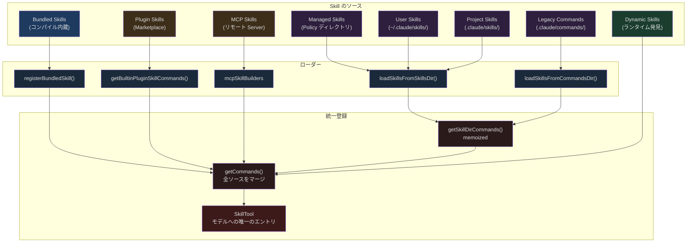
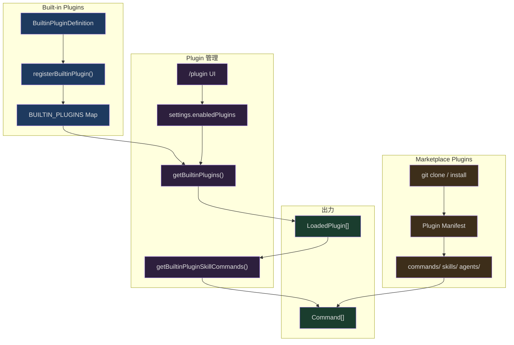

## 問題提起

Claude Code で `/simplify` と入力すると、最近変更したコードに対して三次元の審査（コード再利用、品質、効率）が自動的に実行されます。Plugin をインストールすると、その提供する Skill が自動的に利用可能リストに表示されます。MCP Server が Prompt を公開し、特定の frontmatter マークを付与すると、これらの Prompt も Skill に変換されてモデルが呼び出し可能になります。

この背後には三層の拡張性アーキテクチャがあります：

- **Skill 層**：Markdown ファイルを媒体としたスキル定義、frontmatter でメタデータを宣言、複数ソースからのロード、パラメータ置換、条件付きアクティベーションをサポート
- **Plugin 層**：複数の Skill、Hooks、MCP Server をインストール可能な拡張ユニットとしてパッケージ化、Built-in と Marketplace の二段階
- **MCP 層**：MCP プロトコルを通じてリモート Server から Skill を動的に発見・ロード

三層にはそれぞれ独立した登録メカニズムがありますが、最終的にはすべて一つの `Command[]` 配列に統合され、`SkillTool` が唯一のエントリポイントとしてモデルに公開します。本記事では Skill システムのファイルロードから始め、この拡張性アーキテクチャの設計と実装を階層ごとに深掘りします。

## Skill システム全景

### 核心データ構造：Command

すべての Skill は最終的に `Command` 型で表現されます。この型を理解することが、システム全体を理解する基礎です：

```typescript
// src/types/command.ts (L25-55)
export type PromptCommand = {
  type: 'prompt'
  progressMessage: string
  contentLength: number
  argNames?: string[]
  allowedTools?: string[]
  model?: string
  source: SettingSource | 'builtin' | 'mcp' | 'plugin' | 'bundled'
  pluginInfo?: {
    pluginManifest: PluginManifest
    repository: string
  }
  hooks?: HooksSettings
  skillRoot?: string
  context?: 'inline' | 'fork'
  agent?: string
  effort?: EffortValue
  paths?: string[]
  getPromptForCommand(
    args: string,
    context: ToolUseContext,
  ): Promise<ContentBlockParam[]>
}

export type Command = CommandBase &
  (PromptCommand | LocalCommand | LocalJSXCommand)
```

`source` フィールドは Skill の出自を示します。`'bundled'` は CLI にコンパイルされた組み込みスキル、`'plugin'` は Plugin からのもの、`'mcp'` は MCP Server から、`SettingSource`（`'userSettings'`、`'projectSettings'`、`'policySettings'`）はそれぞれのディレクトリからロードされたファイル Skill に対応します。

`getPromptForCommand` がコアメソッドです。ユーザー引数とツールコンテキストを受け取り、会話に注入されるプロンプトコンテンツを返します。異なるソースの Skill がこのメソッド内でそれぞれのパラメータ置換、シェルコマンド実行、セキュリティポリシーを実装します。

### 複数ソースロードアーキテクチャ



ロードの優先順位はこの順序で実行され、同名 Skill では先にロードされたものが勝ちます。

### ファイル Skill のロード：loadSkillsDir.ts

ファイル Skill のコアロードロジックは `loadSkillsDir.ts` にあります。このファイルは 1000 行を超え、Skill システム全体で最も複雑なモジュールです。

#### ディレクトリ構造の規約

Skills ディレクトリは**ディレクトリ形式**のみをサポートします。各 Skill は `SKILL.md` ファイルを含むディレクトリです。

```
.claude/skills/
├── review-code/
│   └── SKILL.md          # Skill 定義
├── deploy/
│   ├── SKILL.md          # Skill 定義
│   └── scripts/
│       └── deploy.sh     # 補助ファイル
└── frontend:lint/        # 名前空間 → "frontend:lint"
    └── SKILL.md
```

ロード関数 `loadSkillsFromSkillsDir` はディレクトリを走査し、各 `SKILL.md` を読み取ります：

```typescript
// src/skills/loadSkillsDir.ts (L407-480)
async function loadSkillsFromSkillsDir(
  basePath: string,
  source: SettingSource,
): Promise<SkillWithPath[]> {
  const fs = getFsImplementation()

  let entries
  try {
    entries = await fs.readdir(basePath)
  } catch (e: unknown) {
    if (!isFsInaccessible(e)) logError(e)
    return []
  }

  const results = await Promise.all(
    entries.map(async (entry): Promise<SkillWithPath | null> => {
      try {
        // ディレクトリ形式のみサポート：skill-name/SKILL.md
        if (!entry.isDirectory() && !entry.isSymbolicLink()) {
          return null
        }

        const skillDirPath = join(basePath, entry.name)
        const skillFilePath = join(skillDirPath, 'SKILL.md')

        let content: string
        try {
          content = await fs.readFile(skillFilePath, { encoding: 'utf-8' })
        } catch (e: unknown) {
          if (!isENOENT(e)) {
            logForDebugging(
              `[skills] failed to read ${skillFilePath}: ${e}`,
              { level: 'warn' },
            )
          }
          return null
        }

        const { frontmatter, content: markdownContent } = parseFrontmatter(
          content, skillFilePath,
        )

        const skillName = entry.name
        const parsed = parseSkillFrontmatterFields(
          frontmatter, markdownContent, skillName,
        )
        const paths = parseSkillPaths(frontmatter)

        return {
          skill: createSkillCommand({
            ...parsed,
            skillName,
            markdownContent,
            source,
            baseDir: skillDirPath,
            loadedFrom: 'skills',
            paths,
          }),
          filePath: skillFilePath,
        }
      } catch (error) {
        logError(error)
        return null
      }
    }),
  )

  return results.filter((r): r is SkillWithPath => r !== null)
}
```

いくつかの設計上のポイントに注意してください：

1. **ディレクトリ形式のみサポート**。`/skills/` ディレクトリ直下の単一 `.md` ファイルは無視されます。各 Skill が補助ファイル（スクリプト、テンプレートなど）を含めるようにするためです。
2. **シンボリックリンクのサポート**。`isSymbolicLink()` チェックにより、symlink を通じた Skill の共有が可能です。
3. **並行ロード**。`Promise.all` ですべての Skill ファイルを同時に読み取ります。
4. **優雅なデグレード**。個々の Skill のロード失敗は他の Skill に影響しません。

#### Frontmatter メタデータ解析

SKILL.md ファイルの frontmatter は Skill の動作を完全に宣言します。`parseSkillFrontmatterFields` 関数がすべての可能なフィールドを処理します：

```typescript
// src/skills/loadSkillsDir.ts (L185-265)
export function parseSkillFrontmatterFields(
  frontmatter: FrontmatterData,
  markdownContent: string,
  resolvedName: string,
  descriptionFallbackLabel: 'Skill' | 'Custom command' = 'Skill',
): {
  displayName: string | undefined
  description: string
  hasUserSpecifiedDescription: boolean
  allowedTools: string[]
  argumentHint: string | undefined
  argumentNames: string[]
  whenToUse: string | undefined
  version: string | undefined
  model: ReturnType<typeof parseUserSpecifiedModel> | undefined
  disableModelInvocation: boolean
  userInvocable: boolean
  hooks: HooksSettings | undefined
  executionContext: 'fork' | undefined
  agent: string | undefined
  effort: EffortValue | undefined
  shell: FrontmatterShell | undefined
} {
  // ...解析ロジック
}
```

完全な SKILL.md frontmatter の例：

```markdown
---
name: "コードレビューアシスタント"
description: "Git 変更に対する多次元コードレビュー"
when_to_use: "ユーザーがコードレビューや PR 提出を求めたときにトリガー"
allowed-tools:
  - Bash(git:*)
  - Read
  - Grep
arguments:
  - branch
  - focus_area
argument-hint: "<branch> [focus_area]"
model: sonnet
effort: high
context: fork
agent: general-purpose
user-invocable: true
disable-model-invocation: false
paths:
  - "src/**"
  - "lib/**"
hooks:
  PreToolUse:
    - matcher: Bash
      hooks:
        - type: command
          command: echo "Reviewing..."
shell:
  type: bash
  command: /bin/bash
---

## レビュープロセス

$ARGUMENTS ブランチの変更に対して以下のレビューを実施...

現在の Session ID: ${CLAUDE_SESSION_ID}
Skill ディレクトリ: ${CLAUDE_SKILL_DIR}
```

これらの frontmatter フィールドの意味を一つずつ説明します：

| フィールド | 型 | 用途 |
|------|------|------|
| `name` | string | 表示名（コマンド名には影響しない） |
| `description` | string | 簡潔な説明、Skill リストに使用 |
| `when_to_use` | string | いつこの Skill を呼び出すべきかをモデルに指示 |
| `allowed-tools` | string[] | Skill 実行中に追加で許可するツール |
| `arguments` | string/string[] | 名前付き引数のリスト |
| `model` | string | モデルオーバーライド（例：`sonnet`、`opus`、`inherit`） |
| `effort` | EffortValue | 推論の努力レベル |
| `context` | 'fork' | 子 Agent で実行するかどうか |
| `paths` | string[] | 条件付きアクティベーションのファイルパスパターン |
| `hooks` | HooksSettings | Skill レベルの Hook 設定 |
| `user-invocable` | boolean | ユーザーが `/name` で呼び出し可能か |
| `disable-model-invocation` | boolean | モデルが自発的に呼び出すことを禁止 |

### パラメータ置換メカニズム

Skill のプロンプトコンテンツは複数のパラメータ置換をサポートしています：

```typescript
// src/skills/loadSkillsDir.ts (L344-369)
async getPromptForCommand(args, toolUseContext) {
  let finalContent = baseDir
    ? `Base directory for this skill: ${baseDir}\n\n${markdownContent}`
    : markdownContent

  // 1. ユーザー引数の置換：$ARGUMENTS, $1, $2、または名前付き引数
  finalContent = substituteArguments(
    finalContent, args, true, argumentNames,
  )

  // 2. 組み込み変数の置換
  if (baseDir) {
    const skillDir =
      process.platform === 'win32' ? baseDir.replace(/\\/g, '/') : baseDir
    finalContent = finalContent.replace(/\$\{CLAUDE_SKILL_DIR\}/g, skillDir)
  }

  finalContent = finalContent.replace(
    /\$\{CLAUDE_SESSION_ID\}/g,
    getSessionId(),
  )

  // 3. シェルコマンド実行（MCP Skill 以外のみ）
  if (loadedFrom !== 'mcp') {
    finalContent = await executeShellCommandsInPrompt(
      finalContent, toolUseContext, `/${skillName}`, shell,
    )
  }

  return [{ type: 'text', text: finalContent }]
}
```

ここには三層の置換があります：

1. **ユーザー引数**：`$ARGUMENTS` が完全な引数文字列に置換され、`$1`/`$2` が位置引数に置換され、名前付き引数 `${branch}` が対応する値に置換されます。
2. **組み込み変数**：`${CLAUDE_SKILL_DIR}` が Skill の所在ディレクトリを指し、`${CLAUDE_SESSION_ID}` が現在のセッション ID です。
3. **シェルコマンド**：Skill コンテンツ内の `` !`command` `` と ` ```! command ``` ` 構文は実際に実行され、出力がプロンプトに置換されます。これは Skill が環境とインタラクトする重要な能力ですが、セキュリティの観点から MCP ソースの Skill ではシェルコマンド実行が禁止されています。

### 多段階ソースの集約と重複排除

`getSkillDirCommands` はファイル Skill の集約エントリです。`memoize` で結果をキャッシュし、五つのソースから並行して Skill をロードします：

```typescript
// src/skills/loadSkillsDir.ts (L638-714)
export const getSkillDirCommands = memoize(
  async (cwd: string): Promise<Command[]> => {
    const userSkillsDir = join(getClaudeConfigHomeDir(), 'skills')
    const managedSkillsDir = join(getManagedFilePath(), '.claude', 'skills')
    const projectSkillsDirs = getProjectDirsUpToHome('skills', cwd)

    const [
      managedSkills,
      userSkills,
      projectSkillsNested,
      additionalSkillsNested,
      legacyCommands,
    ] = await Promise.all([
      loadSkillsFromSkillsDir(managedSkillsDir, 'policySettings'),
      loadSkillsFromSkillsDir(userSkillsDir, 'userSettings'),
      Promise.all(
        projectSkillsDirs.map(dir =>
          loadSkillsFromSkillsDir(dir, 'projectSettings'),
        ),
      ),
      Promise.all(
        additionalDirs.map(dir =>
          loadSkillsFromSkillsDir(
            join(dir, '.claude', 'skills'), 'projectSettings',
          ),
        ),
      ),
      loadSkillsFromCommandsDir(cwd),
    ])

    // すべてのソースをマージ
    const allSkillsWithPaths = [
      ...managedSkills,
      ...userSkills,
      ...projectSkillsNested.flat(),
      ...additionalSkillsNested.flat(),
      ...legacyCommands,
    ]

    // ... 重複排除と条件付き Skill の分離
  },
)
```

ソースの優先順位に注意：Managed（企業ポリシー）> User（ユーザーグローバル）> Project（プロジェクトレベル）> Additional（`--add-dir`）> Legacy（旧版 `/commands/`）。

#### realpath ベースの重複排除

複数のソースが異なるパスで同じファイルを指す可能性があります（symlink など）。システムは `realpath` で正規パスに解決して重複排除します：

```typescript
// src/skills/loadSkillsDir.ts (L118-124)
async function getFileIdentity(filePath: string): Promise<string | null> {
  try {
    return await realpath(filePath)
  } catch {
    return null
  }
}
```

重複排除プロセスは、まず全ファイルの identity を並行計算し、次に同期的にスキャンして重複を除去します：

```typescript
// src/skills/loadSkillsDir.ts (L728-763)
const fileIds = await Promise.all(
  allSkillsWithPaths.map(({ skill, filePath }) =>
    skill.type === 'prompt'
      ? getFileIdentity(filePath)
      : Promise.resolve(null),
  ),
)

const seenFileIds = new Map<string, SettingSource | ...>()
const deduplicatedSkills: Command[] = []

for (let i = 0; i < allSkillsWithPaths.length; i++) {
  const entry = allSkillsWithPaths[i]
  if (entry === undefined || entry.skill.type !== 'prompt') continue
  const { skill } = entry

  const fileId = fileIds[i]
  if (fileId === null || fileId === undefined) {
    deduplicatedSkills.push(skill)
    continue
  }

  const existingSource = seenFileIds.get(fileId)
  if (existingSource !== undefined) {
    logForDebugging(
      `Skipping duplicate skill '${skill.name}' from ${skill.source}`,
    )
    continue
  }

  seenFileIds.set(fileId, skill.source)
  deduplicatedSkills.push(skill)
}
```

この設計は inode 比較ではなく `realpath` を選択しています。一部のファイルシステム（NFS、ExFAT、コンテナ内の仮想 FS）が報告する inode 値は信頼できないからです。まず IO を並行実行（`Promise.all` で identity を取得）し、次に同期的にロジック判断（走査して重複排除）するのは、パフォーマンスと正確性を両立する典型的なパターンです。

### Paths 条件付きアクティベーション

Skill は `paths` frontmatter で特定のファイルパスでのみ有効であることを宣言できます：

```yaml
---
paths:
  - "src/components/**"
  - "src/styles/**"
---
```

Skill に `paths` フィールドがある場合、即座に利用可能リストにロードされるのではなく、`conditionalSkills` Map に格納されます。モデルがマッチするパスのファイルを操作した時にのみ、Skill がアクティベートされます：

```typescript
// src/skills/loadSkillsDir.ts (L997-1058)
export function activateConditionalSkillsForPaths(
  filePaths: string[],
  cwd: string,
): string[] {
  if (conditionalSkills.size === 0) {
    return []
  }

  const activated: string[] = []

  for (const [name, skill] of conditionalSkills) {
    if (skill.type !== 'prompt' || !skill.paths || skill.paths.length === 0) {
      continue
    }

    const skillIgnore = ignore().add(skill.paths)
    for (const filePath of filePaths) {
      const relativePath = isAbsolute(filePath)
        ? relative(cwd, filePath)
        : filePath

      if (
        !relativePath ||
        relativePath.startsWith('..') ||
        isAbsolute(relativePath)
      ) {
        continue
      }

      if (skillIgnore.ignores(relativePath)) {
        dynamicSkills.set(name, skill)
        conditionalSkills.delete(name)
        activatedConditionalSkillNames.add(name)
        activated.push(name)
        break
      }
    }
  }

  if (activated.length > 0) {
    skillsLoaded.emit()
  }

  return activated
}
```

ここでは `ignore` ライブラリ（`.gitignore` と同じ glob マッチングルール）を使用しています。マッチ後、Skill は `conditionalSkills` から `dynamicSkills` に移動され、シグナルを通じて他のモジュールにキャッシュクリアを通知します。`activatedConditionalSkillNames` Set により、Skill のリロード時（キャッシュクリア後）に既にアクティベートされた Skill が再度条件付き Skill に降格されることを防ぎます。

この「遅延アクティベーション」設計には明確なパフォーマンス上の目的があります。プロジェクトには多数の Skill が存在する可能性がありますが、すべてが現在の作業に関連するわけではありません。パスフィルタリングにより Skill リストをコンパクトに保ち、システムプロンプトのトークン消費を削減します。

### 動的 Skill 発見

条件付きアクティベーションに加えて、システムはファイル操作から新しい Skill ディレクトリを動的に発見することもサポートしています：

```typescript
// src/skills/loadSkillsDir.ts (L861-915)
export async function discoverSkillDirsForPaths(
  filePaths: string[],
  cwd: string,
): Promise<string[]> {
  const fs = getFsImplementation()
  const resolvedCwd = cwd.endsWith(pathSep) ? cwd.slice(0, -1) : cwd
  const newDirs: string[] = []

  for (const filePath of filePaths) {
    let currentDir = dirname(filePath)

    // ファイル位置から cwd まで上方走査し、各レベルに .claude/skills/ があるかチェック
    while (currentDir.startsWith(resolvedCwd + pathSep)) {
      const skillDir = join(currentDir, '.claude', 'skills')

      if (!dynamicSkillDirs.has(skillDir)) {
        dynamicSkillDirs.add(skillDir)
        try {
          await fs.stat(skillDir)
          // gitignore でチェック
          if (await isPathGitignored(currentDir, resolvedCwd)) {
            continue
          }
          newDirs.push(skillDir)
        } catch {
          // ディレクトリが存在しない、続行
        }
      }

      const parent = dirname(currentDir)
      if (parent === currentDir) break
      currentDir = parent
    }
  }

  // 深さでソート、深いディレクトリほど優先度が高い
  return newDirs.sort(
    (a, b) => b.split(pathSep).length - a.split(pathSep).length,
  )
}
```

モデルが `src/modules/payments/handler.ts` ファイルを Read や Edit した場合、システムは `src/modules/payments/.claude/skills/`、`src/modules/.claude/skills/` などのディレクトリが存在するか上方チェックします。新しい Skill ディレクトリが発見されると、ロードされて利用可能な Skill にマージされます。

`dynamicSkillDirs` Set が既にチェック済みのディレクトリ（成功・失敗を問わず）を記録し、同一ディレクトリへの重複 `stat` 呼び出しを回避していることに注目してください。また、`.gitignore` パス配下の Skill ディレクトリはスキップされ、`node_modules` 内の悪意のある Skill がロードされるのを防ぎます。

### Effort Level

Skill は `effort` frontmatter でモデルの推論努力レベルを制御できます：

```typescript
// src/skills/loadSkillsDir.ts (L228-235)
const effortRaw = frontmatter['effort']
const effort =
  effortRaw !== undefined ? parseEffortValue(effortRaw) : undefined
if (effortRaw !== undefined && effort === undefined) {
  logForDebugging(
    `Skill ${resolvedName} has invalid effort '${effortRaw}'.` +
    ` Valid options: ${EFFORT_LEVELS.join(', ')} or an integer`,
  )
}
```

Skill が `context: fork` で実行される場合、`effort` は子 Agent の定義に注入されます：

```typescript
// src/tools/SkillTool/SkillTool.ts (L209-212)
const agentDefinition =
  command.effort !== undefined
    ? { ...baseAgent, effort: command.effort }
    : baseAgent
```

これにより特定の Skill がより高い、またはより低い推論強度を要求できます。例えばコードレビュー Skill は `effort: high` を設定し、シンプルなフォーマット Skill は `effort: low` を設定して実行を高速化できます。

## Bundled Skill システム

### registerBundledSkill 登録パターン

Bundled Skill は CLI バイナリにコンパイルされたスキルで、ファイルシステムに依存しません。`registerBundledSkill` 関数で起動時に登録されます：

```typescript
// src/skills/bundledSkills.ts (L53-100)
export function registerBundledSkill(definition: BundledSkillDefinition): void {
  const { files } = definition

  let skillRoot: string | undefined
  let getPromptForCommand = definition.getPromptForCommand

  if (files && Object.keys(files).length > 0) {
    skillRoot = getBundledSkillExtractDir(definition.name)
    let extractionPromise: Promise<string | null> | undefined
    const inner = definition.getPromptForCommand
    getPromptForCommand = async (args, ctx) => {
      extractionPromise ??= extractBundledSkillFiles(definition.name, files)
      const extractedDir = await extractionPromise
      const blocks = await inner(args, ctx)
      if (extractedDir === null) return blocks
      return prependBaseDir(blocks, extractedDir)
    }
  }

  const command: Command = {
    type: 'prompt',
    name: definition.name,
    description: definition.description,
    aliases: definition.aliases,
    hasUserSpecifiedDescription: true,
    allowedTools: definition.allowedTools ?? [],
    // ...その他のフィールド
    source: 'bundled',
    loadedFrom: 'bundled',
    getPromptForCommand,
  }
  bundledSkills.push(command)
}
```

ここに精巧な**遅延ファイル抽出**メカニズムがあります。Bundled Skill が `files`（参照ファイル）を宣言している場合、これらのファイルは登録時にディスクに書き込まれるのではなく、初回呼び出し時に初めて抽出されます。`extractionPromise ??= ...` は nullish 代入演算子を使って memoize を実装しており、複数の並行呼び出しが同一の Promise を共有し、重複抽出を防ぎます。

### 安全なファイル書き込み

ファイルのディスクへの抽出時、システムは多層のセキュリティ対策を使用しています：

```typescript
// src/skills/bundledSkills.ts (L176-193)
const O_NOFOLLOW = fsConstants.O_NOFOLLOW ?? 0
const SAFE_WRITE_FLAGS =
  process.platform === 'win32'
    ? 'wx'
    : fsConstants.O_WRONLY |
      fsConstants.O_CREAT |
      fsConstants.O_EXCL |
      O_NOFOLLOW

async function safeWriteFile(p: string, content: string): Promise<void> {
  const fh = await open(p, SAFE_WRITE_FLAGS, 0o600)
  try {
    await fh.writeFile(content, 'utf8')
  } finally {
    await fh.close()
  }
}
```

- `O_EXCL`：ファイルが既に存在する場合は失敗、事前作成された悪意のあるファイルの上書きを防止
- `O_NOFOLLOW`：シンボリックリンクを辿らない、symlink 攻撃を防止
- `0o600`：ファイル権限をオーナーの読み書きのみに制限
- `0o700`：ディレクトリ権限をオーナーのみに制限

パス検証も厳格です：

```typescript
// src/skills/bundledSkills.ts (L196-206)
function resolveSkillFilePath(baseDir: string, relPath: string): string {
  const normalized = normalize(relPath)
  if (
    isAbsolute(normalized) ||
    normalized.split(pathSep).includes('..') ||
    normalized.split('/').includes('..')
  ) {
    throw new Error(`bundled skill file path escapes skill dir: ${relPath}`)
  }
  return join(baseDir, normalized)
}
```

### Bundled Skill 登録フロー

すべての Bundled Skill は `initBundledSkills` で一括登録されます：

```typescript
// src/skills/bundled/index.ts (L24-79)
export function initBundledSkills(): void {
  registerUpdateConfigSkill()
  registerKeybindingsSkill()
  registerVerifySkill()
  registerDebugSkill()
  registerLoremIpsumSkill()
  registerSkillifySkill()
  registerRememberSkill()
  registerSimplifySkill()
  registerBatchSkill()
  registerStuckSkill()

  // Feature-gated skills
  if (feature('KAIROS') || feature('KAIROS_DREAM')) {
    const { registerDreamSkill } = require('./dream.js')
    registerDreamSkill()
  }
  if (feature('AGENT_TRIGGERS')) {
    const { registerLoopSkill } = require('./loop.js')
    registerLoopSkill()
  }
  // ...他の feature-gated skills
}
```

二つの登録パターンがあります：

1. **無条件登録**：`registerSimplifySkill()` など常に利用可能な Skill はモジュールトップレベルで import
2. **Feature-gated 登録**：`feature()` で feature flag をチェックし、`require()` で遅延ロード

`import()` ではなく `require()` を使用しているのは、Bun バンドル後に動的 `import()` のパス解決が `/$bunfs/root/...` を指すようになるのに対し、`require()` は正常に動作するためです。

### 実践例：simplify Skill

実際の Bundled Skill がどう動作するか見てみましょう：

```typescript
// src/skills/bundled/simplify.ts (L55-69)
export function registerSimplifySkill(): void {
  registerBundledSkill({
    name: 'simplify',
    description:
      'Review changed code for reuse, quality, and efficiency, ' +
      'then fix any issues found.',
    userInvocable: true,
    async getPromptForCommand(args) {
      let prompt = SIMPLIFY_PROMPT
      if (args) {
        prompt += `\n\n## Additional Focus\n\n${args}`
      }
      return [{ type: 'text', text: prompt }]
    },
  })
}
```

`SIMPLIFY_PROMPT` は入念に設計された多段階プロンプトで、モデルに以下を指示します：
1. `git diff` を実行して変更を特定
2. 三つの並行 Agent を起動してそれぞれコード再利用、コード品質、効率を審査
3. 発見事項を集約して直接問題を修正

これは Bundled Skill の核心的な価値を示しています：エキスパートレベルの多段階ワークフローを一つのコマンドにカプセル化すること。

## Plugin システム

### 二段階 Plugin アーキテクチャ



### Built-in Plugin

Built-in Plugin と Bundled Skill の核心的な違いは：**ユーザーが Built-in Plugin を有効/無効にできる**ことです。

```typescript
// src/types/plugin.ts (L18-35)
export type BuiltinPluginDefinition = {
  name: string
  description: string
  version?: string
  skills?: BundledSkillDefinition[]
  hooks?: HooksSettings
  mcpServers?: Record<string, McpServerConfig>
  isAvailable?: () => boolean
  defaultEnabled?: boolean
}
```

一つの Built-in Plugin は複数のコンポーネントを含むことができます：
- **skills**：`BundledSkillDefinition` で定義されたスキルのリスト
- **hooks**：ライフサイクルフック設定
- **mcpServers**：MCP Server 設定

Plugin ID は `{name}@builtin` 形式で、Marketplace Plugin の `{name}@{marketplace}` と区別されます。

### 有効/無効状態の管理

```typescript
// src/plugins/builtinPlugins.ts (L57-101)
export function getBuiltinPlugins(): {
  enabled: LoadedPlugin[]
  disabled: LoadedPlugin[]
} {
  const settings = getSettings_DEPRECATED()
  const enabled: LoadedPlugin[] = []
  const disabled: LoadedPlugin[] = []

  for (const [name, definition] of BUILTIN_PLUGINS) {
    // 利用可能性チェック（プラットフォーム制限など）
    if (definition.isAvailable && !definition.isAvailable()) {
      continue
    }

    const pluginId = `${name}@${BUILTIN_MARKETPLACE_NAME}`
    const userSetting = settings?.enabledPlugins?.[pluginId]
    // 優先順位：ユーザー設定 > Plugin デフォルト値 > true
    const isEnabled =
      userSetting !== undefined
        ? userSetting === true
        : (definition.defaultEnabled ?? true)

    const plugin: LoadedPlugin = {
      name,
      manifest: {
        name,
        description: definition.description,
        version: definition.version,
      },
      path: BUILTIN_MARKETPLACE_NAME,
      source: pluginId,
      repository: pluginId,
      enabled: isEnabled,
      isBuiltin: true,
      hooksConfig: definition.hooks,
      mcpServers: definition.mcpServers,
    }

    if (isEnabled) {
      enabled.push(plugin)
    } else {
      disabled.push(plugin)
    }
  }

  return { enabled, disabled }
}
```

状態判定チェーン：`isAvailable()` → `userSetting` → `defaultEnabled` → `true`。`isAvailable()` が false を返すと Plugin は完全に非表示になります。そうでなければ `/plugin` UI でのユーザー設定が優先され、ユーザー設定がなければ Plugin のデフォルト値を参照し、最終的にフォールバックとして有効になります。

### Plugin から Command への Skill 変換

Plugin の Skill は `skillDefinitionToCommand` で標準 `Command` に変換されます：

```typescript
// src/plugins/builtinPlugins.ts (L132-159)
function skillDefinitionToCommand(definition: BundledSkillDefinition): Command {
  return {
    type: 'prompt',
    name: definition.name,
    description: definition.description,
    hasUserSpecifiedDescription: true,
    allowedTools: definition.allowedTools ?? [],
    // 重要：source を 'builtin' ではなく 'bundled' に設定
    // 'builtin' は Command.source において /help, /clear 等のハードコードコマンドを意味する
    // 'bundled' を使用することで Plugin Skill が SkillTool リストに表示される
    source: 'bundled',
    loadedFrom: 'bundled',
    hooks: definition.hooks,
    context: definition.context,
    agent: definition.agent,
    isEnabled: definition.isEnabled ?? (() => true),
    isHidden: !(definition.userInvocable ?? true),
    progressMessage: 'running',
    getPromptForCommand: definition.getPromptForCommand,
  }
}
```

ここでの `source: 'bundled'` の選択は意図的です。コードのコメントで理由が説明されています：`'builtin'` は `Command.source` のセマンティクスではハードコードされた CLI コマンド（`/help`、`/clear`）を意味するため、Plugin Skill に `'builtin'` を使うと SkillTool リストから消えてしまいます。

### Marketplace Plugin

Marketplace Plugin は `LoadedPlugin` 型で表現され、より豊富な構造を持ちます：

```typescript
// src/types/plugin.ts (L48-70)
export type LoadedPlugin = {
  name: string
  manifest: PluginManifest
  path: string
  source: string
  repository: string
  enabled?: boolean
  isBuiltin?: boolean
  sha?: string               // Git commit SHA バージョンロック
  commandsPath?: string
  commandsPaths?: string[]    // manifest 内の追加コマンドパス
  agentsPath?: string
  agentsPaths?: string[]
  skillsPath?: string
  skillsPaths?: string[]
  outputStylesPath?: string
  outputStylesPaths?: string[]
  hooksConfig?: HooksSettings
  mcpServers?: Record<string, McpServerConfig>
  lspServers?: Record<string, LspServerConfig>
  settings?: Record<string, unknown>
}
```

Marketplace Plugin は Git リポジトリ経由で配布されます。インストールプロセスではリポジトリをローカルに clone し、manifest ファイルを読み取り、manifest で宣言されたパスに従って各コンポーネントをロードします。Skill ファイルはプロジェクトレベルの Skill と同じディレクトリ形式（`skill-name/SKILL.md`）を使用し、同一の `loadSkillsFromSkillsDir` ローダーで処理されます。

Plugin の名前空間はコロンで区切られます。`ralph-loop` という Plugin が `help` と `cancel-ralph` の二つの Skill を提供する場合、完全な名前は `ralph-loop:help` と `ralph-loop:cancel-ralph` です。

## MCP Skill ブリッジ

### mcpSkillBuilders 登録

MCP Server は Prompt プリミティブを通じて Skill を公開できます。MCP Prompt の frontmatter に特定のフィールドが含まれる場合、通常の Prompt ではなく Skill に変換されます：

```typescript
// src/skills/mcpSkillBuilders.ts (L26-44)
export type MCPSkillBuilders = {
  createSkillCommand: typeof createSkillCommand
  parseSkillFrontmatterFields: typeof parseSkillFrontmatterFields
}

let builders: MCPSkillBuilders | null = null

export function registerMCPSkillBuilders(b: MCPSkillBuilders): void {
  builders = b
}

export function getMCPSkillBuilders(): MCPSkillBuilders {
  if (!builders) {
    throw new Error(
      'MCP skill builders not registered — ' +
      'loadSkillsDir.ts has not been evaluated yet',
    )
  }
  return builders
}
```

このモジュールは微妙な循環依存の問題を解決しています。MCP コードは `createSkillCommand` と `parseSkillFrontmatterFields` を呼び出す必要がありますが、`loadSkillsDir.ts` を直接インポートすると巨大な推移的依存ツリーを引き込み、dependency-cruiser チェックで大量の循環警告が発生します。

解決策は**ランタイム登録**です。`mcpSkillBuilders.ts` は型（`typeof`）のみをインポートし、ランタイム依存は発生しません。`loadSkillsDir.ts` がモジュール初期化時に実際の関数を登録し、これは MCP Server の接続よりも前に行われます。

### MCP Skill とファイル Skill の違い

MCP ソースの Skill には二つの重要な制限があります：

1. **シェルコマンド実行の禁止**：

```typescript
// src/skills/loadSkillsDir.ts (L372-396)
// Security: MCP skills are remote and untrusted — never execute inline
// shell commands (!`…` / ```! … ```) from their markdown body.
if (loadedFrom !== 'mcp') {
  finalContent = await executeShellCommandsInPrompt(
    finalContent, toolUseContext, `/${skillName}`, shell,
  )
}
```

2. **`${CLAUDE_SKILL_DIR}` が意味を持たない**：MCP Skill にはローカルディレクトリがないため、Skill ディレクトリ変数は置換されません。

MCP Skill は `SkillTool.call()` 内で `getAllCommands` を通じて取得され、`AppState.mcp.commands` から `loadedFrom === 'mcp'` のコマンドをフィルタリングします：

```typescript
// src/tools/SkillTool/SkillTool.ts (L81-94)
async function getAllCommands(context: ToolUseContext): Promise<Command[]> {
  const mcpSkills = context
    .getAppState()
    .mcp.commands.filter(
      cmd => cmd.type === 'prompt' && cmd.loadedFrom === 'mcp',
    )
  if (mcpSkills.length === 0) return getCommands(getProjectRoot())
  const localCommands = await getCommands(getProjectRoot())
  return uniqBy([...localCommands, ...mcpSkills], 'name')
}
```

`uniqBy` は name で重複排除し、ローカルコマンドが優先されます（配列の先頭にあるため）。

## SkillTool 実行フロー

### 実行モード

SkillTool はモデルが Skill を呼び出すための唯一のツールインターフェースです。二つの実行モードをサポートしています：

```mermaid
sequenceDiagram
    participant M as モデル
    participant ST as SkillTool
    participant V as validateInput
    participant P as checkPermissions
    participant C as call()

    M->>ST: { skill: "simplify", args: "" }
    ST->>V: Skill の存在を検証
    V-->>ST: result: true

    ST->>P: 権限チェック
    alt 安全な属性の Skill
        P-->>ST: allow (auto)
    else allow ルールあり
        P-->>ST: allow (rule)
    else ユーザー確認が必要
        P-->>ST: ask
    end

    ST->>C: Skill を実行

    alt context: 'fork'
        C->>C: executeForkedSkill()
        Note over C: 子 Agent で実行<br/>独立したトークン予算
        C-->>ST: { status: 'forked', result: "..." }
    else context: 'inline'（デフォルト）
        C->>C: processPromptSlashCommand()
        Note over C: プロンプトを<br/>現在の会話コンテキストに展開
        C-->>ST: { status: 'inline', newMessages: [...] }
    end

    ST-->>M: ToolResult

    style M fill:#1e3a5f,color:#e0e0e0
    style ST fill:#2d1f3d,color:#e0e0e0
    style V fill:#1a3d2e,color:#e0e0e0
    style P fill:#3d2e1a,color:#e0e0e0
    style C fill:#3d1a1a,color:#e0e0e0
```

#### Inline モード（デフォルト）

Inline モードでは Skill のプロンプトコンテンツが現在の会話コンテキストに展開されます：

```typescript
// src/tools/SkillTool/SkillTool.ts (L635-643)
const processedCommand = await processPromptSlashCommand(
  commandName,
  args || '',
  commands,
  context,
)

if (!processedCommand.shouldQuery) {
  throw new Error('Command processing failed')
}
```

結果は `newMessages` の形式で返され、これらのメッセージが現在の会話フローに挿入されます。同時に `contextModifier` を通じてコンテキストが変更され、`allowedTools` の追加と `effort` レベルの伝達が行われます。

#### Fork モード

Skill が `context: 'fork'` を宣言している場合、独立した子 Agent で実行されます：

```typescript
// src/tools/SkillTool/SkillTool.ts (L122-289)
async function executeForkedSkill(
  command: Command & { type: 'prompt' },
  commandName: string,
  args: string | undefined,
  context: ToolUseContext,
  canUseTool: CanUseToolFn,
  parentMessage: AssistantMessage,
  onProgress?: ToolCallProgress<Progress>,
): Promise<ToolResult<Output>> {
  const agentId = createAgentId()

  const { modifiedGetAppState, baseAgent, promptMessages, skillContent } =
    await prepareForkedCommandContext(command, args || '', context)

  const agentDefinition =
    command.effort !== undefined
      ? { ...baseAgent, effort: command.effort }
      : baseAgent

  const agentMessages: Message[] = []

  for await (const message of runAgent({
    agentDefinition,
    promptMessages,
    toolUseContext: {
      ...context,
      getAppState: modifiedGetAppState,
    },
    canUseTool,
    isAsync: false,
    querySource: 'agent:custom',
    model: command.model as ModelAlias | undefined,
    availableTools: context.options.tools,
    override: { agentId },
  })) {
    agentMessages.push(message)
    // 親に対してツール呼び出しの進捗を報告
  }

  const resultText = extractResultText(
    agentMessages,
    'Skill execution completed',
  )
  agentMessages.length = 0  // メッセージメモリを解放

  return {
    data: {
      success: true,
      commandName,
      status: 'forked',
      agentId,
      result: resultText,
    },
  }
}
```

Fork モードの利点：
- **独立したトークン予算**：子 Agent は自身のコンテキストウィンドウを持ち、メイン会話のトークンを消費しない
- **隔離性**：Skill 実行中のツール呼び出しや中間結果がメイン会話を汚染しない
- **メモリ管理**：実行完了後に `agentMessages.length = 0` でメッセージメモリを積極的に解放、`clearInvokedSkillsForAgent(agentId)` で Skill 状態をクリーンアップ

### 権限チェック

SkillTool の権限チェックは複数のシナリオを区別しています：

1. **Deny ルール優先チェック**：ユーザーやポリシーが拒否ルール（`Skill(deploy)` など）を設定している場合、直接拒否
2. **安全な属性での自動許可**：Skill に安全な属性のみがある場合（`allowedTools` なし、`hooks` なし、`context: fork` なし）、自動許可
3. **Allow ルールマッチング**：ユーザーが設定した許可ルールにマッチ、プレフィックスワイルドカードをサポート（`review:*` は `review:` で始まるすべての Skill にマッチ）
4. **Ask フォールバック**：デフォルトでユーザーに確認、「この Skill を許可」と「このプレフィックスを許可」の二つのクイック提案を提供

```typescript
// src/tools/SkillTool/SkillTool.ts (L542-567)
const suggestions = [
  {
    type: 'addRules' as const,
    rules: [{ toolName: SKILL_TOOL_NAME, ruleContent: commandName }],
    behavior: 'allow' as const,
    destination: 'localSettings' as const,
  },
  {
    type: 'addRules' as const,
    rules: [{ toolName: SKILL_TOOL_NAME, ruleContent: `${commandName}:*` }],
    behavior: 'allow' as const,
    destination: 'localSettings' as const,
  },
]
```

### Skill リストとトークン予算管理

Skill の発見情報は system-reminder メッセージを通じてモデルに公開されます。しかし Skill の数が多い場合、すべての Skill の完全な説明をリストするとコンテキストウィンドウのトークンが無駄になります。`prompt.ts` に予算管理メカニズムが実装されています：

```typescript
// src/tools/SkillTool/prompt.ts (L21-23)
export const SKILL_BUDGET_CONTEXT_PERCENT = 0.01  // コンテキストウィンドウの 1%
export const CHARS_PER_TOKEN = 4
export const DEFAULT_CHAR_BUDGET = 8_000  // フォールバック：200K × 4 × 1%
```

Skill の総説明が予算を超えた場合、システムは段階的トランケーション戦略を採用します：

```typescript
// src/tools/SkillTool/prompt.ts (L70-171)
export function formatCommandsWithinBudget(
  commands: Command[],
  contextWindowTokens?: number,
): string {
  if (commands.length === 0) return ''

  const budget = getCharBudget(contextWindowTokens)

  // 完全な説明を試行
  const fullTotal = fullEntries.reduce(
    (sum, e) => sum + stringWidth(e.full), 0,
  )
  if (fullTotal <= budget) {
    return fullEntries.map(e => e.full).join('\n')
  }

  // パーティション：bundled（トランケートしない）vs その他
  // Bundled Skill は常に完全な説明を保持
  // その他の Skill は比例してトランケート

  if (maxDescLen < MIN_DESC_LENGTH) {
    // 極端なケース：その他の Skill は名前のみ表示
    return commands.map((cmd, i) =>
      bundledIndices.has(i) ? fullEntries[i]!.full : `- ${cmd.name}`,
    ).join('\n')
  }

  // 通常のトランケート：非 bundled の説明を maxDescLen にトランケート
  return commands.map((cmd, i) => {
    if (bundledIndices.has(i)) return fullEntries[i]!.full
    const description = getCommandDescription(cmd)
    return `- ${cmd.name}: ${truncate(description, maxDescLen)}`
  }).join('\n')
}
```

設計原則：
- **Bundled Skill は決してトランケートしない**：コア能力であり、説明の品質がモデルの呼び出し判断に直接影響する
- **段階的デグレード**：まず説明の長さをトランケート、極端な場合は名前のみ保持
- **各説明の上限 250 文字**：`MAX_LISTING_DESC_CHARS` のハード制限、予算に余裕があっても無駄にしない

## 三層の統一と相互作用

### 統一 Command 登録

三層は最終的に `getCommands()` 関数で統一されます：

```typescript
// 擬似コード、マージロジックを示す
async function getCommands(cwd: string): Promise<Command[]> {
  const fileSkills = await getSkillDirCommands(cwd)
  const bundledSkills = getBundledSkills()
  const pluginSkills = getBuiltinPluginSkillCommands()
  const dynamicSkills = getDynamicSkills()

  return [...fileSkills, ...bundledSkills, ...pluginSkills, ...dynamicSkills]
}
```

`SkillTool.getAllCommands()` はさらに MCP Skill を追加します：

```typescript
const localCommands = await getCommands(getProjectRoot())
return uniqBy([...localCommands, ...mcpSkills], 'name')
```

### 名前衝突の解決

各層間で同名 Skill が発生する可能性があります。解決戦略は：**先に登録した方が勝つ**。

- ファイル Skill 内部：Managed > User > Project（`getSkillDirCommands` 内の flatten 順序で決定）
- ファイル vs Bundled：`getCommands` 内でファイル Skill が先
- ローカル vs MCP：`uniqBy([...localCommands, ...mcpSkills], 'name')` でローカル優先

Plugin Skill は名前空間（`plugin-name:skill-name`）により他のソースとの衝突を回避します。

### Hooks の統一

Skill と Plugin の両方が Hooks を宣言できます。Skill の Hooks は呼び出し時に登録され、Plugin の Hooks はロード時から有効です：

```typescript
// Skill hooks - Skill が呼び出された時にのみアクティベート
command.hooks = parseHooksFromFrontmatter(frontmatter, skillName)

// Plugin hooks - Plugin が有効化された後は常に有効
plugin.hooksConfig = definition.hooks
```

両者とも同じ `HooksSettings` Schema を使用し、`PreToolUse`、`PostToolUse`、`PreCompact` などのライフサイクルフックを設定できます。

### キャッシュと無効化

ファイル Skill のロード結果は `memoize` でキャッシュされますが、動的 Skill 発見と条件付き Skill アクティベーションにはキャッシュ無効化のトリガーが必要です：

```typescript
// src/skills/loadSkillsDir.ts (L806-811)
export function clearSkillCaches() {
  getSkillDirCommands.cache?.clear?.()
  loadMarkdownFilesForSubdir.cache?.clear?.()
  conditionalSkills.clear()
  activatedConditionalSkillNames.clear()
}
```

動的 Skill のロード完了後、シグナルを通じてサブスクライバーに通知します：

```typescript
// src/skills/loadSkillsDir.ts (L839-851)
export function onDynamicSkillsLoaded(callback: () => void): () => void {
  return skillsLoaded.subscribe(() => {
    try {
      callback()
    } catch (error) {
      logError(error)
    }
  })
}
```

このシグナルメカニズムは GrowthBook の feature flag と同じ `createSignal` ユーティリティを使用しています。軽量なオブザーバーパターンの実装です。サブスクライバーのエラーはキャッチしてログに記録し、シグナル伝播を中断しません。

## Bare Mode とポリシーロック

### Bare Mode

`--bare` モードはすべての自動発見ロジックをスキップし、`--add-dir` で明示的に指定された Skill のみをロードします：

```typescript
// src/skills/loadSkillsDir.ts (L654-675)
if (isBareMode()) {
  if (additionalDirs.length === 0 || !projectSettingsEnabled) {
    return []
  }
  const additionalSkillsNested = await Promise.all(
    additionalDirs.map(dir =>
      loadSkillsFromSkillsDir(
        join(dir, '.claude', 'skills'), 'projectSettings',
      ),
    ),
  )
  return additionalSkillsNested.flat().map(s => s.skill)
}
```

これは CI/CD 環境で有用です。事前定義された Skill のみが実行され、プロジェクトのディレクトリ構造に影響されません。

### Plugin-Only ポリシー

企業は `isRestrictedToPluginOnly('skills')` で Skill ソースを Plugin のみに制限できます：

```typescript
// src/skills/loadSkillsDir.ts (L650-651)
const skillsLocked = isRestrictedToPluginOnly('skills')
const projectSettingsEnabled =
  isSettingSourceEnabled('projectSettings') && !skillsLocked
```

`skillsLocked` が true の場合：
- プロジェクトレベルの Skill（`.claude/skills/`）はロードされない
- ユーザーレベルの Skill（`~/.claude/skills/`）はロードされない
- レガシーの commands ディレクトリはロードされない
- Managed（ポリシー）レベルの Skill と Bundled/Plugin Skill のみが利用可能

## 移植可能なパターン

Claude Code の三層拡張性アーキテクチャには、再利用可能ないくつかの設計パターンが含まれています：

### 1. Markdown-as-Config パターン

Markdown ファイル（YAML frontmatter 付き）を設定媒体として使用：

```markdown
---
description: "..."
allowed-tools: [...]
paths: ["src/**"]
---

実際のプロンプトコンテンツ...
```

このパターンの利点：
- **人間が読める**：非開発者でも Skill の作成と保守が可能
- **バージョン管理に親和的**：Markdown の diff が明確で直感的
- **自己文書化**：frontmatter が設定、body がドキュメント
- **IDE サポート**：標準 Markdown 形式で豊富なエディタサポート

### 2. 多階層ディレクトリマージパターン

複数のディレクトリ階層から設定をロードし、優先順位に従ってマージ・重複排除：

```
Managed (ポリシー) > User (グローバル) > Project (プロジェクト) > Dynamic (ランタイム)
```

このパターンは「グローバルデフォルト + プロジェクトオーバーライド」セマンティクスが必要なあらゆるシステムに適用できます。重複排除にはパス文字列比較ではなく `realpath` を使用し、symlink シナリオを正しく処理しています。

### 3. 条件付きアクティベーションパターン

リソース（Skill、ルールなど）を即座にロードするのではなく、アクティベーション条件を宣言し、ランタイムでマッチした時にのみ有効化：

```
宣言 → conditionalMap に格納 → ランタイムでトリガー → activeMap に移動 → サブスクライバーに通知
```

このパターンは大規模プロジェクトで特に価値があります。O(N) の Skill リストを O(active) レベルに圧縮しつつ、オンデマンド発見の能力を維持します。

### 4. 登録（インポートではなく）パターン

Bundled Skill と MCP Skill Builder はどちらも「モジュール初期化時にグローバル Map に登録し、直接インポートはしない」パターンを使用しています：

```typescript
// 登録
export function registerBundledSkill(def: BundledSkillDefinition): void {
  bundledSkills.push(skillDefToCommand(def))
}

// 取得
export function getBundledSkills(): Command[] {
  return [...bundledSkills]
}
```

このパターンの利点：
- **循環依存の解消**：登録モジュールは型のみインポートし、実装はインポートしない
- **遅延ロードのサポート**：feature-gated Skill は `require()` でオンデマンドロード
- **テストに親和的**：`clearBundledSkills()` で状態をリセット可能

### 5. 安全な書き込みパターン

Bundled Skill のファイル抽出は安全な書き込みのベストプラクティスを示しています：

```
プロセスごとの nonce ディレクトリ → O_EXCL | O_NOFOLLOW → 0o600 権限 → パストラバーサルチェック
```

四層の防御：
1. ランダムディレクトリ名で事前作成攻撃を防止
2. `O_EXCL` で既存ファイルの上書きを防止
3. `O_NOFOLLOW` でシンボリックリンク攻撃を防止
4. パス正規化 + `..` チェックでディレクトリトラバーサルを防止

## まとめ

Claude Code の三層拡張性アーキテクチャ——Skill、Plugin、MCP——は一見複雑ですが、基盤のロジックは明確です：

1. **統一された表現**：すべての拡張可能な能力は最終的に `Command` 型
2. **統一されたエントリ**：`SkillTool` がモデルの Skill 呼び出しの唯一のインターフェース
3. **統一されたディスパッチ**：ソースに関わらず、Skill 実行は同じ検証、権限チェック、inline/fork 判断を経由
4. **差別化されたセキュリティ**：異なるソースには異なる信頼レベル（MCP はシェルコマンド禁止、Plugin は権限確認が必要、Bundled は自動許可）

このアーキテクチャの設計哲学は：**ユーザーが Markdown ファイルで新しい能力を定義でき、サードパーティが Plugin と MCP でエコシステムを拡張でき、同時にすべての層で明確なセキュリティ境界を持つ**ことです。ファイル Skill のパス条件アクティベーションと動的発見が大規模プロジェクトでのパフォーマンスを保証し、Bundled Skill の遅延抽出と安全な書き込みがバイナリ配布の信頼性を保証し、Plugin の二段階アーキテクチャ（Built-in + Marketplace）がすぐに使える利便性と自由な拡張の両方を兼ね備えています。

次回の記事では OAuth と認証システムを深掘りし、Claude Code が API キー、OAuth Token、Session 資格情報をどのように安全に管理しているかを探ります。
