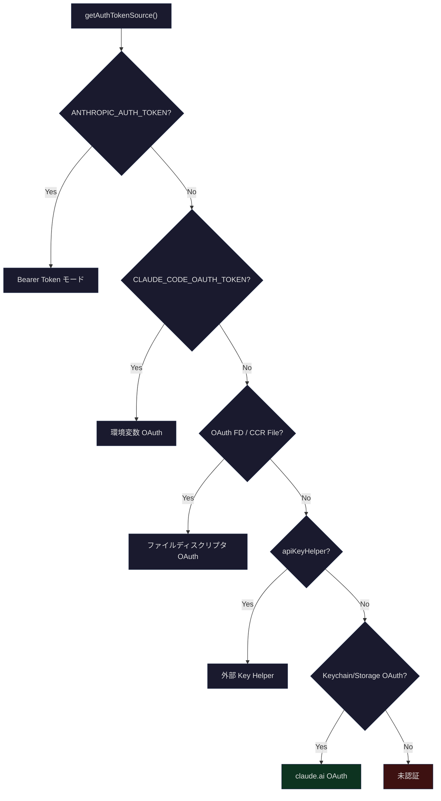
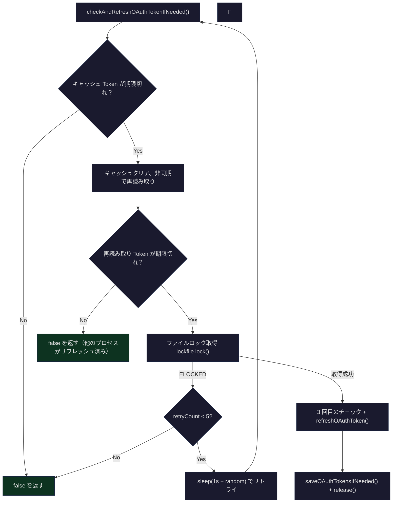

## 問題提起

初めて `claude` コマンドを実行すると、ブラウザが開いて OAuth ログインに誘導されます。数秒後にターミナルに「Login successful」と表示され、快適にコーディングを始められます。数時間後に Token が期限切れになっても、まったく気づきません——システムがバックグラウンドで静かに Token をリフレッシュしているからです。リモート Bridge モードに切り替えると、JWT が自動的にデコード・スケジュールされ、有効期限の 5 分前にリフレッシュされます。この裏側には、API Key・OAuth 2.0・JWT の 3 つの認証方式をカバーする全体的なアーキテクチャがあります。

このアーキテクチャが答えるべき核心的な問いは以下の通りです：

1. **認証情報の多様性**：環境変数の API Key、OAuth Token、ファイルディスクリプタ経由の Token、Bridge モードの JWT をどう統一的に扱うか？
2. **安全な保存**：Token はどこに保存するのか？macOS は Keychain、Linux は平文ファイル——この差異をどう抽象化するか？
3. **ライフサイクル管理**：Token の期限切れにどう対応するか？複数プロセスが同時にリフレッシュする際の競合をどう回避するか？
4. **コールドスタート最適化**：macOS Keychain の読み取りは 1 回あたり約 32ms、2 回の逐次読み取りで約 65ms——どう最適化するか？

本記事では、認証方式の全体像から始めて、Keychain 統合、OAuth フロー、Token リフレッシュスケジューリング、Bridge モードの JWT 管理へと段階的に深掘りし、最終的に Claude Code 認証システムの全体像を描き出します。

## 認証方式の全体像

Claude Code は複数の認証方式をサポートしており、優先順位は高い順に以下のとおりです：



認証ソースの判定ロジックは `src/utils/auth.ts` の `getAuthTokenSource()` 関数にあります：

```typescript
// src/utils/auth.ts (L153-206)
export function getAuthTokenSource() {
  // --bare: API-key-only。apiKeyHelper が唯一許可される bearer-token ソース
  if (isBareMode()) {
    if (getConfiguredApiKeyHelper()) {
      return { source: 'apiKeyHelper' as const, hasToken: true }
    }
    return { source: 'none' as const, hasToken: false }
  }

  if (process.env.ANTHROPIC_AUTH_TOKEN && !isManagedOAuthContext()) {
    return { source: 'ANTHROPIC_AUTH_TOKEN' as const, hasToken: true }
  }

  if (process.env.CLAUDE_CODE_OAUTH_TOKEN) {
    return { source: 'CLAUDE_CODE_OAUTH_TOKEN' as const, hasToken: true }
  }

  // ファイルディスクリプタ経由の OAuth Token（または CCR ディスクフォールバック）をチェック
  const oauthTokenFromFd = getOAuthTokenFromFileDescriptor()
  if (oauthTokenFromFd) {
    if (process.env.CLAUDE_CODE_OAUTH_TOKEN_FILE_DESCRIPTOR) {
      return { source: 'CLAUDE_CODE_OAUTH_TOKEN_FILE_DESCRIPTOR', hasToken: true }
    }
    return { source: 'CCR_OAUTH_TOKEN_FILE', hasToken: true }
  }

  const oauthTokens = getClaudeAIOAuthTokens()
  if (shouldUseClaudeAIAuth(oauthTokens?.scopes) && oauthTokens?.accessToken) {
    return { source: 'claude.ai' as const, hasToken: true }
  }

  return { source: 'none' as const, hasToken: false }
}
```

この関数の設計には重要な制約があります：**管理コンテキストの分離**です。Claude Desktop や CCR（Claude Code Remote）が OAuth 経由で CLI を起動した場合、`isManagedOAuthContext()` を検出して、ユーザーローカルの `apiKeyHelper` や環境変数 API Key へのフォールバックを阻止し、コンテキスト間の認証情報漏洩を防止します。

### 3 つのコア認証モード

| モード | ソース | リフレッシュ可能 | 使用場面 |
|------|------|-----------|---------|
| **API Key** | `ANTHROPIC_API_KEY` 環境変数または `apiKeyHelper` | 不可 | CI/CD、サードパーティ連携、`--bare` モード |
| **OAuth 2.0** | ブラウザ認可フロー + Keychain 保存 | 可 | 対話型ターミナル、Claude.ai サブスクリプションユーザー |
| **JWT** | Bridge `/bridge` エンドポイントが発行 | 可（スケジュールリフレッシュ） | リモート Bridge モード、Claude Desktop |

このうち OAuth 2.0 が最も中心的な認証方式であり、本記事の焦点です。Anthropic の OAuth 実装は RFC 7636（PKCE）拡張に準拠しており、自動（ブラウザコールバック）と手動（コード貼り付け）の 2 つの認可コード取得方式をサポートしています。

## macOS Keychain 統合

### ストレージアーキテクチャ

Token ストレージは `SecureStorage` インターフェースによりプラットフォームの差異を抽象化しています：

```typescript
// src/utils/secureStorage/index.ts (L9-17)
export function getSecureStorage(): SecureStorage {
  if (process.platform === 'darwin') {
    return createFallbackStorage(macOsKeychainStorage, plainTextStorage)
  }
  // TODO: add libsecret support for Linux
  return plainTextStorage
}
```

macOS では「Keychain 優先、平文ファイルフォールバック」の `FallbackStorage` 戦略を採用しています。これは単純な「A が失敗したら B を試す」ではありません——`createFallbackStorage` はストレージバックエンド間のデータ移行も処理します：

```typescript
// src/utils/secureStorage/fallbackStorage.ts (L27-60)
update(data: SecureStorageData): { success: boolean; warning?: string } {
  const primaryDataBefore = primary.read()
  const result = primary.update(data)

  if (result.success) {
    // primary への初回移行成功時に secondary を削除
    // host とコンテナが .claude を共有している場合の認証情報を維持
    if (primaryDataBefore === null) {
      secondary.delete()
    }
    return result
  }

  const fallbackResult = secondary.update(data)
  if (fallbackResult.success) {
    // primary の書き込みが失敗したが、primary に古いエントリが残っている可能性がある
    // read() は primary を優先するため、古いエントリが secondary に書き込んだ新しいデータを隠蔽する
    // サーバー側でローテーションされた古い refresh token を使用 → /login 無限ループ
    if (primaryDataBefore !== null) {
      primary.delete()
    }
    return { success: true, warning: fallbackResult.warning }
  }

  return { success: false }
}
```

このコードには巧妙なバグ修正（#30337）が含まれています：Keychain への書き込みが失敗してファイルストレージにフォールバックした際、Keychain 内の古いエントリを削除しないと、`read()` が Keychain 内の期限切れ refresh token を優先的に返してしまい、ユーザーが `/login` の無限ループに陥ります。

### Keychain の読み書き実装

macOS Keychain の読み書きは `security` CLI ツールを通じて行われます。書き込み時には 4096 バイトの stdin バッファ制限があります：

```typescript
// src/utils/secureStorage/macOsKeychainStorage.ts (L23-24)
const SECURITY_STDIN_LINE_LIMIT = 4096 - 64

// L97-146 update メソッド
update(data: SecureStorageData): { success: boolean; warning?: string } {
  clearKeychainCache()
  const jsonString = jsonStringify(data)
  const hexValue = Buffer.from(jsonString, 'utf-8').toString('hex')

  const command = `add-generic-password -U -a "${username}" -s "${storageServiceName}" -X "${hexValue}"\n`

  if (command.length <= SECURITY_STDIN_LINE_LIMIT) {
    // stdin 経由を優先し、プロセス監視ツール（CrowdStrike 等）から認証情報を隠蔽
    result = execaSync('security', ['-i'], { input: command, ... })
  } else {
    // stdin 制限を超えた場合は argv にフォールバック
    result = execaSync('security', ['add-generic-password', '-U', '-a', ...], ...)
  }
}
```

認証情報が 16 進数にエンコードされている点に注目してください——これは暗号化ではなく、JSON 内の特殊文字がシェルレベルで解析問題を起こすのを防ぐためです。`security -i`（stdin モード）の使用はセキュリティ上の配慮です：CrowdStrike 等のエンドポイントセキュリティソフトウェアはプロセスのコマンドライン引数を監視するため、stdin 経由の受け渡しにより `security -i` だけが見えるようになります。

### キャッシュと Stale-While-Error

Keychain 読み取りの同期パスは 1 回あたり約 500ms かかります（`security` CLI のスポーン）。多数の MCP connector が同時に認証する場合、キャッシュなしではイベントループが数秒間ブロックされます。そのため、TTL 付きキャッシュと stale-while-error 戦略が実装されています：

```typescript
// src/utils/secureStorage/macOsKeychainHelpers.ts (L69)
export const KEYCHAIN_CACHE_TTL_MS = 30_000

// src/utils/secureStorage/macOsKeychainStorage.ts (L28-66)
read(): SecureStorageData | null {
  const prev = keychainCacheState.cache
  if (Date.now() - prev.cachedAt < KEYCHAIN_CACHE_TTL_MS) {
    return prev.data  // 30秒以内はキャッシュを直接返す
  }

  try {
    // ...security find-generic-password を実行...
  } catch (_e) {
    // Stale-while-error: 古いデータがあり更新に失敗した場合、古いデータを引き続き使用
    // 単一の security spawn 失敗で「未ログイン」状態になるのを防止
    if (prev.data !== null) {
      keychainCacheState.cache = { data: prev.data, cachedAt: Date.now() }
      return prev.data
    }
    keychainCacheState.cache = { data: null, cachedAt: Date.now() }
    return null
  }
}
```

30 秒の TTL はトレードオフの結果です：OAuth Token は通常時間単位で期限切れになり、クロスプロセスの唯一の書き込み者は別の Claude Code インスタンスの `/login` や Token リフレッシュです。このシナリオでは 30 秒の陳腐さは十分許容範囲内です。

### startKeychainPrefetch：コールドスタート最適化

macOS では起動のたびに 2 つの Keychain エントリを読み取る必要があります：OAuth Token（約 32ms）と Legacy API Key（約 33ms）。逐次読み取りは約 65ms のブロックを意味します。`startKeychainPrefetch()` はこの 2 つの読み取りを並列化し、`main.tsx` のモジュールロードと並行して実行します：

```typescript
// src/utils/secureStorage/keychainPrefetch.ts (L69-89)
export function startKeychainPrefetch(): void {
  if (process.platform !== 'darwin' || prefetchPromise || isBareMode()) return

  // 2 つのサブプロセスを即座に並列起動し、main.tsx の import と並行実行
  const oauthSpawn = spawnSecurity(
    getMacOsKeychainStorageServiceName(CREDENTIALS_SERVICE_SUFFIX),
  )
  const legacySpawn = spawnSecurity(getMacOsKeychainStorageServiceName())

  prefetchPromise = Promise.all([oauthSpawn, legacySpawn]).then(
    ([oauth, legacy]) => {
      if (!oauth.timedOut) primeKeychainCacheFromPrefetch(oauth.stdout)
      if (!legacy.timedOut) legacyApiKeyPrefetch = { stdout: legacy.stdout }
    },
  )
}
```

このコードは `main.tsx` の先頭で呼び出されます——ほとんどの import よりも前です：

```typescript
// src/main.tsx (L5-20)
// これらの副作用は他のすべての import の前に実行する必要がある：
// 1. profileCheckpoint でエントリ時刻を記録
// 2. startMdmRawRead で MDM サブプロセスを起動
// 3. startKeychainPrefetch で 2 つの macOS Keychain 読み取りを起動
import { profileCheckpoint } from './utils/startupProfiler.js';
profileCheckpoint('main_tsx_entry');
import { startMdmRawRead } from './utils/settings/mdm/rawRead.js';
startMdmRawRead();
import { ensureKeychainPrefetchCompleted, startKeychainPrefetch }
  from './utils/secureStorage/keychainPrefetch.js';
startKeychainPrefetch();
```

ここには巧妙なモジュール設計の制約があります：`keychainPrefetch.ts` は `execa` を import **してはいけません**。Bun の ESM ラッパーは任意のシンボルにアクセスすると、モジュール全体の初期化チェーンを実行します——`execa -> human-signals -> cross-spawn` というチェーンに約 58ms の同期初期化が必要で、プリフェッチの効果を完全に相殺してしまいます。そのため、prefetch モジュールはネイティブの `child_process.execFile` を使用しています。

```mermaid
sequenceDiagram
  participant M as main.tsx
  participant P as keychainPrefetch
  participant K1 as security CLI (OAuth)
  participant K2 as security CLI (Legacy)
  participant I as Module Imports (~65ms)

  M->>P: startKeychainPrefetch()
  P->>K1: execFile('security', [...]) ノンブロッキング
  P->>K2: execFile('security', [...]) ノンブロッキング

  rect rgb(30, 30, 50)
    Note over M,I: 並列実行
    M->>I: import モジュールチェーン (~65ms)
    K1-->>P: OAuth Token (~32ms)
    K2-->>P: Legacy API Key (~33ms)
  end

  P->>P: primeKeychainCacheFromPrefetch()
  M->>P: ensureKeychainPrefetchCompleted() (ほぼゼロコスト)
```



`primeKeychainCacheFromPrefetch` はキャッシュが未アクセスの場合のみ書き込みます——同期の `read()` や `update()` がすでに実行された場合、プリフェッチ結果は破棄され、権威性が保証されます：

```typescript
// src/utils/secureStorage/macOsKeychainHelpers.ts (L98-111)
export function primeKeychainCacheFromPrefetch(stdout: string | null): void {
  if (keychainCacheState.cache.cachedAt !== 0) return  // キャッシュが既にアクセス済み
  let data: SecureStorageData | null = null
  if (stdout) {
    try {
      data = JSON.parse(stdout)  // 注意：ここでは意図的に jsonParse() を使用しない
    } catch {
      return  // 不正なプリフェッチ結果——sync read() で再取得させる
    }
  }
  keychainCacheState.cache = { data, cachedAt: Date.now() }
}
```

## OAuth 2.0 フロー

### PKCE 認可コードフロー

Claude Code は完全な OAuth 2.0 Authorization Code Flow with PKCE (RFC 7636) を実装しています。コア実装は `src/services/oauth/` ディレクトリ内にあり、4 つのファイルで構成されています：

- `crypto.ts` — PKCE 暗号プリミティブ（code_verifier, code_challenge, state）
- `client.ts` — OAuth クライアント（URL 構築、Token 交換、リフレッシュ、Profile 取得）
- `auth-code-listener.ts` — ローカル HTTP サーバーで認可コードコールバックをキャプチャ
- `index.ts` — `OAuthService` クラスが全体フローをオーケストレーション

PKCE の暗号部分は非常に簡潔です：

```typescript
// src/services/oauth/crypto.ts (L1-23)
import { createHash, randomBytes } from 'crypto'

function base64URLEncode(buffer: Buffer): string {
  return buffer
    .toString('base64')
    .replace(/\+/g, '-')
    .replace(/\//g, '_')
    .replace(/=/g, '')
}

export function generateCodeVerifier(): string {
  return base64URLEncode(randomBytes(32))
}

export function generateCodeChallenge(verifier: string): string {
  const hash = createHash('sha256')
  hash.update(verifier)
  return base64URLEncode(hash.digest())
}

export function generateState(): string {
  return base64URLEncode(randomBytes(32))
}
```

`code_verifier` は 32 バイトの乱数、`code_challenge` はその SHA-256 ハッシュです。これにより、認可コードが傍受されても、攻撃者は Token 交換を完了できません——元の `code_verifier` を持っていないためです。

### デュアルパス認可：自動 vs 手動

`OAuthService.startOAuthFlow()` は 2 つの認可コード取得方式を同時にサポートしています：

```typescript
// src/services/oauth/index.ts (L32-131)
async startOAuthFlow(
  authURLHandler: (url: string, automaticUrl?: string) => Promise<void>,
  options?: { loginWithClaudeAi?: boolean; skipBrowserOpen?: boolean; ... },
): Promise<OAuthTokens> {
  // 1. ローカル HTTP サーバーを起動
  this.authCodeListener = new AuthCodeListener()
  this.port = await this.authCodeListener.start()

  // 2. PKCE 値と state を生成
  const codeChallenge = crypto.generateCodeChallenge(this.codeVerifier)
  const state = crypto.generateState()

  // 3. 2 つの URL を構築：手動用と自動用
  const manualFlowUrl = client.buildAuthUrl({ ...opts, isManual: true })
  const automaticFlowUrl = client.buildAuthUrl({ ...opts, isManual: false })

  // 4. 認可コードを待機（自動または手動の先着順）
  const authorizationCode = await this.waitForAuthorizationCode(
    state,
    async () => {
      if (options?.skipBrowserOpen) {
        await authURLHandler(manualFlowUrl, automaticFlowUrl)
      } else {
        await authURLHandler(manualFlowUrl)  // ユーザーに手動オプションを表示
        await openBrowser(automaticFlowUrl)  // 自動フローを試行
      }
    },
  )

  // 5. 認可コードで Token を交換
  const tokenResponse = await client.exchangeCodeForTokens(
    authorizationCode, state, this.codeVerifier, this.port!,
    !isAutomaticFlow, options?.expiresIn,
  )

  // 6. ユーザー Profile を取得（サブスクリプションタイプ、レート制限レベル等）
  const profileInfo = await client.fetchProfileInfo(tokenResponse.access_token)

  return this.formatTokens(tokenResponse, profileInfo.subscriptionType, ...)
}
```

自動フローと手動フローの主な違いは `redirect_uri` です：

```typescript
// src/services/oauth/client.ts (L76-79)
authUrl.searchParams.append(
  'redirect_uri',
  isManual
    ? getOauthConfig().MANUAL_REDIRECT_URL    // 認可コードを表示してユーザーにコピーさせる
    : `http://localhost:${port}/callback`,     // ローカルサーバーが自動キャプチャ
)
```

自動フローでは、OAuth プロバイダーがユーザーを `http://localhost:{port}/callback?code=AUTH_CODE&state=STATE` にリダイレクトし、ローカルの `AuthCodeListener` がこのリクエストをキャプチャします。

### AuthCodeListener：ローカルコールバックサーバー

`AuthCodeListener` は一時的な HTTP サーバーで、ライフサイクルは 1 回の認可フローのみをカバーします：

```typescript
// src/services/oauth/auth-code-listener.ts (L18-53)
export class AuthCodeListener {
  private localServer: Server
  private pendingResponse: ServerResponse | null = null  // リダイレクト用の遅延レスポンス

  async start(port?: number): Promise<number> {
    return new Promise((resolve, reject) => {
      // ポート競合を回避するため OS 割り当てのポートを使用
      this.localServer.listen(port ?? 0, 'localhost', () => {
        const address = this.localServer.address() as AddressInfo
        this.port = address.port
        resolve(this.port)
      })
    })
  }
}
```

重要な設計上の詳細として、サーバーは `/callback` リクエストに即座にレスポンスしません。まず認可コードを抽出し、次に `ServerResponse` を `pendingResponse` に保存します。こうすることで、外側の `OAuthService` が Token 交換完了後に、結果に応じて成功ページまたはエラーページにリダイレクトするか決定できます：

```typescript
// src/services/oauth/auth-code-listener.ts (L80-105)
handleSuccessRedirect(scopes: string[]): void {
  if (!this.pendingResponse) return
  const successUrl = shouldUseClaudeAIAuth(scopes)
    ? getOauthConfig().CLAUDEAI_SUCCESS_URL
    : getOauthConfig().CONSOLE_SUCCESS_URL
  this.pendingResponse.writeHead(302, { Location: successUrl })
  this.pendingResponse.end()
  this.pendingResponse = null
}
```

### OAuth Scope 体系

Claude Code の OAuth scope は階層的な権限モデルを定義しています：

```typescript
// src/constants/oauth.ts (L33-58)
export const CLAUDE_AI_INFERENCE_SCOPE = 'user:inference' as const
export const CLAUDE_AI_PROFILE_SCOPE = 'user:profile' as const
const CONSOLE_SCOPE = 'org:create_api_key' as const

// Console OAuth scopes - API Key 作成
export const CONSOLE_OAUTH_SCOPES = [
  CONSOLE_SCOPE,
  CLAUDE_AI_PROFILE_SCOPE,
] as const

// Claude.ai OAuth scopes - サブスクリプションユーザー
export const CLAUDE_AI_OAUTH_SCOPES = [
  CLAUDE_AI_PROFILE_SCOPE,
  CLAUDE_AI_INFERENCE_SCOPE,
  'user:sessions:claude_code',
  'user:mcp_servers',
  'user:file_upload',
] as const

// ログイン時にすべての scope の和集合を要求
export const ALL_OAUTH_SCOPES = Array.from(
  new Set([...CONSOLE_OAUTH_SCOPES, ...CLAUDE_AI_OAUTH_SCOPES]),
)
```

`user:inference` scope は、ユーザーが Claude.ai サブスクリプション加入者（Pro/Max/Team/Enterprise）かどうかを判断する鍵です。`shouldUseClaudeAIAuth()` 関数はこの scope をチェックして認証パスを決定します：

```typescript
// src/services/oauth/client.ts (L38-40)
export function shouldUseClaudeAIAuth(scopes: string[] | undefined): boolean {
  return Boolean(scopes?.includes(CLAUDE_AI_INFERENCE_SCOPE))
}
```

## Token の保存とリフレッシュ

### Token の読み取りパス

`getClaudeAIOAuthTokens()` はシステム内で OAuth Token を読み取る唯一のエントリポイントで、Keychain の重複読み取りを避けるために `memoize` でラップされています：

```typescript
// src/utils/auth.ts (L1255-1300)
export const getClaudeAIOAuthTokens = memoize((): OAuthTokens | null => {
  if (isBareMode()) return null

  // 優先度 1：環境変数（推論専用 Token、リフレッシュ不可）
  if (process.env.CLAUDE_CODE_OAUTH_TOKEN) {
    return {
      accessToken: process.env.CLAUDE_CODE_OAUTH_TOKEN,
      refreshToken: null,
      expiresAt: null,
      scopes: ['user:inference'],
      subscriptionType: null,
      rateLimitTier: null,
    }
  }

  // 優先度 2：ファイルディスクリプタ（CCR / Claude Desktop）
  const oauthTokenFromFd = getOAuthTokenFromFileDescriptor()
  if (oauthTokenFromFd) {
    return { accessToken: oauthTokenFromFd, refreshToken: null, ... }
  }

  // 優先度 3：安全ストレージ（Keychain / ファイル）
  try {
    const secureStorage = getSecureStorage()
    const storageData = secureStorage.read()
    const oauthData = storageData?.claudeAiOauth
    if (!oauthData?.accessToken) return null
    return oauthData
  } catch (error) {
    logError(error)
    return null
  }
})
```

環境変数やファイルディスクリプタ経由の Token には `refreshToken` と `expiresAt` がない点に注目してください——これらは「推論専用」の短期 Token で、外部システムがライフサイクルを管理します。

### Token の期限切れ検出

期限切れ検出は 5 分間のバッファを使用し、Token が実際に期限切れになる前にリフレッシュをトリガーします：

```typescript
// src/services/oauth/client.ts (L344-353)
export function isOAuthTokenExpired(expiresAt: number | null): boolean {
  if (expiresAt === null) return false
  const bufferTime = 5 * 60 * 1000  // 5 分
  const now = Date.now()
  return (now + bufferTime) >= expiresAt
}
```

### マルチプロセスセーフな Token リフレッシュ

Token リフレッシュは認証システム全体で最も複雑な部分です。次のシナリオを考えてみましょう：ユーザーが 3 つの `claude` プロセスを同時に実行しており、Token が同時に期限切れになります。3 つのプロセスがすべてリフレッシュを試みると、refresh token は 1 つだけが有効（サーバー側でローテーション）で、残りの 2 つは失敗します。

解決策はファイルロック + ダブルチェックです：

```typescript
// src/utils/auth.ts (L1447-1559)
async function checkAndRefreshOAuthTokenIfNeededImpl(
  retryCount: number,
  force: boolean,
): Promise<boolean> {
  const MAX_RETRIES = 5

  // 1 回目のチェック：キャッシュ内の Token が期限切れか
  const tokens = getClaudeAIOAuthTokens()
  if (!force && (!tokens?.refreshToken || !isOAuthTokenExpired(tokens.expiresAt))) {
    return false
  }

  // 2 回目のチェック：非同期で再読み取り（別のプロセスが既にリフレッシュした可能性）
  getClaudeAIOAuthTokens.cache?.clear?.()
  clearKeychainCache()
  const freshTokens = await getClaudeAIOAuthTokensAsync()
  if (!freshTokens?.refreshToken || !isOAuthTokenExpired(freshTokens.expiresAt)) {
    return false  // 別のプロセスが既にリフレッシュを完了
  }

  // ファイルロックを取得
  const claudeDir = getClaudeConfigHomeDir()
  let release
  try {
    release = await lockfile.lock(claudeDir)
  } catch (err) {
    if ((err as { code?: string }).code === 'ELOCKED') {
      if (retryCount < MAX_RETRIES) {
        await sleep(1000 + Math.random() * 1000)  // ランダムバックオフ
        return checkAndRefreshOAuthTokenIfNeededImpl(retryCount + 1, force)
      }
      return false
    }
  }

  try {
    // 3 回目のチェック：ロック取得後に再度検証
    const lockedTokens = await getClaudeAIOAuthTokensAsync()
    if (!lockedTokens?.refreshToken || !isOAuthTokenExpired(lockedTokens.expiresAt)) {
      return false  // ロック取得中に別のプロセスがリフレッシュを完了
    }

    // 実際のリフレッシュ
    const refreshedTokens = await refreshOAuthToken(lockedTokens.refreshToken, {
      scopes: shouldUseClaudeAIAuth(lockedTokens.scopes) ? undefined : lockedTokens.scopes,
    })
    saveOAuthTokensIfNeeded(refreshedTokens)
    return true
  } finally {
    await release()
  }
}
```



三重チェックパターンの本質は以下の通りです：1 回目のチェックは高速パス（メモリキャッシュ）、2 回目のチェックは不要なロック競合を回避（非同期 Keychain 読み取り）、3 回目のチェックはロック取得後の最終確認です。ランダムバックオフ（`1000 + Math.random() * 1000`）により、複数プロセスが同じタイミングでリトライするのを防ぎます。

### Token リフレッシュにおける Scope 拡張

リフレッシュ時の scope 処理には注目すべき設計があります：

```typescript
// src/services/oauth/client.ts (L155-163)
const requestBody = {
  grant_type: 'refresh_token',
  refresh_token: refreshToken,
  client_id: getOauthConfig().CLIENT_ID,
  // バックエンドの refresh-token 認可は scope 拡張を許可している
  // そのため新しい scope 追加前に発行された Token でも安全
  scope: (requestedScopes?.length ? requestedScopes : CLAUDE_AI_OAUTH_SCOPES).join(' '),
}
```

Claude.ai サブスクリプションユーザーの場合、リフレッシュ時に現在の scope を渡さず、デフォルトの `CLAUDE_AI_OAUTH_SCOPES` を使用します——これにより、ユーザーに再ログインを要求せずに scope を拡張できます（例：`user:file_upload` の追加）。バックエンドは `ALLOWED_SCOPE_EXPANSIONS` ホワイトリストで、リフレッシュ経由で取得可能な scope を制御します。

### Profile 情報の最適化された取得

Token リフレッシュのたびに `/api/oauth/profile` の呼び出しが伴う可能性があり、サブスクリプションタイプとレート制限を取得します。しかし、この呼び出しはフルデプロイメント環境で 1 日あたり約 700 万回にのぼります。そのためスキップロジックが導入されています：

```typescript
// src/services/oauth/client.ts (L189-211)
const haveProfileAlready =
  config.oauthAccount?.billingType !== undefined &&
  config.oauthAccount?.accountCreatedAt !== undefined &&
  config.oauthAccount?.subscriptionCreatedAt !== undefined &&
  existing?.subscriptionType != null &&
  existing?.rateLimitTier != null

const profileInfo = haveProfileAlready
  ? null  // 約 700 万 req/day をスキップ
  : await fetchProfileInfo(accessToken)
```

このコードのコメントには、微妙な競合状態が詳しく記録されています：`CLAUDE_CODE_OAUTH_REFRESH_TOKEN` の再ログインパスでは、`installOAuthTokens` が返った後に `performLogout()` を実行してセキュアストレージをクリアします。この時点で `subscriptionType` として `null` を返すと、`saveOAuthTokensIfNeeded` が有料ユーザーのサブスクリプションタイプを永続的に失います。既存の値（`existing?.subscriptionType`）を渡すことでこの問題を回避しています。

## Bridge モードの JWT

### JWT デコード

Bridge モードでは、サーバーが発行する worker JWT がセッション認証に使用されます。`jwtUtils.ts` は署名を検証しない JWT デコードを提供しています——検証はサーバー側の責任であり、クライアントはリフレッシュをスケジュールするために `exp` クレームを読み取るだけです：

```typescript
// src/bridge/jwtUtils.ts (L21-32)
export function decodeJwtPayload(token: string): unknown | null {
  // sk-ant-si- プレフィックスを除去（session-ingress Token）
  const jwt = token.startsWith('sk-ant-si-')
    ? token.slice('sk-ant-si-'.length)
    : token
  const parts = jwt.split('.')
  if (parts.length !== 3 || !parts[1]) return null
  try {
    return jsonParse(Buffer.from(parts[1], 'base64url').toString('utf8'))
  } catch {
    return null
  }
}
```

### createTokenRefreshScheduler

これは Bridge モードのコアコンポーネントです——スタンドアロン bridge と REPL bridge の両方で使用される汎用 Token リフレッシュスケジューラーです：

```typescript
// src/bridge/jwtUtils.ts (L72-88)
export function createTokenRefreshScheduler({
  getAccessToken,
  onRefresh,
  label,
  refreshBufferMs = TOKEN_REFRESH_BUFFER_MS,  // デフォルト 5 分
}: {
  getAccessToken: () => string | undefined | Promise<string | undefined>
  onRefresh: (sessionId: string, oauthToken: string) => void
  label: string
  refreshBufferMs?: number
}): {
  schedule: (sessionId: string, token: string) => void
  scheduleFromExpiresIn: (sessionId: string, expiresInSeconds: number) => void
  cancel: (sessionId: string) => void
  cancelAll: () => void
}
```

スケジューラーのコアは「世代カウンター」パターン（generation counter）で、非同期リフレッシュと再スケジュール間の競合状態を解決します：

```typescript
// src/bridge/jwtUtils.ts (L89-100)
const timers = new Map<string, ReturnType<typeof setTimeout>>()
const failureCounts = new Map<string, number>()
const generations = new Map<string, number>()

function nextGeneration(sessionId: string): number {
  const gen = (generations.get(sessionId) ?? 0) + 1
  generations.set(sessionId, gen)
  return gen
}
```

`schedule()` や `cancel()` が呼ばれるたびに、対応するセッションの generation がインクリメントされます。非同期の `doRefresh()` は完了後に generation が一致するかチェックします——一致しない場合、スケジュールが置き換えられたことを意味し、現在のリフレッシュは中止されます：

```typescript
// src/bridge/jwtUtils.ts (L165-181)
async function doRefresh(sessionId: string, gen: number): Promise<void> {
  let oauthToken: string | undefined
  try {
    oauthToken = await getAccessToken()
  } catch (err) { ... }

  // await 中にセッションがキャンセルまたは再スケジュールされた場合、generation が変化する
  if (generations.get(sessionId) !== gen) {
    logForDebugging(`... stale (gen ${gen} vs ${generations.get(sessionId)}), skipping`)
    return  // 孤立タイマーを回避
  }

  onRefresh(sessionId, oauthToken)

  // 長期セッションの認証状態を維持するため後続リフレッシュを設定
  const timer = setTimeout(doRefresh, FALLBACK_REFRESH_INTERVAL_MS, sessionId, gen)
  timers.set(sessionId, timer)
}
```

REPL bridge での実際の使用例：

```typescript
// src/bridge/remoteBridgeCore.ts (L317-320)
const refresh = createTokenRefreshScheduler({
  refreshBufferMs: cfg.token_refresh_buffer_ms,
  getAccessToken: async () => {
    // 無条件で OAuth をリフレッシュしてから /bridge を呼び出す
    await checkAndRefreshOAuthTokenIfNeeded()
    return getClaudeAIOAuthTokens()?.accessToken
  },
  onRefresh: async (sessionId, oauthToken) => {
    // 各 /bridge 呼び出しで epoch がバンプされる
    // JWT のみの交換は古い epoch の heartbeat を残す → 20 秒以内に 409
    const bridge = await callBridgeEndpoint(sessionId, oauthToken)
    // 新しい JWT + 新しい epoch でトランスポート層を再構築
    await rebuildTransport(bridge)
  },
  label: 'repl-v2',
})
```

### 失敗リトライと終了

スケジューラーは最大 3 回の連続失敗までリトライする仕組みを実装しています：

```typescript
// src/bridge/jwtUtils.ts (L57-60)
const MAX_REFRESH_FAILURES = 3
const REFRESH_RETRY_DELAY_MS = 60_000  // 1 分後にリトライ

// L185-205
if (!oauthToken) {
  const failures = (failureCounts.get(sessionId) ?? 0) + 1
  failureCounts.set(sessionId, failures)
  if (failures < MAX_REFRESH_FAILURES) {
    const retryTimer = setTimeout(doRefresh, REFRESH_RETRY_DELAY_MS, sessionId, gen)
    timers.set(sessionId, retryTimer)
  }
  return  // 3 回を超えた場合、リフレッシュチェーンを放棄
}

// 成功後に失敗カウンターをリセット
failureCounts.delete(sessionId)
```

## /login と /logout コマンド

### /login フロー

`/login` コマンドは `ConsoleOAuthFlow` コンポーネントをレンダリングし、ユーザーに OAuth 認可を案内します。ログイン成功後、一連のリセットとリフレッシュ操作がトリガーされます：

```typescript
// src/commands/login/login.tsx (L19-58)
export async function call(onDone, context): Promise<React.ReactNode> {
  return <Login onDone={async success => {
    context.onChangeAPIKey()
    // 署名ブロックは API Key に紐づいている——切り替え後にクリアが必要
    context.setMessages(stripSignatureBlocks)

    if (success) {
      resetCostState()                         // 費用統計をリセット
      void refreshRemoteManagedSettings()      // リモート管理設定をリフレッシュ
      void refreshPolicyLimits()               // ポリシー制限をリフレッシュ
      resetUserCache()                         // ユーザーキャッシュをクリア
      refreshGrowthBookAfterAuthChange()       // フィーチャーフラグをリフレッシュ
      clearTrustedDeviceToken()                // 古いデバイス Token をクリア
      void enrollTrustedDevice()               // 新しいデバイスを登録
      resetBypassPermissionsCheck()            // 権限チェックをリセット
      // authVersion をインクリメントし、auth 依存の hook にデータ再取得をトリガー
      context.setAppState(prev => ({
        ...prev,
        authVersion: prev.authVersion + 1,
      }))
    }
    onDone(success ? 'Login successful' : 'Login interrupted')
  }} />
}
```

`authVersion` のインクリメントは巧妙な React パターンです——数値を変更することで、auth の変更を監視するすべての hook（MCP サーバーリスト等）を再実行させます。

### /logout フロー

ログアウトは特定の順序でクリーンアップ操作を実行する必要があります：

```typescript
// src/commands/logout/logout.tsx (L17-48)
export async function performLogout({ clearOnboarding = false }): Promise<void> {
  // 1. まずテレメトリデータをフラッシュ（認証情報クリア前に。org データの漏洩を防止）
  const { flushTelemetry } = await import('../../utils/telemetry/instrumentation.js')
  await flushTelemetry()

  // 2. API Key を削除
  await removeApiKey()

  // 3. すべてのセキュアストレージデータをクリア
  const secureStorage = getSecureStorage()
  secureStorage.delete()

  // 4. 認証関連キャッシュをクリア
  await clearAuthRelatedCaches()

  // 5. 設定内の OAuth アカウント情報をクリア
  saveGlobalConfig(current => {
    const updated = { ...current }
    if (clearOnboarding) {
      updated.hasCompletedOnboarding = false
      updated.subscriptionNoticeCount = 0
      updated.hasAvailableSubscription = false
    }
    updated.oauthAccount = undefined
    return updated
  })
}
```

重要な順序：テレメトリは認証情報のクリア前にフラッシュする必要があります。そうしないと後続のテレメトリイベントで org コンテキストが失われます。`flushTelemetry` が lazy import を使用しているのも別のパフォーマンス最適化です——OpenTelemetry パッケージは約 1.1MB あり、起動時にはロードしません。

`clearAuthRelatedCaches` は認証関連のすべてのメモリキャッシュをクリアします：

```typescript
// src/commands/logout/logout.tsx (L51-71)
export async function clearAuthRelatedCaches(): Promise<void> {
  getClaudeAIOAuthTokens.cache?.clear?.()     // OAuth Token キャッシュ
  clearTrustedDeviceTokenCache()               // 信頼済みデバイス Token
  clearBetasCaches()                           // Beta フィーチャーフラグ
  clearToolSchemaCache()                       // ツール Schema キャッシュ
  resetUserCache()                             // ユーザーデータキャッシュ
  refreshGrowthBookAfterAuthChange()           // GrowthBook リフレッシュ
  getGroveNoticeConfig.cache?.clear?.()        // Grove 設定
  getGroveSettings.cache?.clear?.()
  await clearRemoteManagedSettingsCache()      // リモート管理設定
  await clearPolicyLimitsCache()               // ポリシー制限
}
```

## セキュリティ上の考慮事項

### 認証情報の受け渡しの安全性

macOS では、認証情報はコマンドライン引数ではなく `security -i`（stdin）経由で渡され、エンドポイント検出ソフトウェア（EDR）による記録を防止します。ペイロードが stdin バッファ制限を超えた場合のみ argv にフォールバックします。

### CSRF 防護

OAuth フローの `state` パラメータは、標準的な CSRF 防護だけでなく、自動フローと手動フローの関連付けにも使用されます：

```typescript
// src/services/oauth/auth-code-listener.ts (L152-169)
private validateAndRespond(authCode, state, res): void {
  if (!authCode) {
    res.writeHead(400)
    this.reject(new Error('No authorization code received'))
    return
  }
  if (state !== this.expectedState) {
    res.writeHead(400)
    res.end('Invalid state parameter')
    this.reject(new Error('Invalid state parameter'))
    return
  }
  this.pendingResponse = res
  this.resolve(authCode)
}
```

### Keychain ロック検出

SSH セッションでは、macOS Keychain がロック状態になっている場合があります。システムはこの状態を検出し、UI でユーザーに通知します：

```typescript
// src/utils/secureStorage/macOsKeychainStorage.ts (L211-231)
export function isMacOsKeychainLocked(): boolean {
  if (keychainLockedCache !== undefined) return keychainLockedCache
  if (process.platform !== 'darwin') return false

  try {
    const result = execaSync('security', ['show-keychain-info'], { reject: false })
    keychainLockedCache = result.exitCode === 36  // exit code 36 = keychain locked
  } catch {
    keychainLockedCache = false
  }
  return keychainLockedCache
}
```

検出結果がキャッシュされるのは、Keychain のロック状態が CLI セッション中に変わることはなく、`execaSync` は毎回約 27ms かかるためです——仮想スクロールのメッセージ再マウントシナリオでは、各メッセージが検出を再トリガーしてしまいます。

### Token ストレージの多層防御

Token ストレージはセキュリティの段階的な構成になっています：

1. **macOS Keychain**（最高のセキュリティ）：OS レベルの暗号化ストレージ、ユーザーパスワードによるアンロックが必要
2. **平文ファイルフォールバック**（Linux/Keychain が利用不可の場合）：`~/.claude/` ディレクトリに保存、ファイルパーミッションで保護
3. **環境変数 Token**（外部管理）：保存しない、呼び出し元がセキュリティを担保

## 移行可能なパターン

Claude Code の認証システムは、いくつかの「移行可能な」シナリオをサポートしています：

### Host-Container 共有

`.claude` ディレクトリが host と container 間で共有される場合、container は通常 macOS Keychain にアクセスできません。`createFallbackStorage` がこの移行を処理します——初回 Keychain 書き込み成功時にファイルストレージのコピーを削除し、逆も同様です：

```typescript
// src/utils/secureStorage/fallbackStorage.ts (L28-39)
if (result.success) {
  // primary への初回移行時に secondary を削除
  // host とコンテナが .claude を共有している場合の認証情報を維持
  if (primaryDataBefore === null) {
    secondary.delete()
  }
  return result
}
```

### 環境の分離

異なる `CLAUDE_CONFIG_DIR` は異なる Keychain サービス名にマッピングされます：

```typescript
// src/utils/secureStorage/macOsKeychainHelpers.ts (L29-41)
export function getMacOsKeychainStorageServiceName(serviceSuffix = ''): string {
  const configDir = getClaudeConfigHomeDir()
  const isDefaultDir = !process.env.CLAUDE_CONFIG_DIR
  const dirHash = isDefaultDir
    ? ''
    : `-${createHash('sha256').update(configDir).digest('hex').substring(0, 8)}`
  return `Claude Code${getOauthConfig().OAUTH_FILE_SUFFIX}${serviceSuffix}${dirHash}`
}
```

これにより、異なる設定ディレクトリ（staging、local、カスタム OAuth URL など）の認証情報が互いに干渉しないことが保証されます。`OAUTH_FILE_SUFFIX` は prod 環境では空、staging では `-staging-oauth`、local では `-local-oauth` です。

### SSH リモート認証

`claude ssh` コマンドでリモートセッションを開始する際、Unix Socket トンネル経由で API 呼び出しをプロキシします。リモート側は認証情報を直接保持せず、`ANTHROPIC_UNIX_SOCKET` 環境変数でローカルの auth-injecting proxy を指します。`CLAUDE_CODE_OAUTH_TOKEN` はこのシナリオではプレースホルダーとして機能し、リモート側に現在のユーザーが OAuth サブスクリプション加入者であることを伝え、正しい beta header を送信するためだけに使用されます。

```typescript
// src/utils/auth.ts (L106-113)
if (process.env.ANTHROPIC_UNIX_SOCKET) {
  return !!process.env.CLAUDE_CODE_OAUTH_TOKEN
}
```

## まとめ

Claude Code の認証アーキテクチャは、プロダクションレベルのシステムにおけるセキュリティ・パフォーマンス・ユーザビリティ間のバランスを示しています：

- **複数ソースの統一**：`getAuthTokenSource()` と `getClaudeAIOAuthTokens()` により、6 種類以上の認証情報ソースを統一的な Token インターフェースに抽象化
- **プラットフォーム適応**：`SecureStorage` インターフェース + `FallbackStorage` パターンで「Keychain 優先、ファイルフォールバック」のプログレッシブエンハンスメントを実現
- **コールドスタート最適化**：`startKeychainPrefetch()` により約 65ms の逐次 Keychain 読み取りをモジュールロード期間に並列化し、ほぼゼロコストを達成
- **マルチプロセス安全**：三重チェック + ファイルロック + ランダムバックオフにより、複数の Claude Code インスタンスが同じ Token のリフレッシュを競合しないことを保証
- **Bridge JWT スケジューリング**：generation counter パターンが非同期リフレッシュの競合状態を優雅に解決
- **多層防御**：stdin 経由の認証情報受け渡し、PKCE 認可コード保護、Keychain ロック検出、ログアウト時のテレメトリ先行フラッシュ

各レイヤーには慎重に設計されたフォールバックとエラーリカバリー戦略があります。特に `stale-while-error`（Keychain 読み取り失敗時に古いデータを使い続ける）と `scope expansion on refresh`（リフレッシュ時に新しい scope を自動取得する）という設計は、成熟したシステムのエッジケースに対する深い思慮を体現しています。
