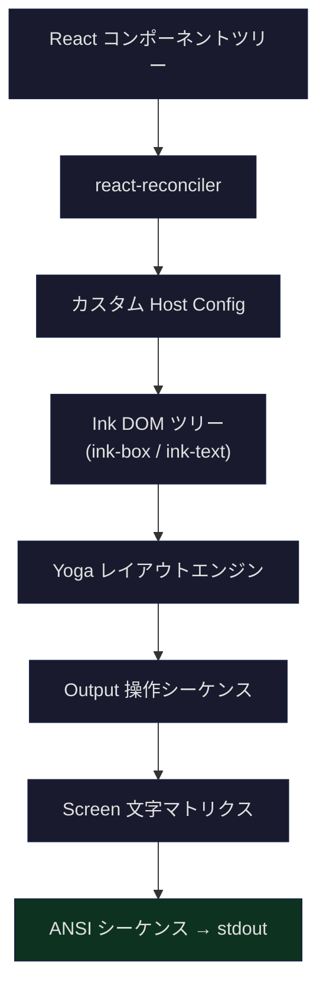
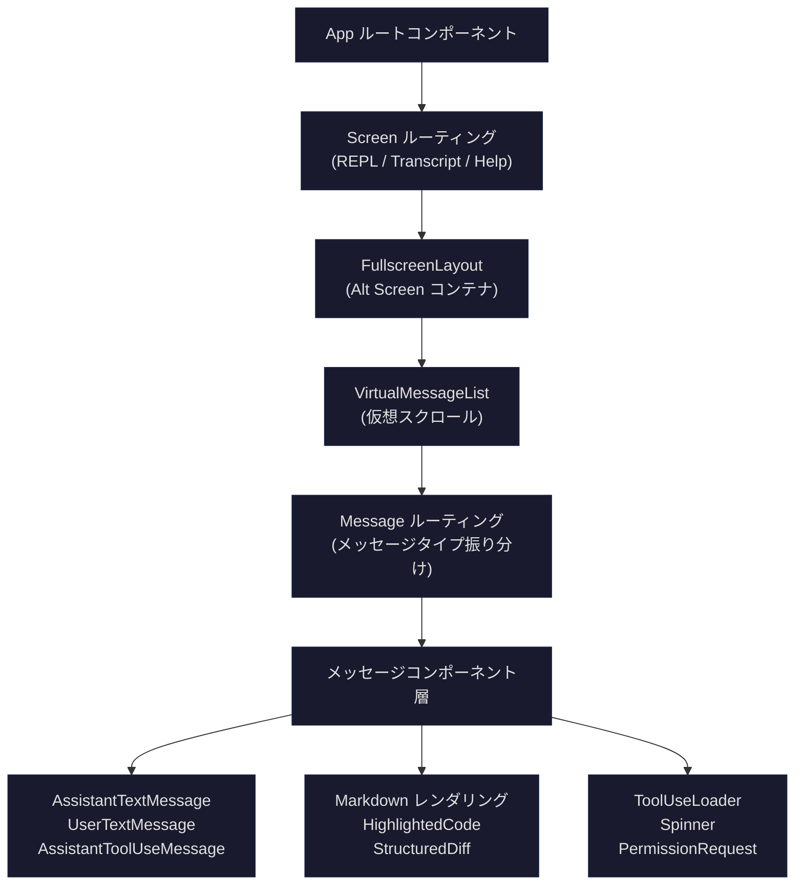

## 問題提起

ターミナルで `claude` コマンドを実行すると、表示されるのは素朴なプレーンテキスト出力ではありません——シンタックスハイライト付きのコードブロック、リアルタイムに動くローディングアニメーション、構造化された diff ビュー、インタラクティブな権限ダイアログ、そしてスムーズな仮想スクロールが見えます。これらすべてが、ブラウザも DOM も CSS もない環境——ターミナル上で動作しています。

このターミナル UI の裏側には、完全な React アプリケーションがあります。Claude Code は React のレンダリングターゲットをブラウザ DOM からターミナル文字マトリクスに切り替え、カスタム reconciler により `<Box>` や `<Text>` といったコンポーネントをターミナルの ANSI シーケンスに変換し、140 以上のコンポーネントからなる UI 体系を構築しています。答えるべき核心的な問いは以下の通りです：

1. **レンダリングターゲットの切り替え**：React reconciler はコンポーネントツリーをターミナルのピクセル（文字セル）にどうマッピングするのか？レイアウトエンジンは CSS から何に変わったのか？
2. **コンポーネントアーキテクチャ**：140 以上のコンポーネントはどう整理されているのか？メッセージレンダリング、ツール進捗、diff ビュー、権限ダイアログといった複雑な UI はターミナルでどう実現するのか？
3. **パフォーマンス制約**：ターミナルのレンダリングフレームレートはブラウザの 60fps よりはるかに低い中、16ms のフレーム予算内でレイアウト計算、差分検出、ターミナル書き込みをどう完了するのか？
4. **インタラクションモデル**：マウスクリックなし（ほとんどの場合）、フォーカス切り替えなしの環境で、React Hooks はキーボード優先のインタラクションにどう適応するのか？

本記事では Ink フレームワークのレンダリングパイプラインから始め、コンポーネントアーキテクチャ、コア UI の解析、Hooks の活用まで段階的に深掘りし、最後にこのアーキテクチャの制限と移行可能なパターンを議論します。

## Ink フレームワーク概要：React のレンダリングターゲットが DOM からターミナル文字に

### Ink とは

Ink は React のレンダリングターゲットをブラウザ DOM からターミナルに置き換えるフレームワークです。ブラウザでは React が `react-dom` を通じて `<div>` や `<span>` を DOM ノードにレンダリングしますが、Ink ではカスタム reconciler により `<Box>` や `<Text>` をターミナル文字にレンダリングします。Claude Code は Ink の上に大量の深いカスタマイズを施しており、`src/ink/` ディレクトリには完全なレンダリングエンジンが含まれています。npm パッケージの単純な参照ではありません。

コアとなる考え方は一言で要約できます：**React が宣言的 UI プログラミングモデルを提供し、Ink がターミナルレンダリングバックエンドを提供する**。



### レンダリングパイプライン：JSX からターミナルピクセルへ

レンダリングパイプライン全体は 6 つのフェーズに分かれています：

**フェーズ 1：React Reconciliation**

React の reconciler が JSX コンポーネントツリーと前フレームの Fiber ツリーを diff し、一連の DOM 操作（ノードの作成、更新、削除）を生成します。Claude Code は `react-reconciler` ライブラリでカスタム reconciler を作成しています：

```typescript
// src/ink/reconciler.ts (L224-239)
const reconciler = createReconciler<
  ElementNames,
  Props,
  DOMElement,
  DOMElement,
  TextNode,
  DOMElement,
  unknown,
  unknown,
  DOMElement,
  HostContext,
  null, // UpdatePayload - not used in React 19
  NodeJS.Timeout,
  -1,
  null
>({
  getRootHostContext: () => ({ isInsideText: false }),
  // ...
})
```

この reconciler は `createInstance`、`commitUpdate`、`removeChild` などのメソッドを実装し、React の操作を Ink DOM ツリーへの操作に変換します。各 JSX 要素は Ink ノードタイプに対応します：

```typescript
// src/ink/dom.ts (L19-27)
export type ElementNames =
  | 'ink-root'
  | 'ink-box'
  | 'ink-text'
  | 'ink-virtual-text'
  | 'ink-link'
  | 'ink-progress'
  | 'ink-raw-ansi'
```

`HostContext` の `isInsideText` フィールドに注目してください——`<Text>` の内部で `<Box>` をネストすることを禁止しています。これはターミナルレンダリングの基本的な制約です（テキストノード内にブロックレベルのレイアウトは配置できない）：

```typescript
// src/ink/reconciler.ts (L331-340)
createInstance(
  originalType: ElementNames,
  newProps: Props,
  _root: DOMElement,
  hostContext: HostContext,
): DOMElement {
  if (hostContext.isInsideText && originalType === 'ink-box') {
    throw new Error(`<Box> can't be nested inside <Text> component`)
  }
  // ...
}
```

**フェーズ 2：Yoga レイアウト計算**

Ink DOM ツリーの各ノードは Yoga レイアウトノードに関連付けられています。Yoga は Facebook が開発したクロスプラットフォーム Flexbox レイアウトエンジンです（元々は React Native 向けに設計）。reconciler の `resetAfterCommit` でレイアウト計算がトリガーされます：

```typescript
// src/ink/reconciler.ts (L247-279)
resetAfterCommit(rootNode) {
  // ...
  if (typeof rootNode.onComputeLayout === 'function') {
    rootNode.onComputeLayout()
  }
  // ...
  rootNode.onRender?.()
}
```

`onComputeLayout` は Yoga の `calculateLayout()` メソッドを呼び出し、各ノードの正確な `x, y, width, height` を計算します——ブラウザの CSS Flexbox レイアウトに類似していますが、出力単位はピクセルではなくターミナルの文字セルです。

**フェーズ 3：Output 操作へのレンダリング**

レイアウト完了後、`renderNodeToOutput` が Ink DOM ツリーを走査し、各可視ノードを `Output` 操作（write、clip、blit、clear など）に変換します。このフェーズではスクロール、ボーダー描画、テキスト折り返しなどターミナル固有のロジックも処理されます：

```typescript
// src/ink/render-node-to-output.ts (L1-18)
import indentString from 'indent-string'
import { applyTextStyles } from './colorize.js'
import type { DOMElement } from './dom.js'
import getMaxWidth from './get-max-width.js'
import type { Rectangle } from './layout/geometry.js'
import { LayoutDisplay, LayoutEdge, type LayoutNode } from './layout/node.js'
import { nodeCache, pendingClears } from './node-cache.js'
import type Output from './output.js'
import renderBorder from './render-border.js'
import type { Screen } from './screen.js'
import {
  type StyledSegment,
  squashTextNodesToSegments,
} from './squash-text-nodes.js'
import type { Color } from './styles.js'
import { isXtermJs } from './terminal.js'
import { widestLine } from './widest-line.js'
import wrapText from './wrap-text.js'
```

重要な最適化として **blit（ブロック転送）** があります。ノードの位置と内容が変わっていない場合、前フレームの Screen バッファからその領域の文字データを直接コピーし、サブツリー全体のレンダリングをスキップします。これにより、安定フレーム（spinner だけが動いている状態）のレンダリングコストが O(total cells) ではなく O(changed cells) に近づきます。

**フェーズ 4：Screen バッファ生成**

`Output` 操作が `Screen` オブジェクト——二次元文字マトリクス——に適用されます。Screen はプーリングと interning メカニズムでメモリを最適化しています：

```typescript
// src/ink/screen.ts (L21-53)
export class CharPool {
  private strings: string[] = [' ', ''] // Index 0 = space, 1 = empty
  private stringMap = new Map<string, number>([
    [' ', 0],
    ['', 1],
  ])
  private ascii: Int32Array = initCharAscii()

  intern(char: string): number {
    // ASCII 高速パス：Map.get の代わりに配列の直接ルックアップ
    if (char.length === 1) {
      const code = char.charCodeAt(0)
      if (code < 128) {
        const cached = this.ascii[code]!
        if (cached !== -1) return cached
        const index = this.strings.length
        this.strings.push(char)
        this.ascii[code] = index
        return index
      }
    }
    // ...
  }
}
```

各文字位置に格納されるのは文字列そのものではなく、`CharPool` 内の整数インデックスです。これによりフレーム間の差分比較が文字列比較ではなく整数比較になります——重要なパフォーマンス最適化です。

**フェーズ 5：ダブルバッファフレーム差分**

`createRenderer` は前後 2 フレームの Screen バッファを管理し、ダブルバッファリングを実現します：

```typescript
// src/ink/renderer.ts (L31-38)
export default function createRenderer(
  node: DOMElement,
  stylePool: StylePool,
): Renderer {
  let output: Output | undefined
  return options => {
    const { frontFrame, backFrame, isTTY, terminalWidth, terminalRows } =
      options
    // ...
  }
}
```

`LogUpdate` クラスが 2 フレーム間の差分を最小限のターミナル書き込み操作に変換します——実際に変化した文字セルだけを更新し、画面全体を再描画しません。

**フェーズ 6：ターミナル書き込み**

最終的な ANSI シーケンスは `stdout.write()` でターミナルに送信されます。レンダリングフレームレートは `throttle` で制御され、デフォルト間隔は `FRAME_INTERVAL_MS` で定義されています。

### レンダリングパイプライン完全フロー

```mermaid
graph LR
  style A fill:#1a1a2e,stroke:#16213e,color:#e0e0e0
  style B fill:#1a1a2e,stroke:#16213e,color:#e0e0e0
  style C fill:#1a1a2e,stroke:#16213e,color:#e0e0e0
  style D fill:#1a1a2e,stroke:#16213e,color:#e0e0e0
  style E fill:#1a1a2e,stroke:#16213e,color:#e0e0e0
  style F fill:#1a1a2e,stroke:#16213e,color:#e0e0e0
  style G fill:#1a1a2e,stroke:#16213e,color:#e0e0e0

  A["setState / props 変更"] --> B["React Reconcile<br/>(Fiber diff)"]
  B --> C["Ink DOM 更新<br/>(createNode / setAttribute)"]
  C --> D["Yoga レイアウト<br/>(calculateLayout)"]
  D --> E["renderNodeToOutput<br/>(blit 最適化)"]
  E --> F["Screen 差分<br/>(diffEach)"]
  F --> G["stdout.write<br/>(ANSI シーケンス)"]
```



## `ink/` ディレクトリのレンダラー封装

`src/ink/` ディレクトリは 40 以上のファイルを含み、完全なターミナルレンダリングエンジンを構成しています。npm の `ink` パッケージの単純な参照ではなく、Claude Code チームがレンダリング層全体を fork し深くカスタマイズしたものです。以下はコアモジュールの責務分担です：

| モジュール | ファイル | 責務 |
|------|------|------|
| DOM 抽象 | `dom.ts` | Ink ノードタイプの定義、属性設定、子ノード操作、dirty マーキング |
| Reconciler | `reconciler.ts` | React 19 reconciler host config、React Fiber と Ink DOM のブリッジ |
| レイアウトエンジン | `layout/` | Yoga Flexbox エンジンの TypeScript ラッパー |
| スタイルシステム | `styles.ts` | Flexbox プロパティ（flex、margin、padding、border）の Yoga ノードへのマッピング |
| レンダラー | `renderer.ts` | Ink DOM ツリーから Screen バッファを生成 |
| 出力パイプライン | `output.ts` | write/blit/clip 操作の収集と Screen への適用 |
| Screen | `screen.ts` | 二次元文字マトリクス、CharPool/StylePool/HyperlinkPool プーリング |
| フレーム差分 | `log-update.ts` | 前後フレームの Screen 差分 → 最小 ANSI シーケンス |
| ノードレンダリング | `render-node-to-output.ts` | Ink DOM ツリー走査、blit・scroll・border の処理 |
| テキスト処理 | `squash-text-nodes.ts`, `wrap-text.ts`, `measure-text.ts` | テキストノードの結合、折り返し、測定 |
| 文字幅 | `stringWidth.ts`, `widest-line.ts` | Unicode 全角/半角、絵文字幅の計算 |
| ターミナル抽象 | `terminal.ts`, `termio/` | ANSI CSI/DEC/OSC シーケンス生成、ターミナル機能探査 |
| イベントシステム | `events/` | キーボードイベントディスパッチ、イベントバブリング/キャプチャ |
| フォーカス管理 | `focus.ts` | Tab フォーカスチェーン、autoFocus |
| 選択/検索 | `selection.ts`, `searchHighlight.ts` | テキスト選択（マウスドラッグ）、検索ハイライト |
| コンポーネントライブラリ | `components/` | Box、Text、ScrollBox、Link 等の基本コンポーネント |

### Ink インスタンスのライフサイクル

`ink.tsx` はレンダリングエンジンのコアクラス（1722 行）で、Ink インスタンス全体のライフサイクルを管理します：

```typescript
// src/ink/root.ts (L76-96)
export const renderSync = (
  node: ReactNode,
  options?: NodeJS.WriteStream | RenderOptions,
): Instance => {
  const opts = getOptions(options)
  const inkOptions: InkOptions = {
    stdout: process.stdout,
    stdin: process.stdin,
    stderr: process.stderr,
    exitOnCtrlC: true,
    patchConsole: true,
    ...opts,
  }

  const instance: Ink = getInstance(
    inkOptions.stdout,
    () => new Ink(inkOptions),
  )

  instance.render(node)
  // ...
}
```

`Ink` クラスは `ink.tsx` 内で以下の主要な責務を実装しています：

1. **React container の作成**：reconciler を通じて ConcurrentRoot（React 19 コンカレントモード）を作成
2. **フレームスケジューリング**：レンダリングフレームを固定間隔にスロットルし、過剰レンダリングを防止
3. **ダブルバッファ管理**：frontFrame / backFrame の 2 つの Screen バッファを交互に使用
4. **入力処理**：stdin から生のキー入力を読み取り、KeyboardEvent にパースし、Dispatcher で配信
5. **マウス/選択**：ターミナルマウスイベントのサポート、テキスト選択とドラッグの実装
6. **ターミナルモード**：Alt Screen サポート、Kitty キーボードプロトコル、修飾キープロトコル
7. **デバッグツール**：commit ログ、Yoga カウンター、再描画デバッグ

### スタイルシステム

Ink のスタイルシステムは CSS Flexbox のサブセットです。`styles.ts` が利用可能なスタイルプロパティを定義し、Yoga レイアウトノードにマッピングします：

```typescript
// src/ink/styles.ts (L55-61)
export type Styles = {
  readonly textWrap?:
    | 'wrap'
    | 'wrap-trim'
    | 'end'
    | 'middle'
  // ...flexDirection, alignItems, justifyContent, width, height,
  // minWidth, minHeight, padding*, margin*, border*, position, overflow...
}
```

カラーシステムは複数のフォーマットをサポートしています：

```typescript
// src/ink/styles.ts (L15-37)
export type RGBColor = `rgb(${number},${number},${number})`
export type HexColor = `#${string}`
export type Ansi256Color = `ansi256(${number})`
export type AnsiColor =
  | 'ansi:black'
  | 'ansi:red'
  | 'ansi:green'
  // ...16 種類の ANSI カラー
```

テキストスタイルは `TextStyles` 型で定義され、bold、dim、italic、underline、strikethrough、inverse をサポートしています——これらは ANSI SGR エスケープシーケンスに直接マッピングされます。

## 140+ コンポーネントの編成方法

Claude Code の `src/components/` ディレクトリには 144 のファイル/ディレクトリが含まれ、階層的に整理されたコンポーネント体系を構成しています。

### コンポーネント階層アーキテクチャ



### 基盤層：Ink ネイティブコンポーネント

`src/ink/components/` 内に 18 ファイルがあります：

- **`Box.tsx`**：HTML の `<div>` に対応、Flexbox レイアウトをサポート
- **`Text.tsx`**：HTML の `<span>` に対応、色、太字、斜体などのテキストスタイルをサポート
- **`ScrollBox.tsx`**：スクロール対応の Box、`overflow: scroll` のセマンティクスを実装
- **`Link.tsx`**：ターミナルハイパーリンク（OSC 8 プロトコル）
- **`RawAnsi.tsx`**：生の ANSI シーケンスを直接出力（Ink のテキスト処理をバイパス）
- **`AlternateScreen.tsx`**：ターミナル Alt Screen への切り替え（全画面モード）
- **`Spacer.tsx`**：Flexbox spacer、`flex: 1` のショートカット

これらの基本コンポーネントがターミナル UI のレイアウトプリミティブを確立しています。`Box` がサポートするプロパティのサブセットは Flexbox のほぼ全機能をカバーしています：

```tsx
<Box
  flexDirection="column"
  padding={1}
  borderStyle="round"
  borderColor="cyan"
  width="100%"
>
  <Text bold color="green">タイトル</Text>
  <Text dimColor>説明テキスト</Text>
</Box>
```

### アプリケーション層：ビジネスコンポーネント

`src/components/` の 140 以上のファイルは機能ドメイン別に複数のサブディレクトリと独立ファイルに整理されています：

| 機能ドメイン | コンポーネント/ディレクトリ | 数量 | 責務 |
|--------|----------|------|------|
| メッセージレンダリング | `messages/`, `Message.tsx`, `Messages.tsx` | ~15 | 各種メッセージ（ユーザー、アシスタント、システム、ツール結果）のレンダリング |
| 権限システム | `permissions/` | ~30 | ツール実行権限ダイアログ（Bash、FileEdit、WebFetch 等） |
| Diff ビュー | `StructuredDiff/`, `diff/`, `FileEditToolDiff.tsx` | ~5 | ファイル編集の差分表示 |
| Spinner/プログレス | `Spinner/`, `ToolUseLoader.tsx`, `AgentProgressLine.tsx` | ~12 | ローディングアニメーション、ツール実行進捗 |
| 入力 | `PromptInput/`, `TextInput.tsx`, `VimTextInput.tsx` | ~5 | ユーザー入力欄（Vim モード対応） |
| ダイアログ | `*Dialog.tsx` | ~15 | 各種モーダルダイアログ（モデル選択、設定、エクスポート等） |
| ナビゲーション | `FullscreenLayout.tsx`, `VirtualMessageList.tsx` | ~3 | 全画面レイアウト、仮想スクロール、画面管理 |
| デザインシステム | `design-system/` | ~5 | テーマカラー、タイポグラフィコンポーネント、汎用 UI パターン |
| Markdown | `Markdown.tsx`, `MarkdownTable.tsx` | 2 | Markdown のターミナルレンダリング |
| コードハイライト | `HighlightedCode/` | ~2 | シンタックスハイライトコードブロック |
| タスク管理 | `tasks/`, `TaskListV2.tsx` | ~5 | バックグラウンドタスクリスト、Agent 状態 |
| Shell | `shell/` | ~3 | Shell コマンド出力のレンダリング |

### メッセージタイプルーティング

`Message.tsx` はメッセージレンダリングのコアルーティングコンポーネントです。メッセージタイプとコンテンツブロックタイプに基づいて異なるサブコンポーネントに振り分けます：

```typescript
// src/components/Message.tsx (L58-80)
function MessageImpl(t0) {
  const {
    message,
    lookups,
    containerWidth,
    addMargin,
    tools,
    commands,
    verbose,
    inProgressToolUseIDs,
    progressMessagesForMessage,
    shouldAnimate,
    shouldShowDot,
    style,
    width,
    isTranscriptMode,
    // ...
  } = t0;
```

メッセージ振り分けロジックは以下のタイプを処理します：

- **ユーザーテキストメッセージ** → `UserTextMessage`
- **ユーザー画像メッセージ** → `UserImageMessage`
- **アシスタントテキスト出力** → `AssistantTextMessage` → `Markdown`
- **アシスタントツール呼び出し** → `AssistantToolUseMessage` → 各ツール専用レンダリングコンポーネント
- **ツール実行結果** → `UserToolResultMessage`
- **アシスタント思考プロセス** → `AssistantThinkingMessage`
- **システムメッセージ** → `SystemTextMessage`
- **添付ファイルメッセージ** → `AttachmentMessage`
- **折りたたまれた読み取り/検索グループ** → `CollapsedReadSearchContent`
- **グループ化されたツール呼び出し** → `GroupedToolUseContent`

## コア UI コンポーネント解析

### Markdown ターミナルレンダリング

`Markdown.tsx` は Markdown テキストをターミナルのフォーマット済み出力にレンダリングします。`marked` ライブラリで字句解析を行い、Token を ANSI フォーマット文字列に変換します：

```typescript
// src/components/Markdown.tsx (L17-71)
// モジュールレベルの Token キャッシュ — marked.lexer は仮想スクロールの
// 再マウント時にホットコストになる（メッセージあたり約 3ms）。useMemo はアンマウント→再マウントで生き残れない
const TOKEN_CACHE_MAX = 500;
const tokenCache = new Map<string, Token[]>();

// Markdown 構文を示す文字。いずれも存在しなければ、
// 約 3ms の marked.lexer 呼び出しを完全にスキップし、単一パラグラフとしてレンダリング
const MD_SYNTAX_RE = /[#*`|[>\-_~]|\n\n|^\d+\. |\n\d+\. /;

function hasMarkdownSyntax(s: string): boolean {
  return MD_SYNTAX_RE.test(s.length > 500 ? s.slice(0, 500) : s);
}

function cachedLexer(content: string): Token[] {
  // 高速パス：Markdown 構文のないプレーンテキスト → 単一パラグラフ Token
  if (!hasMarkdownSyntax(content)) {
    return [{
      type: 'paragraph',
      raw: content,
      text: content,
      tokens: [{ type: 'text', raw: content, text: content }]
    } as Token];
  }
  // ハッシュキーによる LRU キャッシュ...
}
```

3 つの重要なパフォーマンス最適化に注目してください：

1. **高速パス検出**：最初の 500 文字に Markdown 構文マーカーが含まれるかを正規表現でチェックします。ほとんどの短いメッセージはプレーンテキストなので、`marked.lexer` の 3ms の解析コストを完全にスキップできます。

2. **LRU Token キャッシュ**：メッセージ内容は不変なので、同じメッセージの Markdown Token はフレーム間で再利用できます。content hash をキー（完全な文字列を保持することによるメモリ肥大を回避）として使用し、最大 500 件をキャッシュします。

3. **ハイブリッドレンダリング**：テーブルは React コンポーネント `<MarkdownTable>` でレンダリング（列の整列に Flexbox が必要）、その他のコンテンツは ANSI 文字列で直接出力します（`<Ansi>` コンポーネントで Ink のテキスト処理をバイパス）。

Markdown レンダリングは `cli-highlight` とも統合され、コードブロックのシンタックスハイライトを行います——コードフェンス（` ``` `）内のコンテンツは言語に応じて構文着色され、`Suspense` で非同期にハイライターをロードして初回レンダリングのブロックを回避します。

### ツール実行プログレス：Spinner と ToolUseLoader

ツール実行時のリアルタイムフィードバックは 2 つのコンポーネントが協力して実現しています：

**`ToolUseLoader`** は極めてシンプルな状態インジケーター——点滅する黒い丸です：

```typescript
// src/components/ToolUseLoader.tsx (ソースコード)
export function ToolUseLoader({ isError, isUnresolved, shouldAnimate }) {
  const [ref, isBlinking] = useBlink(shouldAnimate)
  const color = isUnresolved ? undefined : isError ? "error" : "success"

  return (
    <Box ref={ref} minWidth={2}>
      <Text color={color} dimColor={isUnresolved}>
        {!shouldAnimate || isBlinking || isError || !isUnresolved
          ? BLACK_CIRCLE
          : ' '}
      </Text>
    </Box>
  )
}
```

コードのコメントで言及されている ANSI スタイルの競合問題に注目してください：`</dim>` と `</bold>` は ANSI で同じリセットコード `\x1b[22m` を共有しており、chalk はこれらを区別できません。そのため dim の直後に bold が来ると、bold テキストも dim になってしまいます。解決策は `minWidth={2}` の `<Box>` でラップし、dim と bold の間に空白を挿入して隔離することです。

**`Spinner`** ははるかに複雑なコンポーネント（200 行以上）で、以下を表示します：
- アニメーションフレーム（前後に揺れる文字シーケンス）
- 現在の操作説明（"Reading file...", "Running command..."）
- 経過時間
- Token 使用量
- Shimmer エフェクト（ストリーミングレスポンス時）
- バックグラウンド Agent ツリーの状態

Spinner は `useAnimationFrame` Hook を使って固定間隔でアニメーションフレームを更新します。`setInterval` ではなくこのアプローチを取るのは、Ink のフレームスケジューリングシステムと協調し、不要な reconciliation を回避するためです。

### ファイル Diff ビュー

`FileEditToolDiff.tsx` はファイル編集の差分ビューを表示します。`Suspense` + `use()` パターンで diff データを非同期にロードします：

```typescript
// src/components/FileEditToolDiff.tsx (L23-52)
export function FileEditToolDiff(props) {
  const [dataPromise] = useState(() => loadDiffData(props.file_path, props.edits));

  return (
    <Suspense fallback={<DiffFrame placeholder={true} />}>
      <DiffBody promise={dataPromise} file_path={props.file_path} />
    </Suspense>
  )
}

function DiffBody({ promise, file_path }) {
  const { patch, firstLine, fileContent } = use(promise);
  const { columns } = useTerminalSize();

  return (
    <DiffFrame>
      <StructuredDiffList
        hunks={patch}
        dim={false}
        width={columns}
        filePath={file_path}
        firstLine={firstLine}
        fileContent={fileContent}
      />
    </DiffFrame>
  )
}
```

`StructuredDiffList` コンポーネントは diff hunk をターミナルフォーマットの増減行ビューにレンダリングし、以下をサポートします：
- 行番号の表示
- 追加行（緑色 `+`）/ 削除行（赤色 `-`）のカラーコーディング
- コンテキスト行のグレー表示
- ターミナル幅に応じた長い行の自動切り詰め

### 権限ダイアログ

権限システムは Claude Code UI で最も複雑なインタラクションパターンの一つです。`PermissionRequest.tsx` がルーターとして機能し、ツールタイプに応じて専用の権限リクエストコンポーネントに振り分けます：

```typescript
// src/components/permissions/PermissionRequest.tsx (L47-62)
function permissionComponentForTool(tool: Tool): ComponentType<PermissionRequestProps> {
  switch (tool) {
    case FileEditTool:
      return FileEditPermissionRequest;
    case FileWriteTool:
      return FileWritePermissionRequest;
    case BashTool:
      return BashPermissionRequest;
    case PowerShellTool:
      return PowerShellPermissionRequest;
    case WebFetchTool:
      return WebFetchPermissionRequest;
    // ... 12 種類以上のツールタイプ
  }
}
```

`permissions/` ディレクトリには約 30 ファイルがあり、権限が必要な各ツールに専用のダイアログコンポーネントがあります。`BashPermissionRequest` を例にとると、以下を表示します：

1. 実行するコマンド（シンタックスハイライト付き）
2. 作業ディレクトリ
3. 操作オプション：1 回許可 / 今回のセッションで許可 / 拒否
4. オプションのルール説明（なぜ権限が必要か）
5. Worker マーク（バックグラウンド Agent からの場合）

権限ダイアログは `useKeybinding` でショートカットキー処理を登録し（`y` 許可、`n` 拒否、数字キーでオプション選択）、従来のフォームインタラクションは使用しません。

### 仮想スクロール

会話履歴が長くなると、すべてのメッセージをレンダリングすると深刻なパフォーマンス問題が生じます。`VirtualMessageList` は `useVirtualScroll` Hook と連携して仮想スクロールを実現し、ビューポート付近のメッセージのみをレンダリングします：

```typescript
// src/hooks/useVirtualScroll.ts (L18-57)
const DEFAULT_ESTIMATE = 3       // 未測定アイテムの推定高さ（行数）
const OVERSCAN_ROWS = 80         // ビューポート上下に追加レンダリングする行数
const COLD_START_COUNT = 30      // ScrollBox 未レイアウト時の初期レンダリング数
const SCROLL_QUANTUM = OVERSCAN_ROWS >> 1  // scrollTop 量子化ステップ
const PESSIMISTIC_HEIGHT = 1     // 未測定アイテムの最悪ケース高さ
const MAX_MOUNTED_ITEMS = 300    // マウント済みアイテム上限
const SLIDE_STEP = 25            // 各 commit で最大新規マウント数
```

仮想スクロールのコア戦略：

1. **高さ推定**：未測定のアイテムは `DEFAULT_ESTIMATE = 3` 行を初期推定値として使用します。意図的に低めに設定——高すぎると下部に空白が残り（マウントの早期停止）、低すぎても追加でいくつかのアイテムをマウントするだけです（overscan で吸収）。

2. **Overscan バッファ**：ビューポートの上下に各 80 行分の追加コンテンツをレンダリングします。メッセージの高さの差が極めて大きいため（ツール結果は 100 行以上になることも）、十分なバッファが必要です。

3. **スクロール量子化**：`SCROLL_QUANTUM = 40` 行。スクロール wheel の各 tick（3-5 ピクセル）ごとに React commit をトリガーするのは不要です——マウント範囲の変更が不要な限り、視覚的スクロールは ScrollBox の `forceRender` が処理します（DOM ノードの scrollTop を直接読み取り、React をバイパス）。

4. **段階的マウント**：`SLIDE_STEP = 25` により、各 commit で最大 25 個の新規マウントアイテムに制限します。高速スクロールでまったく新しい領域に移動した際、一度に 200 以上のアイテムをマウントして同期ブロック（各 MessageRow のレンダリングは約 1.5ms）が発生するのを防ぎます。

5. **レンダリング時の clamp**：`scrollClampMin/Max` がレンダリング時に scrollTop をマウント済みコンテンツの範囲内に制限します。scrollTo の書き込みが React の非同期再レンダリングより先に行われた場合、ユーザーには空白ではなくマウント済みコンテンツの端が表示されます。

## CLI における React Hooks の活用

Claude Code の `src/hooks/` ディレクトリには 85 個の Hook が含まれ、キーボードインタラクション、状態管理から IDE 連携まで幅広くカバーしています。以下は最も代表的なものです。

### useGlobalKeybindings：グローバルショートカットキー

`useGlobalKeybindings.tsx` はアプリケーションレベルのショートカットキーハンドラーを登録します：

```typescript
// src/hooks/useGlobalKeybindings.tsx (L36-46)
/**
 * Registers global keybinding handlers for:
 * - ctrl+t: Toggle todo list
 * - ctrl+o: Toggle transcript mode
 * - ctrl+e: Toggle showing all messages in transcript
 * - ctrl+c/escape: Exit transcript mode
 */
export function GlobalKeybindingHandlers({
  screen, setScreen,
  showAllInTranscript, setShowAllInTranscript,
  messageCount,
  onEnterTranscript, onExitTranscript,
  virtualScrollActive, searchBarOpen,
}: Props): null {
```

このコンポーネントの戻り値に注目してください——`null` です。これは**レンダーレスコンポーネント**（renderless component）で、UI 出力を一切生成せず、`useKeybinding` Hook を通じた副作用の登録のみを行います。このパターンは Claude Code で広く使用されています：

- `GlobalKeybindingHandlers` → グローバルショートカットキー
- `CancelRequestHandler` → リクエストキャンセル
- `ScrollKeybindingHandler` → スクロール制御
- `AutoUpdater` → 自動更新チェック

このパターンの利点は、インタラクションロジックを組み合わせ可能な React コンポーネントとしてカプセル化し、React のライフサイクルと状態管理の恩恵を受けながら、命令的イベントリスナーの登録/解除の問題を回避できることです。

`ctrl+o` の切り替えロジックは Hook 内のステートマシンの典型的な活用例で、prompt、transcript、brief の 3 つのビュー間を切り替え、feature flag で制御される brief モードのエッジケースも処理しています。

### useCancelRequest：リクエストキャンセル

`useCancelRequest.ts` はより複雑な例で、Hook が複数優先度のキーボードイベントをどう処理するかを示しています：

```typescript
// src/hooks/useCancelRequest.ts (L87-122)
const handleCancel = useCallback(() => {
  // Priority 1: If there's an active task running, cancel it first
  if (abortSignal !== undefined && !abortSignal.aborted) {
    logEvent('tengu_cancel', cancelProps)
    setToolUseConfirmQueue(() => [])
    onCancel()
    return
  }

  // Priority 2: Pop queue when Claude is idle
  if (hasCommandsInQueue()) {
    if (popCommandFromQueue) {
      popCommandFromQueue()
      return
    }
  }

  // Fallback: nothing to cancel or pop
  logEvent('tengu_cancel', cancelProps)
  setToolUseConfirmQueue(() => [])
  onCancel()
}, [abortSignal, popCommandFromQueue, setToolUseConfirmQueue, onCancel, streamMode])
```

キャンセルロジックには厳密な優先度チェーンがあります：

1. 実行中のタスクがある → キャンセル
2. コマンドキューに保留中のコマンドがある → 1 つポップ
3. どちらもない → 権限キューをクリア

さらに複雑なのは Escape と Ctrl+C の区別です：

```typescript
// src/hooks/useCancelRequest.ts (L129-154)
// Escape (chat:cancel) defers to mode-exit when in special mode
const isEscapeActive =
  isContextActive &&
  (canCancelRunningTask || hasQueuedCommands) &&
  !isInSpecialModeWithEmptyInput &&
  !isViewingTeammate

// Ctrl+C (app:interrupt): must NOT claim ctrl+c when main is idle
// at the prompt — that blocks the copy-selection handler
const isCtrlCActive =
  isContextActive &&
  (canCancelRunningTask || hasQueuedCommands || isViewingTeammate)
```

Escape と Ctrl+C は異なるコンテキストで異なる動作をします：

- **Escape** は特殊入力モード（bash/background mode）ではモード終了に譲歩
- **Ctrl+C** は teammate ビュー表示時に、追加で kill agents + teammate ビュー終了を実行
- **Ctrl+C** はメインスレッドがアイドル時にはアクティブにしない——テキストコピーとダブルクリック終了機能をブロックしてしまうため

### バックグラウンド Agent 終了：2 回押し確認パターン

`useCancelRequest.ts` は巧妙な 2 回押し確認パターン（`chat:killAgents`）も実装しています：

```typescript
// src/hooks/useCancelRequest.ts (L225-266)
const handleKillAgents = useCallback(() => {
  const tasks = store.getState().tasks
  const hasRunningAgents = Object.values(tasks).some(
    t => t.type === 'local_agent' && t.status === 'running',
  )
  if (!hasRunningAgents) {
    addNotification({
      key: 'kill-agents-none',
      text: 'No background agents running',
      priority: 'immediate',
      timeoutMs: 2000,
    })
    return
  }
  const now = Date.now()
  const elapsed = now - lastKillAgentsPressRef.current
  if (elapsed <= KILL_AGENTS_CONFIRM_WINDOW_MS) {
    // Second press within window -- kill all background agents
    lastKillAgentsPressRef.current = 0
    removeNotification('kill-agents-confirm')
    killAllAgentsAndNotify()
    return
  }
  // First press -- show confirmation hint
  lastKillAgentsPressRef.current = now
  addNotification({
    key: 'kill-agents-confirm',
    text: `Press ${shortcut} again to stop background agents`,
    priority: 'immediate',
    timeoutMs: KILL_AGENTS_CONFIRM_WINDOW_MS,
  })
}, [store, addNotification, removeNotification, killAllAgentsAndNotify])
```

1 回目の `ctrl+x ctrl+k` では確認通知のみ表示し、3 秒以内にもう一度押すと実際に実行します。すべてのバックグラウンド Agent を誤操作で終了するリスクを回避するためです。`useRef` で前回の押下時刻を保存——state を使わないのは、この値がレンダリングに影響しないためです。

### その他の代表的な Hooks

| Hook | 責務 | 主要な技術ポイント |
|------|------|-----------|
| `useBlink` | 要素の点滅アニメーション制御 | `useRef` + `requestAnimationFrame` サイクル |
| `useTerminalSize` | ターミナルサイズ変更の追跡 | `stdout.on('resize')` の監視 |
| `useVirtualScroll` | 仮想スクロール範囲の計算 | `useSyncExternalStore` で ScrollBox に接続 |
| `useExitOnCtrlCD` | Ctrl+C/D ダブルクリック終了 | タイムウィンドウ検出 + `useRef` |
| `useVimInput` | Vim モード入力 | モード状態機械（NORMAL/INSERT/VISUAL） |
| `useDiffData` | diff データの非同期ロード | `useState(async)` + `Suspense` |
| `useElapsedTime` | 経過時間の表示 | `useAnimationFrame` 駆動の更新 |
| `useInputBuffer` | 入力バッファリングとデバウンス | 高速入力のバッチ結合 |
| `usePasteHandler` | ペースト検出と処理 | タイピングとペーストの区別（時間閾値） |
| `useIDEIntegration` | IDE 接続状態 | WebSocket イベントの React state へのブリッジ |

## Ink の制限と回避策

### 制限 1：CSS の完全な機能がない

ターミナル Flexbox は CSS Flexbox のサブセットに過ぎません。サポートされていない機能：

- **Grid レイアウト**：Flexbox のみ、CSS Grid なし
- **フロート/絶対配置**：Yoga の `position: absolute` サポートは限定的で、ターミナルでの「絶対配置」は文字レベルの上書きを意味する
- **パーセント高さ**：スクロール可能コンテナ内でパーセント高さを計算するとレイアウトループが発生
- **アニメーション**：CSS transition/animation なし、すべてのアニメーションは JS 駆動（setInterval / requestAnimationFrame）

**回避策**：
- `flexDirection` + `alignItems` + `justifyContent` の組み合わせでほとんどのレイアウト要件をシミュレート
- アニメーションは `useBlink`、`useAnimationFrame` 等の Hook で手動制御
- 複雑なレイアウト（権限ダイアログの複数列オプションなど）はネストした Box で実現

### 制限 2：ターミナルレンダリングはグローバル

ブラウザでは各 DOM 要素が独立してレンダリングされますが、ターミナルはグローバルな文字マトリクスです。これが意味すること：

- **再描画範囲**：任意のノードの変更が Screen 全体の再計算をトリガーする可能性がある
- **z-index のシミュレーション**：`position: absolute` のノードは文字の上書きで「重なり」を実現するが、削除時にはフレーム全体を「汚染済み」としてマークし、全量再描画を強制する必要がある

```typescript
// src/ink/render-node-to-output.ts (L129-135)
// Removing an absolute-positioned node poisons prevScreen: it may
// have painted over non-siblings (e.g. an overlay over a ScrollBox
// earlier in tree order), so their blits would restore the removed
// node's pixels.
const absoluteRemoved = consumeAbsoluteRemovedFlag()
renderNodeToOutput(node, output, {
  prevScreen: absoluteRemoved || options.prevFrameContaminated
    ? undefined
    : prevScreen,
})
```

**回避策**：`blit` 最適化がノード未変更時に前フレームのデータを直接コピーします。Layout shift 検出がノードの位置変化を追跡し、必要な場合のみ全量再描画をトリガーします。

### 制限 3：文字幅の不一致

Unicode 文字は異なるターミナルで幅が異なる場合があります。CJK 文字（中国語・日本語・韓国語）は 2 文字幅を占め、絵文字は 1 または 2 幅の可能性があり、特殊文字（ゼロ幅結合子等）は 0 幅です。

```typescript
// src/ink/output.ts (L38-43)
type ClusteredChar = {
  value: string
  width: number    // 事前計算されたターミナル幅
  styleId: number
  hyperlink: string | undefined
}
```

**回避策**：`stringWidth.ts` が正確な Unicode 幅計算を提供し、`ClusteredChar` が各書記素クラスタの幅を事前計算してキャッシュし、レンダリングのホットパスでの重複計算を回避します。

### 制限 4：ANSI スタイルコードの衝突

前述の bold/dim リセットコード共有問題（`\x1b[22m`）は ANSI 標準の歴史的な欠陥です。chalk ライブラリは `</bold>` と `</dim>` を区別できず、一方を閉じるともう一方も同時に閉じてしまいます。

**回避策**：隣接するインライン要素間で bold と dim を混用しない。混用が必要な場合は `<Box>` で分離します（ブロックレベル要素が ANSI 状態をリセット）。`ToolUseLoader` の `minWidth={2}` がこの戦略の実例です。

### 制限 5：Alt Screen の高さ制約

Alt Screen モードでは、コンテンツの高さがターミナルの行数と正確に一致する必要があります。Yoga が計算した高さがターミナル行数を超えると、カーソル位置がずれます：

```typescript
// src/ink/renderer.ts (L97-104)
const height = options.altScreen ? terminalRows : yogaHeight
if (options.altScreen && yogaHeight > terminalRows) {
  logForDebugging(
    `alt-screen: yoga height ${yogaHeight} > terminalRows ${terminalRows} — ` +
    `something is rendering outside <AlternateScreen>. Overflow clipped.`,
    { level: 'warn' },
  )
}
```

**回避策**：`<AlternateScreen>` コンポーネントが子ノードを `<Box height={rows} flexShrink={0}>` でラップし、高さをターミナル行数に強制します。はみ出すコンテンツは暗黙的にクリップされ、警告ログが出力されます。

## 移行可能なパターン

Claude Code のターミナル UI アーキテクチャには、他の CLI プロジェクトで参考にすべき複数のパターンがあります：

### パターン 1：レンダーレスコンポーネント（Renderless Components）

インタラクションロジックを `null` を返す React コンポーネントとしてカプセル化：

```tsx
function MyKeybindingHandler({ onAction }): null {
  useKeybinding('action:trigger', onAction, {
    context: 'Global',
    isActive: true,
  })
  return null
}
```

メリット：
- React のライフサイクル管理の恩恵（イベントリスナーの自動解除）
- 組み合わせ可能（他のコンポーネントと並行レンダリング）
- 条件付きレンダリング可能（`isActive` や `{condition && <Handler />}` で制御）

### パターン 2：ダブルバッファ + フレーム差分

2 つの Screen バッファを管理し、各フレームで変化したセルのみターミナルに書き込む：

```
フレーム N:   [H][e][l][l][o][ ][ ]
フレーム N+1: [H][e][l][l][o][!][ ]
差分:                        [!]    → 1 文字だけ書き込み
```

安定レンダリング（spinner だけが変化）のコストが O(rows * cols) ではなく O(1) に近づきます。

### パターン 3：仮想スクロール + 段階的マウント

数百メッセージを含む長い会話の場合：

1. ビューポート付近のメッセージのみをマウント（`useVirtualScroll`）
2. スペーサーでマウントされていない領域を埋める
3. 高速スクロール時は段階的にマウント（フレームあたり最大 25 アイテム）
4. レンダリング時の clamp で空白のフラッシュを防止

### パターン 4：Suspense 非同期データロード

`useState(() => promise)` + `use(promise)` + `<Suspense>` で非同期データを処理：

```tsx
function DiffView({ file, edits }) {
  const [dataPromise] = useState(() => loadDiffData(file, edits));
  return (
    <Suspense fallback={<Placeholder />}>
      <DiffBody promise={dataPromise} />
    </Suspense>
  )
}
```

UI がデータロード中にプレースホルダーを表示し、完了後に自動的に置き換わります——ブラウザでの Suspense の使い方とまったく同じです。

### パターン 5：破壊的操作の 2 回確認

不可逆操作（すべてのバックグラウンド Agent の終了など）にタイムウィンドウ内の再確認を使用：

```tsx
const CONFIRM_WINDOW_MS = 3000
const lastPressRef = useRef<number>(0)

const handleDangerousAction = useCallback(() => {
  const elapsed = Date.now() - lastPressRef.current
  if (elapsed <= CONFIRM_WINDOW_MS) {
    // 実行
    performAction()
    lastPressRef.current = 0
  } else {
    // ヒントを表示
    lastPressRef.current = Date.now()
    showNotification("Press again to confirm")
  }
}, [])
```

### パターン 6：プール化文字列 Interning

頻繁に比較される文字列（文字、スタイル、ハイパーリンク）に intern pool を使用し、文字列を整数 ID にマッピング：

```typescript
class CharPool {
  private strings: string[] = [' ', '']
  private stringMap = new Map<string, number>()
  private ascii: Int32Array // ASCII 高速パス

  intern(char: string): number {
    if (char.length === 1) {
      const code = char.charCodeAt(0)
      if (code < 128) {
        const cached = this.ascii[code]!
        if (cached !== -1) return cached
        // ...
      }
    }
    // ...
  }
}
```

フレーム間の差分比較が整数比較（`===`）になり、文字列比較と比べて百万回操作レベルで顕著なパフォーマンス向上があります。

## まとめ

Claude Code のターミナル UI アーキテクチャは、深くカスタマイズされた React ターミナルレンダリング方式を示しています。`react-reconciler` のカスタム host config から、Yoga レイアウトエンジン、ダブルバッファ Screen 差分、仮想スクロール、そして 140 以上のビジネスコンポーネントと 85 個の Hooks まで——現在知られている中で最も複雑なターミナル React アプリケーションの一つです。

コアポイントの振り返り：

1. **レンダリングパイプライン**：JSX → React Reconcile → Ink DOM → Yoga Layout → Screen Buffer → ANSI diff → stdout、6 フェーズのパイプライン、blit 最適化により安定フレームはほぼゼロコスト
2. **コンポーネントアーキテクチャ**：基盤層（Box/Text/ScrollBox）+ アプリケーション層（Message/Permission/Diff/Spinner）、メッセージルーティングがタイプ別に専用レンダリングコンポーネントに振り分け
3. **パフォーマンス戦略**：Markdown Token LRU キャッシュ、仮想スクロールの段階的マウント、文字列プール化 interning、スクロール量子化による React commit 削減
4. **インタラクションパターン**：レンダーレスコンポーネントでショートカットキーロジックをカプセル化、多優先度キャンセルチェーン、タイムウィンドウ 2 回確認
5. **制限への対応**：bold/dim ANSI コード衝突は Box で隔離、Alt Screen 高さ強制 clamp、absolute ノード削除時のフレーム全体汚染マーキング

このアーキテクチャは重要な観点を証明しています：**React の価値は DOM レンダリングだけでなく、その宣言的プログラミングモデルとコンポーネント化アーキテクチャにあります**。レンダリングターゲットをターミナル文字マトリクスに置き換えた後も、React の状態管理、ライフサイクル、Hooks、Suspense 等のコア機能は完全に活用できます——そしてこれらの機能こそ、複雑なインタラクティブ CLI アプリケーションの構築に必要なものです。
