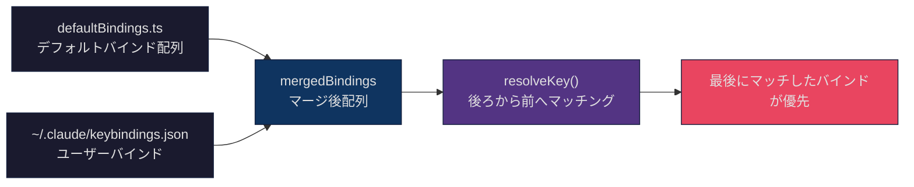
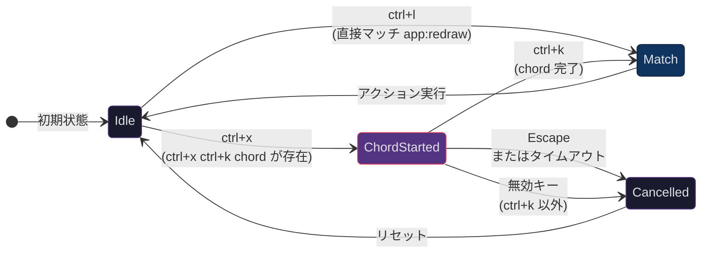
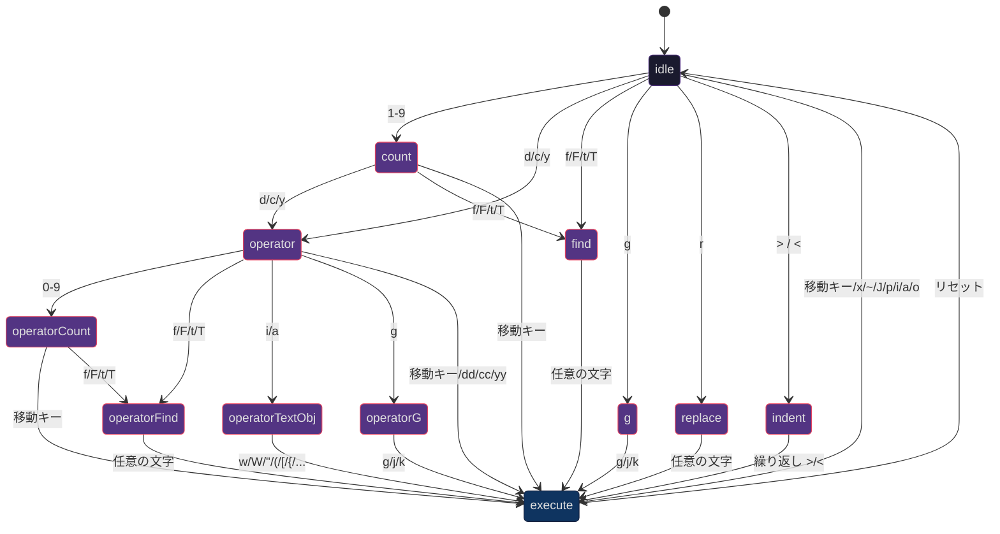
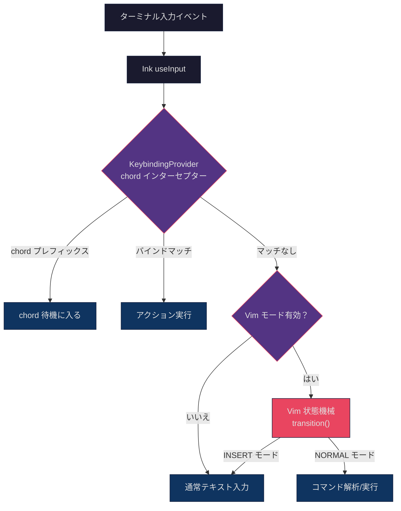

## 問題提起

ターミナルアプリケーションでは、キーボードが唯一の入力デバイスです。ブラウザアプリがマウスクリック、フォーカス切り替え、メニューシステムに依存できるのとは異なり、CLI ツールのすべてのインタラクションはキーボード操作にマッピングする必要があります。CLI アプリの機能が 17 のコンテキストシーン、70 以上のバインド可能なアクション、マルチキーシーケンス（chord）、そして完全な Vim モーダル編集を含むほど複雑になると、キーバインドシステムは「キーを監視してアクションを実行する」だけでは済まなくなります。

Claude Code のキーバインドシステムが直面する核心的な課題は以下の通りです：

1. **階層的オーバーライド**：デフォルトバインドはそのまま使えなければなりませんが、ユーザーは `~/.claude/keybindings.json` で任意のバインドを上書きできるべきです——アンバインド（`null` 設定）を含めて。この「デフォルト + ユーザーオーバーライド」の階層モデルをランタイムでどう効率的に解決するか？
2. **コンテキスト分離**：同じキー（例：`enter`）がチャット入力、確認ダイアログ、オートコンプリートメニューでまったく異なるアクションをトリガーすべきです。17 のコンテキストをどう互いに干渉させないか？
3. **マルチキー組み合わせ（Chord）**：VS Code の `Ctrl+K Ctrl+S` のような 2 ステップシーケンスをターミナルでどう実現するか？ユーザーが最初のキーを押した後、システムは 2 番目のキーを「待機」しつつ、最初のキーの単一キーバインドを誤発火させてはいけません。
4. **Vim モードの状態機械**：INSERT と NORMAL の 2 つのモード間を切り替え、NORMAL モードでは `d2w`（2 ワード削除）、`ciw`（内部ワード変更）のような複合コマンドを解析する必要があります。文字シーケンスが状態機械の遷移をどう駆動するか？
5. **型安全性**：TypeScript の型システムで各状態遷移が網羅的に処理されていることをどう保証し、分岐の漏れを防ぐか？

本記事ではキーバインドシステムの設定層から始め、解析エンジン、chord 状態機械、Vim モードの状態機械実装へと段階的に深掘りし、最後にこれらのパターンの移行可能性を議論します。

## キーバインド設定システム：~/.claude/keybindings.json

### 設定構造

Claude Code のキーバインド設定は JSON ファイル形式で、`~/.claude/keybindings.json` に保存されます。ファイル構造は Zod スキーマで定義され、ランタイムで検証されます：

```typescript
// src/keybindings/schema.ts (第 177-208 行)
export const KeybindingBlockSchema = lazySchema(() =>
  z.object({
    context: z.enum(KEYBINDING_CONTEXTS)
      .describe('UI context where these bindings apply'),
    bindings: z.record(
      z.string().describe('Keystroke pattern (e.g., "ctrl+k", "shift+tab")'),
      z.union([
        z.enum(KEYBINDING_ACTIONS),
        z.string().regex(/^command:[a-zA-Z0-9:\-_]+$/)
          .describe('Command binding (e.g., "command:help")'),
        z.null().describe('Set to null to unbind a default shortcut'),
      ])
    ),
  })
)
```

完全な設定ファイルの例：

```json
{
  "$schema": "https://www.schemastore.org/claude-code-keybindings.json",
  "$docs": "https://code.claude.com/docs/en/keybindings",
  "bindings": [
    {
      "context": "Chat",
      "bindings": {
        "ctrl+s": "chat:stash",
        "ctrl+x ctrl+e": "chat:externalEditor",
        "meta+p": null
      }
    },
    {
      "context": "Global",
      "bindings": {
        "ctrl+shift+f": "command:compact"
      }
    }
  ]
}
```

重要な設計ポイント：

- **`null` アンバインド**：キーバインドを `null` に設定すると、そのデフォルトショートカットを明示的にアンバインドし、押下時にイベントを吞み込みます（他のハンドラーに伝播しない）
- **`command:` プレフィックス**：キーをスラッシュコマンドにバインドでき、チャットで `/compact` と入力するのと同等
- **`$schema` メタデータ**：エディタの JSON Schema バリデーションとオートコンプリートをサポート

### 17 のコンテキスト

キーバインドシステムは 17 のコンテキストを定義しており、各コンテキストは UI の 1 つの状態に対応します：

```typescript
// src/keybindings/schema.ts (第 12-32 行)
export const KEYBINDING_CONTEXTS = [
  'Global',          // グローバルに有効
  'Chat',            // チャット入力欄
  'Autocomplete',    // オートコンプリートメニュー
  'Confirmation',    // 確認/権限ダイアログ
  'Help',            // ヘルプオーバーレイ
  'Transcript',      // 会話記録の閲覧
  'HistorySearch',   // 履歴検索 (ctrl+r)
  'Task',            // タスク/Agent 実行中
  'ThemePicker',     // テーマ選択
  'Settings',        // 設定メニュー
  'Tabs',            // Tab ナビゲーション
  'Attachments',     // 画像添付ナビゲーション
  'Footer',          // フッターインジケーター
  'MessageSelector', // メッセージ選択（ロールバックダイアログ）
  'DiffDialog',      // Diff ダイアログ
  'ModelPicker',     // モデル選択
  'Select',          // 汎用リスト選択コンポーネント
  'Plugin',          // プラグインダイアログ
] as const
```

各コンテキストには独立したバインドマッピングがあります。複数のコンテキストが同時にアクティブな場合（例：`Chat` + `Global`）、解析器はコンテキストの優先度順にマッチングします——より具体的なコンテキストが `Global` より優先されます。

### デフォルトバインド：コードとしての設定

デフォルトバインドは `src/keybindings/defaultBindings.ts` に定義されており、ユーザー設定とまったく同じ構造です。このファイルがキーバインドの「工場出荷時設定」です：

```typescript
// src/keybindings/defaultBindings.ts (第 32-62 行)
export const DEFAULT_BINDINGS: KeybindingBlock[] = [
  {
    context: 'Global',
    bindings: {
      'ctrl+c': 'app:interrupt',
      'ctrl+d': 'app:exit',
      'ctrl+l': 'app:redraw',
      'ctrl+t': 'app:toggleTodos',
      'ctrl+o': 'app:toggleTranscript',
      'ctrl+r': 'history:search',
    },
  },
  {
    context: 'Chat',
    bindings: {
      escape: 'chat:cancel',
      'ctrl+x ctrl+k': 'chat:killAgents', // Chord バインド!
      [MODE_CYCLE_KEY]: 'chat:cycleMode',
      enter: 'chat:submit',
      up: 'history:previous',
      'ctrl+s': 'chat:stash',
      [IMAGE_PASTE_KEY]: 'chat:imagePaste',
    },
  },
  // ... 他の 15 コンテキストブロック
]
```

`'ctrl+x ctrl+k': 'chat:killAgents'` の行に注目してください——これは chord バインドで、ユーザーは先に `Ctrl+X` を押し、次に `Ctrl+K` を押す必要があります。chord プレフィックスとして `ctrl+x` を選んでいるのは意図的です：readline 編集キー（`ctrl+a/b/e/f` 等）との衝突を回避するためです。

プラットフォーム適応もデフォルトバインドに組み込まれています：

```typescript
// src/keybindings/defaultBindings.ts (第 15-30 行)
const IMAGE_PASTE_KEY = getPlatform() === 'windows' ? 'alt+v' : 'ctrl+v'

const MODE_CYCLE_KEY = SUPPORTS_TERMINAL_VT_MODE ? 'shift+tab' : 'meta+m'
```

Windows では `Ctrl+V` がシステムのペーストに占有されるため、画像ペーストは `Alt+V` を使用します。VT モードをサポートしない Windows Terminal では `Shift+Tab` が信頼できないため、`Meta+M` にフォールバックします。

## 階層的オーバーライド：デフォルト + ユーザーバインドのマージ戦略

### 「後者優先」の原則

キーバインドのマージはシンプルだが効果的な戦略を採用しています——ユーザーバインドをデフォルトバインド配列の後に追加します：

```typescript
// src/keybindings/loadUserBindings.ts (第 197 行)
const mergedBindings = [...defaultBindings, ...userParsed]
```

解析時に先頭から末尾に向かって走査し、**最後にマッチしたバインドが優先**されます。ユーザー設定は複雑なマージロジックなしに自動的にデフォルトを上書きします。



### 解析エンジン

解析エンジンのコアは `resolveKey` 関数で、Ink の入力イベントと現在アクティブなコンテキストリストを受け取り、マッチング結果を返します：

```typescript
// src/keybindings/resolver.ts (第 10-20 行)
export type ResolveResult =
  | { type: 'match'; action: string }
  | { type: 'none' }
  | { type: 'unbound' }

export type ChordResolveResult =
  | { type: 'match'; action: string }
  | { type: 'none' }
  | { type: 'unbound' }
  | { type: 'chord_started'; pending: ParsedKeystroke[] }
  | { type: 'chord_cancelled' }
```

5 つの結果タイプがすべての可能なケースをカバーしています：

- `match`：バインドが見つかり、アクション名を返す
- `none`：マッチなし、他のハンドラーに試行させる
- `unbound`：明示的にアンバインド済み（ユーザーが `null` に設定）、イベントを吞み込む
- `chord_started`：現在のキーが chord のプレフィックスである可能性があり、待機状態に入る
- `chord_cancelled`：chord がキャンセルされた（無効な 2 番目のキーまたは Escape を押した）

### キー解析器

キー文字列（例：`"ctrl+shift+k"`）が構造化された `ParsedKeystroke` オブジェクトに解析されます：

```typescript
// src/keybindings/parser.ts (第 13-75 行)
export function parseKeystroke(input: string): ParsedKeystroke {
  const parts = input.split('+')
  const keystroke: ParsedKeystroke = {
    key: '', ctrl: false, alt: false,
    shift: false, meta: false, super: false,
  }
  for (const part of parts) {
    const lower = part.toLowerCase()
    switch (lower) {
      case 'ctrl': case 'control':
        keystroke.ctrl = true; break
      case 'alt': case 'opt': case 'option':
        keystroke.alt = true; break
      case 'cmd': case 'command': case 'super': case 'win':
        keystroke.super = true; break
      case 'esc': keystroke.key = 'escape'; break
      case 'return': keystroke.key = 'enter'; break
      // ...
    }
  }
  return keystroke
}
```

解析器は多数のエイリアスをサポートしています：`ctrl`/`control`、`alt`/`opt`/`option`、`cmd`/`command`/`super`/`win`。これによりユーザーは自分が慣れた名称で設定ファイルを書くことができ、ドキュメントで「`alt` なのか `option` なのか」を確認する必要がありません。

### 修飾キーマッチングのターミナル特有の問題

ターミナル環境での修飾キーマッチングには多くの落とし穴があります。`match.ts` のマッチングロジックは 2 つの重要なターミナルの癖を処理しています：

```typescript
// src/keybindings/match.ts (第 60-79 行)
function modifiersMatch(inkMods: InkModifiers, target: ParsedKeystroke): boolean {
  if (inkMods.ctrl !== target.ctrl) return false
  if (inkMods.shift !== target.shift) return false

  // Alt と Meta はターミナルでは同じもの（key.meta = true）
  // そのため "alt+k" と "meta+k" は同じ入力にマッチする
  const targetNeedsMeta = target.alt || target.meta
  if (inkMods.meta !== targetNeedsMeta) return false

  // Super (Cmd/Win) は独立した修飾キー
  // Kitty キーボードプロトコルをサポートするターミナルのみが送信可能
  if (inkMods.super !== target.super) return false

  return true
}
```

**Alt/Meta の統合**：従来のターミナルは Alt キーと Meta キーを区別できません——両方とも ESC プレフィックスシーケンスを送信します。そのため設定内の `alt+k` と `meta+k` は等価として扱われます。

**Escape キーの特殊処理**：Ink が Escape を受信すると `key.meta = true` を設定します（ESC シーケンスが Alt キーの低レベル表現であるため）。特殊処理しなければ、裸の `escape` バインドは永遠にマッチしません：

```typescript
// src/keybindings/match.ts (第 96-105 行)
export function matchesKeystroke(input: string, key: Key,
    target: ParsedKeystroke): boolean {
  const keyName = getKeyName(input, key)
  if (keyName !== target.key) return false
  const inkMods = getInkModifiers(key)
  // Escape キー時は meta 修飾子を無視
  if (key.escape) {
    return modifiersMatch({ ...inkMods, meta: false }, target)
  }
  return modifiersMatch(inkMods, target)
}
```

### 予約ショートカットの検証

一部のショートカットキーはユーザーによるリバインドが許可されていません。`reservedShortcuts.ts` が 3 種類の予約キーを定義しています：

```typescript
// src/keybindings/reservedShortcuts.ts (第 16-54 行)
// リバインド不可 — Claude Code にハードコードされている
export const NON_REBINDABLE: ReservedShortcut[] = [
  { key: 'ctrl+c', reason: '中断/終了（ハードコード）', severity: 'error' },
  { key: 'ctrl+d', reason: '終了（ハードコード）', severity: 'error' },
  { key: 'ctrl+m', reason: 'ターミナルでは Enter と同一（両方 CR を送信）', severity: 'error' },
]

// ターミナル/OS がインターセプト — アプリに到達しない
export const TERMINAL_RESERVED: ReservedShortcut[] = [
  { key: 'ctrl+z', reason: 'Unix SIGTSTP', severity: 'warning' },
  { key: 'ctrl+\\', reason: 'SIGQUIT', severity: 'error' },
]

// macOS 固有
export const MACOS_RESERVED: ReservedShortcut[] = [
  { key: 'cmd+c', reason: 'macOS システムコピー', severity: 'error' },
  { key: 'cmd+v', reason: 'macOS システムペースト', severity: 'error' },
  // ...
]
```

`ctrl+m` の予約は特に注目に値します——ターミナルでは `Ctrl+M` が送信するバイトコード（CR, 0x0D）は Enter キーとまったく同じです。`ctrl+m` を他のアクションにバインドすることを許可すると、Enter キーも乗っ取られてしまいます。

### ホットリロードとファイル監視

ユーザーが `keybindings.json` を変更した後、Claude Code を再起動する必要はありません。ファイルウォッチャーが自動的にリロードします：

```typescript
// src/keybindings/loadUserBindings.ts (第 386-396 行)
watcher = chokidar.watch(userPath, {
  persistent: true,
  ignoreInitial: true,
  awaitWriteFinish: {
    stabilityThreshold: FILE_STABILITY_THRESHOLD_MS, // 500ms
    pollInterval: FILE_STABILITY_POLL_INTERVAL_MS,     // 200ms
  },
})
watcher.on('add', handleChange)
watcher.on('change', handleChange)
watcher.on('unlink', handleDelete) // ファイル削除 → デフォルトにフォールバック
```

`awaitWriteFinish` パラメータが重要です——エディタがファイルを保存する際、先にトランケートしてから書き込むことがあり、トランケートと書き込みの間にリロードがトリガーされると空ファイルを読み込んでしまいます。500ms の安定性閾値によりファイルの書き込み完了後に読み込みが行われます。

## Chord バインド：マルチキー組み合わせの状態機械

### 問題：プレフィックスの衝突

次のバインド設定を考えてみましょう：

- `ctrl+x`: ある単一キーアクション
- `ctrl+x ctrl+k`: chord バインド

ユーザーが `ctrl+x` を押した時、システムは曖昧さに直面します：これは単一キーバインドのトリガーなのか、chord の最初のステップなのか？答えは **chord 優先** ——現在のキーをプレフィックスとするより長い chord が存在する限り、待機状態に入ります。



### Chord 解析アルゴリズム

`resolveKeyWithChordState` 関数が chord の完全な解析ロジックを実装しています：

```typescript
// src/keybindings/resolver.ts (第 166-244 行)
export function resolveKeyWithChordState(
  input: string, key: Key,
  activeContexts: KeybindingContextName[],
  bindings: ParsedBinding[],
  pending: ParsedKeystroke[] | null,  // 現在の chord 状態
): ChordResolveResult {
  // 1. Escape で chord をキャンセル
  if (key.escape && pending !== null) {
    return { type: 'chord_cancelled' }
  }

  // 2. 現在のテストシーケンスを構築
  const currentKeystroke = buildKeystroke(input, key)
  const testChord = pending
    ? [...pending, currentKeystroke]
    : [currentKeystroke]

  // 3. より長い chord のプレフィックスである可能性をチェック
  // 重要：null オーバーライドも計算に参加
  const chordWinners = new Map<string, string | null>()
  for (const binding of contextBindings) {
    if (binding.chord.length > testChord.length &&
        chordPrefixMatches(testChord, binding)) {
      chordWinners.set(chordToString(binding.chord), binding.action)
    }
  }
  // null でないより長い chord が存在する場合のみ待機
  let hasLongerChords = false
  for (const action of chordWinners.values()) {
    if (action !== null) { hasLongerChords = true; break }
  }

  // 4. 優先的に chord 待機に入る
  if (hasLongerChords) {
    return { type: 'chord_started', pending: testChord }
  }

  // 5. 完全マッチをチェック
  let exactMatch: ParsedBinding | undefined
  for (const binding of contextBindings) {
    if (chordExactlyMatches(testChord, binding)) {
      exactMatch = binding  // 最後の一つが優先
    }
  }

  if (exactMatch) {
    return exactMatch.action === null
      ? { type: 'unbound' }
      : { type: 'match', action: exactMatch.action }
  }

  // 6. マッチなし → pending がある場合はキャンセル
  return pending !== null
    ? { type: 'chord_cancelled' }
    : { type: 'none' }
}
```

ステップ 3 の `null` オーバーライド処理は注目に値します。デフォルトバインドに `ctrl+x ctrl+k` → `chat:killAgents` があり、ユーザーが設定で `null` に設定したと仮定します。`null` をチェックしなければ、`ctrl+x` を押すと chord 待機に入りますが、2 番目のステップ `ctrl+k` でマッチするアクションは `null`（アンバインド）で、ユーザーは `ctrl+x` の単一キーバインドを永遠に使えなくなります。すべて `null` の chord をフィルタリングすることで、システムは正しく待機をスキップします。

### Chord タイムアウト

`KeybindingProviderSetup.tsx` では、chord に 1 秒のタイムアウトがあります：

```typescript
// src/keybindings/KeybindingProviderSetup.tsx (第 30 行)
const CHORD_TIMEOUT_MS = 1000
```

ユーザーが chord プレフィックスを押した後 1 秒以内に 2 番目のキーを押さなければ、chord は自動的にキャンセルされ、キー入力は通常処理に戻ります。

### useKeybinding Hook：React でのバインド消費

コンポーネントは `useKeybinding` hook でキーバインドハンドラーを登録します：

```typescript
// src/keybindings/useKeybinding.ts (第 33-97 行)
export function useKeybinding(
  action: string,
  handler: () => void | false | Promise<void>,
  options: Options = {},
): void {
  const { context = 'Global', isActive = true } = options
  const keybindingContext = useOptionalKeybindingContext()

  // 1. ハンドラーをコンテキストに登録（ChordInterceptor が使用）
  useEffect(() => {
    if (!keybindingContext || !isActive) return
    return keybindingContext.registerHandler({ action, context, handler })
  }, [action, context, handler, keybindingContext, isActive])

  // 2. useInput でキー入力をインターセプト
  const handleInput = useCallback((input, key, event) => {
    const result = keybindingContext.resolve(input, key, uniqueContexts)

    switch (result.type) {
      case 'match':
        keybindingContext.setPendingChord(null)
        if (result.action === action) {
          if (handler() !== false) {
            event.stopImmediatePropagation()
          }
        }
        break
      case 'chord_started':
        keybindingContext.setPendingChord(result.pending)
        event.stopImmediatePropagation()
        break
      case 'unbound':
        keybindingContext.setPendingChord(null)
        event.stopImmediatePropagation() // イベントを吞み込む
        break
    }
  }, [action, context, handler, keybindingContext])

  useInput(handleInput, { isActive })
}
```

設計上のポイント：

- **`stopImmediatePropagation()`**：バインドにマッチした後、他の `useInput` ハンドラーがイベントを受信するのを阻止
- **`handler() !== false`**：handler が `false` を返すと「未消費」を意味し、イベントが引き続き伝播。スクロールコンポーネントが内容のスクロール不要時にイベントを通過させる場合等に使用
- **一括登録**：`useKeybindings`（複数形）で 1 つの hook 呼び出しで複数のバインドを登録でき、`useInput` インスタンス数を削減

## Vim モード：型駆動の状態機械

### /vim コマンドでの切り替え

Vim モードは `/vim` スラッシュコマンドで有効/無効を切り替えます：

```typescript
// src/commands/vim/vim.ts (第 8-38 行)
export const call: LocalCommandCall = async () => {
  const config = getGlobalConfig()
  let currentMode = config.editorMode || 'normal'

  // 後方互換性：'emacs' は 'normal' として扱う
  if (currentMode === 'emacs') {
    currentMode = 'normal'
  }

  const newMode = currentMode === 'normal' ? 'vim' : 'normal'
  saveGlobalConfig(current => ({
    ...current,
    editorMode: newMode,
  }))

  return {
    type: 'text',
    value: `Editor mode set to ${newMode}. ${
      newMode === 'vim'
        ? 'Use Escape key to toggle between INSERT and NORMAL modes.'
        : 'Using standard (readline) keyboard bindings.'
    }`,
  }
}
```

モード設定はグローバル設定に永続化され、再起動後も有効です。かつて存在した `emacs` モードは廃止され、自動的に `normal` にフォールバックします。

### VimState：トップレベル状態型

Vim の状態モデルは 2 層に分かれています——トップレベルの `VimState` が INSERT/NORMAL モードを区別し、NORMAL モード内部は `CommandState` 状態機械です：

```typescript
// src/vim/types.ts (第 49-52 行)
export type VimState =
  | { mode: 'INSERT'; insertedText: string }
  | { mode: 'NORMAL'; command: CommandState }
```

`INSERT` モードは `insertedText` を追跡します——ユーザーが挿入モードで入力したテキストで、dot-repeat（`.` コマンドで前回の編集を繰り返す）に使用されます。`NORMAL` モードは `CommandState` を含み、これが複合コマンドの解析状態機械です。

### CommandState：11 状態の網羅的共用体

`CommandState` は Vim モードのコアです。TypeScript の共用体型（discriminated union）で 11 の状態を定義し、各状態は「システムがどの入力を待っているか」を正確に記録します：

```typescript
// src/vim/types.ts (第 59-76 行)
export type CommandState =
  | { type: 'idle' }
  | { type: 'count'; digits: string }
  | { type: 'operator'; op: Operator; count: number }
  | { type: 'operatorCount'; op: Operator; count: number; digits: string }
  | { type: 'operatorFind'; op: Operator; count: number; find: FindType }
  | { type: 'operatorTextObj'; op: Operator; count: number; scope: TextObjScope }
  | { type: 'find'; find: FindType; count: number }
  | { type: 'g'; count: number }
  | { type: 'operatorG'; op: Operator; count: number }
  | { type: 'replace'; count: number }
  | { type: 'indent'; dir: '>' | '<'; count: number }
```

各状態のフィールドがその状態の「収集済み入力」です。複合コマンド `d2w` を例に：

1. **idle**：初期状態
2. `d` を押す → **operator** `{ type: 'operator', op: 'delete', count: 1 }`
3. `2` を押す → **operatorCount** `{ type: 'operatorCount', op: 'delete', count: 1, digits: '2' }`
4. `w` を押す → **実行**：2 ワード削除（count = 1 * 2 = 2）

`3ciw` の場合：

1. **idle**：初期状態
2. `3` を押す → **count** `{ type: 'count', digits: '3' }`
3. `c` を押す → **operator** `{ type: 'operator', op: 'change', count: 3 }`
4. `i` を押す → **operatorTextObj** `{ type: 'operatorTextObj', op: 'change', count: 3, scope: 'inner' }`
5. `w` を押す → **実行**：3 つの内部ワードを変更



### TypeScript コンパイル時の網羅マッチング

状態機械の遷移関数は TypeScript の `switch` で網羅マッチングを使用します。新しい状態タイプを追加して処理を忘れると、コンパイラがエラーを出します：

```typescript
// src/vim/transitions.ts (第 59-88 行)
export function transition(
  state: CommandState,
  input: string,
  ctx: TransitionContext,
): TransitionResult {
  switch (state.type) {
    case 'idle':          return fromIdle(input, ctx)
    case 'count':         return fromCount(state, input, ctx)
    case 'operator':      return fromOperator(state, input, ctx)
    case 'operatorCount': return fromOperatorCount(state, input, ctx)
    case 'operatorFind':  return fromOperatorFind(state, input, ctx)
    case 'operatorTextObj': return fromOperatorTextObj(state, input, ctx)
    case 'find':          return fromFind(state, input, ctx)
    case 'g':             return fromG(state, input, ctx)
    case 'operatorG':     return fromOperatorG(state, input, ctx)
    case 'replace':       return fromReplace(state, input, ctx)
    case 'indent':        return fromIndent(state, input, ctx)
    // default 不要 — TypeScript がここで網羅性をチェック
    // CommandState に新しいタイプが追加されるとコンパイルエラーになる
  }
}
```

各 `from*` 関数は `TransitionResult` を返し、フィールドは 2 つだけです：

```typescript
// src/vim/transitions.ts (第 51-54 行)
export type TransitionResult = {
  next?: CommandState    // 新しい状態に遷移
  execute?: () => void   // アクションを実行
}
```

`next` が存在すれば新しい状態に切り替え、`execute` が存在すればアクションを実行して `idle` にリセットします。両方が同時に存在することも可能ですが、実際には各遷移でどちらか一方のみが設定されます。

### 型安全なキーグルーピング

Vim のキーグルーピングは `as const satisfies` パターンを使用し、TypeScript にリテラル型の推論と値型の検証を同時に行わせます：

```typescript
// src/vim/types.ts (第 125-133 行)
export const OPERATORS = {
  d: 'delete',
  c: 'change',
  y: 'yank',
} as const satisfies Record<string, Operator>

export function isOperatorKey(key: string): key is keyof typeof OPERATORS {
  return key in OPERATORS
}
```

`as const satisfies Record<string, Operator>` は 2 つのことを行います：
1. `as const`：リテラル型を保持——`OPERATORS.d` の型は `string` ではなく `'delete'`
2. `satisfies Record<string, Operator>`：すべての値が合法な `Operator` 型であることを検証

`isOperatorKey` は型ガード（type guard）です。呼び出し側でガードチェックを通過すると、TypeScript は `key` の型を `string` から `'d' | 'c' | 'y'` に絞り込み、`OPERATORS[key]` を安全にインデックスアクセスできるようにします。

### 複合コマンド解析：d2w の全フロー

`d2w` がキー入力から実行までの完全なパスを追跡してみましょう：

**ステップ 1：`d` を押す**

`fromIdle` に入り、`isOperatorKey('d')` が `true` を返します：

```typescript
// src/vim/transitions.ts (第 103-105 行)
if (isOperatorKey(input)) {
  return { next: { type: 'operator', op: OPERATORS[input], count } }
}
```

状態が `{ type: 'operator', op: 'delete', count: 1 }` になります。

**ステップ 2：`2` を押す**

`fromOperator` に入り、数字がマッチします：

```typescript
// src/vim/transitions.ts (第 295-302 行)
if (/[0-9]/.test(input)) {
  return {
    next: {
      type: 'operatorCount',
      op: state.op, count: state.count, digits: input,
    },
  }
}
```

状態が `{ type: 'operatorCount', op: 'delete', count: 1, digits: '2' }` になります。

**ステップ 3：`w` を押す**

`fromOperatorCount` に入り、非数字の入力が実行をトリガーします：

```typescript
// src/vim/transitions.ts (第 325-330 行)
const motionCount = parseInt(state.digits, 10)  // 2
const effectiveCount = state.count * motionCount  // 1 * 2 = 2
const result = handleOperatorInput(state.op, effectiveCount, input, ctx)
```

`handleOperatorInput` が `w` がシンプルな移動であることを検出します：

```typescript
// src/vim/transitions.ts (第 229-230 行)
if (SIMPLE_MOTIONS.has(input)) {
  return { execute: () => executeOperatorMotion(op, input, count, ctx) }
}
```

`executeOperatorMotion('delete', 'w', 2, ctx)` が呼び出され、移動先を解析し、操作範囲を計算して 2 ワードを削除します。

### 移動関数：純粋な計算

移動の解析は純粋関数です——状態を一切変更せず、ターゲットのカーソル位置のみを返します：

```typescript
// src/vim/motions.ts (第 13-25 行)
export function resolveMotion(key: string, cursor: Cursor, count: number): Cursor {
  let result = cursor
  for (let i = 0; i < count; i++) {
    const next = applySingleMotion(key, result)
    if (next.equals(result)) break  // 境界に到達、停止
    result = next
  }
  return result
}
```

`break` 条件が重要です——移動がすでにテキストの境界に到達している場合（例：行末で `$`）、繰り返し実行しても越境しません。`Cursor` オブジェクト自体は不変で、各移動で新しい Cursor インスタンスを返します。

移動関数は Vim で最もよく使われる移動をカバーしています：

```typescript
// src/vim/motions.ts (第 30-67 行)
function applySingleMotion(key: string, cursor: Cursor): Cursor {
  switch (key) {
    case 'h': return cursor.left()
    case 'l': return cursor.right()
    case 'j': return cursor.downLogicalLine()
    case 'k': return cursor.upLogicalLine()
    case 'gj': return cursor.down()         // 視覚行（折り返し後の次の行）
    case 'gk': return cursor.up()           // 視覚行
    case 'w': return cursor.nextVimWord()
    case 'b': return cursor.prevVimWord()
    case 'e': return cursor.endOfVimWord()
    case 'W': return cursor.nextWORD()      // WORD（空白区切り）
    case 'B': return cursor.prevWORD()
    case 'E': return cursor.endOfWORD()
    case '0': return cursor.startOfLogicalLine()
    case '^': return cursor.firstNonBlankInLogicalLine()
    case '$': return cursor.endOfLogicalLine()
    default:  return cursor
  }
}
```

`j`/`k` が `downLogicalLine`/`upLogicalLine`（論理行で移動）を使い、`gj`/`gk` が `down`/`up`（視覚行で移動）を使っている点に注目してください。これはターミナルにおける Vim の標準的な動作です——テキスト行がターミナルで折り返された場合、`j` は次の論理行へジャンプし、`gj` は折り返し後の次の視覚行へジャンプします。

### テキストオブジェクト：iw, aw, i", a(

テキストオブジェクトは Vim オペレーターの第二のターゲット型です。`ciw` は change inner word（カーソル位置のワードを変更）、`da"` は delete around "（引用符を含む引用符ブロックを削除）を意味します：

```typescript
// src/vim/textObjects.ts (第 38-58 行)
export function findTextObject(
  text: string, offset: number,
  objectType: string, isInner: boolean,
): TextObjectRange {
  if (objectType === 'w')
    return findWordObject(text, offset, isInner, isVimWordChar)
  if (objectType === 'W')
    return findWordObject(text, offset, isInner, ch => !isVimWhitespace(ch))

  const pair = PAIRS[objectType]
  if (pair) {
    const [open, close] = pair
    return open === close
      ? findQuoteObject(text, offset, open, isInner)      // 引用符系
      : findBracketObject(text, offset, open, close, isInner) // 括弧系
  }
  return null
}
```

サポートされているテキストオブジェクト型：

```typescript
// src/vim/types.ts (第 164-180 行)
export const TEXT_OBJ_TYPES = new Set([
  'w', 'W',           // word / WORD
  '"', "'", '`',       // 引用符
  '(', ')', 'b',       // 小括弧（b はエイリアス）
  '[', ']',            // 角括弧
  '{', '}', 'B',       // 波括弧（B はエイリアス）
  '<', '>',            // 山括弧
])
```

括弧マッチングは古典的な深さカウントアルゴリズムを使用します——前方に `depth === 0` の開き括弧を見つけ、後方に `depth === 0` の閉じ括弧を見つけます：

```typescript
// src/vim/textObjects.ts (第 149-186 行)
function findBracketObject(text, offset, open, close, isInner) {
  let depth = 0, start = -1
  // 前方に開き括弧を検索
  for (let i = offset; i >= 0; i--) {
    if (text[i] === close && i !== offset) depth++
    else if (text[i] === open) {
      if (depth === 0) { start = i; break }
      depth--
    }
  }
  if (start === -1) return null

  // 後方に閉じ括弧を検索
  depth = 0; let end = -1
  for (let i = start + 1; i < text.length; i++) {
    if (text[i] === open) depth++
    else if (text[i] === close) {
      if (depth === 0) { end = i; break }
      depth--
    }
  }
  if (end === -1) return null

  return isInner
    ? { start: start + 1, end }     // inner: 括弧を含まない
    : { start, end: end + 1 }       // around: 括弧を含む
}
```

### オペレーター実行：OperatorContext

オペレーターの実行は `OperatorContext` インターフェースを通じてエディタと通信します：

```typescript
// src/vim/operators.ts (第 26-37 行)
export type OperatorContext = {
  cursor: Cursor              // 現在のカーソル
  text: string                // 現在のテキスト
  setText: (text: string) => void  // 新しいテキストを設定
  setOffset: (offset: number) => void  // カーソルを移動
  enterInsert: (offset: number) => void  // INSERT モードに入る
  getRegister: () => string    // レジスタの内容を取得
  setRegister: (content: string, linewise: boolean) => void
  getLastFind: () => { type: FindType; char: string } | null
  setLastFind: (type: FindType, char: string) => void
  recordChange: (change: RecordedChange) => void  // dot-repeat の記録
}
```

このインターフェースは Vim エンジンと UI コンポーネント間の契約です。Vim 状態機械はテキストがどこに保存されているか、カーソルがどうレンダリングされるかを知りません——このインターフェースを通じてのみ操作します。これにより Vim エンジンは React コンポーネントに依存せず、独立してテスト可能です。

### RecordedChange：Dot-Repeat の記憶

各編集操作は `RecordedChange` として記録され、`.` コマンド（dot-repeat）でリプレイされます：

```typescript
// src/vim/types.ts (第 92-119 行)
export type RecordedChange =
  | { type: 'insert'; text: string }
  | { type: 'operator'; op: Operator; motion: string; count: number }
  | { type: 'operatorTextObj'; op: Operator; objType: string;
      scope: TextObjScope; count: number }
  | { type: 'operatorFind'; op: Operator; find: FindType;
      char: string; count: number }
  | { type: 'replace'; char: string; count: number }
  | { type: 'x'; count: number }
  | { type: 'toggleCase'; count: number }
  | { type: 'indent'; dir: '>' | '<'; count: number }
  | { type: 'openLine'; direction: 'above' | 'below' }
  | { type: 'join'; count: number }
```

10 種類のバリアントがすべての反復可能な編集タイプをカバーしています。ユーザーが `.` を押すと、システムは `lastChange` を読み取り、対応する操作をリプレイします。`insert` バリアントに注目してください——ユーザーが INSERT モードから NORMAL モードに戻る際、挿入セッション全体のテキストが 1 つの `RecordedChange` として記録され、`.` で同じテキストが再挿入されます。

### PersistentState：コマンド間の記憶

一部の状態はコマンド間で永続化する必要があります——レジスタ（クリップボード）、前回の検索、前回の編集：

```typescript
// src/vim/types.ts (第 81-86 行)
export type PersistentState = {
  lastChange: RecordedChange | null   // dot-repeat
  lastFind: { type: FindType; char: string } | null  // ;/, 検索の繰り返し
  register: string                     // デフォルトレジスタ
  registerIsLinewise: boolean          // レジスタの内容が行全体か
}
```

`registerIsLinewise` がペースト動作に影響します——行全体の内容は新しい行に挿入され、非行全体の内容はカーソルの後にインラインで挿入されます。

### 数値上限：MAX_VIM_COUNT

悪意のある入力（例：`99999999dw` による長時間計算）を防ぐため、数値カウントには上限があります：

```typescript
// src/vim/types.ts (第 182 行)
export const MAX_VIM_COUNT = 10000
```

```typescript
// src/vim/transitions.ts (第 271-273 行)
const newDigits = state.digits + input
const count = Math.min(parseInt(newDigits, 10), MAX_VIM_COUNT)
return { next: { type: 'count', digits: String(count) } }
```

## キーバインドと Vim モードの協調

### 階層的入力処理

キーバインドシステムと Vim モードは入力処理において明確な階層関係を持っています：



重要なルール：
1. **キーバインドが Vim より優先**：`ctrl+c`、`ctrl+d` 等のシステムショートカットは常にキーバインドシステムが処理し、Vim 状態機械には入りません
2. **Vim INSERT モード = 通常入力**：INSERT モードではキー入力はテキスト入力として処理
3. **Vim NORMAL モード = コマンド解析**：NORMAL モードでは各キー入力が CommandState 状態機械を駆動

### コンテキスト登録メカニズム

コンポーネントは `KeybindingContext` を通じてアクティブコンテキストを登録・解除します：

```typescript
// src/keybindings/KeybindingContext.tsx
type KeybindingContextValue = {
  registerActiveContext: (context: KeybindingContextName) => void
  unregisterActiveContext: (context: KeybindingContextName) => void
  activeContexts: Set<KeybindingContextName>
  // ...
}
```

Autocomplete メニューが表示されると `'Autocomplete'` コンテキストを登録し、メニューが消えると解除します。これにより `tab` キーはオートコンプリートが表示中に `autocomplete:accept` を実行し、他のアクションは実行しません。

## 検証と診断

### 多層バリデーション

ユーザー設定ファイルは 4 層のバリデーションを経ます：

1. **構造バリデーション**：JSON パース + `isKeybindingBlock` 型ガード
2. **コンテキストバリデーション**：context 名が合法かチェック
3. **重複検出**：元の JSON 文字列をスキャンして同一 context 内の重複キー名を検出（`JSON.parse` は最後の値を暗黙的に使用）
4. **予約キーチェック**：システム予約のショートカットへのバインドを警告またはブロック

```typescript
// src/keybindings/validate.ts (第 425-451 行)
export function validateBindings(
  userBlocks: unknown,
  _parsedBindings: ParsedBinding[],
): KeybindingWarning[] {
  const warnings: KeybindingWarning[] = []
  warnings.push(...validateUserConfig(userBlocks))
  if (isKeybindingBlockArray(userBlocks)) {
    warnings.push(...checkDuplicates(userBlocks))
    const userBindings = getUserBindingsForValidation(userBlocks)
    warnings.push(...checkReservedShortcuts(userBindings))
  }
  // 重複排除：同じ key+context+type は 1 回のみ報告
  const seen = new Set<string>()
  return warnings.filter(w => {
    const key = `${w.type}:${w.key}:${w.context}`
    if (seen.has(key)) return false
    seen.add(key)
    return true
  })
}
```

### JSON 重複キー検出

これは見落とされやすい落とし穴です。JSON 仕様はオブジェクト内の重複キーを許可しており、`JSON.parse` は最後の値を暗黙的に使用します。ユーザーは自分の設定が部分的に無視されていることに気づかない可能性があります：

```typescript
// src/keybindings/validate.ts (第 258-307 行)
export function checkDuplicateKeysInJson(jsonString: string): KeybindingWarning[] {
  const bindingsBlockPattern =
    /"bindings"\s*:\s*\{([^{}]*(?:\{[^{}]*\}[^{}]*)*)\}/g

  // 各 bindings ブロックで正規表現ですべてのキー名を抽出し、重複を検出
  let blockMatch
  while ((blockMatch = bindingsBlockPattern.exec(jsonString)) !== null) {
    const keyPattern = /"([^"]+)"\s*:/g
    const keysByName = new Map<string, number>()
    // ...
    if (count === 2) {
      warnings.push({
        type: 'duplicate',
        severity: 'warning',
        message: `Duplicate key "${key}" in ${context} bindings`,
        suggestion: `JSON uses the last value, earlier values are ignored.`,
      })
    }
  }
}
```

この検出は元の JSON 文字列上で行われる必要がある点に注意してください——`JSON.parse` 後は重複キーが既に失われているためです。

## 移行可能なパターン

Claude Code のキーバインドと Vim モード実装には、他のプロジェクトに移行する価値のある汎用パターンがいくつかあります。

### パターン 1：階層的設定オーバーライド

「デフォルト + ユーザーオーバーライド」のパターンは、ユーザーカスタマイズが必要なあらゆる設定システムに適用できます：

```
mergedConfig = [...defaults, ...userOverrides]
resolve(key) → 後ろから前に最初のマッチを検索
```

実装がシンプル（配列の結合）、セマンティクスが明確（後者が優先）、`null` アンバインドもサポートします。このパターンは VS Code 拡張、Electron アプリ、Web アプリのショートカットシステムにもそのまま使用できます。

### パターン 2：Discriminated Union 状態機械

TypeScript の共用体型は状態機械のモデリングに天然適しています：

```typescript
type State =
  | { type: 'idle' }
  | { type: 'loading'; url: string }
  | { type: 'success'; data: T }
  | { type: 'error'; message: string }

function transition(state: State, event: Event): State {
  switch (state.type) {
    case 'idle': // TypeScript は state に type フィールドのみがあることを知っている
    case 'loading': // TypeScript は state に url フィールドがあることを知っている
    // いずれかの case を漏らすとコンパイルエラー
  }
}
```

Claude Code の Vim 実装は、このパターンが 11 状態、50 以上の遷移を持つ複雑な状態機械にまで拡張でき、型安全性を維持できることを証明しています。

### パターン 3：Context + Hook によるイベント配信

React でのイベント配信パターン——Context でハンドラーを登録し、useInput hook でイベントを配信する——は「複数のコンポーネントが同じイベントソースを監視する」あらゆるシナリオに使用できます。重要な設計ポイント：

- `stopImmediatePropagation()` で優先度を実現
- Handler が `false` を返すと「未消費」を意味し、イベントの伝播を許可
- Context がアクティブコンテキストの集合を管理し、コンテキスト分離を実現

### パターン 4：OperatorContext 抽象

Vim の `OperatorContext` インターフェースは「ロジック」（状態機械、コマンド解析）と「レンダリング」（テキスト保存、カーソル表示）を分離しています。同じパターンは、異なるホスト環境で同一のロジックを実行する必要があるあらゆるシナリオに適用できます——例えばブラウザと Node.js で同一の編集エンジンを実行する場合です。

### パターン 5：コンパイル時キーグルーピング

`as const satisfies Record<string, T>` は汎用的な TypeScript パターンです——リテラル型を型推論のために保持しつつ、値の合法性を検証します：

```typescript
const SHORTCUTS = {
  save: 'ctrl+s',
  quit: 'ctrl+q',
} as const satisfies Record<string, string>

// SHORTCUTS.save の型は string ではなく 'ctrl+s'
// 値が string でなければコンパイルエラー
```

## まとめ

Claude Code のキーバインドシステムと Vim モードは「ターミナルでエディタ級のインタラクションを実現する」という問題を共同で解決しています。キーバインドシステムは階層的設定、コンテキスト分離、chord 組み合わせの基盤を提供し、ターミナル環境の各種特殊性（Alt/Meta の統合、Escape の meta の癖、`Ctrl+M` = Enter 等）を処理します。Vim モードはこの基盤の上に 11 状態のコマンド解析状態機械を構築し、TypeScript の共用体型と網羅マッチングで各状態遷移が正しく処理されることを保証しています。

エンジニアリングの観点から、このシステムで最も学ぶべきは「型がドキュメントである」という理念です——`CommandState` の 11 のバリアントがそのまま Vim コマンド解析の完全な仕様であり、`ChordResolveResult` の 5 種類の結果が chord 解析のすべての可能な出力です。型定義を読む方がコメントを読むより信頼性が高いのは、型定義がコンパイラによって強制されるからです。
