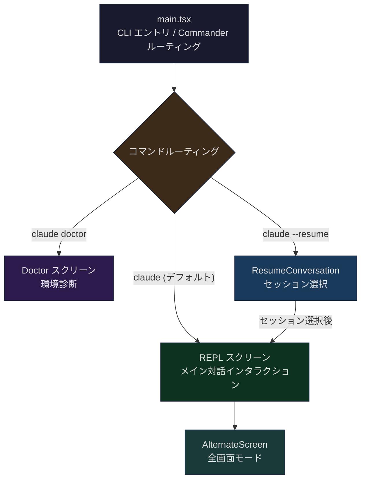
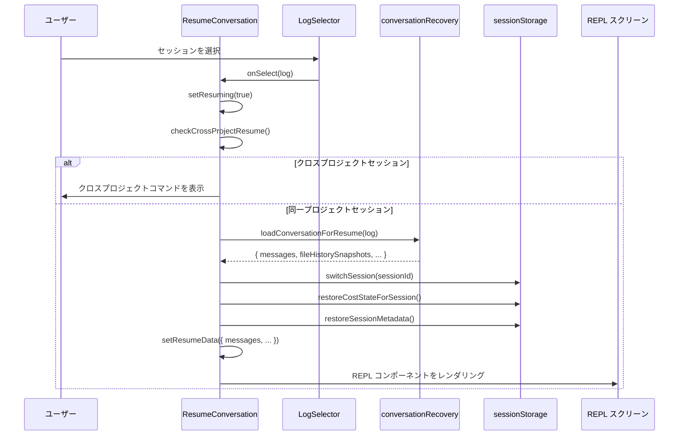
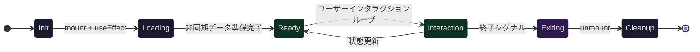

## 問題提起

`claude` を入力して新しいセッションを開始すると、ターミナルは全画面のインタラクティブインターフェースに切り替わります——メッセージは上部でスクロールし、入力欄は下部に固定され、マウスホイールで履歴を閲覧できます。`/doctor` を入力すると、画面全体が診断パネルに置き換わります。`claude --resume` を実行すると、セッション選択画面が表示され、過去の会話を閲覧・復元できます。これら 3 つのまったく異なるインタラクションモードは、すべて同じターミナルウィンドウ内で動作しています。

これらの異なる「スクリーン」はどう整理されているのか？スクリーン間の切り替えはどう行われるのか？全画面モードと通常のターミナル出力には根本的にどのような違いがあるのか？ターミナルの alternate screen buffer はどう活用されているのか？本記事では Claude Code の `src/screens/` ディレクトリを深掘りし、このスクリーンシステムのアーキテクチャ設計を解析します。

核心的な問いは以下の通りです：

1. **スクリーンディレクトリのアーキテクチャ**：3 つのスクリーンファイル（REPL、Doctor、ResumeConversation）はどう分担するのか？共通のパターンは何か？
2. **全画面メカニズム**：`AlternateScreen` コンポーネントはターミナルの DEC Private Mode 1049 をどう活用してスクリーン切り替えを実現するのか？
3. **ライフサイクル管理**：スクリーンの開始、レンダリング、インタラクション、終了、状態復元はどうオーケストレーションされるのか？
4. **スクリーン間の切り替え**：Doctor の診断完了後にどう REPL に戻るのか？Resume でセッション選択後にどうシームレスに REPL へ遷移するのか？

## screens/ ディレクトリのアーキテクチャ

### 3 つのコアスクリーンファイル

Claude Code のスクリーンシステムは `src/screens/` ディレクトリ内に配置され、3 つのコアファイルを含みます：

```
src/screens/
├── REPL.tsx              # メインインタラクションスクリーン（約 5000 行）
├── Doctor.tsx            # 診断スクリーン（約 500 行）
└── ResumeConversation.tsx # セッション復元スクリーン（約 400 行）
```

これら 3 つのファイルのボリュームの差は責務範囲を反映しています。REPL はアプリケーション全体の主戦場です——メッセージフロー、ツール実行、権限リクエスト、スクロール管理、ショートカットキー処理のすべてがここにあります。Doctor は一回限りの診断パネルです。ResumeConversation はトランジションスクリーンで、選択完了後に REPL に制御を委譲します。



### スクリーンの共通パターン

3 つのスクリーンの複雑さには大きな差がありますが、いくつかの重要なアーキテクチャパターンを共有しています：

**Props 駆動のライフサイクルコールバック**。各スクリーンは「完了」を通知するコールバック関数を受け取ります：

```typescript
// Doctor.tsx (第 32-36 行)
type Props = {
  onDone: (result?: string, options?: {
    display?: CommandResultDisplay;
  }) => void;
};
```

Doctor スクリーンはユーザーが Enter を押した後に `onDone` を呼び出します。ResumeConversation はロード完了後に内蔵の REPL コンポーネントをレンダリングします。このパターンにより、スクリーンの組み合わせが宣言的になります——親コンポーネントはスクリーン内部の状態機械を知る必要がありません。

**React 状態管理 + 非同期初期化**。各スクリーンはマウント時に非同期操作を開始し（Doctor は診断情報を取得、Resume は履歴ログをロード）、`useState` + `useEffect` で loading から ready への状態遷移を駆動します。

**KeybindingSetup ラッパー**。すべてのスクリーンは `KeybindingSetup` コンテキスト内で実行され、ショートカットキーシステム（Ctrl+C 終了、Enter 確認等）が各スクリーンで利用可能であることを保証します。

## REPL スクリーン：メインインタラクションの核心

### コンポーネント規模と責務

REPL は Claude Code で最もコアなスクリーンであり、コード量が最大の単一コンポーネントファイルでもあります。import リストは 280 行を超え、メッセージ管理、ツール実行、権限制御、MCP 接続、キーバインド、スクロール管理、音声統合など、ほぼすべてのサブシステムをカバーしています。

```typescript
// REPL.tsx (第 572-598 行)
export function REPL({
  commands: initialCommands,
  debug,
  initialTools,
  initialMessages,
  pendingHookMessages,
  initialFileHistorySnapshots,
  initialContentReplacements,
  initialAgentName,
  initialAgentColor,
  mcpClients: initialMcpClients,
  dynamicMcpConfig: initialDynamicMcpConfig,
  autoConnectIdeFlag,
  strictMcpConfig = false,
  systemPrompt: customSystemPrompt,
  appendSystemPrompt,
  onBeforeQuery,
  onTurnComplete,
  disabled = false,
  mainThreadAgentDefinition: initialMainThreadAgentDefinition,
  disableSlashCommands = false,
  taskListId,
  remoteSessionConfig,
  directConnectConfig,
  sshSession,
  thinkingConfig
}: Props): React.ReactNode {
```

REPL が受け取る props はセッション全体の初期状態を定義しています——初期メッセージ（resume 用）、ツールリスト、MCP クライアント、システムプロンプト等。これらの props は `main.tsx` のルーティング層で注入されます。

### 全画面レイアウト：FullscreenLayout

REPL のコアレイアウトは `FullscreenLayout` コンポーネントが管理しています。このコンポーネントはターミナルビューポートをスクロール可能なメッセージ領域と下部に固定された入力領域の 2 つに分割します。

```typescript
// FullscreenLayout.tsx (第 258-266 行 コメント)
/**
 * Layout wrapper for the REPL. In fullscreen mode, puts scrollable
 * content in a sticky-scroll box and pins bottom content via flexbox.
 * Outside fullscreen mode, renders content sequentially so the existing
 * main-screen scrollback rendering works unchanged.
 *
 * Fullscreen mode defaults on for ants (CLAUDE_CODE_NO_FLICKER=0 to opt out)
 * and off for external users (CLAUDE_CODE_NO_FLICKER=1 to opt in).
 */
```

`FullscreenLayout` には 2 つのレンダリングパスがあります。全画面モードでは `ScrollBox`（`stickyScroll` 付き）をメッセージコンテナとして使用し、下部領域は flexbox の `flexShrink={0}` で固定します：

```typescript
// FullscreenLayout.tsx (第 338-446 行 簡略化)
if (isFullscreenEnvEnabled()) {
  return (
    <PromptOverlayProvider>
      {/* スクロール可能なメッセージ領域 */}
      <Box flexGrow={1} flexDirection="column" overflow="hidden">
        <StickyPromptHeader />
        <ScrollBox ref={scrollRef} flexGrow={1} stickyScroll={true}>
          <ScrollChromeContext value={chromeCtx}>
            {scrollable}
          </ScrollChromeContext>
          {overlay}
        </ScrollBox>
        <NewMessagesPill count={newMessageCount} onClick={onPillClick} />
        {bottomFloat}
      </Box>
      {/* 固定の下部領域（入力欄、spinner、権限リクエスト） */}
      <Box flexDirection="column" flexShrink={0} maxHeight="50%">
        <SuggestionsOverlay />
        <DialogOverlay />
        <Box flexDirection="column" overflowY="hidden">
          {bottom}
        </Box>
      </Box>
      {/* モーダル層（スラッシュコマンドダイアログ） */}
      {modal && <ModalContext ...> ... </ModalContext>}
    </PromptOverlayProvider>
  );
}
// 非全画面モード：シンプルな順次レンダリング
return <>{scrollable}{bottom}{overlay}{modal}</>;
```

非全画面モードでは、すべてのコンテンツが順次レンダリングされ、ターミナル自体のスクロールバッファに依存します。これは重要なフォールバックパスです——tmux `-CC` モードやユーザーが明示的に全画面を無効にした場合に使用されます。

### AlternateScreen：ターミナルのダブルバッファリング

全画面モードの基盤はターミナルの alternate screen buffer（DEC Private Mode 1049）です。`AlternateScreen` コンポーネントがこのメカニズムをカプセル化しています：

```typescript
// AlternateScreen.tsx (第 33-56 行 元の TypeScript)
export function AlternateScreen({
  children,
  mouseTracking = true,
}: Props): React.ReactNode {
  const size = useContext(TerminalSizeContext)
  const writeRaw = useContext(TerminalWriteContext)

  useInsertionEffect(() => {
    const ink = instances.get(process.stdout)
    if (!writeRaw) return

    writeRaw(
      ENTER_ALT_SCREEN +        // ESC[?1049h
        '\x1b[2J\x1b[H' +       // 画面クリア + カーソル原点
        (mouseTracking ? ENABLE_MOUSE_TRACKING : ''),
    )
    ink?.setAltScreenActive(true, mouseTracking)

    return () => {
      ink?.setAltScreenActive(false)
      ink?.clearTextSelection()
      writeRaw(
        (mouseTracking ? DISABLE_MOUSE_TRACKING : '') +
        EXIT_ALT_SCREEN          // ESC[?1049l
      )
    }
  }, [writeRaw, mouseTracking])

  return (
    <Box flexDirection="column"
         height={size?.rows ?? 24}
         width="100%" flexShrink={0}>
      {children}
    </Box>
  )
}
```

このコードは行ごとに分析する価値があります：

1. **`useInsertionEffect` を `useLayoutEffect` の代わりに使用**：これは重要な詳細です。React reconciler は mutation と layout commit の間に `resetAfterCommit` を呼び出し、Ink の `resetAfterCommit` は `onRender` をトリガーします。`useLayoutEffect` を使用すると、最初の `onRender` が effect の前にトリガーされ、1 フレーム分をメインスクリーンに書き込んでしまいます。Insertion effect は mutation フェーズで実行されるため、`ENTER_ALT_SCREEN` シーケンスが最初のフレームの前にターミナルに到達することが保証されます。

2. **`height={size?.rows ?? 24}`**：コンポーネントの高さをターミナルの行数に固定します。これが全画面モードのコアな制約です——この制限がなければ、`ScrollBox` の `flexGrow` に上限がなく、viewport が content height と等しくなり、`scrollTop` は常に 0 になります。

3. **クリーンアップ関数の順序**：まず `setAltScreenActive(false)` で Ink レンダラーに通知し、次に `clearTextSelection` でテキスト選択状態をクリアし、最後に `EXIT_ALT_SCREEN` を書き込んでメインスクリーンを復元します。

REPL はルートレベルで `AlternateScreen` をラップしています：

```typescript
// REPL.tsx (第 4999-5003 行)
if (isFullscreenEnvEnabled()) {
  return <AlternateScreen mouseTracking={isMouseTrackingEnabled()}>
      {mainReturn}
    </AlternateScreen>;
}
return mainReturn;
```

## Doctor スクリーン：/doctor 環境診断フロー

### 起動パス

Doctor スクリーンには 2 つのエントリポイントがあります：

1. **CLI サブコマンド**：`claude doctor` で直接起動し、`main.tsx` の Commander ルーティングで `doctorHandler` に転送
2. **REPL スラッシュコマンド**：会話中に `/doctor` と入力し、REPL が現在のコンテキスト内で Doctor コンポーネントをレンダリング

CLI エントリの起動コードはスクリーンの独立起動モードを示しています：

```typescript
// cli/handlers/util.tsx (第 72-87 行)
export async function doctorHandler(root: Root): Promise<void> {
  logEvent('tengu_doctor_command', {});
  await new Promise<void>(resolve => {
    root.render(
      <AppStateProvider>
        <KeybindingSetup>
          <MCPConnectionManager
            dynamicMcpConfig={undefined}
            isStrictMcpConfig={false}
          >
            <DoctorWithPlugins onDone={() => {
              void resolve();
            }} />
          </MCPConnectionManager>
        </KeybindingSetup>
      </AppStateProvider>
    );
  });
  root.unmount();
  process.exit(0);
}
```

ここでのパターンに注目してください：`Promise` を作成し、`resolve` をコンポーネントの `onDone` コールバックに渡します。ユーザーが Enter を押して診断パネルを閉じると Promise が resolve し、続いて unmount してプロセスが終了します。Doctor が CLI サブコマンドとして動作する場合は `AlternateScreen` が不要です——シンプルな情報表示パネルで、ターミナル自体のスクロールに依存します。

### 診断データ収集

Doctor コンポーネントはマウント時に多次元の診断データを並列収集します：

```typescript
// Doctor.tsx (第 119-221 行 簡略化)
const [diagnostic, setDiagnostic] = useState(null);
const [agentInfo, setAgentInfo] = useState(null);
const [contextWarnings, setContextWarnings] = useState(null);
const [versionLockInfo, setVersionLockInfo] = useState(null);
const validationErrors = useSettingsErrors();

useEffect(() => {
  // 1. 基本診断：バージョン、インストールパス、パッケージマネージャー、ripgrep 状態
  getDoctorDiagnostic().then(setDiagnostic);

  (async () => {
    // 2. Agent 情報：ロード済みの agents、解析失敗ファイル
    const userAgentsDir = join(getClaudeConfigHomeDir(), "agents");
    const projectAgentsDir = join(getOriginalCwd(), ".claude", "agents");
    const { activeAgents, allAgents, failedFiles } = agentDefinitions;
    // ...

    // 3. コンテキスト警告：CLAUDE.md サイズ、MCP ツール数
    const warnings = await checkContextWarnings(tools, ...);
    setContextWarnings(warnings);

    // 4. バージョンロック情報：PID ロックファイルのクリーンアップ
    if (isPidBasedLockingEnabled()) {
      const staleLocksCleaned = cleanupStaleLocks(locksDir);
      const locks = getAllLockInfo(locksDir);
      setVersionLockInfo({ enabled: true, locks, locksDir, staleLocksCleaned });
    }
  })();
}, [toolPermissionContext, tools, agentDefinitions]);
```

収集された診断情報は複数のパネルにレンダリングされます：

| パネル | 内容 |
|------|------|
| Diagnostics | バージョン番号、インストールタイプ、パス、パッケージマネージャー、ripgrep 状態 |
| Updates | 自動更新状態、更新権限、安定版/最新版番号 |
| Sandbox | サンドボックス分離状態 |
| MCP | MCP サーバー設定解析の警告 |
| Keybindings | キーバインド設定の警告 |
| Environment Variables | 環境変数バリデーションエラー |
| Version Locks | PID ロックファイル状態、期限切れロックのクリーンアップ |
| Agent Parse Errors | Agent 定義ファイルの解析失敗 |
| Plugin Errors | プラグインエラー |
| Context Usage Warnings | CLAUDE.md サイズ、Agent コンテキスト使用量 |

すべてのパネルは `Pane` コンポーネントでラップされ、diagnostic データのロード前は `Checking installation status...` のプレースホルダーテキストを表示します。

### 終了メカニズム

Doctor は最もシンプルな終了モードを使用しています——`PressEnterToContinue` コンポーネント + keybinding リスナー：

```typescript
// Doctor.tsx (第 234-255 行)
const handleDismiss = () => {
  onDone("Claude Code diagnostics dismissed", { display: "system" });
};

useKeybindings({
  "confirm:yes": handleDismiss,
  "confirm:no": handleDismiss
}, { context: "Confirmation" });

// 下部レンダリング
<Box><PressEnterToContinue /></Box>
```

`confirm:yes` と `confirm:no` の両方が dismiss にマッピングされています——ユーザーが Enter を押しても Escape を押しても、パネルが閉じます。CLI モードでは `process.exit(0)` をトリガーし、REPL の `/doctor` モードでは対話フローに制御を返します。

## Resume スクリーン：セッション復元 UI

### 段階的ログロード

ResumeConversation はトランジションスクリーンです——唯一の目的はユーザーに履歴セッションを選択させ、制御を REPL に委譲することです。しかし「履歴セッションの選択」という一見シンプルな機能には、段階的ローディングの巧妙な設計が関わっています。

```typescript
// ResumeConversation.tsx (第 126-136 行)
React.useEffect(() => {
  loadSameRepoMessageLogsProgressive(worktreePaths).then(result => {
    sessionLogResultRef.current = result;
    logCountRef.current = result.logs.length;
    setLogs(result.logs);
    setLoading(false);
  }).catch(error => {
    logError(error);
    setLoading(false);
  });
}, [worktreePaths]);
```

`loadSameRepoMessageLogsProgressive` は同一リポジトリ（worktree を含む）のセッションログのみをロードします。ユーザーは「全プロジェクト」モードに切り替えてクロスリポジトリのログをロードできます：

```typescript
// ResumeConversation.tsx (第 156-168 行)
const loadLogs = React.useCallback((allProjects: boolean) => {
  setLoading(true);
  const promise = allProjects
    ? loadAllProjectsMessageLogsProgressive()
    : loadSameRepoMessageLogsProgressive(worktreePaths);
  promise.then(result => {
    sessionLogResultRef.current = result;
    logCountRef.current = result.logs.length;
    setLogs(result.logs);
  }).finally(() => setLoading(false));
}, [worktreePaths]);
```

さらに、ユーザーがリストの下部までスクロールすると `loadMoreLogs` がオンデマンドで追加履歴をロードします：

```typescript
// ResumeConversation.tsx (第 137-155 行)
const loadMoreLogs = React.useCallback((count: number) => {
  const ref = sessionLogResultRef.current;
  if (!ref || ref.nextIndex >= ref.allStatLogs.length) return;
  void enrichLogs(ref.allStatLogs, ref.nextIndex, count).then(result => {
    ref.nextIndex = result.nextIndex;
    if (result.logs.length > 0) {
      const offset = logCountRef.current;
      result.logs.forEach((log, i) => { log.value = offset + i; });
      setLogs(prev => prev.concat(result.logs));
      logCountRef.current += result.logs.length;
    } else if (ref.nextIndex < ref.allStatLogs.length) {
      loadMoreLogs(count); // 有効なログが見つかるまで再帰的にロード
    }
  });
}, []);
```

### セッション選択と復元フロー

ユーザーが `LogSelector` からセッションを選択すると `onSelect` コールバックがトリガーされます。これが復元フロー全体で最も複雑な部分です：



復元フローの主要ステップ（第 178-292 行）：

1. **クロスプロジェクト検出**：`checkCrossProjectResume` が選択されたセッションが異なるディレクトリからのものかチェックします。クロスプロジェクトセッションの場合、正しいディレクトリで復元するためのコマンド（クリップボードにコピー済み）を表示します。

2. **メッセージロード**：`loadConversationForResume` が JSONL ファイルからメッセージ履歴をデシリアライズします。

3. **セッション切り替え**：`switchSession` がグローバル session ID を更新し、`restoreCostStateForSession` がそのセッションの API 呼び出し費用統計を復元します。

4. **Agent 復元**：`restoreAgentFromSession` がセッションメタデータに基づいて agent 定義と配色を復元します。

5. **状態遷移**：`setResumeData` が React の再レンダリングをトリガーし、条件分岐が `LogSelector` から REPL コンポーネントに切り替わります。

状態遷移の条件レンダリングロジック：

```typescript
// ResumeConversation.tsx (第 293-314 行)
if (crossProjectCommand) {
  return <CrossProjectMessage command={crossProjectCommand} />;
}
if (resumeData) {
  return <REPL
    debug={debug}
    commands={commands}
    initialMessages={resumeData.messages}
    initialFileHistorySnapshots={resumeData.fileHistorySnapshots}
    // ... すべての復元データを props 経由で REPL に注入
  />;
}
if (loading) {
  return <Box><Spinner /><Text> Loading conversations...</Text></Box>;
}
if (resuming) {
  return <Box><Spinner /><Text> Resuming conversation...</Text></Box>;
}
return <LogSelector logs={filteredLogs} ... />;
```

これは状態機械駆動のレンダリングパターンです：`loading` -> `LogSelector` -> `resuming` -> `REPL`（または `CrossProjectMessage`）。各状態がまったく異なる UI に対応します。

## スクリーンのライフサイクル：開始 / レンダリング / インタラクション / 終了 / 状態復元

### ライフサイクルモデル

3 つのスクリーンにはそれぞれ異なるライフサイクルモデルがありますが、統一的なフェーズに抽象化できます：



**Doctor のライフサイクルが最もシンプル**：

| フェーズ | 動作 |
|------|------|
| Init | mount、keybinding を登録 |
| Loading | `getDoctorDiagnostic()` + 並列データ取得 |
| Ready | 診断パネルをレンダリング |
| Interaction | Enter/Escape のみ監視 |
| Exiting | `onDone` を呼び出し、unmount をトリガー |

**ResumeConversation のライフサイクルはトランジション型**：

| フェーズ | 動作 |
|------|------|
| Init | mount |
| Loading | `loadSameRepoMessageLogsProgressive()` |
| Ready | LogSelector をレンダリング |
| Interaction | リストナビゲーション、検索、クロスプロジェクト切り替え |
| Exiting | 本当の終了ではなく、REPL のレンダリングに切り替え |

**REPL のライフサイクルは常駐型**：

| フェーズ | 動作 |
|------|------|
| Init | mount、alt screen に入る、200 以上の状態変数を初期化 |
| Loading | hooks、MCP 接続、ツールプールを並列ロード |
| Ready | FullscreenLayout をレンダリング |
| Interaction | 無限ループ：ユーザー入力 -> API クエリ -> ツール実行 -> メッセージレンダリング |
| Exiting | session end hooks を実行 -> alt screen を退出 -> unmount |

### AlternateScreen の開始と終了

全画面モードの開始と終了はターミナルエスケープシーケンスで実現されます。開始時：

```
ESC[?1049h    → メインスクリーンのカーソル位置を保存、代替スクリーンバッファに切り替え
ESC[2J        → 代替スクリーンをクリア
ESC[H         → カーソルを (0,0) に移動
ESC[?1000h    → マウスクリックトラッキングを有効化
ESC[?1002h    → マウスボタンイベントトラッキングを有効化
ESC[?1006h    → SGR 拡張マウスプロトコルを有効化
```

終了時：

```
ESC[?1006l    → SGR マウスを無効化
ESC[?1002l    → ボタンイベントトラッキングを無効化
ESC[?1000l    → マウストラッキングを無効化
ESC[?1049l    → メインスクリーンバッファに切り替え、カーソル位置を復元
```

ターミナルは 2 つの独立したスクリーンバッファを管理しています。メインスクリーンの内容は alt screen に入る際に保存され、退出時に自動的に復元されます。つまり Claude Code が終了した後、ターミナルにあった以前のコンテンツ（コマンド履歴、他のプログラムの出力）はそのまま残ります。

## メイン対話フローとの切り替えメカニズム

### main.tsx のルーティング層

スクリーンの切り替えは 2 つのレベルで発生します：起動時のルーティングとランタイムのモード切り替えです。

起動時のルーティングは `main.tsx` が制御します。Commander.js でコマンドライン引数を解析し、サブコマンドとフラグに基づいてどのスクリーンをレンダリングするか決定します：

```typescript
// main.tsx ルーティングロジック（簡略化）

// claude doctor → 独立した診断スクリーン
program.command('doctor').action(async () => {
  const root = await createRoot(getBaseRenderOptions(false));
  await doctorHandler(root);  // Doctor をレンダリング → onDone → unmount → exit
});

// claude --resume → セッション復元スクリーンまたは直接 REPL
if (hasResumeFlag) {
  if (specificSessionId) {
    // 指定セッションを直接復元 → launchRepl
    await launchRepl(root, appProps, {
      initialMessages: resumedMessages,
      // ...
    }, renderAndRun);
  } else {
    // 選択画面を表示 → launchResumeChooser
    await launchResumeChooser(root, appProps, worktreePaths, {
      initialSearchQuery: searchTerm,
      forkSession: options.forkSession,
      // ...
    });
  }
} else {
  // デフォルトパス → launchRepl（新しいセッション）
  await launchRepl(root, appProps, sessionConfig, renderAndRun);
}
```

`launchRepl` と `launchResumeChooser` は React ツリーの構築とレンダリングをカプセル化しています：

```typescript
// replLauncher.tsx (第 12-22 行)
export async function launchRepl(
  root: Root,
  appProps: AppWrapperProps,
  replProps: REPLProps,
  renderAndRun: (root: Root, element: React.ReactNode) => Promise<void>,
): Promise<void> {
  const { App } = await import('./components/App.js');
  const { REPL } = await import('./screens/REPL.js');
  await renderAndRun(root, <App {...appProps}><REPL {...replProps} /></App>);
}
```

`import()` の使用に注目してください——REPL と App はどちらも動的インポートされています。これにより Doctor サブコマンドは REPL のコードをロードせずに実行でき、起動時間を節約します。

### ランタイムのスクリーン内切り替え

REPL 実行中に `/doctor` スラッシュコマンドを入力しても、React ツリー全体は置き換わりません——REPL の既存コンテキスト内で Doctor コンポーネントがレンダリングされます。Doctor の `onDone` コールバックは結果をシステムメッセージとして対話フローに注入します：

```typescript
// Doctor の REPL 内での onDone
onDone: (result?: string, options?) => {
  onDone("Claude Code diagnostics dismissed", { display: "system" });
}
```

このモードでは Doctor 自身の `AppStateProvider` や `KeybindingSetup` は不要です——REPL が既に持っているコンテキストを再利用します。CLI エントリの Doctor がこれらの Provider を手動でラップする必要があるのに対し、REPL 内の `/doctor` はその必要がないのは、このためです。

Transcript モード（Ctrl+O）はもう一つのランタイム切り替えです。REPL は同じ `AlternateScreen` 内でレンダリング内容を切り替えます：

```typescript
// REPL.tsx (第 4484-4489 行)
if (transcriptScrollRef) {
  return <AlternateScreen mouseTracking={isMouseTrackingEnabled()}>
      {transcriptReturn}
    </AlternateScreen>;
}
return transcriptReturn;
```

これにより alt buffer がモード切り替え時に維持されます——React reconciler は同じタイプの `AlternateScreen` コンポーネントを見て、children のみを更新します。

## 全画面モードの環境互換性

### tmux -CC 検出

全画面モードはすべてのターミナル環境で利用できるわけではありません。最も厄介な互換性問題は tmux の `-CC` モード（iTerm2 統合モード）に起因します。このモードでは tmux の alt screen + mouse tracking がターミナル状態を破壊する可能性があります。

`src/utils/fullscreen.ts` が多層検出を実装しています：

```typescript
// fullscreen.ts (第 29-86 行)
function isTmuxControlModeEnvHeuristic(): boolean {
  if (!process.env.TMUX) return false;
  if (process.env.TERM_PROGRAM !== 'iTerm.app') return false;
  const term = process.env.TERM ?? '';
  return !term.startsWith('screen') && !term.startsWith('tmux');
}

function probeTmuxControlModeSync(): void {
  tmuxControlModeProbed = isTmuxControlModeEnvHeuristic();
  if (tmuxControlModeProbed) return;
  if (!process.env.TMUX) return;
  if (process.env.TERM_PROGRAM) return; // 非 iTerm → 探査不要
  // SSH シナリオ：TERM_PROGRAM が伝播しない、tmux に直接問い合わせる必要がある
  let result;
  try {
    result = spawnSync('tmux',
      ['display-message', '-p', '#{client_control_mode}'],
      { encoding: 'utf8', timeout: 2000 });
  } catch { return; }
  if (result.status !== 0) return;
  tmuxControlModeProbed = result.stdout.trim() === '1';
}
```

検出は 2 層に分かれています：

1. **環境変数ヒューリスティック**（ゼロプロセスオーバーヘッド）：`TMUX` が設定されており `TERM_PROGRAM` が `iTerm.app` で、`TERM` が `screen`/`tmux` で始まらない場合、`-CC` モードと判定します。
2. **同期 tmux 探査**（約 5ms）：SSH シナリオ（`TERM_PROGRAM` が伝播しない）でのみトリガーされ、`spawnSync` で tmux の `client_control_mode` 変数を問い合わせます。

`spawnSync`（同期）を非同期バージョンの代わりに使用しているのは意図的です——この結果が全画面に入るかどうかを決定するため、非同期探査は過去に競合状態を引き起こしました：探査完了前に React が alt screen をレンダリングしてしまい、ユーザーのマウスホイールが動かなくなりました。

### 環境変数による制御

全画面モードは `CLAUDE_CODE_NO_FLICKER` 環境変数で制御されます：

```typescript
// fullscreen.ts (第 112-129 行)
export function isFullscreenEnvEnabled(): boolean {
  if (isEnvDefinedFalsy(process.env.CLAUDE_CODE_NO_FLICKER)) return false;
  if (isEnvTruthy(process.env.CLAUDE_CODE_NO_FLICKER)) return true;
  if (isTmuxControlMode()) {
    // 自動的に無効化、ログに記録
    return false;
  }
  return process.env.USER_TYPE === 'ant'; // 内部ユーザーはデフォルトで有効
}
```

追加のきめ細かい制御として：

- `CLAUDE_CODE_DISABLE_MOUSE`：alt screen を維持しつつマウストラッキングを無効化（tmux でのコピー競合を解決）
- `CLAUDE_CODE_DISABLE_MOUSE_CLICKS`：マウスクリックを無効にしつつホイールは維持（誤タッチ防止）

## 移行可能なパターン

Claude Code のスクリーンシステムは、ターミナルアプリケーションのための複数の再利用可能な設計パターンを提供しています：

### パターン 1：Props コールバック駆動のスクリーンライフサイクル

各スクリーンは `onDone` コールバックを受け取り、親コンポーネントが `Promise` で完了を待ちます。このパターンにより、スクリーンは異なるコンテキスト（独立 CLI コマンド、REPL 内蔵、テスト環境）で再利用可能になります。

```typescript
// 汎用パターン
await new Promise<void>(resolve => {
  root.render(
    <Providers>
      <ScreenComponent onDone={() => resolve()} />
    </Providers>
  );
});
root.unmount();
```

### パターン 2：AlternateScreen ダブルバッファリング

ターミナルの alt screen buffer を活用して全画面アプリケーションを実現し、終了後に以前のターミナルコンテンツを自動復元します。鍵は `useInsertionEffect` で最初のフレームレンダリング前にエスケープシーケンスがターミナルに到達することを保証することです。

### パターン 3：段階的状態機械レンダリング

ResumeConversation の `loading -> selector -> resuming -> REPL` 状態機械は、単一コンポーネント内で多段階 UI 遷移を実現する方法を示しています。各段階がまったく異なるコンポーネントツリーをレンダリングします。

### パターン 4：環境互換性のフォールバック

全画面モードの多層検出（環境変数ヒューリスティック -> 同期プロセス探査 -> 環境変数オーバーライド）は、再利用可能なターミナル機能検出戦略です。全画面が使用できない環境では、システムは順次レンダリングモードにフォールバックし、機能は影響を受けません。

### パターン 5：スクリーン再利用とコンテキスト継承

Doctor は REPL 内で実行する際、REPL の Provider コンテキスト（AppState、KeybindingSetup、MCPConnectionManager）を再利用し、CLI モードではこれらの Provider を自ら持ちます。この設計により同一コンポーネントがコンポーネント自体の修正なしに 2 つのシナリオで動作可能です。

## まとめ

Claude Code のスクリーンシステムは緻密に設計された多層アーキテクチャです：

- **基盤層**：`AlternateScreen` コンポーネントがターミナル DEC 1049 プライベートモードでダブルバッファリングを実現し、`useInsertionEffect` がタイミングの正確さを保証
- **レイアウト層**：`FullscreenLayout` がターミナルビューポートをスクロール可能領域と固定下部領域に分割し、flexbox で自適応レイアウトを実現
- **スクリーン層**：3 つのスクリーンファイルがそれぞれの役割を担う——REPL はメインインタラクションループ、Doctor は診断情報の提供、ResumeConversation はセッション復元遷移の処理
- **ルーティング層**：`main.tsx` が Commander ルーティングで起動するスクリーンを決定し、`replLauncher.tsx` と `dialogLaunchers.tsx` が React ツリーの構築をカプセル化
- **互換性層**：tmux `-CC` 検出、環境変数制御、非全画面フォールバックにより、各種ターミナル環境でシステムが動作することを保証

このシステムの最大の設計的洞察は：**ターミナルの alternate screen buffer はブラウザの "page navigation" に等しい** ということです。alt screen に入ることは新しいページを開くこと（古いページが保存される）に似ており、退出することは戻るボタンを押すこと（古いページが復元される）に似ています。Claude Code はこの基盤の上に React 駆動のスクリーン管理システムを構築し、ターミナルアプリケーションにも SPA のようなマルチビュー体験を実現しています。
