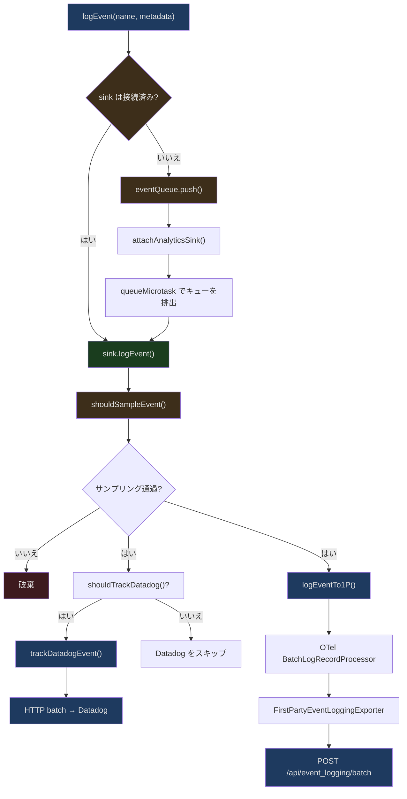
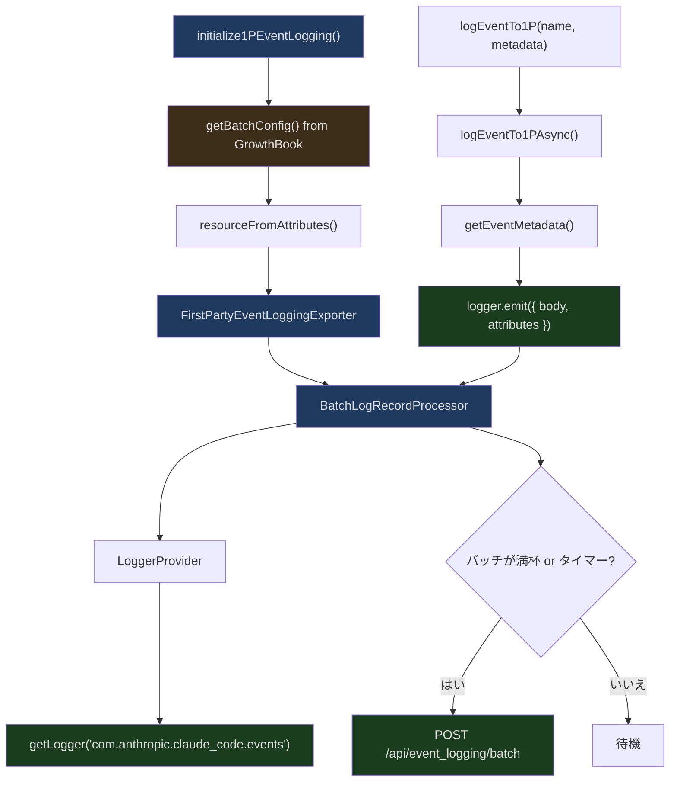
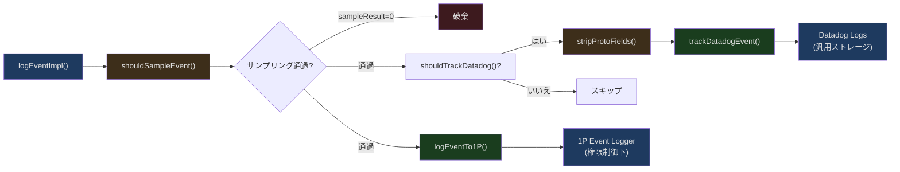

## 問題提起

CLI ツールにテレメトリは必要でしょうか？答えはイエスです——ただし、Web アプリケーションとは全く異なるアプローチが求められます。Web アプリはページロード後に非同期で GA4 を初期化でき、数百ミリ秒の遅延をユーザーは気づきません。一方で CLI ツールの起動時間はミリ秒単位で計られます——`claude --help` が OpenTelemetry SDK のロードのために 200ms 余計にかかれば、ユーザーはすぐに違和感を覚えます。

Claude Code のテレメトリシステムは 3 つの課題に直面しています：
1. **起動コストゼロ** — テレメトリが CLI の起動を遅延させてはならない
2. **プライバシー最優先** — コード、ファイルパス、その他の機密情報を記録してはならない
3. **確実な配信** — ネットワーク障害時にイベントを失ってはならない

この記事では、イベントキュー、遅延ロード、多層 Sink、コンパイル時のデッドコード除去によってこれらの問題をどのように解決しているかを分析します。

## テレメトリアーキテクチャ概観



## ゼロ依存のイベントエントリポイント

`src/services/analytics/index.ts` がテレメトリシステム全体のエントリポイントです。設計原則はファイルの冒頭で明示されています：

```typescript
// src/services/analytics/index.ts 行 1-9
/**
 * Analytics service - public API for event logging
 *
 * DESIGN: This module has NO dependencies to avoid import cycles.
 * Events are queued until attachAnalyticsSink() is called during app initialization.
 * The sink handles routing to Datadog and 1P event logging.
 */
```

**ゼロ依存**。このモジュールはプロジェクト内の他のモジュールを一切インポートしません——config も auth も model もインポートしません。なぜでしょうか？ほぼすべてのモジュールが `logEvent` を必要とするため、analytics が逆にそれらに依存してしまうと循環インポートが発生するからです。

### イベントキューメカニズム

```typescript
// src/services/analytics/index.ts 行 81-84, 95-123
const eventQueue: QueuedEvent[] = []
let sink: AnalyticsSink | null = null

export function attachAnalyticsSink(newSink: AnalyticsSink): void {
  if (sink !== null) return  // 冪等
  sink = newSink

  if (eventQueue.length > 0) {
    const queuedEvents = [...eventQueue]
    eventQueue.length = 0

    // 非同期で排出し、起動パスをブロックしない
    queueMicrotask(() => {
      for (const event of queuedEvents) {
        if (event.async) {
          void sink!.logEventAsync(event.eventName, event.metadata)
        } else {
          sink!.logEvent(event.eventName, event.metadata)
        }
      }
    })
  }
}
```

これは典型的な「先にキューイング、後で消費」パターンです：

1. CLI 起動時、各モジュールの初期化中に `logEvent` でイベントを記録
2. この時点では sink がまだ初期化されていないため、イベントは `eventQueue` にプッシュされる
3. アプリケーションのコア初期化が完了後、`attachAnalyticsSink` で実際の sink を注入
4. キューは `queueMicrotask` で非同期に排出される——現在の起動パスをブロックしない

重要な詳細は `setTimeout` ではなく `queueMicrotask` を使用している点です。マイクロタスクは現在のイベントループの終了時に実行され、`setTimeout(fn, 0)` より高速ですが、同期コードをブロックしません。

### 型安全によるプライバシー保護

```typescript
// src/services/analytics/index.ts 行 19-33
export type AnalyticsMetadata_I_VERIFIED_THIS_IS_NOT_CODE_OR_FILEPATHS = never

export type AnalyticsMetadata_I_VERIFIED_THIS_IS_PII_TAGGED = never
```

この 2 つの型名は驚くほど長いです。これらは `never` 型のエイリアスで、任意の `string` 値をイベントメタデータとして渡すには、明示的にアサーションする必要があります：

```typescript
myString as AnalyticsMetadata_I_VERIFIED_THIS_IS_NOT_CODE_OR_FILEPATHS
```

さらに `logEvent` のメタデータシグネチャはより厳格です：

```typescript
// src/services/analytics/index.ts 行 61
type LogEventMetadata = { [key: string]: boolean | number | undefined }
```

**string 型が存在しません**。メタデータの値は `boolean`、`number`、`undefined` のみ許可されます。これにより型システムのレベルでコードスニペットやファイルパスの意図しない記録を防止しています。

### _PROTO_ キーによる PII の分離

```typescript
// src/services/analytics/index.ts 行 45-58
export function stripProtoFields<V>(
  metadata: Record<string, V>,
): Record<string, V> {
  let result: Record<string, V> | undefined
  for (const key in metadata) {
    if (key.startsWith('_PROTO_')) {
      if (result === undefined) {
        result = { ...metadata }
      }
      delete result[key]
    }
  }
  return result ?? metadata
}
```

`_PROTO_` で始まるキーには PII（個人識別情報）が含まれており、権限制御された 1P proto カラムにのみルーティングされます。`stripProtoFields` は Datadog に送信する前にこれらのフィールドを除去します。最適化にも注目してください——`_PROTO_` キーがなければ元の参照をそのまま返し、コピーは一切行いません。

## Datadog イベントトラッキング

`src/services/analytics/datadog.ts` は Datadog Logs API へのバッチ送信を実装しています。

```typescript
// src/services/analytics/datadog.ts 行 12-18
const DATADOG_LOGS_ENDPOINT =
  'https://http-intake.logs.us5.datadoghq.com/api/v2/logs'
const DATADOG_CLIENT_TOKEN = 'pubbbf48e6d78dae54bceaa4acf463299bf'
const DEFAULT_FLUSH_INTERVAL_MS = 15000
const MAX_BATCH_SIZE = 100
const NETWORK_TIMEOUT_MS = 5000
```

### イベントホワイトリスト

```typescript
// src/services/analytics/datadog.ts 行 19-64
const DATADOG_ALLOWED_EVENTS = new Set([
  'tengu_api_error',
  'tengu_api_success',
  'tengu_cancel',
  'tengu_exit',
  'tengu_init',
  'tengu_started',
  'tengu_tool_use_error',
  'tengu_tool_use_success',
  // ... 合計約 40 のイベント名
])
```

すべてのイベントが Datadog に送信されるわけではありません——明示的にホワイトリストに含まれたイベントのみが送信されます。これは二重のセキュリティです：たとえ `logEvent` に機密データを誤って渡しても、イベント名がホワイトリストに含まれていなければ、Datadog はそのデータを一切受信しません。

### バッチ送信と定期フラッシュ

```typescript
// src/services/analytics/datadog.ts 行 98-128
let logBatch: DatadogLog[] = []
let flushTimer: NodeJS.Timeout | null = null

async function flushLogs(): Promise<void> {
  if (logBatch.length === 0) return
  const logsToSend = logBatch
  logBatch = []

  try {
    await axios.post(DATADOG_LOGS_ENDPOINT, logsToSend, {
      headers: {
        'Content-Type': 'application/json',
        'DD-API-KEY': DATADOG_CLIENT_TOKEN,
      },
      timeout: NETWORK_TIMEOUT_MS,
    })
  } catch (error) {
    logError(error)
  }
}

function scheduleFlush(): void {
  if (flushTimer) return
  flushTimer = setTimeout(() => {
    flushTimer = null
    void flushLogs()
  }, getFlushIntervalMs()).unref()
}
```

`.unref()` が重要です——これにより Node.js プロセスは他にアクティブなハンドラーがない場合に終了でき、flush timer に待たされることがありません。これは CLI ツールにとって極めて重要です：ユーザーが Ctrl+C を押した後、プロセスは即座に終了すべきであり、15 秒のフラッシュを待つべきではありません。

### ユーザーバケティング

```typescript
// src/services/analytics/datadog.ts 行 281-299
const NUM_USER_BUCKETS = 30

const getUserBucket = memoize((): number => {
  const userId = getOrCreateUserID()
  const hash = createHash('sha256').update(userId).digest('hex')
  return parseInt(hash.slice(0, 8), 16) % NUM_USER_BUCKETS
})
```

この設計はアラートに使用されます。問題が発生した際に知りたいのは「何件のイベントが影響を受けたか」ではなく「何人のユーザーが影響を受けたか」です。ユーザー ID を 30 個のバケットにハッシュし、影響を受けたユニークなバケット数からユーザー数を推定します——プライバシーを保護しつつ、カーディナリティも削減できます。

## OpenTelemetry 1P イベントログ

`src/services/analytics/firstPartyEventLogger.ts` は OpenTelemetry SDK を使用してファーストパーティのイベントログを実装しています。



### 初期化

```typescript
// src/services/analytics/firstPartyEventLogger.ts 行 312-389
export function initialize1PEventLogging(): void {
  profileCheckpoint('1p_event_logging_start')
  const enabled = is1PEventLoggingEnabled()
  if (!enabled) return

  const batchConfig = getBatchConfig()
  lastBatchConfig = batchConfig
  profileCheckpoint('1p_event_after_growthbook_config')

  const scheduledDelayMillis =
    batchConfig.scheduledDelayMillis || DEFAULT_LOGS_EXPORT_INTERVAL_MS

  const resource = resourceFromAttributes({
    [ATTR_SERVICE_NAME]: 'claude-code',
    [ATTR_SERVICE_VERSION]: MACRO.VERSION,
  })

  const eventLoggingExporter = new FirstPartyEventLoggingExporter({
    maxBatchSize: maxExportBatchSize,
    skipAuth: batchConfig.skipAuth,
    maxAttempts: batchConfig.maxAttempts,
    path: batchConfig.path,
    baseUrl: batchConfig.baseUrl,
    isKilled: () => isSinkKilled('firstParty'),
  })

  firstPartyEventLoggerProvider = new LoggerProvider({
    resource,
    processors: [
      new BatchLogRecordProcessor(eventLoggingExporter, {
        scheduledDelayMillis,
        maxExportBatchSize,
        maxQueueSize,
      }),
    ],
  })

  // グローバル API ではなく、ローカル provider から logger を取得
  firstPartyEventLogger = firstPartyEventLoggerProvider.getLogger(
    'com.anthropic.claude_code.events',
    MACRO.VERSION,
  )
}
```

主要な設計判断：

1. **独立した LoggerProvider** — OpenTelemetry のグローバル API（`logs.getLogger()`）を使用せず、プライベートな provider を作成します。これにより内部イベントが顧客設定の OTLP エンドポイントに漏洩することを防ぎます。
2. **`profileCheckpoint`** — 初期化の重要なポイントで計測を行い、テレメトリシステム自体の起動所要時間を追跡します。
3. **`MACRO.VERSION`** — コンパイル時に置換されるバージョン番号定数です。
4. **GrowthBook バッチ設定** — バッチ処理パラメータ（間隔、サイズ、キュー）は GrowthBook から動的に取得され、リモートでの調整が可能です。

### ランタイム設定のホットリロード

```typescript
// src/services/analytics/firstPartyEventLogger.ts 行 407-449
export async function reinitialize1PEventLoggingIfConfigChanged(): Promise<void> {
  if (!is1PEventLoggingEnabled() || !firstPartyEventLoggerProvider) return

  const newConfig = getBatchConfig()
  if (isEqual(newConfig, lastBatchConfig)) return

  // 1. まず logger を null に設定し、並行書き込みを阻止
  const oldProvider = firstPartyEventLoggerProvider
  const oldLogger = firstPartyEventLogger
  firstPartyEventLogger = null

  // 2. 旧 provider のバッファを排出
  try {
    await oldProvider.forceFlush()
  } catch { /* エクスポート失敗はディスクに保存済み */ }

  // 3. 新しい設定で再構築
  firstPartyEventLoggerProvider = null
  try {
    initialize1PEventLogging()
  } catch (e) {
    // 旧 provider に復元し、可用性を確保
    firstPartyEventLoggerProvider = oldProvider
    firstPartyEventLogger = oldLogger
    logError(e)
    return
  }

  // 4. バックグラウンドで旧 provider をシャットダウン
  void oldProvider.shutdown().catch(() => {})
}
```

これは入念に設計されたホットスワップのフローです：

1. **切断してから構築** — logger を null にすることで、並行する `logEventTo1P` 呼び出しがスキップされます（これから閉じる provider には書き込まない）
2. **排出してから閉じる** — `forceFlush()` で旧バッファ内のイベントが失われないことを保証
3. **失敗時のロールバック** — 新しい provider の作成に失敗した場合は旧 provider を復元し、可用性を維持
4. **エクスポート失敗のディスク保存** — コメントにある通り、エクスポートに失敗したイベントはディスクファイルに書き込まれ、新しい exporter 起動後にリトライされます

## イベントサンプリング

```typescript
// src/services/analytics/firstPartyEventLogger.ts 行 43-85
export function getEventSamplingConfig(): EventSamplingConfig {
  return getDynamicConfig_CACHED_MAY_BE_STALE<EventSamplingConfig>(
    EVENT_SAMPLING_CONFIG_NAME,
    {},
  )
}

export function shouldSampleEvent(eventName: string): number | null {
  const config = getEventSamplingConfig()
  const eventConfig = config[eventName]

  // 設定なし = 100% 記録
  if (!eventConfig) return null

  const sampleRate = eventConfig.sample_rate
  if (typeof sampleRate !== 'number' || sampleRate < 0 || sampleRate > 1) {
    return null
  }

  if (sampleRate >= 1) return null  // 100%
  if (sampleRate <= 0) return 0     // 破棄

  // ランダムサンプリング
  return Math.random() < sampleRate ? sampleRate : 0
}
```

サンプリング設定は GrowthBook の `tengu_event_sampling_config` 動的設定から取得されます。戻り値のセマンティクス：

- `null` — 100% 記録、メタデータにサンプリングレートの付与不要
- `0` — このイベントを破棄
- `0.05` — このイベントはサンプリングで記録され、メタデータに `sample_rate: 0.05` を付与。後続のデータ分析で実際の量を復元するために使用

## GrowthBook Feature Flag システム

`src/services/analytics/growthbook.ts` は GrowthBook SDK クライアントを管理します。

### CACHED_MAY_BE_STALE パターン

Claude Code の GrowthBook 呼び出し関数名にはすべて `_CACHED_MAY_BE_STALE` サフィックスが付いています：

```typescript
// sink.ts での使用
checkStatsigFeatureGate_CACHED_MAY_BE_STALE(DATADOG_GATE_NAME)

// firstPartyEventLogger.ts での使用
getDynamicConfig_CACHED_MAY_BE_STALE<EventSamplingConfig>(
  EVENT_SAMPLING_CONFIG_NAME, {}
)

// sinkKillswitch.ts での使用
getDynamicConfig_CACHED_MAY_BE_STALE<Partial<Record<SinkName, boolean>>>(
  SINK_KILLSWITCH_CONFIG_NAME, {}
)
```

この命名規則は意図的な設計です——各呼び出し箇所で開発者に以下を思い出させます：

1. 戻り値は前回のセッションのキャッシュされた古い値である可能性がある
2. この値に基づいてセキュリティ上重要な判断をしてはならない
3. 新しい値はバックグラウンドで非同期的にロードされる

### Sink 緊急停止スイッチ

```typescript
// src/services/analytics/sinkKillswitch.ts 行 1-25
import { getDynamicConfig_CACHED_MAY_BE_STALE } from './growthbook.js'

// 難読化された名前：per-sink analytics killswitch
const SINK_KILLSWITCH_CONFIG_NAME = 'tengu_frond_boric'

export type SinkName = 'datadog' | 'firstParty'

export function isSinkKilled(sink: SinkName): boolean {
  const config = getDynamicConfig_CACHED_MAY_BE_STALE<
    Partial<Record<SinkName, boolean>>
  >(SINK_KILLSWITCH_CONFIG_NAME, {})
  return config?.[sink] === true
}
```

`tengu_frond_boric` は難読化された設定名です。1P ログパイプラインに問題が発生した場合、運用チームは GrowthBook で `{ "firstParty": true }` を設定することで即座に送信を停止でき、クライアントの更新プッシュは不要です。

## Sink ルーティング層

`src/services/analytics/sink.ts` はイベントのルーティングセンターです：

```typescript
// src/services/analytics/sink.ts 行 48-72
function logEventImpl(eventName: string, metadata: LogEventMetadata): void {
  // サンプリングチェック
  const sampleResult = shouldSampleEvent(eventName)
  if (sampleResult === 0) return

  const metadataWithSampleRate =
    sampleResult !== null
      ? { ...metadata, sample_rate: sampleResult }
      : metadata

  if (shouldTrackDatadog()) {
    // Datadog は汎用バックエンド——_PROTO_* キーを除去
    void trackDatadogEvent(
      eventName,
      stripProtoFields(metadataWithSampleRate)
    )
  }

  // 1P は完全なペイロードを受信（_PROTO_* を含む）
  logEventTo1P(eventName, metadataWithSampleRate)
}
```



ルーティングロジックの階層：

1. **サンプリング** — グローバルサンプリングが先行し、破棄されたイベントはどの sink にも到達しない
2. **Datadog** — GrowthBook gate によるスイッチ制御 + イベントホワイトリストの二重フィルタリング + PII 除去
3. **1P** — 完全なデータ（PII タグ付きフィールドを含む）を受信し、権限制御されたストレージに保管

### Datadog Gate のフォールバック戦略

```typescript
// src/services/analytics/sink.ts 行 29-43
let isDatadogGateEnabled: boolean | undefined = undefined

function shouldTrackDatadog(): boolean {
  if (isSinkKilled('datadog')) return false

  if (isDatadogGateEnabled !== undefined) {
    return isDatadogGateEnabled
  }

  // 前回セッションのキャッシュ値にフォールバック
  try {
    return checkStatsigFeatureGate_CACHED_MAY_BE_STALE(DATADOG_GATE_NAME)
  } catch {
    return false
  }
}
```

3 段階のフォールバック：
1. killswitch が有効な場合 → 即座に無効化
2. 今回のセッションで初期化済みの場合 → 現在の値を使用
3. まだ初期化されていない場合 → 前回のキャッシュ値を使用（古い可能性があるがデータ損失は防げる）

## 起動パフォーマンスプロファイリング

`src/utils/startupProfiler.ts` は CLI 起動の各フェーズを追跡します：

```typescript
// src/utils/startupProfiler.ts 行 26-36
const DETAILED_PROFILING = isEnvTruthy(process.env.CLAUDE_CODE_PROFILE_STARTUP)

const STATSIG_SAMPLE_RATE = 0.005
const STATSIG_LOGGING_SAMPLED =
  process.env.USER_TYPE === 'ant' || Math.random() < STATSIG_SAMPLE_RATE

const SHOULD_PROFILE = DETAILED_PROFILING || STATSIG_LOGGING_SAMPLED
```

2 つのモードが並行して動作します：
- **詳細プロファイリング** — `CLAUDE_CODE_PROFILE_STARTUP=1` で全ユーザーが手動有効化可能、完全なレポートをディスクに書き出し
- **サンプリング上報** — 内部ユーザーは 100%、外部ユーザーは 0.5% で主要フェーズの所要時間を自動上報

### profileCheckpoint の使用例

`main.tsx` には checkpoint の呼び出しが密に配置されています：

```typescript
// src/main.tsx での profileCheckpoint 呼び出し（一部）
profileCheckpoint('main_tsx_entry')              // 行 12
profileCheckpoint('main_tsx_imports_loaded')      // 行 209
profileCheckpoint('main_function_start')          // 行 586
profileCheckpoint('main_warning_handler_initialized') // 行 607
profileCheckpoint('main_client_type_determined')  // 行 849
profileCheckpoint('main_before_run')              // 行 853
profileCheckpoint('run_function_start')           // 行 885
profileCheckpoint('preAction_start')              // 行 908
profileCheckpoint('preAction_after_mdm')          // 行 915
profileCheckpoint('preAction_after_init')         // 行 917
profileCheckpoint('preAction_after_sinks')        // 行 935
profileCheckpoint('preAction_after_migrations')   // 行 951
profileCheckpoint('preAction_after_remote_settings') // 行 959
profileCheckpoint('action_handler_start')         // 行 1007
profileCheckpoint('action_tools_loaded')          // 行 1878
profileCheckpoint('action_before_setup')          // 行 1904
profileCheckpoint('action_after_setup')           // 行 1936
profileCheckpoint('action_commands_loaded')       // 行 2031
profileCheckpoint('action_mcp_configs_loaded')    // 行 2402
```

### フェーズ集約

```typescript
// src/utils/startupProfiler.ts 行 49-54
const PHASE_DEFINITIONS = {
  import_time: ['cli_entry', 'main_tsx_imports_loaded'],
  init_time: ['init_function_start', 'init_function_end'],
  settings_time: ['eagerLoadSettings_start', 'eagerLoadSettings_end'],
  total_time: ['cli_entry', 'main_after_run'],
} as const
```

きめ細かな checkpoint が意味のあるフェーズに集約されます——`import_time` はモジュールロードの所要時間、`settings_time` は設定読み込みの所要時間です。これらのデータにより、チームは起動のボトルネックを正確に特定できます。

### プロファイリングレポート

`CLAUDE_CODE_PROFILE_STARTUP=1` を設定すると、起動時にメモリスナップショットを含む完全なレポートが生成されます：

```typescript
// src/utils/startupProfiler.ts 行 65-75
export function profileCheckpoint(name: string): void {
  if (!SHOULD_PROFILE) return

  const perf = getPerformance()
  perf.mark(name)

  // 詳細モードでのみメモリをキャプチャ
  if (DETAILED_PROFILING) {
    memorySnapshots.push(process.memoryUsage())
  }
}
```

`if (!SHOULD_PROFILE) return` の短絡評価に注目してください——サンプリング対象外のユーザーが `profileCheckpoint` を実行するコストは、1 回の関数呼び出しと 1 回のブール値チェックのみで、ほぼゼロです。

## プライバシーとアナリティクスの無効化

`src/services/analytics/config.ts` はアナリティクス無効化の条件を定義しています：

```typescript
// src/services/analytics/config.ts 行 19-27
export function isAnalyticsDisabled(): boolean {
  return (
    process.env.NODE_ENV === 'test' ||
    isEnvTruthy(process.env.CLAUDE_CODE_USE_BEDROCK) ||
    isEnvTruthy(process.env.CLAUDE_CODE_USE_VERTEX) ||
    isEnvTruthy(process.env.CLAUDE_CODE_USE_FOUNDRY) ||
    isTelemetryDisabled()
  )
}
```

以下の状況ではアナリティクスが完全に無効化されます：

1. **テスト環境** — `NODE_ENV=test`
2. **サードパーティクラウドプロバイダー** — Bedrock、Vertex、Foundry ユーザーのデータは Anthropic に流れるべきではない
3. **プライバシーレベル** — ユーザーが `no-telemetry` または `essential-traffic` を設定

さらに細かい粒度の制御もあります：

```typescript
// src/services/analytics/config.ts 行 36-38
export function isFeedbackSurveyDisabled(): boolean {
  return process.env.NODE_ENV === 'test' || isTelemetryDisabled()
}
```

フィードバック調査はサードパーティプロバイダーの制約を受けません——調査はローカル UI のインタラクションであり、transcript データを送信しないためです。企業顧客は OTEL を介してレスポンスをキャプチャします。

## Datadog のデータセキュリティ

Datadog モジュールには多層のデータ保護があります：

```typescript
// src/services/analytics/datadog.ts 行 164-168
export async function trackDatadogEvent(
  eventName: string,
  properties: { [key: string]: boolean | number | undefined },
): Promise<void> {
  if (process.env.NODE_ENV !== 'production') return

  // 3P プロバイダーには送信しない
  if (getAPIProvider() !== 'firstParty') return
```

```typescript
// src/services/analytics/datadog.ts 行 196-217
    // MCP ツール名の正規化でカーディナリティを削減
    if (typeof allData.toolName === 'string' &&
        allData.toolName.startsWith('mcp__')) {
      allData.toolName = 'mcp'
    }

    // モデル名の正規化（外部ユーザーのみ）
    if (process.env.USER_TYPE !== 'ant' && typeof allData.model === 'string') {
      const shortName = getCanonicalName(allData.model.replace(/\[1m]$/i, ''))
      allData.model = shortName in MODEL_COSTS ? shortName : 'other'
    }

    // 開発バージョン番号の切り詰め
    if (typeof allData.version === 'string') {
      allData.version = allData.version.replace(
        /^(\d+\.\d+\.\d+-dev\.\d{8})\.t\d+\.sha[a-f0-9]+$/,
        '$1',
      )
    }
```

3 つの正規化操作はすべて**カーディナリティ制御**のためです：

1. **MCP ツール名** — `mcp__filesystem__read` などの高カーディナリティな名前を `mcp` に正規化
2. **モデル名** — 外部ユーザーの非標準モデル名を `other` に正規化
3. **バージョン番号** — 開発バージョンからタイムスタンプと SHA を除去し、異なるバージョンのタグ数を削減

## GrowthBook 実験イベント

```typescript
// src/services/analytics/firstPartyEventLogger.ts 行 255-298
export function logGrowthBookExperimentTo1P(
  data: GrowthBookExperimentData,
): void {
  if (!is1PEventLoggingEnabled()) return
  if (!firstPartyEventLogger || isSinkKilled('firstParty')) return

  const userId = getOrCreateUserID()
  const { accountUuid, organizationUuid } = getCoreUserData(true)

  const attributes = {
    event_type: 'GrowthbookExperimentEvent',
    event_id: randomUUID(),
    experiment_id: data.experimentId,
    variation_id: data.variationId,
    ...(userId && { device_id: userId }),
    ...(accountUuid && { account_uuid: accountUuid }),
    ...(organizationUuid && { organization_uuid: organizationUuid }),
    environment: getEnvironmentForGrowthBook(),
  }

  firstPartyEventLogger.emit({
    body: 'growthbook_experiment',
    attributes,
  })
}
```

GrowthBook A/B 実験の割り当てイベントは同じ 1P パイプラインを通じて記録されます。これは実験分析とイベント分析が同一のデータインフラストラクチャを共有することを意味し、追加の実験プラットフォームは不要です。

## グレースフルシャットダウン

```typescript
// src/services/analytics/datadog.ts 行 151-157
export async function shutdownDatadog(): Promise<void> {
  if (flushTimer) {
    clearTimeout(flushTimer)
    flushTimer = null
  }
  await flushLogs()
}

// src/services/analytics/firstPartyEventLogger.ts 行 116-128
export async function shutdown1PEventLogging(): Promise<void> {
  if (!firstPartyEventLoggerProvider) return
  try {
    await firstPartyEventLoggerProvider.shutdown()
  } catch {
    // シャットダウンエラーは無視
  }
}
```

プロセス終了前に `gracefulShutdown()` がこれらの関数を呼び出し、バッファ内のイベントのフラッシュを保証します。Datadog は手動でバッチをフラッシュし、1P は OpenTelemetry SDK の `shutdown()` メソッドで `BatchLogRecordProcessor` の内部キューを排出します。

## まとめ

Claude Code のテレメトリシステムは、CLI ツールのオブザーバビリティにおけるベストプラクティスを体現しています：

- **イベントキュー + 遅延 Sink** — 起動フェーズでゼロコストのイベント記録、初期化完了後に非同期排出
- **型システムによるプライバシー保護** — `LogEventMetadata` は `boolean | number | undefined` のみ許可し、型レベルでコード/パスの漏洩を防止
- **デュアル Sink アーキテクチャ** — Datadog（汎用ストレージ + ホワイトリストフィルタリング + PII 除去）と 1P（権限制御 + 完全なデータ）
- **GrowthBook 動的設定** — サンプリングレート、バッチ処理パラメータ、Sink スイッチをすべてリモートで調整可能、クライアント更新プッシュ不要
- **CACHED_MAY_BE_STALE 命名規則** — 各呼び出し箇所でキャッシュデータの鮮度について開発者に注意を促す
- **profileCheckpoint** — ゼロコストの起動パフォーマンス追跡、0.5% サンプリングで自動上報
- **多重無効化メカニズム** — 環境変数、プライバシーレベル、サードパーティプロバイダー、GrowthBook killswitch の多層保護
