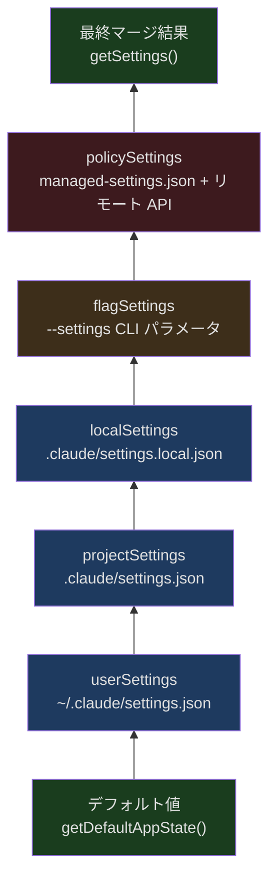
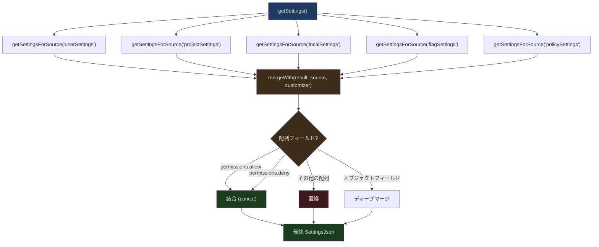
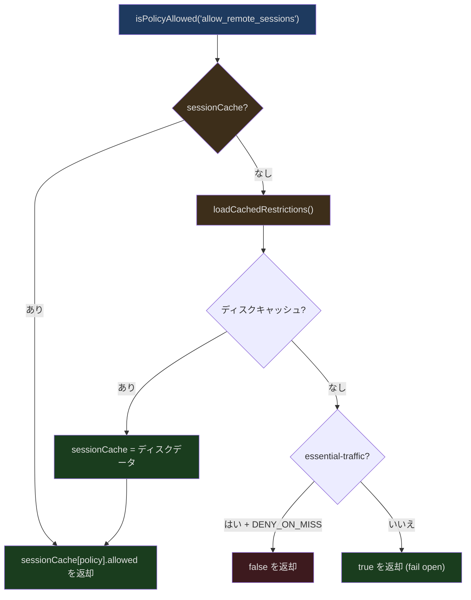

## 問題提起

設定管理は簡単に聞こえます——JSON ファイルを読むだけでしょう？しかし以下のすべてのシナリオをサポートする必要がある場合、複雑さは指数関数的に増大します：

- ユーザーグローバル設定（`~/.claude/settings.json`）
- プロジェクト共有設定（`.claude/settings.json`、git にコミット）
- プロジェクトローカル設定（`.claude/settings.local.json`、gitignore）
- CLI フラグオーバーライド（`--settings` パラメータ）
- 企業管理ポリシー（MDM プッシュまたはリモート API）
- リモート管理設定（API から取得する組織レベルの設定）
- 設定変更時のリアルタイムホットリロード
- マルチソース間の優先度マージ
- 旧設定から新フォーマットへの自動マイグレーション

Claude Code の設定システムは各層を Zod Schema で検証し、確定的な優先度ルールで 5 つのソースをマージし、11 個のマイグレーション関数で後方互換性を処理します。この記事では各層の実装を掘り下げます。

## 設定ソースと優先度



`src/utils/settings/constants.ts` でソースの優先度が定義されています：

```typescript
// src/utils/settings/constants.ts 行 7-22
export const SETTING_SOURCES = [
  'userSettings',      // ユーザーグローバル設定
  'projectSettings',   // プロジェクト共有設定
  'localSettings',     // プロジェクトローカル設定（gitignored）
  'flagSettings',      // CLI --settings フラグ
  'policySettings',    // 企業管理ポリシー
] as const
```

順序がそのまま優先度です——後のものが前のものを上書きします。つまり：

1. **ユーザー設定** がベースレイヤー
2. **プロジェクト設定** がユーザーの好みを上書き（チーム規約）
3. **ローカル設定** がプロジェクト設定を上書き（個人オーバーライド）
4. **CLI フラグ** がすべてのファイル設定を上書き（一時的なオーバーライド）
5. **ポリシー設定** が最高優先度（企業強制）

### ソースの型

```typescript
// src/utils/settings/constants.ts 行 24, 182-185
export type SettingSource = (typeof SETTING_SOURCES)[number]

export type EditableSettingSource = Exclude<
  SettingSource,
  'policySettings' | 'flagSettings'
>
```

`EditableSettingSource` はポリシーとフラグソースを除外しています——ユーザーは管理ポリシーや CLI フラグで生成された設定を編集できません。`userSettings`、`projectSettings`、`localSettings` のみが `/config` コマンドやファイル直接編集で変更可能です。

### ソースの有効化制御

```typescript
// src/utils/settings/constants.ts 行 159-167
export function getEnabledSettingSources(): SettingSource[] {
  const allowed = getAllowedSettingSources()
  // ポリシーとフラグソースは常に有効
  const result = new Set<SettingSource>(allowed)
  result.add('policySettings')
  result.add('flagSettings')
  return Array.from(result)
}
```

`--setting-sources` でソースを制限しても、ポリシーとフラグ設定は常に有効です。これにより企業管理ポリシーがバイパスされることはありません。

## Zod Schema バリデーション

`src/utils/settings/types.ts` で設定の完全な Schema が定義されています。

### パーミッション Schema

```typescript
// src/utils/settings/types.ts 行 42-85
export const PermissionsSchema = lazySchema(() =>
  z.object({
    allow: z.array(PermissionRuleSchema()).optional()
      .describe('List of permission rules for allowed operations'),
    deny: z.array(PermissionRuleSchema()).optional()
      .describe('List of permission rules for denied operations'),
    ask: z.array(PermissionRuleSchema()).optional()
      .describe('List of permission rules that should always prompt'),
    defaultMode: z.enum(
      feature('TRANSCRIPT_CLASSIFIER')
        ? PERMISSION_MODES
        : EXTERNAL_PERMISSION_MODES,
    ).optional(),
    disableBypassPermissionsMode: z.enum(['disable']).optional(),
    ...(feature('TRANSCRIPT_CLASSIFIER')
      ? { disableAutoMode: z.enum(['disable']).optional() }
      : {}),
    additionalDirectories: z.array(z.string()).optional(),
  }).passthrough(),
)
```

2 つの重要な設計に注目してください：

1. **`feature()` コンパイル時条件** — `TRANSCRIPT_CLASSIFIER` フラグが auto mode の Schema を含めるかどうかを制御します。外部ビルドでは `disableAutoMode` フィールドは Schema に一切存在しません。
2. **`.passthrough()`** — 未知のフィールドがバリデーションを通過できるようにし、前方互換性を保証します。将来のバージョンで新しいフィールドが追加されても、旧バージョンでエラーになりません。

### Hook Schema

```typescript
// src/schemas/hooks.ts 行 32-171（コア部分）
function buildHookSchemas() {
  const BashCommandHookSchema = z.object({
    type: z.literal('command'),
    command: z.string(),
    if: IfConditionSchema(),
    shell: z.enum(SHELL_TYPES).optional(),
    timeout: z.number().positive().optional(),
    statusMessage: z.string().optional(),
    once: z.boolean().optional(),
    async: z.boolean().optional(),
    asyncRewake: z.boolean().optional(),
  })

  const PromptHookSchema = z.object({
    type: z.literal('prompt'),
    prompt: z.string(),
    if: IfConditionSchema(),
    timeout: z.number().positive().optional(),
    model: z.string().optional(),
    statusMessage: z.string().optional(),
    once: z.boolean().optional(),
  })

  const HttpHookSchema = z.object({
    type: z.literal('http'),
    url: z.string().url(),
    if: IfConditionSchema(),
    timeout: z.number().positive().optional(),
    headers: z.record(z.string(), z.string()).optional(),
    allowedEnvVars: z.array(z.string()).optional(),
    statusMessage: z.string().optional(),
    once: z.boolean().optional(),
  })

  const AgentHookSchema = z.object({
    type: z.literal('agent'),
    prompt: z.string(),
    if: IfConditionSchema(),
    timeout: z.number().positive().optional(),
    model: z.string().optional(),
    statusMessage: z.string().optional(),
    once: z.boolean().optional(),
  })

  return { BashCommandHookSchema, PromptHookSchema, HttpHookSchema, AgentHookSchema }
}
```

Hook は Zod の `discriminatedUnion` を使用し、`type` フィールドで 4 種類を区別します：

```typescript
// src/schemas/hooks.ts 行 176-189
export const HookCommandSchema = lazySchema(() => {
  const { BashCommandHookSchema, PromptHookSchema, AgentHookSchema, HttpHookSchema }
    = buildHookSchemas()
  return z.discriminatedUnion('type', [
    BashCommandHookSchema,
    PromptHookSchema,
    AgentHookSchema,
    HttpHookSchema,
  ])
})
```

### lazySchema パターン

すべての Schema が `lazySchema` で包まれていることに注目してください。これは遅延評価のラッパーで、Schema は最初の呼び出し時にのみ構築されます。モジュールロード時にコストの高い Zod 型構築の実行を回避します。CLI の起動速度にとって重要な最適化です。

### 環境変数 Schema

```typescript
// src/utils/settings/types.ts 行 35-37
export const EnvironmentVariablesSchema = lazySchema(() =>
  z.record(z.string(), z.coerce.string()),
)
```

`z.coerce.string()` は値が数値やブール値であっても文字列に強制変換します。これは環境変数のセマンティクスに合致しています——すべての環境変数は本質的に文字列です。

## 設定ファイルの読み込みとマージ

`src/utils/settings/settings.ts` で設定の読み取りとマージが実装されています。

### ファイル管理設定

```typescript
// src/utils/settings/settings.ts 行 74-100（loadManagedFileSettings）
export function loadManagedFileSettings(): {
  settings: SettingsJson | null
  errors: ValidationError[]
} {
  const errors: ValidationError[] = []
  let merged: SettingsJson = {}
  let found = false

  // 1. ベースファイルの読み込み
  const { settings, errors: baseErrors } = parseSettingsFile(
    getManagedSettingsFilePath()
  )
  errors.push(...baseErrors)
  if (settings && Object.keys(settings).length > 0) {
    merged = mergeWith(merged, settings, settingsMergeCustomizer)
    found = true
  }

  // 2. drop-in ディレクトリの読み込み
  const dropInDir = getManagedSettingsDropInDir()
  try {
    const entries = getFsImplementation()
      .readdirSync(dropInDir)
      .filter(d =>
        (d.isFile() || d.isSymbolicLink()) &&
        d.name.endsWith('.json') &&
        !d.name.startsWith('.')
      )
    // アルファベット順にソート——後のファイルほど優先度が高い
    // ...
  }
}
```

管理設定は 2 つの形式をサポートしています：

1. **単一ファイル** — `managed-settings.json` がベース
2. **Drop-in ディレクトリ** — `managed-settings.d/*.json`、アルファベット順にマージ

この設計は systemd の drop-in convention を参考にしています：異なるチームがポリシーの断片（例：`10-otel.json`、`20-security.json`）を独立してデプロイでき、同一ファイルの編集を調整する必要がありません。

### MDM（Mobile Device Management）統合

```typescript
// settings.ts 行 36-37 の MDM インポート
import { getHkcuSettings, getMdmSettings } from './mdm/settings.js'
```

Claude Code は OS レベルの MDM 設定配信もサポートしています：
- **macOS** — MDM profile による `/Library/Managed Preferences/` への配信
- **Windows** — HKCU レジストリキー経由

これらはすべて `policySettings` ソースに分類され、ファイルの管理設定とマージされます。

### マルチソースマージ

設定マージは lodash の `mergeWith` とカスタムマージ戦略を使用します：



マージ戦略の重要な区別：

- **パーミッションルール配列** (`allow`, `deny`, `ask`) — **結合**。プロジェクトの `allow` ルールはユーザーの `allow` ルールの後に追加され、置換されません。
- **その他の配列** — **置換**。`additionalDirectories` のように、後のソースが前のソースを完全に上書きします。
- **オブジェクト** — **ディープマージ**。ネストされたフィールドが個別に上書きされます。

### 設定キャッシュ

```typescript
// settings.ts 行 40-46 のキャッシュインポート
import {
  getCachedParsedFile,
  getCachedSettingsForSource,
  getSessionSettingsCache,
  resetSettingsCache,
  setCachedParsedFile,
  setCachedSettingsForSource,
  setSessionSettingsCache,
} from './settingsCache.js'
```

設定の読み取りにはマルチレベルキャッシュが使用されます：

1. **ファイル解析キャッシュ** — 同一ファイルパスは 1 回だけ解析
2. **ソースキャッシュ** — 各 source の設定は 1 回だけ計算
3. **セッションキャッシュ** — マージ後の最終結果は 1 回だけ計算

いずれかのソースのファイルが変更されると、キャッシュは選択的に無効化されて再構築されます。

### 設定変更の検知

settings.ts 行 27 のインポートを参照してください：

```typescript
import { settingsChangeDetector } from '../../utils/settings/changeDetector.js'
```

`changeDetector` はファイルシステムウォッチャー（`fs.watch` など）を使用して設定ファイルの変更を検知します。変更が検知されると：

1. 変更されたファイルを再解析
2. 影響を受けるキャッシュ層を無効化
3. `useSettingsChange` コールバックをトリガー
4. `store.setState` で AppState を更新
5. `onChangeAppState` が副作用を処理（認証キャッシュのクリアなど）

## バージョン管理マイグレーション

`src/migrations/` ディレクトリには 11 個のマイグレーション関数が含まれ、設定フォーマットの歴史的変遷を処理します。

### マイグレーション一覧

```
migrateAutoUpdatesToSettings.ts       — 自動更新設定を settings.json に移行
migrateBypassPermissionsAcceptedToSettings.ts — パーミッションバイパス設定の移行
migrateEnableAllProjectMcpServersToSettings.ts — MCP サーバー有効化設定の移行
migrateFennecToOpus.ts                — Fennec モデルエイリアスを Opus に移行
migrateLegacyOpusToCurrent.ts         — 旧 Opus 名の移行
migrateOpusToOpus1m.ts                — Opus → Opus[1m] 移行
migrateReplBridgeEnabledToRemoteControlAtStartup.ts — Bridge 設定の移行
migrateSonnet1mToSonnet45.ts          — Sonnet 1m → Sonnet 4.5 移行
migrateSonnet45ToSonnet46.ts          — Sonnet 4.5 → Sonnet 4.6 移行
resetAutoModeOptInForDefaultOffer.ts  — 自動モード opt-in のリセット
resetProToOpusDefault.ts              — Pro ユーザーのデフォルトモデルリセット
```

### マイグレーション例：自動更新

```typescript
// src/migrations/migrateAutoUpdatesToSettings.ts 行 13-61
export function migrateAutoUpdatesToSettings(): void {
  const globalConfig = getGlobalConfig()

  // ユーザーが明示的に自動更新を無効化した場合のみ移行
  if (
    globalConfig.autoUpdates !== false ||
    globalConfig.autoUpdatesProtectedForNative === true
  ) {
    return
  }

  try {
    const userSettings = getSettingsForSource('userSettings') || {}

    // env 変数に移行
    updateSettingsForSource('userSettings', {
      ...userSettings,
      env: {
        ...userSettings.env,
        DISABLE_AUTOUPDATER: '1',
      },
    })

    logEvent('tengu_migrate_autoupdates_to_settings', {
      was_user_preference: true,
      already_had_env_var: !!userSettings.env?.DISABLE_AUTOUPDATER,
    })

    // 即座に適用
    process.env.DISABLE_AUTOUPDATER = '1'

    // 旧設定から削除
    saveGlobalConfig(current => {
      const { autoUpdates: _, autoUpdatesProtectedForNative: __, ...rest } = current
      return rest
    })
  } catch (error) {
    logError(new Error(`Failed to migrate auto-updates: ${error}`))
  }
}
```

マイグレーションの重要な特性：

1. **冪等** — 複数回実行しても副作用は生じない
2. **条件実行** — 旧フォーマットが検出された場合にのみ実行
3. **アトミック性** — 新しい設定を先に書き込み、旧設定を後から削除
4. **オブザーバビリティ** — `logEvent` でマイグレーションイベントを記録

### マイグレーション例：モデルエイリアス

```typescript
// src/migrations/migrateFennecToOpus.ts 行 18-45
export function migrateFennecToOpus(): void {
  // ant ユーザーのみ
  if (process.env.USER_TYPE !== 'ant') return

  const settings = getSettingsForSource('userSettings')
  const model = settings?.model

  if (typeof model === 'string') {
    if (model.startsWith('fennec-latest[1m]')) {
      updateSettingsForSource('userSettings', { model: 'opus[1m]' })
    } else if (model.startsWith('fennec-latest')) {
      updateSettingsForSource('userSettings', { model: 'opus' })
    } else if (
      model.startsWith('fennec-fast-latest') ||
      model.startsWith('opus-4-5-fast')
    ) {
      updateSettingsForSource('userSettings', {
        model: 'opus[1m]',
        fastMode: true,
      })
    }
  }
}
```

このマイグレーションは 2 つの重要な判断を示しています：

1. **userSettings のみ移行** — project/local/policy settings には触れません。ソースコードのコメントがその理由を説明しています：「merged settings を読むと無限再実行 + サイレントなグローバル昇格を引き起こす」
2. **モデルの再マッピング** — `fennec-fast-latest` は `opus[1m]` + `fastMode: true` にマッピングされ、ユーザーのパフォーマンス設定が維持されます。

### マイグレーションの実行タイミング

マイグレーションは `main.tsx` の `preAction` フェーズで実行されます：

```typescript
// main.tsx の profileCheckpoint で順序を確認
profileCheckpoint('preAction_after_mdm')           // 行 915
profileCheckpoint('preAction_after_init')           // 行 917
profileCheckpoint('preAction_after_sinks')          // 行 935
profileCheckpoint('preAction_after_migrations')     // 行 951  ← マイグレーションはここで完了
profileCheckpoint('preAction_after_remote_settings') // 行 959
```

マイグレーションは sink 初期化の後、リモート設定の読み込みの前に実行されます——つまりマイグレーションはテレメトリを使用でき（マイグレーションイベントの記録）、リモート設定には依存しません。

## リモート管理設定

`src/services/remoteManagedSettings/index.ts` で API からの企業レベル管理設定の取得が実装されています。

```typescript
// src/services/remoteManagedSettings/index.ts 行 1-13
/**
 * Remote Managed Settings Service
 *
 * Manages fetching, caching, and validation of remote-managed settings
 * for enterprise customers. Uses checksum-based validation to minimize
 * network traffic and provides graceful degradation on failures.
 *
 * Eligibility:
 * - Console users (API key): All eligible
 * - OAuth users (Claude.ai): Only Enterprise/C4E and Team subscribers
 * - API fails open (non-blocking)
 * - API returns empty settings for users without managed settings
 */
```

### チェックサムキャッシュ

リモート設定はチェックサムメカニズムでネットワークトラフィックを削減します。HTTP ETag に似ていますが、コンテンツの SHA256 ハッシュに基づいています：

1. 初回取得 → 設定を保存 + チェックサムを計算
2. 後続の取得 → チェックサムを付けて送信、サーバー側で比較
3. 未変更の場合 → 304 Not Modified、キャッシュを使用
4. 変更がある場合 → 200 + 新しい設定

### セキュリティチェック

```typescript
// src/services/remoteManagedSettings/index.ts 行 38-39
import {
  checkManagedSettingsSecurity,
  handleSecurityCheckResult,
} from './securityCheck.jsx'
```

リモート設定は適用前にセキュリティチェックを通過する必要があります。`securityCheck.tsx` はリモート設定が危険な操作を導入しないことを保証します——例えば、リモート設定が任意の `env` 変数を設定したり、パーミッションの `deny` ルールを変更できてはなりません。

### バックグラウンドポーリング

```typescript
// src/services/remoteManagedSettings/index.ts 行 54-55
const POLLING_INTERVAL_MS = 60 * 60 * 1000 // 1 hour
```

リモート設定は 1 時間ごとにポーリングされます。読み込みプロセスはノンブロッキングで、API に到達できない場合はキャッシュを使用するか、リモート設定なしで動作を継続します。

## ポリシー制限（Policy Limits）

`src/services/policyLimits/index.ts` はもう 1 つの企業設定レイヤー——組織レベルの機能制限です。

```typescript
// src/services/policyLimits/index.ts 行 510-526
export function isPolicyAllowed(policy: string): boolean {
  const restrictions = getRestrictionsFromCache()
  if (!restrictions) {
    // HIPAA モードでの安全なデグレデーション
    if (isEssentialTrafficOnly() && ESSENTIAL_TRAFFIC_DENY_ON_MISS.has(policy)) {
      return false
    }
    return true // fail open
  }
  const restriction = restrictions[policy]
  if (!restriction) return true // 未知のポリシー = 許可
  return restriction.allowed
}
```

ポリシー制限の設計原則：

1. **Fail open** — デフォルトで許可。ネットワーク障害がユーザーの CLI 使用を妨げてはなりません。
2. **HIPAA 例外** — `essential-traffic-only` モードでは、特定のポリシー（`allow_product_feedback` など）はキャッシュが利用できない場合にデフォルトで拒否されます。

```typescript
// src/services/policyLimits/index.ts 行 502
const ESSENTIAL_TRAFFIC_DENY_ON_MISS = new Set(['allow_product_feedback'])
```

### キャッシュアーキテクチャ



3 段階のキャッシュ：

1. **セッションキャッシュ** — メモリ内の `sessionCache`、最速
2. **ディスクキャッシュ** — `~/.claude/policy-limits.json`、プロセス再起動後に復元可能
3. **ネットワーク取得** — API リクエスト、リトライとエクスポネンシャルバックオフ付き

### ETag キャッシュ

```typescript
// src/services/policyLimits/index.ts 行 132-159
function computeChecksum(
  restrictions: PolicyLimitsResponse['restrictions'],
): string {
  const sorted = sortKeysDeep(restrictions)
  const normalized = jsonStringify(sorted)
  const hash = createHash('sha256').update(normalized).digest('hex')
  return `sha256:${hash}`
}
```

チェックサムは正規化された JSON に基づいて計算されます——まずすべてのキーを再帰的にソートし、シリアライズしてからハッシュ化します。これにより、サーバー側から返されるフィールドの順序が異なっても、内容が同じであればチェックサムは同一になります。

### 認証サポート

```typescript
// src/services/policyLimits/index.ts 行 227-262
function getAuthHeaders(): { headers: Record<string, string>; error?: string } {
  // まず API key を試行（Console ユーザー）
  try {
    const { key: apiKey } = getAnthropicApiKeyWithSource({
      skipRetrievingKeyFromApiKeyHelper: true,
    })
    if (apiKey) {
      return { headers: { 'x-api-key': apiKey } }
    }
  } catch { /* OAuth にフォールバック */ }

  // OAuth tokens にフォールバック（Claude.ai ユーザー）
  const oauthTokens = getClaudeAIOAuthTokens()
  if (oauthTokens?.accessToken) {
    return {
      headers: {
        Authorization: `Bearer ${oauthTokens.accessToken}`,
        'anthropic-beta': OAUTH_BETA_HEADER,
      },
    }
  }

  return { headers: {}, error: 'No authentication available' }
}
```

ポリシー制限 API は 2 つの認証方式をサポートしています：

1. **API key** — Console ユーザーは `x-api-key` ヘッダーを直接使用
2. **OAuth** — Claude.ai ユーザーは Bearer token を使用

`skipRetrievingKeyFromApiKeyHelper: true` は API key ヘルパーの実行を回避します——ポリシー制限チェックのような高頻度パスでは、外部プロセスを起動してキーを取得すべきではありません。

## 初期化ロード Promise

```typescript
// src/services/policyLimits/index.ts 行 94-114
export function initializePolicyLimitsLoadingPromise(): void {
  if (loadingCompletePromise) return

  if (isPolicyLimitsEligible()) {
    loadingCompletePromise = new Promise(resolve => {
      loadingCompleteResolve = resolve

      // デッドロック防止のタイムアウト
      setTimeout(() => {
        if (loadingCompleteResolve) {
          loadingCompleteResolve()
          loadingCompleteResolve = null
        }
      }, LOADING_PROMISE_TIMEOUT_MS) // 30 秒
    })
  }
}
```

リモート管理設定とポリシー制限はどちらも同じ Promise パターンを使用しています：

1. 初期化の早い段階で Promise を作成
2. 他のシステムは `await waitForPolicyLimitsToLoad()` で読み込み完了を待機可能
3. 30 秒のタイムアウトでデッドロックを防止——`loadPolicyLimits()` が呼ばれなかった場合（Agent SDK テストなど）、Promise は自動的に解決されます

## 設定バリデーションとエラーハンドリング

設定ファイルの解析は単純な `JSON.parse` ではありません。各ファイルは完全な Zod Schema バリデーションを経ます：

1. **JSON 解析** — ファイルが無効な JSON である可能性
2. **Schema バリデーション** — フィールド型、フォーマット、範囲のチェック
3. **パーミッションルールのフィルタリング** — 無効なパーミッションルールはファイル全体を拒否するのではなくフィルタリング
4. **エラー収集** — すべてのバリデーションエラーが収集され、読み込みは中断されない

この設計の中核原則は**レジリエンス**です——フォーマットが不正な設定ファイルが CLI の起動を妨げてはなりません。無効なルールはスキップされ、有効なルールは引き続き機能します。

## ソースの表示名

```typescript
// src/utils/settings/constants.ts 行 26-93
export function getSettingSourceName(source: SettingSource): string {
  switch (source) {
    case 'userSettings':    return 'user'
    case 'projectSettings': return 'project'
    case 'localSettings':   return 'project, gitignored'
    case 'flagSettings':    return 'cli flag'
    case 'policySettings':  return 'managed'
  }
}

export function getSourceDisplayName(
  source: SettingSource | 'plugin' | 'built-in',
): string {
  switch (source) {
    case 'userSettings':    return 'User'
    case 'projectSettings': return 'Project'
    case 'localSettings':   return 'Local'
    case 'flagSettings':    return 'Flag'
    case 'policySettings':  return 'Managed'
    case 'plugin':          return 'Plugin'
    case 'built-in':        return 'Built-in'
  }
}
```

複数のフォーマットの表示名を提供しています——短い名前（UI ラベル用）、説明的な名前（インラインテキスト用）、大文字名（コンテキスト/スキル UI 用）。これにより、異なる UI シーンで設定ソースが明確に識別できます。

## まとめ

Claude Code の設定システムはエンジニアリングの精華です：

- **5 ソース優先度マージ** — user < project < local < flag < policy、ポリシーはバイパス不可
- **Zod Schema バリデーション** — コンパイル時 feature flag で Schema 形状を制御、`lazySchema` で遅延構築
- **Drop-in ディレクトリ** — systemd convention を参考に、複数チームが独立してポリシーフラグメントをデプロイ
- **11 個のバージョンマイグレーション** — 冪等、条件実行、アトミック更新、オブザーバビリティ
- **リモート管理設定** — チェックサムキャッシュ、ETag 最適化、fail-open 戦略
- **ポリシー制限** — 3 段階キャッシュ、HIPAA セーフデグレデーション、デュアル認証サポート
- **設定ホットリロード** — ファイル監視 → キャッシュ無効化 → Store 更新 → 副作用実行
