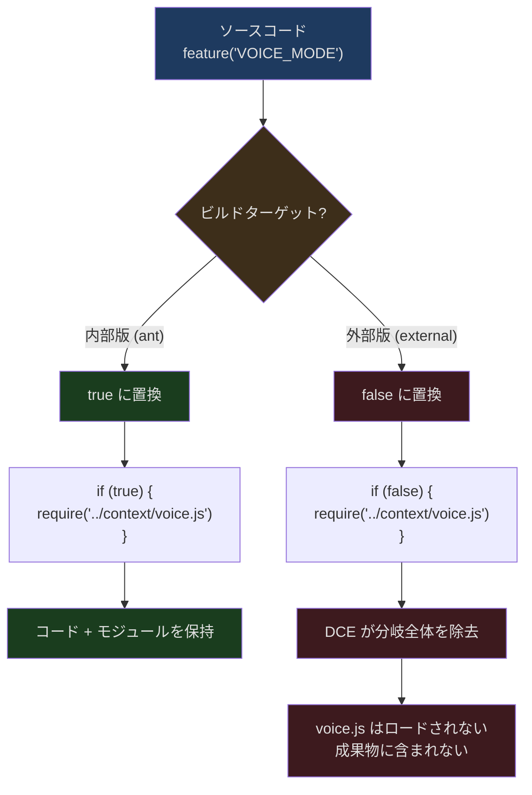
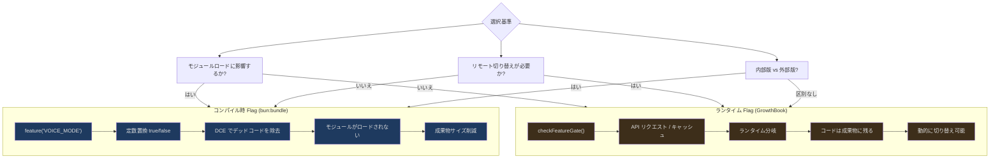

## 問題提起

Feature Flag は Web 開発では通常ランタイムの概念です——LaunchDarkly や Unleash のようなプラットフォームがユーザーリクエスト時に機能の有効/無効を動的に決定します。しかし Claude Code が直面する制約は全く異なります：

1. **外部ユーザーに配布される CLI である** — すべての機能が公開リリース版に含まれるべきではない
2. **起動速度が極めて重要** — 使用されない機能のモジュールをロードするのは無駄
3. **内部版と外部版の差異が大きい** — ボイスモード、Buddy ペット、コーディネーターモードは内部版にのみ存在

ランタイムフラグではこれらの問題を解決できません。`if (false) { ... }` 内のコードは実行されなくても、そのモジュールはロードされ解析されます。Claude Code が必要としているのは**コンパイル時**のコード除去——不要な機能を最終成果物から完全に消し去ることです。

これが `bun:bundle` の `feature()` API の出番です。

## feature() API の仕組み

```typescript
import { feature } from 'bun:bundle'

// コンパイル時定数——バンドル時に true または false に置き換えられる
if (feature('VOICE_MODE')) {
  // この分岐のコード全体が、外部ビルドでは除去される
  const VoiceProvider = require('../context/voice.js').VoiceProvider
}
```

`feature()` は関数呼び出しではなく、**コンパイラディレクティブ**です。Bun のバンドラーはビルド時に以下を行います：

1. ビルド設定から feature flag の定義を読み取る
2. `feature('FLAG_NAME')` を対応するブーリアンリテラル `true` または `false` に置き換える
3. JavaScript エンジンの定数畳み込み最適化が `if (false) { ... }` をデッドコードとして認識
4. Tree-shaking が到達不能なコードパスと関連する `require()` 呼び出しを除去

### 内部版 vs 外部版



## 完全な Flag 一覧

Claude Code のコードベースでは 85 以上の独立した feature flag が使用されています。以下に機能ドメイン別にグループ化して示します：

### コア製品機能

| Flag | 用途 |
|------|------|
| `KAIROS` | アシスタントモード（Claude Assistant） |
| `KAIROS_BRIEF` | アシスタント簡潔モード |
| `KAIROS_CHANNELS` | アシスタントチャネル（Telegram/iMessage） |
| `KAIROS_DREAM` | アシスタント自律実行 |
| `KAIROS_GITHUB_WEBHOOKS` | GitHub PR サブスクリプション |
| `KAIROS_PUSH_NOTIFICATION` | プッシュ通知 |
| `PROACTIVE` | プロアクティブ実行モード |
| `BRIDGE_MODE` | リモートコントロールブリッジ |
| `DAEMON` | バックグラウンドデーモンプロセス |
| `VOICE_MODE` | 音声入出力 |
| `BUDDY` | コンパニオンペット（イースターエッグ） |

### コンテキストとモデル

| Flag | 用途 |
|------|------|
| `CONTEXT_COLLAPSE` | コンテキスト折りたたみ圧縮 |
| `REACTIVE_COMPACT` | リアクティブ圧縮 |
| `CACHED_MICROCOMPACT` | キャッシュマイクロ圧縮 |
| `HISTORY_SNIP` | 履歴カット |
| `TOKEN_BUDGET` | トークン予算追跡 |
| `ULTRATHINK` | 超深度思考モード |
| `COMPACTION_REMINDERS` | 圧縮リマインダー |
| `BREAK_CACHE_COMMAND` | キャッシュ破棄コマンド |
| `PROMPT_CACHE_BREAK_DETECTION` | Prompt Cache 断絶検知 |

### ツールと機能

| Flag | 用途 |
|------|------|
| `AGENT_TRIGGERS` | タイマートリガー（cron） |
| `AGENT_TRIGGERS_REMOTE` | リモートトリガー |
| `MONITOR_TOOL` | モニタリングツール |
| `TERMINAL_PANEL` | ターミナルパネル（tmux） |
| `WEB_BROWSER_TOOL` | ブラウザツール |
| `CHICAGO_MCP` | Computer Use（macOS） |
| `MCP_SKILLS` | MCP スキルディスカバリ |
| `MCP_RICH_OUTPUT` | MCP リッチテキスト出力 |
| `WORKFLOW_SCRIPTS` | ワークフロースクリプト |
| `TORCH` | 実験的検索 |

### チームとコラボレーション

| Flag | 用途 |
|------|------|
| `COORDINATOR_MODE` | コーディネーターモード |
| `UDS_INBOX` | Unix Domain Socket メッセージ受信ボックス |
| `FORK_SUBAGENT` | サブ Agent フォーク |
| `TEAMMEM` | チームメモリ同期 |
| `BG_SESSIONS` | バックグラウンドセッション |
| `ULTRAPLAN` | リモート超計画 |

### 接続とデプロイ

| Flag | 用途 |
|------|------|
| `DIRECT_CONNECT` | ダイレクト接続モード |
| `SSH_REMOTE` | SSH リモート実行 |
| `CCR_AUTO_CONNECT` | CCR 自動接続 |
| `CCR_MIRROR` | CCR ミラー同期 |
| `CCR_REMOTE_SETUP` | CCR リモートセットアップ |
| `SELF_HOSTED_RUNNER` | セルフホステッドランナー |
| `BYOC_ENVIRONMENT_RUNNER` | BYOC 環境実行 |

### テレメトリと診断

| Flag | 用途 |
|------|------|
| `ENHANCED_TELEMETRY_BETA` | 拡張テレメトリ |
| `COWORKER_TYPE_TELEMETRY` | コラボレーション型テレメトリ |
| `MEMORY_SHAPE_TELEMETRY` | メモリ形状テレメトリ |
| `PERFETTO_TRACING` | Perfetto トレーシング |
| `SLOW_OPERATION_LOGGING` | 低速オペレーション記録 |
| `SHOT_STATS` | 出力統計 |
| `DUMP_SYSTEM_PROMPT` | システムプロンプトダンプ |

### パーミッションとセキュリティ

| Flag | 用途 |
|------|------|
| `TRANSCRIPT_CLASSIFIER` | トランスクリプト分類器（auto mode） |
| `BASH_CLASSIFIER` | Bash コマンド分類 |
| `VERIFICATION_AGENT` | 検証 Agent |
| `NATIVE_CLIENT_ATTESTATION` | ネイティブクライアント証明 |
| `ANTI_DISTILLATION_CC` | 蒸留防止保護 |

## 条件付きインポートパターン

Claude Code における `feature()` と `require()` の組み合わせは固定パターンに従っています。

### パターン 1：モジュールレベルの条件付きロード

```typescript
// src/tools.ts 行 26-42
const cronTools = feature('AGENT_TRIGGERS')
  ? require('./tools/CronTool/index.js') as typeof import('./tools/CronTool/index.js')
  : null

const RemoteTriggerTool = feature('AGENT_TRIGGERS_REMOTE')
  ? require('./tools/RemoteTriggerTool/index.js').RemoteTriggerTool
  : null

const MonitorTool = feature('MONITOR_TOOL')
  ? require('./tools/MonitorTool/index.js').MonitorTool
  : null

const SendUserFileTool = feature('KAIROS')
  ? require('./tools/SendUserFileTool/index.js').SendUserFileTool
  : null
```

これが最も一般的なパターンです。`feature()` が三項演算式の条件として使われ、`require()` は flag が true の場合にのみ出現します。flag が false の場合、`require()` 式全体と対応するモジュールが DCE で除去されます。

`as typeof import(...)` の型アサーションに注目してください——flag が true の場合に `require` の戻り値が正しい TypeScript 型を持つことを保証します。

### パターン 2：コンポーネントレベルの条件付きレンダリング

```typescript
// src/state/AppState.tsx 行 14-19
const VoiceProvider: (props: {
  children: React.ReactNode;
}) => React.ReactNode = feature('VOICE_MODE')
  ? require('../context/voice.js').VoiceProvider
  : ({ children }) => children;
```

`VOICE_MODE` がオフの場合、`VoiceProvider` はパススルーコンポーネント `({ children }) => children` に置き換えられます。上位のコードは Voice が有効かどうかを知る必要がありません——常に `<VoiceProvider>` で子コンポーネントをラップします。

### パターン 3：関数内の条件分岐

```typescript
// src/main.tsx 行 76-81
const coordinatorModeModule = feature('COORDINATOR_MODE')
  ? require('./coordinator/coordinatorMode.js') as typeof import('./coordinator/coordinatorMode.js')
  : null

const assistantModule = feature('KAIROS')
  ? require('./assistant/index.js') as typeof import('./assistant/index.js')
  : null

const kairosGate = feature('KAIROS')
  ? require('./assistant/gate.js') as typeof import('./assistant/gate.js')
  : null
```

`main.tsx` では大量のモジュールがこのパターンで条件付きロードされます。後続の使用時は null チェックと組み合わせます：

```typescript
// src/main.tsx 行 685
if (feature('KAIROS') && _pendingAssistantChat) {
  // ... KAIROS が有効な場合のみ実行
}
```

二重ガード：`feature('KAIROS')` がコンパイル時の除去を保証し、`_pendingAssistantChat` がランタイムの null チェックです。

### パターン 4：Schema の条件付きフィールド

```typescript
// src/utils/settings/types.ts 行 61-78
defaultMode: z.enum(
  feature('TRANSCRIPT_CLASSIFIER')
    ? PERMISSION_MODES        // 'auto' などの内部モードを含む
    : EXTERNAL_PERMISSION_MODES  // 公開モードのみ
).optional(),
...(feature('TRANSCRIPT_CLASSIFIER')
  ? { disableAutoMode: z.enum(['disable']).optional() }
  : {}),
```

Schema の形状自体が条件化されています。外部ビルドの Schema には `disableAutoMode` フィールドが一切存在しません——非表示にしているのではなく、型システム上に存在しないのです。

### パターン 5：コマンド登録

```typescript
// src/commands.ts 行 63-118
feature('PROACTIVE') || feature('KAIROS')
  ? require('./commands/proactive.js').default : null

const bridge = feature('BRIDGE_MODE')
  ? require('./commands/bridge/index.js').default : null

feature('DAEMON') && feature('BRIDGE_MODE')
  ? require('./commands/daemon.js').default : null

const voiceCommand = feature('VOICE_MODE')
  ? require('./commands/voice/voice.js').default : null

const ultraplan = feature('ULTRAPLAN')
  ? require('./commands/ultraplan.js').default : null

const buddy = feature('BUDDY')
  ? require('./commands/buddy.js').default : null
```

各スラッシュコマンドの登録は feature flag で制御されます。外部版のユーザーには `/voice`、`/buddy`、`/ultraplan` などのコマンドは表示されません——それらのコードが成果物に一切存在しないからです。

## コンパイル時 vs ランタイム Flag



Claude Code は 2 種類の flag システムを同時に使用しています：

### コンパイル時 Feature Flag（`bun:bundle`）

- **決定タイミング**：パッケージング/ビルド時
- **制御粒度**：モジュール/機能全体の存在有無
- **典型的な用途**：内部版専用機能（Voice、Buddy、Coordinator）
- **利点**：ランタイムオーバーヘッドゼロ、成果物サイズ削減、本番環境で誤って有効化される可能性がない
- **欠点**：変更にはリリースが必要

### ランタイム Feature Flag（GrowthBook）

- **決定タイミング**：ランタイム、キャッシュ使用の可能性あり
- **制御粒度**：動作パラメータ（サンプリングレート、バッチサイズ）
- **典型的な用途**：テレメトリ設定、A/B 実験、緊急停止スイッチ
- **利点**：リモート切り替え可能、リリース不要
- **欠点**：コードが成果物に残る、ネットワークリクエストが必要

### 選択基準

| 質問 | コンパイル時 | ランタイム |
|------|--------|--------|
| 機能が特定のビルドにのみ存在するか？ | はい | — |
| 機能が追加モジュールのロードを必要とするか？ | はい | — |
| 機能に A/B テストが必要か？ | — | はい |
| 機能にリモートでの緊急停止が必要か？ | — | はい |
| スイッチの切り替え頻度は？ | 低（バージョン単位） | 高（いつでも） |

## 複合 Flag パターン

一部の機能は複数の flag の組み合わせを使用します：

```typescript
// src/commands.ts 行 77
feature('DAEMON') && feature('BRIDGE_MODE')
  ? require('./commands/daemon.js').default : null
```

Daemon コマンドは `DAEMON` と `BRIDGE_MODE` の両方が有効な場合にのみ存在します。いずれかの flag が false の場合、`&&` の短絡評価で直接 false になり、式全体がコンパイル時に除去されます。

```typescript
// src/tools.ts 行 26
feature('PROACTIVE') || feature('KAIROS')
```

SendMessageTool は `PROACTIVE` または `KAIROS` のいずれかが有効な場合に利用可能です——2 つの独立した機能ドメインが 1 つのツールを共有していることを意味します。

## DCE の限界と注意事項

### require() は feature() 分岐内になければならない

```typescript
// 正しい——require が feature() ガード内にある
const module = feature('X') ? require('./x.js') : null

// 誤り——import がモジュールのトップレベルにあり、DCE で除去できない
import { x } from './x.js'
if (feature('X')) { x() }
```

ES module の `import` は静的宣言であり、バンドラーは依存関係グラフの分析時にモジュールを含めます。条件分岐内で DCE によって除去できるのは `require()`（CommonJS 動的インポート）のみです。

### TypeScript の型は引き続き使用可能

```typescript
const assistantModule = feature('KAIROS')
  ? require('./assistant/index.js') as typeof import('./assistant/index.js')
  : null
```

`typeof import(...)` は純粋な型操作であり、ランタイムコードは生成しません。`KAIROS` が false であっても、TypeScript は `assistantModule` が非 null の場合の型形状を知っています。これにより後続のコードで型安全な null チェックが可能です：

```typescript
if (feature('KAIROS') && assistantModule) {
  // TypeScript はここで assistantModule の型を知っている
  assistantModule.isAssistantMode()
}
```

### AppState の条件付きフィールド

```typescript
// src/state/AppStateStore.ts 行 97-98
// Optional - only present when ENABLE_AGENT_SWARMS is true
showTeammateMessagePreview?: boolean
```

AppState では `?:` オプショナルフィールドを使用して feature flag の影響を受ける状態をマークしています。ソースコードのコメントがこの結合関係を明示的に説明し、どのフィールドがどのビルドで意味を持つかを開発者が理解するのに役立ちます。

## REPL.tsx：Flag 密度が最も高いファイル

`src/screens/REPL.tsx` はコードベース全体で `feature()` 呼び出しが最も密集したファイルで、70 回以上の呼び出しを含んでいます。REPL がすべての機能の集約点であるためです：

```typescript
// src/screens/REPL.tsx 行 3
import { feature } from 'bun:bundle';

// 条件付きモジュールロード
const useVoiceIntegration = feature('VOICE_MODE')
  ? require('../hooks/useVoiceIntegration.js').useVoiceIntegration
  : () => ({ /* noop */ })

const VoiceKeybindingHandler = feature('VOICE_MODE')
  ? require('../hooks/useVoiceIntegration.js').VoiceKeybindingHandler
  : () => null

const proactiveModule = feature('PROACTIVE') || feature('KAIROS')
  ? require('../proactive/index.js') : null

const useScheduledTasks = feature('AGENT_TRIGGERS')
  ? require('../hooks/useScheduledTasks.js').useScheduledTasks : null

const WebBrowserPanelModule = feature('WEB_BROWSER_TOOL')
  ? require('../tools/WebBrowserTool/WebBrowserPanel.js') : null
```

JSX レンダリング内では：

```typescript
{feature('VOICE_MODE')
  ? <VoiceKeybindingHandler ... /> : null}

{feature('WEB_BROWSER_TOOL')
  ? WebBrowserPanelModule && <WebBrowserPanelModule.WebBrowserPanel />
  : null}

{feature('BUDDY') && companionVisible
  ? <CompanionSprite /> : null}

{feature('ULTRAPLAN')
  ? focusedInputDialog === 'ultraplan-choice' && <UltraplanChoiceDialog ... />
  : null}
```

外部ビルドでは、これらの JSX 式はすべて `null` に置き換えられ、対応するコンポーネントのコードは一切存在しません。

## 定量的な影響

85 以上の feature flag は、外部ビルドから数十個の完全なモジュールが除外される可能性を意味します。除外される機能モジュール 1 つあたり平均 50KB（コード + 依存関係）とすると、DCE は数 MB の成果物サイズを節約できる可能性があります。さらに重要なのは：

- **起動時間** — ロード不要なモジュールは解析も不要で、コールドスタートが直接短縮される
- **メモリ使用量** — 存在しないコードは V8 のコード空間を占有しない
- **攻撃面** — 外部ユーザーは内部機能に到達できない、対応するコードパスが発見されたとしても

## 従来のソリューションとの比較

| ソリューション | ランタイムオーバーヘッド | 成果物サイズ | 型安全性 | リモート制御 |
|------|-----------|---------|---------|---------|
| 環境変数 `if (process.env.X)` | 低 | 変化なし | 弱い | 再起動が必要 |
| LaunchDarkly/Unleash | ネットワークリクエスト | 変化なし | なし | リアルタイム |
| GrowthBook（ランタイム） | キャッシュ読み取り | 変化なし | 弱い | 準リアルタイム |
| `bun:bundle` feature() | **ゼロ** | **削減** | **強い** | **不可** |

`feature()` のユニークな利点は**コンパイル時の型安全性 + ランタイムオーバーヘッドゼロ + 成果物サイズ削減**の三位一体です。代償としてリモート切り替えはサポートしません——しかし「この機能がこのバージョンに存在するか」という判断に対しては、リモート切り替えはそもそも正しい答えではありません。

## まとめ

Claude Code の feature flag システムはコンパイラ能力の極限的な活用です：

- **85 以上の `feature()` flag** — 製品機能、ツール、接続、テレメトリ、セキュリティなど全ドメインをカバー
- **`bun:bundle` コンパイル時置換** — `feature('X')` → `true`/`false` → 定数畳み込み → DCE
- **条件付き `require()` パターン** — 除外された機能のモジュールはロードされず、成果物にも含まれない
- **Schema の条件付きフィールド** — 設定バリデーションの形状自体が flag に応じて変化
- **ランタイム GrowthBook との補完関係** — コンパイル時が「何があるか」を決定し、ランタイムが「どう使うか」を決定
- **TypeScript 型安全性** — `typeof import(...)` アサーションがコンパイル時とランタイムの両方で正確性を維持

すべての feature flag がランタイムである必要はありません。「この機能がこのバイナリに存在すべきか」が問題であるなら、コンパイル時 flag が唯一の正しい答えです。
