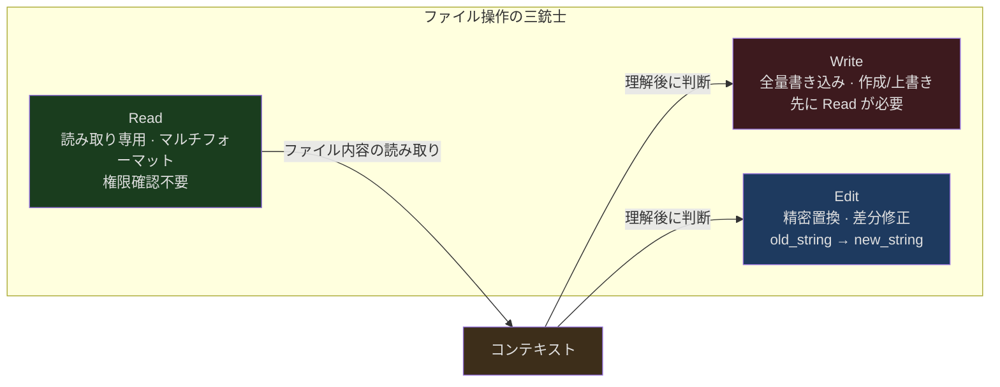
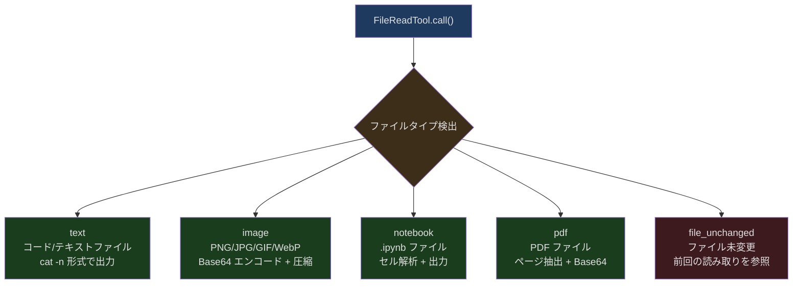
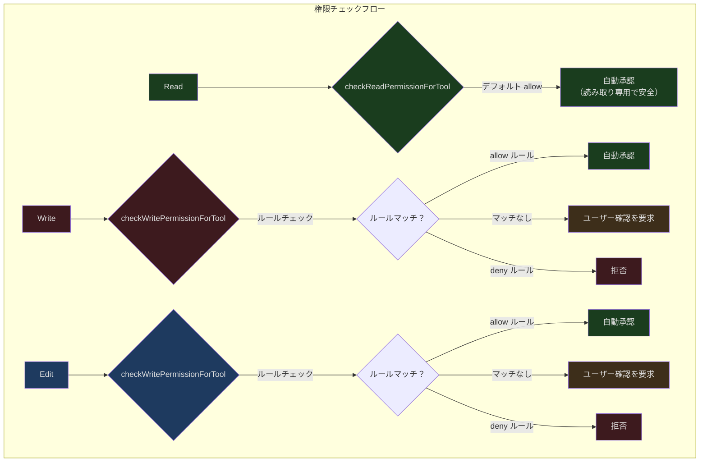
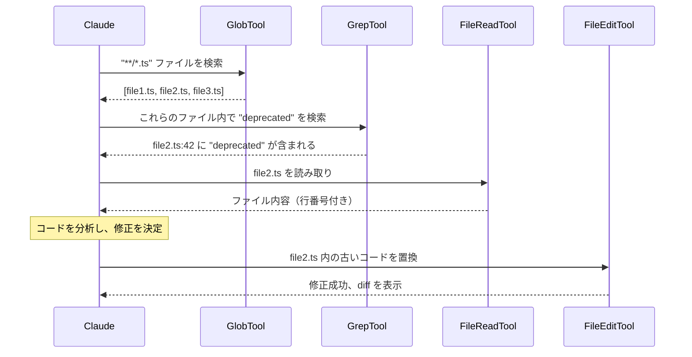

## 問題提起

AI コーディングアシスタントの最も重要な能力とは何でしょうか？コードロジックの理解でしょうか、それとも高品質なコードの生成でしょうか？どちらでもありません。AI が既存のコードを**読み取り**、**修正**し、あるいは新しいファイルを**作成**できなければ、すべての理解力と生成力は無意味です。

Claude Code のファイル操作システムは、一連のユニークな制約に直面しています：

1. **トークンエコノミー** ── 50KB のファイルをすべてコンテキストに読み込むと、約 12,500 トークンを消費します。コンテキストウィンドウの有限性を考えると、情報量とトークン消費のバランスを取る必要があります
2. **セキュリティ制約** ── AI はレビューなしにユーザーのファイルを上書きすべきではなく、機密ディレクトリの読み取りも避けるべきです
3. **並行安全性** ── 複数のツールが同時に実行される場合、読み取りと書き込みの間にファイル状態が変化する可能性があります
4. **フォーマットの多様性** ── コードファイル、画像、PDF、Jupyter Notebook、それぞれのフォーマットに異なる処理パスが必要です

これらの課題に対応するため、Claude Code は従来のエディタのように統一的なファイル API を設計するのではなく、ファイル操作を 3 つの独立したツールに分割しました：**Read**、**Write**、**Edit**。この三ツール分離は恣意的なものではなく、熟慮された設計判断の反映です。

---

## 三ツール分離の設計判断



なぜ一つの `FileOperation` ツールで read/write/edit をすべてサポートしないのでしょうか？理由は 3 つあります：

### 権限の粒度が異なる

Read は読み取り専用操作であり、デフォルトの権限モードでは自動承認されます。Write と Edit はファイルシステムを変更するため、ユーザー確認またはルールマッチングが必要です。一つのツールに統合すると、権限システムは毎回 `operation` パラメータを解析して動作を判断する必要があり、複雑さとセキュリティリスクが増大します。

### トークンエコノミーが異なる

Read の結果は非常に大きくなり得ます（ファイル内容全体）。一方、Edit は変更部分のみを送信すればよく、Write は完全な新しい内容を送信する必要があります。これらを分離することで、API のトークン計算と制限ポリシーをツールごとに独立してチューニングできます。

### 並行安全のセマンティクスが異なる

Read は他のどの操作とも安全に並行実行できます（`isConcurrencySafe: true`）。一方、Write と Edit の同一ファイルへの並行実行には追加の保護が必要です。分離後、ストリーミングツールエグゼキュータはツールの種類に基づいて並行戦略を決定できます。

---

## FileReadTool：マルチフォーマットスマート読み取り

FileReadTool はファイル操作体系全体の起点です。単なる `cat` コマンドのラッパーではなく、マルチフォーマット・トークン感知型のファイル読み取りエンジンです。

### 入力スキーマ

```typescript
// src/tools/FileReadTool/FileReadTool.ts:227-243
const inputSchema = lazySchema(() =>
  z.strictObject({
    file_path: z.string().describe('The absolute path to the file to read'),
    offset: semanticNumber(z.number().int().nonnegative().optional()).describe(
      'The line number to start reading from. Only provide if the file is too large to read at once',
    ),
    limit: semanticNumber(z.number().int().positive().optional()).describe(
      'The number of lines to read. Only provide if the file is too large to read at once.',
    ),
    pages: z
      .string()
      .optional()
      .describe(
        `Page range for PDF files (e.g., "1-5", "3", "10-20"). Only applicable to PDF files. Maximum ${PDF_MAX_PAGES_PER_READ} pages per request.`,
      ),
  }),
)
```

4 つのパラメータの設計意図は明確です：

- **file_path** ── 絶対パス必須。作業ディレクトリの曖昧さを回避します
- **offset/limit** ── 大きなファイルのページング読み取り。デフォルトは先頭 2000 行
- **pages** ── PDF 専用パラメータ。1 回あたり最大 20 ページ

### マルチフォーマット出力

FileReadTool の出力は判別共用体（discriminated union）であり、ファイルタイプに応じて異なるデータ構造を返します：



### トークンバジェット制御

ファイル読み取りにおける最も重要な制約はトークンバジェットです。ソースコード中の制限体系は 2 層構造になっています：

```typescript
// src/tools/FileReadTool/limits.ts:1-14
/**
 * Read tool output limits.  Two caps apply to text reads:
 *
 *   | limit         | default | checks                    | cost          | on overflow     |
 *   |---------------|---------|---------------------------|---------------|-----------------|
 *   | maxSizeBytes  | 256 KB  | TOTAL FILE SIZE (not out) | 1 stat        | throws pre-read |
 *   | maxTokens     | 25000   | actual output tokens      | API roundtrip | throws post-read|
 *
 * Known mismatch: maxSizeBytes gates on total file size, not the slice.
 * Tested truncating instead of throwing for explicit-limit reads that
 * exceed the byte cap (#21841, Mar 2026).  Reverted: tool error rate
 * dropped but mean tokens rose — the throw path yields a ~100-byte error
 * tool-result while truncation yields ~25K tokens of content at the cap.
 */
```

このコメントは重要なエンジニアリング上のトレードオフを明らかにしています。チームは以前、ファイルが大きすぎる場合にエラーを投げるのではなく、内容を切り詰めることを試みました。結果として、エラー率は低下しましたが、平均トークン消費が増加しました。切り詰め後も大量の内容（約 25K トークン）を返すのに対し、エラーメッセージはわずか約 100 バイトだからです。**AI にフェイルファストさせてページングでリトライさせる方が、黙って切り詰めるよりもトークン効率が良いのです。**

トークン制限の優先順位チェーン：

```typescript
// src/tools/FileReadTool/limits.ts:53-92
export const getDefaultFileReadingLimits = memoize((): FileReadingLimits => {
  const override =
    getFeatureValue_CACHED_MAY_BE_STALE<Partial<FileReadingLimits> | null>(
      'tengu_amber_wren',
      {},
    )

  const envMaxTokens = getEnvMaxTokens()
  const maxTokens =
    envMaxTokens ??
    (typeof override?.maxTokens === 'number' &&
    Number.isFinite(override.maxTokens) &&
    override.maxTokens > 0
      ? override.maxTokens
      : DEFAULT_MAX_OUTPUT_TOKENS)

  // ...
})
```

優先順位：環境変数 (`CLAUDE_CODE_FILE_READ_MAX_OUTPUT_TOKENS`) > GrowthBook Feature Flag (`tengu_amber_wren`) > ハードコードされたデフォルト値 (25000)。`memoize` を使用して GrowthBook の値を初回呼び出し時に固定し、セッション途中で制限が変更されることを防いでいます。

### 画像処理

ファイルが画像の場合、FileReadTool は Sharp ライブラリを使用して処理します：

```typescript
// src/tools/FileReadTool/imageProcessor.ts:37-67
export async function getImageProcessor(): Promise<SharpFunction> {
  if (imageProcessorModule) {
    return imageProcessorModule.default
  }

  if (isInBundledMode()) {
    // ネイティブイメージプロセッサをまず読み込みを試みる
    try {
      const imageProcessor = await import('image-processor-napi')
      const sharp = imageProcessor.sharp || imageProcessor.default
      imageProcessorModule = { default: sharp }
      return sharp
    } catch {
      // ネイティブモジュールが利用不可の場合は sharp にフォールバック
      console.warn(
        'Native image processor not available, falling back to sharp',
      )
    }
  }

  // 非バンドルビルドまたはフォールバックとして sharp を使用
  const imported = (await import('sharp')) as unknown as MaybeDefault<SharpFunction>
  const sharp = unwrapDefault(imported)
  imageProcessorModule = { default: sharp }
  return sharp
}
```

二重フォールバック戦略に注目してください。バンドルモードでは、まず `image-processor-napi`（ネイティブ NAPI モジュール、より高速）を優先使用し、失敗した場合は `sharp` にフォールバックします。これは、NAPI モジュールが一部のプラットフォームで利用できない可能性があるためです。

画像はトークンバジェット内に収まるよう圧縮された後、Base64 形式でマルチモーダルメッセージに埋め込まれ、Claude が画像内容を「見る」ことができるようになります。

### ファイル未変更時の最適化

巧妙な最適化として、前回の読み取り以降ファイルが変更されていない場合、FileReadTool は軽量なスタブを返します：

```typescript
// src/tools/FileReadTool/prompt.ts:7-8
export const FILE_UNCHANGED_STUB =
  'File unchanged since last read. The content from the earlier Read tool_result in this conversation is still current — refer to that instead of re-reading.'
```

このスタブはわずか約 30 トークンで、ファイル内容全体を再送信する場合（数千トークンに達する可能性）と比較して、大幅な節約になります。検出メカニズムは `readFileState` に格納されたファイル修正タイムスタンプ（mtime）に基づいています。

### 危険なデバイスパスのブロック

```typescript
// src/tools/FileReadTool/FileReadTool.ts:98-115
const BLOCKED_DEVICE_PATHS = new Set([
  // 無限出力 ── EOF に到達しない
  '/dev/zero',
  '/dev/random',
  '/dev/urandom',
  '/dev/full',
  // 入力待ちでブロックする
  '/dev/stdin',
  '/dev/tty',
  '/dev/console',
  // 読み取りが無意味
  '/dev/stdout',
  '/dev/stderr',
  // stdin/stdout/stderr の fd エイリアス
  '/dev/fd/0',
  '/dev/fd/1',
  '/dev/fd/2',
])
```

AI が `/dev/random` を読み取ろうとした場合、プロセスは EOF を得られずにハングします。これらのパスは事前にブロックされています。Linux の `/proc/self/fd/0-2` エイリアスにも同様の保護が適用されています。

---

## FileWriteTool：先読み後書きのセキュリティ制約

FileWriteTool の核心となる設計原則は、**読んでいないファイルに書き込むことはできない** というものです。

### 先読み後書きの検証

```typescript
// src/tools/FileWriteTool/FileWriteTool.ts:196-222
async validateInput({ file_path, content }, toolUseContext: ToolUseContext) {
    const fullFilePath = expandPath(file_path)

    // ... シークレットチェック、deny ルールチェック、UNC パスチェック ...

    const readTimestamp = toolUseContext.readFileState.get(fullFilePath)
    if (!readTimestamp || readTimestamp.isPartialView) {
      return {
        result: false,
        message:
          'File has not been read yet. Read it first before writing to it.',
        errorCode: 2,
      }
    }

    // 上記の stat から mtime を再利用
    const lastWriteTime = Math.floor(fileMtimeMs)
    if (lastWriteTime > readTimestamp.timestamp) {
      return {
        result: false,
        message:
          'File has been modified since read, either by the user or by a linter. Read it again before attempting to write it.',
        errorCode: 3,
      }
    }

    return { result: true }
  },
```

3 つのエラーコードは 3 つの失敗シナリオに対応しています：

| errorCode | シナリオ | 意味 |
|-----------|---------|------|
| 2 | 未読み取りまたは部分読み取りのみ | AI がファイルの完全な内容を把握していないため、書き込みが既存コードを破壊する可能性がある |
| 3 | 読み取り後にファイルが変更された | ユーザーまたは linter がファイルを変更済みで、古い内容に基づく書き込みは変更を失う |
| 0 | チームメモリファイルにシークレットが含まれている | セキュリティチェック。機密情報が共有ファイルに書き込まれることを防止 |

### アトミックな書き込み

```typescript
// src/tools/FileWriteTool/FileWriteTool.ts:267-305
    // 現在の状態を読み込み、最後の読み取り以降に変更がないことを確認。
    // アトミック性を保つため、ここからディスク書き込みまでの間に async 操作を挟まないでください。
    let meta: ReturnType<typeof readFileSyncWithMetadata> | null
    try {
      meta = readFileSyncWithMetadata(fullFilePath)
    } catch (e) {
      if (isENOENT(e)) {
        meta = null
      } else {
        throw e
      }
    }

    if (meta !== null) {
      const lastWriteTime = getFileModificationTime(fullFilePath)
      const lastRead = readFileState.get(fullFilePath)
      if (!lastRead || lastWriteTime > lastRead.timestamp) {
        // タイムスタンプは変更を示していますが、Windows ではクラウド同期や
        // ウイルス対策ソフトなどにより、内容変更なしにタイムスタンプが
        // 変わることがあります。完全読み取りの場合、誤検知を避けるため
        // フォールバックとして内容を比較します。
        const isFullRead =
          lastRead &&
          lastRead.offset === undefined &&
          lastRead.limit === undefined
        if (!isFullRead || meta.content !== lastRead.content) {
          throw new Error(FILE_UNEXPECTEDLY_MODIFIED_ERROR)
        }
      }
    }

    // Write は完全な内容の置換 ── モデルが明示的な改行を送信
    writeTextContent(fullFilePath, content, enc, 'LF')
```

コード内のコメントに注目してください：「Please avoid async operations between here and writing to disk to preserve atomicity」。このコードは現在の内容の読み取りと新しい内容の書き込みの間を同期的に保ち、並行変更によるレースコンディションを回避しています。

Windows プラットフォームには特殊な処理があります。ファイルの mtime がクラウド同期やウイルス対策ソフトにより変更される可能性がありますが（内容は変更されていない）、完全読み取りされたファイルについては、フォールバックとしてファイル内容を追加比較しています。

### LSP 通知

ファイル書き込み後、FileWriteTool は自動的に LSP サーバーに通知します：

```typescript
// src/tools/FileWriteTool/FileWriteTool.ts:308-326
    const lspManager = getLspServerManager()
    if (lspManager) {
      clearDeliveredDiagnosticsForFile(`file://${fullFilePath}`)
      lspManager.changeFile(fullFilePath, content).catch((err: Error) => {
        logForDebugging(
          `LSP: Failed to notify server of file change for ${fullFilePath}: ${err.message}`,
        )
      })
      lspManager.saveFile(fullFilePath).catch((err: Error) => {
        logForDebugging(
          `LSP: Failed to notify server of file save for ${fullFilePath}: ${err.message}`,
        )
      })
    }
```

これにより 2 つの LSP ライフサイクルイベントがトリガーされます：`didChange`（内容が変更された）と `didSave`（ファイルがディスクに保存された）。後者は TypeScript サーバーに診断情報の再生成をトリガーし、AI が次のループで型エラーなどの問題を確認できるようになります。

---

## FileEditTool：精密置換モデル

FileEditTool は 3 つのツールの中で最も巧妙な設計を持っています。全量置換ではなく、`old_string → new_string` に基づく精密置換モデルです。

### 入力スキーマ

```typescript
// src/tools/FileEditTool/types.ts:6-19
const inputSchema = lazySchema(() =>
  z.strictObject({
    file_path: z.string().describe('The absolute path to the file to modify'),
    old_string: z.string().describe('The text to replace'),
    new_string: z
      .string()
      .describe(
        'The text to replace it with (must be different from old_string)',
      ),
    replace_all: semanticBoolean(
      z.boolean().default(false).optional(),
    ).describe('Replace all occurrences of old_string (default false)'),
  }),
)
```

このモデルの核心的な考え方は、**AI は「何が変わったか」だけを指定すればよく、ファイル全体を送信する必要がない** ということです。1000 行のファイルで 3 行を修正する場合、Edit はその 3 行の旧値と新値を転送するだけでよく、Write では 1000 行すべてを転送する必要があります。

### 一意性制約

```typescript
// src/tools/FileEditTool/prompt.ts:20-27
function getDefaultEditDescription(): string {
  return `Performs exact string replacements in files.

Usage:${getPreReadInstruction()}
// ...
- The edit will FAIL if \`old_string\` is not unique in the file. Either provide a larger string with more surrounding context to make it unique or use \`replace_all\` to change every instance of \`old_string\`.
- Use \`replace_all\` for replacing and renaming strings across the file. This parameter is useful if you want to rename a variable for instance.`
}
```

`old_string` がファイル内に複数回出現し、かつ `replace_all` が false の場合、編集は失敗します。この制約により、AI は修正箇所を一意に特定するのに十分なコンテキストを提供することを強制され、意図しないコード箇所の誤修正を防ぎます。

### 引用符の正規化

見落としがちですが非常に実用的な機能として、カーリークォートの正規化があります：

```typescript
// src/tools/FileEditTool/utils.ts:21-37
export const LEFT_SINGLE_CURLY_QUOTE = '\u2018'
export const RIGHT_SINGLE_CURLY_QUOTE = '\u2019'
export const LEFT_DOUBLE_CURLY_QUOTE = '\u201C'
export const RIGHT_DOUBLE_CURLY_QUOTE = '\u201D'

export function normalizeQuotes(str: string): string {
  return str
    .replaceAll(LEFT_SINGLE_CURLY_QUOTE, "'")
    .replaceAll(RIGHT_SINGLE_CURLY_QUOTE, "'")
    .replaceAll(LEFT_DOUBLE_CURLY_QUOTE, '"')
    .replaceAll(RIGHT_DOUBLE_CURLY_QUOTE, '"')
}
```

AI が生成した `old_string` がストレートクォートを使用しているがファイルではカーリークォートが使われている場合（またはその逆）、`findActualString` は引用符を正規化した後にマッチングを試みます：

```typescript
// src/tools/FileEditTool/utils.ts:73-93
export function findActualString(
  fileContent: string,
  searchString: string,
): string | null {
  // まず完全一致を試みる
  if (fileContent.includes(searchString)) {
    return searchString
  }

  // 正規化した引用符で試みる
  const normalizedSearch = normalizeQuotes(searchString)
  const normalizedFile = normalizeQuotes(fileContent)

  const searchIndex = normalizedFile.indexOf(normalizedSearch)
  if (searchIndex !== -1) {
    return fileContent.substring(searchIndex, searchIndex + searchString.length)
  }

  return null
}
```

さらに巧妙なのが `preserveQuoteStyle` です。正規化によるマッチングが成功した後、新しい文字列もファイルの元の引用符スタイルに変換され、ファイルの書式の一貫性が維持されます。

### 脱サニタイズ処理

Claude の API は特定の XML タグをサニタイズし、`<function_results>` を `<fnr>` などに置換します。AI がこれらの文字列を含むファイルを編集する際、AI が見ているのはサニタイズ後のバージョンですが、ファイルに格納されているのは元のバージョンです。`desanitizeMatchString` が復元を担当します：

```typescript
// src/tools/FileEditTool/utils.ts:531-550
const DESANITIZATIONS: Record<string, string> = {
  '<fnr>': '<function_results>',
  '<n>': '<name>',
  '</n>': '</name>',
  '<o>': '<output>',
  '</o>': '</output>',
  '<e>': '<error>',
  '</e>': '</error>',
  '<s>': '<system>',
  '</s>': '</system>',
  '<r>': '<result>',
  '</r>': '</result>',
  '< META_START >': 'META_START',
  '\n\nH:': '\n\nHuman:',
  '\n\nA:': '\n\nAssistant:',
}
```

このマッピングテーブルには、API によりサニタイズされたすべての文字列とその元の形式が列挙されています。`old_string` の完全一致が失敗した場合、システムは脱サニタイズ後のバージョンで再マッチングを試みます。同様の置換が `new_string` にも適用され、編集後のファイル内容の一貫性が確保されます。

### ファイルサイズ保護

```typescript
// src/tools/FileEditTool/FileEditTool.ts:84
const MAX_EDIT_FILE_SIZE = 1024 * 1024 * 1024 // 1 GiB (stat bytes)
```

V8/Bun の文字列長制限は約 2^30 文字（約 10 億）です。典型的な ASCII/Latin-1 ファイルでは 1 バイト = 1 文字であるため、1 GiB は安全なバイトレベルの保護であり、OOM を防止しつつ過度に制限的にならないよう設定されています。

### 編集適用のコアロジック

```typescript
// src/tools/FileEditTool/utils.ts:206-228
export function applyEditToFile(
  originalContent: string,
  oldString: string,
  newString: string,
  replaceAll: boolean = false,
): string {
  const f = replaceAll
    ? (content: string, search: string, replace: string) =>
        content.replaceAll(search, () => replace)
    : (content: string, search: string, replace: string) =>
        content.replace(search, () => replace)

  if (newString !== '') {
    return f(originalContent, oldString, newString)
  }

  // 内容を削除する場合、oldString が改行で終わっていないが
  // 直後に改行が続く場合は、その改行も一緒に削除する
  const stripTrailingNewline =
    !oldString.endsWith('\n') && originalContent.includes(oldString + '\n')

  return stripTrailingNewline
    ? f(originalContent, oldString + '\n', newString)
    : f(originalContent, oldString, newString)
}
```

`() => replace` の使用に注目してください（直接 `replace` を渡すのではなく）。これにより `$1`、`$&` などの特殊な置換パターンが意図せず解釈されるのを防ぎます。`newString` が空（削除操作）の場合、スマートな動作があります：削除されるテキストの直後に改行が続く場合、その改行も一緒に削除され、空行が残ることを防ぎます。

---

## 三ツールの権限の違い



Read は `checkReadPermissionForTool` を使用し、デフォルトモードで自動承認されます。Write と Edit は共通の `checkWritePermissionForTool` を使用し、明示的な allow ルールまたはユーザー確認が必要です。

特殊ケース：

1. **UNC パス保護** ── Windows では `\\server\share` 形式の UNC パスが SMB 認証をトリガーし、NTLM クレデンシャルが漏洩する可能性があります。3 つのツールすべてが UNC パスへのファイルシステム操作をスキップします
2. **チームメモリのシークレットチェック** ── Write と Edit は内容にシークレットが含まれているかをチェックし（`checkTeamMemSecrets` 経由）、機密情報が共有チームメモリファイルに書き込まれるのを防ぎます
3. **.claude/ ディレクトリ** ── プロジェクトの `.claude/` ディレクトリには特別な権限モード（`CLAUDE_FOLDER_PERMISSION_PATTERN`）があり、セッションレベルで自動的に承認されます

---

## 検索ツールとの統合

ファイル操作の三銃士は孤立して存在しているわけではありません。Glob と Grep ツールと合わせて、完全なワークフローを形成しています：



BashTool のプロンプトでは、AI にシェルコマンドよりも専用ツールを優先的に使用するよう明確にガイドしています：

```
- Read files: Use Read (NOT cat/head/tail)
- Edit files: Use Edit (NOT sed/awk)
- Write files: Use Write (NOT echo >/cat <<EOF)
```

これは専用ツールの方が優れた権限制御とエラーハンドリングを備えているためだけでなく、出力フォーマットが AI にとってより扱いやすいからでもあります。Read の `cat -n` 形式の出力は行番号付きで、Edit の diff 出力は AI が何が変更されたかを明確に把握できます。

---

## 設計から得られる教訓

Claude Code のファイル操作三銃士は、いくつかの核心的な設計原則を体現しています：

1. **責務の分離** ── Read/Write/Edit はそれぞれの役割を持ち、万能ツールではありません。これにより権限モデルがシンプルになり、トークンバジェットがより精確になり、並行セマンティクスがより明確になります

2. **防御的プログラミング** ── 先読み後書き検証、mtime タイムスタンプチェック、UNC パスブロック、デバイスパスブラックリスト。各層が特定の障害モードを防御しています

3. **トークン感知** ── maxTokens 制限から file_unchanged スタブまで、diff 出力からフェイルファストまで、システム全体が「コンテキスト空間の節約」を中心に深く最適化されています

4. **段階的拡張** ── 基本的なテキスト読み書きは常に利用可能で、画像/PDF/Notebook サポートはオンデマンドでロードされ、LSP 統合は言語サーバーが利用可能な場合に自動的にアクティブ化されます

この 3 つのツールは一見シンプルに見えます。結局のところ、単なるファイルの読み書きです。しかし、トークンエコノミー、並行安全性、権限モデル、マルチフォーマットサポート、プラットフォーム差異といった制約を重ね合わせると、その裏にあるエンジニアリングの量は表面から見える以上のものです。
