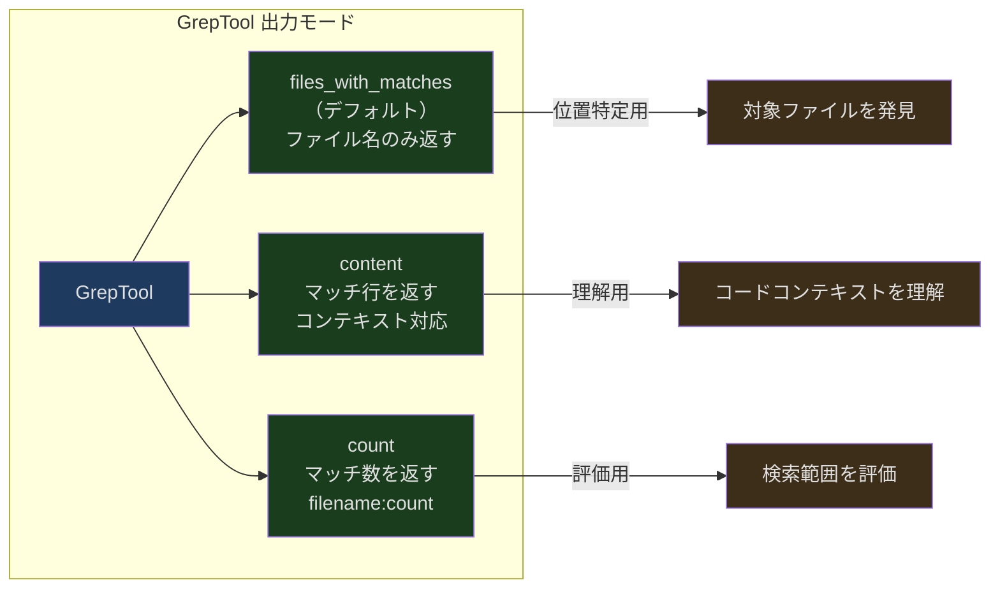
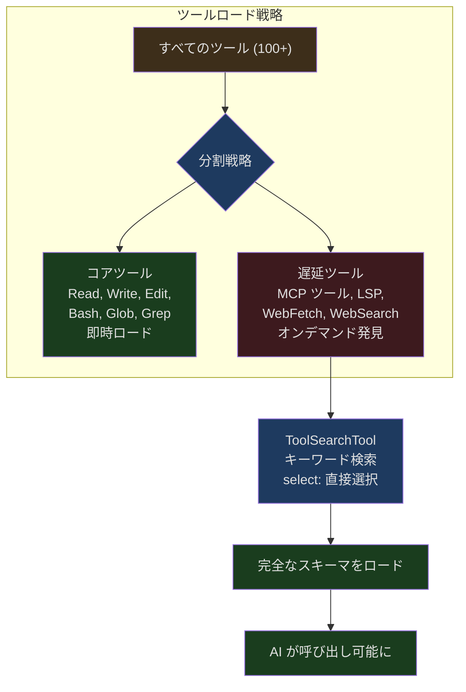
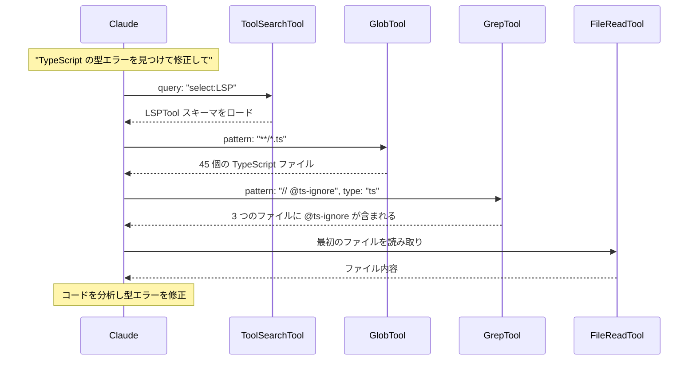

## 問題提起

AI が未知のコードベースに向き合うとき、最初の問いは「コードをどう修正するか」ではなく、「コードはどこにあるか」です。数万のファイルを含むプロジェクトで、正しいファイルとコード位置を見つけることが、すべての操作の前提条件となります。

従来の方法は `find` と `grep` コマンドを使うことです。しかし、これらのコマンドにはいくつかの問題があります：

1. **権限が制御できない** ── シェルコマンドは Claude Code の権限システムをバイパスします
2. **出力が制御できない** ── `grep -r pattern .` は数 MB の結果を返す可能性があり、大量のトークンを消費します
3. **フォーマットが不親切** ── シェルコマンドの出力フォーマットは AI にとって必ずしも最適ではありません

Claude Code の解決策は 3 つの専用検索ツールです：**GlobTool**（ファイル名パターンで検索）、**GrepTool**（内容で検索）、**ToolSearchTool**（遅延ツール発見）。それぞれが異なるレベルの検索問題を解決し、組み合わせて使用することで強力な検索体系を形成します。

---

## GlobTool：ファイルパターンマッチング

GlobTool は最もシンプルな検索ツールです。glob パターン（例：`**/*.ts`）を指定すると、マッチするすべてのファイルパスを返します。

### 入力と出力

```typescript
// src/tools/GlobTool/GlobTool.ts:26-53
const inputSchema = lazySchema(() =>
  z.strictObject({
    pattern: z.string().describe('The glob pattern to match files against'),
    path: z
      .string()
      .optional()
      .describe(
        'The directory to search in. If not specified, the current working directory will be used...',
      ),
  }),
)

const outputSchema = lazySchema(() =>
  z.object({
    durationMs: z.number().describe('Time taken to execute the search'),
    numFiles: z.number().describe('Total number of files found'),
    filenames: z.array(z.string()).describe('Array of file paths'),
    truncated: z.boolean().describe('Whether results were truncated (limited to 100 files)'),
  }),
)
```

入力パラメータは 2 つだけ：`pattern` とオプションの `path`。出力には 4 つのフィールドがあり、そのうち `truncated` フラグは結果が切り詰められたかどうかを AI に伝えます。

### 100 ファイルの切り詰め

```typescript
// src/tools/GlobTool/GlobTool.ts:154-176
  async call(input, { abortController, getAppState, globLimits }) {
    const start = Date.now()
    const appState = getAppState()
    const limit = globLimits?.maxResults ?? 100
    const { files, truncated } = await glob(
      input.pattern,
      GlobTool.getPath(input),
      { limit, offset: 0 },
      abortController.signal,
      appState.toolPermissionContext,
    )
    // cwd 配下のパスを相対化してトークンを節約
    const filenames = files.map(toRelativePath)
    const output: Output = {
      filenames,
      durationMs: Date.now() - start,
      numFiles: filenames.length,
      truncated,
    }
    return { data: output }
  },
```

デフォルトの上限は 100 ファイルです。結果が切り詰められた場合、AI により具体的なパスやパターンを使うよう促すメッセージが返されます。

切り詰め後のメッセージ：

```typescript
// src/tools/GlobTool/GlobTool.ts:186-196
  mapToolResultToToolResultBlockParam(output, toolUseID) {
    if (output.filenames.length === 0) {
      return { tool_use_id: toolUseID, type: 'tool_result', content: 'No files found' }
    }
    return {
      tool_use_id: toolUseID,
      type: 'tool_result',
      content: [
        ...output.filenames,
        ...(output.truncated
          ? ['(Results are truncated. Consider using a more specific path or pattern.)']
          : []),
      ].join('\n'),
    }
  },
```

### パスの相対化

```typescript
// cwd 配下のパスを相対化してトークンを節約（GrepTool と同様）
const filenames = files.map(toRelativePath)
```

返されるすべてのパスが相対化されます。`/Users/noah/project/src/index.ts` は `src/index.ts` になります。これはトークン最適化です。絶対パス内のプロジェクトルートパスプレフィックスは各ファイルで繰り返し出現するため、相対化によって大量のトークンを節約できます。

### 並行安全性

```typescript
// src/tools/GlobTool/GlobTool.ts:76-81
  isConcurrencySafe() {
    return true
  },
  isReadOnly() {
    return true
  },
```

GlobTool は完全に並行安全な読み取り専用操作です。複数の GlobTool 呼び出しが互いに干渉することなく並行実行できます。つまり、AI は `**/*.ts` と `**/*.tsx` を同時に検索でき、直列化する必要はありません。

---

## GrepTool：ripgrep ベースの内容検索

GrepTool は検索システムの中核であり、ripgrep（`rg`）をベースに構築され、ネイティブの `grep` をはるかに上回る機能を提供します。

### 豊富な入力スキーマ

```typescript
// src/tools/GrepTool/GrepTool.ts:33-89
const inputSchema = lazySchema(() =>
  z.strictObject({
    pattern: z.string().describe('The regular expression pattern to search for'),
    path: z.string().optional().describe('File or directory to search in'),
    glob: z.string().optional().describe('Glob pattern to filter files'),
    output_mode: z.enum(['content', 'files_with_matches', 'count']).optional(),
    '-B': semanticNumber(z.number().optional()).describe('Lines before match'),
    '-A': semanticNumber(z.number().optional()).describe('Lines after match'),
    '-C': semanticNumber(z.number().optional()).describe('Alias for context'),
    context: semanticNumber(z.number().optional()).describe('Lines before and after'),
    '-n': semanticBoolean(z.boolean().optional()).describe('Show line numbers'),
    '-i': semanticBoolean(z.boolean().optional()).describe('Case insensitive'),
    type: z.string().optional().describe('File type (js, py, rust, etc.)'),
    head_limit: semanticNumber(z.number().optional()).describe('Limit output'),
    offset: semanticNumber(z.number().optional()).describe('Skip first N entries'),
    multiline: semanticBoolean(z.boolean().optional()).describe('Multiline mode'),
  }),
)
```

13 個のパラメータです。これは Claude Code で最もパラメータの多いツールです。設計理念は、ripgrep のコア機能を過度に抽象化せず、AI に直接公開することです。

### 3 つの出力モード



- **files_with_matches** ── デフォルトモード。マッチしたファイルのパスのみを返し、変更時刻順でソートします。まず位置を特定してから精読するのに適しています
- **content** ── マッチ行とそのコンテキストを返します。`-A`/`-B`/`-C` でコンテキスト行数を制御可能
- **count** ── 各ファイルのマッチ数を返します。検索範囲を素早く評価するのに適しています

### ページングシステム

```typescript
// src/tools/GrepTool/GrepTool.ts:106-128
const DEFAULT_HEAD_LIMIT = 250

function applyHeadLimit<T>(
  items: T[],
  limit: number | undefined,
  offset: number = 0,
): { items: T[]; appliedLimit: number | undefined } {
  // 明示的な 0 = 無制限のエスケープハッチ
  if (limit === 0) {
    return { items: items.slice(offset), appliedLimit: undefined }
  }
  const effectiveLimit = limit ?? DEFAULT_HEAD_LIMIT
  const sliced = items.slice(offset, offset + effectiveLimit)
  // 実際に切り詰めが発生した場合のみ appliedLimit を報告
  const wasTruncated = items.length - offset > effectiveLimit
  return {
    items: sliced,
    appliedLimit: wasTruncated ? effectiveLimit : undefined,
  }
}
```

デフォルトの制限は 250 件です。設計のハイライト：

1. `limit: 0` は「無制限」のエスケープハッチ
2. `appliedLimit` は実際に切り詰めが発生した場合のみ設定され、AI に `offset` を使ってさらに結果を閲覧できることを伝えます
3. `offset` パラメータは `tail -n +N | head -N` と同等の効果を実現

### 除外ディレクトリ

```typescript
// src/tools/GrepTool/GrepTool.ts:94-102
const VCS_DIRECTORIES_TO_EXCLUDE = [
  '.git', '.svn', '.hg', '.bzr', '.jj', '.sl',
] as const
```

バージョン管理ディレクトリは自動的に除外されます。`.git` 内部の検索はほとんど有用ではなく、大量のノイズを生成するためです。6 つのバージョン管理システム（Git、SVN、Mercurial、Bazaar、Jujutsu、Sapling）をサポートしています。

### ripgrep 引数の構築

```typescript
// src/tools/GrepTool/GrepTool.ts:329-441
  async call({ pattern, path, glob, type, output_mode = 'files_with_matches',
    '-B': context_before, '-A': context_after, '-C': context_c, context,
    '-n': show_line_numbers = true, '-i': case_insensitive = false,
    head_limit, offset = 0, multiline = false,
  }, { abortController, getAppState }) {
    const absolutePath = path ? expandPath(path) : getCwd()
    const args = ['--hidden']

    for (const dir of VCS_DIRECTORIES_TO_EXCLUDE) {
      args.push('--glob', `!${dir}`)
    }

    args.push('--max-columns', '500')  // 行長を制限

    if (multiline) {
      args.push('-U', '--multiline-dotall')
    }
    // ... 追加の引数を構築
  }
```

`--max-columns 500` に注目してください。行幅を 500 文字に制限し、base64 エンコードや圧縮後の内容（通常 1 行で数千文字）が検索結果を埋め尽くすのを防ぎます。

### files_with_matches モードのソート

```typescript
// src/tools/GrepTool/GrepTool.ts:529-553
    const stats = await Promise.allSettled(
      results.map(_ => getFsImplementation().stat(_)),
    )
    const sortedMatches = results
      .map((_, i) => {
        const r = stats[i]!
        return [
          _,
          r.status === 'fulfilled' ? (r.value.mtimeMs ?? 0) : 0,
        ] as const
      })
      .sort((a, b) => {
        if (process.env.NODE_ENV === 'test') {
          return a[0].localeCompare(b[0])  // テスト時はファイル名ソートで決定性を確保
        }
        const timeComparison = b[1] - a[1]
        if (timeComparison === 0) {
          return a[0].localeCompare(b[0])  // ファイル名をタイブレーカーとして使用
        }
        return timeComparison
      })
```

デフォルトでは**変更時刻の降順**でソートされます。最近変更されたファイルが先頭に来ます。この設計の前提は、ユーザーが最も関心があるのは最近アクティブなファイルであるということです。テスト環境ではファイル名ソートに切り替え、結果の決定性を確保しています。

`Promise.all` ではなく `Promise.allSettled` を使用しています。ripgrep のスキャンと stat の間にファイルが削除された場合でも、バッチ全体が失敗することはありません。失敗した stat は mtime 0 として扱われます。

### 無視パターンの統合

```typescript
// src/tools/GrepTool/GrepTool.ts:412-427
    const ignorePatterns = normalizePatternsToPath(
      getFileReadIgnorePatterns(appState.toolPermissionContext),
      getCwd(),
    )
    for (const ignorePattern of ignorePatterns) {
      const rgIgnorePattern = ignorePattern.startsWith('/')
        ? `!${ignorePattern}`
        : `!**/${ignorePattern}`
      args.push('--glob', rgIgnorePattern)
    }
```

権限システムで設定された deny ルールは ripgrep の glob 除外パターンに変換されます。非絶対パスには `**/` プレフィックスの追加が必要です。ripgrep は作業ディレクトリ相対パスに対してのみ gitignore パターンを適用するためです。

---

## ToolSearchTool：遅延ツール発見

ToolSearchTool はまったく異なる検索問題を解決します。Claude Code に 100 以上のツールがある場合、AI が必要なツールを効率的に見つけるにはどうすればよいでしょうか？

### 遅延ロードの動機



すべてのツールの完全なスキーマを初期プロンプトに含めると、大量のトークンを消費します。ToolSearchTool は「ツールカタログ」を実現しています。遅延ツールは名前だけが system-reminder に表示され、AI が必要とする際に ToolSearchTool を通じて完全な定義を取得します。

### 遅延ツールの判定

```typescript
// src/tools/ToolSearchTool/prompt.ts:62-108
export function isDeferredTool(tool: Tool): boolean {
  // anthropic/alwaysLoad による明示的なオプトアウト
  if (tool.alwaysLoad === true) return false

  // MCP ツールは常に遅延（ワークフロー固有）
  if (tool.isMcp === true) return true

  // ToolSearch 自体は遅延しない
  if (tool.name === TOOL_SEARCH_TOOL_NAME) return false

  // fork-first モードでは Agent ツールはターン 1 から利用可能にする必要がある
  if (feature('FORK_SUBAGENT') && tool.name === AGENT_TOOL_NAME) {
    if (m.isForkSubagentEnabled()) return false
  }

  return tool.shouldDefer === true
}
```

判定ルールの優先順位：

1. `alwaysLoad: true` ── 遅延しない（MCP ツールは `_meta` で設定可能）
2. MCP ツール ── デフォルトで遅延（ワークフロー固有のため）
3. ToolSearchTool 自体 ── 遅延しない（他のツールをロードするためのツールは遅延できない）
4. 特殊ツール（Agent、Brief）── 条件付きで遅延しない
5. `shouldDefer: true` ── 遅延する

### 2 つのクエリモード

```typescript
// src/tools/ToolSearchTool/ToolSearchTool.ts:21-33
export const inputSchema = lazySchema(() =>
  z.object({
    query: z
      .string()
      .describe(
        'Query to find deferred tools. Use "select:<tool_name>" for direct selection, or keywords to search.',
      ),
    max_results: z
      .number()
      .optional()
      .default(5)
      .describe('Maximum number of results to return (default: 5)'),
  }),
)
```

**select: モード** ── 正確な選択：`select:Read,Edit,Grep` で名前指定でツールを取得します。カンマ区切りの複数選択に対応しています。

**キーワード検索** ── ファジー検索：`notebook jupyter` でツール名と説明を検索し、最も関連性の高い結果を返します。

### キーワードスコアリングアルゴリズム

```typescript
// src/tools/ToolSearchTool/ToolSearchTool.ts:259-301
async function searchToolsWithKeywords(query, deferredTools, tools, maxResults) {
  // ...
  const scored = await Promise.all(
    candidateTools.map(async tool => {
      const parsed = parseToolName(tool.name)
      const description = await getToolDescriptionMemoized(tool.name, tools)
      const hintNormalized = tool.searchHint?.toLowerCase() ?? ''

      let score = 0
      for (const term of allScoringTerms) {
        const pattern = termPatterns.get(term)!

        // 完全部分一致（MCP サーバー名に対して高い重み）
        if (parsed.parts.includes(term)) {
          score += parsed.isMcp ? 12 : 10
        } else if (parsed.parts.some(part => part.includes(term))) {
          score += parsed.isMcp ? 6 : 5
        }

        // searchHint マッチ ── キュレーションされたフレーズ、プロンプトより高いシグナル
        if (hintNormalized && pattern.test(hintNormalized)) {
          score += 4
        }

        // 説明マッチ - 誤検知を避けるためワード境界で判定
        if (pattern.test(descNormalized)) {
          score += 2
        }
      }

      return { name: tool.name, score }
    }),
  )
}
```

スコアリングの階層：
| マッチタイプ | スコア（通常） | スコア（MCP） |
|------------|------------|------------|
| ツール名の完全部分一致 | 10 | 12 |
| ツール名の包含一致 | 5 | 6 |
| searchHint マッチ | 4 | 4 |
| フルネームフォールバックマッチ | 3 | 3 |
| 説明のワード境界マッチ | 2 | 2 |

MCP ツールの名前マッチはスコアが高く設定されています。MCP ツール名には通常サーバー名が含まれ（例：`mcp__slack__send_message`）、サーバー名での検索が最も一般的なクエリパターンだからです。

### `+` プレフィックスの必須ワード

```typescript
// src/tools/ToolSearchTool/ToolSearchTool.ts:223-232
  const requiredTerms: string[] = []
  const optionalTerms: string[] = []
  for (const term of queryTerms) {
    if (term.startsWith('+') && term.length > 1) {
      requiredTerms.push(term.slice(1))
    } else {
      optionalTerms.push(term)
    }
  }
```

`+slack send` は、ツール名または説明に "slack" が**必ず**含まれている必要があり、その条件を満たすツールの中で "send" の関連性でランク付けすることを意味します。これにより検索がより精確になります。

### ツール参照の返却

```typescript
// src/tools/ToolSearchTool/ToolSearchTool.ts:444-470
  mapToolResultToToolResultBlockParam(content: Output, toolUseID: string) {
    if (content.matches.length === 0) {
      let text = 'No matching deferred tools found'
      if (content.pending_mcp_servers?.length > 0) {
        text += `. Some MCP servers are still connecting: ${content.pending_mcp_servers.join(', ')}...`
      }
      return { type: 'tool_result', tool_use_id: toolUseID, content: text }
    }
    return {
      type: 'tool_result',
      tool_use_id: toolUseID,
      content: content.matches.map(name => ({
        type: 'tool_reference' as const,
        tool_name: name,
      })),
    }
  },
```

`tool_reference` 型のコンテンツブロックを返します。これは Anthropic API の特殊なフォーマットで、マッチしたツールの完全なスキーマをモデルのコンテキストに注入するよう API に指示します。AI は次のターンでこれらのツールを使用できるようになります。

一部の MCP サーバーがまだ接続中の場合、返却メッセージにペンディング中のサーバーリストが含まれ、AI に後でリトライするよう促します。

---

## 3 ツールの組み合わせワークフロー



典型的な使用順序：

1. **ToolSearchTool** ── 特殊なツール（LSP、WebFetch など）が必要な場合、まず ToolSearch でロード
2. **GlobTool** ── ファイル一覧を作成し、プロジェクト構造を把握
3. **GrepTool** ── 対象ファイル内で具体的な内容を検索
4. **FileReadTool** ── 見つかったファイルを精読

この順序は粗い粒度から細かい粒度へと進み、段階的に検索範囲を絞り込みます。各ステップでパスの相対化を使用してトークンを節約しています。

---

## プロンプトによるガイド

BashTool のプロンプトは、AI にシェルコマンドではなく検索ツールを使うよう明確にガイドしています：

```typescript
// src/tools/BashTool/prompt.ts:280-286
const toolPreferenceItems = [
  `File search: Use ${GLOB_TOOL_NAME} (NOT find or ls)`,
  `Content search: Use ${GREP_TOOL_NAME} (NOT grep or rg)`,
]
```

GrepTool 自体のプロンプトもこの点を強調しています：

```typescript
// src/tools/GrepTool/prompt.ts:7-17
`A powerful search tool built on ripgrep

  Usage:
  - ALWAYS use Grep for search tasks. NEVER invoke \`grep\` or \`rg\` as a Bash command.
    The Grep tool has been optimized for correct permissions and access.
  - Supports full regex syntax (e.g., "log.*Error", "function\\s+\\w+")
  - Filter files with glob parameter (e.g., "*.js", "**/*.tsx")
  - Output modes: "content", "files_with_matches" (default), "count"
  - Use Agent tool for open-ended searches requiring multiple rounds
  - Pattern syntax: Uses ripgrep (not grep) - literal braces need escaping`
```

ポイントは「ALWAYS」と「NEVER」という明確な指示です。「prefer」よりも効果的に AI の行動をガイドします。

---

## 設計から得られる教訓

Claude Code の検索システムは、いくつかの核心的な設計原則を体現しています：

1. **専用ツールは汎用コマンドに勝る** ── Glob/Grep は `find`/`grep` よりも優れた権限制御、トークン管理、フォーマット済み出力を提供します

2. **段階的な絞り込み** ── GlobTool の粗粒度なファイル発見から、GrepTool の細粒度な内容検索、そして FileReadTool の完全な読み取りへ。検索ワークフローは自然に粗から細へと進みます

3. **遅延ロード** ── ToolSearchTool により、システムは 100 以上のツールをサポートしつつ、100 以上のツール分のプロンプトトークンを消費しません。必要なときだけロードします

4. **トークン感知設計** ── パスの相対化、結果の切り詰め、デフォルトの head_limit、変更時刻ソート。すべての設計判断がトークン効率を考慮しています
