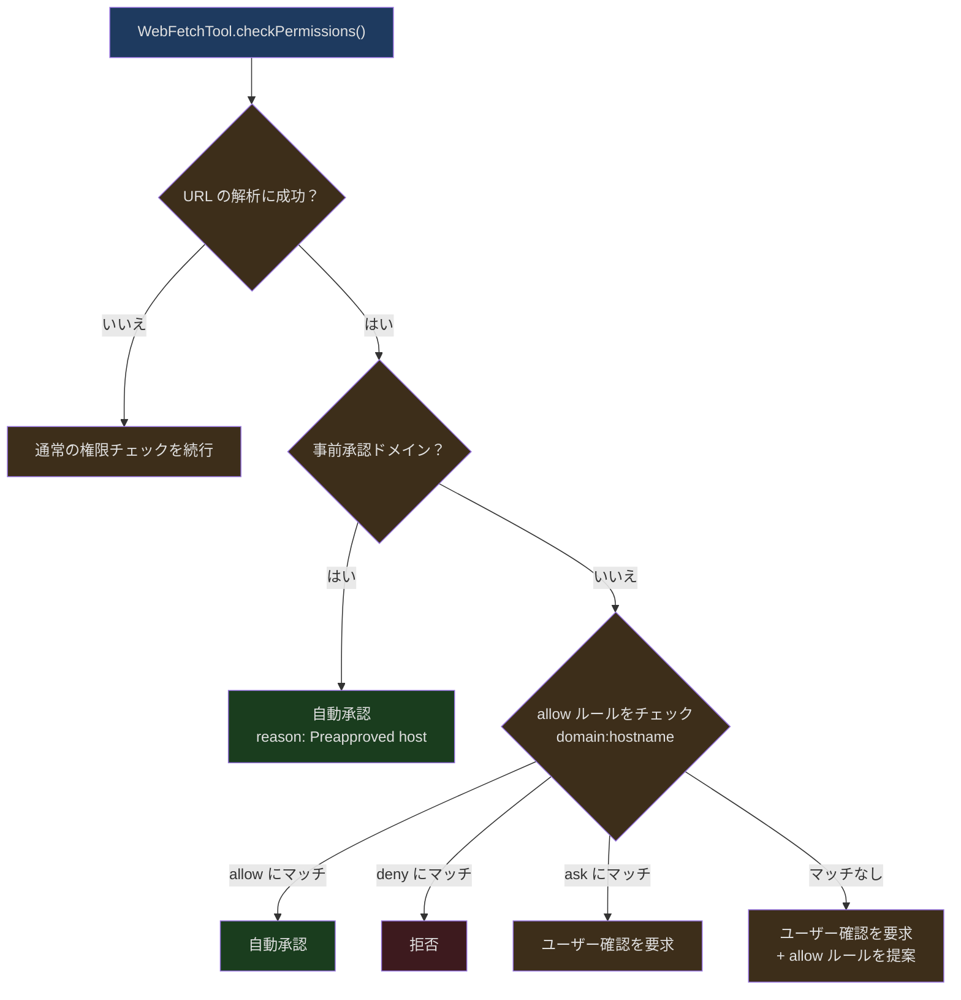
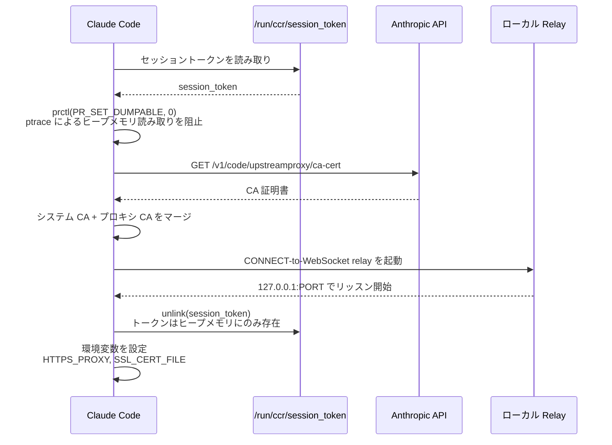
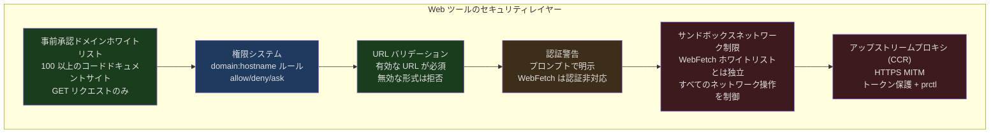

## 問題提起

AI コーディングアシスタントの知識には、モデルの訓練データの時点という自然な期限があります。ユーザーが「React 19 の新しい API の使い方は？」や「この npm パッケージの最新版にはどんな breaking changes がある？」と質問した場合、AI は最新情報を取得するためにインターネットアクセスに頼るしかありません。

しかし、AI にインターネットアクセスを許可することは新たなセキュリティ上の課題をもたらします：

1. **SSRF（Server-Side Request Forgery）** ── AI に悪意のある URL が注入され、内部ネットワークのサービスにアクセスする可能性があります
2. **データ窃取** ── 悪意のある Web ページが AI にユーザーのコードを外部に送信するよう指示する可能性があります
3. **トークン爆弾** ── 巨大な Web ページがコンテキスト空間をすべて消費する可能性があります
4. **認証漏洩** ── AI がユーザーの cookie やトークンを持って Web ページにアクセスすると、クレデンシャルが漏洩する可能性があります

Claude Code はこれらの問題を 2 つの専用ツールで解決します：**WebFetchTool**（指定 URL のコンテンツを取得）と **WebSearchTool**（インターネット検索）。CCR（Claude Code Remote）環境では、追加のネットワーク制御を提供するアップストリームプロキシ層もあります。

---

## WebFetchTool：コンテンツ取得

WebFetchTool は指定 URL からコンテンツを取得し、AI が自然言語プロンプトで取得したコンテンツを処理できるようにします。

### 入力モデル

```typescript
// src/tools/WebFetchTool/WebFetchTool.ts:24-30
const inputSchema = lazySchema(() =>
  z.strictObject({
    url: z.string().url().describe('The URL to fetch content from'),
    prompt: z.string().describe('The prompt to run on the fetched content'),
  }),
)
```

パラメータは 2 つ：`url` と `prompt`。`prompt` の設計意図は、AI が単に生のコンテンツを取得するだけでなく、目的を持って情報を抽出できるようにすることです。例えば「この API ドキュメントからすべてのエンドポイントとそのパラメータを抽出して」というように使います。

出力には HTTP ステータスコード、処理済みテキスト、取得時間、コンテンツサイズが含まれます：

```typescript
// src/tools/WebFetchTool/WebFetchTool.ts:32-45
const outputSchema = lazySchema(() =>
  z.object({
    bytes: z.number().describe('Size of the fetched content in bytes'),
    code: z.number().describe('HTTP response code'),
    codeText: z.string().describe('HTTP response code text'),
    result: z.string().describe('Processed result from applying the prompt'),
    durationMs: z.number().describe('Time taken to fetch and process'),
    url: z.string().describe('The URL that was fetched'),
  }),
)
```

### 事前承認ドメインホワイトリスト

WebFetchTool の最も重要なセキュリティ機構の一つが、事前承認ドメインリストです：

```typescript
// src/tools/WebFetchTool/preapproved.ts:14-131
export const PREAPPROVED_HOSTS = new Set([
  // Anthropic
  'platform.claude.com',
  'code.claude.com',
  'modelcontextprotocol.io',

  // 主要プログラミング言語
  'docs.python.org',
  'en.cppreference.com',
  'developer.mozilla.org',
  'doc.rust-lang.org',
  'www.typescriptlang.org',

  // Web フレームワーク
  'react.dev',
  'nextjs.org',
  'vuejs.org',
  'tailwindcss.com',

  // クラウド & DevOps
  'docs.aws.amazon.com',
  'cloud.google.com',
  'kubernetes.io',

  // ... 合計 100 以上のドメイン
])
```

これらのドメインは**ユーザー確認なし**でアクセスできます。リストの選定基準は「コード関連のドキュメントサイト」であり、読み取り専用のリファレンス資料で、認証やユーザーデータに関わらないものです。

ソースコード内のセキュリティ警告に注目してください：

```
// SECURITY WARNING: These preapproved domains are ONLY for WebFetch (GET requests only).
// The sandbox system deliberately does NOT inherit this list for network restrictions,
// as arbitrary network access (POST, uploads, etc.) to these domains could enable
// data exfiltration. Some domains like huggingface.co, kaggle.com, and nuget.org
// allow file uploads and would be dangerous for unrestricted network access.
```

これは重要なセキュリティ上の区別です。WebFetch は GET リクエストのみ（読み取り専用）を行いますが、サンドボックスのネットワーク制限は任意のネットワーク操作（POST を含む）を制御します。両者でホワイトリストを共有することはできません。

### パスレベルの事前承認

```typescript
// src/tools/WebFetchTool/preapproved.ts:136-166
const { HOSTNAME_ONLY, PATH_PREFIXES } = (() => {
  const hosts = new Set<string>()
  const paths = new Map<string, string[]>()
  for (const entry of PREAPPROVED_HOSTS) {
    const slash = entry.indexOf('/')
    if (slash === -1) {
      hosts.add(entry)
    } else {
      const host = entry.slice(0, slash)
      const path = entry.slice(slash)
      const prefixes = paths.get(host)
      if (prefixes) prefixes.push(path)
      else paths.set(host, [path])
    }
  }
  return { HOSTNAME_ONLY: hosts, PATH_PREFIXES: paths }
})()

export function isPreapprovedHost(hostname: string, pathname: string): boolean {
  if (HOSTNAME_ONLY.has(hostname)) return true
  const prefixes = PATH_PREFIXES.get(hostname)
  if (prefixes) {
    for (const p of prefixes) {
      // パスセグメント境界を強制
      if (pathname === p || pathname.startsWith(p + '/')) return true
    }
  }
  return false
}
```

一部のドメインは特定のパスに対してのみ事前承認されています。例えば `github.com/anthropics` は事前承認されていますが、`github.com/random-user` は承認されていません。パスマッチングはセグメント境界（`/`）を強制し、`/anthropics-evil/malware` が誤ってマッチすることを防ぎます。

データ構造はモジュールロード時に 2 つのルックアップテーブル（`HOSTNAME_ONLY` Set と `PATH_PREFIXES` Map）に前処理され、ランタイムのマッチングが O(1) になっています。

### 権限チェックフロー



権限ルールは `domain:hostname` 形式で格納されます。ユーザーがあるドメインへのアクセスを承認すると、そのドメインのすべての URL が承認されます。

### プロンプト内の認証警告

```typescript
// src/tools/WebFetchTool/WebFetchTool.ts:181-189
  async prompt(_options) {
    return `IMPORTANT: WebFetch WILL FAIL for authenticated or private URLs. Before using this tool, check if the URL points to an authenticated service (e.g. Google Docs, Confluence, Jira, GitHub). If so, look for a specialized MCP tool that provides authenticated access.
${DESCRIPTION}`
  },
```

この警告は ToolSearchTool の利用可否にかかわらず、常にプロンプトに含まれます。ソースコードのコメントで理由が説明されています。このプレフィックスが ToolSearch の利用可否に基づいて条件付きで切り替わると、ツール説明が連続する API コール間で「フリッカー」し、Anthropic API のプロンプトキャッシュが壊れます。フリッカーが起きるたびにキャッシュミスが 2 回発生します。

---

## WebSearchTool：インターネット検索

WebSearchTool は Anthropic の Web Search API を使用してインターネット検索を行います。WebFetchTool とは異なり、特定の URL を取得するのではなく、インターネット全体を検索します。

### アーキテクチャの特殊性

WebSearchTool は単純に検索 API を呼び出すだけではありません。**モデルの中にモデルがある**アーキテクチャです：

```typescript
// src/tools/WebSearchTool/WebSearchTool.ts:254-291
  async call(input, context, _canUseTool, _parentMessage, onProgress) {
    const { query } = input
    const userMessage = createUserMessage({
      content: 'Perform a web search for the query: ' + query,
    })
    const toolSchema = makeToolSchema(input)

    const queryStream = queryModelWithStreaming({
      messages: [userMessage],
      systemPrompt: asSystemPrompt([
        'You are an assistant for performing a web search tool use',
      ]),
      tools: [],
      signal: context.abortController.signal,
      options: {
        extraToolSchemas: [toolSchema],
        querySource: 'web_search_tool',
        // ...
      },
    })
    // ...
  }
```

内部の API コールを作成し、`web_search_20250305` 型のツールスキーマを渡します。API 側が自動的に検索を実行して結果を返します。このアーキテクチャの利点は、検索の実際の実行は Anthropic のインフラストラクチャが処理し、クライアント側はストリーミングレスポンスの処理だけで済むことです。

### 検索制限

```typescript
// src/tools/WebSearchTool/WebSearchTool.ts:76-84
function makeToolSchema(input: Input): BetaWebSearchTool20250305 {
  return {
    type: 'web_search_20250305',
    name: 'web_search',
    allowed_domains: input.allowed_domains,
    blocked_domains: input.blocked_domains,
    max_uses: 8, // 最大 8 回の検索にハードコード
  }
}
```

1 回の呼び出しで最大 8 回の検索を実行します。`allowed_domains` と `blocked_domains` により、AI は検索範囲を制御できます。例えば、公式ドキュメントサイトのみを検索したり、既知の低品質な結果ソースを除外したりできます。

### プロバイダーの利用可否

```typescript
// src/tools/WebSearchTool/WebSearchTool.ts:169-193
  isEnabled() {
    const provider = getAPIProvider()
    const model = getMainLoopModel()

    if (provider === 'firstParty') return true

    if (provider === 'vertex') {
      const supportsWebSearch =
        model.includes('claude-opus-4') ||
        model.includes('claude-sonnet-4') ||
        model.includes('claude-haiku-4')
      return supportsWebSearch
    }

    if (provider === 'foundry') return true

    return false
  },
```

WebSearchTool は Web Search API をサポートするプロバイダーでのみ利用可能です：Anthropic ファーストパーティ、Google Vertex（Claude 4.0 以降のモデルのみ）、Foundry。

### プログレス報告

```typescript
// src/tools/WebSearchTool/WebSearchTool.ts:298-388
    for await (const event of queryStream) {
      // server_tool_use 開始時にツール使用 ID を追跡
      if (event.type === 'stream_event' &&
          event.event?.type === 'content_block_start') {
        const contentBlock = event.event.content_block
        if (contentBlock?.type === 'server_tool_use') {
          currentToolUseId = contentBlock.id
          currentToolUseJson = ''
        }
      }

      // 現在のツール使用の JSON を蓄積
      if (currentToolUseId &&
          event.type === 'stream_event' &&
          event.event?.type === 'content_block_delta') {
        const delta = event.event.delta
        if (delta?.type === 'input_json_delta' && delta.partial_json) {
          currentToolUseJson += delta.partial_json
          // プログレス更新のために部分 JSON からクエリを抽出
          // ...
        }
      }

      // 検索結果が到着したらプログレスを報告
      if (event.type === 'stream_event' &&
          event.event?.type === 'content_block_start') {
        const contentBlock = event.event.content_block
        if (contentBlock?.type === 'web_search_tool_result') {
          // プログレスを報告
          if (onProgress) {
            onProgress({
              toolUseID: toolUseId,
              data: { type: 'search_results_received', resultCount, query },
            })
          }
        }
      }
    }
```

WebSearchTool は検索プロセス中に `onProgress` コールバックを通じてプログレスを報告します。検索はストリーミングであるため、すべての検索が完了するのを待つのではなく、検索結果が到着した時点でリアルタイムに UI を更新できます。

---

## アップストリームプロキシ（Upstream Proxy）

CCR（Claude Code Remote）環境では、すべてのネットワークトラフィックがアップストリームプロキシを経由してルーティングされ、追加のセキュリティ制御を提供します。

### 初期化フロー



```typescript
// src/upstreamproxy/upstreamproxy.ts:79-153
export async function initUpstreamProxy(opts?) {
  if (!isEnvTruthy(process.env.CLAUDE_CODE_REMOTE)) return state
  if (!isEnvTruthy(process.env.CCR_UPSTREAM_PROXY_ENABLED)) return state

  const token = await readToken(tokenPath)
  if (!token) return state

  setNonDumpable()

  const caOk = await downloadCaBundle(baseUrl, systemCaPath, caBundlePath)
  if (!caOk) return state

  try {
    const relay = await startUpstreamProxyRelay({ wsUrl, sessionId, token })
    registerCleanup(async () => relay.stop())
    state = { enabled: true, port: relay.port, caBundlePath }

    // リスナーが起動した後にのみ unlink を実行
    await unlink(tokenPath).catch(() => {})
  } catch (err) {
    // フェイルオープン ── プロキシの不具合でセッションが壊れてはならない
  }

  return state
}
```

主要なセキュリティ対策：

1. **prctl 防護** ── `PR_SET_DUMPABLE=0` により、同じ UID のプロセスが ptrace でこのプロセスのヒープメモリを読み取ることを阻止します。プロンプトインジェクション攻撃が `gdb -p $PPID` でセッショントークンを窃取することを防ぎます

2. **トークンファイルの削除** ── トークンは relay の起動成功後にディスクから削除され、プロセスメモリにのみ保持されます。削除は relay が利用可能であることを確認した後にのみ実行され、失敗時にスーパーバイザーがディスク上のトークンでリトライできるようにしています

3. **フェイルオープン** ── いかなるステップの失敗もプロキシを無効化するだけで、セッションを中断しません。コメントで明確に述べられています：「A broken proxy setup must never break an otherwise-working session.」

### NO_PROXY リスト

```typescript
// src/upstreamproxy/upstreamproxy.ts:37-63
const NO_PROXY_LIST = [
  'localhost', '127.0.0.1', '::1',
  '169.254.0.0/16',     // リンクローカル
  '10.0.0.0/8',         // RFC1918
  '172.16.0.0/12',
  '192.168.0.0/16',

  // Anthropic API ── NO_PROXY のパース方法が異なるため 3 形式：
  'anthropic.com',       // apex ドメインフォールバック
  '.anthropic.com',      // Python urllib/httpx（サフィックスマッチ）
  '*.anthropic.com',     // Bun, curl, Go（glob マッチ）

  'github.com',
  'registry.npmjs.org',
  'pypi.org',
].join(',')
```

Anthropic API は同じドメインに 3 つの形式を使用しています。異なるランタイム（Bun、Python、Go）が `NO_PROXY` を異なる方法でパースするためです。この防御的プログラミングにより、Anthropic API リクエストがアップストリームプロキシを経由することは決してなく、MITM プロキシの偽造 CA が非 Bun ランタイムの HTTPS 検証を破壊することを回避しています。

### 環境変数の伝播

```typescript
// src/upstreamproxy/upstreamproxy.ts:160-199
export function getUpstreamProxyEnv(): Record<string, string> {
  if (!state.enabled || !state.port || !state.caBundlePath) {
    // 親プロセスからプロキシ変数を継承した場合はそれをパススルー
    if (process.env.HTTPS_PROXY && process.env.SSL_CERT_FILE) {
      const inherited: Record<string, string> = {}
      for (const key of ['HTTPS_PROXY', 'https_proxy', 'NO_PROXY', 'no_proxy',
        'SSL_CERT_FILE', 'NODE_EXTRA_CA_CERTS', 'REQUESTS_CA_BUNDLE',
        'CURL_CA_BUNDLE']) {
        if (process.env[key]) inherited[key] = process.env[key]
      }
      return inherited
    }
    return {}
  }
  const proxyUrl = `http://127.0.0.1:${state.port}`
  return {
    HTTPS_PROXY: proxyUrl,
    https_proxy: proxyUrl,       // Python 用の小文字
    NO_PROXY: NO_PROXY_LIST,
    no_proxy: NO_PROXY_LIST,     // Python 用の小文字
    SSL_CERT_FILE: state.caBundlePath,
    NODE_EXTRA_CA_CERTS: state.caBundlePath,
    REQUESTS_CA_BUNDLE: state.caBundlePath,  // Python requests
    CURL_CA_BUNDLE: state.caBundlePath,      // curl
  }
}
```

プロキシ環境変数は複数の形式で設定され、異なるクライアントライブラリをカバーしています：
- `HTTPS_PROXY` / `https_proxy` ── 大文字小文字の 2 形式（Node.js は大文字、Python は小文字を使用）
- `SSL_CERT_FILE` ── OpenSSL 汎用
- `NODE_EXTRA_CA_CERTS` ── Node.js 専用
- `REQUESTS_CA_BUNDLE` ── Python requests ライブラリ
- `CURL_CA_BUNDLE` ── curl コマンド

子プロセス（Bash、MCP、LSP、Hooks）はすべて `subprocessEnv()` を通じてこれらの変数を継承します。

---

## セキュリティ考慮のまとめ



6 層のセキュリティ防護が、最も緩い（事前承認ホワイトリストの自動通過）から最も厳しい（アップストリームプロキシの MITM インターセプト）まで、多層防御を形成しています。

重要なセキュリティの分離：**WebFetch ホワイトリスト =/= サンドボックスネットワークホワイトリスト**。huggingface.co はドキュメントの読み取りには安全なソースかもしれませんが（WebFetch）、サンドボックスを通じた任意のネットワーク操作を許可すると、データ窃取チャネルになりかねません（ファイルアップロードをサポートしているため）。

---

## 設計から得られる教訓

Claude Code の Web ツール設計は、いくつかの核心的な原則を体現しています：

1. **最小権限** ── デフォルトではどのドメインへのアクセスも許可されず、コードドキュメントサイトのみが事前承認され、その他はユーザーの明示的な承認が必要です

2. **セキュリティの分離** ── WebFetch（読み取り専用 GET）とサンドボックスネットワーク（任意操作）には独立したホワイトリストがあり、WebSearch はホワイトリストを必要としません（API 側で制御されるため）

3. **フェイルオープン vs フェイルクローズ** ── アップストリームプロキシが故障した場合はオープン（セッションをブロックしない）ですが、権限チェックが失敗した場合はクローズ（アクセスを阻止）です。これは異なるコンポーネントのリスクレベルを反映しています

4. **マルチランタイム互換性** ── 環境変数、NO_PROXY フォーマット、CA 証明書パス。すべてのネットワーク設定が Bun/Node.js/Python/curl の違いを考慮しています
