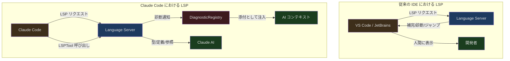
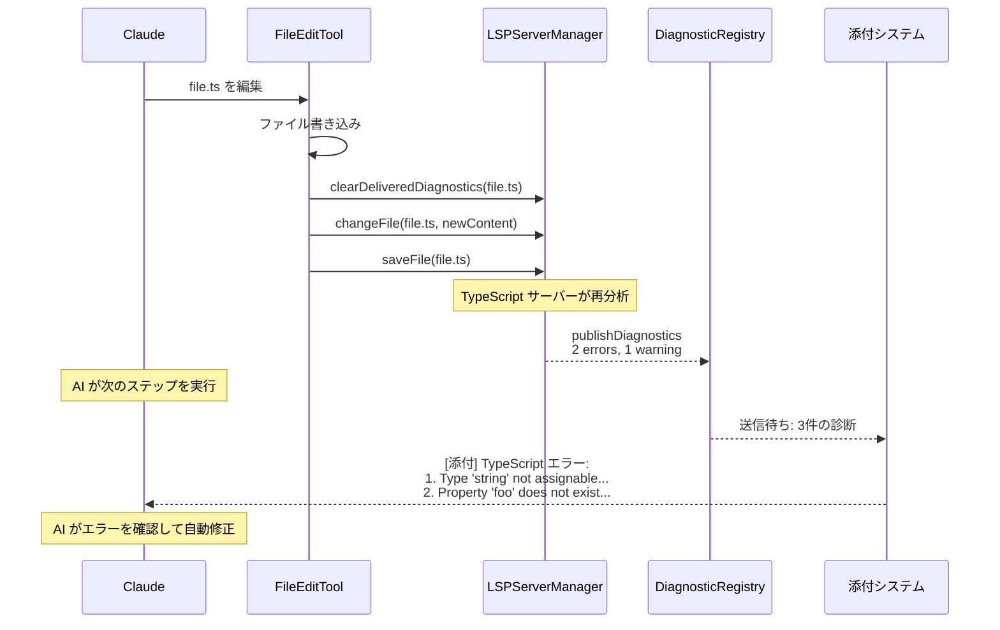

## 導入

Language Server Protocol (LSP) はモダンな IDE の基盤です。エディタにコード補完、定義へのジャンプ、参照の検索、ホバー情報などの機能を提供します。しかし Claude Code は IDE ではなく、AI コーディングアシスタントです。では、なぜ LSP が必要なのでしょうか。

次のシナリオを考えてみましょう。AI が TypeScript ファイルを編集し、ある関数のパラメータを `string` から `number` に変更しました。しかし、この関数を呼び出しているすべての箇所をチェックしていません。一部の呼び出し元はまだ `string` を渡しています。LSP がなければ、ユーザーが `tsc` コンパイラを実行するか IDE で赤い波線を確認するまで、AI は自分が型エラーを導入したことに気づきません。

Claude Code の LSP 統合は、ターミナルを IDE に変えるためのものではありません。その核心的な目的は、**AI がコード編集後に即座にセマンティックフィードバックを取得すること**です。型エラー、未使用の変数、見つからない参照などの情報が、AI が同じインタラクションループ内で自ら導入した問題を修正するのに役立ちます。

---

## Claude Code における LSP の役割



2つの重要な違いがあります：

1. **消費者が異なる** — IDE では LSP の出力は人間が見るもの。Claude Code では LSP の出力は AI が見るもの
2. **トリガー方式が異なる** — IDE ではユーザー操作時に能動的に LSP へリクエスト。Claude Code ではファイル編集後に受動的に診断を受信し、AI が LSPTool を能動的に呼び出した時のみリクエストを発行

---

## LSPServerManager：マルチ言語サーバー管理

### アーキテクチャ概要

```typescript
// src/services/lsp/LSPServerManager.ts:16-43
export type LSPServerManager = {
  initialize(): Promise<void>
  shutdown(): Promise<void>
  getServerForFile(filePath: string): LSPServerInstance | undefined
  ensureServerStarted(filePath: string): Promise<LSPServerInstance | undefined>
  sendRequest<T>(filePath: string, method: string, params: unknown): Promise<T | undefined>
  getAllServers(): Map<string, LSPServerInstance>
  openFile(filePath: string, content: string): Promise<void>
  changeFile(filePath: string, content: string): Promise<void>
  saveFile(filePath: string): Promise<void>
  closeFile(filePath: string): Promise<void>
  isFileOpen(filePath: string): boolean
}
```

LSPServerManager は複数の言語サーバーインスタンスを管理し、ファイル拡張子に基づいてリクエストを適切なサーバーにルーティングします。**ファクトリ関数パターン**（クラスではなく）を使用し、クロージャで内部状態をカプセル化しています：

```typescript
// src/services/lsp/LSPServerManager.ts:59-65
export function createLSPServerManager(): LSPServerManager {
  const servers: Map<string, LSPServerInstance> = new Map()
  const extensionMap: Map<string, string[]> = new Map()
  const openedFiles: Map<string, string> = new Map()
  // ... クロージャ内のプライベート状態
}
```

### 拡張子からサーバーへのマッピング

```typescript
// src/services/lsp/LSPServerManager.ts:88-104
    for (const [serverName, config] of Object.entries(serverConfigs)) {
      if (!config.command) {
        throw new Error(`Server ${serverName} missing required 'command' field`)
      }
      if (!config.extensionToLanguage ||
          Object.keys(config.extensionToLanguage).length === 0) {
        throw new Error(`Server ${serverName} missing required 'extensionToLanguage'`)
      }

      const fileExtensions = Object.keys(config.extensionToLanguage)
      for (const ext of fileExtensions) {
        const normalized = ext.toLowerCase()
        if (!extensionMap.has(normalized)) {
          extensionMap.set(normalized, [])
        }
        extensionMap.get(normalized)!.push(serverName)
      }

      const instance = createLSPServerInstance(serverName, config)
      servers.set(serverName, instance)
    }
```

各言語サーバーの設定は、サポートするファイル拡張子と対応する言語識別子を宣言します。1つの拡張子が複数のサーバーにマッピングされることもあります（一般的ではありませんが）。サーバーは初めて使用される時に起動されます（遅延読み込み）。

### workspace/configuration の処理

```typescript
// src/services/lsp/LSPServerManager.ts:124-135
      instance.onRequest(
        'workspace/configuration',
        (params: { items: Array<{ section?: string }> }) => {
          logForDebugging(
            `LSP: Received workspace/configuration request from ${serverName}`,
          )
          return params.items.map(() => null)
        },
      )
```

一部の言語サーバー（TypeScript など）は、クライアントが `workspace/configuration` をサポートしていないと宣言しているにもかかわらずリクエストを送信します。Claude Code は各リクエスト項目に `null` を返し、実際の設定を提供せずにプロトコル要件を満たしています。

---

## グローバルシングルトンとライフサイクル

```typescript
// src/services/lsp/manager.ts:14-25
type InitializationState = 'not-started' | 'pending' | 'success' | 'failed'

let lspManagerInstance: LSPServerManager | undefined
let initializationState: InitializationState = 'not-started'
let initializationError: Error | undefined
let initializationGeneration = 0
let initializationPromise: Promise<void> | undefined
```

LSP マネージャーはグローバルシングルトンで、4つの状態を持ちます：

```mermaid
stateDiagram-v2
  [*] --> not_started
  not_started --> pending: initializeLspServerManager()
  pending --> success: 初期化完了
  pending --> failed: 初期化失敗
  failed --> pending: reinitializeLspServerManager()
  success --> not_started: reinitializeLspServerManager()

  state not_started {
    description: 未開始
  }
  state pending {
    description: 初期化中
  }
  state success {
    description: 初期化成功
  }
  state failed {
    description: 初期化失敗
  }
```

### 世代カウンター

```typescript
// src/services/lsp/manager.ts:145-207
export function initializeLspServerManager(): void {
  if (isBareMode()) return

  if (lspManagerInstance !== undefined && initializationState !== 'failed') return

  lspManagerInstance = createLSPServerManager()
  initializationState = 'pending'

  const currentGeneration = ++initializationGeneration

  initializationPromise = lspManagerInstance
    .initialize()
    .then(() => {
      if (currentGeneration === initializationGeneration) {
        initializationState = 'success'
        if (lspManagerInstance) {
          registerLSPNotificationHandlers(lspManagerInstance)
        }
      }
    })
    .catch((error: unknown) => {
      if (currentGeneration === initializationGeneration) {
        initializationState = 'failed'
        lspManagerInstance = undefined
      }
    })
}
```

`initializationGeneration` は世代カウンターで、期限切れの初期化 Promise が状態を更新するのを防ぎます。`reinitializeLspServerManager()` が呼ばれると世代がインクリメントされ、古い初期化がその後完了しても新しい状態に影響しません。

これは実際のバグ（issue #15521）を解決しています。`loadAllPlugins()` が memoize されており、起動初期（`getCommands` のプリフェッチを通じて）に呼ばれますが、その時点では marketplace がまだ協調しておらず、プラグインリストが空になっていました。LSP が空のリストで初期化された後、再初期化されることはありませんでした。修正方法は、プラグイン更新時に `reinitializeLspServerManager()` を呼び出すことです。

### ヘルスチェック

```typescript
// src/services/lsp/manager.ts:100-110
export function isLspConnected(): boolean {
  if (initializationState === 'failed') return false
  const manager = getLspServerManager()
  if (!manager) return false
  const servers = manager.getAllServers()
  if (servers.size === 0) return false
  for (const server of servers.values()) {
    if (server.state !== 'error') return true
  }
  return false
}
```

`isLspConnected()` は、少なくとも1つのエラー状態でないサーバーがあるかどうかを確認します。この関数が `LSPTool.isEnabled()` を支えており、LSP が利用可能な場合にのみ LSPTool がツールリストに表示されます。

---

## LSP Diagnostic Registry：受動的な診断注入

LSP 統合で最も重要な機能は LSPTool（AI が能動的に使用するもの）ではなく、**受動的な診断注入**です。言語サーバーがバックグラウンドで自動的に診断を送信し、システムがそれを AI のコンテキストに注入します。

### 通知処理フロー

```typescript
// src/services/lsp/passiveFeedback.ts:125-279
export function registerLSPNotificationHandlers(
  manager: LSPServerManager,
): HandlerRegistrationResult {
  const servers = manager.getAllServers()

  for (const [serverName, serverInstance] of servers.entries()) {
    serverInstance.onNotification(
      'textDocument/publishDiagnostics',
      (params: unknown) => {
        // パラメータ構造の検証
        if (!params || typeof params !== 'object' ||
            !('uri' in params) || !('diagnostics' in params)) {
          return
        }

        const diagnosticParams = params as PublishDiagnosticsParams

        // LSP 診断を Claude 形式に変換
        const diagnosticFiles = formatDiagnosticsForAttachment(diagnosticParams)

        // 非同期配信のために登録
        registerPendingLSPDiagnostic({
          serverName,
          files: diagnosticFiles,
        })
      },
    )
  }
}
```

各言語サーバーに `textDocument/publishDiagnostics` 通知ハンドラーが登録されます。ファイルが編集されると、言語サーバーが再分析し、新しい診断情報をプッシュします。

### 重要度マッピング

```typescript
// src/services/lsp/passiveFeedback.ts:18-35
function mapLSPSeverity(
  lspSeverity: number | undefined,
): 'Error' | 'Warning' | 'Info' | 'Hint' {
  switch (lspSeverity) {
    case 1: return 'Error'
    case 2: return 'Warning'
    case 3: return 'Info'
    case 4: return 'Hint'
    default: return 'Error'
  }
}
```

LSP プロトコルは重要度を数値で表現しますが、Claude Code はそれを文字列ラベルに変換します。デフォルト値は `Error` です。重要度が不明な場合は、危険性を過大評価する方が安全だからです。

### DiagnosticRegistry：重複排除とレート制限

```typescript
// src/services/lsp/LSPDiagnosticRegistry.ts:41-47
const MAX_DIAGNOSTICS_PER_FILE = 10
const MAX_TOTAL_DIAGNOSTICS = 30
const MAX_DELIVERED_FILES = 500

const pendingDiagnostics = new Map<string, PendingLSPDiagnostic>()
const deliveredDiagnostics = new LRUCache<string, Set<string>>({
  max: MAX_DELIVERED_FILES,
})
```

3重の制限により、診断情報がコンテキストを圧迫するのを防ぎます：

1. **ファイルあたり最大10件** — ソート後、高重要度を優先して保持（Error > Warning > Info > Hint）
2. **合計最大30件** — グローバル制限
3. **ターン間の重複排除** — 既に送信済みの診断は再送しない（LRU キャッシュに基づき、最大500ファイルを追跡）

重複排除のキーは、メッセージ、重要度、範囲、ソース、コードで構成されます：

```typescript
// src/services/lsp/LSPDiagnosticRegistry.ts:110-124
function createDiagnosticKey(diag: {
  message: string
  severity?: string
  range?: unknown
  source?: string
  code?: unknown
}): string {
  return jsonStringify({
    message: diag.message,
    severity: diag.severity,
    range: diag.range,
    source: diag.source || null,
    code: diag.code || null,
  })
}
```

### ファイル編集時のリセット

```typescript
// src/services/lsp/LSPDiagnosticRegistry.ts:372-379
export function clearDeliveredDiagnosticsForFile(fileUri: string): void {
  if (deliveredDiagnostics.has(fileUri)) {
    logForDebugging(
      `LSP Diagnostics: Clearing delivered diagnostics for ${fileUri}`,
    )
    deliveredDiagnostics.delete(fileUri)
  }
}
```

ファイルが編集されると（FileWriteTool または FileEditTool がトリガー）、そのファイルの配信済み診断がクリアされます。これにより、新しい診断が同じ内容であっても再送されます。なぜなら、それらは修正後のコードに対応するものだからです。

---

## LSPTool：AI による能動的クエリ

LSPTool は、AI が受動的に診断を受け取るだけでなく、能動的に LSP 機能をリクエストできるようにします。

### サポートされる操作

```typescript
// src/tools/LSPTool/prompt.ts:3-21
export const DESCRIPTION = `Interact with Language Server Protocol (LSP) servers...

Supported operations:
- goToDefinition: Find where a symbol is defined
- findReferences: Find all references to a symbol
- hover: Get hover information (documentation, type info)
- documentSymbol: Get all symbols in a document
- workspaceSymbol: Search for symbols across the workspace
- goToImplementation: Find implementations of an interface
- prepareCallHierarchy: Get call hierarchy item at a position
- incomingCalls: Find all callers of a function
- outgoingCalls: Find all callees of a function`
```

9種類の操作がコードナビゲーションの中核的なニーズをカバーしています。`incomingCalls` と `outgoingCalls` は2段階のプロトコルが必要です。まず `prepareCallHierarchy` で `CallHierarchyItem` を取得し、それを使って実際の呼び出し関係をリクエストします。

### 座標変換

```typescript
// src/tools/LSPTool/LSPTool.ts:427-513
function getMethodAndParams(input: Input, absolutePath: string) {
  const uri = pathToFileURL(absolutePath).href
  // 1-based（ユーザーフレンドリー）から 0-based（LSP プロトコル）への変換
  const position = {
    line: input.line - 1,
    character: input.character - 1,
  }
  // ...
}
```

LSP プロトコルは 0-based の座標を使用しますが、エディタや FileReadTool は 1-based の座標を使用します。LSPTool は境界で変換を行い、AI が Read ツールの出力で確認した行番号をそのまま使用できるようにしています。

### Gitignore フィルタリング

```typescript
// src/tools/LSPTool/LSPTool.ts:556-611
async function filterGitIgnoredLocations<T extends Location>(
  locations: T[],
  cwd: string,
): Promise<T[]> {
  const uniquePaths = uniq(uriToPath.values())
  const BATCH_SIZE = 50
  for (let i = 0; i < uniquePaths.length; i += BATCH_SIZE) {
    const batch = uniquePaths.slice(i, i + BATCH_SIZE)
    const result = await execFileNoThrowWithCwd(
      'git', ['check-ignore', ...batch],
      { cwd, timeout: 5_000 }
    )
    // ... 無視されたパスの解析
  }
  return locations.filter(loc => !ignoredPaths.has(filePath))
}
```

LSP サーバーは `node_modules` やその他の gitignore 対象ディレクトリ内の結果を返すことがあります。Claude Code は `git check-ignore` を使用してこれらの結果をバッチでフィルタリングし（1バッチ50パス）、AI が無関係な参照に気を取られるのを防ぎます。

### ファイルサイズ制限

```typescript
// src/tools/LSPTool/LSPTool.ts:53
const MAX_LSP_FILE_SIZE_BYTES = 10_000_000
```

10MB を超えるファイルは LSP 分析の対象外となります。大きなファイルは通常、生成されたコードやデータファイルであり、LSP で分析しても遅くて価値がありません。

### 遅延ツール設定

```typescript
// src/tools/LSPTool/LSPTool.ts:137-139
  shouldDefer: true,
  isEnabled() {
    return isLspConnected()
  },
```

LSPTool は `shouldDefer: true` とマークされており、初期プロンプトには表示されません。AI は ToolSearchTool を通じて読み込む必要があります。`isEnabled()` チェックにより、少なくとも1つの言語サーバーが正常に接続されている場合にのみツールが利用可能になります。

---

## Bridge LSP 共有

Bridge モード（Claude Code が VS Code 拡張機能のバックエンドとして実行される場合）では、LSP の役割が変わります。VS Code には既に独自の言語サーバーがあるため、Claude Code が別途起動する必要はありません。

```typescript
// src/services/lsp/manager.ts:145-150
export function initializeLspServerManager(): void {
  // --bare / SIMPLE: no LSP
  if (isBareMode()) {
    return
  }
  // ...
}
```

bare モード（スクリプト化された `-p` 呼び出し）では、LSP は完全に無効化されます。ユーザーインタラクションがないため、診断フィードバックは不要です。

Bridge モードでは、診断情報が VS Code の LSP クライアントから（MCP SDK を通じて）直接プッシュされることがあり、Claude Code 自身が言語サーバーを管理する必要がありません。これにより、2つの LSP クライアントが同一の言語サーバーを奪い合う問題を回避できます。

---

## ファイル編集ツールとの統合

LSP 統合の最も価値ある点は、ファイル編集ツールとの自動連携です：



このフローは完全に自動化されています。AI は何も能動的に呼び出す必要なく、診断フィードバックを取得できます。FileEditTool がファイル書き込み後に LSP サーバーに通知し、サーバーが分析後に診断をプッシュし、診断が添付システムを通じて AI の次のクエリに注入されます。

---

## 設計の示唆

Claude Code の LSP 統合は、いくつかの核心的な設計原則を体現しています：

1. **AI のための設計であり、人間のための設計ではない** — LSP の出力は UI に赤い波線を描くためのものではありません。構造化テキストに変換され、添付として AI のコンテキストに注入されます

2. **受動優先、能動補助** — 診断注入は自動的（受動的）で、LSPTool はオンデマンド（能動的）です。ほとんどの場合、AI は能動的に LSP を呼び出す必要がありません。エラー情報が自動的に届きます

3. **容量制御** — ファイルあたり10件、合計30件、LRU 重複排除。これらの制限により、LSP 情報が他の価値あるコンテキスト空間を圧迫しないようにしています

4. **遅延起動** — 言語サーバーはオンデマンドで起動し、LSPTool は遅延読み込みされます。LSP が不要なシナリオ（プレーンテキスト編集、bash 操作）では、システムは LSP の初期化コストを負担しません

5. **防御的エラー処理** — 初期化失敗は例外をスローせず undefined を返す。世代カウンターが期限切れのコールバックを防止する。各サーバーの通知処理は互いに分離されている。LSP のいかなる問題も Claude Code のコア機能に影響しません
