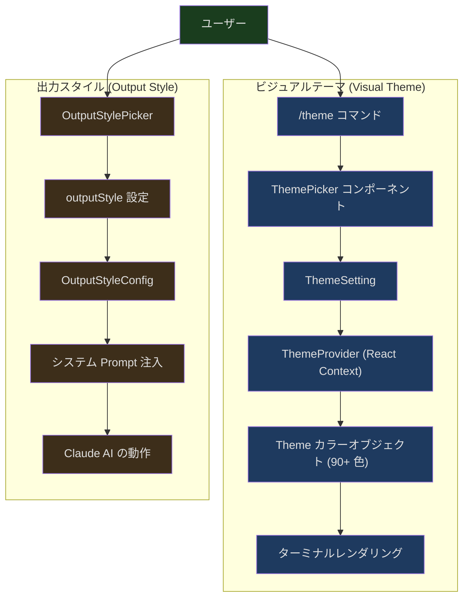
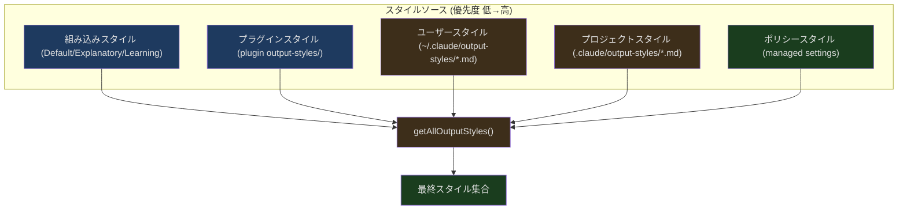
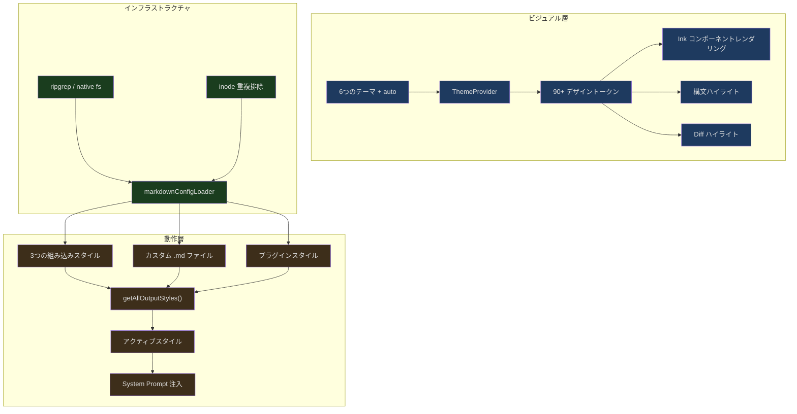

## 導入

Claude Code を開くと、ターミナルに色がついていることに気づきます。OS のデフォルトカラーではなく、入念にデザインされた配色です。Claude の回答にはオレンジ色のボーダー、パーミッション要求は紫色、diff は緑/赤のハイライト、コードブロックには構文ハイライトが適用されます。`/theme light` に切り替えると、すべての色がライトバックグラウンドにシームレスに適合します。`/output-style Learning` と入力すると、Claude の回答スタイルが簡潔モードから教育モードに変わり、判断の背景にある理由を説明し始めます。

この裏には、独立しながらも協調する2つのシステムがあります：

1. **Visual Theme（ビジュアルテーマ）** — 色、ボーダー、構文ハイライトなどの視覚的な表現を制御。`/theme` コマンドで切り替え
2. **Output Style（出力スタイル）** — Claude AI の回答スタイルと動作モードを制御。output style picker で選択

本記事では、これら2つのシステムの設計と実装を詳しく分析します。

---

## デュアルシステムアーキテクチャ



重要な違い：ビジュアルテーマは**どの色が表示されるか**を変更し、出力スタイルは**AI が何を言うか**を変更します。両者は完全に直交しています。ダークテーマと Learning スタイルの組み合わせも、ライトテーマとデフォルトスタイルの組み合わせも可能です。

---

## ビジュアルテーマシステム

### Theme 型：90以上のセマンティックカラー

```typescript
// src/utils/theme.ts:4-89
export type Theme = {
  autoAccept: string
  bashBorder: string
  claude: string
  claudeShimmer: string
  permission: string
  permissionShimmer: string
  text: string
  inverseText: string
  inactive: string
  subtle: string
  success: string
  error: string
  warning: string
  diffAdded: string
  diffRemoved: string
  diffAddedWord: string
  diffRemovedWord: string
  // ... 他に70以上のカラートークン
}
```

これは単純な「前景色/背景色」ではなく、完全なデザイントークン（design token）システムです。各色には明確なセマンティクスがあります：

- `claude` — Claude ブランドのオレンジ色。AI 回答のボーダーに使用
- `permission` — 紫色。パーミッション要求に使用
- `bashBorder` — ピンク色。Bash ツールの出力ボーダーに使用
- `success` / `error` / `warning` — セマンティックステータスカラー
- `diffAdded` / `diffRemoved` — diff ハイライトカラー
- `*Shimmer` — 各プライマリカラーに対応する「シマー」バリアント。ローディングアニメーションに使用

Shimmer バリアントは細部のデザインです。AI が考え中の時、ボーダーがメインカラーとシマーカラーの間で交互に点滅します。Shimmer バリアントがなければ、アニメーションは唐突すぎるか（差の大きい2色間）、見えないか（同じ色）になってしまいます。

### 6つのテーマバリアント

```typescript
// src/utils/theme.ts:91-98
export const THEME_NAMES = [
  'dark',
  'light',
  'light-daltonized',
  'dark-daltonized',
  'light-ansi',
  'dark-ansi',
] as const
```

各バリアントは特定のシナリオに最適化されています：

- **dark / light** — 明確な RGB 値を使用し、すべてのターミナルで一貫した見た目を実現
- **\*-daltonized** — 色覚障害に配慮したバージョン。赤/緑の区別に依存しない
- **\*-ansi** — RGB ではなく ANSI カラーコードを使用し、ユーザーがカスタマイズしたターミナル配色を尊重

なぜ `light` テーマは ANSI ではなく RGB を使うのでしょうか。ユーザーがターミナルで ANSI の「赤」をブライトピンクやダークレッドに設定している可能性があるためです。ANSI カラーに依存すると、diff の赤緑が区別しづらくなることがあります。明確な RGB 値を使用することで、Anthropic のデザイナーが丁寧に調整した色がどのターミナルでも同じに見えることが保証されます。

一方、ANSI バリアントが存在する理由は、完璧なターミナル配色に多大な労力を費やしたユーザーがおり、すべてのツールに自分の配色を使って上書きされたくないと考えているからです。

### ThemeSetting：'auto' の知恵

```typescript
// src/utils/theme.ts:103-109
export const THEME_SETTINGS = ['auto', ...THEME_NAMES] as const

// A theme preference as stored in user config. 'auto' follows the system
// dark/light mode and is resolved to a ThemeName at runtime.
export type ThemeSetting = (typeof THEME_SETTINGS)[number]
```

`ThemeSetting` と `ThemeName` は異なる型です。`ThemeSetting` には `'auto'` オプションが追加されており、ランタイムで具体的な `ThemeName` に解決されます。

```typescript
// src/components/design-system/ThemeProvider.tsx:81
const currentTheme: ThemeName = activeSetting === 'auto'
  ? systemTheme : activeSetting;
```

Auto モードは OSC 11 プロトコルを使ってターミナルの背景色を照会し、ダーク/ライトモードを判定します：

```typescript
// src/components/design-system/ThemeProvider.tsx:64-79
useEffect(() => {
  if (feature('AUTO_THEME')) {
    if (activeSetting !== 'auto' || !internal_querier) return;
    let cleanup: (() => void) | undefined;
    let cancelled = false;
    void import('../../utils/systemThemeWatcher.js').then(({
      watchSystemTheme
    }) => {
      if (cancelled) return;
      cleanup = watchSystemTheme(internal_querier, setSystemTheme);
    });
    return () => {
      cancelled = true;
      cleanup?.();
    };
  }
}, [activeSetting, internal_querier]);
```

いくつかの実装ディテール：

1. **Feature flag ガード** — `AUTO_THEME` feature flag により、`systemThemeWatcher` モジュール全体が外部ビルドでデッドコード除去される
2. **動的インポート** — `import('../../utils/systemThemeWatcher.js')` により、auto モード以外では不要なコードの読み込みを回避
3. **キャンセルセマンティクス** — `cancelled` フラグにより、コンポーネントのアンマウント後の状態設定を防止
4. **$COLORFGBG フォールバック** — 初期化時に環境変数 `$COLORFGBG` から近似値を取得し、後続の OSC 11 クエリで修正

---

## ThemePicker：リアルタイムプレビュー付きインタラクションコンポーネント

```typescript
// src/components/ThemePicker.tsx:19-29
export type ThemePickerProps = {
  onThemeSelect: (setting: ThemeSetting) => void;
  showIntroText?: boolean;
  helpText?: string;
  showHelpTextBelow?: boolean;
  hideEscToCancel?: boolean;
  skipExitHandling?: boolean;
  onCancel?: () => void;
};
```

ThemePicker には「プレビュー」メカニズムがあります。ユーザーがリスト内を移動すると、テーマがリアルタイムで切り替わって効果を確認できますが、選択を確定した場合にのみ保存されます：

```typescript
// src/components/design-system/ThemeProvider.tsx:82-100
const value = useMemo<ThemeContextValue>(() => ({
  themeSetting,
  setThemeSetting: (newSetting: ThemeSetting) => {
    setThemeSetting(newSetting);
    setPreviewTheme(null);
    if (newSetting === 'auto') {
      setSystemTheme(getSystemThemeName());
    }
    onThemeSave?.(newSetting);
  },
  setPreviewTheme: (newSetting: ThemeSetting) => {
    setPreviewTheme(newSetting);
    if (newSetting === 'auto') {
      setSystemTheme(getSystemThemeName());
    }
  },
  // ...
```

3つの操作の違い：
- `setPreviewTheme(setting)` — 一時的に切り替え、config に書き込まない
- `savePreview()` — 現在のプレビューを正式なテーマとして保存
- `cancelPreview()` — プレビュー前のテーマに復元

これにより、ユーザーはテーマ選択時に各オプションの効果をリアルタイムで確認でき、Escape キーを押せば元の状態に戻ります。

---

## /theme コマンド：最もシンプルなスラッシュコマンド

```typescript
// src/commands/theme/index.ts:1-10
import type { Command } from '../../commands.js'

const theme = {
  type: 'local-jsx',
  name: 'theme',
  description: 'Change the theme',
  load: () => import('./theme.js'),
} satisfies Command
```

これは `local-jsx` タイプのコマンドで、プレーンテキストではなく React コンポーネントを返します。`load: () => import('./theme.js')` は動的インポートによるオンデマンド読み込みを実現しています。

実際の実行ロジックは非常にシンプルです：

```typescript
// src/commands/theme/theme.tsx:54-56
export const call: LocalJSXCommandCall = async (onDone, _context) => {
  return <ThemePickerCommand onDone={onDone} />;
};
```

`ThemePickerCommand` コンポーネントは `ThemePicker` をラップし、ユーザーが選択した後に `setTheme(setting)` と onDone(Theme set to setting) を呼び出して操作を完了します：

```typescript
// src/commands/theme/theme.tsx:13-52
function ThemePickerCommand({ onDone }: Props) {
  const [, setTheme] = useTheme();
  // ... 選択処理
  return (
    <Pane color="permission">
      <ThemePicker
        onThemeSelect={setting => {
          setTheme(setting);
          onDone(`Theme set to ${setting}`);
        }}
        onCancel={() => {
          onDone('Theme picker dismissed', { display: 'system' });
        }}
        skipExitHandling={true}
      />
    </Pane>
  );
}
```

`Pane color="permission"` でラップすることで、テーマピッカーに紫色のボーダーを適用し、他のパーミッション/設定系インターフェースとの視覚的一貫性を保っています。

---

## 出力スタイルシステム

### 組み込みスタイル：Default、Explanatory、Learning

```typescript
// src/constants/outputStyles.ts:41-135
export const OUTPUT_STYLE_CONFIG: OutputStyles = {
  [DEFAULT_OUTPUT_STYLE_NAME]: null,  // null はデフォルト動作を意味する
  Explanatory: {
    name: 'Explanatory',
    source: 'built-in',
    description:
      'Claude explains its implementation choices and codebase patterns',
    keepCodingInstructions: true,
    prompt: `You are an interactive CLI tool that helps users with software
engineering tasks. In addition to software engineering tasks, you should
provide educational insights about the codebase along the way.
...
## Insights
In order to encourage learning, before and after writing code, always
provide brief educational explanations...`,
  },
  Learning: {
    name: 'Learning',
    source: 'built-in',
    description:
      'Claude pauses and asks you to write small pieces of code for hands-on practice',
    keepCodingInstructions: true,
    prompt: `...
## Requesting Human Contributions
In order to encourage learning, ask the human to contribute 2-10 line
code pieces when generating 20+ lines involving:
- Design decisions (error handling, data structures)
- Business logic with multiple valid approaches
- Key algorithms or interface definitions
...`,
  },
}
```

`Default` スタイルの値は `null` です。追加のプロンプトを注入せず、Claude はデフォルトの動作を使用します。この設計により「デフォルトモードでもプロンプトのオーバーヘッドがある」問題を回避しています。

`keepCodingInstructions: true` は、このスタイルに切り替えた時にベースのコーディング指示プロンプトを保持し、完全に置換しないようシステムに指示します。これは Explanatory と Learning スタイルにとって重要です。デフォルトの動作の上に教育機能を**追加**するのであって、コーディング機能を置き換えるのではないからです。

### Explanatory スタイルの Insight フォーマット

```typescript
// src/constants/outputStyles.ts:30-37
const EXPLANATORY_FEATURE_PROMPT = `
## Insights
In order to encourage learning, before and after writing code, always
provide brief educational explanations about implementation choices using
(with backticks):
"\`${figures.star} Insight ─────────────────────────────────────\`
[2-3 key educational points]
\`─────────────────────────────────────────────────\`"
`
```

`figures.star` は `figures` ライブラリから取得され、異なるターミナルで適切なスター文字にレンダリングされます。Insight ブロック全体はバッククォートで等幅テキストとしてレンダリングされ、セパレーターラインがターミナル内で整列することを保証します。

### Learning スタイルのインタラクションモード

Learning スタイルの最も興味深い点は、AI に**一時停止してユーザーに手を動かしてもらう**よう要求することです：

```
${figures.bullet} **Learn by Doing**
**Context:** [what's built and why this decision matters]
**Your Task:** [specific function/section in file, mention file and TODO(human)]
**Guidance:** [trade-offs and constraints to consider]
```

プロンプトはまた、AI にコード内に `TODO(human)` マーカーを挿入するよう指示します。これはコードベースと会話の間のリンクを作る方法です。AI は「Learn by Doing」リクエストを発行した後は操作を続行せず、ユーザーの実装を待ちます。

---

## カスタム出力スタイル：Markdown ファイルの読み込み



カスタムスタイルは Markdown ファイルで定義し、`.claude/output-styles/` ディレクトリに配置します。読み込みロジックは `loadOutputStylesDir.ts` にあります：

```typescript
// src/outputStyles/loadOutputStylesDir.ts:26-92
export const getOutputStyleDirStyles = memoize(
  async (cwd: string): Promise<OutputStyleConfig[]> => {
    try {
      const markdownFiles = await loadMarkdownFilesForSubdir(
        'output-styles',
        cwd,
      )

      const styles = markdownFiles
        .map(({ filePath, frontmatter, content, source }) => {
          try {
            const fileName = basename(filePath)
            const styleName = fileName.replace(/\.md$/, '')

            const name = (frontmatter['name'] || styleName) as string
            const description =
              coerceDescriptionToString(
                frontmatter['description'],
                styleName,
              ) ??
              extractDescriptionFromMarkdown(
                content,
                `Custom ${styleName} output style`,
              )

            const keepCodingInstructionsRaw =
              frontmatter['keep-coding-instructions']
            const keepCodingInstructions =
              keepCodingInstructionsRaw === true ||
              keepCodingInstructionsRaw === 'true'
                ? true
                : keepCodingInstructionsRaw === false ||
                    keepCodingInstructionsRaw === 'false'
                  ? false
                  : undefined

            return {
              name,
              description,
              prompt: content.trim(),
              source,
              keepCodingInstructions,
            }
          } catch (error) {
            logError(error)
            return null
          }
        })
        .filter(style => style !== null)

      return styles
    } catch (error) {
      logError(error)
      return []
    }
  },
)
```

### 読み込みフローの詳細

1. **`loadMarkdownFilesForSubdir('output-styles', cwd)` を呼び出す** — この汎用関数は、ユーザーディレクトリ（`~/.claude/output-styles/`）、プロジェクトディレクトリ（`.claude/output-styles/`）、およびポリシー管理ディレクトリのカスタム出力スタイルを同時に検索します

2. **Frontmatter の解析** — Markdown ファイルの YAML ヘッダーが名前と説明を提供します：
   ```markdown
   ---
   name: Concise
   description: Short and sweet responses
   keep-coding-instructions: true
   ---
   Your style prompt content here...
   ```

3. **ファイル名をフォールバックとして使用** — frontmatter に `name` フィールドがない場合、ファイル名（`.md` 拡張子を除去）を使用

4. **`keep-coding-instructions` の処理** — ブール値と文字列値（`true` / `'true'`）の両方をサポート。YAML frontmatter の型解析が常に一貫しているとは限らないため

5. **memoize キャッシュ** — lodash の `memoize` を使用して、ファイルシステムの重複スキャンを回避

### スタイルのマージ優先度

```typescript
// src/constants/outputStyles.ts:137-175
export const getAllOutputStyles = memoize(async function getAllOutputStyles(
  cwd: string,
): Promise<{ [styleName: string]: OutputStyleConfig | null }> {
  const customStyles = await getOutputStyleDirStyles(cwd)
  const pluginStyles = await loadPluginOutputStyles()

  const allStyles = {
    ...OUTPUT_STYLE_CONFIG,  // 組み込みスタイルをベースとして
  }

  const managedStyles = customStyles.filter(
    style => style.source === 'policySettings',
  )
  const userStyles = customStyles.filter(
    style => style.source === 'userSettings',
  )
  const projectStyles = customStyles.filter(
    style => style.source === 'projectSettings',
  )

  // 優先度 低→高：built-in, plugin, user, project, managed
  const styleGroups = [pluginStyles, userStyles, projectStyles, managedStyles]

  for (const styles of styleGroups) {
    for (const style of styles) {
      allStyles[style.name] = { ... }
    }
  }

  return allStyles
})
```

優先度の順序は `built-in < plugin < user < project < managed` です。これは以下を意味します：

- プロジェクトは組み込みと同名のスタイルを定義してオーバーライドできる
- エンタープライズポリシー（managed）が最高優先度を持つ。プロジェクトが同名のスタイルを定義しても、ポリシーのバージョンが優先される
- 同名はマージではなくオーバーライド。後から読み込まれたものが先に読み込まれたものを完全に置換する

---

## Markdown 設定ローダー：汎用インフラストラクチャ

出力スタイルのファイル読み込みは独自実装ではなく、`markdownConfigLoader.ts` の汎用インフラストラクチャを再利用しています。このローダーは commands、agents、output-styles、skills など複数のサブディレクトリに同時にサービスを提供します：

```typescript
// src/utils/markdownConfigLoader.ts:29-36
export const CLAUDE_CONFIG_DIRECTORIES = [
  'commands',
  'agents',
  'output-styles',
  'skills',
  'workflows',
  ...(feature('TEMPLATES') ? (['templates'] as const) : []),
] as const
```

### ディレクトリ走査戦略

```typescript
// src/utils/markdownConfigLoader.ts:234-289
export function getProjectDirsUpToHome(
  subdir: ClaudeConfigDirectory,
  cwd: string,
): string[] {
  const home = resolve(homedir()).normalize('NFC')
  const gitRoot = resolveStopBoundary(cwd)
  let current = resolve(cwd)
  const dirs: string[] = []

  while (true) {
    if (
      normalizePathForComparison(current) ===
      normalizePathForComparison(home)
    ) {
      break
    }

    const claudeSubdir = join(current, '.claude', subdir)
    try {
      statSync(claudeSubdir)
      dirs.push(claudeSubdir)
    } catch (e: unknown) {
      if (!isFsInaccessible(e)) throw e
    }

    if (
      gitRoot &&
      normalizePathForComparison(current) ===
        normalizePathForComparison(gitRoot)
    ) {
      break
    }

    const parent = dirname(current)
    if (parent === current) break
    current = parent
  }

  return dirs
}
```

カレントディレクトリから上位に向かって走査し、git ルートディレクトリまたはホームディレクトリに到達するまで続けます。**git ルートディレクトリで停止する**のはセキュリティ上の判断です。親ディレクトリの `.claude/` 設定がサブプロジェクトに意図せず漏洩するのを防ぎます。

例えば、以下のようなディレクトリ構造の場合：
```
~/projects/.claude/output-styles/verbose.md
~/projects/my-repo/.claude/output-styles/concise.md
```

`my-repo` 内で作業していて `my-repo` が git リポジトリである場合、`concise.md` のみが読み込まれ、`~/projects/` レベルの `verbose.md` は読み込まれません。

### ファイル検索：デュアルエンジン戦略

```typescript
// src/utils/markdownConfigLoader.ts:553-568
const useNative = isEnvTruthy(process.env.CLAUDE_CODE_USE_NATIVE_FILE_SEARCH)
const signal = AbortSignal.timeout(3000)
let files: string[]
try {
  files = useNative
    ? await findMarkdownFilesNative(dir, signal)
    : await ripGrep(
        ['--files', '--hidden', '--follow', '--no-ignore',
         '--glob', '*.md'],
        dir,
        signal,
      )
} catch (e: unknown) {
  if (isFsInaccessible(e)) return []
  throw e
}
```

デフォルトでは ripgrep を使用して `.md` ファイルを検索しますが（より高速）、Node.js ネイティブ実装をフォールバックとして提供しています。2つの検索エンジンの違い：

- **ripgrep** — 高速だが、ネイティブビルドでは起動オーバーヘッドが大きい
- **Node.js ネイティブ** — 起動が速く外部プロセス不要だが、大きなディレクトリのスキャンが遅い

3秒のタイムアウト（`AbortSignal.timeout(3000)`）により、巨大な `.claude/output-styles/` ディレクトリでハングするのを防ぎます。

### 重複排除：inode レベルの正確な重複排除

```typescript
// src/utils/markdownConfigLoader.ts:384-407
const fileIdentities = await Promise.all(
  allFiles.map(file => getFileIdentity(file.filePath)),
)

const seenFileIds = new Map<string, SettingSource>()
const deduplicatedFiles: MarkdownFile[] = []

for (const [i, file] of allFiles.entries()) {
  const fileId = fileIdentities[i] ?? null
  if (fileId === null) {
    deduplicatedFiles.push(file)  // fail open
    continue
  }
  const existingSource = seenFileIds.get(fileId)
  if (existingSource !== undefined) {
    logForDebugging(
      `Skipping duplicate file '${file.filePath}' from ${file.source}
       (same inode already loaded from ${existingSource})`,
    )
    continue
  }
  seenFileIds.set(fileId, file.source)
  deduplicatedFiles.push(file)
}
```

`device:inode` 識別子を使用して重複排除を行います。これにより、シンボリックリンクやハードリンクを通じて同じ物理ファイルを指すパスを検出できます。例えば、`~/.claude` がプロジェクト内のディレクトリへのシンボリックリンクである場合、同じ output-style ファイルが2回検出されることがあります（ユーザー設定として1回、プロジェクト設定として1回）。inode 重複排除により、1回のみ読み込まれることが保証されます。

`getFileIdentity` は `bigint: true` で `lstat` を呼び出します。一部のファイルシステム（ExFAT など）では inode 番号が JavaScript の Number 精度（53ビット）を超える可能性があるためです。

---

## プラグイン出力スタイル

```typescript
// src/utils/plugins/loadPluginOutputStyles.ts:15-33
async function loadOutputStylesFromDirectory(
  outputStylesPath: string,
  pluginName: string,
  loadedPaths: Set<string>,
): Promise<OutputStyleConfig[]> {
  const styles: OutputStyleConfig[] = []
  await walkPluginMarkdown(
    outputStylesPath,
    async fullPath => {
      const style = await loadOutputStyleFromFile(
        fullPath,
        pluginName,
        loadedPaths,
      )
      if (style) styles.push(style)
    },
    { logLabel: 'output-styles' },
  )
  return styles
}
```

プラグイン出力スタイルには重要な違いがあります。名前空間化です：

```typescript
// src/utils/plugins/loadPluginOutputStyles.ts:53-55
const baseStyleName = (frontmatter.name as string) || fileName
const name = `${pluginName}:${baseStyleName}`
```

プラグインスタイル名には自動的に `pluginName:` プレフィックスが付きます（例：`my-plugin:concise`）。これにより、異なるプラグインの同名スタイル間の衝突を防ぎます。

### force-for-plugin メカニズム

```typescript
// src/utils/plugins/loadPluginOutputStyles.ts:64-70
const forceRaw = frontmatter['force-for-plugin']
const forceForPlugin =
  forceRaw === true || forceRaw === 'true'
    ? true
    : forceRaw === false || forceRaw === 'false'
      ? false
      : undefined
```

プラグインは frontmatter で `force-for-plugin: true` を設定でき、そのプラグインが有効な時に自動的にその出力スタイルが適用されます。ユーザーが手動で選択する必要はありません。複数のプラグインが force を設定している場合、最初のもののみが使用され、警告がログに記録されます：

```typescript
// src/constants/outputStyles.ts:194-199
if (forcedStyles.length > 1) {
  logForDebugging(
    `Multiple plugins have forced output styles:
     ${forcedStyles.map(s => s.name).join(', ')}.
     Using: ${firstForcedStyle.name}`,
    { level: 'warn' },
  )
}
```

`force-for-plugin` はプラグインソースのスタイルにのみ有効です。ユーザー自身の output-style ファイルにこのフィールドが設定されている場合、debug レベルの警告が表示されます。

---

## OutputStylePicker：スタイル選択 UI

```typescript
// src/components/OutputStylePicker.tsx:28-111
export function OutputStylePicker({
  initialStyle,
  onComplete,
  onCancel,
  isStandaloneCommand,
}: OutputStylePickerProps) {
  const [styleOptions, setStyleOptions] = useState([])
  const [isLoading, setIsLoading] = useState(true)

  useEffect(() => {
    getAllOutputStyles(getCwd())
      .then(allStyles => {
        const options = mapConfigsToOptions(allStyles)
        setStyleOptions(options)
        setIsLoading(false)
      })
      .catch(() => {
        // エラー時は組み込みスタイルにフォールバック
        const builtInOptions = mapConfigsToOptions(OUTPUT_STYLE_CONFIG)
        setStyleOptions(builtInOptions)
        setIsLoading(false)
      })
  }, [])
```

すべてのスタイル（カスタムとプラグインを含む）を非同期で読み込み、読み込みに失敗した場合は組み込みスタイルにフォールバックします。読み込み中は `Loading output styles...` メッセージが表示されます。

`mapConfigsToOptions` はスタイル設定を Select コンポーネントが必要とするフォーマットに変換します：

```typescript
// src/components/OutputStylePicker.tsx:13-21
function mapConfigsToOptions(styles) {
  return Object.entries(styles).map(([style, config]) => ({
    label: config?.name ?? DEFAULT_OUTPUT_STYLE_LABEL,
    value: style,
    description: config?.description ?? DEFAULT_OUTPUT_STYLE_DESCRIPTION
  }));
}
```

`Default` スタイルの config は `null` なので、`??` でフォールバックラベルと説明を提供する必要があります。

---

## キャッシュクリア：グローバル連動

```typescript
// src/outputStyles/loadOutputStylesDir.ts:94-98
export function clearOutputStyleCaches(): void {
  getOutputStyleDirStyles.cache?.clear?.()
  loadMarkdownFilesForSubdir.cache?.clear?.()
  clearPluginOutputStyleCache()
}
```

```typescript
// src/constants/outputStyles.ts:177-179
export function clearAllOutputStylesCache(): void {
  getAllOutputStyles.cache?.clear?.()
}
```

システム内に複数レイヤーの memoize キャッシュがあり、協調的なクリアが必要です：

1. `getOutputStyleDirStyles` — ディレクトリレベルのスタイル読み込みキャッシュ
2. `loadMarkdownFilesForSubdir` — 汎用 Markdown ファイル検索キャッシュ
3. `loadPluginOutputStyles` — プラグインスタイルキャッシュ
4. `getAllOutputStyles` — 最終マージ結果キャッシュ

`clearOutputStyleCaches()` は最初の3レイヤーを一括クリアし、`clearAllOutputStylesCache()` は最上位レイヤーをクリアします。ユーザーが `.claude/output-styles/` のファイルを変更した場合、新しいスタイルを有効にするためにこれらの関数を呼び出す必要があります。

`.cache?.clear?.()` はオプショナルチェーンを使用しています。memoize の実装が cache オブジェクトを公開していない場合、エラーを発生させずにスキップします。

---

## 分析統合：スタイル使用状況の追跡

```typescript
// src/utils/promptCategory.ts:36-49
export function getQuerySourceForREPL(): QuerySource {
  const settings = getSettings_DEPRECATED()
  const style = settings?.outputStyle ?? DEFAULT_OUTPUT_STYLE_NAME

  if (style === DEFAULT_OUTPUT_STYLE_NAME) {
    return 'repl_main_thread'
  }

  const isBuiltIn = style in OUTPUT_STYLE_CONFIG
  return isBuiltIn
    ? (`repl_main_thread:outputStyle:${style}` as QuerySource)
    : 'repl_main_thread:outputStyle:custom'
}
```

分析イベントは3つのケースを区別します：

1. **Default スタイル** — `repl_main_thread`（サフィックスなし）
2. **組み込み非デフォルトスタイル** — `repl_main_thread:outputStyle:Explanatory`（スタイル名を含む）
3. **カスタムスタイル** — `repl_main_thread:outputStyle:custom`（ユーザーのカスタムスタイル名を漏洩しない）

3番目のケースのプライバシーへの配慮は重要です。カスタムスタイル名にはチーム名やプロジェクト名などの機密情報が含まれている可能性があるからです。

---

## システム初期化時のスタイル受け渡し

```typescript
// src/utils/messages/systemInit.ts:53-56
export function buildSystemInitMessage(inputs: SystemInitInputs): SDKMessage {
  const settings = getSettings_DEPRECATED()
  const outputStyle = (settings?.outputStyle ??
    DEFAULT_OUTPUT_STYLE_NAME) as string
```

システム初期化メッセージ（`system/init`）には現在の出力スタイル名が含まれ、SDK コンシューマー（VS Code 拡張機能など）に渡されます。これにより、リモートクライアントは現在のセッションで使用されているスタイルを把握し、UI での表示や切り替えオプションの提供が可能になります。

---

## 設計のまとめ



Claude Code の出力スタイルシステムは、いくつかの参考になる設計パターンを示しています：

**関心の分離** — ビジュアルテーマと出力スタイルは独立した2つのシステムで、異なるインターフェースで制御されます。ビジュアルテーマは React Context + CSS-in-JS スタイルのトークンシステム、出力スタイルはプロンプトエンジニアリングです。両者は互いに依存しません。

**階層化された設定** — 組み込み < プラグイン < ユーザー < プロジェクト < ポリシー。各層が下位層をオーバーライドできます。エンタープライズ環境ではポリシーが最終的な決定権を持ちます。

**セキュリティ境界** — Git ルートディレクトリが親ディレクトリの設定漏洩を防止。inode 重複排除がシンボリックリンクによる重複を防止。分析でカスタムスタイル名を漏洩しない。

**段階的な拡張** — デフォルトスタイルはゼロオーバーヘッド（`null` プロンプト）。カスタムスタイルはオンデマンドで読み込み。ripgrep が利用不可の場合は Node.js ネイティブ実装にフォールバック。テーマ選択が失敗しても現在のテーマを維持。

**開発者体験** — Markdown ファイルを `.claude/output-styles/` に置くだけでカスタム出力スタイルを作成できます。frontmatter がメタデータを提供し、ファイル内容がプロンプトになります。コードを書く必要も、設定ファイルを変更する必要もなく、ファイル名がスタイル名です。

この「Markdown = 設定」パターンは Claude Code 全体で広く再利用されています。コマンド、エージェント、スキル、出力スタイルのすべてが同じ `markdownConfigLoader` インフラストラクチャを使用しています。1つの汎用ローダーが複数のサブシステムにサービスを提供し、各サブシステムは独自の frontmatter 解析ロジックと設定型を定義するだけで済みます。
