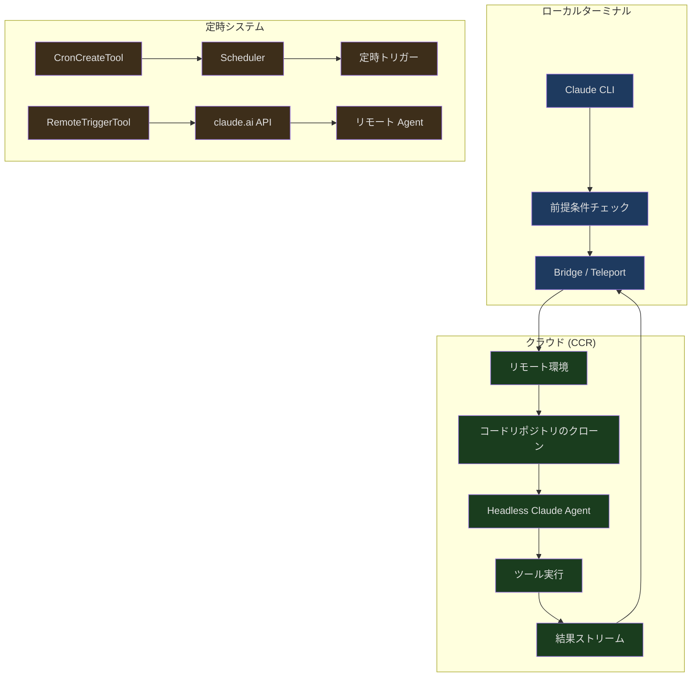
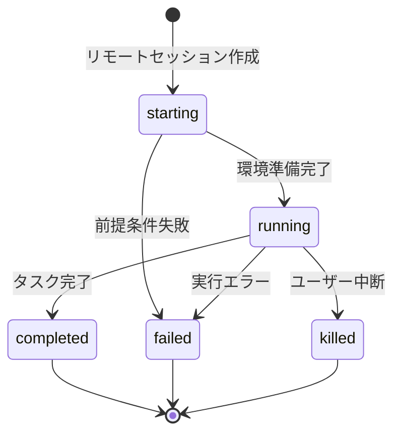
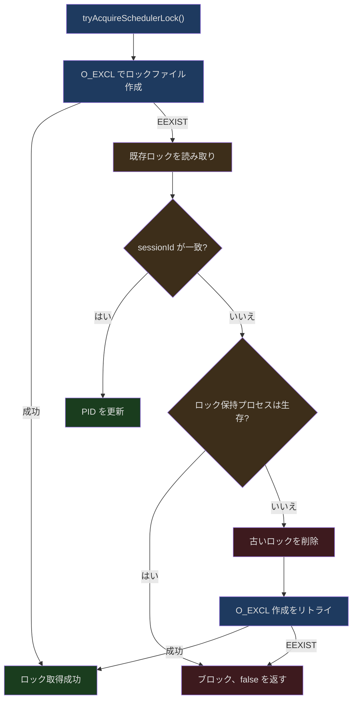
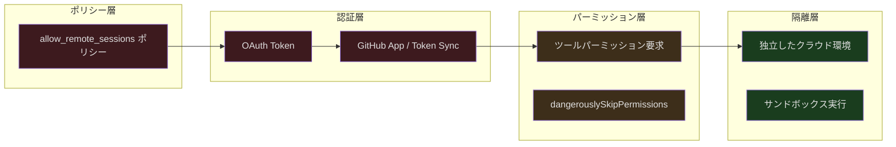

## 導入

開発マシンで Claude Code を使ってバグ修正をしている最中に、外出しなければならなくなったとします。現在のタスクを中断したくありません。Claude をクラウドで作業を続けさせることはできないでしょうか。翌朝戻ってきた時には、Claude に毎日自動で PR のステータスをチェックしてレポートさせたいとも思います。これは SF の話ではなく、Claude Code のリモート実行システムのコア機能です。

従来の CLI ツールはターミナルセッションに紐づいています。ターミナルを閉じるとプロセスは終了します。Claude Code はこの制約を打ち破り、3つの次元のリモート機能を導入しました：

1. **リモートセッション（Remote Session）** — クラウド環境で Claude を実行し、ローカルターミナルはプロキシとして機能
2. **Server モード（Direct Connect）** — WebSocket でリモートの Claude インスタンスに接続
3. **定時トリガー（Cron + RemoteTrigger）** — Claude にスケジュールに従ってタスクを自動実行させる

本記事では、これら3つの次元の設計と実装を詳しく分析します。

---

## リモートセッションのアーキテクチャ概要



---

## リモートセッションの前提条件

リモートセッションは無条件に利用できるわけではありません。システムはリモートセッション作成前に一連の資格チェックを実行し、環境が要件を満たしていることを確認します。これらのチェックは `src/utils/background/remote/preconditions.ts` で定義されています：

```typescript
// src/utils/background/remote/preconditions.ts (第 23-28 行)
export async function checkNeedsClaudeAiLogin(): Promise<boolean> {
  if (!isClaudeAISubscriber()) {
    return false
  }
  return checkAndRefreshOAuthTokenIfNeeded()
}
```

前提条件チェックは並列実行戦略を採用し、`remoteSession.ts` で統一的に協調されます：

```typescript
// src/utils/background/remote/remoteSession.ts (第 58-62 行)
const [needsLogin, hasRemoteEnv, repository] = await Promise.all([
  checkNeedsClaudeAiLogin(),
  checkHasRemoteEnvironment(),
  detectCurrentRepositoryWithHost(),
])
```

このコードは重要な設計パターンである**並列前提条件チェック**を体現しています。3つの独立したチェックが同時に発行されます：

1. **ログイン状態** — OAuth token が有効かどうか
2. **リモート環境** — ユーザーが利用可能なクラウド環境を持っているか
3. **リポジトリ検出** — カレントディレクトリが Git リポジトリ内にあるか、およびリモート情報

### Bundle Seed メカニズム

興味深い最適化として Bundle Seed メカニズムがあります。有効な場合（`CCR_FORCE_BUNDLE` または `CCR_ENABLE_BUNDLE` 環境変数による）、ローカルに `.git/` ディレクトリさえあればよく、GitHub remote も GitHub App も不要です：

```typescript
// src/utils/background/remote/remoteSession.ts (第 75-84 行)
const bundleSeedGateOn =
  !skipBundle &&
  (isEnvTruthy(process.env.CCR_FORCE_BUNDLE) ||
    isEnvTruthy(process.env.CCR_ENABLE_BUNDLE) ||
    (await checkGate_CACHED_OR_BLOCKING('tengu_ccr_bundle_seed_enabled')))

if (!checkIsInGitRepo()) {
  errors.push({ type: 'not_in_git_repo' })
} else if (bundleSeedGateOn) {
  // has .git/, bundle will work — skip remote+app checks
}
```

これにより、ローカルリポジトリ（GitHub remote がない `git init` リポジトリ）でも、Bundle Seed がローカルコードをパッケージ化してクラウドにアップロードでき、CCR（Claude Code Remote）が GitHub からプルする必要がありません。

### リポジトリアクセスの階層化

GitHub からコードをプルする必要があるシナリオでは、システムは階層化されたアクセスチェックを実装しています：

```typescript
// src/utils/background/remote/preconditions.ts (第 222-235 行)
export async function checkRepoForRemoteAccess(
  owner: string,
  repo: string,
): Promise<{ hasAccess: boolean; method: RepoAccessMethod }> {
  if (await checkGithubAppInstalled(owner, repo)) {
    return { hasAccess: true, method: 'github-app' }
  }
  if (
    getFeatureValue_CACHED_MAY_BE_STALE('tengu_cobalt_lantern', false) &&
    (await checkGithubTokenSynced())
  ) {
    return { hasAccess: true, method: 'token-sync' }
  }
  return { hasAccess: false, method: 'none' }
}
```

3つの優先度レベル：
1. **GitHub App** — 最も望ましい方法。リポジトリにインストールされた GitHub App による認可
2. **Token Sync** — `/web-setup` で同期された GitHub token（Feature Flag で制御）
3. **None** — ユーザーがアクセス方法を設定する必要がある

---

## リモートセッションの型システム

リモートセッションには明確な型定義とステートマシンがあります：

```typescript
// src/utils/background/remote/remoteSession.ts (第 17-26 行)
export type BackgroundRemoteSession = {
  id: string
  command: string
  startTime: number
  status: 'starting' | 'running' | 'completed' | 'failed' | 'killed'
  todoList: TodoList
  title: string
  type: 'remote_session'
  log: SDKMessage[]
}
```



セッションは `SDKMessage[]` で完全なメッセージログを記録します。これにより、ローカル接続が切断されても、再接続後に完全な実行履歴を復元できます。

---

## Direct Connect: Server モード

Server モードは別のリモート実行方式です。Teleport でクラウドに新しい環境を作るのではなく、既に Claude Code が実行されているサーバーに接続します。企業のイントラネット環境で特に有用です。

### セッション作成

```typescript
// src/server/createDirectConnectSession.ts (第 26-39 行)
export async function createDirectConnectSession({
  serverUrl,
  authToken,
  cwd,
  dangerouslySkipPermissions,
}: {
  serverUrl: string
  authToken?: string
  cwd: string
  dangerouslySkipPermissions?: boolean
}): Promise<{
  config: DirectConnectConfig
  workDir?: string
}> {
```

作成プロセスは `${serverUrl}/sessions` に POST リクエストを送信し、返される `DirectConnectConfig` には重要な情報が含まれます：

```typescript
// src/server/directConnectManager.ts (第 13-18 行)
export type DirectConnectConfig = {
  serverUrl: string
  sessionId: string
  wsUrl: string
  authToken?: string
}
```

### WebSocket 双方向通信

`DirectConnectSessionManager` は完全な WebSocket 通信プロトコルをカプセル化しています：

```typescript
// src/server/directConnectManager.ts (第 40-46 行)
export class DirectConnectSessionManager {
  private ws: WebSocket | null = null
  private config: DirectConnectConfig
  private callbacks: DirectConnectCallbacks

  constructor(config: DirectConnectConfig, callbacks: DirectConnectCallbacks) {
    this.config = config
    this.callbacks = callbacks
  }
```

メッセージ処理は3つのチャネルに分かれます：

1. **SDK メッセージ** — assistant/result/system などの標準メッセージ。ローカル UI に転送
2. **パーミッション要求** — `control_request` タイプ。ローカルユーザーの確認が必要
3. **フィルタリング対象メッセージ** — keep_alive、streamlined_text などの内部メッセージ。転送しない

```typescript
// src/server/directConnectManager.ts (第 102-113 行)
if (
  parsed.type !== 'control_response' &&
  parsed.type !== 'keep_alive' &&
  parsed.type !== 'control_cancel_request' &&
  parsed.type !== 'streamlined_text' &&
  parsed.type !== 'streamlined_tool_use_summary' &&
  !(parsed.type === 'system' && parsed.subtype === 'post_turn_summary')
) {
  this.callbacks.onMessage(parsed)
}
```

### パーミッション要求と中断

リモート実行におけるパーミッション処理は特に重要です。リモート Agent が危険な操作を実行する必要がある場合、パーミッション要求が WebSocket を通じてローカルに伝達され、ユーザーが判断した後、結果が返送されます：

```typescript
// src/server/directConnectManager.ts (第 144-167 行)
respondToPermissionRequest(
  requestId: string,
  result: RemotePermissionResponse,
): void {
  if (!this.ws || this.ws.readyState !== WebSocket.OPEN) {
    return
  }
  const response = jsonStringify({
    type: 'control_response',
    response: {
      subtype: 'success',
      request_id: requestId,
      response: {
        behavior: result.behavior,
        ...(result.behavior === 'allow'
          ? { updatedInput: result.updatedInput }
          : { message: result.message }),
      },
    },
  })
  this.ws.send(response)
}
```

中断メカニズムも WebSocket を通じて実装されています：

```typescript
// src/server/directConnectManager.ts (第 172-186 行)
sendInterrupt(): void {
  if (!this.ws || this.ws.readyState !== WebSocket.OPEN) {
    return
  }
  const request = jsonStringify({
    type: 'control_request',
    request_id: crypto.randomUUID(),
    request: {
      subtype: 'interrupt',
    },
  })
  this.ws.send(request)
}
```

---

## Cron 定時タスクシステム

Claude Code には完全な Cron スケジューリングシステムが組み込まれており、AI Agent がスケジュールに従ってタスクを自動実行できます。

### タスクストレージ

```typescript
// src/utils/cronTasks.ts (第 30-70 行)
export type CronTask = {
  id: string
  /** 5-field cron string (local time) */
  cron: string
  /** Prompt to enqueue when the task fires. */
  prompt: string
  /** Epoch ms when the task was created. */
  createdAt: number
  /** Epoch ms of the most recent fire. */
  lastFiredAt?: number
  /** When true, the task reschedules after firing. */
  recurring?: boolean
  /** When true, exempt from recurringMaxAgeMs auto-expiry. */
  permanent?: boolean
  /** Runtime-only flag. false → session-scoped. */
  durable?: boolean
  /** Runtime-only. Created by an in-process teammate. */
  agentId?: string
}
```

タスクには2種類の保存方式があります：

| タイプ | 保存場所 | ライフサイクル | 使用シナリオ |
|------|---------|---------|---------|
| **Durable** | `.claude/scheduled_tasks.json` | セッション間で永続化 | ユーザーが CronCreateTool で作成 |
| **Session-only** | プロセスメモリ (bootstrap/state) | プロセス終了と共に消失 | サブ Agent が作成した一時タスク |

### スケジューラーロック

同じプロジェクトディレクトリで複数の Claude セッションが実行されている場合、Cron スケジューラーを駆動するのは1つだけにする必要があります。システムはファイルロックで協調を行います：

```typescript
// src/utils/cronTasksLock.ts (第 111-173 行)
export async function tryAcquireSchedulerLock(
  opts?: SchedulerLockOptions,
): Promise<boolean> {
  const dir = opts?.dir
  const sessionId = opts?.lockIdentity ?? getSessionId()
  const lock: SchedulerLock = {
    sessionId,
    pid: process.pid,
    acquiredAt: Date.now(),
  }

  if (await tryCreateExclusive(lock, dir)) {
    lastBlockedBy = undefined
    registerLockCleanup(opts)
    return true
  }

  const existing = await readLock(dir)
  // 既に自分のもの（冪等）
  if (existing?.sessionId === sessionId) {
    if (existing.pid !== process.pid) {
      await writeFile(getLockPath(dir), jsonStringify(lock))
      registerLockCleanup(opts)
    }
    return true
  }

  // 別のアクティブなセッション — ブロック
  if (existing && isProcessRunning(existing.pid)) {
    return false
  }

  // 古いロック — 削除してリトライ
  await unlink(getLockPath(dir)).catch(() => {})
  if (await tryCreateExclusive(lock, dir)) {
    return true
  }
  return false
}
```

ロックの設計にはいくつかの巧妙な点があります：

1. **O_EXCL アトミック作成** — `'wx'` フラグを使用してロックファイルの作成がアトミック操作であることを保証
2. **PID 活性探知** — `isProcessRunning()` でロック保持プロセスが生存しているか検出
3. **古いロックの回復** — ロック保持プロセスが死んでいる場合、ロックファイルを削除してリトライ
4. **冪等的な再取得** — session ID が一致する場合（`--resume` 後に PID が変わった場合）、PID を更新



### Jitter によるサンダーリングハード（雷群効果）の防止

大量のユーザーが同じ cron 式（例：`0 * * * *`、毎時0分）を設定している場合、すべてのタスクが同時にトリガーされ、推論サービスの負荷スパイクを引き起こします。システムは Jitter メカニズムでトリガー時間を分散させます。

**循環タスクの前方 Jitter：**

```typescript
// src/utils/cronTasks.ts (第 381-398 行)
export function jitteredNextCronRunMs(
  cron: string,
  fromMs: number,
  taskId: string,
  cfg: CronJitterConfig = DEFAULT_CRON_JITTER_CONFIG,
): number | null {
  const t1 = nextCronRunMs(cron, fromMs)
  if (t1 === null) return null
  const t2 = nextCronRunMs(cron, t1)
  if (t2 === null) return t1
  const jitter = Math.min(
    jitterFrac(taskId) * cfg.recurringFrac * (t2 - t1),
    cfg.recurringCapMs,
  )
  return t1 + jitter
}
```

Jitter の計算は task ID のハッシュ値に基づいており、決定論的（同じタスクは毎回同じ遅延を得る）かつ均等に分布しています。デフォルト設定では、1時間間隔の循環タスクは `:00` から `:06` の間に分散してトリガーされます。

**ワンショットタスクの後方 Jitter：**

ワンショットタスク（例：「午後3時にリマインド」）は遅延できません。遅延するとユーザーの期待に反します。しかし、少し早めにトリガーするのは許容できます：

```typescript
// src/utils/cronTasks.ts (第 421-445 行)
export function oneShotJitteredNextCronRunMs(
  cron: string,
  fromMs: number,
  taskId: string,
  cfg: CronJitterConfig = DEFAULT_CRON_JITTER_CONFIG,
): number | null {
  const t1 = nextCronRunMs(cron, fromMs)
  if (t1 === null) return null
  if (new Date(t1).getMinutes() % cfg.oneShotMinuteMod !== 0) return t1
  const lead =
    cfg.oneShotFloorMs +
    jitterFrac(taskId) * (cfg.oneShotMaxMs - cfg.oneShotFloorMs)
  return Math.max(t1 - lead, fromMs)
}
```

正時と30分（`:00` と `:30`）でのみ Jitter が適用されます。人間がこれらの「切りの良い」時間を選ぶ傾向があるためです。デフォルトで最大90秒早くトリガーされます。

### Jitter 設定の運用ダイヤル

```typescript
// src/utils/cronTasks.ts (第 348-355 行)
export const DEFAULT_CRON_JITTER_CONFIG: CronJitterConfig = {
  recurringFrac: 0.1,
  recurringCapMs: 15 * 60 * 1000,      // 15分上限
  oneShotMaxMs: 90 * 1000,              // 90秒の最大前倒し量
  oneShotFloorMs: 0,
  oneShotMinuteMod: 30,                  // :00 と :30 でのみ jitter
  recurringMaxAgeMs: 7 * 24 * 60 * 60 * 1000,  // 7日で自動期限切れ
}
```

これらの設定は GrowthBook の `tengu_kairos_cron_config` でリモート調整が可能です。推論サービスにキャパシティの問題が発生した場合、運用担当者はより積極的な設定をプッシュできます。例えば `oneShotMinuteMod` を 15 に変更し（`:00/:15/:30/:45` をカバー）、`oneShotMaxMs` を 300000（5分）にすることで、負荷を大幅に分散できます。

### 循環タスクの自動期限切れ

循環タスクにはデフォルトで7日間のライフサイクルがあり、クリーンアップを忘れたタスクが無限にリソースを消費するのを防ぎます：

```typescript
// cronTasks.ts コメント
// Recurring tasks auto-expire this many ms after creation (unless marked
// permanent). Cron is the primary driver of multi-day sessions (p99
// uptime 61min → 53h post-#19931), and unbounded recurrence lets Tier-1
// heap leaks compound indefinitely.
```

`permanent` とマークされたタスク（assistant モードの組み込み catch-up/morning-checkin/dream タスクなど）のみが期限切れにならません。

---

## RemoteTrigger ツール

RemoteTriggerTool はもう1つのリモート実行パスです。ローカルスケジューラーを介さず、claude.ai の API を直接呼び出してリモートトリガーを管理します：

```typescript
// src/tools/RemoteTriggerTool/prompt.ts (第 6-15 行)
export const PROMPT = `Call the claude.ai remote-trigger API.
Use this instead of curl — the OAuth token is added automatically
in-process and never exposed.

Actions:
- list: GET /v1/code/triggers
- get: GET /v1/code/triggers/{trigger_id}
- create: POST /v1/code/triggers (requires body)
- update: POST /v1/code/triggers/{trigger_id} (requires body, partial update)
- run: POST /v1/code/triggers/{trigger_id}/run`
```

セキュリティ設計の核心原則は、**OAuth token を決してシェルに公開しない**ことです。ツールはプロセス内で直接認証ヘッダーを追加し、token がコマンドライン引数や環境変数に現れるのを防ぎます。これにより、他のプロセスやログ記録によるキャプチャを回避します。

---

## SDK Headless モード

リモート実行の最も基礎的なレイヤーは SDK の headless モードです。`--input-format stream-json` で起動すると、Claude Code はターミナル UI を起動せず、stdin/stdout を通じて JSON ストリームで通信します。

Direct Connect のメッセージフォーマットは SDK の期待に一致する必要があります：

```typescript
// src/server/directConnectManager.ts (第 131-139 行)
const message = jsonStringify({
  type: 'user',
  message: {
    role: 'user',
    content: content,
  },
  parent_tool_use_id: null,
  session_id: '',
})
```

このフォーマットは `SDKUserMessage` と完全に一致しており、ローカル REPL でもリモート headless インスタンスでも、統一的にメッセージを処理できることを保証しています。

---

## セキュリティモデル

リモート実行は追加のセキュリティ考慮事項をもたらします：



1. **ポリシー制御** — `isPolicyAllowed('allow_remote_sessions')` が最外層で遮断
2. **OAuth 認証** — ユーザー身元の正当性を確認
3. **リポジトリアクセス** — GitHub App または Token Sync の階層チェック
4. **パーミッション代理** — リモート Agent のツール使用は WebSocket を通じてローカルユーザーの確認が必要
5. **環境隔離** — 各リモートセッションは独立した環境で実行

`dangerouslySkipPermissions` オプションは制御された環境（CI/CD など）でのみ使用されます。パーミッションのインタラクションはスキップしますが、セキュリティポリシーはスキップしません。

---

## データフローの完全な経路

リモート実行リクエストの完全なデータフローは以下の通りです：

1. ユーザーがローカルでリモートタスクを開始
2. システムが前提条件を並列チェック（ログイン、環境、リポジトリ）
3. Teleport/Direct Connect で接続を確立
4. リモート Agent がプロンプトを受け取り、実行を開始
5. ツール使用のパーミッション要求が WebSocket でローカルに返送
6. ユーザーが確認後、パーミッション応答がリモートに返送
7. 実行結果が SDK メッセージストリームで返送
8. タスク完了、ステータスが `completed` に更新

Cron タスクの場合、トリガーフローは若干異なります：
1. スケジューラーがロックを取得（単一インスタンスを確保）
2. `.claude/scheduled_tasks.json` の期限到来タスクをチェック
3. Jitter 後の実際のトリガー時間を計算
4. プロンプトをメッセージキューに追加
5. メイン REPL ループ（またはサブ Agent）がキュー内のタスクを処理
6. 循環タスクは `lastFiredAt` を更新して再スケジュール

---

## まとめ

Claude Code のリモート実行システムは、ターミナルツールを分散 AI Agent プラットフォームへ拡張する方法を示しています。核心的な設計思想は以下の通りです：

- **マルチパスのリモート実行** — Teleport（クラウドに新環境）、Direct Connect（既存サーバーに接続）、RemoteTrigger（API トリガー）の3つの独立したパスが異なるシナリオをカバー
- **決定論的 Jitter** — task ID ハッシュに基づく決定論的遅延で、予測可能性を保ちながらサンダーリングハードを回避
- **ファイルロックによる協調** — O_EXCL アトミック作成 + PID 活性探知で、マルチセッションのスケジューラー競合を解決
- **セキュリティの階層化** — ポリシー、認証、パーミッション、隔離の4層防護。リモート実行でもセキュリティ保証は損なわれない
- **運用可制御性** — Jitter 設定、タスク期限切れポリシーなどをリモート設定でリアルタイム調整可能

これらの設計は空想から生まれたものではなく、AI Agent が単機ツールから分散システムへ移行する際に直面しなければならないエンジニアリング課題を解決するものです。
